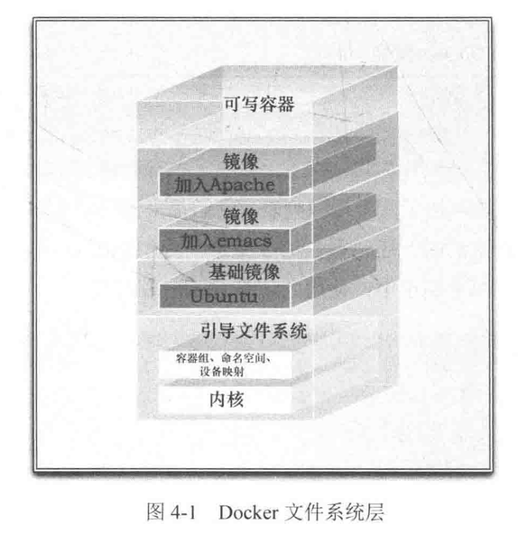

# Docker

客户端：发出请求

服务器：响应请求。提供 命令行工具docker、一套restful api

docker 架构

```
客户端 --> | Docker守护进程 --> Docker容器 |
          ------------------------------
                    Docker 主机
```

Docker 镜像：用户基于镜像来运行自己的容器

Registry：Docker用它来保存用户构建的镜像。分共有和私有2种（类似 github）。

容器：Docker 可以帮用户构建和部署容器。容器基于镜像来启动。

docker程序既能做客户端，也可以做服务器。它向守护进程发送请求，然后再响应请求给守护进程。

## 基本命令

```sh
# 对 docker 的操作
# 查看docker是否正常
docker info
# 启动docker
systemctl docker start
service docker start
# 开机自动启动
systemctl docker enable
# 停止docker
systemctl docker stop
service docker stop
# 获取帮助
docker help
man docker-run

# 对 docker 容器的操作
# 创建和启动docker容器
# -i STDIN开启 -t 分配伪tty终端 使用ubuntu基础镜像（本地没有则从docker hub registry 上获取，并下载到本地） 并在容器里启动bash。
# 格式 docker run 参数 镜像 在容器中执行的命令
docker run -i -t ubuntu /bin/bash
# --name 给容器命名，名字要唯一
docker run --name rainy_docker -i -t ubuntu /bin/bash
# -p 在宿主机上随机打开一个端口，连接到容器的80端口上
docker run -d -p 80 仓库名/镜像名 /bin/bash
docker run -d -p 8080:80 仓库名/镜像名 /bin/bash # 指定宿主机的8080端口，绑定到容器的80端口
docker run -d -p 127.0.0.1::80 仓库名/镜像名 /bin/bash # 绑在宿主机的某ip(127.0.0.1)的随机端口上
docker run -d -P 仓库名/镜像名 /bin/bash # -P 将容器内公开的端口（由EXPOSE命令指定的端口），随机绑到宿主机的端口
docker run -ti -w /var/log ubuntu pwd # -w 设置工作目录
docker run -ti -e "WEB_PORT=8080" ubuntu env # -e 设置环境变量，只在运行时有效。 env 查询容器里的环境变量
docker run -d --name website -v $PWD/website:/var/www/html/website:ro # -v 让宿主机的目录作为卷，挂在在容器内 :ro 容器内目录只读 :rw 可读可写。若容器内目录不存在，则会新建一个
# 创建守护式容器 -d 容器放在后台运行 在容器里打印hello world
docker run --name daemon_dave -d ubuntu /bin/sh -c "while true; do echo hello world; sleep 1; done"
# 自动重启容器，默认不重启
# --restart=always 无条件重启
# --restart=on-failure:5 退出代码非0，自动重启5次，次数可选
docker run --restart=always --name daemon_dave -d ubuntu /bin/sh -c "while true; do echo hello world; sleep 1; done"
# 指定容器所属的网络
docker run -d --net=app --name db rainy/redis
# 链接另一个容器
docker run -ti --link redis[要连接的容器名]:db[别名] rainy/myImage /bin/bash
# 在容器内添加 /etc/hosts 记录
docker run -ti --add-host=docker:10.0.0.1 rainy/myImage /bin/bash
# 以特权模式启动docker，可以在docker里运行docker。会有一些安全风险，容器对宿主机拥有root访问权限。
docker run --privileged -d rainy/myImage

# 退出容器
exit

# 重新启动已停止的容器
docker start [dockername|dockerID]
docker restart [dockername|dockerID]

# 附着到正在运行的容器
docker attach [dockername|dockerID]

# 查看系统中容器列表
docker ps -a
# 查看正在运行的容器
docker ps
# 查看最后一个容器
docker ps -l
# 显示最后x个容器
docker ps -n x

# 在容器内部运行进程
# -d 运行后台进程 -u 指定用户属主
docker exec -d daemon_dave touch /etc/new_config_file
# 运行交互命令
docker exec -t -i daemon_dave /bin/bash

# 修改守护进程监听端口 或套接字
docker daemon -H tcp://0.0.0.0:2375 [...] # 可绑定多个
docker daemon -H unix://home/docker/docker.sock
# 环境变量 明确docker监听的端口
export DOCKER_HOST="tcp://0.0.0.0:2375"
# 守护进程的调试模式
docker daemon -D

# 停止正在运行的容器
docker stop [dockername|dockerID]

# 删除容器
docker rm [dockername|dockerID]
# 删除所有容器 -q 只返回ID -a 所有容器
docker rm `sudo docker ps -a -q`

# 日志
# 查看容器日志，会输出最后几条日志项
docker logs dockername
# 持续输出日志，ctrl + c 退出日志跟踪
docker logs -f dockername
# 最后10行日志
docker logs --tail 10 dockername
# 给日志增加时间戳
docker logs -t dockername
# 启动 syslog，将禁用docker logs命令，并将所有容器的日志都重定向到 syslog
docker run --log-driver="syslog" --name daemon_dwayne -d ubuntu /bin/sh -c "while true; do echo hello world; sleep 1; done"

# 查看容器内的进程
docker top daemon_dave

# 容器统计信息
docker stats [dockername...]

# 容器详细信息
docker inspect dockername
docker inspect --format='{{ .State.Running }} {{.Name}}' [daemon_dave...]
```

容器内的命令

```sh
# 查看本地域名
cat /etc/hosts
# 查看网络配置
ip a
# 查看环境变量
env
```

## docker 镜像和仓库

docker 镜像由文件系统叠加而成，最底端是一个引导文件系统bootfs。第二层是root文件系统rootfs，永远是只读。

当一个容器启动后，它会被移到内存中，而引导文件系统会被卸载。

Docker利用联合加载技术，可以在rootfs上加载更多文件系统。这样的文件系统成为镜像。一个镜像可以放在另一个镜像的顶部。位于下面的镜像称为父镜像。位于最底部的称为基础镜像。当一个镜像启动容器时，Docker 会在该镜像的最顶层加载一个读写文件系统。



当 docker 第一次启动一个容器时，初始的读写层是空的。如果想修改一个文件，这个文件首先会从该读写层下面的只读层复制到该读写层。该文件的只读版本依然存在，但是已经被读写层中的该文件副本所隐藏。这种机制称为 写时复制(copy on write)

Docker Hub 中有两种仓库

- 顶层仓库 top-level repository：由Docker内部的人管理。仓库名：只包含仓库名，如 ubuntu 仓库。
- 用户仓库 user repository：由用户创建。仓库名：包含用户名和仓库名，如 rainy/myrepository

```sh
# 对镜像的操作
# 列出本地镜像
docker images [仓库名]
# docker 本地镜像的存储目录
/var/lib/docker

# 拉远端镜像 ubuntu是仓库 12.04是tag。同一个仓库可以存储多个镜像，一个镜像可以有多个标签
docker pull ubuntu:12.04
docker pull ubuntu # 等价于 docker pull ubuntu:latest

# 在Docker Hub 查找带有puppet的镜像
docker search puppet

# 构建镜像（基于已有镜像）
# 在容器内做更新后，提交该更新。类似git的提交一个commit
docker commit [容器ID] rainy/myImage
# -m 指定提交信息 -a 指定作者信息
docker commit -m "A new custom image" -a "James" [容器ID] rainy/myImage:标签名


# 查看镜像的构建过程
docker history [镜像ID]
# 查看容器的映射端口
docker port [镜像ID|容器名] 80

# 删除镜像（删本地）
docker rmi [仓库名/镜像名 ...]
# 删除所有镜像
docker rmi `docker images -a -q`

# 登录到Docker hub
docker login
# 退出登录
docker logout
# 推送镜像到 Docker Hub
docker push rainy/myImage

# 从容器运行 registry
docker run -p 5000:5000 registry:2
```

用 Dockerfile 构建镜像

Dockerfile 文件

```sh
# 命令大写 第一行都是FROM 构建基础镜像
FROM ubuntu:14.04
# 告知 作者 邮箱
MAINTAINER rainy "rainy@email.com"
# RUN 在当前镜像中运行指定的命令，默认在Shell里，使用命令包装器 /bin/sh -c .每条RUN命令都会创建一个新的镜像层。
RUN echo 'Hi, docker' > /usr/share/nginx/html/index.html
# exec 格式的RUN命令
RUN ["apt-get", "install", "-y", "nginx"]
# 设置环境变量，REFRESHED_AT = 2021-10-06。更改 REFRESHED_AT 的值，构造镜像时后面的指令就不会再使用缓存了，因为这条指令的值改变了。
ENV REFRESHED_AT 2021-10-06
# EXPOSE 容器内的应用程序将会使用容器指定的端口。不会自动打开，需要在docker run运行容器时指定
EXPOSE 80
# CMD 命令指定容器被启动时要运行的命令，只能有一条。会被docker run指定的命令覆盖
CMD ["/bin/bash", "-l"]
# ENTRYPOINT 不会被 docker run 覆盖，docker run的指令会变成参数，传给 ENTRYPOINT。可以在运行 docker run 时，用 --entrypoint 标志覆盖
ENTRYPOINT ["/usr/sbin/nginx", "-g", "daemon off"]
# 设置工作目录，有点像 cd 到这个目录下。可以在运行时，用 -w 覆盖工作目录
WORKDIR /opt/webapp/db
# 设置环境变量 使用变量 $RVM_PATH 会被保存在从镜像创建的任何容器中。可以在运行时，用 -e 来设置
ENV RVM_PATH /home/rvm/
# 设置运行时的用户。可以在运行时，用 -u 来覆盖，默认值root
USER dbadmin
USER user:group
# 给容器加卷，卷可以在容器间共享，对卷的修改是立即生效的。为镜像创建一个名为/opt/project的挂载点。提交或创建镜像时，卷不包含在镜像里。
VOLUME ["/opt/project", "data"]
# 将构建环境下的文件和目录复制到镜像中 以/结尾，表示是目录；添加压缩文件，会解压
ADD software.lic[当前目录] /opt/application/software.lic[镜像中的目录]
# 和ADD类似，但只复制，不解压。UID 和 GID 会被设置成 0
COPY conf.d/ /etc/apache2/
# 为Docker镜像添加元数据
LABEL version="1.0" type="Data Center"
# 设置停止容器时发送什么系统调用信号给容器
STOPSIGNAL

# 定义可以在 docker build 命令运行时传递给构建运行时的变量。用 --build-arg 标志。只能指定 Dockerfile 中定义过的参数
ARG build
ARG webapp_user=user
docker build --build-arg build=12345 -t rainy/test_image . # build 变量将被设置为12345，webapp_user变量将继承默认值为user
# 为镜像添加触发器。当某镜像被当做基础镜像时，触发器会在 FROM 之后执行。触发器可以是任何构建指令
ONBUILD ADD . /app/src
```

构建镜像

```sh
# 使用dockerfile构建镜像，最后一个参数指向本地目录下的Dockerfile文件的路径
docker build -t="[仓库名/镜像名:标签名]" .
# 从git仓库找Dockerfile
docker build -t="[仓库名/镜像名]" git@github.com:用户名/仓库
# 每一步的构建过程都会将结果提交为镜像。这些镜像被当成缓存。--no-cache 略过缓存
docker build --no-cache -t="仓库名/镜像名]" .
```

## Docker 网络

内部连网

在安装Docker时，会创建一个新的网络接口，名字是Docker0。每个Docker容器都会在这个接口上分配一个ip地址。

接口 docker0 是一个虚拟的以太网桥。Docker 每创建一个容器，就会创建一组互联的网络接口。这组接口其中一端作为容器的eth0接口，另一端统一命名为类似vethec6a，作为宿主机的一个端口。通过把每个 `veth*` 接口帮到docker0网桥，Docker创建了一个虚拟子网，子网内有宿主机和所有Docker容器。

```sh
# 在宿主机上执行，可以看到docker容器的网关ip
ip a show docker0
# 在容器上执行，可以看到容器的ip
ip a show eth0
traceroute google.com # 查看途径的路由器，可以看到网关ip是宿主机上查的ip

# Docker 的 iptables 和 NAT 配置
iptables -t nat -L -n
```

Docker Networking

容器可以跨越不同的宿主机来通信。

在某网络内部启动的容器，Docker 将会感知到所有在这个网络下运行的容器，并通过 /etc/hosts 文件将这些容器的地址保存到本地 DNS 中（rainy：实际操作时，没有生成域名，为什么？）。

```sh
# 创建docker网络
docker network create app
# 查看新创建的网络
docker network inspect
# 列出当前系统中的所有网络
docker network ls
# 删除一条 docker 网络
docker network rm app
# 将正在运行的容器添加到网络
docker network connect app db2
# 断开容器与指定网络的连接
docker network disconnect app db2
```

Docker 链接

仅在 1.9 版本前推荐使用。

把容器链接在一起，可以让客户容器直接访问任意服务的公开端口。无法链接到不同宿主机的容器。

链接成功后，会自动创建一些环境变量，比如：子容器的名字，容器里运行的服务所使用的协议、ip、端口。

## 持续集成

Jenkins 作业的 Docker shell 脚本

```sh
# 镜像
IMAGE=$(docker build . | tail -l | awk '{print $NF}')
# 卷
MNT="$WORKSPACE/.."
# 运行docker，获得容器id
CONTAINER=$(docker run -d -v "$MNT:/opt/project" $IMAGE /bin/bash -c 'cd /opt/project/workspace && rake spec')

docker attach $CONTAINER
# 容器退出后，得到返回码
RC=$(docker wait $CONTAINER)

docker rm $CONTAINER

exit $RC
```

## Docker 编配和服务发现

Docker Compose

用 docker-compose.yaml 文件定义一组要启动的容器，以及容器运行时的属性。之后执行 docker-compose up 命令后，Compose 会使用指定参数来执行，并将日志输出合并到一起。

docker-compose.yaml

共有2个启动服务：web和redis。image指定了要使用的镜像，或者使用build用指定目录下的Dockerfile构建镜像。command 指定服务启动时要执行的命令。ports指定要映射的端口（主机端口：容器端口）。volumes指定要映射的卷（主机目录：容器目录）。links连接到其他服务。

同样效果的命令 `docker run -d -p 5000:5000 -v .:/composeapp --link redis:redis --name web rainy/myImage python app.py`

```yaml
web:
    image: rainy/myImage
    command: python app.py
    ports:
        - "5000:5000"
    volumes:
        - .:/composeapp
    links:
        - redis
redis:
    build: /home/rainy/redisImage
```

compose 命令

```sh
# 启动 docker-compose.xml 里定义的容器
docker-compose up
# 以守护进程的模式来运行
docker-compose up -d
# 查看服务运行状态
docker-compose ps
# 帮助
docker-compose help
# 日志
docker-compose logs
# 停止所有服务
docker-compose stop
# 强制杀死服务
docker-compose kill
# 重新启动
docker-compose start
# 删除服务
docker-compose rm
```


