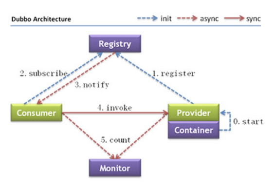

# Dubbo

[官方参考文档](http://dubbo.apache.org/zh-cn/docs/user/quick-start.html)

[github地址](https://github.com/apache/dubbo)

[dubbo-admin git地址](https://github.com/apache/dubbo-admin)

作用

1. 使用注册中心，动态注册和发现服务，为消费方提供服务提供方地址列表
2. 自动画出应用间的依赖关系图，帮助架构师理清关系
3. 服务容量规划？

架构



角色说明

|节点|角色说明|
|---|---|
|Provider|暴露服务的服务提供方|
|Consumer|调用远程服务的服务消费方|
|Registry|服务注册与发现的注册中心|
|Monitor|统计服务的调用次数和调用时间的监控中心|
|Container|服务运行容器|

用法

Dubbo 基于 Spring 的 Schema 扩展进行加载。

## 入门程序

provider.xml示例

```xml
<beans xmlns:xsi="http://www.w3.org/2001/XMLSchema-instance"
       xmlns:dubbo="http://dubbo.apache.org/schema/dubbo"
       xmlns="http://www.springframework.org/schema/beans"
       xsi:schemaLocation="http://www.springframework.org/schema/beans http://www.springframework.org/schema/beans/spring-beans.xsd
       http://dubbo.apache.org/schema/dubbo http://dubbo.apache.org/schema/dubbo/dubbo.xsd">
    
    <!-- 注入本地服务的bean -->
    <bean id="demoService" class="org.apache.dubbo.samples.basic.impl.DemoServiceImpl"/>

    <!-- 提供方应用信息，用于计算依赖关系 -->
    <dubbo:application name="demo-provider"/>
    <!-- 注册中心地址 -->
    <dubbo:registry address="zookeeper://127.0.0.1:2181"/>
    <dubbo:protocol name="dubbo" port="20890"/>
    <!-- 暴露本地服务，注册到管理中心 -->
    <dubbo:service interface="org.apache.dubbo.samples.basic.api.DemoService" ref="demoService"/>
</beans>
```

consumer.xml示例

```xml
<beans xmlns:xsi="http://www.w3.org/2001/XMLSchema-instance"
       xmlns:dubbo="http://dubbo.apache.org/schema/dubbo"
       xmlns="http://www.springframework.org/schema/beans"
       xsi:schemaLocation="http://www.springframework.org/schema/beans http://www.springframework.org/schema/beans/spring-beans.xsd
       http://dubbo.apache.org/schema/dubbo http://dubbo.apache.org/schema/dubbo/dubbo.xsd">
    
    <dubbo:application name="demo-consumer"/>
    <dubbo:registry group="aaa" address="zookeeper://127.0.0.1:2181"/>
    <!-- 引用远程服务，timeout是超时时间 -->
    <dubbo:reference id="demoService" check="false" interface="org.apache.dubbo.samples.basic.api.DemoService" timeout="300000"/>
    
    <!-- 和本地服务一样使用远程服务 -->
    <bean id="xxxAction" class="com.xxx.XxxAction"> 
        <property name="xxxService" ref="demoService" />
    </bean>
</beans>
```

## 监控中心

dubbo-admin.war

如果监控中心和注册中心不在同一个服务器，需要修改配置文件

```
// dubbo-admin/WEB-INF/dubbo.properties
// 注册中心的地址
dubbo.registry.address=zookeeper://127.0.0.1:2181
// root用户密码
dubbo.admin.root.password=root
dubbo.admin.guest.password=guest
```
