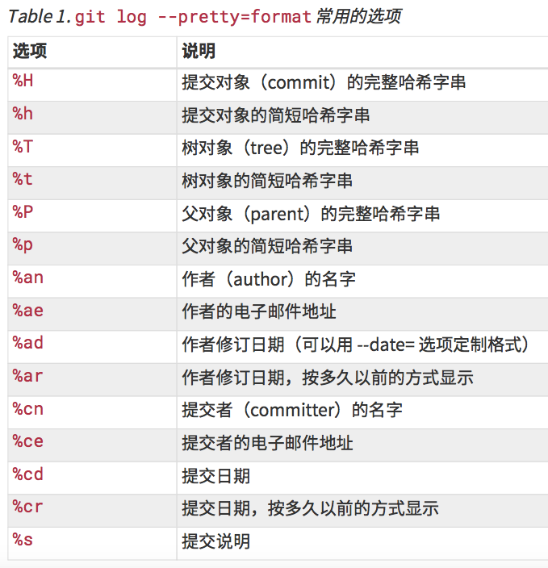
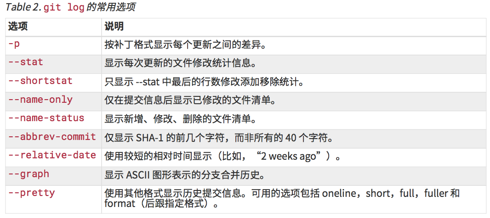
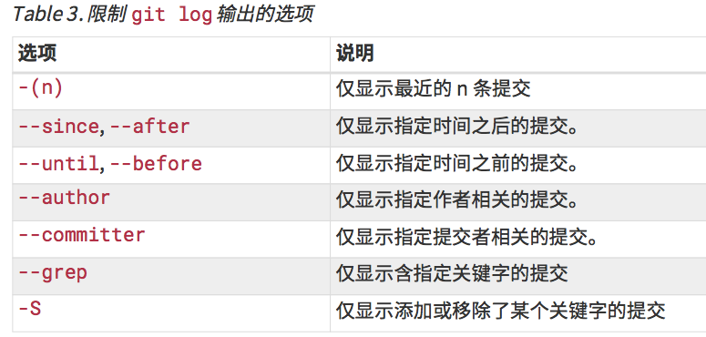
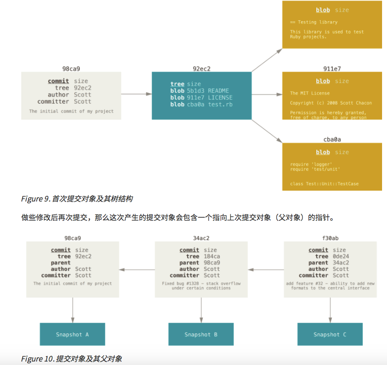
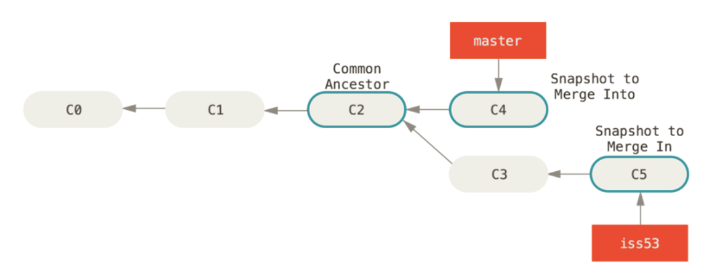
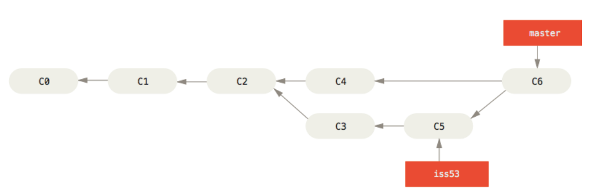
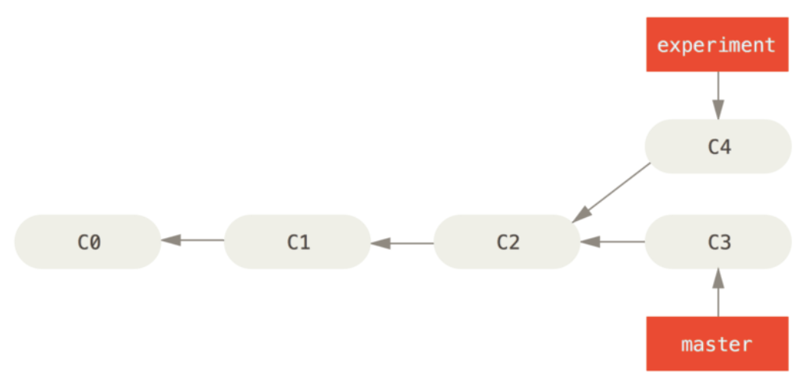
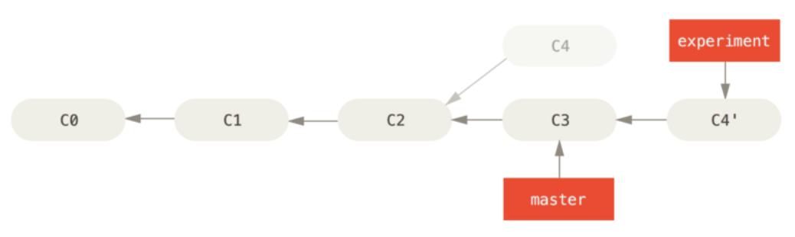

# Git

Git是分布式版本控制系统，客户端并不只提取最新版本的文件快照，而是把代码仓库完整地镜像下来。 这么一来，任何一处协同工作用的服务器发生故障，事后都可以用任何一个镜像出来的本地仓库恢复。

Git 有三种状态

- 已提交(committed) 数据已保存在本地数据库中
- 已修改(modified) 修改了文件，但还没保存到数据库中
- 已暂存(staged) 对一个已修改文件的当前版本做了标记，使之包含在下次提交的快照中。

Git 项目的三个工作区

- Git 仓库：保存项目的元数据和对象数据库
- 工作目录：对项目的某个版本独立提取出来的内容。 这些从 Git 仓库的压缩数据库中提取出来的文件，放在磁盘上供你使用或修改。
- 暂存区域：是一个文件，保存了下次将提交的文件列表信息，一般在 Git 仓库目录中。


基本的 Git 工作流程如下

1. 在工作目录中修改文件。
2. 暂存文件，将文件的快照放入暂存区域。
3. 提交更新，找到暂存区域的文件，将快照永久性存储到 Git 仓库目录。

## 安装和配置

见[《progit》]()起步-安装git-p15

常用命令

```sh
# 列出所有Git当时能找到的配置
git config --list
# 来检查 Git 的某一项配置
git config <key>
# 获取帮助
git help <verb>
git <verb> --help
man git-<verb>
```

## Git 基础

### 获取Git仓库

1. 在现有项目或目录下导入所有文件到 Git 中

```sh
# 进入该项目目录，然后
git init
# 跟踪文件
git add *.c
# 提交文件
git commit -m 'initial project version'
```

2. 从一个服务器克隆一个现有的 Git 仓库。

Git 克隆的是该 Git 仓库服务器上的几乎所有数据。默认配置下远程 Git 仓库中的每一个文件的每一个版本都将被拉取下来。

```sh
# 克隆一个已有的仓库，使用原仓库名
git clone [url]
# 克隆一个已有的仓库，使用 mygit 作为仓库名
git clone [url] mygit
git clone -o mygit [url]
```

### 记录更新到仓库

工作目录下的每一个文件有两种状态

- 已跟踪：被纳入了版本控制的文件，在上一次快照中有它们的记录。这些文件可能：未修改、已修改、已暂存。
- 未跟踪：既不存在于上次快照的记录中，也没有放入暂存区。Git 不会对未跟踪文件进行版本管理。


```sh
# 检查当前文件状态
git status
# 简略版本的状态。结果有3列：暂存区状态、工作区状态、文件名。状态有：M修改、A添加、?未跟踪
git status -s
# 跟踪一个目录或文件，或把已跟踪的文件放到暂存区。即，添加内容到下一次提交中
git add pathOrFileName
# 比较工作目录中当前文件和暂存区域快照之间的差异
git diff
# 比较已暂存的和Git仓库中的文件的差异
git diff --cached
git diff --staged (1.6.1+)
# 提交更新(会启动文本编辑器以输入本次提交的说明)
git commit
git commit -v # 将diff信息放到提交说明里
git commit -m "Commit Message" # 将提交信息放在命令行里
# 跳过使用暂存区域。把所有已经跟踪过的文件暂存 起来一并提交
git commit -a
# 删除文件，连带从工作目录中删除（需要先删除文件）
git rm PROJECTS.md
git rm -f PROJECTS.md # 删除前已修改过文件并放在了暂存区，需要 -f 强制删除
# 不再跟踪已跟踪的文件(之后仍然需要将文件放到.gitignore中)
git rm --cached README
# 对文件改名
git mv file_from file_to
```

.gitignore 文件包含了要忽略的文件列表。规范如下

- 所有空行或者以 # 开头的行都会被 Git 忽略。
- 可以使用标准的 glob 模式匹配。
- 匹配模式可以以(/)开头防止递归。
- 匹配模式可以以(/)结尾指定目录。
- 要忽略指定模式以外的文件或目录，可以在模式前加上惊叹号(!)取反。

glob 模式规则

- 星号(`*`)匹配零个或多个任意字符
- [abc] 匹配任何一个列在方括号中的字符
- 问号(?)只匹配一个任意字符
- [a-z] 字符间加(-)，匹配所有在这两个字符范围内的字符
- 使用两个星号(`*`)表示匹配任意中间目录，比如 `a/**/z` 可以匹配 `a/z`, `a/b/z` 或 `a/b/c/z` 等。

### 查看提交历史

```sh
# 查看提交历史
git log
git log -p -2 # -p 显示每次提交的内容差异 -2 仅显示最近2次提交
git log --stat # 每次提交的简略统计信息
git log --pretty=[oneline, short, full, fuller] # 提交历史的展示格式
git log --pretty=format:"%h - %an, %ar : %s"
git log --pretty=format:"%h %s" --graph # 展示合并历史
# 限制输出长度
git log --since=2.weeks # 列出所有最近两周内的提交
git log --author # 显示指定作者的提交
git log --grep # 搜索提交说明中的关键字 --all-match 求交集，默认是并集
git log -Sfunction_name # 列出添加或移除了某些字符串的提交
git log -- myfile # 只关注某文件或某目录的提交
git log --pretty="%h - %s" --author=gitster --since="2008-10-01" --before="2008-11-01" --no-merges -- t/
```

`git log --pretty=format` 常用的选项



git-log常用选项



限制git-log输出的选项



### 撤销操作

```sh
# 尝试重新提交，会将暂存区中的文件提交。将取代上一次提交的结果
git commit --amend
# 取消暂存
git reset HEAD <file>...
# 撤消对文件的修改
git checkout -- <file>...
```

### 远程仓库的使用

```sh
# 查看远程仓库服务器的名字
git remote
git remote -v # 显示远程仓库地址
# 添加远程仓库
git remote add <shortname> <url> # shortname 可以代替 url
# 从远程仓库中获得数据
git fetch [remote-name]
git pull # 自动的抓取然后合并远程分支到当前分支
# 推送到远程仓库
git push [remote-name] [branch- name]
# 查看远程仓库
git remote show [remote-name]
# 重命名
git remote rename [old-remote-name] [new-remote-name]
# 移除一个远程仓库
git remote rm [remote-name]
```

### 打标签

Git 使用两种主要类型的标签

- 轻量标签(lightweight)：是一个特定提交的引用，本质上是将提交校验和存储到一个文件中。
- 附注标签(annotated)：存储在 Git 数据库中的一个完整对象。

```sh
# 列出标签
git tag
git tag -l 'v1.8.5*' # 查找标签
# 创建附注标签
git tag -a [tagName] -m 'tagMessage'
# 创建轻量标签
git tag [tagName]
# 查看标签信息
git show [tagName]
# 后期打标签
git tag -a [tagName] [7位校验和]
# 共享标签，传送标签到远程仓库服务器上
git push [remote-name] [tagname]
git push [remote-name] --tags # 上传所有不在远程服务器上的标签
# 删除本地标签
git tag -d <tagname>
git push <remote> :refs/tags/<tagname> # 更新远程仓库上的标签
# 查看某个标签所指向的文件版本
git checkout [tagname]
```

### Git 别名

```sh
# 为命令设置别名（将co替换成checkout）
git config --global alias.co checkout
git config --global alias.unstage 'reset HEAD --'
git config --global alias.last 'log -1 HEAD'
git config --global alias.visual '!gitk'
```

## Git 分支

暂存操作

1. 为每一个文件计算校验和
2. 把当前版本的文件快照保存到 Git 仓库中(Git 使用 blob 对象来保存它们)
3. 将校验和加入到暂存区域等待提交

提交操作

1. 计算每一个子目录的校验和
2. 在 Git 仓库中，这些校验和保存为树对象。
3. Git 创建一个提交对象

提交对象包括

- 作者的姓名和邮箱
- 提交时输入的信息
- 指向它的父对象的指针（可能有多个）
- 指向文件目录的树对象的指针
    - 一个或多个指向暂存内容快照的指针



Git 的分支，本质上是指向提交对象的可变指针。Git 的默认分支名字是 master。

HEAD指针，指向当前所在的本地分支。

```sh
# 分支创建（只是创建了一个可以移动的指针）
git branch [branch-name]
# 查看分支指向的提交对象(decorate可以省略)
git log --oneline --decorate
# 分支切换(工作目录恢复成branch-name分支所指向的快照内容)
git checkout [branch-name]
# 查看分叉历史
git log --oneline --decorate --graph --all
```

## 分支的新建与合并

```sh
# 创建并切换分支
git checkout -b [branch-name]
# 相当于
git branch [branch-name]
git checkout [branch-name]
# 在当前分支上合并[branch-name]的内容
git merge [branch-name]
# 删除分支
git branch -d [branch-name]
git branch -D [branch-name] # 强制删除
```

如果被合并的分支A指向的提交，是当前 master 分支指向的提交的直接上游，Git 只是简单的将指针向前移动，提示里会出现"快进(fast-forward)"这个词。





如果对同一个文件做了修改，分支会合并失败，需要使用git status查看产生冲突的文件。需要手动修改文件，放到暂存区，再提交。

### 分支管理

```sh
# 查看所有分支
git branch
git branch -v # 每个分支的最后一次提交
git branch --merged(--no-merged) # 已经合并(尚未合并)到当前分支的分支
```

### 远程分支

远程跟踪分支是远程分支状态的引用。以 (remote-name)/(branch-name) 形式命名。

从一个远程跟踪分支检出一个本地分支会自动创建一个叫做“跟踪分支”。

```sh
# 远程仓库的信息
git ls-remote [remote-name]
git remote show [remote-name]
# 同步更新到远程仓库
# 1. 更新本地数据库，移动 origin/master 指针指向新的、更新后的位置。
git fetch [remote-name]
# 2. 推送
git push [remote-name] [branch-name]
git push origin serverfix:awesomebranch # 将本地serverfix分支推送到远程awesomebranch分支上
# 避免每次输入密码
git config --global credential.helper cache
# 创建跟踪分支
git checkout -b [branch] [remotename]/[branch]
git checkout -b serverfix origin/serverfix
git checkout -b sf origin/serverfix # 将跟踪分支命名为sf
git checkout --track origin/serverfix # 快捷方式
git branch -u origin/serverfix # 将当前分支设置为跟踪分支
# 当设置好跟踪分支后，可以通过 @{upstream} 或 @{u} 快捷方式来引用它。
# 查看设置的所有跟踪分支
git branch -vv
# 从服务器上抓取本地没有的数据时，它并不会修改工作目录中的内容，只会获取数据然后让你自己合并。
git fetch
# 获取并自动合并
git pull
# 删除远程分支
git push origin --delete serverfix
```

-u --set-upstream的简写

### 变基

在 Git 中整合来自不同分支的修改主要有两种方法

- merge
- rebase 将提交到某一分支上的所有修改都移至另一分支上

```sh
# 一次简单的变基合并操作
git checkout experiment
git rebase master # 将 experiment 分支上的修改，应用到 master 分支上
git checkout master
git merge experiment # 进行一次快速合并
# 将在client分支里但不在server分支里的修改，应用到master分支上
git rebase --onto master server client
# 将server分支上的修改，应用到master分支上（不需要再切换分支了）
git rebase master server
```





不要对在你的仓库外有副本的分支执行变基。

## 分布式 Git

```sh
# 检查是否有空白错误
git diff --check
# 拉取请求
git request-pull
# 应用补丁
git apply /tmp/patch-ruby-client.patch
```

## GitHub

## Git 工具

提交区间

```sh
# 双点
git log master..experiment # 在experiment中但不在master中的分支
git log origin/master..HEAD
# 多点，以下命令等价
git log refA..refB
git log ^refA refB
git log refB --not refA
# 三点
git log master...experiment # 不是 master 和 experiment 共有的提交
git log --left-right master...experiment
```

交互式暂存

```sh
# 进入交互式终端模式
git add -i(--interactive)
```

储藏与清理

```sh
# 储藏工作
git stash
git stash save
# 查看存储的工作
git stash list
# 应用存储的工作
git stash apply
# 应用时，将原来已暂存的文件暂存
git stash apply --index
# 移除储藏
git stash drop
# 应用并移除储藏
git stash pop
# 只存储工作区的改动，暂存区保持不变
git stash --keep-index
# 存储所有文件，包括未跟踪文件
git stash -u(--include-untracked)
# 交互式的选择需要储藏的文件
git stash --patch
```


git status中，中文显示不正确

解决方案：git config --global core.quotepath false

[git中文显示不对的stackoverflow上的解释](https://stackoverflow.com/questions/22827239/how-to-make-git-properly-display-utf-8-encoded-pathnames-in-the-console-window)


## Eclipse上使用Git

Eclipse 的git插件 --- Window > Open Perspective > Other...， 然后选择 “Git”

帮助文档 --- Help > Help Contents 选择 “EGit Documentation” 节点

## 待整理

撤销中间的某次commit

```sh
git revert 100047dcc
```

[git 优雅的撤销中间某次提交](https://blog.csdn.net/u013066244/article/details/79920012)

## 参考资料

[ProGit](https://git-scm.com/book/en/v2)

git

eclipse --> team --> share --> git

eclipse --> team --> commit

preferences --> team --> git --> configuration --> add Entry

eclipse --> team --> push

clone

push & pull

