# JVM

由4部分组成

1. 类加载器。将class加载到JVM中
2. 执行引擎。执行class文件中的字节码指令，相当于CPU
3. 内存区。将内存划分成若干个区，模拟实际机器上的存储、记录、调度功能模块。相当于实际机器上的寄存器、PC计数器等
4. 本地方法调用。调用C或C++实现的本地方法的代码返回结果。

## 走近Java

虚拟机：

- Sun Classic
- Exact VM：可以知道内存中的数据含义，如一个32bit内存中的数据，是地址，还是整数
- HotSpot VM：准确式内存、热点代码探测
- J9：IBM的
- Dalvik：Android平台早期虚拟机

编译jdk的实验

1. 获取openJDK源码：http://hg.openjdk.java.net/jdk7u/jdk7u (git上有吗？)或，下载打包好的源码：http://jdk7.java.net/source.html
2. 阅读 README-builds.html 文档

跟踪Java代码在虚拟机中是如何执行的

```sh
java xxx -XX:+TraceBytecodes -XX:StopInterpreterAt=<n> # 在遇到序列号为n的字节码指令时，中断程序执行，进入断点调试。
```

## Java内存区域与内存溢出异常

运行时数据区

JVM 把自己管理的内存，划分成若干个不同的数据区域。有的区域随着虚拟机进程的启动而一直存在，有的则依赖用户线程的启动和结束而创建和销毁。

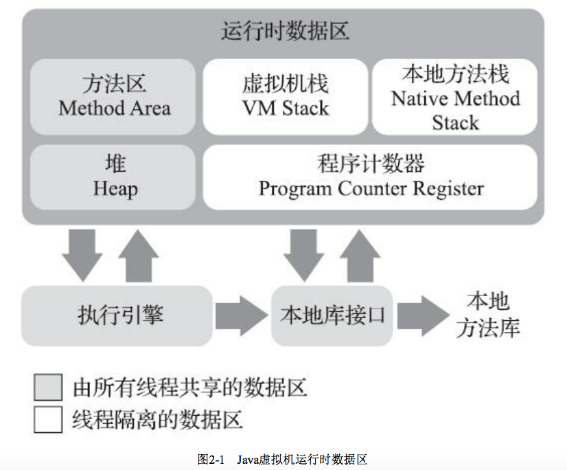

- 方法区 Method Area
- 虚拟机栈 VM Stack
- 本地方法栈 Native Method Stack
- 堆 Heap
- 程序计数器 Program Counter Register

程序计数器

1. 当前线程所执行的字节码的行号指示器，指向虚拟机字节码指令的地址。
2. 每条线程有一个独立的程序计数器，即，线程私有。
3. 执行Native方法，计数器值为空
4. 没有OutOfMemoryError

Java 虚拟机栈

1. 线程私有，生命周期与线程相同。
2. 描述Java方法执行的线程内存模型。每个Java方法被执行的同时，虚拟机都会创建一个栈帧(Stack Frame)，栈帧中的内容如下。每个方法从调用到执行完毕的过程，就对应着一个栈帧在虚拟机栈中入栈到出栈到过程。
    1. 局部变量表
    2. 操作数栈
    3. 动态链接
    4. 方法出口等。
3. 局部变量表中存储的是编译期可知的变量，有以下3种，以局部变量槽（Slot）来表示。表的大小在编译期确定。long 和 double 占2个槽，其他占1个
    1. 各种基本数据类型
    2. 对象引用
    3. returnAddress类型(指向了一条字节码指令的地址)
4. 有两类异常
    1. StackOverflowError：线程请求的栈深度大于虚拟机允许的深度。
    2. OutOfMemoryError：虚拟机支持动态扩展，且扩展时无法申请到足够内存。（HotSpot不支持栈容量动态扩展）

rainy：存的是数据，还是数据类型？


本地方法栈

1. 与虚拟机栈类似，为虚拟机使用到的 Native 方法服务。

Java 堆

1. 被所有线程共享，虚拟机启动时创建。
2. 用来存放对象实例。
3. 是垃圾收集器管理的内存区域。
4. 可以划分出多个线程私有的分配缓冲区（Thread Local Allocation Buffer，TLAB），以提升对象分配时的效率。
5. 可以处于物理上不连续的内存空间中，只要逻辑上是连续的即可。
6. 大小可固定，可扩展（通过 -Xmx 和 -Xms 设定）。
7. 有 OutOfMemoryError，当堆没有内存，且无法扩展时。

方法区

1. 各个线程共享的内存区域
2. 用于存储已被虚拟机加载的
    1. 类信息
    2. 常量
    3. 静态变量
    4. 即时编译器编译后的代码缓存。
3. JDK8+，在本地内存中实现元空间（Metaspace）来存储。
4. 不需要连续的内存。
5. 可以选择固定大小或者可扩展。
6. 会抛出 OutOfMemoryError

运行时常量池(Runtime Constant Pool)

1. 是方法区的一部分。
2. 内容=Class文件中的常量池表（Constant Pool Table），存放编译期生成的各种字面量和符号引用。还会把符号引用翻译出来的直接引用存放在里面。
3. 与Class文件常量池表不同的是，具备动态性，运行期间也可以将新的常量放入池中。
4. 会抛出 OutOfMemoryError

直接内存(Direct Memory)

1. 不是虚拟机运行时数据区的一部分。
2. 会抛出 OutOfMemoryError
3. 内存的分配不受Java堆大小的限制，但是是本机内存的一部分。

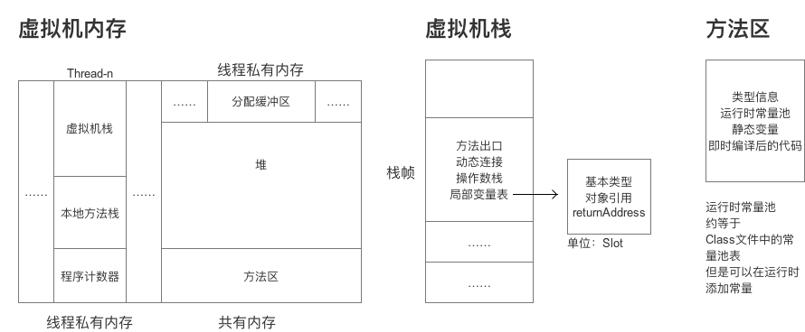

### HotSpot 虚拟机对象

对象的创建

0. 遇到new指令，检查指令的参数能否在常量池中定位到一个类的符号引用，检查对应的类是否加载、解析、初始化。
1. 加载类
2. 为对象分配内存，所需内存在加载类后即可确定。
    1. 分配内存的方式，有2种方式
        1. 指针碰撞 Bump The Pointer（空闲空间是连续的），直接移动指向空闲空间末尾的指针
        2. 空闲列表 Free List（空闲空间不连续），记录空闲空间的位置，筛选分配
    2. 分配内存时，保证线程安全的方式
        1. CAS + 失败重试
        2. 每个线程在Java堆中预先分配一小块内存（本地线程分配缓冲 Thread Local Allocation Buffer, TLAB），缓冲区用完后，分配新的缓冲区，再使用同步锁定。
3. 初始化分配的内存空间，置0（保证了对象的属性可以不赋值就能使用，因为已经赋值成0了）
4. 对对象进行设置，将对象信息存在对象头 Object Header 中
5. 执行init方法，初始化对象（构造函数）

对象的内存布局

1. 对象头 Header，分为2部分内容
    1. 存储对象自身的运行时数据，如：HashCode、GC分代年龄、锁状态标志、持有的锁等。长度为32byte或64byte，被称为Mark Word，是动态定义的。
    2. 类型指针，指向它的类型元数据的指针，通过这个指针确定对象是哪个类的实例。
    3. 数组长度，仅当对象是数组时存储。(rainy: 是新开一个字节存储吗？)
2. 实例数据 Instance Data，对象真正存储的有效信息。（rainy：怎么区分哪段是哪个变量的值？貌似是和定义顺序有关）
    1. 父类继承下来的字段
    2. 子类中定义的字段
3. 对齐填充 Padding，起占位符的作用。HotSpot要求对象的起始地址必须是8字节的整数倍。

对象的访问定位

0. 通过栈（rainy：操作数栈？）上的reference数据来操作堆上的具体对象。
1. 对象访问方式，主流的有2种
    1. 使用句柄访问
        1. Java 堆中会分配一块内存作为句柄池
        2. reference 中存储对象的句柄地址，句柄中包含了对象实例数据与类型数据各自的具体地址信息。
    2. 直接指针访问（HotSpot使用的方式）
        1. reference 中存储的是对象地址。
        2. 对象中需要有访问类型数据的指针。

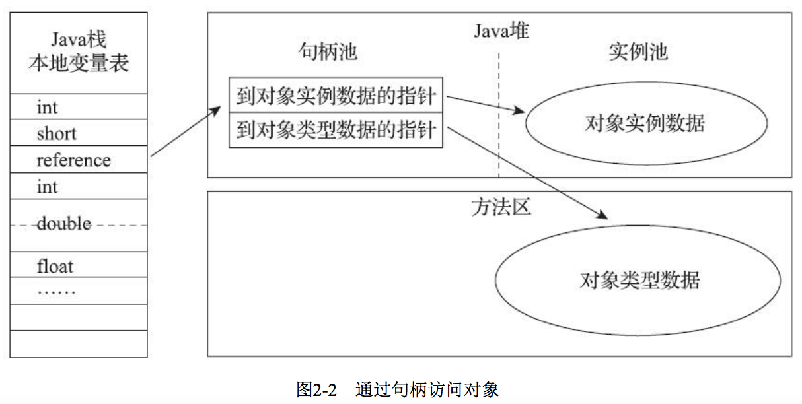

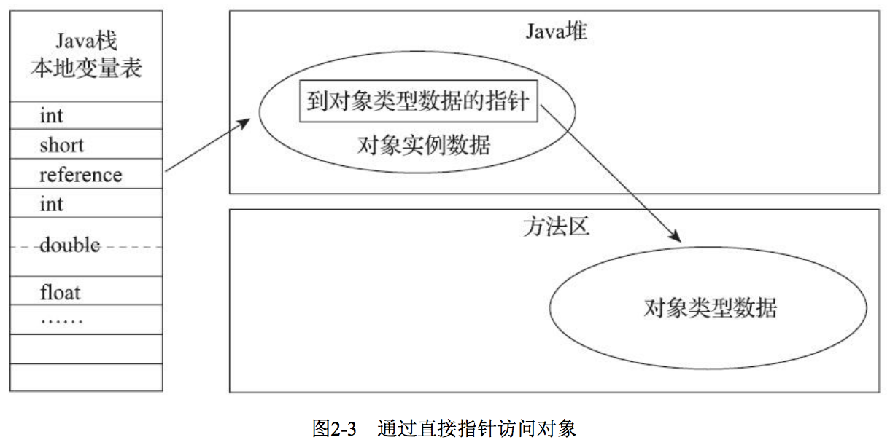

### OutOfMemeryError

Java堆溢出

方式：堆用来存储对象实例，只要不断地创建对象，并且保证GC Roots到对象之间有可达路径，避免垃圾回收。

使用参数

```sh
# -Xms堆最小值 -Xmx堆最大值 -XX:+HeapDumpOnOutOfMemoryError 堆转储快照 -XX:HeapDumpPath 存放地址
java -Xms10m -Xmx10m -XX:+HeapDumpOnOutOfMemoryError -XX:HeapDumpPath=/root/jvm/myTest/
```

虚拟机栈、本地方法栈溢出

使用参数

```sh
# -Xoss 设置本地方法栈（HotSpot没用） -Xss栈容量
java -Xss144k
```

方法区和运行时常量池溢出

运行时常量池，在JDK7以上，放在了堆里。方法区的主要职责是存放类型信息，如类名、访问修饰符、常量池、字符描述、方法描述等。思路是产生大量的类去填满方法区。

使用参数

```sh
# 方法区（元空间）容量
java -XX:MaxMetaspaceSize=6m
# 方法区（元空间）初始大小，达到就会触发垃圾收集进行类型卸载，同时调整该值。
java -XX:MetaspaceSize=6m
# 在垃圾收集后，控制最小的元空间剩余容量的百分比
java -XX:MinMetaspaceFreeRatio=6m
java -XX:MaxMetaspaceFreeRatio
```

本机直接内存溢出

使用参数

```sh
# 指定直接内存，默认与Java堆最大值一致
java -XX:MaxDirectMemorySize=10M -Xmx10M
```

备注：实验没有出现OOM异常，后续注意排查原因

## 垃圾回收和内存分配

核心的3个问题

- 哪些内存需要回收？
- 什么时候回收？
- 怎么回收？

不需要考虑垃圾回收的区域

1. 程序计数器
2. 虚拟机栈
3. 本地方法栈

需要考虑垃圾回收的区域

1. Java堆
2. 方法区

### 对象是否死去

垃圾回收前，要判断堆内哪些对象已“死去”（即不可能再被使用的对象）。判断方式

1. 引用计数算法（不是主流虚拟机使用的算法）
    1. 实现原理
        1. 给对象添加一个引用计数器
        2. 对象被引用时，计数器+1
        3. 取消引用时，计数器-1
        4. 当计数器为0时，对象“死去”
    2. 存在问题：对象间循环引用时，2个对象都永远不会“死去”
2. 可达性分析算法（主流算法）
    1. 实现原理
        1. 以 "GC Roots" 对象作为起点，向下搜索，搜索过程被称为“引用链”。Java 中，可作为GC Roots的对象有
            1. 虚拟机栈中引用的对象
            2. 方法区中静态属性引用的对象
            3. 方法区中常量引用的对象
            4. 本地方法栈中JNI(即 Native方法)引用的对象
            5. 虚拟机内部的引用，如基本数据类型对应的Class对象，常驻的异常对象（NullPointException等），系统类加载器。
            6. 所有被同步锁持有的对象
            7. 反映Java虚拟机内部情况的JMXBean、JVMTI中注册的回调，本地代码缓存。
        2. 能够到达的对象是“活的”，不能到达的对象是“死的”。

引用的含义

传统引用的含义：如果reference类型的数据中存储的数值代表的是另一块内存的起始地址，就称这块内存代表一个引用。

当内存空间在垃圾收集后还是非常紧张，希望可以抛弃某些对象，腾出内存空间。这时候引用的含义需要被扩充。

1. 强引用：类似 `Object obj = new Object()` 这类引用。对象有强引用，则永远不会被垃圾收集器回收。（Strongly Reference）
2. 软引用：描述有用但非必需的对象。当内存不够时，可以被回收。(Soft Reference)
3. 弱引用：描述非必需的对象，比软引用强度更弱。有弱引用的对象只能生存到下一次垃圾回收前。在java中用 `java.lang.ref.WeakRefernce` 实现，对象本身会使用内存，需用引用队列来回收。 (Weak Reference)
4. 虚引用：是最弱的引用关系。对象是否有虚引用的存在，完全不会对其生存时间构成影响，也无法通过虚引用取得一个对象的实例。这个对象在被垃圾收集器回收时会收到一个系统通知。(Phantom Reference)

使用场景：

软引用：JVM会尽可能优先回收长时间闲置不用的软引用指向的对象，对那些刚构建的或刚使用过的软引用指向的对象尽可能的保留。基于软引用的这些特性，软引用可以用来实现很多内存敏感点的缓存场景，即如果内存还有空闲，可以暂时缓存一些业务场景所需的数据，当内存不足时就可以清理掉，等后面再需要时，可以重新获取并再次缓存。软引用通常可以和一个引用队列（ReferenceQueue）联合使用，如果软引用所引用的对象被垃圾回收，java虚拟机就会把这个软引用加入到与之关联的引用队列中。

```java
SoftReference ref = new SoftReference(new LinkedList());
List list = ref.get();
if (list != null)
    list.add(foo);
```

弱引用：ThreadLocal 里的 ThreadLocalMap 就是弱引用。当JVM发现它时，会自动清理key和value。相当于清缓存。

```java
Object obj = new Object();
WeakReference wf = new WeakReference(obj);
obj = null;
//有时候会返回null
wf.get();
//返回是否被垃圾回收器标记为即将回收的垃圾
wf.isEnQueued();
```

虚引用：虚引用提供了一种确保对象被finalize以后，做某些事情的机制（如做所谓的Post-Mortem清理机制）。也有人利用虚引用监控对象的创建和销毁。

```java
Object obj = new Object();
PhantomReference pf = new PhantomReference(obj);
obj=null;
//永远返回null
pf.get();
//返回是否从内存中已经删除
pf.isEnQueued();
```

对象如何真正死去？

对象宣告死亡，至少需要经过两次标记过程

1. 经可达性分析后，发现没有与 GC Roots 相连，会被第一次标记，被标记的对象会分成两类，一类需要执行finalize()方法，一类不需要。
    1. 不需要执行的对象有2种，（rainy:这些对象会被直接回收吗？）
        1. 对象没有覆盖 finalize() 方法
        2. finalize() 方法已被虚拟机调用。
    2. 需要执行的对象，会放在 F-Queue 队列中，等待执行 finalize() 方法。
2. GC 对 F-Queue 队列中的对象进行第二次小规模的标记
    1. 在 finalize() 方法执行时，对象有引用，则不会被回收。
    2. 否则，被回收

回收方法区

主要回收两部分内容

1. 废弃常量。与堆内对象的回收类似，常量没有被任何变量引用时，会被回收。
2. 不再使用的类，需满足
    1. 该类的所有实例都已被回收，Java堆中不存在该类及任何派生类的实例。
    2. 加载该类的ClassLoader已被回收
    3. 该类对应的Class对象没有被引用，即无法通过反射访问该类的方法。

需要设置类是否被回收。相关参数

```sh
-Xnoclassgc
# 在控制台能看到类加载的情况
-verbose:class 类名
-XX:+TraceClassLoading
-XX:+TraceClassUnLoading
```

### 垃圾收集算法

分为2类

1. 引用计数式（Reference Counting GC）
2. 追踪式（Tracing GC），主流

#### 分代收集理论

建立在两个分代假说上

1. 弱分代假说（Weak Generational Hypothesis）：绝大多数对象都是朝生夕灭的。
2. 强分代假说（Strong Generational Hypothesis）：熬过越多次垃圾收集过程的对象就越难以消灭。
3. 跨代引用假说（Intergenerational Reference Hypothesis）：跨代引用相对于同代引用来说仅占极少数。

垃圾收集器设计原则

1. 应该将Java堆划分出不同的区域
2. 将回收对象，根据年龄（熬过垃圾回收过程的次数）分配到不同的区域存储。

划分出区域后，垃圾收集器可以以不同的频率、不同的方式，来收集不同区的对象。

垃圾收集的方式

1. 部分收集（Partial GC）：不是完整收集整个Java堆，分为
    1. 新生代收集（Minior GC/Young GC）：只收集新生代
    2. 老年代收集（Major GC/Old GC）：只收集老年代
    3. 混合收集（Mixed GC）：收集新生代和部分老年代
2. 整堆收集（Full GC）：收集整个堆、方法区

#### 算法

标记-清除算法

最基础的算法，其他算法都是在该算法的基础上改进的。

- 原理：标记处需要清除的对象，之后统一回收。
- 不足
    1. 效率不稳定。大量可回收对象，执行效率低
    2. 垃圾清除后会产生大量不连续的内存碎片

标记-复制算法（复制算法）

- 改进点：解决效率问题。
- 原理
    1. 将可用内存等分成2块。
    2. 使用其中一块A直到该块的内存消耗完
    3. 将存活对象复制到空闲的另一块B，并将A块的内存清理掉。
    4. 使用B块重复步骤2-4
- 不足
    1. 只能使用一半内存，浪费（可以修改分配内存的比例）

改进的复制算法

- 改进点：区域不等分
- 原理：
    1. 将新生代分为1个较大的Eden区和2个较小的Survivor区（HotSpot是8:1:1）
    2. 分配内存只是用Eden区和一个Survivor区
    3. 垃圾收集时，将Eden区和一个Survivor区中的存活对象，复制到另一块Survivor区，清理掉处理过的区域。
    4. 如果存活对象需要的空间，大于Survivor区，则需要老年代进行分配担保(Handle Promotion)。
- 缺点：对象存活率高时，需要进行较多的复制操作。

标记-整理算法

针对老年代（对象存活率高）

- 原理
    1. 标记
    2. 将可回收对象移动到内存的一端，然后清理掉端边界以外的内存。
- 缺点：需要更新大量的对象引用，且这个操作过程中，必须暂停用户进程。

### HotSpot的算法细节

根节点枚举

1. GC Roots集合在枚举过程中需要保持不变。因此需要暂停用户线程。
2. HotSpot 使用 OopMap 来找到对象引用。（准确式垃圾收集）

安全点

1. 只在安全点，生成OopMap，进行垃圾收集。
2. 安全点满足“具有让程序长时间执行的特征”。如方法调用、循环跳转、异常跳转。
3. 如何在垃圾收集时，让所有线程跑到最近的安全点，然后停顿下来。
    1. 抢先式中断。先中断所有线程，然后让不在安全点的线程恢复，跑到安全点再中断。（没有被采用）
    2. 主动式中断。在安全点轮询标志，发现为true就自己中断挂起。

安全区域

1. 用来解决未执行，如Sleep或Blocked的程序，无法进入安全点的问题。
2. 安全区域是指能够确保在某一段代码片段中，引用关系不会发生变化。

记忆集（Remembered Set）

1. 用于解决跨代引用的问题。
2. 记录从非收集区域指向收集区域的指针
3. 是一种抽象数据结构。
4. 有3种实现精度
    1. 字长精度：每个记录精确到一个机器字长，该字包含跨代指针
    2. 对象精度：每个记录精确到一个对象，该对象里有字段含有跨代指针
    3. 卡精度：每个记录精确到一块内存区域，该区域内有对象含有跨代指针

卡表（Card Table）

1. 是记忆集的一种实现方式。
2. 是卡精度。
3. 最简单的形式可以是一个字节数组，元素是“卡页”，卡页指向内存区域中一块特定大小的内存块。

写屏障（Write Barrier）

1. 用来维护卡表状态。
    1. 卡表何时变脏？有其他分代区域中的对象引用了本区域对象时
    2. 卡表如何变脏？写屏障
2. 可以看做是虚拟机对“引用类型字段赋值”的AOP切面。赋值前的部分叫写前屏障（Pre-Write Barrier），赋值后的叫写后屏障（Post-Write Barrier）。
3. 缺点
    1. 每次对引用进行更新，就会产生额外的开销
    2. 高并发场景，存在“伪共享”问题。伪共享是：多个相互独立的变量共享一个缓存行，同时对这些变量修改时，会彼此影响。

并发的可达性分析

做到和用户线程并发的可达性分析，有2种方式（使用三色标记作为辅助工具）：

- 白色：表示对象尚未被垃圾收集器访问过。
- 黑色：表示对象已经被垃圾收集器访问过，且对象的所有引用都扫描过。
- 灰色：表示对象已经被垃圾收集器访问过，但至少有一个引用还没被扫描过。

如果用户线程和垃圾收集器并行工作，则可能有2种后果：

1. 把已消亡的对象标记为存活。（无影响，下次回收即可）
2. 把存活的对象标记为消亡。（致命错误）

当把黑色对象误标记为白色，需要满足一下2种情况

- 赋值器插入了一条或多条从黑色对象到白色对象的引用
- 赋值器删除了全部从灰色对象到该白色对象的直接或间接应用

因此有2种解决方法：

1. 增量更新（Incremental Update）。
    1. 当黑色对象（已分析完全部引用的对象）插入新的指向白色对象（未分析的对象）的引用关系时，记录下来。（rainy：此时引用关系插入了吗？答：插入了，但是黑色对象已经是分析完的状态了）
    2. 扫描结束后，以记录的黑色对象为根，再重新扫描。
2. 原始快照（Snapshot At The Beginning，SATB）。
    1. 当灰色对象删除指向白色对象的引用关系时，将这个要删除的引用记录下来。（rainy：此时是不是没有删除引用关系，等到扫描完再删除，然后再扫描一次？答：已经删除了引用关系，但是这个引用关系被记录下来了，后面会重新扫描被删除的引用关系）
    2. 扫描结束后，以记录的灰色对象为根，再扫描一次被删除的引用关系。即按照刚刚开始扫描那一刻的对象图快照来进行搜索。（rainy：一个对象有没有可能上一秒消亡，下一秒存活？答：不可能，因为消亡时，已经没有引用指向这个对象了，获取不到对象的引用，就没办法让对象存活。对象唯一自救的方式，是在finalize()方法中增加对自身的引用。）

### 经典垃圾收集器（HotSpot）

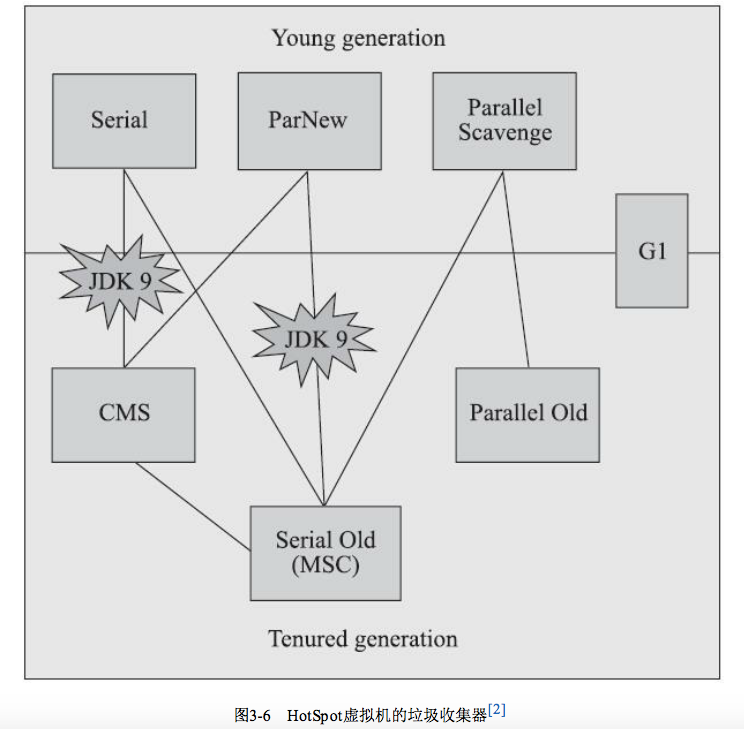

垃圾收集器是内存回收的具体实现。

Serial 收集器

1. 单线程的收集器，运行时会停掉其他线程。
2. 客户端模式下，默认的新生代收集器
3. 优点：额外内存消耗（Memory Footprint）最小。

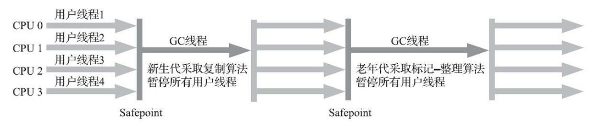

ParNew 收集器

1. 是 Serial 收集器的多线程并行版本。
2. 服务端模式下，JDK7-首选的新生代收集器，可以与CMS(老年代的收集器)配合使用。JDK9+只能与CMS配合使用。

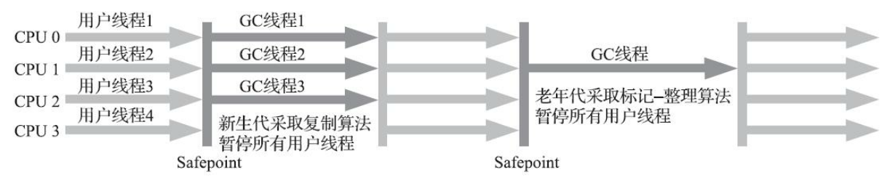

Parallel Scavenge 收集器

1. 基于标记-复制算法
2. 能并行收集的多线程收集器。
3. 目标是达到一个可控制的吞吐量。吞吐量=用户代码运行时间/(用户代码运行时间+垃圾收集运行时间)
4. 有自适应调节策略

相关参数

```sh
# 设置最大垃圾收集停顿时间
java -XX:MaxGCPauseMillis
# 设置吞吐量大小，默认是99(垃圾收集时间是1%=1/(1+99))
java -XX:GCTimeRatio
# 开关，打开后，垃圾收集器可以自适应的调节新生代大小、等参数
java -XX:UseAdaptiveSizePolicy
```

Serial Old 收集器

1. 是Serial的老年代版本。
2. 单线程收集器
3. 使用标记-整理算法
4. 供客户端模式下的HotSpot虚拟机使用。

Parallel Old 收集器

1. 是 Parallel Scavenge 的老年代版本。
2. 支持多线程并发。
3. 基于标记-整理算法。

CMS（Concurrent Mark Sweep） 收集器

1. 目标：尽可能地缩短垃圾收集时用户线程的停顿时间。
2. 基于标记-清除算法，有4个步骤，步骤1，3需要Stop The World。
    1. 初始标记 CMS initial mark，标记GC Roots能直接关联到的对象
    2. 并发标记 CMS concurrent mark，从GC Roots直接关联的对象开始，遍历对象图。
    3. 重新标记 CMS remark，修正在并发标记时，用户程序的增量操作造成的变化。使用增量更新的方式。
    4. 并发清除 CMS concurrent sweep
3. 优点：并发收集、低停顿。
4. 缺点
    1. 对处理器资源非常敏感
    2. CMS 收集器无法处理“浮动垃圾”（Floating Garbage）（并发清除时，用户线程可能还在制造垃圾），有可能出现 Concurrent Mode Failure 而导致 Full GC 的产生（之后会冻结用户线程，临时启用Serial Old收集器）。
    3. 收集后会产生大量空间碎片

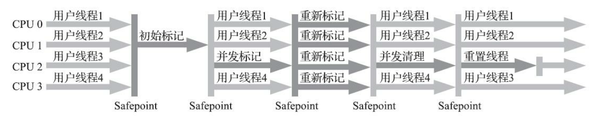


使用参数

```sh
# 激活CMS
java -XX:+UseConcMarkSweepGC
# JDK5 当老年代使用了90%+，触发垃圾回收（老年代使用的百分比，默认68%，JDK6+默认92%）
java -XX:CMSInitiatingOccupancyFraction=90
# 默认开启，JDK9后废弃。Full GC时，进行碎片整理
java -XX:+UseCMSCompactAtFullCollection
# JDK9后废弃，表示在n次Full GC后，进行碎片整理
java -XX:CMSFullGCsBeforeCompaction
```

Garbage First 收集器（简称 G1）

1. 面向服务端应用，全功能的垃圾收集器。
2. 开创了面向局部收集、基于Region的内存布局形式。
    1. 把连续的Java堆划分为多个大小相等的独立区域（Region），每一个Region都可以根据需要，扮演新生代的Eden空间、Survivor空间、老年代空间。
    2. Region中的特殊区域 Humongous，专门用来存储大对象（超过一个Region容量一半的对象）。
    3. G1 将 Region 作为单次回收的最小单元。并按照回收价值，给Region定回收的优先级。
3. Mixed GC 模式。面向堆内存任何部分组成回收集（Collection Set，CSet），衡量标准是哪块内存存放的垃圾多，回收收益最大。
4. 基于Region回收，需要解决的问题
    - 跨Region的引用对象如何解决？使用记忆集
        1. 每个Region有自己的记忆集，记录别的Region指向自己的指针，标记这些指针分别在哪些卡页的范围内。
        2. 记忆集是一种哈希表，Key是别的Region的起始地址，Value是集合，存储卡表的索引号。
        3. 由于Region较多，导致卡表较多，导致内存占用较多。
    - 并发标记阶段，如何保证收集线程与用户线程互不干扰？
        1. 保证垃圾标记的正确性：使用原始快照算法。
        2. 新建对象如何分配内存：G1 设计了2个 TAMS（Top at Mark Start）的指针，把Region中的一部分空间划分出来，用于并发回收过程中的新对象分配，并发回收时新分配的对象地址都必须要在这两个指针位置以上。这些对象时默认存活的。
        3. 当内存回收的速度，比不上内存分配的速度，G1也会冻结用户线程，导致Full GC而产生长时间停顿。
    - 怎样建立可靠的停顿预测模型？
        1. 以衰减均值（Decaying Average）为理论基础，预测Region的回收代价。
5. G1 收集器的运作过程，1、3、4需要停顿。
    1. 初始标记（Initial Marking）：标记 GC Roots 能直接关联到的对象，修改 TAMS 指针的值。
    2. 并发标记（Concurrent Marking）：并发进行可达性分析
    3. 最终标记（Final Marking）：处理并发标记时，SATB记录的有引用变动的对象。
    4. 筛选回收（Live Data Counting and Evacuation）：更新Region的统计数据，制定回收计划，并回收。
6. 可以由用户指定期望的停顿时间。


使用参数

```sh
# 设置Region大小，范围是1MB-32MB
java -XX:G1HeapRegionSize
# 设置允许收集停顿的时间，默认200ms
java -XX:MaxGCPauseMillis
```

### 低延迟垃圾收集器

衡量垃圾收集器的三项指标

1. 内存占用 Footprint
2. 吞吐量 Throughput
3. 延迟 Latency

Shenandoah 收集器

1. 与G1类似，使用基于Region的堆内存布局，存放大对象的 Humongous Region，默认回收价值最大的Region……
2. 与G1不同的是
    1. 并发整理
    2. 不使用分代收集
    3. 不使用记忆集，而是使用“连接矩阵”（Connection Matrix）记录跨Region的引用关系。
3. 工作过程，1、3、6、8会停顿
    1. 初始标记（Initial Marking）：标记 GC Roots 能直接关联到的对象。
    2. 并发标记（Concurrent Marking）：并发进行可达性分析
    3. 最终标记（Final Marking）：处理并发标记时，SATB记录的有引用变动的对象。统计回收价值最高的Region，组成回收集。
    4. 并发清理（Concurrent Cleanup）：清理整个区域都没有存活对象的Region（Immediate Garbage Region）
    5. 并发回收（Concurrent Evacuation）：与其他收集器有明显差异。复制待回收Region里的存活对象到其他Region。
    6. 初始引用更新（Initial Update Reference）：将指向旧对象的引用更新到新地址。
    7. 并发引用更新（Concurrent Update Reference）：真正进行引用更新操作。
    8. 最终引用更新（Final Update Reference）：修正存在于GC Roots中的引用。
    9. 并发清理（Concurrent Cleanup）：待回收的Region里都没有存活对象，都可以被清理了。
4. 并发回收阶段，使用转发指针，来实现对象移动与用户程序并发。
    1. 在对象头新增一个引用字段
    2. 默认指向自己，在并发移动时，指向移动后的对象。
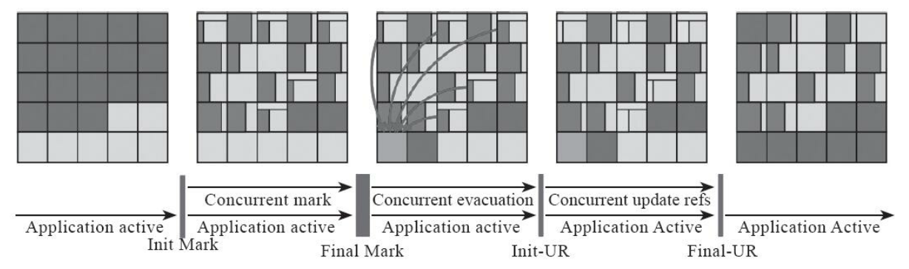

ZGC(Z Garbage Collector) 收集器

1. 目标：低延迟。在任意堆内存大小下，把垃圾收集的停顿时间限制在10ms以内
2. 基于 Region，不设分代。Region具有可动态创建和销毁，有动态的区域容量大小。
3. 使用了读屏障、染色指针、内存多重映射
    1. 染色指针：将少量额外的信息存储在指针上。Linux下，64位指针的高18位不能用来寻址。剩下的46位中，高4位用来存储4个标志信息。
    2. 内存多重映射：将多个虚拟内存地址映射到同一个物理内存地址上。
4. 使用标记-整理算法
5. 运作过程
    1. 并发标记（Concurrent Mark）：并发进行可达性分析
    2. 并发预备重分配（Concurrent Prepare for Relocate）：统计出要回收的Region，组成重分配集。
    3. 并发重分配（Concurrent Relocate）：把重分配集中的存活对象复制到新的Region上，并记录旧-新对象的转向关系。
    4. 并发重映射（Concurrent Remap）：修正堆中指向重分配集中旧对象的所有引用。
6. 优点
    1. 不需要记忆集占用内存空间
    2. 没有用到写屏障
7. 缺点
    1. 能承受的对象分配速率不高（因为没有分代）

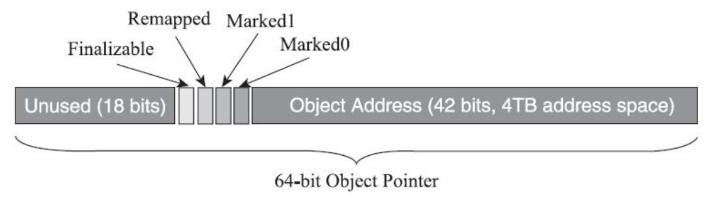

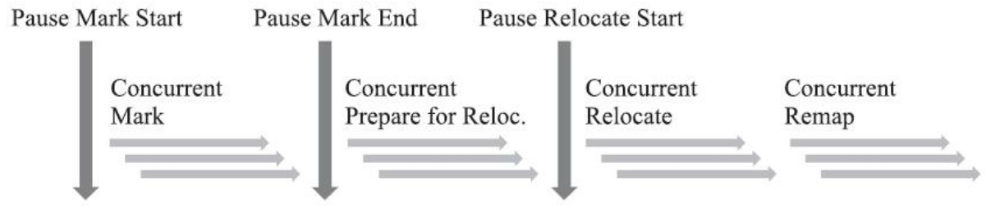

rainy：为什么 shenandoah 不能像 ZGC 一样，直接修改引用的值，指向新复制的存活对象，而是要采用转发措施呢？答：因为shenandoah 采用的是转发指针，每次都需要查询转发指针才能获取对象，所以在初始对象和复制对象都存活时，修改引用值并没有直接的增益，在处理完后统一修改即可。

rainy：G1 h区的gc是什么样的？

### 选择合适的垃圾收集器

Epsilon 收集器

1. 无垃圾收集行为（rainy：适合使用时间短，使用内存少的移动端应用？）

虚拟机及垃圾收集器日志

使用参数

```sh
-Xlog[:[selector][:[output][:[decorators][:output-options]]]]
```

1. selector由tag和level组成
    1. tag有：add, age, alloc, annotation, aot, agruments, attach, barrier, biasedlocking, blocks, bot, breakpoint, byteco???
    2. level有：Trace, Debug, Info, Warning, Error, Off
2. decorator为每行日志输出加上额外的内容，默认显示uptime，level，tags
    1. time：当前日期和时间
    2. uptime：虚拟机启动到现在经过的时间（秒）
    3. timemillis：当前时间的毫秒数，相当于System.currentTimeMillis()的输出
    4. uptimemillis：虚拟机启动到现在经过的时间（毫秒）
    5. timenanos：当前时间的纳秒数，相当于System.nanoTime()的输出
    6. uptimenanos：虚拟机启动到现在经过的时间（纳秒）
    7. pid：进程ID
    8. tid：线程ID
    9. level：日志级别
    10. tags：日志输出的标签集

例子

```sh
# 查看GC基本信息
java -Xlog:gc GCTest # JDK9+
java -XX:+PrintGC # JDK9-
# 查看GC详细信息
java -Xlog:gc* GCTest # JDK9+
java -XX:+PrintGCDetails # JDK9-
# 查看GC前后的堆、方法区可用容量变化
java -Xlog:gc+heap=debug GCTest # JDK9+
java -XX:+PrintHeapAtGC # JDK9-
# 查看GC过程中用户线程并发时间以及停顿时间
java -Xlog:safepoint GCTest # JDK9+
java -XX:PrintGCApplicationConcurrentTime # JDK9-
# 查看收集器 Ergonomics 机制
java -Xlog:gc+ergo*=trace GCTest
java -XX:+PrintAdaptiveSizePolicy # JDK9-
# 查看熬过收集后剩余对象的年龄分布信息
java -Xlog:gc+age=trace 
java -XX:+PrintTenuringDistribution # JDK9-
```

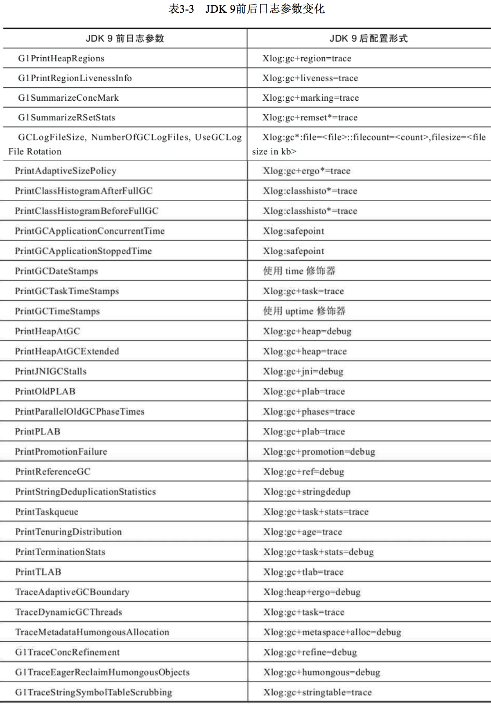

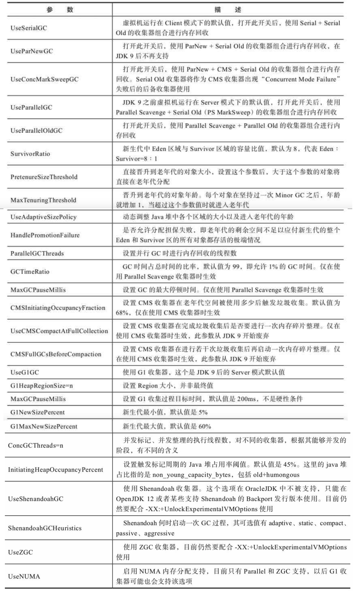

常用参数

```sh
# 堆内存的最小大小，默认为物理内存的1/64
-Xms
# 堆内存的最大大小，默认为物理内存的1/4
-Xmx
# 堆内新生代的大小。通过这个值也可以得到老生代的大小：-Xmx减去-Xmn
-Xmn
# 设置每个线程可使用的内存大小，即栈的大小。
-Xss
# Eden区与Survivor区的比例
-XX:SurvivorRatio=8
# 虚拟机发生内存回收时，在输出设备显示信息
-verbose:gc
# 输出native方法调用的相关情况，一般用于诊断jni调用错误信息。
-verbose:jni
# 大于该设置值的对象直接在老年代分配
-XX:PretenureSizeThreshold
# 设置对象晋升老年代的年龄阈值
-XX:MaxTenuringThreshold
# 查看是否允许担保失败（Handle Promotion Failure）
-XX:HandlePromotionFailure
```

### 内存分配和回收策略

1. 对象优先在Eden分配
2. 大对象直接进入老年代
3. 长期存活的对象将进入老年代
4. 动态对象年龄判断：如果在Survivor空间中，相同年龄所有对象大小的总和大于Survivor空间的一半，年龄大于或等于该年龄的对象，就可以直接进入老年代。
5. 空间分配担保：Minor GC前，需要检查
    1. （JDK6-）检查老年代最大可用连续空间 > 新生代所有对象总空间
        1. 是，进行Minor GC
        2. 否，检查HandlePromotionFailure是否允许担保失败
            1. 是，检查老年代最大可用连续空间 > 历次晋升到老年代对象的平均大小
                1. 是，尝试Minor GC
                2. 否，Full GC
            2. 否，Full GC
    1. （JDK6+）检查老年代最大可用连续空间 > 新生代所有对象总空间 或 历次晋升到老年代对象的平均大小
        1. 是，进行Minor GC
        2. 否，Full GC

## 性能监控、故障处理工具

### 基础故障处理工具

jps 虚拟机进程状况工具

JVM Process Status Tool，可用列出正在运行的虚拟机进程，并显示虚拟机执行主类（Main Class，main函数所在的类）名称、进程的本地虚拟机唯一ID（LVMID，Local Virtual Machine Identifier）。

命令格式

```sh
jps [options] [hostid]
jps -l
```


    
jstat 虚拟机统计信息监视工具

JVM Statistics Monitoring Tool，监视虚拟机各种运行状态信息

命令格式

```sh
# interval 查询间隔，count 查询总次数。省略表示只查一次
# option 代表用户希望查询的虚拟机信息，分为：类加载、垃圾收集、运行期编译状况
jstat [options vmid [interval[s|ms][count]] ]
# 远程虚拟机进程，VMID格式
[protocol:][//]lvmid[@hostname[:port]/servername]
```

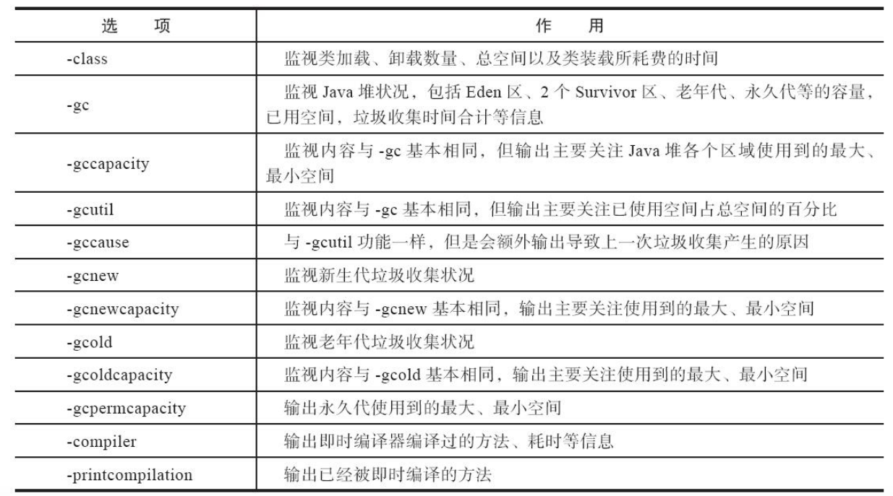

jinfo Java配置信息工具

Configuration Info for Java，实时查看和调整虚拟机各项参数。

命令格式

```sh
jinfo [option] pid
# 查 CMSInitiatingOccupancyFraction 的值
jinfo -flag CMSInitiatingOccupancyFraction 1444
```

jmap Java内存映像工具

Memory Map for Java，用于生成堆转储快照（称为heap dump或dump文件）

其他方式生成dump文件

```sh
# 发生内存溢出异常时，自动生成dump文件
-XX:+HeapDumpOnOutOfMemoryError
# Ctrl + Break 键让虚拟机生成dump文件
-XX:+HeapDumpOnCtrlBreak
```

命令格式

```sh
jmap [option] vmid
jmap -dump:format=b,file=eclipse.bin 3500
```

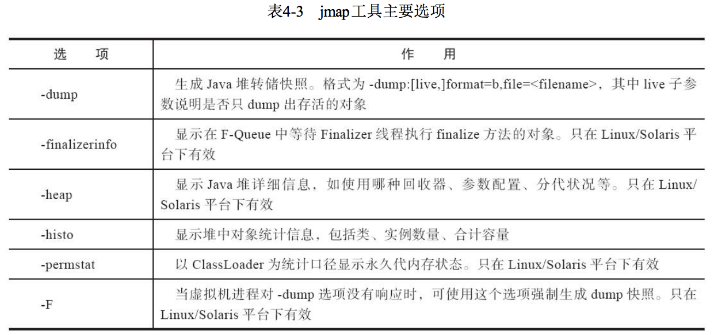

jhat 堆转储快照分析工具

JVM Heap Analysis Tool，分析jmap生成的堆转储快照。内置了一个微型的HTTP/Web服务器，可以在浏览器中查看分析结果。

jstack Java堆栈跟踪工具

Stack Trace for Java，用于生成虚拟机当前时刻的线程快照（称为threaddump或javacore文件）

命令格式

```sh
jstack [option] vmid
jstack -l 3500
```

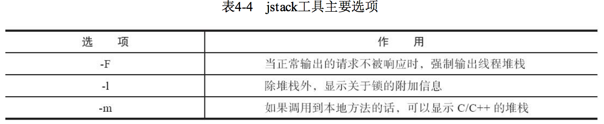

用java代码获得堆栈情况

```java
for(Map.Entry<Thread, StackTraceElement[]> stackTrace : Thread.getAllStackTraces().entrySet()) {
    Thread t = (Thread) stackTrace.getKey();
    StackTraceElement[] stack = (StackTraceElement[]) stackTrace.getValue();
    if(t.equals(Thread.currentThread())) {
        continue;
    }
    out.print(t.getName());
    for(StackTraceElement element : stack) {
        out.print(element);
    }
}
```

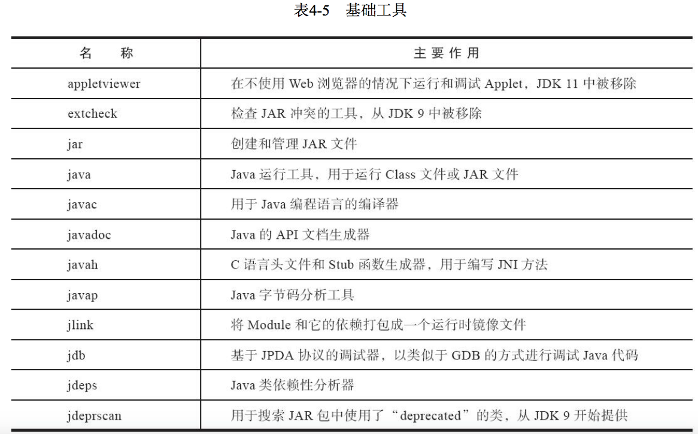

其他工具见《深入理解Java虚拟机：4.2.7》

### 可视化故障处理工具


JHSDB 基于服务性代理的调试工具

服务性代理（Serviceability Agent，SA）是HotSpot虚拟机中一组用于映射Java虚拟机运行信息的、主要基于Java语言实现的API集合。把C++数据抽象出Java模型对象，相当于HotSpot的C++代码的一个镜像。

```sh
# 进入 JHSDB 的图形化模式
jhsdb hsdb --pid 12345

# 查看堆的范围和大小
# Tools -> Heap Parameters

# 在某个地址范围内，搜索对象
# Windows -> Console
scanoops 0x0000000106600000[开始地址] 0x0000000106950000[结束地址] JHSDB_TestCase$ObjectHolder[对象]
# 0x0000000106672198 JHSDB_TestCase$ObjectHolder
# 0x00000001066721c0 JHSDB_TestCase$ObjectHolder
# 0x00000001066721d0 JHSDB_TestCase$ObjectHolder

# 查找某个地址存放的对象
# Tools -> Inspector 输入对象地址

# 查找堆内哪个地址引用了某对象
# Windows -> Console
revptrs 0x0000000106672198[对象地址]

# 查看某方法的栈帧
# 在主页面选中某方法，然后点击 Stack Memory
```

JConsole Java监视与管理控制台

基于JMX（Java Management Extensions）的可视化监视、管理工具。通过JMX的MBean（Managed Bean）对系统进行信息收集和参数动态调整。

通过 JDK/bin 目录下的 jconsole 启动，会自动搜索出本机运行的所有虚拟机进程

VisualVM 多合-故障处理工具

Java Mission Control 可持续在线的监控工具

### HotSpot虚拟机插件及工具

HSDIS JIT生成代码反汇编

作用：让HotSpot的-XX:+PrintAssembly指令调用它来把即时编译器动态生成的本地代码还原为汇编代码输出，并生成注释

hsdis 编译安装方法 https://www.jianshu.com/p/fce0af7730f5

```
java -XX:+PrintAssembly -Xcomp -XX:CompileCommand=dontinline,*Bar.sum -XX:CompileCommand=compileonly,*E???
```

## 类文件结构

java 是平台无关的，但是jdk和平台相关。

### 无关性的基石

1. 虚拟机。只与Class文件关联。
2. 字节码存储格式。包含了Java虚拟机指令集、符号表等辅助信息。

Java虚拟机不与包括Java语言在内的任何程序语言绑定，它只与“Class文件”这种特定的二进制文件格式所关联，Class文件中包含了Java虚拟机指令集、符号表等辅助信息。

### Class类文件的结构

任何一个Class文件都对应着唯一的一个类或接口的定义信息。Class文件不需要以磁盘文件的形式存在。

Class文件的特点

1. 以8个字节为基础单位的二进制流，没有分隔符。当遇到需要8个字节以上空间的数据项时，会按高位在前的方式分割成若干个8字节进行存储。
2. 有两种数据类型：
    1. 无符号数。基本的数据类型，以u1, u2, u4, u8来分别代表1，2，4，8个字节的无符号数。可以用来描述数字、索引引用、数量值、字符串值（UTF-8编码）
    2. 表。复合数据类型，由多个无符号数或其他表作为数据项，命名习惯性以_info结尾。整个Class文件可以看成一张表。

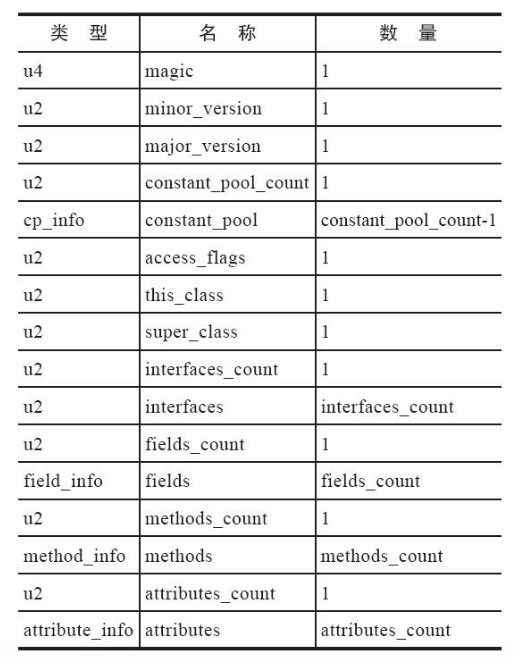

- 魔数 magic：Class文件的头4个字节，作用是确定这个文件是否为一个能被虚拟机接受的Class文件。Class文件的魔数是 `0xCAFEBABE`。使用魔数而不是文件后缀来识别文件类型，是因为文件后缀可以随意改动。
- 版本号：之后4个字节是Class文件的版本号。5、6字节是次版本号（Minor Version），7、8字节是主版本号（Major Version）。
- 常量池：表类型，在版本号之后。入口有u2类型的数据，表示容量池大小。只有容量池从1开始计数，每个常量都是一个表。存放的常量有
    1. 字面量（Literal）
    2. 符号引号（Symbolic References）
        - 被模块导出或者开放的包（Package）
        - 类和接口的全限定名（Fully Qualified Name）
        - 字段的名称和描述符（Descriptor）
        - 方法的名称和描述符
        - 方法句柄和方法类型（Method Handle、Method Type、Invoke Dynamic）
        - 动态调用点和动态常量（Dynamically Computed Call Site、Dynamically Computed Constant）
- 访问标志：用于识别一些类或者接口层次的访问信息
- 类索引（u2类型）、父索引（u2类型）、接口索引集合（u2类型的集合）。用来确定该类型的继承关系。
- 字段表
- 方法表集合
- 属性表结合

#### 常量池

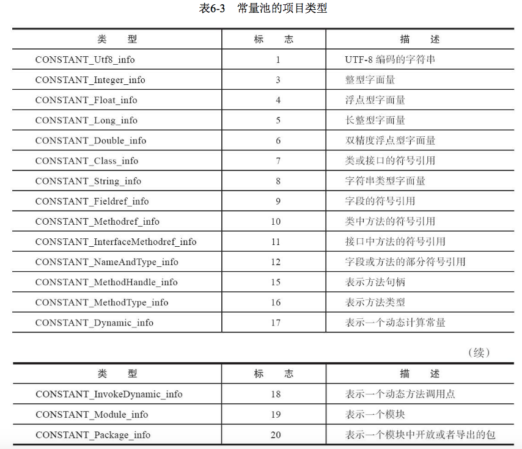

rainy：class文件中，常量池里，前面的某个常量的值，可能是后面某个引用类型的值。那么jvm怎么知道这个的起始地址在哪儿呢？因为它只知道在常量池中的索引号，从索引号到起始地址，是不是需要把常量池扫一遍，扫一遍后，在内存里有对应的结构存储吗？因为每个常量占用的空间是不同的，不存储一个类似常量索引，常量起始地址的map，就需要一遍遍扫描计算class文件。

常量-Class

1. tag是标志位。
2. name_index是常量池的索引值，指向常量池中的CONSTANT_Utf8_info类型常量，代表了这个类的全限定名。

常量-utf8

1. tag是标志位。
2. length 字符串长度。最大值是65535，所以Java中，方法、字段名的最大长度也是64KB

分析字节码的工具

```sh
javap -verbose TestClass
```
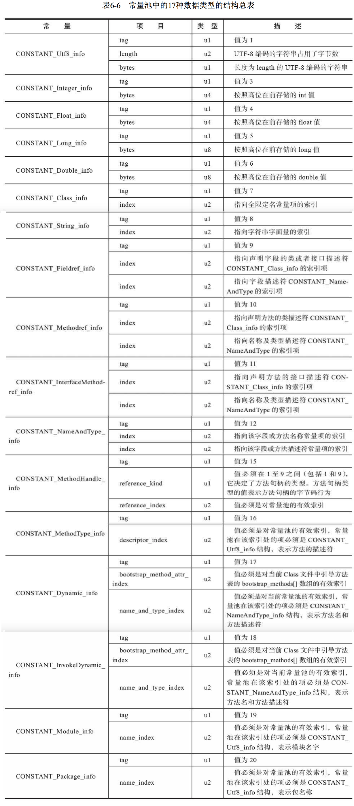

#### 访问标志

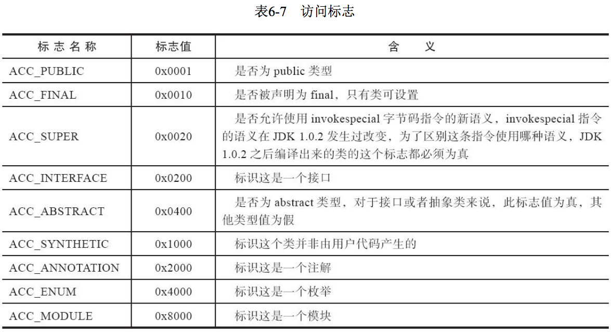

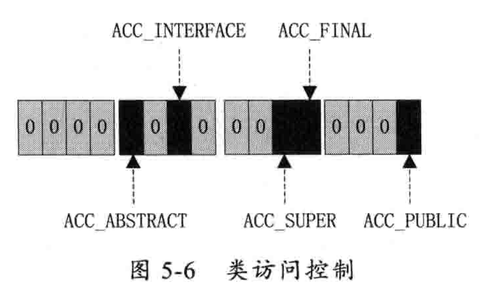

#### 字段表集合

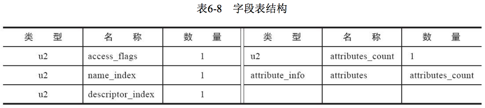

access_flags

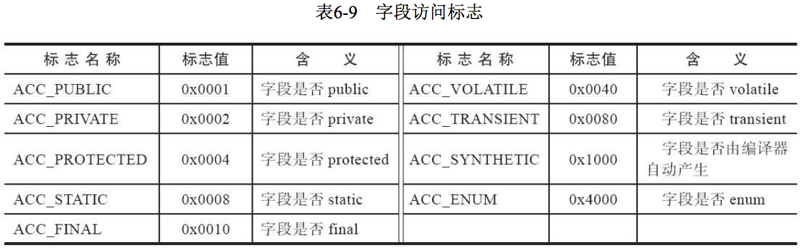

全限定名：如"org/mypakage/com/TestClass"

简单名称：方法或字段的名称

方法和字段的描述符：用来描述字段的数据类型、方法的参数列表（数量、类型、顺序）和返回值。基本类型和void都用一个大写字符表示，对象类型用L+对象的全限定名表示。

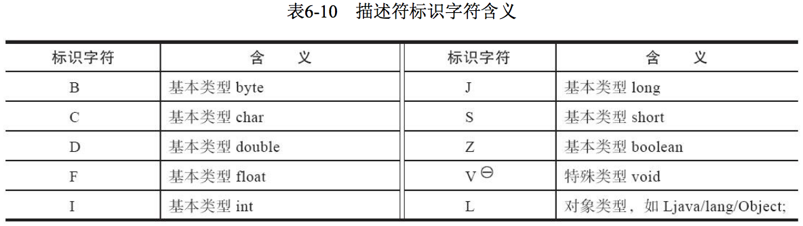

数组类型，每一个维度将使用一个前置的[来描述。

描述方法：先参数列表、后返回值。

Java语言中字段是无法重载的，但对Class文件来说，只要两个字段的描述符不是完全相同，那字段重名就是合法的。

```
java.lang.String[][]  -->  [[Ljava/lang/String;
int[]  -->  [I

void inc() --> ()V
java.lang.String toString()  ()Ljava/lang/String;
int indexOf(char[] source, int sourceOffset, int sourceCount, char[] target, int targetOffset, int targetCount, int fromIndex) --> ([CII[CIII)I
```

#### 方法表集合


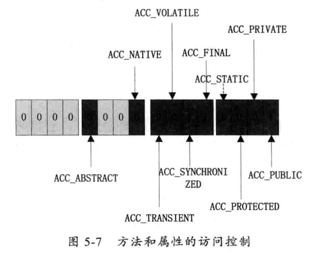


方法的代码存在方法属性表集合中的“Code”属性里面。

在Class文件中，只要描述符不是完全一致，两个方法就可以共存（仅返回值不同，其他完全相同的方法，在Class文件中可以存在，在Java中不能存在）。

#### 属性表集合

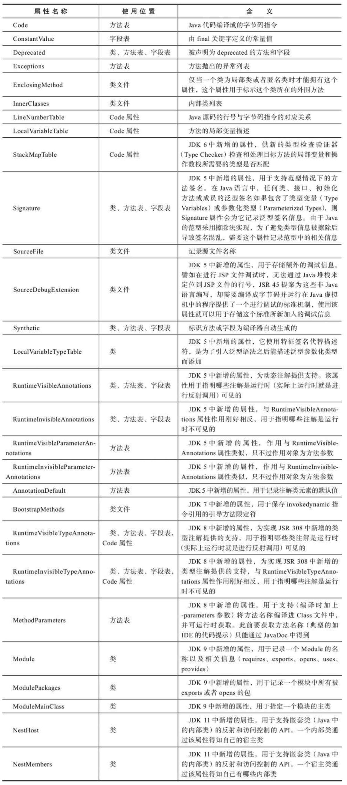

可以定义自己的属性，只要说明属性的长度。


- Code 属性


attribute_name_index 指向utf8常量，常量值固定为Code

max_stack 代表了操作数栈（Operand Stack）深度的最大值。

max_locals 代表了局部变量所需要的存储空间。单位是变量槽（Slot），是为局部变量分配内存使用的最小单位。长度 <= 32位的数据类型，占一个槽，64位的占2个槽。局部变量表中的变量槽可以被重用，当代码执行超过一个局部变量的作用域时，这个局部变量所占的变量槽可以被其他局部变量使用。max_locals = 同时生存的最大局部变量数量

code_length 代表字节码长度。《Java虚拟机规范》中，限定了一个方法不允许超过 65535 条字节码指令。

code 存储字节码指令的一系列字节流。一个字节表示一个指令，最多有256条指令。目前已有约200条指令。

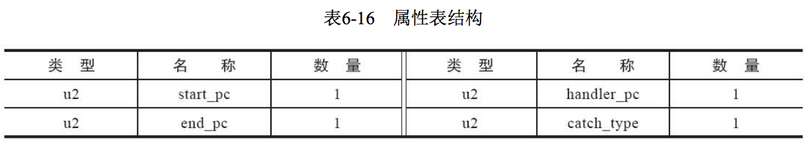

字节码从[start_pc, end_pc)的行之间出现了类型为catch_type（指向Class类型的常量的索引）或其子类的异常，则转到handler_pc行继续处理。catch_type=0时，任何异常都需要转到handler_pc处进行处理。

- Exceptions 属性

作用：列出方法中可能抛出的受查异常

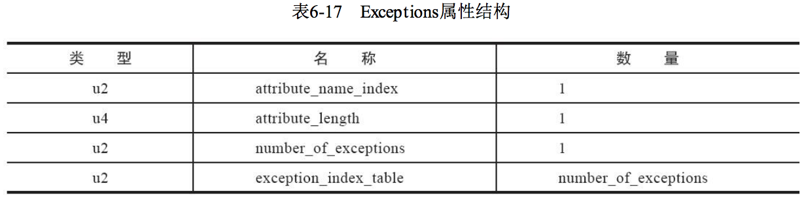

- LineNumberTable 属性

作用：描述Java源码行号与字节码行号之间的对应关系。如，抛出异常时，堆栈中会显示出错的行号。

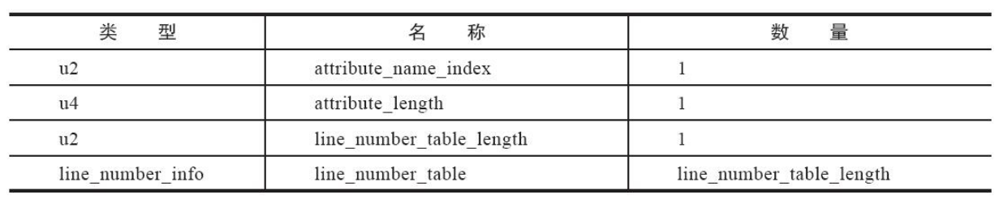

可以在javac中使用 `-g:none` 或 `-g:lines` 来取消或要求生成这项信息。

- LocalVariableTable

作用：描述栈帧中局部变量表的变量，与Java源码中定义的变量的关系。如，将Java源码中的方法参数名称，和Class文件局部变量表的变量，关联起来。

可以在javac中使用 `-g:none` 或 `-g:vars` 来取消或要求生成这项信息。如果没有这个属性，别人引用时，方法参数会丢失，IDE会使用类似 arg0，arg1的占位符代替原有的参数名。

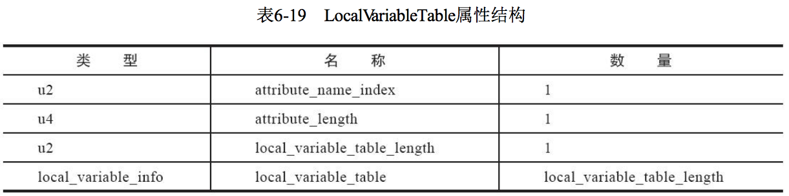

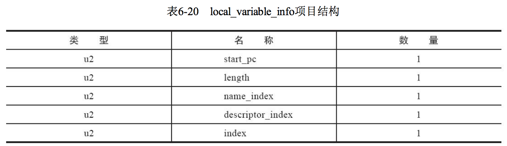

start_pc 局部变量的生命周期开始的字节偏移量

length 局部变量的作用范围的长度

name_index 局部变量名称，指向常量池中的utf8类型

descriptor_index 局部变量的描述符，指向常量池中的utf8类型

index 局部变量在栈帧的局部变量表中变量槽的位置。

- LocalVariableTypeTable

与LocalVariableTable类似，descriptor_index替换为了Signature，用来完成泛型的描述。

- SourceFile

作用：生成这个Class文件的源文件的名称。

一般来说，类名和文件名是一致的，但是有一些特殊情况，如内部类。使用 `-g:none` 或 `-g:source` 来取消或要求生成这项信息。

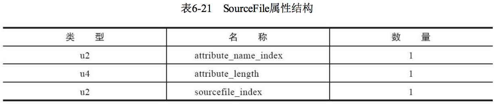

- SourceDebugExtension

作用：方便编译器和动态生成的Class中，加入供程序员使用的自定义内容。

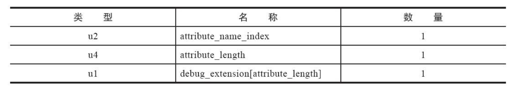

- ConstantValue

作用：通知虚拟机自动为静态变量赋值。

非静态变量的赋值，在实例构造器 `<init>()` 方法中进行。

类变量有2种方式

1. 在类构造器 `<clinit>()` 方法中
2. 使用 ConstantValue 属性。

javac编译器的选择是，final static 修饰的 String类型，用ConstantValue。其他用构造器。

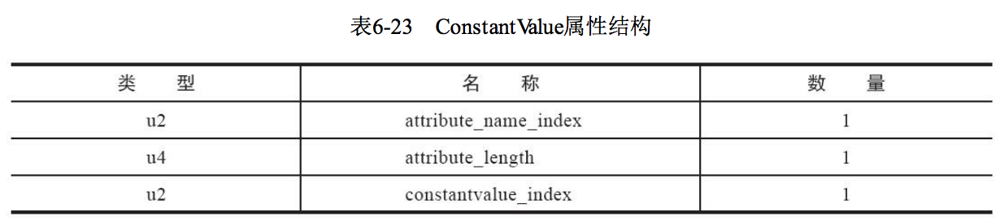

- InnerClass属性

作用：记录内部类与宿主类之间的关联。

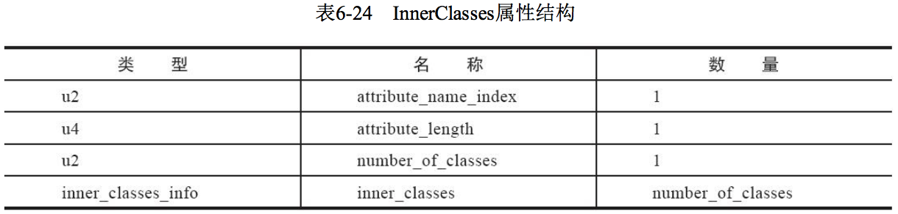

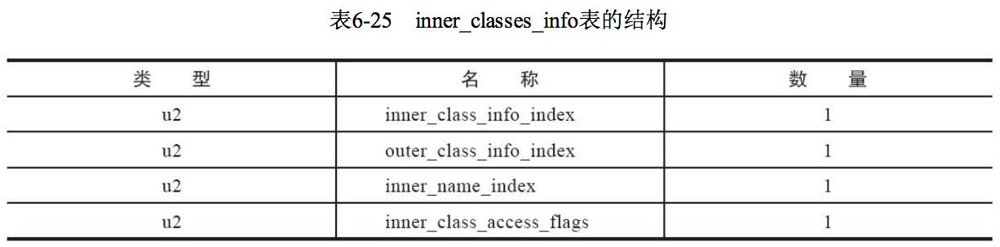

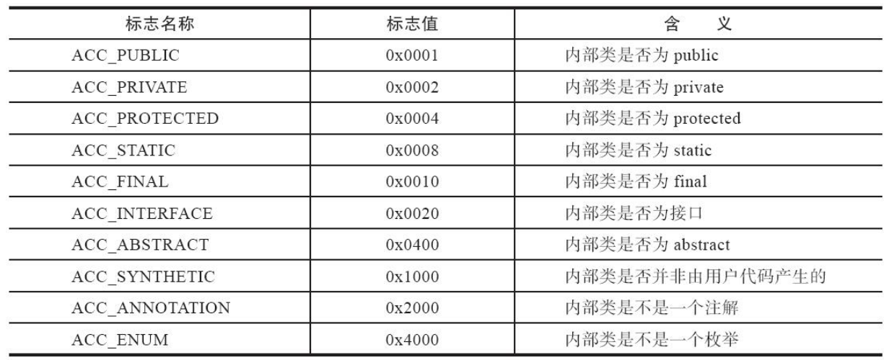

- Deprecated 属性 和 Synthetic 属性

Deprecated 属性：标志类型，表示某个类、字段、方法，已经被程序作者定为不再推荐使用。通过代码中 `@deprecated` 注解进行设置。

Synthetic 属性：标志类型，表明此字段、方法并不是Java源码直接产生的，而是编译器自行添加的。

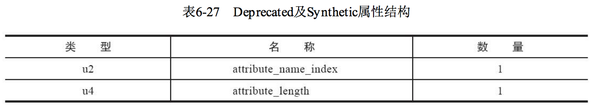

其中 attribute_length 的值必须为 0x00000000

- StackMapTable

作用：在java虚拟机类加载的字节码验证阶段被新类型检查验证器（Type Checker）使用，目的在于替换以前比较消耗性能的基于数据流分析的类型推导验证器。

位于 Code 属性的属性表中。包含零至多个栈映射帧（Stack Map Frame），每个栈映射帧都显示或隐式地代表一个字节码偏移量，用于标识执行到该字节码时局部变量表和操作数栈的验证类型。类型检查验证器会通过检查目标方法的局部变量和操作数栈所需要的类型来确定一段字节码指令是否符合逻辑约束。

rainy：比如，强制转换时，检查强制转换是否能成功？

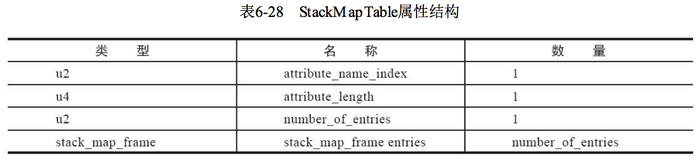

Signature

作用：如果包含了类型变量(Type Variable)或参数换类型(Parameterized type)，Signature属性会为它记录泛型签名信息。因为编译后，泛型信息会被擦除。

Java的反射API能够获取的泛型类型，来自这个属性。

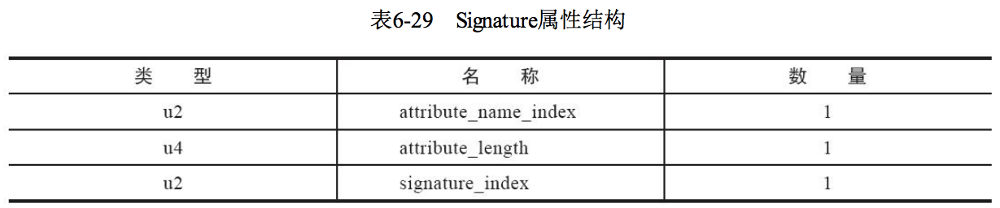

- BootstrapMethods

作用：保存invokedynamic指令引用的引导方法限定符。

位于类文件的属性表中。

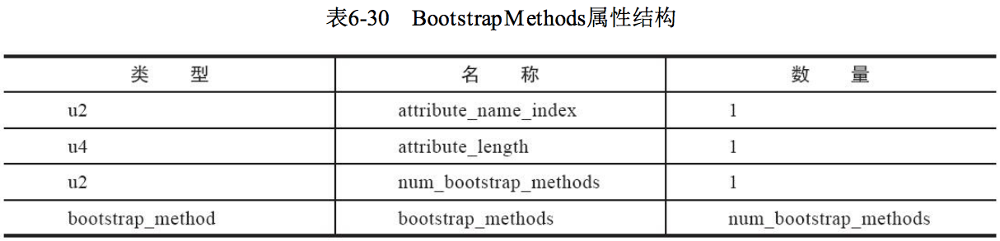

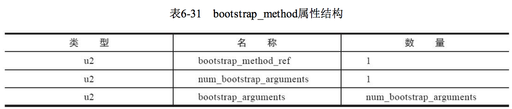

- MethodParameters 属性

作用：记录方法的各个参数名称和信息。是方法表的属性。

和 LocalVariableTable 属性的差异：LocalVariableTable 位于 Code 属性中。如果没有方法体，就不会有局部变量表。但对于抽象方法和接口方法，需要一个地方来描述参数名。

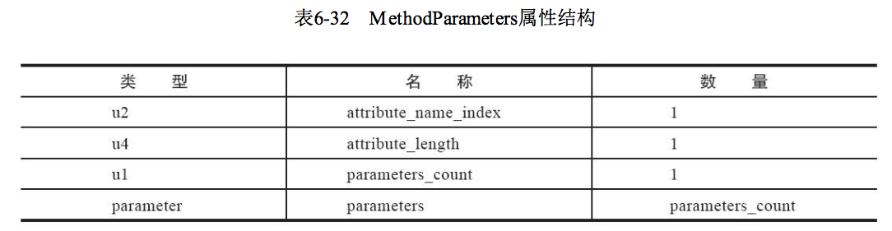

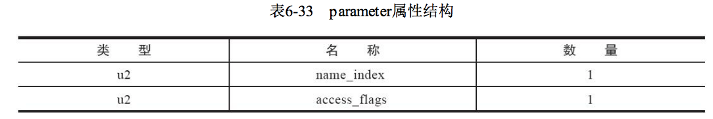

- 模块化相关属性

Module、ModulePakages、ModuleMainClass

Module

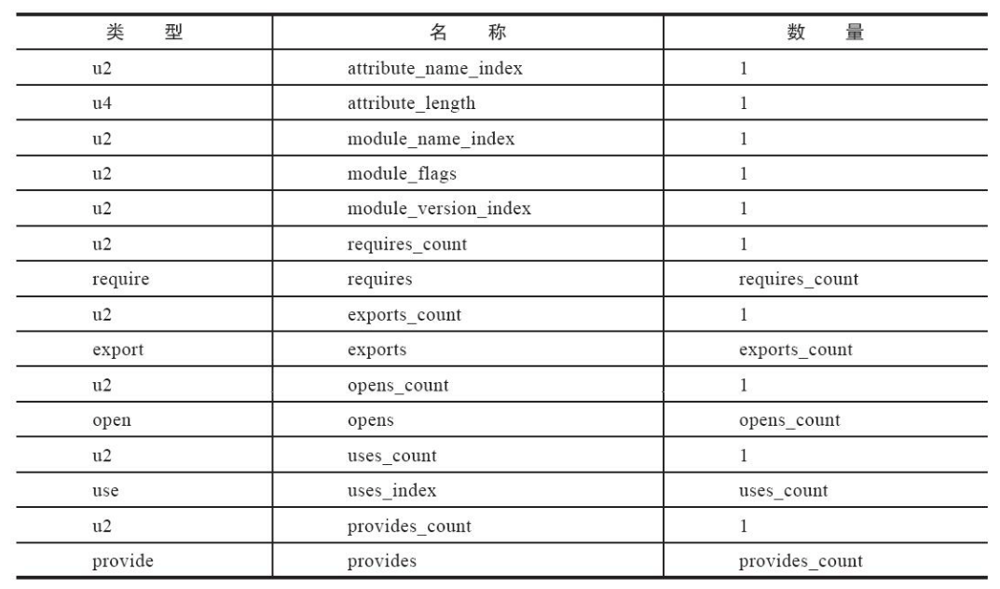

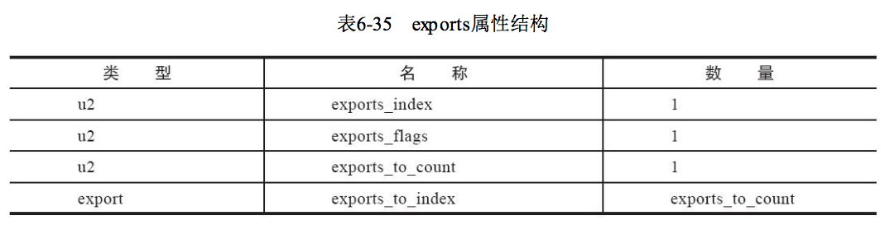

ModulePakages

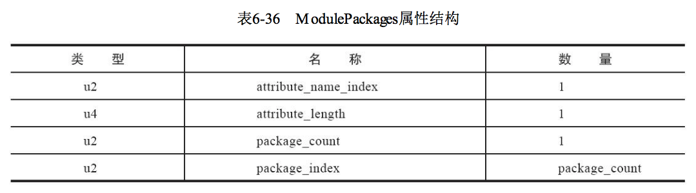

ModuleMainClass

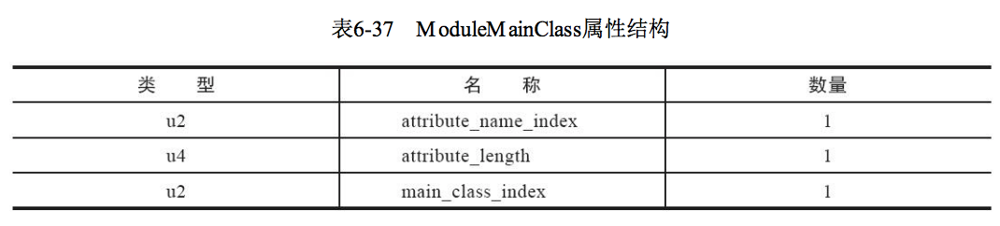

- 运行时注解相关属性

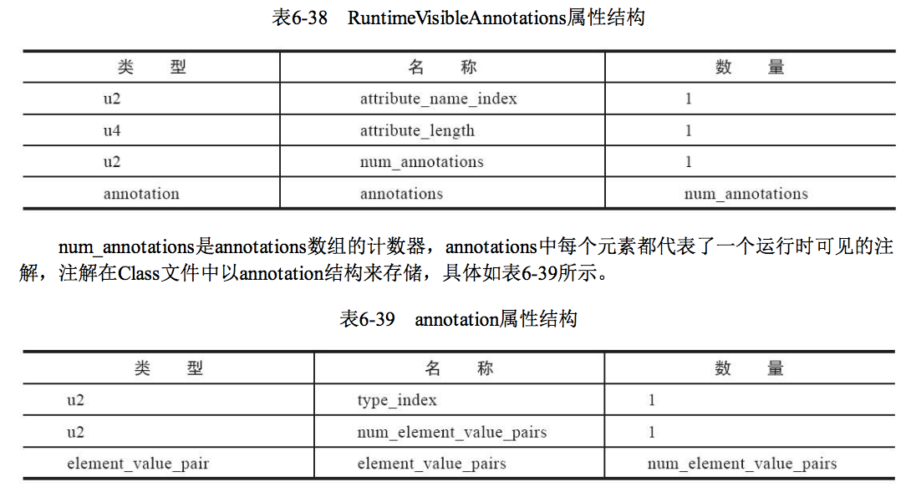

### 字节码指令

虚拟机指令的构成

1. 操作码（Opcode）。代表某种特定操作含义的数字，1字节。
2. 操作数（Operand）。此操作需要的参数。跟在操作码后面。

Java 虚拟机采用面向操作数栈而不是面向寄存器的架构，所以指令通常没有操作数，操作数放在操作数栈里。

字节码与数据类型

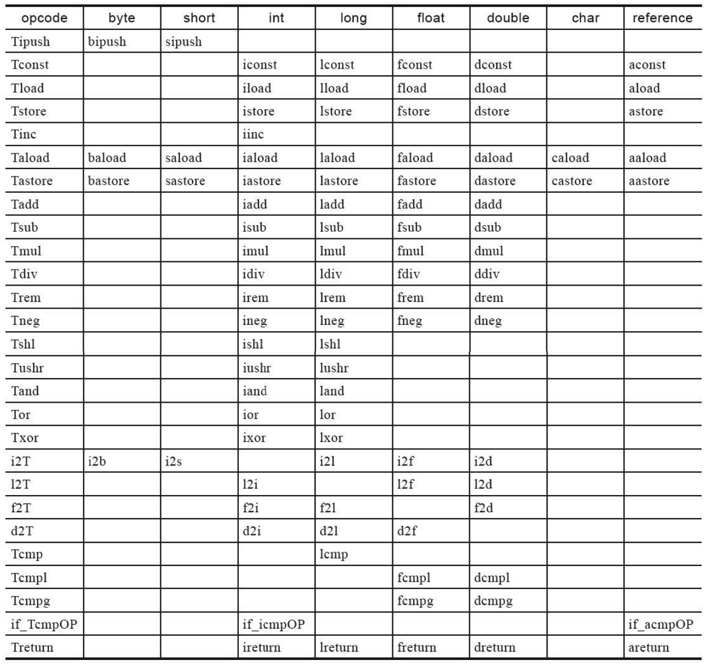

因为Java虚拟机的操作码程度只有1字节，最多只能有256个字节码。所以所有字节码都支持所有数据类型不太可能，1字节不够。所以有些操作码只提供了部分类型的指令，有一些指令可以将不支持的类型转为可支持的类型。

编译器会在编译期或运行期将byte和short类型的数据带符号扩展（Sign-Extend）为相应的int类型数据，将boolean和char类型数据零位扩展（Zero-Extend）为相应的int类型数据。大多数对于boolean、byte、short、char类型数据的操作，实际上都是使用int作为运算类型。

- load & store

Tload, Tload_[n]: 将局部变量表加载到操作数栈。

Tstore, Tstore_[n]: 将数值从操作数栈存储到局部变量表。

Tipush, ldc, ldc_w, ldc2_w, aconst_null, iconst_m1, Tconst_[T]: 将常量加载到操作数栈

wide: 扩充局部变量表的访问索引

iload_[n] 中的 n 表示指令的操作数，如 iload_0 = iload 带操作数0

- 运算指令

加法指令： Tadd (T=i, l, f, d)

减法指令：Tsub (T=i, l, f, d)

乘法：Tmul (T=i, l, f, d)

除法：Tdiv (T=i, l, f, d)

求余：Trem (T=i, l, f, d)

取反：Tneg (T=i, l, f, d)

位移：Tshl, Tshr, Tushr (T=i, l)

按位或：Tor (T=i, l)

按位异或：Txor  (T=i, l)

局部变量自增：iinc

比较：Tcmpg, Tcmpl, lcmp (T=d, f)

- 类型转换指令

java虚拟机直接支持的宽化类型转换（小范围向大范围类型的安全转换）

int -> long, float, double

long -> float, double

float -> double

窄化类型转换指令： i2T(T=b,c,s), l2i, f2i, f2l, d2T(T=i,l,f)

int, long -> 整数：丢弃除最低N字节以外的其他内容。（符号位可能发生改变）

float, double -> 为整数：NaN -> 0; 向零舍入模式取整，获得整数值v，如果v不在整数表示范围内，则取能表示的最大值或最小值。

double -> float: 最接近数舍入模式；小到无法表示则返回正负零；大到无法表示则返回正负无穷大。NaN -> NaN

窄化转换指令不会导致虚拟机抛出运行时异常。

- 对象创建与访问指令

创建类实例：new

创建数组的指令：newarray, anewarray,multianewarray

访问实例字段（非static字段）和类字段（static字段）：getfield, putfield, getstatic, putstatic

将操作数栈的值存储到数组元素中：Tastore (T=b, c, s, i, f, d, a)

取数组长度的指令：arraylength

检查类实例类型：instanceof, checkcast

- 操作数栈管理指令

将操作数栈的栈顶的一个或两个元素出栈：pop, pop2

复制栈顶的一个或两个数值并将复制的值重新压入栈顶：dup, dup2, dup_x1, dup2_x1, dup_x2, dup2_x2

将栈顶最顶端的两个数值交换：swap

- 控制转移指令

可以认为控制指令就是在有条件或无条件地修改PC寄存器的值。

条件分支：ifeq, iflt, ifle, ifne, ifgt, ifge, ifnull, ifnonnull, if_icmpeq, if_icmpne, if_icmplt, ificmpgt, if_icmpge, if_icmple, if_acmpeq, if_acmpne

复合条件分支：tableswitch, lookupswitch

无条件分支：goto, goto_w, jsr, jsr_w, ret

- 方法调用和返回指令

invokevirtual: 调用对象的实例方法，根据对象的实际类型进行分派（虚方法分派）

invokeinterface: 调用接口方法，会在运行时搜索一个实现了这个接口方法的对象，找出适合的方法进行调用

invokespecial: 调用一些需要特殊处理的实例方法，包括实例初始化方法、私有方法和父类方法。

invokestatic: 调用类方法（static方法）

invokedynamic: 在运行时动态解析出调用点限定符所引用的方法。

方法返回指令：iretrun, lreturn, freturn, dreturn, atreturn, return(void)

- 异常处理指令

抛出异常：athrow

处理异常：异常表

- 同步指令

方法级的同步是隐式的，无须通过字节码指令来控制，虚拟机可以从方法常量池中的方法表结构中的ACC_SYNCHRONIZED访问标志得知。如果方法设置了同步标志，执行线程就要求先成功吃持有管程（锁），然后才能执行方法，方法完成后，释放管程。如果方法内抛出异常，且方法内无法处理，则方法持有的管程，在运行到方法边界之外时（抛出异常前一刻），自动释放。

同步一段指令（synchronized语句块）：momitorenter, monitorexit

疑问

1. 为什么自动添加的构造方法，在常量池中有 Methodref ，TestCase自己的方法inc 没有；为什么字段m有Fieldref，但方法inc没有 Methodref。


## 虚拟机类加载机制

虚拟机的类加载机制：把描述类的数据，从Class文件加载到内存，并对数据进行校验、转换解析和初始化，最终形成可以被虚拟机直接使用的Java类型。

和编译时需要连接的语言不同，Java语言里，类型的加载、链接、初始化过程都是在程序运行期间完成的。因此，在本程序里，运行第三方组件，成为可能。

### 类加载时机

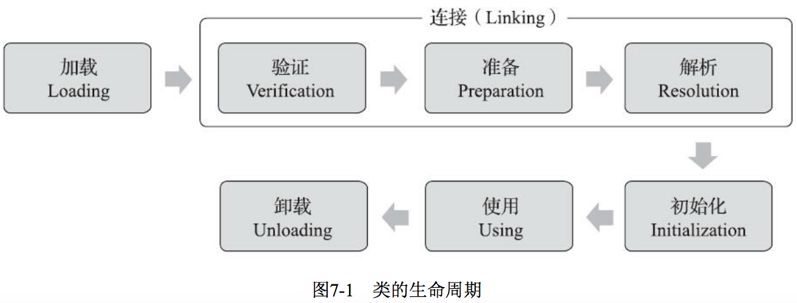

需要立即对类进行“初始化”的6个场景

1. 遇到new、getstatic、putstatic、invokestatic这四条字节码指令时。生成这4条指令的典型Java代码场景有
    - 使用new关键字实例化对象
    - 读取或设置一个类的静态字段
    - 调用一个类的静态方法
2. 使用java.lang.reflect包的方法，对类进行反射调用时
3. 初始化类，但父类没有初始化时
4. 虚拟机启动，需要初始化主类
5. 使用JDK7新加入的动态语言支持时，一个java.lang.invoke.MethodHandle实例最后的解析结果为REF_getStatic、REF_putStatic、REF_invokeStatic、REF_newInvokeSpecial四种类型的方法句柄，并且这个方法句柄对应的类没有进行初始化。
6. 一个接口中定义了JDK8新加入的默认方法，如果有这个接口的实现类发生了初始化，那接口要在其之前被初始化。

这6种场景中的行为称为对一个类型进行主动引用。除此之外，所有引用类型的方式都不会触发初始化，成为被动引用。

```java
public class SuperClass {
    static {
        System.out.println("SuperClass init!");
    }
    public static int value = 123;

    public static final String HELLOWORLD = "hello world";
}
public class SubClass extends SuperClass {
    static {
        System.out.println("SubClass init!");
    }
}

/**
* 被动使用类字段示例：
* 通过子类引用父类的静态字段，不会导致子类初始化。对于静态字段，只有直接定义这个字段的类才会被初始化。
**/
public class NotInitialization {
    public static void main(String[] args) {
        System.out.println(SubClass.value);
    }
}

/**
* 被动使用类字段示例：
* 通过数组定义来引用类，不会触发类的初始化。虚拟机会自动生成一个数组的类 [LSuperClass
**/
public class NotInitialization {
    public static void main(String[] args) {
        SuperClass[] sca = new SuperClass[10];
    }
}

/**
* 被动使用类字段示例：
* 使用类的常量不会初始化类。常量会存入常量池，本质上没有引用到它归属的类。
**/
public class NotInitialization {
    public static void main(String[] args) {
        System.out.println(SuperClass.HELLOWORLD);
    }
}
```

-XX:+TraceClassLoading 可以看到类是否加载

对接口而言，在一个接口初始化时，不要求其父接口全部完成了初始化，只有在真正使用到父接口时，才会初始化。

### 类加载的过程

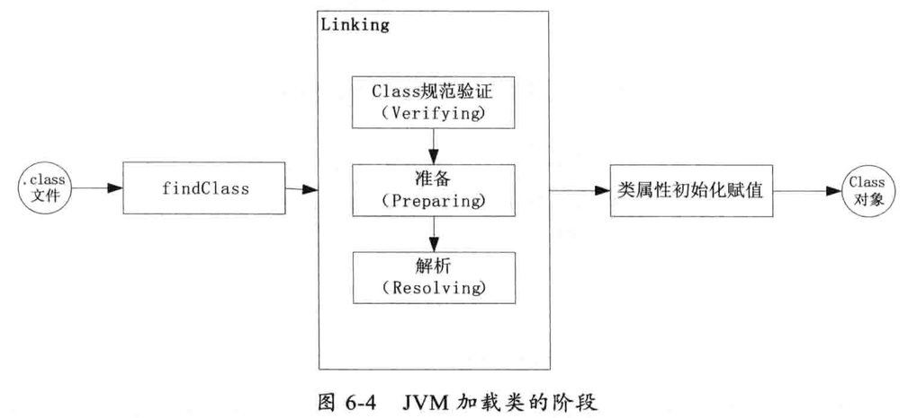

#### 加载 Loading

1. 通过一个类的全限定名来获取定义此类的二进制字节流
2. 将这个字节流代表的静态存储结构转化为方法区的运行时数据结构
3. 在内存中生成一个代表这个类的java.lang.Class对象，作为方法区这个类的各种数据的访问入口。

可以获取二进制字节流的场景

1. 从ZIP包中读取。是JAR、EAR、WAR格式的基础
2. 从网络中获取。如 Web Applet
3. 运行时计算生成。如 动态代理技术
4. 由其他文件生成。如 JSP文件生成Class文件
5. 从数据库中读取
6. 从加密文件中获取
7. 。。。

非数组类，可以自定义类加载器，自定义加载过程。

数组类，本身不通过类加载器创建，是Java虚拟机直接在内存中动态构造出来的。数组类的创建过程遵循以下原则：

1. 数组的组件类型（Component Type，数组去掉一个维度的类型）是引用类型，就通过该组件类型的类加载器递归加载。
2. 数组的组件类型不是引用类型，如，原始类型，数组被标记为与引导类加载器关联。
3. 数组类的可访问性与它的组件类型的可访问性一致，如果组件类型不是引用类型，它的数组类的可访问性将默认为public。

加载阶段结束后，Java虚拟机外部的二进制字节流，就按照虚拟机所设定的格式存储在方法区之中了。之后会实例化一个java.lang.Class类的对象，这个对象将作为程序访问方法区中的类型数据的外部接口。

#### 验证

目的：确保Class文件的字节流中包含的信息符合《Java虚拟机规范》的约束。

大致的验证过程

1. 文件格式验证

保证输入的字节流能正确解析，并存储在方法区内。后面的验证都是基于方法区的存储结构上进行的。

2. 元数据验证

对字节码描述的信息进行语义分析。比如是否继承了不被允许继承的类（被final修改的类）；类中字段是否和父类产生矛盾...

rainy：元数据验证，idea的编译器，也能发现类似的问题，比如非抽象类的抽象方法是否实现。但是idea应该还没有编译成class文件，并且存入内存吧？它是怎么做到的？难道是根据jvm规范，自己实现了一套校验规则吗？还是它默默自己编译了，然后给出了校验结果？

3. 字节码验证。

对数据流分析和控制流分析，确定程序语义是合法的、符合逻辑的。保证类的方法体在运行时不会做出危害虚拟机安全的行为。

JDK6后，很多校验辅助措施挪到了javac编译器里进行（给方法体的Code属性的属性表中新增了 StackMapTable 的属性，描述了方法开始执行时，本地变量表和操作数栈应有的状态）。

-XX:-UseSplitVerifier 可关掉这项优化。

rainy：字节码验证，StackMapTable 是怎么描述本地变量表和操作数栈应有的状态的？操作数栈不应该是动态变化的吗？难道是每一个字节码，都有一个状态记录在 StackMapTable 中吗？

4. 符号引用验证

发生在虚拟机将符号引用转化为直接引用时，这个转化动作将在解析阶段发生。

检查该类是否缺少或者被禁止访问它依赖的某些外部类、方法、字段等资源

1. 符号引用中，通过字符串描述的全限定名是否能找到对应的类
2. 指定类中是否存在符合方法的字段描述符及简单名称所描述的方法和字段
3. 符号引用中的类、字段、方法的可访问性是否可被当前类访问
4. 。。。

#### 准备

正式为类中定义的静态变量（不包括实例变量）分配内存并设置类变量初始值（没有对应的ConstantValue时，是数据类型的零值，赋值操作在类初始化阶段）的阶段。

这些变量的内存在方法区。JDK7前，在永久代实现方法区，JDK8后，类变量随着Class对象放在Java堆。

实例变量将会在对象实例化时，随着对象一起分配在Java堆中。

赋值操作，如给类变量赋值为123（准备阶段时，类变量是0）的putstatic指令是程序被编译后，存放于类构造器 `<clinit>()` 方法中。

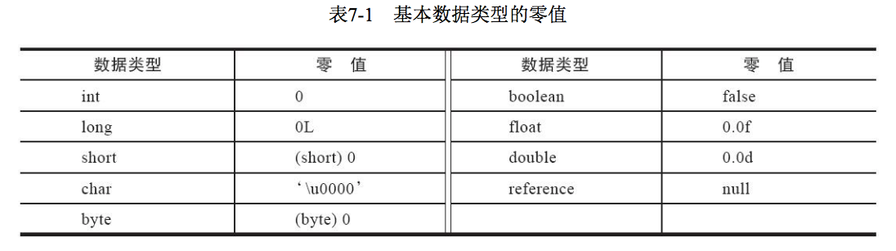

如果有 ConstantValue 属性（比如常量），就会在准备阶段被初始化为 ConstantValue 属性指定的数值。

#### 解析

Java虚拟机将常量池内的符号引用替换为直接引用的过程。

- 符号引用（Symbolic References）：符号引用以一组符号来描述所引用的目标，符号可以是任何形式的字面量，只要使用时能无歧义地定位到目标即可。符号引用和虚拟机实现的内存布局无关。符号引用的字面量形式明确定义在《Java虚拟机规范》的Class文件格式中。
- 直接引用（Direct References）：直接引用是可以直接指向目标的指针、相对偏移量或者是一个能间接定位到目标的句柄。直接引用和虚拟机实现的内存布局直接相关，直接引用的目标必定在虚拟机的内存中存在。

1. 类或接口的解析

场景：当前代码所处的类为D，要将D中的符号引用N（从未解析过）解析为类或接口C的直接引用

1) C不是数组：jvm会把N的全限定名传给D的类加载器去加载C。加载过程中，可能触发其他类的加载。一旦加载过程出现异常，则解析失败。

2) C是数组，且数组元素是对象：先按1)加载数组元素类，接着由虚拟机生成一个代表该数组维度和元素的数组对象。

3) 在解析前要进行符号引用验证，检查D是否有权限访问C，没有权限会抛出 java.lang.IllegalAccessError

2. 字段解析

先解析字段所属的类或接口 C，C 解析失败，则字段解析失败。

1) 如果 C 中包含了这个字段，则返回字段的直接引用，查找结束。

2) 如果 C 实现了接口，则从下到上递归搜索各个接口和它的父接口。如果包含了字段，则返回字段的直接引用，查找结束。

3) 如果 C 有父类，则从下到上递归搜索父类。如果包含了字段，则返回字段的直接引用，查找结束。

4) 查找失败，抛出 java.lang.NoSuchFieldError

对返回的引用鉴权，如果没有权限访问，则抛出 java.lang.IllegalAccessError

3. 方法解析

先解析方法所属的类或接口 C，C 解析失败，则方法解析失败。

1) C 是接口，则抛出 java.lang.IncompatibleClassChangeError

2) 如果 C 中包含了这个方法，则返回方法的直接引用，查找结束。

3) 如果 C 有父类，则从下到上递归搜索父类。如果包含了方法，则返回方法的直接引用，查找结束。

4) 如果 C 有接口，则从下到上递归搜索父接口。如果包含了方法，说明C是抽象类，则抛出 java.lang.AbstractMethodError，查找结束。

5) 查找失败，抛出 java.lang.NoSuchMethodError

对返回的引用鉴权，如果没有权限访问，则抛出 java.lang.IllegalAccessError

4. 接口方法解析

先解析方法所属的类或接口 C，C 解析失败，则方法解析失败。

1) C 是类，则抛出 java.lang.IncompatibleClassChangeError

2) 如果 C 中包含了这个方法，则返回方法的直接引用，查找结束。

3) 如果 C 有父接口，则从下到上递归搜索查找，直到 java.lang.Object 类。如果包含了方法，则返回方法的直接引用，查找结束。

4) 如果 C 的父接口中，有多个符合要求的方法，则返回其他中一个。但 javac 编译器可能会报错，来杜绝这种不确定性。

5) 查找失败，抛出 java.lang.NoSuchMethodError

对返回的引用鉴权（JDK9+），如果没有权限访问，则抛出 java.lang.IllegalAccessError

#### 初始化

初始化阶段就是执行类构造器 `<clinit>()` 方法的过程。`<clinit>()` 是javac编译器的自动生成物。

`<clinit>()` 方法是由编译器自动收集类中的所有类变量的赋值动作和静态语句块（static{}）中的语句合并产生的，编译器收集的顺序是由语句在源文件中出现的顺序决定的，静态语句块只能访问到定义在它之前的变量，在它之后的变量，它可以赋值，但是不能访问。

```java
public class Test {
    static {
        i = 0; // 可以赋值
        System.out.print(i); // 不能访问
    }
    static int i = 1;
}
```

Java虚拟机会保证在子类的 `<clinit>()` 方法执行前，父类的 `<clinit>()` 方法已经执行完毕。

```java
static class Parent {
    public static int A = 1;
    static {
        A = 2;
    }
}
static class Sub extends Parent {
    public static int B = A; // B == 2
}
```

如果类中没有静态语句块、对变量的赋值操作，则不用生成 `<clinit>()` 方法。

多线程对同一个类初始化，只有一个线程可以执行 `<clinit>()` 方法，其他线程会被阻塞，直到方法执行完毕。

### 类加载器

作用：通过一个类的全限定名来获取描述该类的二进制字节流。将Class字节码解析成JVM要求的格式。

每一个类加载器，都有一个独立的类名称空间。即，即时两个类来源于同一个Class文件，被同一个Java虚拟机加载，只要加载它们的类加载器不同，那这两个类就必定不相等。

```java
public class ClassLoaderTest {
    public static void main(String[] args) throws Exception {
        ClassLoader myLoader = new ClassLoader() {
            @Override
            public Class<?> loadClass(String name) throws ClassNotFoundException {
                try {
                    String fileName = name.substring(name.lastIndexOf(".") + 1) + ".class";
                    InputStream is = getClass().getResourceAsStream(fileName);
                    if (is == null) {
                        return super.loadClass(name);
                    }
                    byte[] b = new byte[is.available()];
                    is.read(b);
                    return defineClass(name, b, 0, b.length);

                } catch (IOException e) {
                    throw new ClassNotFoundException(name);
                }
            }
        };
        Object obj = myLoader.loadClass("org.fenixsoft.classloading.ClassLoaderTest").newInstance();
        System.out.println(obj.getClass()); // org.fenixsoft.classloading.ClassLoaderTest
        System.out.println(obj instanceof org.fenixsoft.classloading.ClassLoaderTest); // false
    }
}
```

- 双亲委派模型

在Java虚拟机看来，只有两种类加载器

1. 启动类加载器（Bootstrap ClassLoader），使用C++语言实现，是虚拟机自身的一部分
2. 其他类加载器，使用Java语言实现，独立存在于虚拟机外部，并全部继承自抽象类 java.lang.ClassLoader

在Java开发人员看来，有

1. 启动类加载器（Bootstrap ClassLoader），负责加载存放在 `<JAVA_HOME>/lib` 目录，或者被 `-Xbootclasspath` 参数所指定的路径中存放的，Java虚拟机可识别的类库。启动类加载器无法被java程序直接引用，用户自定义的类加载器如果需要委托启动类加载器去处理，直接使用null即可。
2. 扩展类加载器（Extension ClassLoader），负责加载存放在 `<JAVA_HOME>/lib/ext` 目录，或者被 `java.ext.dirs` 系统变量所指定的路径中的类库。由Java代码实现，sun.misc.Launcher$ExtClassLoader。
3. 应用程序类加载器（Application Class Loader），或系统类加载器，负责加载用户类路径（ClassPath）上所有的类库。由Java代码实现，sun.misc.Launcher$AppClassLoader, 是默认的类加载器。
4. 自定义的类加载器

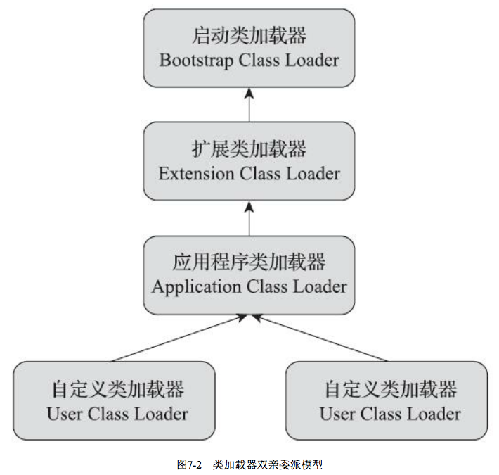

在findClass()方法中，写类加载逻辑。loadClass() 保证了双亲委派模型的实现：先使用父类加载器，加载失败再调用findClass()加载类。

(不推荐)线程上下文加载器（Thread Context ClassLoader），通过 java.lang.Thread 类的 setContextClassLoader() 方法进行设置。创建线程时，默认会从父线程继承类加载器。如果应用程序全局范围内都没有设置过，就默认是应用程序类加载器。

- OSGi

OSGi 通过类加载器实现热部署（把java模块化，只替换或更新某个模块，而不需要重新启动JVM）。

实现原理：每个模块（OSGi中成为Bundle）都有一个自己的类加载器，当需要更换一个Bundle时，就把Bundle连通类加载器一起替换掉。

OSGi不再使用双亲委派模型的树状结构，而是网状结构。当收到类加载请求时，OSGi的类搜索顺序如下：

1. 将java.* 开头的类，委派给父类加载器加载
2. 否则，将委派列表名单内的类，委派给父类加载器加载
3. 否则，将Import列表中的类，委派给Export这个类的Bundle的类加载器加载。
4. 否则，查找当前Bundle的Classpath，使用自己的类加载器加载。
5. 否则，查找类是否在自己的Fragment Bundle中，如果在，则委派给Fragment Bundle的类加载器加载
6. 否则，查找Dynamic Import列表的Bundle，委派给对应Bundle的类加载器加载。
7. 否则，类查找失败。

### Java 模块化系统

java模块化实现了可配置的封装隔离机制，定义包含的内容

- 依赖其他模块的列表
- 导出的包列表，即其他模块可以使用的列表
- 开放的包列表，即其他模块可反射访问模块的列表。
- 使用的服务列表
- 提供服务的实现列表。

模块可以声明对其他模块的显示依赖，jvm在启动时就能验证是否缺少了必须的依赖，有缺失就直接失败，而不用等到运行时要用到了才报异常。

public的类型不再是全局公开了，需要明确声明哪些public的类型可以被哪些模块访问。

兼容性

为兼容传统的类路径查找机制，提出了与类路径（ClassPath）相对应的模块路径（ModulePath）的概念。即，某个类库到底是模块还是传统的JAR包，只取决于它存放在哪种路径上。

- JAR文件在类路径的访问规则：所有类路径下的JAR文件及其他资源，都被视为自动打包在一个匿名模块（Unnamed Module）里。
- 模块在模块路径的访问规则：模块路径下的具名模块（Named Module）只能访问到它依赖定义中列明依赖的模块和包，匿名模块里的内容对具名模块不可见。即具名模块看不见传统jar包的内容。
- JAR文件在模块路径的访问规则：会变成一个自动模块（Automatic Module），默认依赖于整个模块路径中的所有模块，也默认导出自己所有的包。

模块化下的类加载器

发生的变化

1. 扩展类加载器（Extension Class Loader）被平台类加载器（Platform Class Loader）取代。

模块化后的JDK，天然支持扩展，rt.jar和tools.jar被拆分成了数十个JMOD文件，就无须再保留 [JAVA_HOME]/lib/ext 目录。同时jre目录也不再需要，因为可以随时组合构建出程序运行所需的jre来。

```sh
# 程序只是用 java.base 模块，则jre为
jlink -p $JAVA_HOME/jmods --add-modules java.base --output jre
```

2. 平台类加载器和应用程序类加载器都不再派生自 java.net.URLClassLoader，而是继承于 jdk.internal.loader.BuiltinClassLoader。启动类加载器现在是Java虚拟机内部和Java类库协作实现的类加载器，但是为了兼容，是用时还是用null代替。

3. 类加载的委派关系发生了变动。平台和应用程序类加载器收到加载请求，在委派给父加载器前，要先判断该类是否能够归属到某一个系统模块中，如果可以，则优先委派给负责那个模块的加载器。

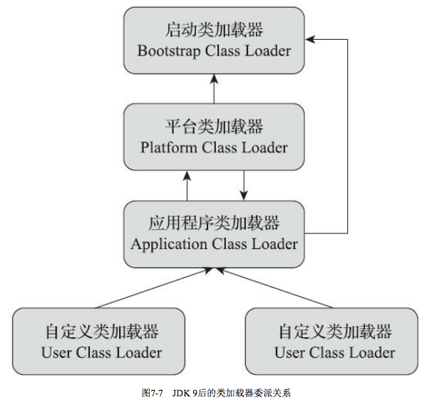

## 虚拟机字节码执行引擎

### 运行时栈帧结构

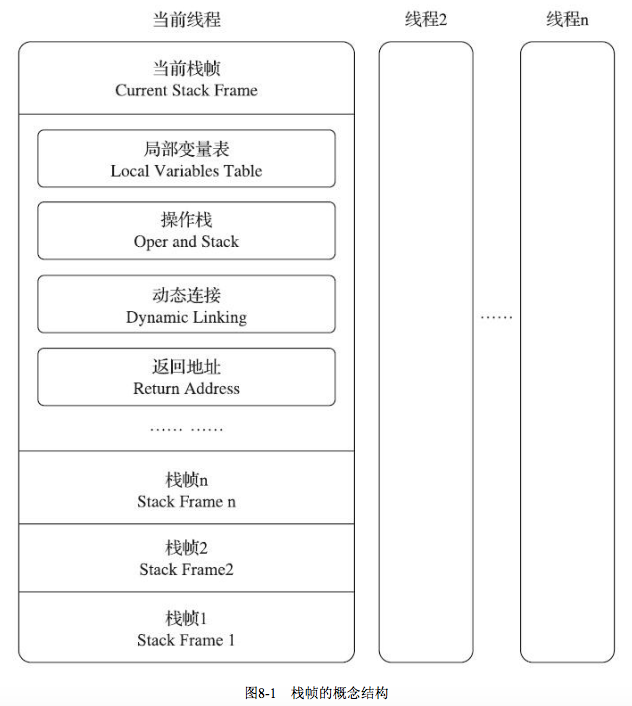

局部变量表 Local Variables Table

用于存放方法参数和方法内部定义的局部变量。以变量槽为最小单位，可以存放一个32位以内的数据类型。如果执行的是实例方法，那局部变量表中第0位索引的变量槽默认是用于传递方法所属对象实例的引用。然后分配参数表，再分配其余局部变量。

局部变量不像类变量一样存在“准备阶段”，不会给变量赋初始化的值。

最大值在编译时被写入到了Code属性的max_locals数据项内。

操作数栈 Operand Stack

最大深度在编译时被写入到了Code属性的max_stacks数据项内。栈内的元素可以是任意Java数据类型。32位占的栈容量为1，64位为2。

在JVM的实现里，会让2个方法的栈帧出现一部分的重叠：让下面栈帧的部分操作数栈与上面栈帧的部分局部变量表重叠在一起。既节省空间，又在方法调用时，直接共享了一部分数据。

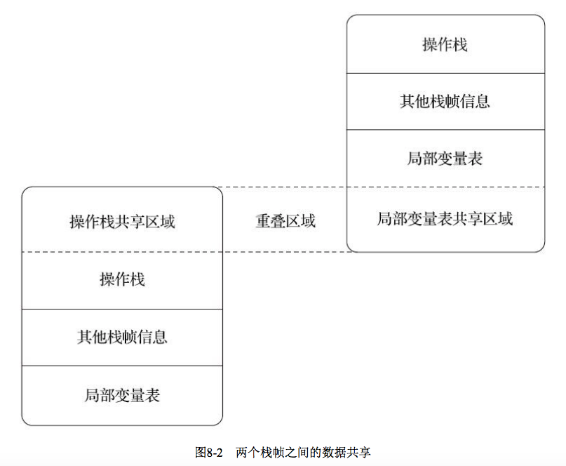

动态连接

每个栈帧都包含一个指向运行时常量池中该栈帧所属方法的引用，为了支持方法调用过程中的动态连接。

方法返回地址

方法退出的过程实际上等同于把当前栈帧出栈，退出时可能执行的操作有：

1. 恢复上层方法的局部变量表和操作数栈（rainy：为什么被调方法，还会操作调用方法的栈帧？）
2. 把返回值压入调用者栈帧的操作数栈中
3. 调整pc计数器的值，指向方法调用指令后面的一条指令

### 方法调用

方法调用阶段唯一的任务就是确定被调用方法的版本（即调用哪个方法），不涉及方法内部的具体运行过程。

Class文件的编译过程不包含传统程序语言编译的连接步骤，一切方法调用在Class文件里面存储的都只是符号引用，而不是实际运行时内存布局中的入口地址。某些调用需要在类加载期间，甚至运行期间才能确定目标方法的直接引用。

解析

解析：编译器可知，运行期不可变的方法，在类加载的时候，就可以把符号引用解析为该方法的直接用引用。这些方法统称为“非虚方法”，这类方法的调用成为解析。

方法调用字节码指令有5种：

1. invokestatic：调用静态方法
2. invokespecial：调用实例构造器 `<init>()` 方法，私有方法和父类中的方法。
3. invokevirtual：调用所有的虚方法
4. invokeinterface：调用接口方法，会在运行时再确定一个实现该接口的对象。
5. invokedynamic：先在运行时动态解析出调用点限定符所引用的方法，然后再执行该方法。

非虚方法（使用 invokestatic 和 invokespecial 调用）：

1. 静态方法
2. 私有方法
3. 实例构造器
4. 父类方法
5. 被final修饰的方法 （invokevirtual 调用）

解析调用是一个静态的过程，在编译期间就完全确定。分派（Dispatch）调用可能是静态的，可能是动态的，分为单分派和多分派。

分派

- 静态分派

静态类型：变量对外展现的类型，比如某接口类型、某父类型。

实际类型：变量真实的类型，比如实现了接口的类的类型，某子类的类型。

所有依赖静态类型来决定方法执行版本的分派动作，都称为静态分派。如，方法重载。静态分派发生在编译阶段，不是虚拟机来执行的。编译器在重载时是通过参数的静态类型而不是实际类型决定会使用哪个重载版本。

变长参数的重载优先级是最低的。

- 动态分派

动态分派：在运行期间根据实际类型确定方法执行版本的分派过程。和重写关系很大

invokevirtual 指令的运行时解析过程

1. 找到操作数栈顶的第一个元素所指向的对象的实际类型，记作C。
2. 如果在类型C中找到与常量中的描述符和简单名称都相符的方法，则进行访问权限校验，如果通过则返回这个方法的直接引用，查找过程结束；不通过则返回java.lang.IllegalAccessError异常
3. 否则，按照继承关系从下往上依次对C的各个父类进行第二步的搜索和验证过程。
4. 如果始终没有找到合适的方法，则抛出 java.lang.AbstractMethodError 异常

```java
/**
* 字段不参与多态
**/
public class FieldHasNoPolymorphic {
    static class Father {
        public int money = 1;

        public Father() {
            money = 2;
            showMeTheMoney();
        }

        public void showMeTheMoney() {
            System.out.println("I am Father, i have $" + money);
        }
    }

    static class Son extends Father {
        public int money = 3;

        public Son() {
            money = 4;
            showMeTheMoney();
        }

        public void showMeTheMoney() {
            System.out.println("I am Son, i have $" + money);
        }
    }

    public static void main(String[] args) {
        Father gay = new Son();
        System.out.println("This gay has $" + gay.money);
    }
}
// 输出
// I am Son, i have $0    （调用父类的构造方法，showMeTheMoney是一次虚方法调用，实际执行的子类的showMeTheMoney。此时子类的money还没有赋值
// I am Son, i have $4    （调用子类的showMeTheMoney
// This gay has $2        （根据静态类型访问到父类的money
```

- 单分派和多分派

方法的宗量：方法的接收者（rainy：哪个类型来执行方法？）与方法的参数。

单分派：根据一个宗量对目标方法进行选择。

多分派：基于多于一个宗量对目标方法进行选择。

Java静态多分派、动态单分派。

- 虚拟机动态分派的实现

为类型在方法区中建立一个虚方法表（Virtual Method Table，vtable），虚方法表中存放着各个方法的实际入口地址。为了程序实现方便，具有相同签名的方法，在父类，子类的虚方法表中都应当具有一样的索引序号。虚方法表一般在类加载的连接阶段进行初始化，准备了类的变量初始值后，虚拟机会把该类的虚方法表也一同初始化完毕。

### 动态类型语言支持

动态类型语言：类型检查的主体过程是在运行期而不是编译器进行。

java.lang.invoke 包

提供一种新的动态确定目标方法的机制，称为“方法句柄”（method handle）。类似于 C/C++ 里的函数指针。

```java
import java.lang.invoke.MethodHandle;
import java.lang.invoke.MethodType;

import static java.lang.invoke.MethodHandles.lookup;

public class MethodHandleTest {
    static class ClassA {
        public void println(String s) {
            System.out.println(s);
        }
    }

    public static void main(String[] args) throws Throwable {
        Object obj = System.currentTimeMillis() % 2 == 0 ? System.out : new ClassA();
        getPrintlnMH(obj).invokeExact("icyfenix");
    }

    private static MethodHandle getPrintlnMH(Object reveiver) throws Throwable {
        MethodType mt = MethodType.methodType(void.class, String.class);
        return lookup().findVirtual(reveiver.getClass(), "println", mt).bindTo(reveiver);
    }
}

void sort(List list, MethodHandle compare)
```

MethodHandle 在模拟字节码层次的方法调用，在 MethodHandles.Lookup上的3个方法 findStatic(), findVirtual(), findSpecial 是为了对应 invokestatic, invokevirtual & invokeinterface, invokespecial 这几条字节码指令的执行权限校验行为。服务于所有运行在Java虚拟机之上的语言。

invokedynamic 指令

作用：把查找目标方法的决定权从虚拟机（编译时就决定了方法属于哪个类型）转嫁到用户代码之中（对象有目标方法就可以调用成功）。

含有 invokedynamic 指令的位置被称为 “动态调用点”，第一个参数是 CONSTANT_InvokeDynamic_info 常量，里面包含

1. 引导方法 Bootstrap Method：固有参数，返回值是 java.lang.invoke.CallSite 对象，代表了真正要执行的目标方法调用
2. 方法类型 MethodType
3. 名称

### 基于栈的字节码解释执行引擎

在 Java 语言中，javac编译器完成了源代码经过词法分析、语法分析到抽象语法树，再遍历语法树生成线性的字节流的过程。

- Tomcat

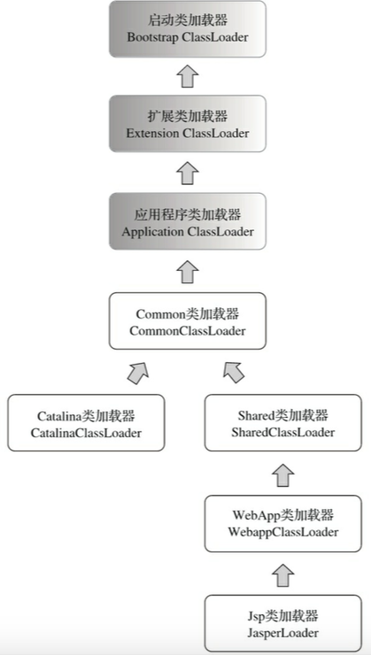

Tomcat使用类路径来完成Java类的隔离和共享。不同webapp使用的不同版本的类库需要隔离，使用相同版本的类库需要共享（防止方法区内存占用过大）

Common 类加载器：加载/common/ 路径，Tomcat和所有webapp都能访问

Catalina 类加载器：加载 /server/ 路径，仅Tomcat能访问

Shared 类加载器：加载 /shared/ 路径，所有webapp都能访问

Webapp 类加载器：加载 /WebApp/WEB-INF/ 路径，仅当前web应用能访问

Tomcat6 后，默认不使用 Shared 和 Catalina 类加载器，需要配置才能生效。

- OSGi

Open Service Gateway Initiative

OSGi 的模块称为Bundle，可以声明依赖的Package和允许导出发布的Package。对某个Package类的加载动作，都会委派给发布它的Bundle类加载器去完成。

- 动态代理

字节码生成技术

```java
public class DynamicProxyTest {
    interface IHello {
        void sayHello();
    }

    static class Hello implements IHello {
        @Override
        public void sayHello() {
            System.out.println("hello world");
        }
    }

    static class DynamicProxy implements InvocationHandler {
        Object originalObj;

        Object bind(Object originalObj) {
            this.originalObj = originalObj;
            return Proxy.newProxyInstance(originalObj.getClass().getClassLoader(), originalObj.getClass().getInterfaces(), this);
        }

        @Override
        public Object invoke(Object proxy, Method method, Object[] args) throws Throwable {
            System.out.println("welcome");
            return method.invoke(originalObj, args); // 调用原方法
        }
    }

    public static void main(String[] args) {
        // 生成动态代理类的class文件
        System.getProperties().put("sun.misc.ProxyGenerator.saveGeneratedFiles", "true");
        IHello hello = (IHello) new DynamicProxy().bind(new Hello());
        hello.sayHello();
    }
}
```

- backport tools

把高版本JDK中编写的代码放到低版本JDK环境中去部署使用。

## 前端编译与优化

前端编译器：JDK的javac（语法糖，提高编码效率）

即时编译器：HotSpot虚拟机的C1、C2编译器（优化程序执行效率）

提前编译器：JDK的Jaotc、GNU Compiler for Java（GCJ）

### Javac编译器

编译过程

1. 准备过程：初始化插入式注解处理器
2. 解析与填充符号表过程
    1. 词法、语法分析。将源代码的字节流转变为标记集合，构造出抽象语法树。
    2. 填充符号表。产生符号地址和符号信息
3. 插入式注解处理器的注解处理。如果产生了新的符号，就需要转回到第二步处理新符号。
4. 分析与字节码生成过程
    1. 标注检查。对语法的静态信息进行检查。
    2. 数据流及控制流分析。对程序动态运行过程进行检查。
    3. 解语法糖。将简化代码编写的语法糖还原为原有的形式。
    4. 字节码生成。将前面各个步骤所生成的信息转化成字节码。

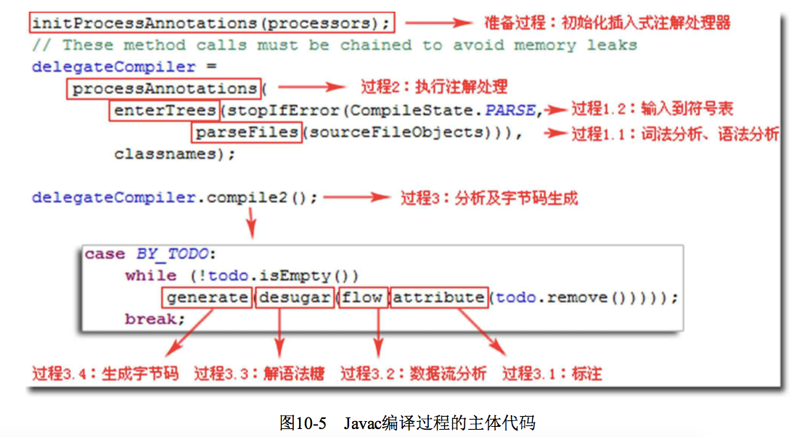

#### 解析与填充符号表

- 词法、语法分析

词法分析：将源代码的字符流转变为标记(Token)集合。在Javac中由com.sun.tools.javac.parser.Scanner实现。

语法分析：根据标记序列构造抽象语法树(Abstract Syntax Tree, AST)的过程。AST的每个节点都代表程序代码中的一个语法结构(Syntax Construct)，比如包、类型、修饰符、运算符、接口、返回值、注释等。在Javac中由com.sun.tools.javac.parser.Parser 实现。

编译器后续的操作都建立在抽象语法树之上。

- 填充符号表

符号表(Symbol Table): 由一组符号地址和符号信息构成的数据结构，类似哈希表。在Javac中由com.sun.tools.javac.comp.Enter 实现。

#### 注解处理器

插入式注解

注解在设计上原本和普通java代码一样，都只会在程序运行期间发挥作用。但插入式注解可以提前至编译期对代码中的特定注解进行处理，可以看做是一组编译器的插件。这些插件工作时，允许增查改语法树中的任意元素，而此时编译器会回到解析和填充符号表的过程，每次循环称一次轮回（Round）。

初始化过程在 initProcessAnnotations() 中完成。

#### 语义分析与字节码生成

语义分析：对结构上正确的源程序进行上下文相关性质的检查，如类型检查、控制流检查、数据流检查。Javac编译过程中，语义分析分为

1. 标注检查。

检查变量使用前是否已声明、变量与赋值的数据类型是否匹配等。会进行常量折叠的优化，如 `int a = 1 + 2` 会被优化为 `int a = 3`

由 com.sun.tools.javac.comp.Attr 和 com.sun.tools.javac.comp.Check 实现

2. 数据及控制流分析

```java
// 有 final  
public void foo(final int arg) {
    final int var = 0;
    // do something
}
// 无 final  
public void foo(int arg) {
    int var = 0;
    // do something
}
// 两段代码的class文件一模一样。final仅在编译时校验。
```

由 com.sun.tools.javac.comp.Flow 类完成

3. 解语法糖

Syntactic Sugar：指在计算机语言中添加某种语法，这种语法对语言的编译结果和功能没有实际影响，但却能更方便程序员使用该语言。

java虚拟机并不直接支持这些语法，他们在编译阶段被还原成原始的基础语法结构，这个过程成为解语法糖。

由 desugar() 方法触发，在 com.sun.tools.javac.comp.TransTypes 类和 com.sun.tools.javac.comp.Lower 类完成。

4. 字节码生成

由 com.sun.tools.javac.jvm.Gen 类来完成。还进行了少量的代码添加和转换工作，比如实例构造器方法和类构造器方法。

由 com.sun.tools.javac.jvm.ClassWriter 类的 writeClass() 方法输出字节码。

### Java 语法糖

Java泛型：只在源码中存在，在编译后的字节码文件中，全部泛型被替换成原来的裸类型，并在相应的地方插入了强制类型转换代码。

因此以下语法不支持

```java
public class TypeErasureGenerics<E> { 
    public void doSomething(Object item) {
        if (item instanceof E) { // 不支持
            // ... 
        }
        E newItem = new E(); // 不支持
        E[] itemArray = new E[10]; // 不支持
    }
}
```

自动装箱、拆箱

"==" 运算在遇到算术运算的情况下，会自动拆箱；2个数据类型不相同时，equals会返回false

## 后端编译和优化

分层编译

- 0层：程序纯解释执行，并且解释器不开启性能监控功能（Profiling）
- 1层：使用客户端编译器将字节码编译为本地代码来运行，进行简单可靠的稳定优化，不开启性能监控功能
- 2层：使用客户端编译器执行，进开启方法及回边次数统计等有限的性能监控功能。
- 3层：使用客户端编译器执行，开启全部性能监控，收集如分支跳转、虚方法调用版本等全部的统计信息。
- 4层：使用服务端编译器将字节码编译为本地代码来运行，会开启更多编译耗时更长的优化，还会根据性能监控信息进行一些不可靠的激进优化。

实施分层编译后，解释器、客户端编译器、服务端编译器会同时工作，热点代码可能会被多次编译，用客户端编译器获取更高的编译速度，用服务端编译器获取更好的编译质量。

热点探测：判断某段代码是不是热点代码。判断方式如下：

1. 基于采样的热点探测。周期性地检查各个线程的调用栈顶，如果发现某个方法经常出现在栈顶，则这个方法就是热点方法。优点：简单。缺点：容易受线程阻塞或其他外界因素影响。
2. 基于计数器的热点探测。为每个方法或代码块建立计数器，统计执行次数，超过某个阈值，则判定为热点方法。

回边计数器：回边是指字节码中遇到控制流向后跳转的指令。

### 编译器优化技术

- 方法内联

- 逃逸分析

定义：当一个对象在方法内被定义后，它可能被外部方法所引用，称为方法逃逸；被外部线程访问，称为线程逃逸。有以下优化：

1. 栈上分配：不逃逸的对象，可以在方法栈上分配，随栈帧出栈而销毁。
2. 标量替换：若一个数据已经无法再分解成更小的数据表示了，则可以称为标量。如java中的原始类型。否则就成为聚合量，如java中的对象。将java对象拆散，将其成员变量恢复为原始类型访问的过程，称为标量替换。不逃逸的对象，在程序真正执行时，可能不会被创建，而是创建它的若干个成员变量来代替。
3. 同步消除：不逃逸的变量，不存在同步问题，对这个变量实施的同步措施可以被安全消除。

- 公共子表达式消除

定义：一个表达式E之前已经被计算过了，并且到现在E中所有变量的值都没有发生变化，那么E的这次出现就称为公共子表达式。不需要再花时间重新计算，直接使用之前的计算结果即可。如果这种优化发生在程序基本块内，成为局部公共子表达式消除；如果优化范围涵盖了多个基本块，称为全局公共子表达式消除。

- 数组边界检查消除

## Java内存模型与线程

背景：处理器计算速度比从内存读写速度快的多，而一个任务不可避免的有很多读写内存的情况。

解决办法：增加高速缓存，将内存中的数据存储到缓存里，处理器从缓存读取数据。计算结束后，再从缓存写入内存。

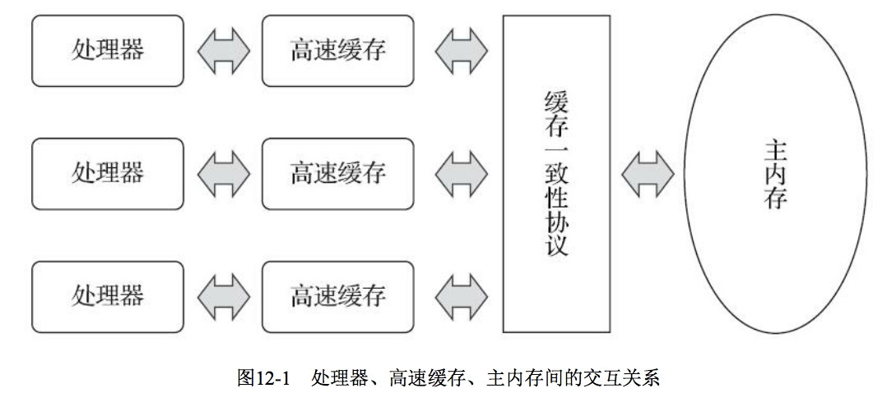

为了使处理器内部的运算单元能尽量被充分利用，处理器可能会对输入代码进行乱序执行(out of order execution)优化，处理器会在计算之后将乱序执行的结果重组，保证该结果与顺序执行的结果是一致的，但不保证程序中各个语句计算的先后顺序与输入代码中的顺序一致，因此如果存在一个计算任务依赖另一个计算任务的中间结果，那么其顺序性不能靠代码的先后顺序来保证。JVM的即时编译器中也有指令重排的优化。

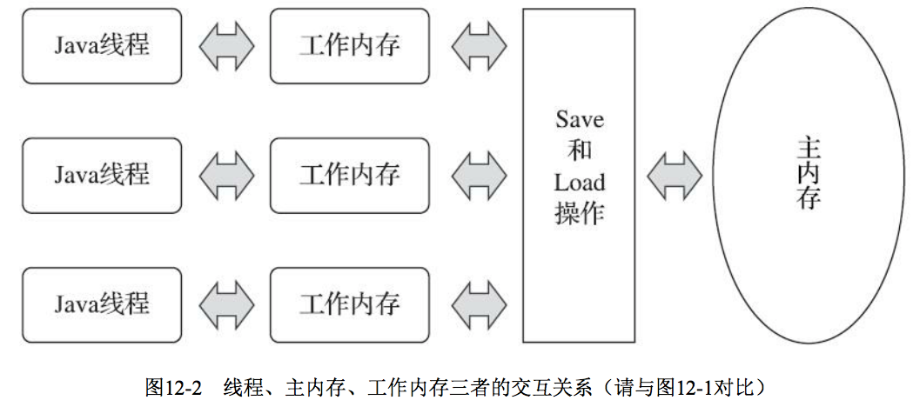

线程对变量的所有操作（读取、赋值等）都必须在工作内存中进行，而不能直接读写主内存中的数据。

Java内存模型定义了以下8种操作来完成变量从主内存拷贝到工作内存，从工作内存同步回主内存。

- lock(锁定): 作用于主内存，把一个变量标识为一条线程独占的状态。
- unlock(解锁): 作用于主内存，释放一个被锁定的变量
- read(读取): 作用于主内存，把一个变量的值从主内存传输到线程的工作内存中。
- load(载入): 作用于工作内存，把read变量从主内存中得到的变量值放入工作内存的变量副本中。
- use(使用): 作用于工作内存，把变量的值传递给执行引擎。
- assign(赋值): 作用于工作内存，把从执行引擎接收到的值赋给工作内存的变量
- store(存储): 作用于工作内存，把变量的值传递到主内存中。
- write(写入): 作用于主内存，把store操作从工作内存中得到的变量的值放入主内存的变量中。

问：store是把工作内存的变量传到主内存，write是把主内存的值，传给主内存的变量吗？是两步操作吗？为什么不直接从工作内存中放到主内存的变量里呢？

#### volatile 变量

背景：

每个线程有自己的本地内存，导致看到同一个变量的值不同

当多个指令没有关联关系时，可能将多个指令给不同处理器处理，然后再组合起来（指令重排）。这种情况：A线程判断a为true，对变量b做下一步操作，B线程对b变量赋值，再将a变量置为true。此时B线程可能先将a设置成true，再对b进行赋值。A判断a为true时，拿到的b的值是赋值前的。

volatile的作用：

volatile 变量只能保证可见性，即所有线程看到的值都一样。volatile禁止指令重排序优化，即volatile变量前后的代码不会被重排序。

一条字节码指令不一定是原子操作。它在执行解释时，可能要运行很多行代码。如果是编译执行，可能会转化成若干条本地机器码指令。

#### 原子性、可见性与有序性

java内存模型保证了原子性、可见性与有序性的特征

操作 read,load,assign,use,store,write 保证了基本数据类型的访问读写是具备原子性的。synchronized 关键字保证了被修饰的代码块是原子性的。

volatile synchronized（对一个变量执行unlock操作前，必须把此变量同步回主内存中） final（final字段一旦被初始化成功，并且没有发生this逃逸，那么其他线程就能看到final字段的值） 实现了可见性。

如果在本线程内观察，所有操作都是有序的；如果在一个线程中观察另一个线程，所有操作都是无序的（指令重排和工作内存与主内存同步延迟导致）。volatile 和 synchronized 保证有序性。

#### 先行发生原则

不使用同步手段保障就能成立的先行发生规则：

- 程序次序规则(Program Order Rule): 在一个线程内，按照控制流顺序，书写在前面的操作先于书写在后面的操作。
- 管程锁定规则(Monitor Lock Rule): 一个unlock操作先行发生于后面对同一个锁的lock操作。
- volatile变量规则(Volatile Variable Rule): 对一个 volatile 变量的写操作先行发生于后面对这个变量的读操作。
- 线程启动规则(Thread Start Rule): Thread 对象的 start() 方法先行发生于此线程的每一个动作。
- 线程终止规则(Thread Termination Rule): 线程中的所有操作都先行发生于对此线程的终止检测。可以通过 Thread::join(), Thread::isAlive()的返回值来检测线程是否终止。
- 线程中断规则(Thread Interruption Rule): 对线程 interrupt 方法的调用先于被中断线程的代码检测到中断事件的发生。
- 对象终结规则(Finalizer Rule): 一个对象的初始化完成先行发生于它finalize()方法的开始
- 传递性(Transitivity): 如果操作A先行发生于操作B，操作B先发生于操作C，那么A先发生于C。


### Java与线程

线程是Java里进行处理器调度的最基本单位。

实现线程主要有三种方式：使用内核线程实现（1:1实现），使用用户线程实现（1:N实现），使用用户线程加轻量级进程混合实现（N:M实现）。

- 内核线程

内核线程(Kernel-Level Thread, KLT) 就是直接由操作系统内核(Kernel)支持的线程，这种线程由内核来完成线程切换，内核通过操纵调度器（Scheduler）对线程进行调度，并负责将线程的任务映射到各个处理器上。每个内核线程可以视为内核的一个分身，这样操作系统就有能力同时处理多件事情。

程序一般不直接使用内核进程，而是使用内核进程的一种高级接口：轻量级进程（Light Weight Processs, LWP），就是我们通常意义上所讲的线程。每个轻量级进程都由一个内核线程支持，因此只有先支持内核线程，才有轻量级进程。两者之间1:1对应。

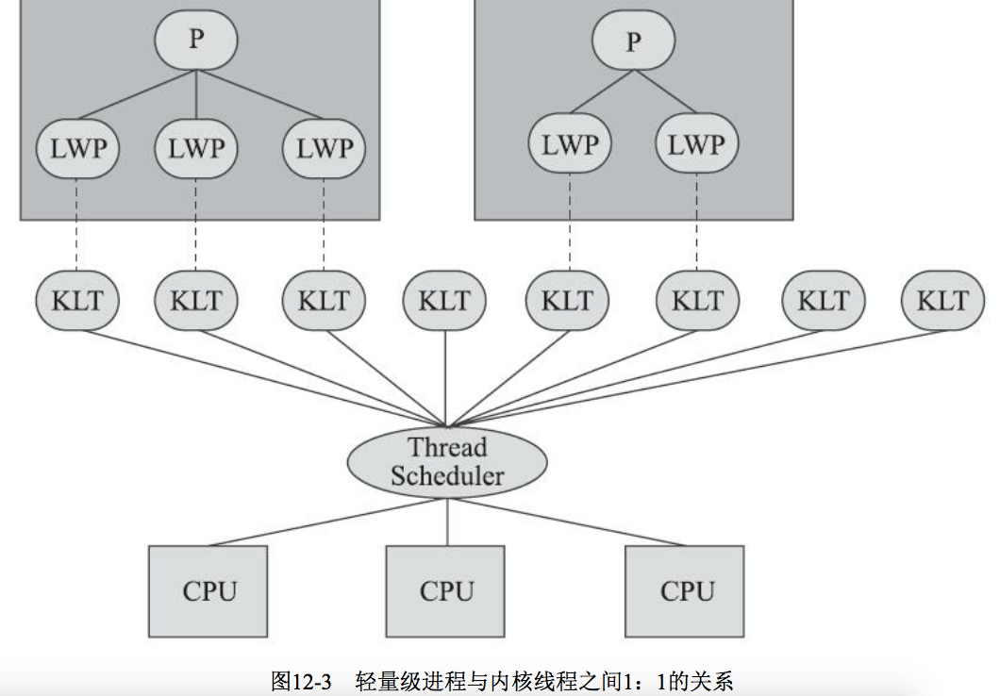

缺点：

1. 每次线程操作，如创建、析构、同步，都需要进行系统调用，需要在用户态和内核态中来回切换。
2. 每个轻量级进程都需要内核线程的支持，需要消耗内核资源，而且数量有限

- 用户线程

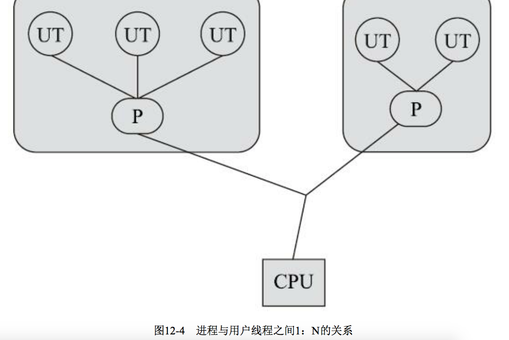

优点：

1. 无需系统调用，线程操作比较廉价
2. 支持大规模用户线程并发。

缺点：

1. 需要由用户程序去处理线程的创建、销毁、切换和调度。“阻塞如何处理”，“如何将线程映射到其他处理器”的问题，很难解决。

- 混合实现

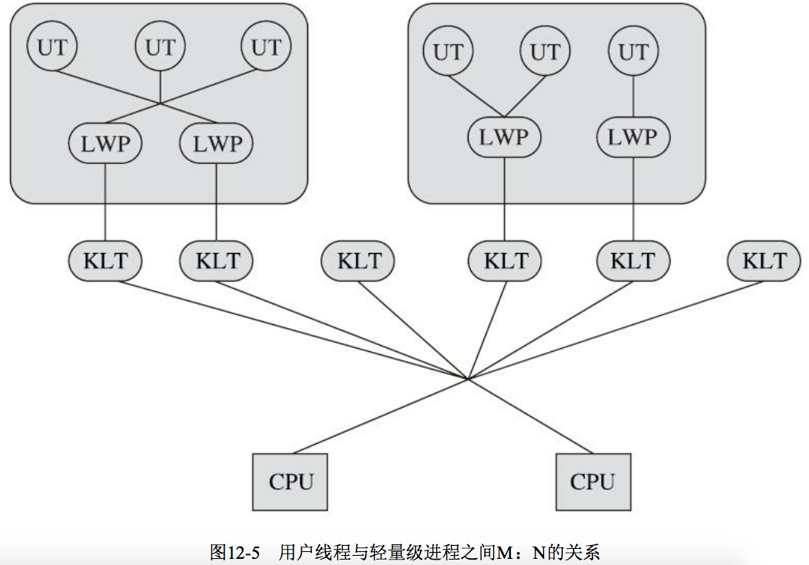

- Java线程

HotSpot的每个线程都是直接映射到一个操作系统原生线程来实现的。

#### Java线程调度

协同式线程调度：一个线程执行完，通知另一个线程执行

抢占式线程调度：操作系统控制线程执行时间和切换。

状态切换

#### Java 与协程

### 线程安全与锁优化

1. 互斥同步

synchronized 锁

实例方法锁实例，类方法锁类；本线程持有锁则可重入，计数器加一，计数器减为0后，释放锁。

重入锁（ReentrantLock）

- 等待可中断：等待锁的线程可以放弃锁，改为处理其他事情。
- 公平锁：根据锁的申请时间来获得锁。默认是非公平的。公平锁因为线程挂起和恢复的开销，会影响性能
- 锁绑定多个条件：new Condition()

因为以下开销而面临性能问题：

- 用户态到内核态的转换
- 维护锁计数器
- 检查是否有被阻塞的线程需要唤醒

2. 非阻塞同步

Non-Blocking Synchronization，乐观锁，无锁变成 Lock-Free

不加锁，直接用数据，有冲突就重试。

要求硬件支持操作和冲突检测具备原子性。

常用的指令有

- Test-and-Set  
- Fetch-and-Increment  
- Swap  
- Compare-and-Swap（CAS）：参数为内存位置V、旧的预期值A、新值B。仅当V==A时，才设置V=B。存在ABA问题，即中间由A变B再变A时，CAS无法发现。
- Load-Linked/Store-Conditional（LL/SC）

3. 无同步方案

不涉及共享数据就不需要同步，天生是线程安全的。

### 锁优化

互斥同步对性能最大的影响是阻塞的实现，挂起线程和恢复线程的操作都需要转入内核态中完成。

自旋锁

在多处理器上，可以处理多个线程。可以让请求锁的线程等待一会儿，执行一个忙循环（自旋），而不是直接转入内核态。假如共享数据的锁定状态很短，那么请求锁的线程在自旋后就能获取锁，省去了线程切换的开销。

缺点：需要占用处理器时间，如果长时间获取不了锁，就会带来性能浪费。

自适应自旋锁

自旋时间不是固定的，根据上次在这个锁上的自旋时间和锁的拥有者状态决定。

锁消除

当检测到要求同步的代码不可能存在共享数据竞争时，对锁进行消除。依据是逃逸分析的数据支持，判断堆上的所有数据都不会被其他线程访问到。

锁粗化

轻量级锁

目标：通过 CAS 操作避免使用互斥量的开销。

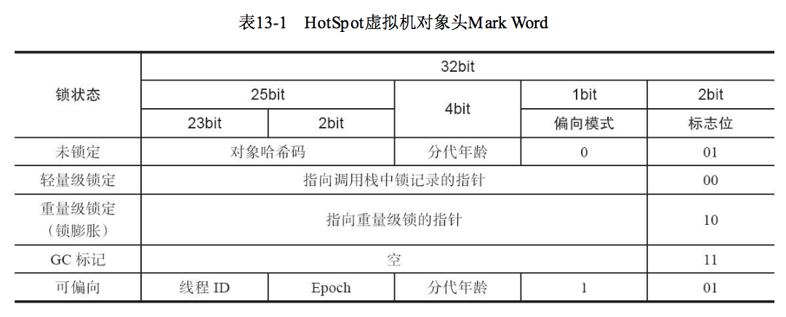

工作过程：

- 锁前：代码即将进入同步块时，如果同步对象没有被锁定，虚拟机将在当前线程的栈帧中建立一个名为锁记录(Lock Record)的空间，用于存储对象目前的Mark Word拷贝(Displaced Mark Word)。
- 锁住：然后，虚拟机使用 CAS 操作尝试把对象的 Mark Word 更新为指向 Lock Record 的指针。如果更新成功，则该线程拥有了这个对象的锁。
- 释放锁：如果对象的 Mark Word 仍指向线程的锁记录，用 CAS 操作把对象当前的 Mark Word 和线程中复制的 Displaced Mark Word 替换回来。如果替换成功，就释放了锁，同步过程完成。

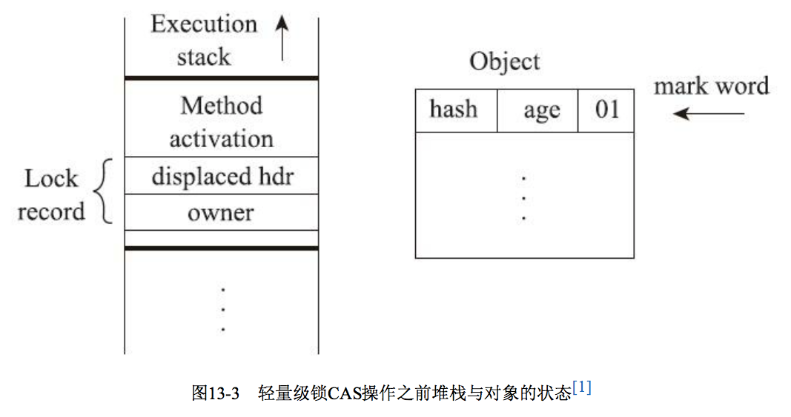

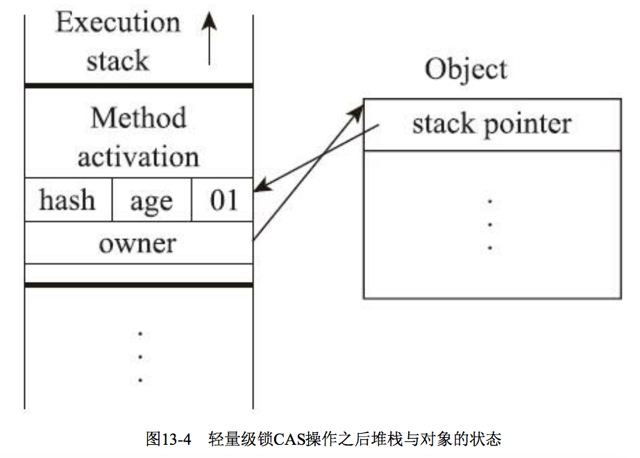

偏向锁

目标：消除数据在无竞争情况下的同步原语。即在无竞争的情况下把整个同步都消除掉。

锁对象第一次被线程获取的时候，虚拟机会把对象头中的标志位设为01，把偏向模式设为1。一旦出现另外一个线程去尝试获取这个锁的情况，偏向模式马上结束。撤销偏向后标志位恢复到未锁定或者轻量级锁定状态。

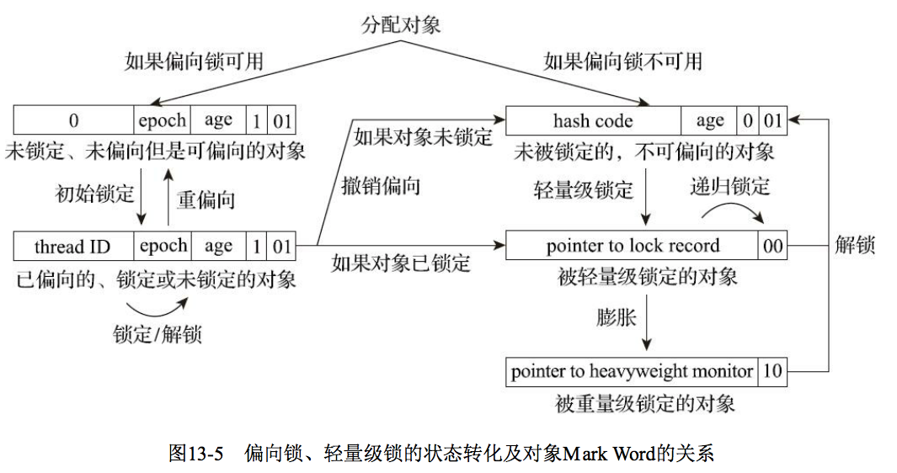

如果在接下来的执行过程中，该锁一直没有被其他线程获取，则持有偏向锁的线程将永远不需要再进行同步。


## 待整理

产生Full GC的场景

1. System.gc()方法的调用。建议JVM进行Full GC，通常会触发Full GC
2. 老年代空间不足
3. 方法区空间不足
4. CMS GC时出现promotion failed和concurrent mode failure
5. 统计得到的Minor GC晋升到旧生代的平均大小 > 老年代的剩余空间
6. 堆中分配很大的对象


JVM执行字节码指令是基于栈的架构，也就是所有的操作数必须先入栈，然后根据指令中的操作码选择从栈顶弹出若干个元素进行计算后再将结果压入栈中。

在JVM中，操作数可以放在每一个栈帧中的一个本地变量集中，即每个方法调用时，就会给这个方法分配一个本地变量集，这个本地变量集在编译时就已经确定。

Java启动后也作为一个进程运行在操作系统中。

Java堆的大小在JVM启动时就一次向操作系统申请完成，一旦分配完成，堆的大小就将固定，不够时不会再申请，空闲的空间也不会还给操作系统。

JVM运行实际程序的实体是线程，每个线程创建时JVM都会为它创建一个堆栈。

ByteBuffer对象会自动清理本机缓冲区，但这个过程只能作为Java堆GC的一部分来执行。

每个Java应用都唯一对应一个JVM实例。


## 参考资料


