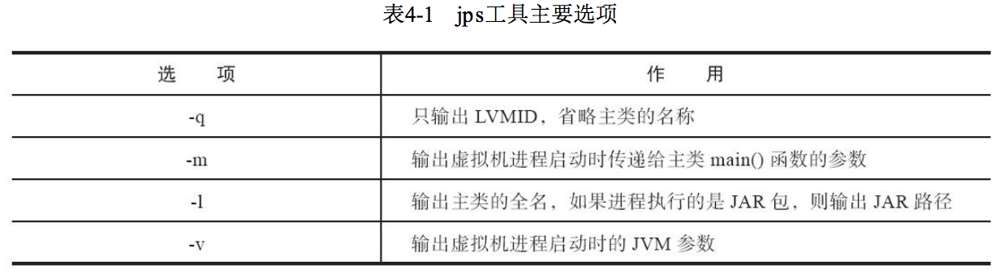

# JVM

由4部分组成

1. 类加载器。将class加载到JVM中
2. 执行引擎。执行class文件中的字节码指令，相当于CPU
3. 内存区。将内存划分成若干个区，模拟实际机器上的存储、记录、调度功能模块。相当于实际机器上的寄存器、PC计数器等
4. 本地方法调用。调用C或C++实现的本地方法的代码返回结果。

## 走近Java


编译jdk的实验

1. 获取openJDK源码：http://hg.openjdk.java.net/jdk7u/jdk7u (git上有吗？)或，下载打包好的源码：http://jdk7.java.net/source.html
2. 阅读 README-builds.html 文档

## Java内存区域

运行时数据区

JVM 把自己管理的内存，划分成若干个不同的数据区域。有的区域随着虚拟机进程的启动而一直存在，有的则依赖用户线程的启动和结束而创建和销毁。


- 方法区 Method Area
- 虚拟机栈 VM Stack
- 本地方法栈 Native Method Stack
- 堆 Heap
- 程序计数器 Program Counter Register

程序计数器

1. 当前线程所执行的字节码的行号指示器，指向虚拟机字节码指令的地址。
2. 每条线程有一个独立的程序计数器，即，线程私有。
3. 执行Native方法，计数器值为空
4. 没有OutOfMemoryError

Java 虚拟机栈

1. 线程私有，生命周期与线程相同。
2. 描述Java方法执行的线程内存模型。每个Java方法被执行的同时，虚拟机都会创建一个栈帧(Stack Frame)，栈帧中的内容如下。每个方法从调用到执行完毕的过程，就对应着一个栈帧在虚拟机栈中入栈到出栈到过程。
    1. 局部变量表
    2. 操作数栈
    3. 动态链接
    4. 方法出口等。
3. 局部变量表中存储的是编译期可知的变量，有以下3种，以局部变量槽（Slot）来表示。表的大小在编译期确定。
    1. 各种基本数据类型
    2. 对象引用
    3. returnAddress类型(指向了一条字节码指令的地址)
4. 有两类异常
    1. StackOverflowError：线程请求的栈深度大于虚拟机允许的深度。
    2. OutOfMemoryError：虚拟机支持动态扩展，且扩展时无法申请到足够内存。

本地方法栈

1. 与虚拟机栈类似，为虚拟机使用到的 Native 方法服务。

Java 堆

1. 被所有线程共享，虚拟机启动时创建。
2. 用来存放对象实例。
3. 是垃圾收集器管理的内存区域。
4. 可以划分出多个线程私有的分配缓冲区（Thread Local Allocation Buffer，TLAB），以提升对象分配时的效率。
5. 可以处于物理上不连续的内存空间中，只要逻辑上是连续的即可。
6. 大小可固定，可扩展。
7. 有 OutOfMemoryError，当堆没有内存，且无法扩展时。

方法区

1. 各个线程共享的内存区域
2. 用于存储已被虚拟机加载的
    1. 类信息
    2. 常量
    3. 静态变量
    4. 即时编译器编译后的代码缓存。
3. JDK8+，在本地内存中实现元空间（Metaspace）来存储。
4. 不需要连续的内存。
5. 可以选择固定大小或者可扩展。
6. 会抛出 OutOfMemoryError

运行时常量池(Runtime Constant Pool)

1. 是方法区的一部分。
2. 内容=Class文件中的常量池表（Constant Pool Table），存放编译期生成的各种字面量和符号引用。还会把符号引用翻译出来的直接引用存放在里面。
3. 与Class文件常量池表不同的是，具备动态性，运行期间也可以将新的常量放入池中。
4. 会抛出 OutOfMemoryError

直接内存(Direct Memory)

1. 不是虚拟机运行时数据区的一部分。
2. 会抛出 OutOfMemoryError
3. 内存的分配不受Java堆大小的限制，但是是本机内存的一部分。


### HotSpot 虚拟机对象

对象的创建

0. 遇到new指令，检查指令的参数能否在常量池中定位到一个类的符号引用，检查对应的类是否加载、解析、初始化。
1. 加载类
2. 为对象分配内存，所需内存在加载类后即可确定。
    1. 分配内存的方式，有2种方式
        1. 指针碰撞 Bump The Pointer（空闲空间是连续的），直接移动指向空闲空间末尾的指针
        2. 空闲列表 Free List（空闲空间不连续），记录空闲空间的位置，筛选分配
    2. 分配内存时，保证线程安全的方式
        1. CAS + 失败重试
        2. 每个线程在Java堆中预先分配一小块内存（本地线程分配缓冲 Thread Local Allocation Buffer, TLAB），缓冲区用完后，分配新的缓冲区，再使用同步锁定。
3. 初始化分配的内存空间，置0
4. 对对象进行设置，将对象信息存在对象头 Object Header 中
5. 执行init方法，初始化对象（构造函数）

对象的内存布局

1. 对象头 Header，分为2部分内容
    1. 存储对象自身的运行时数据，如：HashCode、GC分代年龄、锁状态标志、持有的锁等。长度为32byte或64byte，被称为Mark Word，是动态定义的。
    2. 类型指针，指向它的类型元数据的指针，通过这个指针确定对象是哪个类的实例。
    3. 数组长度，仅当对象是数组时存储。
2. 实例数据 Instance Data，对象真正存储的有效信息。
    1. 父类继承下来的字段
    2. 子类中定义的字段
3. 对齐填充 Padding，起占位符的作用。HotSpot要求对象的起始地址必须是8字节的整数倍。

对象的访问定位

0. 通过栈（rainy：操作数栈？）上的reference数据来操作堆上的具体对象。
1. 对象访问方式，主流的有2种
    1. 使用句柄访问
        1. Java 堆中会分配一块内存作为句柄池
        2. reference 中存储对象的句柄地址，句柄中包含了对象实例数据与类型数据各自的具体地址信息。
    2. 直接指针访问（HotSpot使用的方式）
        1. reference 中存储的是对象地址。
        2. 对象中需要有访问类型数据的指针。


### OutOfMemeryError

Java堆溢出

方式：堆用来存储对象实例，只要不断地创建对象，并且保证GC Roots到对象之间有可达路径，避免垃圾回收。

使用参数

```sh
# -Xms堆最小值 -Xmx堆最大值 -XX:+HeapDumpOnOutOfMemoryError 堆转储快照 -XX:HeapDumpPath 存放地址
java -Xms10m -Xmx10m -XX:+HeapDumpOnOutOfMemoryError -XX:HeapDumpPath=/root/jvm/myTest/
```

虚拟机栈、本地方法栈溢出

使用参数

```sh
# -Xoss 设置本地方法栈（HotSpot没用） -Xss栈容量
java -Xss144k
```

方法区和运行时常量池溢出

运行时常量池，在JDK7以上，放在了堆里。方法区的主要职责是存放类型信息，如类名、访问修饰符、常量池、字符描述、方法描述等。思路是产生大量的类去填满方法区。

使用参数

```sh
# 方法区（元空间）容量
java -XX:MaxMetaspaceSize=6m
# 方法区（元空间）初始大小，达到就会触发垃圾收集进行类型卸载，同时调整该值。
java -XX:MetaspaceSize=6m
# 在垃圾收集后，控制最小的元空间剩余容量的百分比
java -XX:MinMetaspaceFreeRatio=6m
java -XX:MaxMetaspaceFreeRatio
```

本机直接内存溢出

使用参数

```sh
# 指定直接内存，默认与Java堆最大值一致
java -XX:MaxDirectMemorySize=10M -Xmx10M
```

备注：实验没有出现OOM异常，后续注意排查原因

## 垃圾回收和内存分配

核心的3个问题

- 哪些内存需要回收？
- 什么时候回收？
- 怎么回收？

不需要考虑垃圾回收的区域

1. 程序计数器
2. 虚拟机栈
3. 本地方法栈

需要考虑垃圾回收的区域

1. Java堆
2. 方法区

### 对象是否死去

垃圾回收前，要判断堆内哪些对象已“死去”（即不可能再被使用的对象）。判断方式

1. 引用计数算法（不是主流虚拟机使用的算法）
    1. 实现原理
        1. 给对象添加一个引用计数器
        2. 对象被引用时，计数器+1
        3. 取消引用时，计数器-1
        4. 当计数器为0时，对象“死去”
    2. 存在问题：对象间循环引用时，2个对象都永远不会“死去”
2. 可达性分析算法（主流算法）
    1. 实现原理
        1. 以 "GC Roots" 对象作为起点，向下搜索，搜索过程被称为“引用链”。Java 中，可作为GC Roots的对象有
            1. 虚拟机栈中引用的对象
            2. 方法区中静态属性引用的对象
            3. 方法区中常量引用的对象
            4. 本地方法栈中JNI(即 Native方法)引用的对象
            5. 虚拟机内部的引用，如基本数据类型对应的Class对象，常驻的异常对象（NullPointException等），系统类加载器。
            6. 所有被同步锁持有的对象
            7. 反映Java虚拟机内部情况的JMXBean、JVMTI中注册的回调，本地代码缓存。
        2. 能够到达的对象是“活的”，不能到达的对象是“死的”。

引用的含义

传统引用的含义：如果reference类型的数据中存储的数值代表的是另一块内存的起始地址，就称这块内存代表一个引用。

当内存空间在垃圾收集后还是非常紧张，希望可以抛弃某些对象，腾出内存空间。这时候引用的含义需要被扩充。

1. 强引用：类似 `Object obj = new Object()` 这类引用。对象有强引用，则永远不会被垃圾收集器回收。（Strongly Reference）
2. 软引用：描述有用但非必需的对象。当内存不够时，可以被回收。(Soft Reference)
3. 弱引用：描述非必需的对象，比软引用强度更弱。有弱引用的对象只能生存到下一次垃圾回收前。(Weak Reference)
4. 虚引用：是最弱的引用关系。对象是否有虚引用的存在，完全不会对其生存时间构成影响，也无法通过虚引用取得一个对象的实例。这个对象在被垃圾收集器回收时会收到一个系统通知。(Phantom Reference)

对象如何真正死去？

对象宣告死亡，至少需要经过两次标记过程

1. 经可达性分析后，发现没有与 GC Roots 相连，会被第一次标记，被标记的对象会分成两类，一类需要执行finalize()方法，一类不需要。
    1. 不需要执行的对象有2种，（rainy:这些对象会被直接回收吗？）
        1. 对象没有覆盖 finalize() 方法
        2. finalize() 方法已被虚拟机调用。
    2. 需要执行的对象，会放在 F-Queue 队列中，等待执行 finalize() 方法。
2. GC 对 F-Queue 队列中的对象进行第二次小规模的标记
    1. 在 finalize() 方法执行时，对象有引用，则不会被回收。
    2. 否则，被回收

回收方法区

主要回收两部分内容

1. 废弃常量。与堆内对象的回收类似，常量没有被任何变量引用时，会被回收。
2. 不再使用的类，需满足
    1. 该类的所有实例都已被回收，Java堆中不存在该类及任何派生类的实例。
    2. 加载该类的ClassLoader已被回收
    3. 该类对应的Class对象没有被引用，即无法通过反射访问该类的方法。

需要设置类是否被回收。相关参数

```sh
-Xnoclassgc
# 在控制台能看到类加载的情况
-verbose:class 类名
-XX:+TraceClassLoading
-XX:+TraceClassUnLoading
```

### 垃圾收集算法

分为2类

1. 引用计数式（Reference Counting GC）
2. 追踪式（Tracing GC），主流

#### 分代收集理论

建立在两个分代假说上

1. 弱分代假说（Weak Generational Hypothesis）：绝大多数对象都是朝生夕灭的。
2. 强分代假说（Strong Generational Hypothesis）：熬过越多次垃圾收集过程的对象就越难以消灭。
3. 跨代引用假说（Intergenerational Reference Hypothesis）：跨代引用相对于同代引用来说仅占极少数。

垃圾收集器设计原则

1. 应该将Java堆划分出不同的区域
2. 将回收对象，根据年龄（熬过垃圾回收过程的次数）分配到不同的区域存储。

划分出区域后，垃圾收集器可以以不同的频率、不同的方式，来收集不同区的对象。

垃圾收集的方式

1. 部分收集（Partial GC）：不是完整收集整个Java堆，分为
    1. 新生代收集（Minior GC/Young GC）：只收集新生代
    2. 老年代收集（Major GC/Old GC）：只收集老年代
    3. 混合收集（Mixed GC）：收集新生代和部分老年代
2. 整堆收集（Full GC）：收集整个堆、方法区

#### 算法

标记-清除算法

最基础的算法，其他算法都是在该算法的基础上改进的。

- 原理：标记处需要清除的对象，之后统一回收。
- 不足
    1. 效率不稳定。大量可回收对象，执行效率低
    2. 垃圾清除后会产生大量不连续的内存碎片

标记-复制算法（复制算法）

- 改进点：解决效率问题。
- 原理
    1. 将可用内存等分成2块。
    2. 使用其中一块A直到该块的内存消耗完
    3. 将存活对象复制到空闲的另一块B，并将A块的内存清理掉。
    4. 使用B块重复步骤2-4
- 不足
    1. 只能使用一半内存，浪费（可以修改分配内存的比例）

改进的复制算法

- 改进点：区域不等分
- 原理：
    1. 将新生代分为1个较大的Eden区和2个较小的Survivor区（HotSpot是8:1:1）
    2. 分配内存只是用Eden区和一个Survivor区
    3. 垃圾收集时，将Eden区和一个Survivor区中的存活对象，复制到另一块Survivor区，清理掉处理过的区域。
    4. 如果存活对象需要的空间，大于Survivor区，则需要老年代进行分配担保(Handle Promotion)。
- 缺点：对象存活率高时，需要进行较多的复制操作。

标记-整理算法

针对老年代（对象存活率高）

- 原理
    1. 标记
    2. 将可回收对象移动到内存的一端，然后清理掉端边界以外的内存。
- 缺点：需要更新大量的对象引用，且这个操作过程中，必须暂停用户进程。

### HotSpot的算法细节

根节点枚举

1. GC Roots集合在枚举过程中需要保持不变。因此需要暂停用户线程。
2. HotSpot 使用 OopMap 来找到对象引用。（准确式垃圾收集）

安全点

1. 只在安全点，生成OopMap，进行垃圾收集。
2. 安全点满足“具有让程序长时间执行的特征”。如方法调用、循环跳转、异常跳转。
3. 如何在垃圾收集时，让所有线程跑到最近的安全点，然后停顿下来。
    1. 抢先式中断。先中断所有线程，然后让不在安全点的线程恢复，跑到安全点再中断。（没有被采用）
    2. 主动式中断。在安全点轮询标志，发现为true就自己中断挂起。

安全区域

1. 用来解决未执行，如Sleep或Blocked的程序，无法进入安全点的问题。
2. 安全区域是指能够确保在某一段代码片段中，引用关系不会发生变化。

记忆集（Remembered Set）

1. 用于解决跨代引用的问题。
2. 记录从非收集区域指向收集区域的指针
3. 是一种抽象数据结构。
4. 有3种实现精度
    1. 字长精度：每个记录精确到一个机器字长，该字包含跨代指针
    2. 对象精度：每个记录精确到一个对象，该对象里有字段含有跨代指针
    3. 卡精度：每个记录精确到一块内存区域，该区域内有对象含有跨代指针

卡表（Card Table）

1. 是记忆集的一种实现方式。
2. 是卡精度。
3. 最简单的形式可以是一个字节数组，元素是“卡页”，卡页指向内存区域中一块特定大小的内存块。

写屏障（Write Barrier）

1. 用来维护卡表状态。
    1. 卡表何时变脏？有其他分代区域中的对象引用了本区域对象时
    2. 卡表如何变脏？写屏障
2. 可以看做是虚拟机对“引用类型字段赋值”的AOP切面。赋值前的部分叫写前屏障（Pre-Write Barrier），赋值后的叫写后屏障（Post-Write Barrier）。
3. 缺点
    1. 每次对引用进行更新，就会产生额外的开销
    2. 高并发场景，存在“伪共享”问题。伪共享是：多个相互独立的变量共享一个缓存行，同时对这些变量修改时，会彼此影响。

并发的可达性分析

做到和用户线程并发的可达性分析，有2种方式：

1. 增量更新（Incremental Update）。
    1. 当黑色对象（已分析完全部引用的对象）插入新的指向白色对象（未分析的对象）的引用关系时，记录下来。（rainy：此时引用关系插入了吗？）
    2. 扫描结束后，再重新扫描记录的黑色对象。
2. 原始快照（Snapshot At The Beginning，SATB）。
    1. 当灰色对象删除指向白色对象的引用关系时，将这个要删除的引用记录下来。（rainy：此时是不是没有删除引用关系，等到扫描完再删除，然后再扫描一次？）
    2. 扫描结束后，以记录的灰色对象为根，再扫描一次。

### 经典垃圾收集器（HotSpot）


垃圾收集器是内存回收的具体实现。

Serial 收集器

1. 单线程的收集器，运行时会停掉其他线程。
2. 客户端模式下，默认的新生代收集器
3. 优点：额外内存消耗（Memory Footprint）最小。


ParNew 收集器

1. 是 Serial 收集器的多线程并行版本。
2. 服务端模式下，JDK7-首选的新生代收集器，可以与CMS(老年代的收集器)配合使用。JDK9+只能与CMS配合使用。


Parallel Scavenge 收集器

1. 基于标记-复制算法
2. 能并行收集的多线程收集器。
3. 目标是达到一个可控制的吞吐量。吞吐量=用户代码运行时间/(用户代码运行时间+垃圾收集运行时间)
4. 有自适应调节策略

相关参数

```sh
# 设置最大垃圾收集停顿时间
java -XX:MaxGCPauseMillis
# 设置吞吐量大小，默认是99(垃圾收集时间是1%=1/(1+99))
java -XX:GCTimeRatio
# 开关，打开后，垃圾收集器可以自适应的调节新生代大小、等参数
java -XX:UseAdaptiveSizePolicy
```

Serial Old 收集器

1. 是Serial的老年代版本。
2. 单线程收集器
3. 使用标记-整理算法
4. 供客户端模式下的HotSpot虚拟机使用。

Parallel Old 收集器

1. 是 Parallel Scavenge 的老年代版本。
2. 支持多线程并发。
3. 基于标记-整理算法。

CMS（Concurrent Mark Sweep） 收集器

1. 目标：尽可能地缩短垃圾收集时用户线程的停顿时间。
2. 基于标记-清除算法，有4个步骤，步骤1，3需要Stop The World。
    1. 初始标记 CMS initial mark，标记GC Roots能直接关联到的对象
    2. 并发标记 CMS concurrent mark，从GC Roots直接关联的对象开始，遍历对象图。
    3. 重新标记 CMS remark，修正在并发标记时，用户程序的增量操作造成的变化。使用增量更新的方式。
    4. 并发清除 CMS concurrent sweep
3. 优点：并发收集、低停顿。
4. 缺点
    1. 对处理器资源非常敏感
    2. CMS 收集器无法处理“浮动垃圾”（Floating Garbage）（并发清除时，用户线程可能还在制造垃圾），有可能出现 Concurrent Mode Failure 而导致 Full GC 的产生（之后会冻结用户线程，临时启用Serial Old收集器）。
    3. 收集后会产生大量空间碎片


使用参数

```sh
# 激活CMS
java -XX:+UseConcMarkSweepGC
# JDK5 当老年代使用了90%+，触发垃圾回收（老年代使用的百分比，默认68%，JDK6+默认92%）
java -XX:CMSInitiatingOccupancyFraction=90
# 默认开启，JDK9后废弃。Full GC时，进行碎片整理
java -XX:+UseCMSCompactAtFullCollection
# JDK9后废弃，表示在n次Full GC后，进行碎片整理
java -XX:CMSFullGCsBeforeCompaction
```

Garbage First 收集器（简称 G1）

1. 面向服务端应用，全功能的垃圾收集器。
2. 开创了面向局部收集、基于Region的内存布局形式。
    1. 把连续的Java堆划分为多个大小相等的独立区域（Region），每一个Region都可以根据需要，扮演新生代的Eden空间、Survivor空间、老年代空间。
    2. Region中的特殊区域 Humongous，专门用来存储大对象（超过一个Region容量一半的对象）。
    3. G1 将 Region 作为单次回收的最小单元。并按照回收价值，给Region定回收的优先级。
3. Mixed GC 模式。面向堆内存任何部分组成回收集（Collection Set，CSet），衡量标准是哪块内存存放的垃圾多，回收收益最大。
4. 基于Region回收，需要解决的问题
    - 跨Region的引用对象如何解决？使用记忆集
        1. 每个Region有自己的记忆集，记录别的Region指向自己的指针，标记这些指针分别在哪些卡页的范围内。
        2. 记忆集是一种哈希表，Key是别的Region的起始地址，Value是集合，存储卡表的索引号。
        3. 由于Region较多，导致卡表较多，导致内存占用较多。
    - 并发标记阶段，如何保证收集线程与用户线程互不干扰？
        1. 保证垃圾标记的正确性：使用原始快照算法。
        2. 新建对象如何分配内存：G1 设计了2个 TAMS（Top at Mark Start）的指针，把Region中的一部分空间划分出来，用于并发回收过程中的新对象分配，并发回收时新分配的对象地址都必须要在这两个指针位置以上。这些对象时默认存活的。
        3. 当内存回收的速度，比不上内存分配的速度，G1也会冻结用户线程，导致Full GC而产生长时间停顿。
    - 怎样建立可靠的停顿预测模型？
        1. 以衰减均值（Decaying Average）为理论基础，预测Region的回收代价。
5. G1 收集器的运作过程，1、3、4需要停顿。
    1. 初始标记（Initial Marking）：标记 GC Roots 能直接关联到的对象，修改 TAMS 指针的值。
    2. 并发标记（Concurrent Marking）：并发进行可达性分析
    3. 最终标记（Final Marking）：处理并发标记时，SATB记录的有引用变动的对象。
    4. 筛选回收（Live Data Counting and Evacuation）：更新Region的统计数据，制定回收计划，并回收。
6. 可以由用户指定期望的停顿时间。


使用参数

```sh
# 设置Region大小，范围是1MB-32MB
java -XX:G1HeapRegionSize
# 设置允许收集停顿的时间，默认200ms
java -XX:MaxGCPauseMillis
```

### 低延迟垃圾收集器

衡量垃圾收集器的三项指标

1. 内存占用 Footprint
2. 吞吐量 Throughput
3. 延迟 Latency

Shenandoah 收集器

1. 与G1类似，使用基于Region的堆内存布局，存放大对象的 Humongous Region，默认回收价值最大的Region……
2. 与G1不同的是
    1. 并发整理
    2. 不使用分代收集
    3. 不使用记忆集，而是使用“连接矩阵”（Connection Matrix）记录跨Region的引用关系。
3. 工作过程，1、3、6、8会停顿
    1. 初始标记（Initial Marking）：标记 GC Roots 能直接关联到的对象。
    2. 并发标记（Concurrent Marking）：并发进行可达性分析
    3. 最终标记（Final Marking）：处理并发标记时，SATB记录的有引用变动的对象。统计回收价值最高的Region，组成回收集。
    4. 并发清理（Concurrent Cleanup）：清理整个区域都没有存活对象的Region（Immediate Garbage Region）
    5. 并发回收（Concurrent Evacuation）：与其他收集器有明显差异。复制待回收Region里的存活对象到其他Region。
    6. 初始引用更新（Initial Update Reference）：将指向旧对象的引用更新到新地址。
    7. 并发引用更新（Concurrent Update Reference）：真正进行引用更新操作。
    8. 最终引用更新（Final Update Reference）：修正存在于GC Roots中的引用。
    9. 并发清理（Concurrent Cleanup）：待回收的Region里都没有存活对象，都可以被清理了。
4. 并发回收阶段，使用转发指针，来实现对象移动与用户程序并发。
    1. 在对象头新增一个引用字段
    2. 默认指向自己，在并发移动时，指向移动后的对象。


ZGC(Z Garbage Collector) 收集器

1. 目标：低延迟。在任意堆内存大小下，把垃圾收集的停顿时间限制在10ms以内
2. 基于 Region，不设分代。Region具有可动态创建和销毁，有动态的区域容量大小。
3. 使用了读屏障、染色指针、内存多重映射
    1. 染色指针：将少量额外的信息存储在指针上。Linux下，64位指针的高18位不能用来寻址。剩下的46位中，高4位用来存储4个标志信息。
    2. 内存多重映射：将多个虚拟内存地址映射到同一个物理内存地址上。
4. 使用标记-整理算法
5. 运作过程
    1. 并发标记（Concurrent Mark）：并发进行可达性分析
    2. 并发预备重分配（Concurrent Prepare for Relocate）：统计出要回收的Region，组成重分配集。
    3. 并发重分配（Concurrent Relocate）：把重分配集中的存活对象复制到新的Region上，并记录旧-新对象的转向关系。
    4. 并发重映射（Concurrent Remap）：修正堆中指向重分配集中旧对象的所有引用。
6. 优点
    1. 不需要记忆集占用内存空间
    2. 没有用到写屏障
7. 缺点
    1. 能承受的对象分配速率不高（因为没有分代）


### 选择合适的垃圾收集器

Epsilon 收集器

1. 无垃圾收集行为（rainy：适合使用时间短，使用内存少的移动端应用？）

虚拟机及垃圾收集器日志

使用参数

```sh
-Xlog[:[selector][:[output][:[decorators][:output-options]]]]
```

1. selector由tag和level组成
    1. tag有：add, age, alloc, annotation, aot, agruments, attach, barrier, biasedlocking, blocks, bot, breakpoint, byteco???
    2. level有：Trace, Debug, Info, Warning, Error, Off
2. decorator为每行日志输出加上额外的内容，默认显示uptime，level，tags
    1. time：当前日期和时间
    2. uptime：虚拟机启动到现在经过的时间（秒）
    3. timemillis：当前时间的毫秒数，相当于System.currentTimeMillis()的输出
    4. uptimemillis：虚拟机启动到现在经过的时间（毫秒）
    5. timenanos：当前时间的纳秒数，相当于System.nanoTime()的输出
    6. uptimenanos：虚拟机启动到现在经过的时间（纳秒）
    7. pid：进程ID
    8. tid：线程ID
    9. level：日志级别
    10. tags：日志输出的标签集

例子

```sh
# 查看GC基本信息
java -Xlog:gc GCTest # JDK9+
java -XX:+PrintGC # JDK9-
# 查看GC详细信息
java -Xlog:gc* GCTest # JDK9+
java -XX:+PrintGCDetails # JDK9-
# 查看GC前后的堆、方法区可用容量变化
java -Xlog:gc+heap=debug GCTest # JDK9+
java -XX:+PrintHeapAtGC # JDK9-
# 查看GC过程中用户线程并发时间以及停顿时间
java -Xlog:safepoint GCTest # JDK9+
java -XX:PrintGCApplicationConcurrentTime # JDK9-
# 查看收集器 Ergonomics 机制
java -Xlog:gc+ergo*=trace GCTest
java -XX:+PrintAdaptiveSizePolicy # JDK9-
# 查看熬过收集后剩余对象的年龄分布信息
java -Xlog:gc+age=trace 
java -XX:+PrintTenuringDistribution # JDK9-
```


常用参数

```sh
# 堆内存的最小大小，默认为物理内存的1/64
-Xms
# 堆内存的最大大小，默认为物理内存的1/4
-Xmx
# 堆内新生代的大小。通过这个值也可以得到老生代的大小：-Xmx减去-Xmn
-Xmn
# 设置每个线程可使用的内存大小，即栈的大小。
-Xss
# Eden区与Survivor区的比例
-XX:SurvivorRatio=8
# 虚拟机发生内存回收时，在输出设备显示信息
-verbose:gc
# 输出native方法调用的相关情况，一般用于诊断jni调用错误信息。
-verbose:jni
# 大于该设置值的对象直接在老年代分配
-XX:PretenureSizeThreshold
# 设置对象晋升老年代的年龄阈值
-XX:MaxTenuringThreshold
# 查看是否允许担保失败（Handle Promotion Failure）
-XX:HandlePromotionFailure
```

### 内存分配和回收策略

1. 对象优先在Eden分配
2. 大对象直接进入老年代
3. 长期存活的对象将进入老年代
4. 动态对象年龄判断：如果在Survivor空间中，相同年龄所有对象大小的总和大于Survivor空间的一半，年龄大于或等于该年龄的对象，就可以直接进入老年代。
5. 空间分配担保：Minor GC前，需要检查
    1. （JDK6-）检查老年代最大可用连续空间 > 新生代所有对象总空间
        1. 是，进行Minor GC
        2. 否，检查HandlePromotionFailure是否允许担保失败
            1. 是，检查老年代最大可用连续空间 > 历次晋升到老年代对象的平均大小
                1. 是，尝试Minor GC
                2. 否，Full GC
            2. 否，Full GC
    1. （JDK6+）检查老年代最大可用连续空间 > 新生代所有对象总空间 或 历次晋升到老年代对象的平均大小
        1. 是，进行Minor GC
        2. 否，Full GC

## 性能监控、故障处理工具

### 基础故障处理工具

jps 虚拟机进程状况工具

JVM Process Status Tool，可用列出正在运行的虚拟机进程，并显示虚拟机执行主类（Main Class，main函数所在的类）名称、进程的本地虚拟机唯一ID（LVMID，Local Virtual Machine Identifier）。

命令格式

```sh
jps [options] [hostid]
jps -l
```



jstat 虚拟机统计信息监视工具

JVM Statistics Monitoring Tool，监视虚拟机各种运行状态信息

命令格式

```sh
# interval 查询间隔，count 查询总次数。省略表示只查一次
# option 代表用户希望查询的虚拟机信息，分为：类加载、垃圾收集、运行期编译状况
jstat [options vmid [interval[s|ms][count]] ]
# 远程虚拟机进程，VMID格式
[protocol:][//]lvmid[@hostname[:port]/servername]
```


jinfo Java配置信息工具

Configuration Info for Java，实时查看和调整虚拟机各项参数。

命令格式

```sh
jinfo [option] pid
# 查 CMSInitiatingOccupancyFraction 的值
jinfo -flag CMSInitiatingOccupancyFraction 1444
```

jmap Java内存映像工具

Memory Map for Java，用于生成堆转储快照（称为heap dump或dump文件）

其他方式生成dump文件

```sh
# 发生内存溢出异常时，自动生成dump文件
-XX:+HeapDumpOnOutOfMemoryError
# Ctrl + Break 键让虚拟机生成dump文件
-XX:+HeapDumpOnCtrlBreak
```

命令格式

```sh
jmap [option] vmid
jmap -dump:format=b,file=eclipse.bin 3500
```


jhat 堆转储快照分析工具

JVM Heap Analysis Tool，分析jmap生成的堆转储快照。内置了一个微型的HTTP/Web服务器，可以在浏览器中查看分析结果。

jstack Java堆栈跟踪工具

Stack Trace for Java，用于生成虚拟机当前时刻的线程快照（称为threaddump或javacore文件）

命令格式

```sh
jstack [option] vmid
jstack -l 3500
```


用java代码获得堆栈情况

```java
for(Map.Entry<Thread, StackTraceElement[]> stackTrace : Thread.getAllStackTraces().entrySet()) {
    Thread t = (Thread) stackTrace.getKey();
    StackTraceElement[] stack = (StackTraceElement[]) stackTrace.getValue();
    if(t.equals(Thread.currentThread())) {
        continue;
    }
    out.print(t.getName());
    for(StackTraceElement element : stack) {
        out.print(element);
    }
}
```


其他工具见《深入理解Java虚拟机：4.2.7》

### 可视化故障处理工具

JHSDB 基于服务性代理的调试工具

服务性代理（Serviceability Agent，SA）是HotSpot虚拟机中一组用于映射Java虚拟机运行信息的、主要基于Java语言实现的API集合。把C++数据抽象出Java模型对象，相当于HotSpot的C++代码的一个镜像。

JConsole Java监视与管理控制台

基于JMX（Java Management Extensions）的可视化监视、管理工具。通过JMX的MBean（Managed Bean）对系统进行信息收集和参数动态调整。

VisualVM 多合-故障处理工具

Java Mission Control 可持续在线的监控工具

### HotSpot虚拟机插件及工具

HSDIS JIT生成代码反汇编

作用：让HotSpot的-XX:+PrintAssembly指令调用它来把即时编译器动态生成的本地代码还原为汇编代码输出，并生成注释

[HSDIS插件](http://hllvm.group.iteye.com)

## 类文件结构

### 无关性的基石

1. 虚拟机。只与Class文件关联。
2. 字节码存储格式。包含了Java虚拟机指令集、符号表等辅助信息。

### Class类文件的结构

任何一个Class文件都对应着唯一的一个类或接口的定义信息。Class文件不需要以磁盘文件的形式存在。

Class文件的特点

1. 以8个字节为基础单位的二进制流，没有分隔符。当遇到需要8个字节以上空间的数据项时，会按高位在前的方式分割成若干个8字节进行存储。
2. 有两种数据类型：
    1. 无符号数。基本的数据类型，以u1, u2, u4, u8来分别代表1，2，4，8个字节的无符号数。可以用来描述数字、索引引用、数量值、字符串值（UTF-8编码）
    2. 表。复合数据类型，由多个无符号数或其他表作为数据项，命名习惯性以_info结尾。整个Class文件可以看成一张表。


- 魔数 magic：Class文件的头4个字节，作用是确定这个文件是否为一个能被虚拟机接受的Class文件。Class文件的魔数是 `0xCAFEBABE`
- 版本号：之后4个字节是Class文件的版本号。5、6字节是次版本号（Minor Version），7、8字节是主版本号（Major Version）。
- 常量池：表类型，在版本号之后。入口有u2类型的数据，表示容量池大小。只有容量池从1开始计数，每个常量都是一个表。存放的常量有
    1. 字面量（Literal）
    2. 符号引号（Symbolic References）
        - 被模块导出或者开放的包（Package）
        - 类和接口的全限定名（Fully Qualified Name）
        - 字段的名称和描述符（Descriptor）
        - 方法的名称和描述符
        - 方法句柄和方法类型（Method Handle、Method Type、Invoke Dynamic）
        - 动态调用点和动态常量（Dynamically Computed Call Site、Dynamically Computed Constant）
- 访问标志：用于识别一些类或者接口层次的访问信息
- 类索引（u2类型）、父索引（u2类型）、接口索引集合（u2类型的集合）。用来确定该类型的继承关系。
- 字段表
- 方法表集合
- 属性表结合


常量-Class

1. tag是标志位。
2. name_index是常量池的索引值，指向常量池中的CONSTANT_Utf8_info类型常量，代表了这个类的全限定名。

常量-utf8

1. tag是标志位。
2. length 字符串长度。最大值是65535，所以Java中，方法、字段名的最大长度也是64KB

分析字节码的工具

```sh
javap -verbose TestClass
```


描述符：先参数列表、后返回值，如 `void inc()` 的描述符是 `()V`

Java语言中字段是无法重载的，但对Class文件来说，只要两个字段的描述符不是完全相同，那字段重名就是合法的。


在Class文件中，只要描述符不是完全一致，两个方法就可以共存。


可以定义自己的属性


attribute_name_index 指向utf8常量，常量值固定为Code

max_stack 代表了操作数栈（Operand Stack）深度的最大值。

max_locals 代表了局部变量所需要的存储空间。单位是变量槽（Slot），是为局部变量分配内存使用的最小单位。长度 <= 32位的数据类型，占一个槽，64位的占2个槽。局部变量表中的变量槽可以被重用，当代码执行超过一个局部变量的作用域时，这个局部变量所占的变量槽可以被其他局部变量使用。max_locals = 同时生存的最大局部变量数量

code_length 代表字节码长度。《Java虚拟机规范》中，限定了一个方法不允许超过 65535 条字节码指令。

code 存储字节码指令的一系列字节流


字节码从[start_pc, end_pc)的行之间出现了类型为catch_type（指向Class类型的常量的索引）或其子类的异常，则转到handler_pc行继续处理。catch_type=0时，任何异常都需要转到handler_pc处进行处理。

Exceptions 属性

作用：列出方法中可能抛出的受查异常


LineNumberTable 属性

作用：描述Java源码行号与字节码行号之间的对应关系。如，抛出异常时，堆栈中会显示出错的行号。


LocalVariableTable

作用：描述栈帧中局部变量表的变量，与Java源码中定义的变量的关系。如，将Java源码中的方法参数名称，和Class文件局部变量表的变量，关联起来。


start_pc 局部变量的生命周期开始的字节偏移量

length 局部变量的作用范围的长度

name_index 局部变量名称，指向常量池中的utf8类型

descriptor_index 局部变量的描述符，指向常量池中的utf8类型

index 局部变量在栈帧的局部变量表中变量槽的位置。

LocalVariableTypeTable

与LocalVariableTable类似，descriptor_index替换为了Signature，用来完成泛型的描述。

SourceFile

作用：生成这个Class文件的源文件的名称。


SourceDebugExtension

作用：方便编译器和动态生成的Class中，加入供程序员使用的自定义内容。


ConstantValue

作用：通知虚拟机自动为静态变量赋值。

非静态变量的赋值，在实例构造器 `<init>()` 方法中进行。

类变量有2种方式

1. 在类构造器 `<clinit>()` 方法中
2. 使用 ConstantValue 属性。

javac编译器的选择是，final static 修饰的 String类型，用ConstantValue。其他用构造器。


InnerClass属性

作用：记录内部类与宿主类之间的关联。


Deprecated

标志类型，表示某个类、字段、方法，已经被程序作者定为不再推荐使用。

Synthetic

标志类型，表明此字段、方法并不是Java源码直接产生的，而是编译器自行添加的。


StackMapTable

作用：在java虚拟机类加载的字节码验证阶段被新类型检查验证器（Type Checker）使用，目的在于替换以前比较消耗性能的基于数据流分析的类型推导验证器。


Signature

作用：记录泛型类型信息。因为编译后，泛型信息会被擦除。


BootstrapMethods

作用：保存invokedynamic指令引用的引导方法限定符。


之后略，需要重新看一遍。。。

### 字节码指令


虚拟机指令的构成

1. 操作码（Opcode）。代表某种特定操作的数字，1字节。
2. 操作数（Operand）。此操作需要的参数。

Java 虚拟机采用面向操作数栈而不是面向寄存器的架构，所以指令通常没有操作数，操作数放在操作数栈里。

字节码与数据类型


编译器会在编译期或运行期将byte和short类型的数据带符号扩展（Sign-Extend）为相应的int类型数据，将boolean和char类型数据零位扩展（Zero-Extend）为相应的int类型数据。大多数对于boolean、byte、short、char类型数据的操作，实际上都是使用int作为运算类型。


。。。需要重看

疑问

1. 为什么自动添加的构造方法，在常量池中有 Methodref ，TestCase自己的方法inc 没有；为什么字段m有Fieldref，但方法inc没有 Methodref。
2. 常量池里，为什么有重复的数据？比如nameAndType类型，就是name（utf8）和type（utf8）类型的组合。FiledRef，是class和namdAndType的组合。
3. 

## 虚拟机类加载机制

虚拟机的类加载机制：把描述类的数据，从Class文件加载到内存，并对数据进行校验、转换解析和初始化，最终形成可以被虚拟机直接使用的Java类型。

Java语言里，类型的加载、链接、初始化过程都是在程序运行期间完成的。因此，在本程序里，运行第三方组件，成为可能。

### 类加载时机


需要立即对类进行“初始化”的6个场景

1. 遇到new、getstatic、putstatic、invokestatic这四条字节码指令时。生成这4条指令的典型Java代码场景有
    - 使用new关键字实例化对象
    - 读取或设置一个类的静态字段
    - 调用一个类的静态方法
2. 使用java.lang.reflect包的方法，对类进行反射调用时
3. 初始化类，但父类没有初始化时
4. 虚拟机启动，需要初始化主类
5. 使用JDK7新加入的动态语言支持时，一个java.lang.invoke.MethodHandle实例最后的解析结果为REF_getStatic、REF_putStatic、REF_invokeStatic、REF_newInvokeSpecial四种类型的方法句柄，并且这个方法句柄对应的类没有进行初始化。
6. 一个接口中定义了JDK8新加入的默认方法，如果有这个接口的实现类发生了初始化，那接口要在其之前被初始化。

对于静态字段，只有直接定义这个字段的类才会被初始化。

### 类加载的过程

加载 Loading

1. 通过一个类的全限定名来获取定义此类的二进制字节流
2. 将这个字节流代表的静态存储结构转化为方法区的运行时数据结构
3. 在内存中生成一个代表这个类的java.lang.Class对象，作为方法区这个类的各种数据的访问入口。

非数组类，可以自定义类加载器，自定义加载过程

数组类，本身不通过类加载器创建，是Java虚拟机直接在内存中动态构造出来的。数组类的创建过程遵循以下原则：

1. 数组的组件类型（Component Type，数组去掉一个维度的类型）是引用类型，就通过该组件类型的类加载器递归加载。
2. 数组的组件类型不是引用类型，如，原始类型，数组被标记为与引导类加载器关联。
3. 数组类的可访问性与它的组件类型的可访问性一致，如果组件类型不是引用类型，它的数组类的可访问性将默认为public。

加载阶段结束后，Java虚拟机外部的二进制字节流，就按照虚拟机所设定的格式存储在方法区之中了。之后会实例化一个java.lang.Class类的对象，这个对象将作为程序访问方法区中的类型数据的外部接口。

验证

目的：确保Class文件的字节流中包含的信息符合《Java虚拟机规范》的约束。

大致的验证过程

1. 文件格式验证。保证输入的字节流能正确解析，并存储在方法区内。
2. 元数据验证。对字节码描述的信息进行语义分析。
3. 字节码验证。对数据流分析和控制流分析，确定程序语义是合法的、符合逻辑的。
4. 符号引用验证。检查该类是否缺少或者被禁止访问它依赖的某些外部类、方法、字段等资源

准备

正式为类中定义的静态变量（不包括实例变量）分配内存并设置类变量初始值（没有对应的ConstantValue时，是数据类型的零值，赋值操作在类初始化阶段）的阶段。

解析

Java虚拟机将常量池内的符号引用替换为直接引用的过程。

- 符号引用（Symbolic References）：符号引用以一组符号来描述所引用的目标，符号可以是任何形式的字面量，只要使用时能无歧义地定位到目标即可。符号引用和虚拟机实现的内存布局无关。符号引用的字面量形式明确定义在《Java虚拟机规范》的Class文件格式中。
- 直接引用（Direct References）：直接引用是可以直接指向目标的指针、相对偏移量或者是一个能间接定位到目标的句柄。直接引用和虚拟机实现的内存布局直接相关，直接引用的目标必定在虚拟机的内存中存在。

初始化

`<clinit>()` 方法是由编译器自动收集类中的所有类变量的赋值动作和静态语句块中的语句合并产生的，编译器收集的顺序是由语句在源文件中出现的顺序决定的。

Java虚拟机会保证在子类的 `<clinit>()` 方法执行前，父类的 `<clinit>()` 方法已经执行完毕。

如果类中没有静态语句块、对变量的赋值操作，则不用生成 `<clinit>()` 方法。

### 类加载器

作用：通过一个类的全限定名来获取描述该类的二进制字节流。将Class字节码解析成JVM要求的格式。

每一个类加载器，都有一个独立的类名称空间。即，即时两个类来源于同一个Class文件，被同一个Java虚拟机加载，只要加载它们的类加载器不同，那这两个类就必定不相等。

双亲委派模型

在Java虚拟机看来，只有两种类加载器

1. 启动类加载器（Bootstrap ClassLoader），使用C++语言实现，是虚拟机自身的一部分
2. 其他类加载器，使用Java语言实现，独立存在于虚拟机外部，并全部继承自抽象类 java.lang.ClassLoader

在Java开发人员看来，有

1. 启动类加载器（Bootstrap ClassLoader），负责加载存放在 `<JAVA_HOME>/lib` 目录，或者被 `-Xbootclasspath` 参数所指定的路径中存放的，Java虚拟机可识别的类库。
2. 扩展类加载器（Extension ClassLoader），负责加载存放在 `<JAVA_HOME>/lib/ext` 目录，或者被 `java.ext.dirs` 系统变量所指定的路径中的类库。由Java代码实现。
3. 应用程序类加载器（Application Class Loader），或系统类加载器，负责加载用户类路径（ClassPath）上所有的类库。由Java代码实现，是默认的类加载器。
4. 自定义的类加载器


在findClass()方法中，写类加载逻辑。

线程上下文加载器（Thread Context ClassLoader），通过 java.lang.Thread 类的 setContextClassLoader() 方法进行设置。创建线程时，默认会从父线程继承类加载器。如果应用程序全局范围内都没有设置过，就默认是应用程序类加载器。


### Java 模块化系统

可配置的封装隔离机制

兼容性

类路径查找，类路径（ClassPath）

模块路径（ModulePath）

某个类库到底是模块还是传统的JAR包，只取决于它存放在哪种路径上。

模块化下的类加载器

发生的变化

1. 扩展类加载器（Extension Class Loader）被平台类加载器（Platform Class Loader）取代。
2. 平台类加载器和应用程序类加载器都不再派生自 java.net.URLClassLoader，而是继承于 jdk.internal.loader.BuiltinClassLoader


## 虚拟机字节码执行引擎

### 运行时栈帧结构


操作数栈 Operand Stack


动态连接

方法返回地址

### 方法调用

方法调用阶段唯一的任务就是确定被调用方法的版本（即调用哪个方法），不涉及方法内部的具体运行过程。

解析

编译器可知，运行期不可变的方法，在类加载的时候，就可以把符号引用解析为该方法的直接用引用。这些方法统称为“非虚方法”。

1. 静态方法
2. 私有方法
3. 实例构造器
4. 父类方法
5. 被final修饰的方法

解析调用是一个静态的过程，在编译期间就完全确定。分派（Dispatch）调用可能是静态的，可能是动态的，分为单分派和多分派。

分派

- 静态分派
    1. 依赖静态类型，来决定方法执行版本的分派动作。如，方法重载。
    2. 发生在编译阶段
    3. 

编译器在重载时是通过参数的静态类型而不是实际类型决定会使用哪个重载版本。

invokevirtual 指令的运行时解析过程

1. 找到操作数栈顶的第一个元素所指向的对象的实际类型，记作C。
2. 如果在类型C中找到与常量中的描述符和简单名称都相符的方法，则进行访问权限校验，如果通过则返回这个方法的直接引用，查找过程结束；不通过则返回java.lang.IllegalAccessError异常
3. 否则，按照继承关系从下往上依次对C的各个父类进行第二步的搜索和验证过程。
4. 如果始终没有找到合适的方法，则抛出 java.lang.AbstractMethodError 异常

动态分派：在运行期间根据实际类型确定方法执行版本的分派过程。

单分派和多分派

方法的宗量：方法的接受者与方法的参数

Java静态多分派、动态单分派。

虚方法表一般在类加载的连接阶段进行初始化，准备了类的变量初始值后，虚拟机会把该类的虚方法表也一同初始化完毕。

### 动态类型语言支持

动态类型语言：类型检查的主体过程是在运行期而不是编译器进行。

## 待整理

产生Full GC的场景

1. System.gc()方法的调用。建议JVM进行Full GC，通常会触发Full GC
2. 老年代空间不足
3. 方法区空间不足
4. CMS GC时出现promotion failed和concurrent mode failure
5. 统计得到的Minor GC晋升到旧生代的平均大小 > 老年代的剩余空间
6. 堆中分配很大的对象


JVM执行字节码指令是基于栈的架构，也就是所有的操作数必须先入栈，然后根据指令中的操作码选择从栈顶弹出若干个元素进行计算后再将结果压入栈中。

在JVM中，操作数可以放在每一个栈帧中的一个本地变量集中，即每个方法调用时，就会给这个方法分配一个本地变量集，这个本地变量集在编译时就已经确定。

Java启动后也作为一个进程运行在操作系统中。

Java堆的大小在JVM启动时就一次向操作系统申请完成，一旦分配完成，堆的大小就将固定，不够时不会再申请，空闲的空间也不会还给操作系统。

JVM运行实际程序的实体是线程，每个线程创建时JVM都会为它创建一个堆栈。

ByteBuffer对象会自动清理本机缓冲区，但这个过程只能作为Java堆GC的一部分来执行。

每个Java应用都唯一对应一个JVM实例。


## 参考资料

[gcc8.3.0 realease](http://ftp.tsukuba.wide.ad.jp/software/gcc/releases/gcc-8.3.0/)

[CentOS7.5升级gcc到8.3.0版本](https://www.cnblogs.com/NanZhiHan/p/11010130.html)


