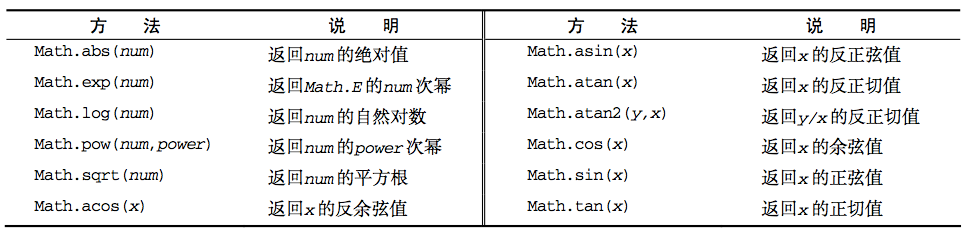

# JavaScript

完整的 JavaScript 由三部分组成

1. 核心（ECMAScript），提供核心语言功能。
2. 文档对象模型（DOM），提供访问和操作网页内容的方法和接口。
3. 浏览器对象模型（BOM），提供与浏览器交互的方法和接口。

## 我的理解

JavaScript是一个程序设计语言。它和C/C++一样都是用来编写程序的。

在web中JavaScript的作用是为页面增加交互。

交互需要对页面上的元素进行操作，而DOM可以使用JavaScript语言对HTML文档中的元素进行操作，BOM可以对浏览器进行操作。

## ECMAScript

ECMAScript 定义了 JS 的语法规范，描述了语言的基本语法和数据类型等。

Web浏览器是 ECMAScript 实现可能的宿主环境之一。宿主环境不仅提供基本的 ECMAScript 实现，同时也会提供该语言的扩展，以便语言与环境对接交互。其他宿主环境包括 Node 和 Adobe Flash。

### 基本概念

#### 语法

JS 区分大小写。

标识符指变量、函数、属性的名字，或函数的参数。命名时，由字母、下划线、$符号、数字组成，第一个字母不能是数字。采用驼峰大小写格式。

注释

```js
// 单行注释
/* 
 * 多行注释
 */
````

语句以分号结尾。如果没有，解释器会自动判断语句的结尾。

#### 变量

JS是弱类型的语言，每个变量仅仅是一个用于保存值的占位符。定义变量如下

```js
var message; // 未经过初始化的变量，会保存一个特殊的值——undefined
var i = true;
var i = 1; // 可以重复声明
i = "hello"; // 是合法的。
var type = typeof i; // 用来验证变量i的类型，返回字符串
var x; //声明一个变量
x = "hello world";
x = 'JavaScript'; // 单引号的文本同样构成字符串
x = undefined; // undefined 和 null 非常类似
// 定义多个变量
var message = "hi",
  found = false,
  age = 29;
```

如果在函数中使用了var，那这个变量就被视为一个局部变量，退出函数后就会被销毁。没有使用var，则被视为全局变量。

=== 全等号：值和类型都相同

字面量(literal)：直接在JavaScript代码中写出的数据。

#### 数据类型

5种基本数据类型

- Undefined
- Null
- Boolean
- Number
- String。

1种复杂数据类型

- Object（由一组无序的名值对组成）

typeof 操作符用来检测给定变量的数据类型。

Undefined 类型

Undefined 类型只有一个值，即特殊的 undefined。使用 var 声明变量但未对其加以初始化时，这个变量的值就是 undefined。

```js
var message;
alert(message == undefined); //true
````

Null 类型

Null 类型也是只有一个值的数据类型，这个特殊的值是 null。null 值表示一个空对象指针。

```js
alert(null == undefined); //true
````

Boolean 类型

该类型只有两个字面值：true 和 false。任何JavaScript的值都可以转换为布尔值。转换规则如下


```js
// 将某个值转换成 Boolean 值。存在自动执行的 Boolean 转换
var message = "Hello world!";
var messageAsBoolean = Boolean(message);
````

Number 类型

使用 IEEE754 格式来表示 整数和浮点数值。支持八进制（以0开头）和十六进制（以0x开头）的字面量。

```js
var octalNum1 = 070; // 八进制的 56
var hexNum1 = 0xA; // 十六进制的 10
var floatNum = 3.125e7; // 等于31250000
Number.MIN_VALUE // 能表示的最小数值
Number.MAX_VALUE // 能表示的最大数值
-Infinity // 负无穷
isFinite(num) // 判断某数值是否是有穷的
isNaN("blue"); // true 判断是否不是数值
// 将变量转换成数值
Number("abc"); // NaN
parseInt("0xaf", 16); // 第二个参数是进制数
parseFloat("12.12.1"); // 12.12
````

NaN(not a number)和任何值都不相等，包括自身。

String 类型

表示由零或多个16位 Unicode 字符组成的字符序列，即字符串。字符串由双引号""或单引号''围起来。两种符号代表的意义相同。

字符串一旦创建，它们的值就不能改变。类似replace()、toUpperCase()方法都返回新字符串，原字符串本身没有发生改变。

```js
text.length // 字符串长度
age.toString(); // 将值转换为字符串(null undefined除外)
num.toString(2); // 数值转换成字符串时，可以指定基数
String(value); // 将值转换为字符串
````

在ECMAScript5中，字符串可以当做只读数组，可以使用s[0]这种方式访问单个字符。

Object 类型

对象其实就是一组数据和功能的集合。Object 类型是所有实例的基础。

有三类

1. 用户定义对象
2. 内建对象（如，Array，Math，Date）
3. 宿主对象（由浏览器提供的预定义对象，如，Form，Image，Element，document）

```js
// 创建对象
var o = new Object();
//自定义对象
var book = {//对象是由花括号括起来的
	topic: "JavaScript",
	fat: true
};
//通过"."或"[]"来访问对象属性
book.topic;
book["fat"];
book.author = "Flanagan";//通过赋值创建另一个新属性
book.contents = {};//{}是一个空对象，它没有属性
```

#### 操作符

```js
// 一元操作符
++, --, +, -,

// 位操作符
~ (非), & (与), | (或), ^ (异或), << (左移), >> (有符号右移), >>> (无符号右移)

// 布尔操作符
! (非), && (与), || (或)

// 乘性操作符
/ (除), * (乘)

// 加性操作符
+(加), - (减)

// 关系操作符
<, >, <=, >=

// 相等操作符
==, != // 先转换操作数再比较
===, !== // 直接比较

// 条件操作符
(表达式)?(为true的值):(为false的值) 

// 赋值操作符
=

// 逗号操作符
,
```

`&&` 和 `||` 并不总是返回布尔值，而!首先将其操作数转换为布尔值，即它总是返回true或false。

```js
var max = max_width || preferences.max_width || 500;//如果max_width已经定义，直接使用它；否则在preferences对象中查找max_width；如果没有定义它，则使用一个写死的常量。
```

delete是一元操作符，用来删除对象属性或者数组元组。内置核心和客户端属性不能删除，用户通过var声明的变量不能删除。通过function语句定义的函数和函数参数也不能删除。

```js
var a = [1, 2, 3];
delete a[2];
2 in a; //=>flase
a.length; //=>3 数组长度没有改变，删除操作留下了一个“洞”
```

`,` 运算符是二元运算符，它首先计算左操作数，然后计算右操作数，最后返回右操作数的值。

== 和 != 操作符，都会先转换操作数(通常称为强制转型)，然后再比较它们的相等性。

=== 和 !== 在比较之前不转换操作数。

#### 语句

for-in 语句

```js
for (var propName in window){ // 输出顺序不可预测
  document.write(propName);
}
````

label 语句

```js
start: for (var i = 0; i < count; i++) {
  alert(i);
}
````

with 语句（不推荐）

with 语句的作用是将代码的作用域设置到一个特定的对象中。

```js
var qs = location.search.substring(1);
var hostName = location.hostname;
var url = location.href;
// 上述代码都包含location对象，可改写为
with(location){
    var qs = search.substring(1);
    var hostName = hostname;
    var url = href;
}
````

switch 语句在比较值时使用的是全等操作符。

#### 函数

ECMAScript 中的函数在定义时不必指定是否返回值。

```javascript
function functionName(arg0, arg1,...,argN) {
    statements
}
// 声明一个函数
function plus1(x){
	return x+1;
}
// 调用函数
plus1(y);
//函数是一种值，可以赋值给变量
var square = function(x){//匿名函数
	return x*x;
};
// 调用
square(plus1(y));//在一个表达式中调用两个函数
```

ECMAScript 函数不介意传递进来多少个参数，因为 ECMAScript 中的参数在内部是用一个数组来表示的。在函数体内可以通过 arguments 对象来访问这个参数数组。因此，命名的参数只提供便利，但不是必需的。

```js
// 不显式地使用命名参数
function sayHi() {
    alert("Hello " + arguments[0] + "," + arguments[1]);
    alert(arguments.length); // 参数个数
}
````

arguments[num]的值永远与对应命名参数的值保持同步。

没有传递值的命名参数将自动被赋予 undefined 值。

ECMAScript 中的所有参数传递的都是值，不可能通过引用传递参数。

ECMAScript 中，函数不能重载。如果在 ECMAScript 中定义了两个名字相同的函数，则该名字只属于后定义的函数。

### 变量、作用域、内存问题

#### 基本类型和引用类型的值

基本类型值指的是简单的数据段，而引用类型值指那些可能由多个值构成的对象。

基本数据类型是按值访问的，引用类型的值是按引用访问的（JavaScript 不允许直接访问内存中的位置）。所有函数的参数都是按值传递的，引用类型传递的是对象的地址。（跟java相同）

```js
// 对象可以动态添加属性
var person = new Object();
person.name = "Nicholas";
delete person.name; // 删除属性
````

instanceof 操作符

确定一个值是哪种基本类型可以使用 typeof 操作符，而确定一个值是哪种引用类型可以使用 instanceof 操作符。

检测对象的类型

```js
// 语法
result = variable instanceof constructor

alert(person instanceof Object); // 变量 person 是 Object 吗?
alert(colors instanceof Array); // 变量 colors 是 Array 吗? 
alert(pattern instanceof RegExp); // 变量 pattern 是 RegExp 吗?
````

#### 执行环境和作用域

执行环境

执行环境定义了变量或函数有权访问的其他数据，决定了它们各自的行为。每个执行环境都有一个与之关联的变量对象(variable object)，环境中定义的所有变量和函数都保存在这个对象中。

在 Web 浏览器中，全局执行环境被认为是 window 对象。

某个执行环境中的所有代码执行完毕后，该环境被销毁，保存在其中的所有变量和函数定义也随之销毁。

每个函数都有自己的执行环境。

当代码在一个环境中执行时，会创建变量对象的一个作用域链(scope chain)。作用域链的用途，是保证对执行环境有权访问的所有变量和函数的有序访问。

可以在函数内部访问全局变量，就是因为可以在该函数的作用域链中找到它。

```
作用域链：
某环境变量（如果是函数则是其活动对象 --> 包含该环境的环境变量 --> ... --> 全局执行环境变量
```

总结

- 执行环境有全局执行环境(也称为全局环境)和函数执行环境之分;
- 每次进入一个新执行环境，都会创建一个用于搜索变量和函数的作用域链;
- 函数的局部环境不仅有权访问函数作用域中的变量，而且有权访问其包含(父)环境，乃至全局环境;
- 全局环境只能访问在全局环境中定义的变量和函数，而不能直接访问局部环境中的任何数据;
- 变量的执行环境有助于确定应该何时释放内存。

作用域

JavaScript 没有块级作用域。

使用 var 声明的变量会自动被添加到最接近的环境中。如果初始化变量时没有使用 var 声明，该变量会自动被添加到全局环境。

垃圾收集

JavaScript 具有自动垃圾收集机制

垃圾收集策略

- 标记清除(mark-and-sweep)
- 引用计数(reference counting) 有循环引用的问题

为了确保有效地回收内存，应该及时解除不再使用的全局对象、全局对象属性以及循环引用变量的引用。

### 引用类型

引用类型有时候也被称为对象定义，因为它们描述的是一类对象所具有的属性和方法。

对象是某个特定引用类型的实例。

ECMAScript 提供了很多原生引用类型(例如 Object )，以便开发人员用以实现常见的计算任务。

#### Object 类型

```js
// 创建实例
var person = new Object(); // 使用new操作符
var person = {}; // 使用对象字面量，含义同上
var person = {
  name : "Rainy",
  age : 27
}; // 使用对象字面量
// 访问对象属性
person["name"];
person.name;
```

#### Array 类型

ECMAScript 数组的每一项可以保存任何类型的数据。

```js
// 创建数组
// 1. 使用构造函数。可以省略new操作符
var colors = new Array();
var colors = new Array(20);
var colors = new Array("red", "blue", "green");
// 2. 使用数组字面量
var colors = ["red", "blue", "green"]; // 创建一个包含 3 个字符串的数组
var names = [];
// 读写数组的值
colors[2] = "black";
colors[3] = "brown"; // 数组长度自动加一
// 数组长度
colors.length = 2; // 修改数组长度，增加的成员是 undefined
// 检测数组
if (value instanceof Array){ .. }
if (Array.isArray(value)){ .. } // ECMAScript 5+
// 展示
alert(colors.toString()); // red,blue,green
alert(colors.valueOf()); // red,blue,green
alert(colors); // red,blue,green
// 添加分隔符
alert(colors.join(","));       //red,green,blue
alert(colors.join("||"));      //red||green||blue
// 栈方法，可以让数组表现得像栈一样
var count = colors.push("red", "green");
var item = colors.pop();
// 队列方法，可以让数组表现得像队列一样
var count = colors.push("red", "green"); // 从队尾推入元素
var item = colors.shift(); // 取出队头的元素
var count = colors.unshift("red", "green"); // 从队头推入元素
var item = colors.pop(); // 从队尾取出元素
// 重排列
colors.reverse(); // 反转数组
colors.sort(); // 按升序排列数组项（按字符串排）
values.sort(compare); // 可以接收比较函数作为参数
function compare(value1, value2){
    return value1 - value2;
}
// concat返回新创建的数组
var colors = ["red", "green", "blue"];
var colors2 = colors.concat("yellow", ["black", "brown"]);
alert(colors2);    //red,green,blue,yellow,black,brown
// 返回数组的一部分（不改变原数组）。如果参数是负数，需要加上数组长度
var colors2 = colors.slice(1); // colors[1,colors.length)
var colors3 = colors.slice(1,4); // colors[1,4)
// 向数组的中部插入项。语法 splice(起始位置, 要删除的项数, 要插入的项...)
splice(0,2) // 删除数组中的前两项
splice(2,0,"red","green") // 从当前数组的位置 2 开始插入字符串"red"和"green"
splice (2,1,"red","green") // 删除当前数组位置 2 的项，然后再从位置 2 开始插入字符串"red"和"green"。
// 查找
indexOf(要查找的元素, [开始查找的位置]);// 从数组的开头(位置 0)开始向后查找
lastIndexOf(要查找的元素, [开始查找的位置]); // 从数组的末尾开始向前查找。
// 迭代方法（不修改数组）
// 传入迭代方法中的函数会接收三个参数:数组项的值、该项在数组中的位置、数组对象本身。
every() // 对数组中的每一项运行给定函数，如果该函数对每一项都返回 true，则返回 true
filter() // 对数组中的每一项运行给定函数，返回该函数会返回 true 的项组成的数组。
forEach() // 对数组中的每一项运行给定函数。这个方法没有返回值。
map() // 对数组中的每一项运行给定函数，返回每次函数调用的结果组成的数组。
some() // 对数组中的每一项运行给定函数，如果该函数对任一项返回 true，则返回 true。
// 递归方法
reduce(function(prev, cur, index, array){}, 递归基); // 从前往后
reduceRight(); // 从后往前
var values = [1,2,3,4,5];
var sum = values.reduce(function(prev, cur, index, array){
    return prev + cur;
});
alert(sum); //15
````

#### Date 类型

```js
// 创建对象
var now = new Date();
Date.parse("表示日期的字符串"); // 将字符串对应的日期转换为1970年1月1日午夜(零时)开始经过的毫秒数
var someday = new Date("表示日期的字符串"); // 会自动调用Date.parse()
Date.UTC("年份", "基于0的月份(一月是0)", ["月中的哪一天(1到31)", "小时数(0到23)", "分钟", "秒", "毫秒数"]); // 返回表示日期的毫秒数
var allFives = new Date(2005, 4, 5, 17, 55, 55); // 自动调用Date.UTC()
var start = Date.now(); // 调用时的时间
// 日期格式化方法
toDateString() // 以特定于实现的格式显示星期几、月、日和年;
toTimeString() // 以特定于实现的格式显示时、分、秒和时区;
toLocaleDateString() // 以特定于地区的格式显示星期几、月、日和年;
toLocaleTimeString() // 以特定于实现的格式显示时、分、秒;
toUTCString() // 以特定于实现的格式完整的 UTC 日期。
````


#### RegExp 类型

ECMAScript 通过 RegExp 类型来支持正则表达式。

```js
var expression = / pattern / flags ;
var pattern1 = /at/g; // 匹配字符串中所有"at"的实例
var pattern2 = /[bc]at/i; // 匹配第一个"bat"或"cat"，不区分大小写
var pattern3 = /.at/gi; // 匹配所有以"at"结尾的 3 个字符的组合，不区分大小写
// 使用构造函数。所有元字符都必须双重转义
var pattern2 = new RegExp("[bc]at", "i");
var pattern2 = new RegExp("\\[bc\\]at", "i");

// exec()方法
var text = "mom and dad and baby";
var pattern = /mom( and dad( and baby)?)?/gi; // 在设置全局标志的情况下，每次调用exec()则都会在字符串中继续查找新匹配项
var matches = pattern.exec(text); // 返回包含第一个匹配项信息的数组，或null
alert(matches.index); // 0 匹配项在字符串中的位置
alert(matches.input); // "mom and dad and baby" 应用正则表达式的字符串
alert(matches[0]); // "mom and dad and baby" 
alert(matches[1]); // " and dad and baby" 与模式中的捕获组匹配的字符串
alert(matches[2]); // " and baby" 与模式中的捕获组匹配的字符串
// test()方法
var text = "000-00-0000";
var pattern = /\d{3}-\d{2}-\d{4}/;
if (pattern.test(text)){ // 字符串与模式匹配，则返回true
    alert("The pattern was matched.");
}
````

正则表达式的匹配模式支持下列 3 个标志。

- g:表示全局(global)模式，即模式将被应用于所有字符串，而非在发现第一个匹配项时立即停止;
- i:表示不区分大小写(case-insensitive)模式，即在确定匹配项时忽略模式与字符串的大小写;
- m:表示多行(multiline)模式，即在到达一行文本末尾时还会继续查找下一行中是否存在与模式匹配的项。

正则表达式中的元字符包括: `( [ { \ ^ $ | ) ? * + .]}`，使用时需要用 `/` 转义。

在 ECMAScript 3 中，正则表达式字面量始终会共享同一个RegExp实例，而使用构造函数创建的每一个新RegExp实例都是一个新实例。ECMAScript 5 中，两者都创建新实例。

RegExp实例属性

RegExp 的每个实例都具有下列属性，通过这些属性可以取得有关模式的各种信息。

- global:布尔值，表示是否设置了 g 标志。
- ignoreCase:布尔值，表示是否设置了 i 标志。
- lastIndex:整数，表示开始搜索下一个匹配项的字符位置，从 0 算起。
- multiline:布尔值，表示是否设置了 m 标志。
- source:正则表达式的字符串表示，按照字面量形式而非传入构造函数中的字符串模式返回。


RegExp.$1、RegExp.$2...RegExp.$9，分别用于存储第一、第二......第九个匹配的捕获组。

#### Function 类型

每个函数都是 Function 类型的实例，而且都与其他引用类型一样具有属性和方法。函数名实际上也是一个指向函数对象的指针。

```js
// 定义函数
// 函数声明
function sum (num1, num2) {
  return num1 + num2;
}
// 函数表达式
var sum = function(num1, num2){
  return num1 + num2;
};
// 构造函数
var sum = new Function("num1", "num2", "return num1 + num2"); // 不推荐。最后一个参数始终都被看成是函数体
````

函数声明和函数表达式的区别

- 解析器会率先读取函数声明，使其在执行任何代码之前可用(可以访问)
- 函数表达式必须等到解析器执行到它所在的代码行，才会真正被解释执行。

函数内部属性

在函数内部，有两个特殊的对象

- arguments：类数组对象，包含着传入函数中的所有参数。
  - callee 属性：是一个指针，指向拥有这个 arguments 对象的函数。（可以解决递归算法中，与函数名耦合的问题）
- this：引用的是函数据以执行的环境对象
- caller：调用当前函数的函数的引用。

函数的属性

- length 函数希望接收的命名参数的个数
- prototype

函数的方法

- apply()
- call()
- bind()

#### 基本包装类型

3个特殊的引用类型

- Boolean
- Number
- String

当创建基本类型时，会自动创建对应的包装类型的实例，以便能够调用实例的方法。

自动创建的基本包装类型的对象，则只存在于一行代码的执行瞬间，然后立即被销毁。

对基本包装类型的实例调用 typeof 会返回"object"。所有对象都会被转换为 true。

Object 构造函数也会像工厂方法一样，根据传入值的类型返回相应基本包装类型的实例。

```js
var obj = new Object("some text");
alert(obj instanceof String); //true
````

Number 类型

```js
// 进制转换
var num = 10;
alert(num.toString()); //"10" 
alert(num.toString(2)); //"1010" 
alert(num.toString(8)); //"12" 
alert(num.toString(10)); //"10" 
alert(num.toString(16)); //"a"
// 指定小数位，可以自动舍入
var num = 10;
alert(num.toFixed(2)); //"10.00"
// 格式化数值（指数表示法），参数指定小数位
var num = 10;
alert(num.toExponential(1)); //"1.0e+1"
// 指定有效数字位数
var num = 99;
alert(num.toPrecision(1)); //"1e+2" 
alert(num.toPrecision(2)); //"99" 
alert(num.toPrecision(3)); //"99.0"
````

String 类型

```js
var stringValue = "hello world";
// length 属性，表示字符串中包含多个字符
alert(stringValue.length); //"11"
// 字符方法
alert(stringValue.charAt(1)); //"e"
alert(stringValue.charCodeAt(1)); //输出"101" 字符编码
alert(stringValue[1]); //"e"
// 字符串操作方法
// 拼接
var stringValue = "hello ";
var result = stringValue.concat("world"); // 拼接
alert(result); //"hello world"
alert(stringValue); //"hello"
// 剪切
var stringValue = "hello world";
alert(stringValue.slice(3)); //"lo world"
alert(stringValue.substring(3)); //"lo world"
alert(stringValue.substr(3)); //"lo world"
alert(stringValue.slice(3, 7)); //"lo w"
alert(stringValue.substring(3,7)); //"lo w"
alert(stringValue.substr(3, 7)); //"lo worl" 起始位置，字符总数
alert(stringValue.slice(-3)); //"rld" 将传入的负值与字符串的长度相加
alert(stringValue.substring(-3)); //"hello world" 把所有负值参数都转换为 0
alert(stringValue.substr(-3)); //"rld" 第一个参数加上字符串的长度，而将负的第二个参数转换为 0
alert(stringValue.slice(3, -4)); //"lo w"
alert(stringValue.substring(3, -4)); //"hel" 
alert(stringValue.substr(3, -4)); //""(空字符串)
// 字符串位置方法
var stringValue = "hello world";
alert(stringValue.indexOf("o"));             //4
alert(stringValue.lastIndexOf("o"));         //7
alert(stringValue.indexOf("o", 6));          //7
alert(stringValue.lastIndexOf("o", 6));      //4
// trim()方法 创建一个字符串的副本，删除前置及后缀的所有空格，然后返回结果
var stringValue = "   hello world   ";
var trimmedStringValue = stringValue.trim();
alert(stringValue);            //"   hello world   "
alert(trimmedStringValue);     //"hello world"
// 大小写转换
var stringValue = "hello world";
alert(stringValue.toLocaleUpperCase());  //"HELLO WORLD"
alert(stringValue.toUpperCase());        //"HELLO WORLD"
alert(stringValue.toLocaleLowerCase());  //"hello world"
alert(stringValue.toLowerCase());        //"hello world"
// 字符串的模式匹配方法
// match 方法
var text = "cat, bat, sat, fat";
var pattern = /.at/;
var matches = text.match(pattern); //与 pattern.exec(text)相同
alert(matches.index); //0 
alert(matches[0]); //"cat" 
alert(pattern.lastIndex); //0
// search 方法，返回字符串中第一个匹配项的索引，没找到返回-1
var text = "cat, bat, sat, fat";
var pos = text.search(/at/);
alert(pos);   //1
// replace()方法
var text = "cat, bat, sat, fat";
var result = text.replace("at", "ond");
alert(result);    //"cond, bat, sat, fat"
result = text.replace(/at/g, "ond");
alert(result);    //"cond, bond, sond, fond"
result = text.replace(/(.at)/g, "word ($1)");
alert(result);    //word (cat), word (bat), word (sat), word (fat)
function htmlEscape(text){
  return text.replace(/[<>"&]/g, function(match, pos, originalText){ // 第二个参数可以是函数
    switch(match){
      case "<":
        return "&lt;";
      case ">":
        return "&gt;";
      case "&":
        return "&amp;";
      case "\"":
        return "&quot;";
    }
  });
}
// split() 分割字符串
var colorText = "red,blue,green,yellow";
var colors1 = colorText.split(",");       //["red", "blue", "green", "yellow"]
var colors2 = colorText.split(",", 2);    //["red", "blue"]
var colors3 = colorText.split(/[^\,]+/);  //["", ",", ",", ",", ""]
// localeCompare()方法
var stringValue = "yellow";
alert(stringValue.localeCompare("brick")); //1 
alert(stringValue.localeCompare("yellow")); //0 
alert(stringValue.localeCompare("zoo")); //-1
// fromCharCode()方法 接收一或多个字符编码，然后将它们转换成一个字符串
alert(String.fromCharCode(104, 101, 108, 108, 111)); //"hello"
````


#### 内置对象

已被实例化的，不依赖于宿主环境的对象。

内置对象有：

- Object
- Array
- String
- Global
- Math

Global 对象

所有在全局作用域中定义的属性和函数，都是 Global 对象的属性。

```js
// URI 编码方法
encodeURI() // 作用于整个URI
encodeURIComponent() // 作用于URI的部分，会对所有非标准字符进行编码
// 解码
decodeURI()
decodeURIComponent()
// eval()方法 就像是一个完整的ECMAScript解析器
var dataObj = eval("("+data+")");//转换为json对象
````

Web 浏览器都是将 Global 对象作为 window 对象的一部分加以实现的。

Math对象


```js
max(参数...);
min(参数...);
var max = Math.max.apply(Math, values); // values是数组
Math.ceil() // 向上舍入
Math.floor() // 向下舍入
Math.round() // 四舍五入
Math.random() // 返回大于等于 0 小于 1 的一个随机数。[0,1)
````



#### 全局对象

全局对象的属性是全局定义的符号。它的初始属性：

1. 全局属性：undefined、Infinite、NaN
2. 全局函数：isNaN()、parseInt()、eval()
3. 构造函数：Date()、RegExp()、String()、Object()、Array()
4. 全局对象：Math、JSON

如果代码声明了一个全局变量，这个全局变量就是全局对象的一个属性。

```js
var global = this;//定义一个引用全局对象的全局变量
```

#### 类型转换

```js
//数字转...
x + ""; //等价于String(x)
var n = 17;
binary_string = n.toString(2);  //转换成"10001"(该数字的二进制数的字符串)，八进制、十六进制转换方法相同
var n = 123456.789;
//toFixed()根据小数点后的指定位数将数字转换为字符串，它从不使用指数记数法
n.toFixed(0); //"123456"
n.toFixed(2); //"123456.79"
//toExponential()使用指数记数法将数字转换为指数形式的字符串，小数点前只有一位，小数点后的位数则由参数指定
n.toExponential(1); //"1.2e+5"
//toPrecision()根据指定的有效数字位数将数字转换成字符串。
n.toPrecision(4); //"1.235e+5"
n.toPrecision(7); //"123456.8"

//字符串转...
Number("3");  //=>3
//parseInt()解析尽可能多的整数，parseFloat()解析尽可能多的浮点数，如果首字母不是数字，则返回NaN
parseInt("3 blind mice"); //=>3
parseInt("-12.34"); //=>-12
parseInt("oxff"); //=>255
parseFloat(" 3.14 meters"); //3.14
parseInt(".1"); //=>NaN
parseFloat(".1"); //=>0.1

//对象转...
Object.toString()//转字符串
Object(3) //=> new Number(3)

//布尔值转...
String(false);  //=>"false" 等价于 false.toString()
x + ""; //等价于String(x)

//转换成布尔值
Boolean([]) //=> true
!!x //等价于Boolean(x)
```

### 面向对象的程序设计（重看）

对象定义：无序属性的集合，其属性可以包含基本值、对象或者函数。

可以把 ECMAScript 的对象想象成散列表。

```js
// 使用对象字面量创建对象
var person = {
  name: "Nicholas",
  age: 29,
  job: "Software Engineer",
  sayName: function(){
    alert(this.name);
  }
};
````

属性类型

ECMAScript 中有两种属性

1. 数据属性，包含一个数据值的位置。有4个特性
  - [[Configurable]]: 能否通过 delete 删除，并重新定义
  - [[Enumerable]]: 能否通过for-in循环返回属性
  - [[Writable]]: 能够可写
  - [[Value]]: 存储属性的值
  
2. 访问器属性，不包含数据值，包含一对儿 getter 和 setter 函数(非必需)。有4个特性
  - [[Configurable]]: 能否通过 delete 删除，并重新定义
  - [[Enumerable]]: 能否通过for-in循环返回属性
  - [[Get]]: 在读取属性时调用的函数。默认值为 undefined。
  - [[Set]]: 在写入属性时调用的函数。默认值为 undefined。

```js
var person = {};
// 修改数据属性的特性
Object.defineProperty(person, "name", { // 通过defineProperty定义的特性的默认值都是false
    writable: false,
    value: "Nicholas"
});
alert(person.name); //"Nicholas" 
person.name = "Greg"; 
alert(person.name); //"Nicholas"

// 定义访问器属性
var book = {
    _year: 2004,  // 表示只能通过对象方法访问的属性
    edition: 1
};
Object.defineProperty(book, "year", {
    get: function(){
        return this._year;
    },
    set: function(newValue){
        if (newValue > 2004) {
            this._year = newValue;
            this.edition += newValue - 2004;
        }
    }
});
book.year = 2005;
alert(book.edition); //2

// 定义多个属性
var book = {};
Object.defineProperties(book, {
  _year: {
    value: 2004
  },
  edition: {
    value: 1
  },
  year: {
    get: function(){
      return this._year;
    },
    set: function(newValue){
      if (newValue > 2004) {
        this._year = newValue;
        this.edition += newValue - 2004;
      }
    }
  }
});

// 读取属性的特性
var descriptor = Object.getOwnPropertyDescriptor(book, "_year");
alert(descriptor.value); //2004
alert(descriptor.configurable); //false
alert(typeof descriptor.get); //"undefined"
var descriptor = Object.getOwnPropertyDescriptor(book, "year");
alert(descriptor.value); //undefined
alert(descriptor.enumerable); //false
alert(typeof descriptor.get); //"function"
````

#### 创建对象

- 工厂模式

解决了创建多个相似对象的问题

缺点：不能识别对象的类型

```js
function createPerson(name, age, job){
  var o = new Object();
  o.name = name;
  o.age = age;
  o.job = job;
  o.sayName = function(){
    alert(this.name);
  };
  return o;
}
var person1 = createPerson("Nicholas", 29, "Software Engineer");
var person2 = createPerson("Greg", 27, "Doctor");
````

- 构造函数模式

按照惯例，构造函数始终都应该以一个大写字母开头，而非构造函数则应该以一个小写字母开头。

构造函数本身也是函数，只不过可以用来创建对象而已。

要创建新实例，必须使用 new 操作符。任何函数，只要通过 new 操作符来调用，那它就可以作为构造函数。

创建自定义的构造函数意味着将来可以将它的实例标识为一种特定的类型。

缺点：每个方法都要在每个实例上重新创建一遍。

```js
function Person(name, age, job){
  this.name = name;
  this.age = age;
  this.job = job;
  this.sayName = function(){
    alert(this.name);
  };
}
var person1 = new Person("Nicholas", 29, "Software Engineer");
var person2 = new Person("Greg", 27, "Doctor");
alert(person2.constructor == Person); //true
alert(person1 instanceof Person);  //true
alert(person1.sayName == person2.sayName);  //false
````

- 原型模式

每个函数都有一个 prototype(原型)属性。这个属性是一个指针，指向函数的原型对象。

原型对象的用途是包含可以由特定类型的所有实例共享的属性和方法。所有原型对象都会自动获得一个 constructor (构造函数)属性，这个属性包含一个指向 prototype 属性所在函数的指针，如，Person.prototype.constructor 指向 Person。

```js
function Person(){
}
// 第一种写法
Person.prototype.name = "Nicholas";
Person.prototype.age = 29;
Person.prototype.job = "Software Engineer";
Person.prototype.sayName = function(){
  alert(this.name);
};

var person1 = new Person();
person1.sayName();   //"Nicholas"
var person2 = new Person();
person2.sayName(); //"Nicholas"
alert(person1.sayName == person2.sayName);  //true
// 检测person1的原型是不是Person
alert(Person.prototype.isPrototypeOf(person1));  //true
// 检测一个属性是存在于实例中，还是存在于原型中。
hasOwnProperty()
alert(person1.hasOwnProperty("name"));  //false
person1.name = "Greg";
alert(person1.name); //"Greg"——来自实例 
alert(person1.hasOwnProperty("name")); //true
// 检测对象是否含有某个属性
alert("name" in person1);  //true
// 取得对象上所有可枚举的实例属性
var keys = Object.keys(Person.prototype);
alert(keys);       //"name,age,job,sayName"
// 得到所有实例属性
var keys = Object.getOwnPropertyNames(Person.prototype);
alert(keys);    //"constructor,name,age,job,sayName"

// 第二种写法，prototype指向了一个新对象
Person.prototype = { // 此时 constructor = Object,
    name : "Nicholas",
    age : 29,
    job: "Software Engineer",
    sayName : function () {
        alert(this.name);
    }
};
````


不能通过对象实例重写原型中的值。当为对象实例添加一个属性时，这个属性就会屏蔽原型对象中保存的同名属性

- 组合使用构造函数模式和原型模式

```js
function Person(name, age, job){
    this.name = name;
    this.age = age;
    this.job = job;
    this.friends = ["Shelby", "Court"];
}
Person.prototype = {
    constructor : Person,
    sayName : function(){
        alert(this.name);
    }
}
````

- 动态原型模式

```js
function Person(name, age, job){
    this.name = name;
    this.age = age;
    this.job = job;
    //方法
    if (typeof this.sayName != "function"){
        Person.prototype.sayName = function(){
            alert(this.name);
        };
    }
}
````

- 寄生构造函数模式

有点类似于java的代理？

```js
function SpecialArray(){
    //创建数组
    var values = new Array();
    //添加值
    values.push.apply(values, arguments);
    //添加方法
    values.toPipedString = function(){
        return this.join("|");
    };
    //返回数组
    return values;
}
var colors = new SpecialArray("red", "blue", "green");
alert(colors.toPipedString()); //"red|blue|green"
````

缺点：不能依赖 instanceof 操作符来确定对象类型

- 稳妥构造函数模式

#### 继承

原型链

基本思想是利用原型让一个引用类型继承另一个引用类型的属性和方法。

### 函数表达式（重看）

函数声明提升：在执行代码之前会先读取函数声明。

递归

```js
var factorial = (function f(num){
  if (num <= 1){
    return 1;
  } else {
    return num * f(num-1);
  }
});
````

闭包

闭包是指有权访问另一个函数作用域中的变量的函数。

当某个函数被调用时

1. 会创建一个执行环境(execution context)及相应的作用域链。
2. 使用 arguments 和其他命名参数的值来初始化函数的活动对象(activation object)。

后台的每个执行环境都有一个表示变量的对象——变量对象。

## DOM（文档对象模型）

DOM 是针对 XML 但经过扩展用于 HTML 的 API。DOM 把整个页面映射为一个多层节点结构。HTML 或 XML 页面中的每个组成部分都是某种类型的节点，这些节点又包含着不同类型的数据。

DOM 把 HTML 看做是文档树，通过 DOM 提供的API可以对树上的节点进行操作。

DOM操作分为3个方面

- DOM Core

> 并不专属于JavaScript，任何一种支持DOM的程序设计语言都可以使用它。

- HTML-DOM

> 提供一些简明的记号来描述各种HTML元素的属性。也可以使用DOM Core实现，用HTML-DOM代码比较短，但只能用来处理web文档。如
> document.forms
> element.src

- CSS-DOM
   
> 针对CSS的操作，获取和设置style对象的各种属性。如
> element.style.color = "red";

常用节点

1. 元素节点：对应html里的元素
2. 文本节点：文本节点总是被包含在元素节点的内部。
3. 属性节点：用来对元素作出更具体的描述，总是被包含在元素节点中。

DOM经常进行的操作

- 获取元素
- 动态创建元素
- 对元素进行操作(设置其属性或调用其方法)
- 事件(什么时机做相应的操作)

使用原则

JS只应该用来充实文档内容，要避免使用DOM技术来创建核心内容。

### 节点层次

#### Node 类型

属性

- nodeType 节点类型
- nodeName 元素节点，则是元素的标签名
- nodeValue 元素节点，则为null
- childNodes 保持着一个 NodeList 对象（是基于 DOM 结构动态执行查询的结果）
- parentNode 指向文档树中的父节点
- previousSibling 前一个同胞节点
- nextSibling 后一个同胞节点
- firstChild childNodes中的第一个节点
- lastChild childNodes中的最后一个节点
- ownerDocument 指向表示整个文档的文档节点

每个节点都有一个 nodeType 属性，用于表明节点的类型。有 12 种类型的 node

- Node.ELEMENT_NODE(1);
- Node.ATTRIBUTE_NODE(2);
- Node.TEXT_NODE(3);
- Node.CDATA_SECTION_NODE(4);
- Node.ENTITY_REFERENCE_NODE(5);
- Node.ENTITY_NODE(6);
- Node.PROCESSING_INSTRUCTION_NODE(7);
- Node.COMMENT_NODE(8);
- Node.DOCUMENT_NODE(9);
- Node.DOCUMENT_TYPE_NODE(10);
- Node.DOCUMENT_FRAGMENT_NODE(11);
- Node.NOTATION_NODE(12)。

```js
// nodeType
if (someNode.nodeType == 1){
    value = someNode.nodeName; //nodeName 的值是元素的标签名
}
// childNodes
var firstChild = someNode.childNodes[0];
var secondChild = someNode.childNodes.item(1);
var count = someNode.childNodes.length;
var arrayOfNodes = Array.prototype.slice.call(someNode.childNodes,0);
````

操作节点

```js
// 在 childNodes 末尾添加节点
var returnedNode = someNode.appendChild(newNode);
alert(returnedNode == newNode); //true 
alert(someNode.lastChild == newNode); //true
// 插入节点
var returnedNode = someNode.insertBefore(newNode, null); //插入后成为最后一个子节点
var returnedNode = someNode.insertBefore(newNode, someNode.firstChild); //插入后成为第一个子节点
var returnedNode = someNode.insertBefore(newNode, someNode.lastChild); //插入到最后一个子节点前面
// 替换节点
var returnedNode = someNode.replaceChild(newNode, someNode.firstChild); //替换第一个子节点
// 移除节点
var formerFirstChild = someNode.removeChild(someNode.firstChild);
// 创建节点副本
var deepList = myList.cloneNode(true); // 深复制，复制节点及子节点
var shallowList = myList.cloneNode(false); // 浅复制，只复制节点
// 处理不规范的文本节点
normalize()
````

#### Document 类型

JavaScript 通过 Document 类型表示文档。

在浏览器中，document 对象是 HTMLDocument(继承自 Document 类型)的一个实例，表示整个 HTML 页面。document 对象是 window 对象的一个属性，因此可以将其作为全局对象来访问。Document 节点具有下列特征

- nodeType 的值为 9;
- nodeName 的值为"#document";
- nodeValue 的值为 null;
- parentNode 的值为 null;
- ownerDocument 的值为 null;
- 其子节点可能是一个 DocumentType(最多一个)、Element(最多一个)、ProcessingInstruction 或 Comment。

Document 节点的属性

- documentElement 指向 HTML 页面中的 `<html>` 元素
- childNodes 文档子节点
- body 指向 `<body>` 元素
- doctype 对 `<!DOCTYPE>` 的引用(不同浏览器的实现不同)

document 对象特有的属性

- title `<title>` 元素中的文本
- URL 包含页面完整的 URL(即地址栏中显示的 URL)
- domain 只包含页面的域名。只能设置成更高层次的域名
- referrer 链接到当前页面的那个页面的 URL，或空字符串
- implementation 检测浏览器实现了DOM的哪些部分
  - hasFeature("名称", "版本号")

示例

html 页面

```html
<html>
    <body>
        <div id="myDiv">Some text</div>
        

        <ul>
            <li><input type="radio" value="red" name="color" id="colorRed"> <label for="colorRed">Red</label></li>
            <li><input type="radio" value="green" name="color" id="colorGreen"> <label for="colorGreen">Green</label></li>
            <li><input type="radio" value="blue" name="color" id="colorBlue"> <label for="colorBlue">Blue</label></li>
        </ul>

        <p>The current date and time is:
        <script type="text/javascript">
            document.write("<strong>" + (new Date()).toString() + "</strong>");
        </script>
        </p>
    </body>
</html>
```

JavaScript 代码

```js
var html = document.documentElement; //取得对<html>的引用 
alert(html === document.childNodes[0]); //true
alert(html === document.firstChild); //true

// 查找元素
// 1. getElementById
var div = document.getElementById("myDiv"); //取得<div>元素的引用。如果有多个，则只返回第一个
// 2. getElementsByTagName
var images = document.getElementsByTagName("img"); // 返回一个 HTMLCollection 对象，是一个“动态”的集合
var shopping = document.getElementById("purchases");
var items = shopping.getElementsByTagName("*");//获得id为purchases的元素中包含的所有元素，"*"是通配符
// 3. getElemntsByClassName
var apple = document.getElementsByClassName("apple");
// 4. 根据选择器获取元素
var text = document.querySelector("#text");
var boxes = document.querySelectorAll(".box");

alert(images.length); //输出图像的数量
alert(images[0].src); //输出第一个图像元素的 src 特性
alert(images.item(0).src); //输出第一个图像元素的 src 特性
var myImage = images.namedItem("myImage"); // 根据name特性取得某项
var myImage = images["myImage"]; // 同上
var allElements = document.getElementsByTagName("*"); // 取得所有元素
var radios = document.getElementsByName("color"); // 获得name=color的单选按钮
// 文档写入
// write()、writeln()、open()和 close()
````

#### Element 类型

用于表现 XML 或 HTML 元素，提供了对元素标签名、子节点及特性的访问。具有以下特征:

- nodeType 的值为 1;
- nodeName 的值为元素的标签名;
- nodeValue 的值为 null;
- parentNode 可能是 Document 或 Element;
- 其子节点可能是 Element、Text、Comment、ProcessingInstruction、CDATASection 或 EntityReference。

HTML 元素

所有 HTML 元素都由 HTMLElement 类型表示，HTMLElement 类型直接继承自 Element 并添加了一些属性。

- id，元素在文档中的唯一标识符。
- title，有关元素的附加说明信息，一般通过工具提示条显示出来。
- lang，元素内容的语言代码，很少使用。
- dir，语言的方向，值为"ltr"(left-to-right，从左至右)或"rtl"(right-to-left，从右至左)，也很少使用。
- className，与元素的 class 特性对应，即为元素指定的 CSS 类。

attributes 属性

attributes 属性中包含一个 NamedNodeMap，与 NodeList 类似，也是一个“动态”的集合。元素的每一个特性都由一个 Attr 节点表示，每个节点都保存在 NamedNodeMap 对象中。NamedNodeMap 对象拥有下列方法。

- getNamedItem(name):返回 nodeName 属性等于 name 的节点;
- removeNamedItem(name):从列表中移除 nodeName 属性等于 name 的节点;
- setNamedItem(node):向列表中添加节点，以节点的 nodeName 属性为索引;
- item(pos):返回位于数字 pos 位置处的节点。

childNodes 属性

包含元素的所有子节点。可能包含空白的文本节点，遍历时需要检查节点类型。


```html
<div id="myDiv" class="bd" title="Body text" lang="en" dir="ltr"></div>
```

```js
// 属性
var div = document.getElementById("myDiv");
alert(div.tagName);     //"DIV"
alert(div.tagName == div.nodeName); //true
div.tagName.toLowerCase() == "div";
alert(div.id); //"myDiv"
alert(div.className); //"bd"

// 操作特性(特性的名称不区分大小写)
// 获取
alert(div.getAttribute("class")); //"bd"
// 设置节点属性。如果属性不存在，就创建；存在，就覆盖。通过setAttribute对文档修改后，在浏览器的view source选项去查看文档的源代码，看到的仍是改变前的属性值。
div.setAttribute("class", "ft");
// 清除
div.removeAttribute("class");

// attributes属性
// 获取
var id = div.attributes.getNamedItem("id").nodeValue; //"myDiv"
var id = div.attributes["id"].nodeValue;
// 设置
div.attributes["id"].nodeValue = "someOtherId";
// 删除
var oldAttr = div.attributes.removeNamedItem("id");
// 添加
div.attributes.setNamedItem(newAttrNode);

// 创建元素
var div = document.createElement("div");
// 添加元素
document.body.appendChild(div);
insertBefore();
replaceChild();

// 元素的子节点
var ul = document.getElementById("myList");
var items = ul.getElementsByTagName("li"); // 获取ul元素下的li节点
````

#### Text 类型

文本节点由 Text 类型表示，包含的是可以照字面解释的纯文本内容。纯文本中可以包含转义后的 HTML 字符，但不能包含 HTML 代码。Text 节点具有以下特征:

- nodeType 的值为 3;
- nodeName 的值为"#text";
- nodeValue 的值为节点所包含的文本;
- parentNode 是一个 Element;
- 不支持(没有)子节点。


```js
// 操作节点中的文本
appendData(text) // 将 text 添加到节点的末尾。
deleteData(offset, count) // 从 offset 指定的位置开始删除 count 个字符。
insertData(offset, text) // 在 offset 指定的位置插入 text。
replaceData(offset, count, text) // 用 text 替换从 offset 指定的位置开始到 offset+count 为止处的文本。
splitText(offset) // 从 offset 指定的位置将当前文本节点分成两个文本节点。
substringData(offset, count) // 提取从 offset 指定的位置开始到 offset+count 为止处的字符串。

// 创建文本节点
var textNode = document.createTextNode("<strong>Hello</strong> world!"); // <>等会被编码
// 规范化文本节点
element.normalize(); // 将元素中的多个文本节点合并
// 分割文本节点 将一个文本节点分成两个文本节点
var newNode = textNode.splitText(5); // 返回后一个文本节点
````

#### Comment 类型

注释在 DOM 中是通过 Comment 类型来表示的。Comment 节点具有下列特征:

- nodeType 的值为 8;
- nodeName 的值为"#comment";
- nodeValue 的值是注释的内容;
- parentNode 可能是 Document 或 Element;
- 不支持(没有)子节点。

可以通过 nodeValue 或 data 属性来取得注释的内容。

```js
// 创建注释
var comment = document.createComment("A comment");
// 访问注释
comment.data;
````

#### CDATASection 类型

CDATASection 类型只针对基于 XML 的文档，表示的是 CDATA 区域。CDATASection 节点具有下列特征:

- nodeType 的值为 4;
- nodeName 的值为"#cdata-section";
- nodeValue 的值是 CDATA 区域中的内容;
- parentNode 可能是 Document 或 Element;
- 不支持(没有)子节点。

```js
// 创建 CDATA 区域
document.createCDataSection()
````

#### Attr 类型

元素的特性在 DOM 中以 Attr 类型来表示。特性就是存在于元素的 attributes 属性中的节点。具有下列特征:

- nodeType 的值为 2;
- nodeName 的值是特性的名称;
- nodeValue 的值是特性的值;
- parentNode 的值为 null;
- 在 HTML 中不支持(没有)子节点;
- 在 XML 中子节点可以是 Text 或 EntityReference。

特性不被认为是 DOM 文档树的一部分。

有 3 个属性

- name 特性名称
- value 特性的值
- specified 布尔值，表示特性是指定的，还是默认的。

```js
// 创建特性节点（不常用）
var attr = document.createAttribute("align");
attr.value = "left";
element.setAttributeNode(attr);
````

### 操作技术

```js
// 加载外部的js文件
function loadScript(url){
    var script = document.createElement("script");
    script.type = "text/javascript";
    script.src = url;
    document.body.appendChild(script);
}
// 加载样式
function loadStyles(url){
    var link = document.createElement("link");
    link.rel = "stylesheet";
    link.type = "text/css";
    link.href = url;
    var head = document.getElementsByTagName("head")[0];
    head.appendChild(link);
}
// 遍历节点
// NodeList, NamedNodeMap, HTMLCollection 是动态的，每当文档结构发生变化时，它们都会得到更新。
var divs = document.getElementsByTagName("div"),
    i,
    len,
    div;
// 错误，会导致无限循环。
for (i=0; i < divs.length; i++){
        div = document.createElement("div");
        document.body.appendChild(div);
}
// 正确
for (i=0, len=divs.length; i < len; i++){ 
    div = document.createElement("div");
    document.body.appendChild(div);
}
````

### 事件处理

onmouseover：鼠标悬停在某个元素时

onmouseout：鼠标离开某个元素时

onclick：点击某个链接时

onload：页面加载时

onclick：鼠标点击

onblur：失去焦点

onfocus：获得焦点

onkeyup：按键抬起

onsubmit：提交(="return someFunction()")

onchange：当元素的值发生改变时。仅适用于文本域（text field）、textarea、select元素。

ondbclick：双击

事件添加方式

```js
var btn = getElementById("#btn");
btn.onclick = function(){
  //在from表单中，type=button的按钮，想要提交表单数据，需要这样做。
  fromObj = document.getElementById("myForm");
  formObj.action = "urlpath";
  formObj.method = "get";
  formObj.submit();
};
```

添加事件的另一个方式，使用“javascript:”伪协议。但不推荐使用，因为不能实现平稳退化。

`<a href="javascript:popUp();">Example</a>`

### 动态创建元素

#### 创建元素

传统方法

1. document.write() 把字符串插入到文档内

```js
document.write("<p>This is inserted.</p>");//将语句写入html文档中
```

2. innerHTML属性 读写某给定元素里的HTML内容
     
```js
var testdiv = document.getElementById("testdiv");
testdiv.innerHTML = "<p>I inserted content.</p>";//无论testdiv里有没有内容，都会被替换成innerHTML里的内容。
```

DOM方式

1. 创建一个新的元素
2. 把这个新元素插入节点树

```js
//创建元素节点
var para = document.createElement("p");
var testdiv = document.getElementById("testdiv");
testdiv.appendChild(para);//让元素节点成为testdiv的子节点
//创建文本节点
var text = document.createTextNode("hello, world.");
para.appendChild(text);//为p元素添加文本
```

#### 插入元素

在已有元素前插入一个元素

```js
parentElement.insertBefore(newElement, targetElement);
//也可以写成
targetElement.parentNode.insertBefore(newElement, targetElement);
```

在已有元素后插入一个元素
```js
function insertAfter(newElement, targetElement){
    var parent = targetElement.parentNode;
    if(parent.lastChild == targetElement){
        parent.appendChild(newElement);
    }
    else{
        parent.insertBefore(newElement, targetElement.nextSibling);
    }
}
```

### CSS-DOM

使用原则

只是CSS的补充增强，使用CSS设置样式是第一选择。理想的方式是，通过更新这个元素的class属性来更改样式。

#### style属性

每个元素节点都有，包含着元素的样式。只能返回内嵌样式，外部样式无法获取到。

##### 获取样式

```js
element.style.property;//查询style属性，返回一个字符串
element.style.color;//颜色
element.style.fontFamily;//字体，font-family中的"-"（减号）是保留字符，在DOM中需要采用驼峰命名法，变成fontFamily
```

##### 设置样式

element.style.property = value;

#####className属性

获得和设置元素的class

```js
element.className = "intro";//将替换原来的class属性
element.className += " intro";//将追加到原来的class属性上。注意有个空格
//为元素增加class的函数
function addClass(element, value){
    if(!element.className){
        element.className = value;
    }else{
    newClassName = element.className;
    newClassName += " ";
    newClassName += value;
    element.className = newClassName;
    }
}
```

## BOM（浏览器对象模型)

BOM 可以访问和操作浏览器窗口，可以控制浏览器显示的页面以外的部分。

window对象对应着浏览器窗口本身，这个对象的属性和方法通常统称为BOM。通过BOM可以操作浏览器窗口，比如：弹出框、控制浏览器跳转、获取分辨率等。

### window 对象

在浏览器中，window 对象有双重角色，它既是通过 JavaScript 访问浏览器窗口的一个接口，又是 ECMAScript 规定的 Global 对象。

所有在全局作用域中声明的变量、函数都会变成 window 对象的属性和方法。

全局变量不能通过 delete 操作符删除，而直接在 window 对象上的定义的属性可以。

如果页面中包含框架，则每个框架都拥有自己的 window 对象，并且保存在 frames 集合中。top 对象始终指向最高(最外)层的框架，也就是浏览器窗口。

```js
// 第一个框架的window对象
top.frames[0]
window.frames[0]
// 跨浏览器取得窗口左边和上边的位置
var leftPos = (typeof window.screenLeft == "number") ?
                  window.screenLeft : window.screenX;
var topPos = (typeof window.screenTop == "number") ?
                  window.screenTop : window.screenY;
//将窗口移动到屏幕左上角
window.moveTo(0,0);
//将窗向下移动 100 像素
window.moveBy(0,100);
// 确定一个窗口的大小
innerWidth、innerHeight、outerWidth 和 outerHeight。
// 调整浏览器窗口大小
// 调整到 100×100
window.resizeTo(100, 100);
// 在100x100基础上，调整到 200×150
window.resizeBy(100, 50);

// 导航和打开窗口
window.open(url, name, features) // 创建新的浏览器窗口
window.open("http://www.wrox.com/", "topFrame"); // 等同于< a href="http://www.wrox.com" target="topFrame"></a>
window.open("http://www.wrox.com/","wroxWindow", "height=400,width=400,top=10,left=10,resizable=yes");
// 检测弹窗是不是被屏蔽了
var blocked = false;
try {
  var wroxWin = window.open("http://www.wrox.com", "_blank");
  if (wroxWin == null){
    blocked = true;
  }
} catch (ex){
  blocked = true;
}
if (blocked){
  alert("The popup was blocked!");
}

// 超时调用。单位，毫秒
var timeoutId = setTimeout(function() {
    alert("Hello world!");
}, 1000);
// 取消超时调用
clearTimeout(timeoutId);

// 间歇调用。按照指定的时间间隔重复执行代码
var intervalId = setInterval (function() {
    alert("Hello world!");
}, 10000);
// 取消间歇调用
clearInterval(intervalId);

// 对话框
alert() // 只包含确定按钮
confirm() // 包含确定和取消按钮，返回布尔值
prompt() // 提示用户输入信息，返回文本输入域的值

console.log() // 向控制台输出
//显示“打印”对话框
window.print();
//显示“查找”对话框
window.find();

// 页面加载事件
// onload
window.onload = function(){
  // 当页面加载完成执行
  // 当页面完全加载所有内容（包括图像、脚本文件、CSS 文件等）执行
}
// onunload
window.onunload = function(){
	// 当用户退出页面时执行
}
````

### location 对象

既是 window 对象的属性，也是 document 对象的属性;


每次修改 location 的属性(hash 除外)，页面都会以新 URL 重新加载。

```js
// 跳转到某个页面
location.assign("http://www.wrox.com");
window.location = "http://www.wrox.com";
location.href = "http://www.wrox.com";
// 跳转到页面，但是不会产生历史记录，即回退时不会回到前一个页面。
location.replace("http://www.wrox.com/");
// 重新加载当前显示的页面
location.reload(); //重新加载(有可能从缓存中加载)
location.reload(true); //重新加载(从服务器重新加载)
````

### navigator 对象

使用 plugins 数组来检测插件，该数组中的每一项都包含下列属性。

- name:插件的名字。
- description:插件的描述。
- filename:插件的文件名。
- length:插件所处理的 MIME 类型数量。

### history对象

保存着用户上网的历史记录

```js
//后退一页
history.go(-1);
//前进一页
history.go(1);
//前进两页
history.go(2);
//跳转到最近的 wrox.com 页面，没找到就什么都不做
history.go("wrox.com");
//后退一页
history.back();
//前进一页 
history.forward();
````

### 定时器

setTimeout()和clearTimeout()

在指定的毫秒数到达之后执行指定的函数，只执行一次

```js
//创建一个定时器，1000毫秒后执行，返回定时器的标示
var timerId = setTimeout(function(){
  console.log('Hello World');
}, 1000);

//取消定时器的执行
clearTimeout(timerId);
```

setInterval()和clearInterval()

定时调用的函数，可以按照给定的时间(单位毫秒)周期调用函数

```js
//创建一个定时器，每隔1秒调用一次
var timerId = setInterval(function(){
  var date = new Date();
  console.log(date.toLocaleTimeString());
}, 1000);

//取消定时器的执行
clearInterval(timerId);
```

## Ajax

Asynchronous JavaScript and XML（异步JavaScript和XML）。是一系列技术形成的结合体。对页面的请求以异步方式发送到服务器，不用刷新整个页面，即网页其他地方保持不变。

它的核心是 XMLHttpRequest 对象，发送异步请求、接收响应、执行回调都是通过这个对象来完成。各大浏览器厂商都以 JavaScript 内置对象的方式来实现 XMLHttpRequest 对象。

使用步骤

1. 创建xmlhttprequest对象
2. 发送请求
3. 获取响应

```js
var xmlHttpReq = new XMLHttpRequest(); // 新版浏览器支持
xmlHttpReq.open('GET', url, true); // true 表示异步
xmlHttpReq.withCredentials = true; // 表示向服务器发送Cookies
xmlHttpReq.onreadystatechange = handler; // 设置回调函数
xmlHttpReq.send(null); // 使用get方法，可以用null做参数

function handler(){
  if(xmlHttpReq.readyState == 4){
    if(xmlHttpReq.status == 200){
      // code
    }
  }
}

// 获得响应头
var req = new XMLHttpRequest();
req.open('GET', location.href, false);
req.send(null);
var headers = req.getAllResponseHeaders().toLowerCase();
alert(headers);
````

新旧浏览器都支持的版本

```js
function get() {
  var request = ajaxFunction();
  //调用open方法并采用异步方式
  request.open("GET", "/DemoServlet01?name=aa&age=18", true);

  //设置回调函数，使用返回的数据
  request.onreadystatechange = function(){//一旦redayState的值改变，将会调用该函数
    if(request.readyState == 4 && request.status == 200)
      alert(request.responseText);
  }
  //发送请求
  request.send();
}

function post(){
  var request = ajaxFunction();
  //调用open方法并采用异步方式
  request.open("GET", "/DemoServlet01", true);
  //说明数据类型是一个经过url编码的表单数据
  request.setRequestHeader("Content-type","application/x-www-form-urlencoded");
  //发送请求
  request.send("name=abc&age=19");
}

//创建XMLHttpRequest对象
function ajaxFunction(){
  var xmlHttp;
  try{
    xmlHttp = new XMLHttpRequest();
  } catch (e){
    try{
      xmlHttp = new ActiveXObject("Msxml2.XMLHTTP");
    } catch(e){
      try{
        xmlHttp = new ActiveXObject("Microsoft.XMLHTTP");
      } catch(e){
      }
    }
  }
  return xmlHttp;
}
```

## 参考资料

《JavaScriptDom编程艺术》

《JavaScript权威指南》

《JavaScript高级程序设计》