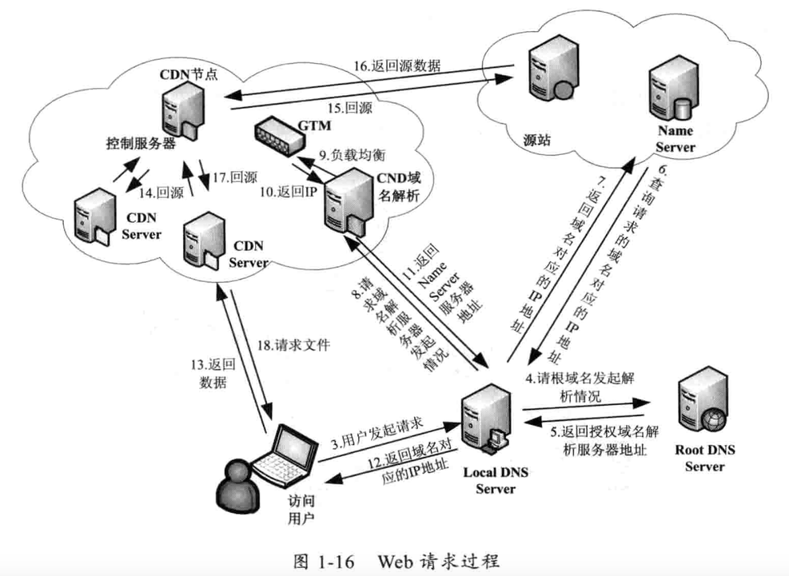

# JavaWeb

## Web请求过程

### 浏览器缓存机制

直接请求URL不使用缓存

Windows：ctrl + F5

Mac：Command + shift + r

此时，请求头中加了两个请求项

```
Pragma:no-cache
Cache-Control:no-cache
```

1. Cache-Control/Pragma

指定缓存机制的行为

以上两个指令作用相同，Cache-Control被各个浏览器支持的较好。


2. Expires

后跟一个时间，超过这个时间后，缓存内容将失效。

3. Last-Modified/Etag

Last-Modified：表示一个服务器上的资源的最后修改时间

Etag：让服务端给每个页面分配一个唯一的编号

### DNS 域名解析


1. 查看浏览器缓存中是否有域名对应的IP地址
2. 查看操作系统缓存（etc/hosts文件）中是否有
3. 查询本地DNS服务器，Windows通过 `ipconfig` 可以查询到LDNS地址，Linux通过 `cat /etc/resolv.conf` 查询。
4. 到 Root Server 域名服务器请求解析
5. 返回主域名服务器（gTLD Server）
6. 向gTLD服务发送请求
7. 查询对应的 Name Server 域名服务器（你注册的域名服务器）地址
8. Name Server 域名服务器查询域名和IP的映射关系，返回IP和TTL值
9. LDNS缓存域名和IP的映射关系，缓存时间由TTL控制。
10. 将IP和TTL给用户，缓存在本地系统缓存中。

跟踪域名解析过程

```sh
# 查看域名解析结果
nslookup
# 查询DNS解析过程（Linux）
dig www.taobao.com
dig www.taobao.com +trace
```

清除本机缓存的域名

1. Windows 下执行 `ipconfig /flushdns`
2. Linux 下，通过 `/etc/init.d/nscd restart` 来清除
3. JVM中，DNS解析的结果使用 InetAddress 类缓存。
    1. 有两种缓存策略，在 `%JAVA_HOME%/lib/security/java.security` 文件中配置
        1. 正确解析结果缓存，使用 `networkaddress.cache.ttl` 配置，默认是-1（永不失效）
        2. 失败的解析结果缓存，使用 `networkaddress.cache.negative.ttl` 配置，默认是10（缓存10秒）
    2. 修改方式
        1. 在配置文件中直接改
        2. 在JVM启动参数中，增加 `-Dsun.net.inetaddr.ttl=xxx` 修改默认值
        3. 通过InetAddress类动态修改

域名解析方式

1. A记录：Address，用来指定域名对应的IP地址。可以将多个域名解析到一个IP地址，但不能将域名解析到多个IP地址。
2. MX记录：Mail Exchange，将某个域名下的邮件服务器指向自己的Mail Server
3. CNAME记录：Canonical Name（别名解析），可以为一个域名设置一个或多个别名
4. NS记录：为某个域名指定DNS解析服务器
5. TXT记录：为某个主机或域名设置说明

### CDN工作机制

内容分发网络（Content Delivery Network），CDN = 镜像（Mirror）+ 缓存（Cache）+ 整体负载均衡（GSLB）



负载均衡（Load Balance）：对工作任务进行平衡、分摊到多个操作单元上执行。

1. 优点：
    1. 提高服务器响应速度和利用效率
    2. 避免软件、硬件模块出现单点失效
    3. 解决网络拥塞
    4. 实现地理位置无关性
2. 有3种负载均衡架构
    1. 链路负载均衡：通过DNS解析成不同IP，来访问不同的目标服务器
        1. 优点：用户直接访问目标服务器，访问速度快
        2. 缺点：WebServer挂掉，且用户本地缓存没有更新，用户将无法访问这个域名
    2. 集群负载均衡，分为
        1. 硬件负载均衡：使用一台专门的硬件设备来转发请求。
            1. 优点：性能好
            2. 缺点：贵，不能动态扩容。
        2. 软件负载均衡
            1. 优点：成本低
            2. 缺点：一次访问经过多次代理服务器，增加网络延迟
    3. 操作系统负载均衡：利用操作系统级别的软中断、硬件中断来达到负载均衡，如设置多队列网卡。


## Java I/O 工作机制

Java I/O 类库的基本架构

1. 基于字节操作：InputStream、OutputStream
2. 基于字符操作：Writer、Reader
3. 基于磁盘操作：File
4. 基于网络操作：Socket

访问文件的方式

读入和写入文件 I/O 操作都需要调用操作系统提供的接口，应用程序访问物理设备只能通过系统调用的方式。读：read()，写：write()

序列化：将对象转化成一串二进制表示的字节数组。

反序列化：将字节数组构造成对象。需要有原始类作为模板。

复杂对象序列化总结

- 父类继承 Serializable 接口时，所有子类都可以被序列化
- 子类实现了 Serializable 接口，但父类没有，父类中的属性不能被序列化（不报错，数据丢失），子类中的属性能正确序列化
- 序列化的属性是对象，则这个对象的类必须实现 Serializable 接口，否则报错。
- 反序列化时，如果对象的属性有修改或删减，则修改的部分属性会丢失，但不报错。
- 反序列化时，如果 serialVersionUID 被修改，则反序列化失败。

网络 I/O


磁盘I/O优化

```sh
# 查看IO性能
iostate
```

TCP 网络参数调优


```sh
# 查看主机可以使用的端口范围
cat /proc/sys/net/ipv4/ip_local_port_range
# 查看网络连接情况
netstat -n | awk '/^tcp/ {++state[$NF]} END {for(key in state) print key, "\t", state[key]}'
# 设置 TIME_WAIT 的时间
sh -c "echo 3 > /proc/sys/net/ipv4/tcp_fin_timeout"
# 查看TCP的统计信息
cat /proc/net/netstat
# 查看当前系统的连接情况
cat /proc/net/snmp
# 查看网络的统计信息
netstat -s
```

网络IO优化

1. 减少网络交互次数。使用缓存、将多个文件合并在一个HTTP链接中
2. 减少网络传输数据量的大小。将数据压缩后再传输。
3. 减少编码。

## JavaWeb 中的编码问题

- ASCII 码：有128个，1个字节的低7位表示，0-31是控制字符，32-126是打印字符。
- ISO-8859-1：有256个，扩展ASCII编码，能表示大多数西欧语言字符。
- GB2312：全称《信息技术 中文编码字符集》，双字节编码，编码范围是A1-F7。A1-A9是符号区，有682个；B0-F7是汉字区，有6763个。
- GBK：全称《汉字内码扩展规范》，扩展GB2312。
- GB18030：全称《信息技术 中文编码字符集》，与GB2312兼容。
- UTF-16：定义了Unicode字符在计算机中的存取方法。2字节表示一个字符。
- UTF-8：采用变长技术，每个编码区域有不同的字码长度，不同类型的字符可以由1-6个字节组成。编码规则
    - 字节最高位为0，表示是一个1字节的ASCII字符
    - 字节以11开头，则连续的1暗示字符的字节个数，如 `110xxxxx` 表示是双字节 UTF-8 字符的首字节。
    - 字节以10开头，则表示该字节不是首字节，需要向前查找。

```java
Charset charset = Charset.forName("UTF-8");
ByteBuffer byteBuffer = charset.encode(string);
CharBuffer charBuffer = charset.decode(byteBuffer);
// 软转换
ByteBuffer heapByteBuffer = ByteBuffer.allocate(1024);
ByteBuffer byteBuffer = heapByteBuffer.putChar(c); // 将char拆分成2个byte
```


URL的编解码


URL中存在中文时，需要编码，规则是：将非ASCII字符按照某种格式编码成16进制数后，将每个16进制表示的字节前加上“%”。PathInfo是UTF-8编码，QueryString是GBK编码。

在Tomcat中，Port在 `<Connector port="8080"/>` 中配置，Context Path在 `<Context path="/examples/>` 中配置，对URI部分进行

```
编解码过程
URL --> URL编码 --> request.getParameter 获得参数，调用parseParameters 解码 -->
```


MVC设计模式
开发模式
JavaBean+JSP
	JavaBean：业务封装
	JSP：在html里写java代码
Servlet+JavaBean+JSP
MVC模式
M：model
V：view
C：control

使用设计模式的原因
1. 内聚
2. 关注点分离
3. 封装细节


JavaEE分层
客户端
web层：		Servlet/jsp
业务逻辑层：	EJB(javaBean)
数据访问层：	Dao

## 参考资料

《深入分析JavaWeb技术内幕》


