# java 基础

## Java 程序环境

java术语

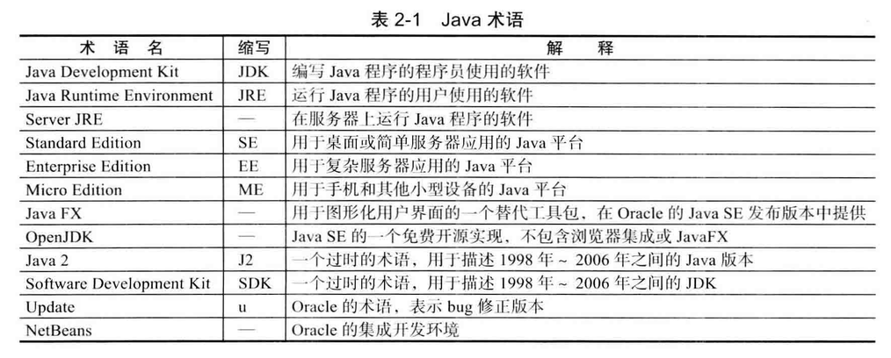

Java 解释器可以在任何移植了解释器的机器上执行 Java 字节码。

虚拟机有一个选项，可以将执行最频繁的字节码序列翻译成机器码，这一过程被称为即时编译。字节码可以(在运行时刻)动态地翻译成对应运行这个应用的特定 CPU 的机器码。因此采用 Java 编写的“热点”代码其运行速度与C++相差无几，有些情况下甚至更快。

### 安装

#### 入门

1. 在CentOS的/usr/local/下创建java文件夹
2. 使用tar命令将jdk文件解压到此文件夹，并将文件夹改名为java
3. 在 `~/.bash_profile` 文件（只对当前用户生效）内，或者 `/etc/profile` （对所有用户生效）内，配置JAVA_HOME、PATH路径
4. 在shell内运行 `source ~/.bash_profile` 或 `source /etc/profile` 加载配置

```sh
export JAVA_HOME=/usr/local/java
# 将安装目录(jdk/bin)增加到执行路径中(执行路径是操作系统查找可执行文件时所遍历的目录列表)。
export PATH=$JAVA_HOME/bin:$PATH
export CLASSPATH=.:$JAVA_HOME/lib/dt.jar:$JAVA_HOME/lib/tools.jar
```

测试设置是否正确

```sh
javac -version
# javac 1.8.0
```

#### 配置

需要配置的环境变量

1. PATH环境变量。作用是指定命令搜索路径，在shell下面执行命令时，它会到PATH变量所指定的路径中查找看是否能找到相应的命令程序。我们需要把 jdk安装目录下的bin目录增加到现有的PATH变量中，bin 目录中包含经常要用到的可执行文件如javac/java/javadoc等待，设置好 PATH 变量后，就可以在任何目录下执行 javac/java 等工具了。
2. CLASSPATH环境变量。作用是指定类搜索路径，要使用已经编写好的类，前提当然是能够找到它们了，JVM就是通过CLASSPTH来寻找类的。我们 需要把jdk安装目录下的lib子目录中的dt.jar和tools.jar设置到CLASSPATH中，当然，当前目录“.”也必须加入到该变量中。
3. JAVA_HOME环境变量。它指向jdk的安装目录，Eclipse/NetBeans/Tomcat等软件就是通过搜索JAVA_HOME变量来找到并使用安装好的jdk。

三种配置环境变量的方法

1. 修改/etc/profile文件。所有用户的shell都有权使用这些环境变量，可能会给系统带来安全性问题。
2. 修改.bash_profile文件。修改个人用户主目录下的.bash_profile文件，只有该用户可以使用这些环境变量
3. 直接在shell下设置变量。仅仅是临时使用，关闭终端则失效

```sh
# 1. 用文本编辑器打开/etc/profile，在profile文件末尾加入
# 2. 用文本编辑器打开~/.bash_profile，文件末尾加入： 
# 3. 在shell终端执行下列命令：
export JAVA_HOME=/usr/share/jdk1.6.0_14
export PATH=$JAVA_HOME/bin:$PATH 
export CLASSPATH=.:$JAVA_HOME/lib/dt.jar:$JAVA_HOME/lib/tools.jar 
```

linux下用冒号“:”来分隔路径。export是把这三个变量导出为全局变量。

卸载jdk 

找到jdk安装目录的_uninst子目录，在shell终端执行命令 `./uninstall.sh` 即可卸载jdk。

### 入门程序

Welcom.java源码

```java
public class Welcome {
    public static void main(String[] args){
        System.out.println("Hello World!");
    }
}
```

命名规范

- 类名是以大写字母开头的名词。采用骆驼命名法
- 源代码的文件名必须与公共类的名字相同，并用 .java 作为扩展名。

从命令行编译并运行 Java 程序

```sh
# 进入含有Welcom.java源码的目录
# 编译源代码
javac Welcome.java
# 运行java程序
java Welcome
```

javac 程序是一个Java编译器。它将 Welcome.java 编译成 Welcome.class，并与源文件存储在同一个目录下。

java 程序启动 Java 虚拟机。虚拟机执行编译器放在 .class 文件中的字节码。运行已编译的程序时，Java 虚拟机将从指定类中 main 方法开始执行。

需要注意

- 如果手动输人源程序，一定要注意大小写。Java 区分大小写
- 编译器需要一个文件名(Welcome.java)，而运行程序时，只需要指定类名(Welcome)，不要带扩展名 .java 或 .class。
- 如果文件名中包含反斜杠符号，就要记住在每个反斜杠之前再加一个额外的反斜杠: `c:\\mydirectory\\myfile.txt`

[初学者易犯错误](http://docs.oracle.com/javase/tutorial/getStarted/cupojava/)

## Java 程序设计结构

数据类型的分类

- 基本类型(primitive type) 不能被null赋值
- 引用类型
  - 接口(interface)
  - 类(class) 成员如下：
    - 域(field)
    - 方法(method) 方法的签名(signature)包括它的名称和所有参数类型。
    - 成员类(member class)
    - 成员接口(member interface)
  - 数组(array)

### 基本类型

在 Java 中，一共有8种基本类型(primitive type)

- 整型(没有无符号形式)
    - int   4字节
    - short 2字节
    - long  8字节
    - byte  1字节
- 浮点数
    - float     4字节
    - double    8字节
- char
- boolean

整型

长整型数值有一个后缀 L 或 l ，如 4000000000L；

十六进制数值有一个前缀 0x 或 0X，如 0xCAFE；

八进制有一个前缀 0，如 010 对应八进制中的8；

二进制数值有一个前缀 0b 或 0B，如 0b1001 就是9。

可以为数字加下划线(Java 7+)，如用1_000_000表示一百万。这些下划线只是为了让人更易读。Java 编译器会去除这些下划线。

浮点数

float 类型的数值有一个后缀 F 或 f，如 3.14F。没有后缀(或者后缀为D)的浮点数值默认为 double 类型。

可以使用十六进制表示浮点数值。例如，0.125 = 2^(-3) 可以表示成0x1.0p-3。

所有“非数值”的值都认为是不相同的。

char 类型

char 类型的字面量值要用单引号括起来。char 类型的值可以表示为十六进制值，其范围从 \u0000 到 \Uffff。 

Unicode转义序列会在解析代码之前得到处理。

转义序列 \u 还可以出现在加引号的字符常量或字符串之外(而其他所有转义序列不可以)。

boolean 类型

整型值和布尔值之间不能进行相互转换。

### 变量

变量声明

```java
int i;
double j, k;// 不提倡，可读性差
```

尽管变量声明可以放在代码中的任何地方。变量的声明尽可能地靠近变量第一次使用的地方，是一种良好的编程风格。

#### 常量

利用关键字 final 指示常量，表示这个变量只能被赋值一次。习惯上，常量名使用全大写。

类常量：在类内部，使用关键字 static final 修饰的常量，可以在一个类的多个方法中使用。

```java
public class Constans{
    // 类常量
    public static final double B = 3.14;
    public static void main(String[] args) {
        // 常量
        final double A = 3.2;
        System.out.print(B);
    }
}
```

### 运算

因为可移植性的原因。在默认情况下，虚拟机设计者允许对中间计算结果采用扩展的精度(中间结果不截断)。但是，对于使用 strictfp 关键字标记的方法必须使用严格的浮点计算(中间结果截断)来生成可再生的结果。

```java
public static strictfp void main(String[] args)
```

#### 数值转换

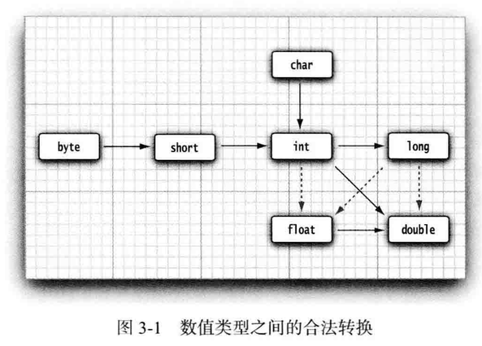

强制类型转换可能会丢失信息。

```java
// 强制类型转换
double x = 9.997;
int nx = (int) x;
// 舍入
Math.round(x);
````

#### 优先级

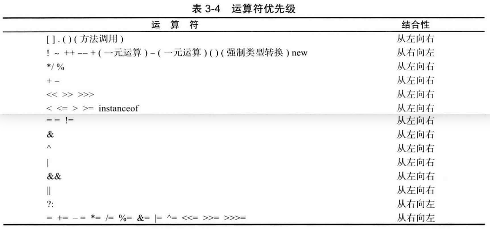

### String

Java 字符串就是 Unicode 字符序列。是不可变类型，即值不会发生改变。

不能修改 Java 字符串中的字符。Java 将字符串存放在公共的存储池中。字符串变量指向存储池中相应的位置。如果复制一个字符串变量，原始字符串与复制的字符串共享相同的字符。

一定不要使用 == 运算符检测两个字符串是否相等！这个运算符只能够确定两个字串是否放置在同一个位置上。实际上，只有字符串常量是共享的，而 + 或 substring 等操作产生的结果并不是共享的。

在调用 x.toString() 的地方可以用 ""+x 替代。打印数组a则调用静态方法 Arrays.toString(a)

空串 "" 是一个 Java 对象，有自己的串长度(0)和内容(空)。String 变量还可以存放一个特殊的值，名为 null，这表示目前没有任何对象与该变量关联

常用API

```java
String s = "Hello";
// 子串
s.substring(0, 3); // Hel
// 拼接
s + " World!"; // Hello World!
s + 13; // Hello13
// 将多个字符串连接起来，用定界符分割
String.join("/", "s", "m"); // s/m
// 比较两个字符串
// boolean equals(Object anObject)
s.equals("string");
"hello".equals("string");
"hello".equalsIgnoreCase("String");// 忽略大小写
"hello".compareTo("string");// 返回 负数 0 正数
//把字符串转换成字符数组: char[]	toCharArray()
char[] chs = s.toCharArray();
// 返回与字符串 str 或代码点 cp 匹配的第一个子串的开始位置。这个位置从索引 0 或 fromlndex 开始计算。如果在原始串中不存在 str 返回 -1。
int indexOf(String str)
int indexOf(String str, int fromlndex)
int indexOf(int cp)
int indexOf(int cp, int fromlndex)
// 返回与字符串 str 或代码点 cp 匹配的最后一个子串的开始位置。这个位置从原始串尾端或 fromlndex 开始计算。
int lastIndexOf(String str)
int lastIndexOf(String str, int fromlndex)
int lastindexOf(int cp)
int lastIndexOf(int cp, int fromlndex)
//在某个索引位置的字符: char charAt(int index)
s.charAt(1)
// 返回一个新字符串。这个字符串用 newString 代替原始字符串中所有的 oldString。
String replace(CharSequence oldString,CharSequence newString)
//去除字符串两端空格: String trim()
s.trim()
//按照指定符号分割字符串: String[] split(String regex)
a = s.split(",");
// 如果字符串以 suffix 开头或结尾，则返回 true。
boolean startsWith(String prefix)
boolean endsWith(String suffix)
```

码点

```java
// length 方法将返回采用 UTF-16 编码表示的给定字符串所需要的代码单元数量。
int n = "Hello".length(); // n = 5
int cpCount = "Hello".codePointCount(0, n); // 码点数量
char first = "Hello".charAt(0); // 返回位置n的代码单元，first = 'H'
// 获得第i个码点
int index = "Hello".offsetByCodePoints(0, i);// 返回从 0 代码点开始，位移 i 后的码点索引。
int cp = "Hello".codePointAt(index);
```

构建字符串

因采用字符串连接的方式达到此目的效率比较低。可以使用 StringBuilder

```java
StringBuilder builder = new StringBuilder();
builder.append(ch); // appends a single character
bui1der.append(str); // appends a string
String completedString = builder.toString();
```

### 输入输出

读取输入

```java
// 从标准输入读取
Scanner in = new Scanner(System.in);
System.out.print("What is your name? ");
String name = in.nextLine();// 读一行
String firstName = in.next();// 读一个单词
int age = in.nextInt();// 读一个整数

// 读密码（输入不可见）。在 Eclipse 或者其他 IDE 的控制台是用不了的。
Console cons = System.console();
String username = cons.readLine("Username: ");// 只能每次读一行
char[] passwd = cons.readPassword("Password:");// 安全原因，将密码放在一维数组中。
// 输出
console.format("have a %s\n", "good day");
console.writer().println("finish");
console.flush();
```

格式化输出

```java
System.out.printf("%8.2f", x);
// 创建一个格式化的字符串，而不打印输出
String message = String.format("Hello, %s. Next year, you'll be %d", name, age);
```

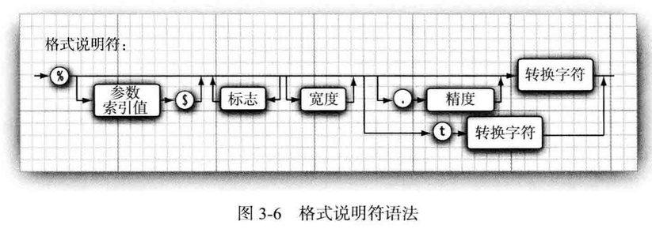

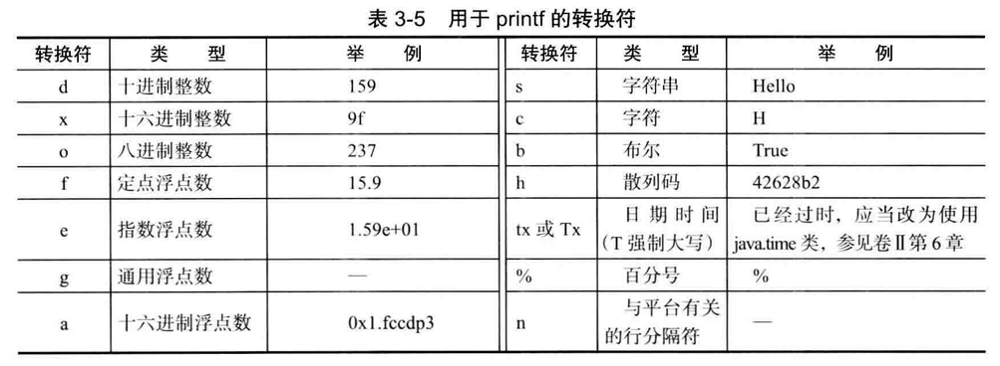

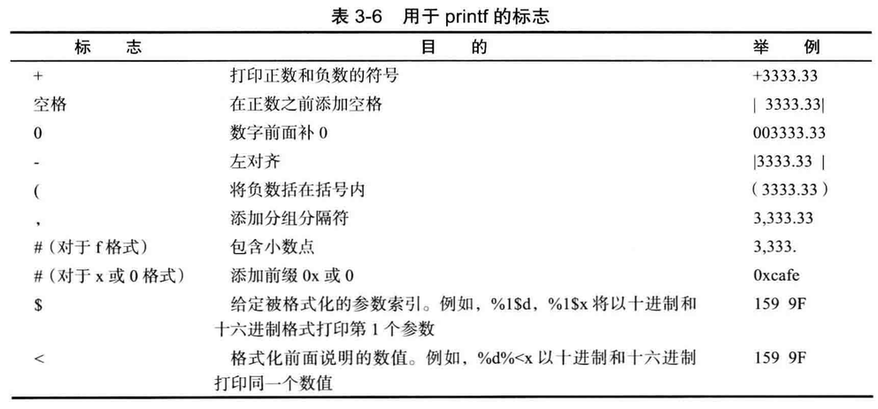

#### 文件输入与输出

```java
// 读取文件
Scanner in = new Scanner(Paths.get("myfile.txt"), "UTF-8");
// 写入文件。文件不存在则创建文件
PrintWriter out = new PrintWriter("myfile.txt", "UTF-8");
```

当指定一个相对文件名(不以"/"或盘符开头)时，文件位于 Java 虚拟机启动路径的相对位置。

1. 命令行方式下启动程序，启动路径就是命令解释器的当前路径。
2. 使用集成开发环境，启动路径由 IDE 控制。使用 `String dir = System.getProperty("user.dir");` 找到路径的位置。

### 控制流程

和c++基本相同。有 if, while, do while, for, foreach, break, continue 等

带标签的 break 跳转到带标签的语句块末尾。

```java
Scanner in = new Scanner(System.in);
int n;
read_data:
while(...){
    for (...){
        System.out.print("Enter a number >= 0: ");
        n = in.nextInt();
        if (n < 0)
            break read_data;
    }
}
// break后，开始执行下面的语句
if(n < 0){
    // 异常跳出
}
else{
    // 正常处理流程
}
```

### 大数值

BigInteger 类实现了任意精度的整数运算。

BigDecimal 实现了任意精度的浮点数(实数)运算。

大数值不能使用算数运算符，而使用 add 和 multiply 等方法

```java
// 普通数值转换成大数值
BigInteger a = BigInteger.valueOf(100);
BigInteger c = a.add(b); // c = a + b
```

### 数组

创建一个数字数组时，所有元素都初始化为0。boolean 数组的元素会初始化为 false。对象数组的元素则初始化为一个特殊值 null，表示这些元素(还)未存放任何对象。

```java
// 声明数组。格式： 元素类型[] 变量名;
int[] a = new int[100];

// 获得数组长度
int len = a.length;
// 打印数组，输出[2,3,7……]格式
System.out.println(Arrays.toString(a));

//初始化数组
int[] smallPrimes = {1, 2, 3};
// 初始化一个匿名数组，可以在不创建新变量的情况下重新初始化一个数组。
new int[] {1, 2, 3}
another = new int[] {1, 2, 3};

// 数组拷贝
// 两个变量将引用同一个数组
int[] luckyNumber = smallPrimes;
luckyNumber[5] = 12;//smallPriemes[5] is also 12 
// 将一个数组的所有值拷贝到一个新的数组中去。可以用这个方法增加数组大小
int[] copiedLuckyNumber = Arrays.copyOf(luckyNumber, luckyNumber.length);

// 排序
Arrays.sort(a);// 使用优化的快速排序算法。

// 声明一个二维数组
double[][] balances = new double[NYEARS][NRATES];
// 初始化
int[][] magicSquare = { {16, 3, 2, 13}, {5, 10, 11, 8}, {9, 6, 7, 12}, {4, 15, 14, 1} };
//快速打印二维数组，输出格式[[1, 2, 3], [4, 5, 6]]
System.out.pintln(Arrays.deepToString(a));
// 不规则数组
int[][] odds = new int[NMAX + 1][];
```

在 Java 应用程序的 main 方法中，程序名并没有存储在 args 数组中，例如 `java Message -h world` ，args[0] 是 "-h"

## 对象与类

由类构造(construct)对象的过程称为创建类的实例(instance)。

对象中的数据称为实例域(instance field)，操纵数据的过程称为方法(method)，实例域值的集合就是这个对象的当前状态(state)。 

在 Java 中，任何对象变量的值都是对存储在另外一个地方的一个对象的引用。new 操作符的返回值也是一个引用。对象变量是对象的引用，而不是对象本身。

结构：

类(class) <--> 实例(instance)(或对象)

- 成员(member)
    - 字段(field) <--> 状态(state)
    - 方法(method)
    - 嵌套类(nested class)和嵌套接口(nested interface)

在类之间，最常见的关系有

- 依赖 (uses-a)
- 聚合 (has-a)
- 继承 (is-a)

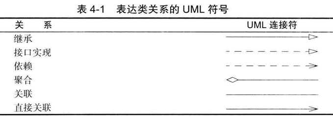

### LocalDate类

Date类：表示时间点

LocalDate类：表示日历

一个对象变量并没有实际包含一个对象，而仅仅引用一个对象。

```java
LocalDate day = LocalDate.now();
LocalDate newYearsEve = LocalDate.of(1999, 12, 31);

int year = newYearsEve.getYear(); // 1999
int month = newYearsEve.getMonthValue(); // 12 
int day = newYearsEve.getDayOfMonth(); // 31

LocalDate aThousandDaysLater = newYearsEve.plusDays(1000);
```

### System 类

System 类常用API（System类不能被实例化）

```java
//拷贝数组
static void arraycopy(Object src, int srcPos, Object dest, int destPos, int length);
//以毫秒的方式输出当前时间
static long currentTimeMillis();
//退出java虚拟机
static void exit(int status);
```

### 自定义类

```java
class ClassName {
    field1
    field2
    ...
    constructor1
    constructor2
    ...
    method1
    method2
    ...
}
```

类修饰符

- public：可公共访问
- abstract：抽象的，不能创建实例
- final：不允许有子类。其中的方法自动地成为 final，不包括成员变量。
- strictfp：类中所有的浮点运算都是精确运算

### 对象构造

#### 构造器

- 构造器与类同名
- 每个类可以有一个以上的构造器（重载）
- 构造器可以有 0 个、1 个或多个参数
- 构造器没有返回值
- 构造器总是伴随着 new 操作一起调用。所有的 Java 对象都是在堆中构造的

构造器总是伴随着 new 操作符的执行被调用，而不能对一个已经存在的对象调用构造器来达到重新设置实例域的目的。

```java
james.Employee("James Bond", 250000, 1950, 1, 1); // ERROR
```

仅当类没有提供任何构造器的时候，系统才会提供一个默认的构造器。

调用另一个构造器

如果构造器的第一个语句形如 this(...)，这个构造器将调用同一个类的另一个构造器。

```java
Body(String bodyName){
    this();//this代表类另一个构造器，调用的是无参构造器。this(argu1, argu2);调用的是另一个有参构造器。
  name = bodyName;
}
```

多构造器参数

1. 参数较少时，可使用重叠构造器模式
2. 参数较多时，可使用无参构造器+setter方法
3. builder方法（Effective java 第2条）

私有构造器

含有私有构造器的类，不能被实例化，如 Math 等一些工具类，实例没有意义，此时可以使用私有构造器以保证不被实例化（该类也不能被子类化）。

#### 初始化

初始化数据域的方法

- 在构造器中设置值
- 在声明中赋值
- 初始化块

如果在构造器中没有显式地给域赋予初值，那么就会被自动地赋为默认值: 数值为 0、布尔值为 false、对象引用为 null。（局部变量则必须被明确的初始化）

在声明中赋值

```java
class Employee{
    private static int nextId;
    private int id = assignId(); // 初始值不一定是常量值
    private static int assignId(){
        int r = nextId;
        nextId++;
        return r;
    }
}
```

初始化块

```
{
    //code
}
```

只要构造类的对象，这些块就会被执行。

位置：在类声明中，位于所有成员、构造器、声明之外。一般在域定义之后，构造方法前。

作用：初始化对象的字段。每次构造对象都会执行，并且在构造函数执行之前执行。有多个块，则按照出现顺序执行。

静态初始块

格式：

```
static{
    //code;
}
```

位置：类内部，域定义之后，构造方法前

作用：对静态域进行初始化。在类第一次加载的时候，将会进行静态域的初始化。

### 方法参数

参数传递方式

1. 按值调用(call by value)，表示方法接收的是调用者提供的值。
2. 按引用调用(call by reference)，表示方法接收的是调用者提供的变量地址。

Java程序设计语言总是采用按值调用。

- 一个方法不能修改一个基本数据类型的参数(即数值型或布尔型)。
- 一个方法可以改变一个对象参数的状态。
- 一个方法不能让对象参数引用一个新的对象。

隐式参数

在每一个方法中，隐式参数是出现在方法名前的类对象，关键字 this 表示隐式参数。

```java
number007.raiseSalary(5);// 隐式参数是 number007
```

### 方法

静态方法

静态方法是一种不能向对象实施操作的方法，没有隐式参数。静态方法只能访问自身类中的静态域。通过 `类名.静态方法名` 调用静态方法。

工厂方法

用静态工厂方法(factory method)来构造对象。不使用构造器的原因是

1. 无法命名构造器
2. 当使用构造器时，无法改变所构造的对象类型。

main方法：当使用命令行 `java Employee` 时，会执行 Employee 类的 main 方法。

方法签名(signature)：方法名 + 参数类型列表

方法头(header)：签名 + 修饰符 + 返回类型 + 可抛出异常列表

方法声明(declaration)：方法头 + 方法体（{}包裹的语句块）

方法修饰符

- abstract：抽象方法的方法体没有在类中定义，其实现由子类负责。
- static：静态方法
- final：final方法不能被子类覆盖
- synchronized：
- native：
- strictfp：要求所有的浮点数运算都要严格进行。

每一个对象都有一个toString()方法，当对象被用于一个使用 + 操作符的字符串表达式时，会调用其 toString 方法获取一个 String。

只访问对象而不修改对象的方法称为访问器方法（getXXX）。反之，为更改器方法（setXXX）。

重载

有不同类型或数量的参数的方法，可以有同样的名字。因为签名不同。

不能有只有返回值类型不同的两个方法。

出于重载的目的，序列参数T...将被当作一个T[]类型的参数。


finalize 方法将在垃圾回收器清除对象之前调用。不能确定具体的调用时机。

本地方法

用 native 修饰，用其他语言来实现。

```java
public native int getCPUID();
```

### 实例域

域未被初始化，会根据自身类型被赋予一个默认的初始值


域声明修饰符

- static
- final
- transient
- volatile

可以将实例域定义为 final，构建对象时必须初始化这样的域。并且在后面的操作中，不能够再对它进行修改。

静态域

将某实例域定义为 static，称为静态域。静态域属于类，该类下的所有对象，都共享一个该静态域。而不是像其他实例域一样，每个对象都有一个自己的拷贝。

静态常量可以通过 `类名.常量名` 访问

```java
public class Math{
    public static final double PI = 3.14;
}
// 访问静态常量
Math.PI;
```

### 包

包(package)将类组织起来。所有标准的 Java 包都处于 java 和 javax 包层次中。

使用包的主要原因是确保类名的唯一性。从编译器的角度来看，嵌套的包之间没有任何关系。

如果没有在类中使用 package 声明指定所在的包，这个类就将成为未命名包(unnamed package)的一部分。

一个类可以使用所属包中的所有类，以及其他包中的公有类(public class)。

不同包下的类的访问

1. 使用全名进行访问（如，java.util.ArrayList）
2. 使用关键字import将类导入。

使用import语句可以导入包中的类。只能使用星号( * )导入一个包。

```java
import java.util.*;
import java.*;// error
import java.*.*;// error
```

导入(import)语句只是直接为编译器提供信息，它们不会使相关文件包含(include)到当前文件中。Java 编译器可以查看其他文件的内部，只要告诉它到哪里去查看就可以了。

静态导入语句用来导入静态方法，必须出现在源文件等起始部分（任何类和接口定义之前）。导入后可以使用类的静态方法而不用添加类名。

```java
import static java.lang.System.out;
import static java.lang.Math.*;

out.println("good"); // 属于System类
sqrt(5); // 属于Math类
```

命令行编译和运行带有包的java程序

```sh
# 进入工程目录
javac com/mypackage/SomeApp.java # 编译文件
javac -d ../classes com/mypackage/SomeApp.java # -d 指定class文件的存储目录
java com.mypackage.SomeApp # (在根目录)运行类
```

### 类路径

1. 类存储在文件系统的子目录中。类的路径必须与包名匹配。
2. 类文件存储在 JAR(Java 归档)文件中

类路径是所有包含类文件的路径的集合。在 UNIX 环境中，类路径中的不同项目之间采用冒号:分隔；Windows环境中，以分号(;)分隔。

```
/home/user/classdir:.:/home/user/archives/archive.jar
```

类路径包括

- 基目录(某个包的根目录)
- 当前目录
- JAR 文件

通过类路径，Java虚拟机可以查找到需要的类文件。

设置类路径

```sh
# 设置MyProg程序的类路径，并运行
java -classpath /home/user/classdir:.:/home/user/archives/archive.jar MyProg
java -cp ...
# CLASSPATH环境变量（bash）
export CLASSPATH=/home/user/classdir:.:/home/user/archives/archive.jar
```

### 文档注释

多行注释：`/*多行注释*/`

单行注释：`//单行注释`

文档注释：`/**文档注释*/`

javadoc 实用程序(utility)可以由源文件生成一个 HTML 文档。它从下面几个特性中抽取信息

- 包
- 公有类与接口
- 公有的和受保护的构造器及方法
- 公有的和受保护的域

例子

```java
/**
 * 概要性的句子，可以使用html修饰符
 * @author runlei
 * {@code ...} 键入代码
 */
```

想产生包注释，需要在每一个包目录中添加一个单独的文件。

1. 提供一个以 package.html 命名的 HTML 文件。在标记 `<body></body>` 之间的所有文本都会被抽取出来。
2. 提供一个以 package-info.java 命名的 Java 文件。 这个文件必须包含一个初始的以 `/** */` 界定的 Javadoc 注释，跟随在一个包语句之后。它不应该包含更多的代码或注释。

还可以为所有的源文件提供一个概述性的注释。这个注释将被放置在一个名为 overview.html 的文件中，这个文件位于包含所有源文件的父目录中。标记 `<body></body>` 间的所有文本将被抽取出来。

注释的抽取

```sh
# 切换到包含想要生成文档的源文件目录
javadoc -d docDirectory nameOfPackage [nameOfPackage ...]
# 默认包
javadoc -d docDirectory *.java
```

## 继承(inheritance)

### 类、超类和子类

关键字 extends 表示继承

```java
// Manager 是 Employee 的子类(派生类、孩子类)
// Employee 是 Manager 的超类(基类、父类)
public class Manager extends Employee {
    // 添加方法和域
}
```

如果子类有和超类同签名的方法，则会覆盖超类的方法。此时，使用如下方式调用超类的方法

```java
public double getSalary(){
    double baseSalary = super.getSalary();// 调用超类的方法
    return baseSalary + bonus;
}
```

子类构造器

由于子类的构造器不能访问父类的私有域，所以必须利用父类的构造器对这部分私有域进行初始化。

如果子类的构造器第一条可执行语句不是调用超类构造器的语句，不是调用子类其他构造器的语句，那么子类的构造器会自动调用超类的无参构造器super()。

```java
public Manager(String name, double salary, int year, int month, int day){
    super(name, salary, year, month, day);// 调用父类的构造器，必须在第一条
    bonus = 0;
}
```

构造过程

1. 调用超类的构造器
2. 执行初始化块，字段的初始化语句
3. 执行构造器

继承层次

- 继承层次(inheritancehierarchy)：由一个公共超类派生出来的所有类的集合
- 继承链(inheritance chain)：在继承层次中，从某个特定的类到其祖先的路径

多态

一个对象变量可以指示多种实际类型的现象被称为多态(polymorphism)。在运行时能够自动地选择调用哪个方法的现象称为动态绑定(dynamic binding)。

程序中出现超类对象的任何地方都可以用子类对象置换。一个 Employee 变量既可以引用一个
Employee 类对象，也可以引用一个 Employee 类的任何一个子类的对象。

虚拟机知道变量实际引用的对象类型，因此能够正确地调用相应的方法。

每次调用方法都要进行搜索，时间开销相当大。因此，虚拟机预先为每个类创建了一个方法表(method table)，其中列出了所有方法的签名和实际调用的方法。虚拟机提取变量的实际类型的方法表，然后搜索符合条件的方法，最后调用方法。

阻止继承

不允许扩展的类被称为 final 类，在定义类时用 final 修饰符修饰。

类中的特定方法也可以被声明为 final ，此时子类就不能覆盖这个方法。 

强制类型转换

只能在继承层次内进行类型转换。

```java
Employee someone;
Manager boss = (Manager) someone; // Error

// 进行类型转换之前，先查看一下是否能够成功地转换
if (someone instanceof Manager){
    boss = (Manager) someone;
}
```

抽象类

当用 abstract 关键字修饰方法时，表明这个方法是抽象的，不需要实现。

包含一个或多个抽象方法的类本身必须被声明为抽象的。抽象类可以包含具体数据和具体方法。

```java
public abstract class Person {
    private String name;
    public Person(String name){
        this.name = name;
    }
    public String getName(){
        return name;
    }
    // 抽象方法
    public abstract String getDescription();
}
```

类即使不含抽象方法，也可以将类声明为抽象类。抽象类不能被实例化。可以定义一个抽象类的对象变量，引用非抽象子类的对象。

访问修饰符

访问控制是在类层次上而非对象层次上实现的。

public：任何类的任何方法都可以访问。

private：只有本类可以访问。

protected：本包的类和所有子类(可能不在本包内)可以访问。

default（未标注）：本包内可以访问。

可以修改子类覆盖方法的修饰符，但是权限只能比超类更多不能更小。

### Object 类

Object 类位于类继承层次的根部，在 Java 中每个类都是由它扩展而来的。如果没有明确地指出超类，Object 就被认为是这个类的超类。

Object 类型的变量可以引用任何对象。在Java中，只有基本类型(primitive types)不是对象。

所有的数组类型，不管是对象数组还是基本类型的数组都扩展了 Object 类。

```java
Employee[] staff = new Employee[10];
obj = staff; // OK
obj = new int[10]; // OK
```

Object类的方法分为2类：

- 通用方法
- 支持线程的方法

#### equals 方法

public boolean equals(Object obj)

Object 类中的 equals 方法用于检测一个对象是否等于另外一个对象。在 Object 类中，默认实现是this == obj的结果。

编写一个完美的 equals 方法的建议

```java
// 当前对象 this 和 otherObject 比较
// 1) 检测 this 与 otherObject 是否引用同一个对象
if (this == otherObject) return true;
// 2) 检测 otherObject 是否为null，如果为null，返回false。
if (otherObject == null) return false;
// 3) 比较 this 与 otherObject 是否属于同一个类。如果 equals 的语义在每个子类中有所改变，就使用 getClass 检测
if (getClass() != otherObject.getCIass()) return false;
// 3) 如果所有的子类都拥有统一的语义，就使用 instanceof 检测
if (!(otherObject instanceof ClassName)) return false;
// 4) 将 otherObject 转换为相应的类类型变量
ClassName other = (ClassName) otherObject;
// 5) 对所有需要比较的域进行比较。使用 == 比较基本类型域，使用 equals 比较对象域。如果所有的域都匹配，就返回true，否则返回false。
return field1 == other.field1 && Objects.equals(field2, other.field2) && ...;
```

对于数组类型的域，可以使用静态的 Arrays.equals 方法检测相应的数组元素是否相等。

#### hashCode 方法

public int hashCode()

散列码(hashcode)是由对象导出的一个整型值。每个对象都有一个默认的散列码，其值为对象的存储地址。

字符串的散列码是由内容导出的。

如果重新定义 equals 方法，就必须重新定义 hashCode 方法，以便用户可以将对象插入到散列表中。Equals 与 hashCode 的定义必须一致：如果 x.equals(y) 返回 true，那么 x.hashCode() 就必须与 y.hashCode() 具有相同的值。

```java
public int hashCode(){
    return Objects.hash(field1, field2, ...);
}
// 数组的hashCode
Arrays.hashCode();
```

#### toString 方法

public String toString()

只要对象与一个字符串通过操作符"+"连接起来，Java 编译就会自动地调用 toString 方法，以便获得这个对象的字符串描述。

Object 类的 toString 方法，会输出 `类名@散列码`。

#### clone()

protected object clone() throws CloneNotSupportedException

返回当前对象的克隆体，克隆体是一个新对象。

编写clone方法要考虑到3个重要因素：

1. 空的 Cloneable 接口
2. Object 类实现的 clone 方法
3. CloneNotSupportedException 异常

```java
public class MyClass extends HerClass implements Cloneable{
    public MyClass clone() throws CloneNotSupportedException{
        return (MyClass) super.clone();
    }
}
```

#### getClass()

`public final Class<?> getClass()`

返回该对象所属类的类型标记。

#### finalize()

protected void finalize() throws Throwable

在垃圾回收时终结对象。

### ArrayList

在添加或删除元素时，具有自动调节数组容量的功能。如果调用 add 且内部数组已经满了，ArrayList 就将自动地创建一个更大的数组，并将所有的对象从较小的数组中拷贝到较大的数组中。

```java
ArrayList<Employee> staff = new ArrayList<Employee>();
staff.add(new Employee("Tony Tester", ...)); // 添加
staff.set(i, harry); // 更新
Employee e = staff.get(i); // 获取
staff.add(n, e); // 在n位置插入e
Employee e = staff.remove(n); // 删除
// 转成数组
Employee[] a = new Employee[staff.size()];
staff.toArray(a);


// 如果可以确定数组容量
staff.ensureCapacity(100);
ArrayList<Employee> staff = new ArrayList(100);

// 实际元素个数。将小于或等于数组列表的容量
staff.size();
// 将存储区域的大小调整为当前元素数量所需要的存储空间数目。如果再添加元素，则会调整存储空间。
staff.trimToSize();
```

### 对象包装器与自动装箱

所有的基本类型都有一个与之对应的类。这些类称为包装器(wrapper)，是不可变的，final 的。

```java
ArrayList<Integer> list = new ArrayList<Integer>();
// 自动装箱
list.add(3); // 将自动地变换成
list.add(Integer.valueOf(3));
// 自动拆箱
int n = list.get(i); // 将自动地变换成
int n = list.get(i).intValue();

// 如果在一个条件表达式中混合使用Integer和Double类型，Integer 值就会拆箱，提升为 double，再装箱为 Double
Integer n = 1;
Double x = 2.0;
System.out.println(true ? n : x); // Prints 1.0
```

### 参数数量可变的方法

方法参数列表中的最后一个参数，可以被声明为给定类型的序列。在参数类型之后加上...表示。

```java
//String...参数类型 等价于 String[]
public static void print(String... messages){
  //code
}
```

### 枚举类

所有的枚举类型都是 Enum 类的子类。

在比较两个枚举类型的值时，使用"=="即可，不要用equals方法。

```java
//枚举类。这个声明定义的类型是一个类，它刚好有 4 个实例。
public enum Size {SMALL, MEDIUM, LARGE, EXTRA_LARGE};
public enum Size {//带构造器、方法的枚举类
    SMALL("S"), MEDIUM("M"), LARGE("L"), EXTRA_LARGE("XL");

    private String abbreviation;
    // 构造器
    private Size(String abbreviation){
        this.abbreviation = abbreviation;
    }

    public String getAbbrevition(){
        return abbreviation;
    }
}
// 获取枚举类对象
Size s = Enum.valueOf(Size.class, "SMALL"); // s = Size.SMALL
Size.SMALL.toString();//返回字符串
Size[] values = Size.values();//返回包含全部枚举值的数组
Size.MEDIUM.ordinal();//返回枚举常量的位置，从0开始计数。这个表达式返回1
```

### 反射

有分析类能力的程序称为反射(reflective)。

虚拟机为每个类型管理一个 Class 对象，表示一个特定类的属性。如，Object类中的getClass()方法返回一个Class类型的实例。

```java
// 获取Class对象的名字
Random generator = new Random();
Class cl = generator.getClass();
String name = cl.getName();//name = java.util.Random

// 获得类名对应的Class对象
Class cl = Class.forName("java.util.Random");

// 获得Class对象
Class cl1 = Random.class; // if you import java.util.*
Class cl2 = int.class;
Class cl3 = Double[].class;

// 比较操作（每个类型只有一个Class对象）
e.getClass() == Employee.class

// 动态创建一个类的实例
// 创建默认构造的对象
String str = String.class.newInstance()
e.getClass().newInstance();
// 创造带参构造
String str = String.class.getConstructor(String.class).newInstance("Hello"); 
```

newlnstance方法调用默认的构造器(没有参数的构造器)初始化新创建的对象。如果这个类没有默认的构造器，就会抛出一个异常。如果需要传递参数给构造器，就需要调用 Constructor 类的 newInstance 方法。

java.lang.reflect 包

- Class 描述类型
    - getFields 返回类的公有(public)字段数组，包括超类的公有成员
    - getMethods 返回类的所有方法，包括超类的公有方法
    - getConstructors 返回类的所有公有构造器
    - getDeclareFields 返回类中声明的全部字段，包括私有和保护成员，不包括超类的成员
    - getDeclareMethods 返回类中声明的全部方法，包括私有和保护方法，不包括超类的方法
    - getDeclaredConstructors 返回类中声明的全部构造器
    - getModifiers 返回一个整数值，使用位开关描述修饰符的使用情况
- Filed 描述域
- Method 描述方法
- Constructor 描述构造器
    - getDeclaringClass 返回描述域(方法、构造器)的Class对象
    - getExceptionTypes 返回描述方法(构造器)抛出异常类型的Class对象数组
    - getModifiers 返回一个整数值，使用位开关描述域(方法、构造器)修饰符的使用情况
    - getName 返回描述域(方法、构造器)名字的字符串
    - getParameterTypes 返回描述方法(构造器)参数类型的Class对象数组
    - getType 返回域所属类型的Class对象
    - getReturnType 返回描述方法返回类型的Class对象
- Modifier 分析修饰符的使用情况
    - getModifiers
    - isPublic
    - isPrivate
    - isFinal
    - toString 打印修饰符

在运行时使用反射分析对象，需要设置访问控制

```java
//反射
Employee harry = new Employee("Harry Hacker", 35000, 10, 1, 1989);
Class cl = harry.getClass();
Field f = cl.getDeclaredField("name"); // 代表Employee对象的name域
f.setAccessible(true); // 设置name域的可访问权限。true 表明屏蔽 Java 语言的访问检查，使得对象的私有属性也可以被査询和设置。
Object v = f.get(harry); // harry对象的name域的值
f.set(obj, value);// 将obj对象的f域设置成value
```

创建泛型数组

```java
//componentType是数组类型，length是数组长度
Object newArray = Array.newInstance(componentType, length);

public static Object goodCopyOf(Object a, int newLength){
    Class cl = a.getClass();
    if (!cl.isArray()) return null;
    Class componentType = cl.getComponentType();
    int length = Array.getLength(a);
    Object newArray = Array.newlnstance(componentType, newLength);
    System.arraycopy(a, 0, newArray, 0, Math.min(length, newLength));
    return newArray;
}
```

调用任意方法

Method 类中有一个 invoke 方法，它允许调用包装在当前 Method 对象中的方法。

```java
// invoke 方法
Object invoke(Object obj, Object... args)

// m1是Method类型，代表了Employee的getName方法，harry是Employee对象
String n = (String) m1.invoke(harry);
// 使用Class类中的getMethod获取Method对象，parameterTypes是参数类型
Method getMethod(String name, Class... parameterTypes)
```

## 接口

是对类的一组需求描述，主要用来描述类具有什么功能，而并不给出每个功能的具体实现。

接口中的方法自动地被设置为 public，接口中的变量被自动设为 public static final。接口不能被实例化

```java
// 接口
public interface Comparable{}
// 要将类声明为实现Comparable接口，需要使用关键字 implements
class Employee implements Comparable, Cloneable(){}
// 声明接口的变量，必须引用实现了接口的类对象。x是实现了Comparable接口的类的对象。
Comparable x = new Employee(...);
// 检查一个对象是否实现了某个特定的接口
if(anObject instanceof Comparable){}
//为接口提供默认方法。用 default 修饰符标记
public interface Comparable<T>{
	default int compareTo(T other){
        return 0;
    }
}
```

解决默认方法冲突

假设某个类继承了2个接口，一个超类，它们都有同一个签名的方法。则

1. 超类优先。如果超类提供了一个具体方法，接口中同签名的默认方法会被忽略。
2. 接口冲突。如果一个超接口提供了一个默认方法，另一个接口提供了一个同签名(不论是否是默认参数)相同的方法，必须在本类中覆盖这个方法来解决冲突。

## lambda

lambda 表达式是一个可传递的代码块，这个代码块会在将来某个时间调用。

### 语法

语法形式为 () -> {}，其中 () 用来描述参数列表，{} 用来描述方法体，-> 为 lambda运算符 ，读作(goes to)。

```java
// lambda表达式
(String first, String second) -> {
	first.length() - second.length();
}
// 无参的lambda表达式
() -> {
    // code
}
// 只有一个参数且类型可以推断出，则可以省略小括号
ActionListener listener = event ->
    System.out.println("The time is " + new Date());
```

lambda表达式的返回类型总是会由上下文推导得出。

### 函数式接口

对于只有一个抽象方法的接口，这种接口称为函数式接口(functional interface)。

需要这种接口的对象时，就可以提供一个 lambda 表达式，即，lambda 表达式可以传递到函数式接口。

- 方法引用

不需要自己重写某个匿名内部类的方法，可以利用 lambda 表达式的接口快速指向一个已经被实现的方法。

object::instanceMethod 如，System.out::println 等价于 x -> System.out.println(x)

Class::staticMethod 如，Math::pow 等价于 (x, y) -> Math.pow(x, y)

Class::instanceMethod 如，String::compareToIgnoreCase 等同于 (x, y) -> x.compareToIgnoreCase(y)

```java
public class Test {
    public static void main(String[] args) {
        Mytest a = System.out::print;
        a.printSome("hhh");
    }
}

interface Mytest {
    void printSome(String s);
}

public class Exe1 {
    public static void main(String[] args) {
        ReturnOneParam lambda1 = a -> doubleNum(a);
        System.out.println(lambda1.method(3));

        //lambda2 引用了已经实现的 doubleNum 方法
        ReturnOneParam lambda2 = Exe1::doubleNum;
        System.out.println(lambda2.method(3));

        Exe1 exe = new Exe1();
        //lambda4 引用了已经实现的 addTwo 方法
        ReturnOneParam lambda4 = exe::addTwo;
        System.out.println(lambda4.method(2));
    }

    /**
     * 要求
     * 1.参数数量和类型要与接口中定义的一致
     * 2.返回值类型要与接口中定义的一致
     */
    public static int doubleNum(int a) {
        return a * 2;
    }

    public int addTwo(int a) {
        return a + 2;
    }
}
```

方法引用不能独立存在，总是会转换为函数式接口的实例。

构造器引用

类似于方法引用，方法名为new

```java
// Person 构造器的一个引用，相当于 new Person()。调用哪个根据上下文确定
Person::new

interface ItemCreatorBlankConstruct {
    Item getItem();
}
interface ItemCreatorParamContruct {
    Item getItem(int id, String name, double price);
}

public class Exe2 {
    public static void main(String[] args) {
        ItemCreatorBlankConstruct creator = () -> new Item();
        Item item = creator.getItem();

        ItemCreatorBlankConstruct creator2 = Item::new;
        Item item2 = creator2.getItem();

        ItemCreatorParamContruct creator3 = Item::new;
        Item item3 = creator3.getItem(112, "鼠标", 135.99);
    }
}
```

变量作用域

lambda表达式可以捕获外围作用域中变量的值，只能引用值不会改变的变量。

lambda 表达式的体与嵌套块有相同的作用域。

在 lambda 表达式中声明与一个局部变量同名的参数或局部变量是不合法的。

在一个 lambda 表达式中使用 this 关键字时，是指创建这个 lambda 表达式的方法的 this 参数。 

```java
// 捕获外围作用域的值
public static void repeat(String text, int count) {
    for (int i =1; i <= count; i++) {
        ActionListener listener = event -> {
            System.out.println("this is : " + text); // i + " : " + text 则出错
        };
        new Timer(1000, listener).start();
    }
}
// 不能使用局部变量的名字作为参数
Path first = Paths.get("usr/bin");
Couparator<String> comp =
    (first, second) -> first.length() - second.length(); // Error: Variable first already defined
// this 参数
public class Application {
    public void init() {
        ActionListener listener = event -> {
            System.out.println(this.toString()); // 会调用 Application对象的 toString 方法
        };
    }
}
```

完整应用

```java
// 声明一个函数式接口
public interface IntConsumer{
    void accept(int value);
}

// 在方法中使用这个接口
public static void repeat(int n, IntConsumer action){
    for (int i = 0; i < n; i++)
        action.accept(i);
}

// 使用时，传递lambda表达式
repeat(10, i -> System.out.println("Countdown: " + (9 - i)));
```

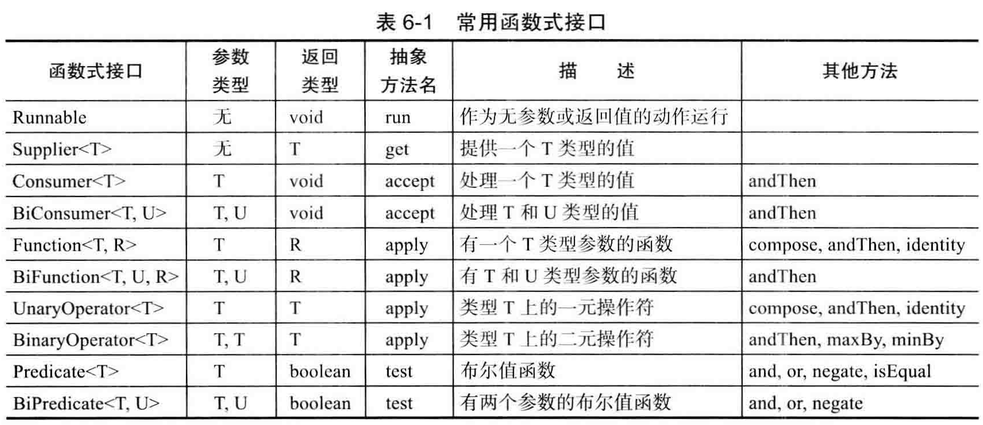

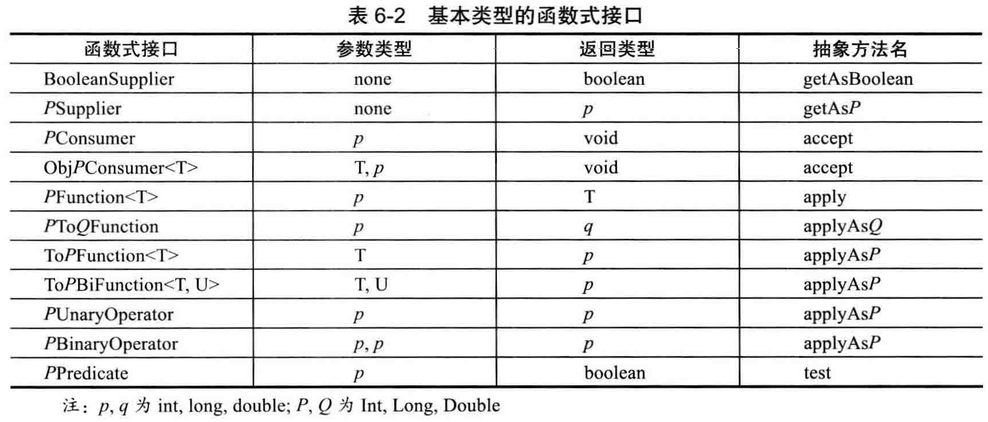

Comparator

```java
// 对people数组根据name进行排序
Arrays.sort(people, Comparator.comparing(Person::getName));
// 对people数组，先根据lastName排序，再根据firstName排序
Arrays.sort(people, Comparator.comparing(Person::getLastName).thenConiparing(Person::getFirstName));
// 根据人名长度排序
Arrays.sort(people, Comparator.comparing(Person::getName, (s, t) -> Integer.compare(s.length(), t.length())));
// 同上
Arrays.sort(people, Comparator.comparingInt(p -> p.getName().length()));
```

## 内部类

是定义在另一个类中的类。

内部类既可以访问自身的数据域，也可以访问创建它的外围类对象的数据域。内部类的对象总有一个隐式引用，它指向了创建它的外部类对象。编译器修改了所有的内部类的构造器，添加一个外围类引用的参数。

只有内部类可以是私有的，且私有内部类的对象只能由外部类的方法构造。

内部类中声明的所有静态域都必须是final。对于每个外部对象，会分别有一个单独的内部类实例。如果这个域不是 final，它可能就不是唯一的。

```java
// 内部类使用外围类的域
OuterClassName.this.域名; // 等价于 域名
// 创建公有内部类的对象
outerObject.new InnerClass(construction parameters)
// 引用内部类
OuterClassName.InnerClassName
```

内部类的分类

1. 成员内部类

位置：在类的成员位置，和成员变量和成员方法的位置是一样的。

权限：在内部类中，可以直接访问外部类的成员，包括私有成员。

创建内部类对象的方法：`Outer.Inner i = new Outer().new Inner();`

内部类方法引用外围类域： `OuterClass.this.elementName` 或者直接 `elementName`

2. 局部内部类：位置在方法内，出了方法无法使用，所以不能使用public或private修饰符。

3. 匿名内部类：可以把它看成是没有名字的局部内部类。匿名内部类extends了某个类或implements了某个接口。必须在定义匿名内部类的时候创建他的对象。匿名类没有类名，所以没有构造方法。而是将构造器参数传递给超类(superclass)构造器。当内部类实现接口的时候，不能有任何构造参数。

格式：`new 超类(construction parameters){ innner class methods and data }` 或 `new 接口(){ innner class methods and data }`

使用场景：作为参数传递。当想定义一个回调函数且不想编写大量代码时。

4. 静态内部类：用static修饰，没有外围类对象的引用。当内部类不需要访问外围对象的时候使用。

匿名数组列表

```java
// 注意这里的双括号。外层括号建立了 ArrayList 的一个匿名子类。内层括号则是一个对象构造块 
invite(new ArrayList<String>() {{ add("Harry"); add("Tony"); }});
```

获得静态方法的类名

```java
// newObject(){} 会建立Object的一个匿名子类的一个匿名对象，getEnclosingClass 则得到其外围类，也就是包含这个静态方法的类。
new Object(){}.getClass().getEndosingClass() // gets class of static method
```

## 代理

作用：可以在运行时，创建一个实现了一组给定接口的新类。

rainy声明：以下代理相关的内容为个人理解，可能存在偏差

1. 代理的作用
    1. 为一个目标对象的方法，增加统一的新的内容。如Spring的AOP，就是使用的动态代理。
    2. 权限控制
2. 目标对象的要求：目标对象被增强的方法，需要来自某接口，或者是Object类的方法

生成一个代理类对象的步骤

1. 生成代理类对象，需要使用 `Proxy.newProxylnstance(ClassLoader , Class[], InvokeHandler);` 方法，参数依次是：加载接口需要的ClassLoader、代理类需要实现的接口数组（即目标对象的类实现的接口）、方法增强的内容的实现，即调用处理器。
2. 如果是自定义的接口，ClassLoader推荐使用 `Thread.currentThread().getContextClassLoader()`
3. InvokeHandler是一个接口，只有一个方法 `Object invoke(Object proxy, Method method, Object[] args)` 需要定义一个类实现它。无论何时调用目标对象的方法，调用处理器的invoke方法都会被调用。method代表正在执行的方法，args是方法等参数。
4. 使用代理类对象，调用目标对象对应的方法，路径是：`代理类对象的方法-->InvokeHandler的invoke方法-->目标对象的方法` 

使用方式如下

```java
public class MyProxyTest {
    public static void main(String[] args) {
        // 创建Handler
        MyHandler handler = new MyHandler(new MyClass());
        // 需要实现的接口
        Class[] interfaces = new Class[] {Rainy.class};
        // 创建代理类，代理类实现了接口中的方法，这些方法调用InvokeHandler里的invoke方法
        Object proxy = Proxy.newProxyInstance(Thread.currentThread().getContextClassLoader(), interfaces, handler);
        // 调用方法
        ((Rainy)proxy).printRainy();
    }
}

interface Rainy {
    void printRainy();
}

class MyHandler implements InvocationHandler {
    private Object target; // 被包装的对象

    public MyHandler(Object target) {
        super();
        this.target = target;
    }

    // 之后target的所有方法，都通过调用处理器的invoke方法被调用。
    @Override
    public Object invoke(Object proxy, Method method, Object[] args) throws Throwable {
        System.out.println("invoke: " + method.getName());
        return method.invoke(target, args);
    }
}

class MyClass implements Rainy{
    @Override
    public void printRainy() {
        System.out.println("Rainy");
    }
}
```

代理类在运行时被创建，一旦被创建，就变成了常规类。所有的代理类都扩展自Proxy类。一个代理类只有一个实例域：调用处理器。所有的代理类都覆盖了 Object 类中的方法 toString、equals 和 hashCode。

## 异常

异常处理的任务就是将控制权从错误产生的地方转移给能够处理这种情况的错误处理器。

当方法发生错误时，抛出(throw)一个封装了错误信息的对象，此时方法会立即退出且不返回任何值。

异常对象都是派生于 Throwable 类的一个实例。

Throwable的常用方法

```java
String getMessage();//返回详细信息
String toString();//返回短描述
void printStackTrace();
```

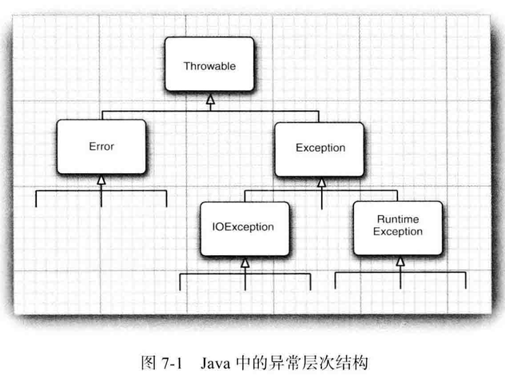

Error 类层次结构描述了 Java 运行时系统的内部错误和资源耗尽错误。

由程序错误导致的异常属于RuntimeException；而程序本身没有问题，但由于像I/O错误这类问题导致的异常属于其他异常。

Java语言规范将派生于 Error类 或 RuntimeException 类的所有异常称为非受查(unchecked)异常，所有其他的异常称为受查(checked)异常。受查异常有异常处理器。


1. 受检查的异常：这种在编译时被强制检查的异常称为"受检查的异常"。即在方法的声明中声明的异常。
2. 不受检查的异常：在方法的声明中没有声明，但在方法的运行过程中发生的各种异常被称为"不被检查的异常"。这种异常是错误，会被自动捕获。

Exception是所有被检查异常的基类，然而，RuntimeException是所有不受检查异常的基类。

Java中所有异常或者错误都继承Throwable，我们把它分为三类：

- Error: 所有都继承自Error，表示致命的错误，比如内存不够，字节码不合法等。
- Exception: 这个属于应用程序级别的异常，这类异常必须捕捉。
- RuntimeException: RuntimeException继承了Exception，而不是直接继Error,这个表示系统异常，比较严重。

```java
Class MyAnimation{
    // 声明异常
    public Image loadlmage(String s) throws IOException, EOFException{
        // 抛出异常
        throw new IOException();
        // 抛出异常
        Exception e = new EOFException();
        throw e;
    }
}

//创建自己的异常
public class MyException extends RuntimeException{
	//运行时异常
}
public class MyException extends Exception{
	//编译时异常
    // 一般有2个构造器，一个是默认构造器，一个是有详细描述信息的构造器
    public MyException(){}
    public MyException(String gripe){
        super(gripe);
    }
}
```

不允许在子类的 throws 说明符中出现超过超类方法所列出的异常类范围。

### 捕获异常

如果某个异常发生的时候没有在任何地方进行捕获，那程序就会终止执行，并在控制台上打印出异常信息。

```java
// 捕获异常。异常可以有多个，也可以合并，异常内还可以抛出异常（用来改变异常类型）
try{ // 该try/catch块用来捕获异常，包括finally中的异常
    // code
    try{ // 该try/catch块的作用只有一个：关闭输入流
        // code
    }
    finally{ // 无论有无异常，都会执行的代码
        in.close();
    }
} catch(ExceptionType | UnknownHostException e){ // 异常可以合并
    // handler for this type
} catch(SQLException e){ // 捕获多个异常
    Throwable se = new ServletException("database error: " + e.getMessage());
    se.initCause(e); // 原异常是新异常的“原因”
    throw se; // 改变抛出的异常类型
}
Throwable e = se.getCause(); //获得原异常
```

处理异常的2个方法：

1. 在方法上抛出
2. 捕获（try/catch）

捕获那些知道如何处理的异常，而将那些不知道怎样处理的异常继续进行传递(抛出)。

带资源的try语句

```java
// 资源属于一个实现了 AutoCloseable 接口的类
try (Resource res = ...; Resource res2 = ...) {
    // work with res
}
```

AutoCloseable接口有一个方法：`void close() throws Exception`

try 块退出时，会自动调用 `res.close()`。

调用 getSuppressed 方法，它会得到从 close 方法抛出并被抑制的异常列表。

分析堆栈轨迹元素

```java
// 打印异常t的堆栈轨迹
Throwable t = new Throwable();
StringWriter out = new StringWriter();
t.printStackTrace(new PrintWriter(out));
String description = out.toString();

// 获得堆栈元素
Throwable t = new Throwable();
StackTraceElement[] frames = t.getStackTrace();
for (StackTraceElement frame : frames){
    // analyze frame
}

// 所有线程的堆栈轨迹
Map<Thread, StackTraceElement[]> map = Thread.getAllStackTraces();
for (Thread t : map.keySet()){
    StackTraceElement[] frames = map.get(t);
    // analyze frames
}
```

## 断言

断言机制允许在测试期间向代码中插入一些检査语句。当代码发布时，这些插入的检测语句将会被自动地移走。

语法

```java
assert 条件;
assert 条件 : 表达式; // 表达式将被转换成一个消息字符串

// 断言
assert x > 0;
assert x > 0 : "x > 0";// "x > 0"作为字符串传递给AssertionError对象，是对断言的简单说明
```

对条件进行检测，如果结果为 false，抛出 AssertonError 异常。

启用和禁用断言

```sh
# 运行时，断言默认被禁用，启用断言的方法如下：
java -enableassertions MyApp
java -ea MyApp # 同上
# 在某个类或整个包中使用断言
java -ea:MyClass -ea:com.mycompany.mylib... MyApp

# 禁用某个特定类（MyClass MyApp）的断言 -da/-disableassertions
java -ea:... -da:MyClass MyApp

# 系统类使用 -enablesystemassertions/-esa 启用断言
```

在启用或禁用断言时不必重新编译程序。启用或禁用断言是类加载器(class loader)的功能。

什么时候使用断言？

- 断言失败是致命的、 不可恢复的错误。
- 断言检查只用于开发和测试阶段

## 日志

入门

使用全局日志记录器(global logger)并调用其info方法

```java
// 生成日志
Logger.getGlobal().info("File->Open menu item selected");
// 取消日志
Logger.getGlobal().setLevel(Level.OFF);
````

自定义日志记录器

```java
//创建记录器
private static final Logger myLogger = Logger.getLogger("com.mycompany.myapp");
```

与包名类似，日志记录器名也具有层次结构。

有以下7个日志记录器级别：

- SEVERE
- WARNING
- INFO
- CONFIG
- FINE
- FINER
- FINEST

在默认情况下，只记录前3个级别。

```java
// 设置日志记录器级别
logger.setLevel(Level.FINE);
// 开启所有级别的记录
logger.setLevel(Level.ALL);
// 关闭所有级别的记录
logger.setLevel(Level.OFF);

// 记录日志
logger.warning(message);
logger.fine(message);
logger.log(Level.FINE, message);

// 获取调用类和方法的确切位置
void logp(Level l, String className, String methodName, String message);

// 跟踪执行流的方法
int read(String file, String pattern) {
    // 进入程序
    logger.entering("com.mycompany.mylib.Reader", "read", new Object[] {file, pattern});
    // ...
    // 离开程序
    logger.exiting("com.mycompany.mylib.Reader", "read", count);
    return count;
}

// 获得异常描述信息
if (...) {
    IOException exception = new IOException(". . .");
    logger.throwing("com.mycompany.mylib.Reader", "read", exception);
    throw exception;
}

try {
    ...
} catch (IOException e) {
    Logger.getLogger("com.mycompany.myapp").log(Level.WARNING, "Reading image", e);
}
```

修改日志管理器配置

可以通过编辑配置文件来修改日志系统的各种属性。在默认情况下，配置文件存在于 `jre/lib/logging.properties`

```sh
# 使用 configFile 日志配置文件启动 MainClass
java -Djava.util.logging.config.file=configFile MainClass
```

配置文件内容

```sh
# 修改默认的日志记录级别
.level=INFO
# 指定日志记录器的级别
com.mycompany.myapp.level=FINE
# 在控制台上看到FINE级别的消息
java.util.logging.ConsoleHandler.level=FINE 
```

安装自己的处理器

```java
Logger logger = Logger.getLogger("com.mycompany.myapp");
logger.setLevel(Level.FINE);
logger.setUseParentHandlers(false);
Handler handler = new ConsoleHandler();
handler.setLevel(Level.FINE);
logger.addHandler(handler);
```

在默认情况下，日志记录器将记录发送到自己的处理器和父处理器。

SocketHandler 将记录发送到特定的主机和端口

FileHandler 将记录写在主目录的javan.log文件(n是文件名的唯一编号)内，以xml的格式记录。

```java
// 设置日志的配置
if (System.getProperty("java,util.logging.config.class") == null
        && System.getProperty("java.util.logging.config.file") == null) {
    try {
        Logger.getLogger("").setLevel(Level.ALL);
        final int LOG_ROTATION_COUNT = 10;
        Handler handler = new FileHandler("%h/myapp.log", 0, LOG_ROTATION_COUNT);
        Logger.getLogger("").addHandler(handler);
    } catch (IOException e) {
        logger.log(Level.SEVERE, "Can't create log file handler", e);
    }
}
```

### 调试技巧

1. 打印日志

```java
System.out.println("x=" + x);
Logger.getClobal0-info("x=" + x);
```

2. 在 main 方法里进行测试
3. JUnit 单元测试
4. 日志代理

```java
Random generator = new Random() {
    public double nextDouble() {
        double result = super.nextDouble();
        // 还可以做其他操作，比如打印堆栈
        Logger.getGlobal().info("nextDouble: " + result);
        return result;
    }
};
```

5. 打印堆栈

```java
// 1
t.printStackTrace(); // t是某个异常
// 2
Thread.dumpStack();
// 3
StringWriter out = new StringWriter();
new Throwable().printStackTrace(new PrintWriter(out));
String description = out.toString(); // 将堆栈轨迹发送到字符串内

// 改变非捕获异常的处理器
Thread.setDefaultUncaughtExceptionHandler(new Thread.UncaughtExceptionHandler() {
    public void uncaughtException(Thread t, Throwable e){
        // 将信息保存在日志文件中
    }
});
```

6. 将错误信息发送到文件内

```sh
java MyProgram 2> errors.txt
# 将System.err和System.out都放在文件内
java MyProgram 1> errors.txt 2>&1
```

7. 观察类的加载过程，用 -verbose 标志启动虚拟机。
8. jconsole processID 显示虚拟机性能的统计结果
9. 获得转储的堆

```sh
jmap -dump:format=b,file=dumpFileName processID
jhat dumpFileName
```

通过浏览器进入localHost:7000

10. 如果使用 -Xprof 标志运行 Java 虚拟机，就会运行一个基本的剖析器来跟踪那些代码中经常被调用的方法剖析信息将发送给 System.out

## 泛型程序设计（重看）

泛型程序设计(Generic programming)意味着编写的代码可以被很多不同类型的对象所重用。

简单泛型类

一个泛型类就是具有一个或多个类型变量的类。泛型类可看作普通类的工厂。

```java
public class Pair<T>{
    private T first;
    private T second;
    public Pair() { first = null ; second = null ; }
    public Pair(T first, T second) { this,first = first; this.second = second; }
    public T getFirst() { return first; }
    public T getSecond() { return second; }
    public void setFirst(T newValue) { first = newValue; }
    public void setSecond(T newValue) { second = newValue; }
}

//有多个类型变量
public class Pair<T, U> {}

// 实例化泛型类型（不能用基本类型实例化类型参数）
Pair<String>
```

泛型方法

```java
class ArrayAlg{
    //泛型方法（定义在普通类中）
    public static <T> T getMiddle(T... a){
        return a[a.length / 2];
    }
}

//调用泛型方法
String middle = ArrayAlg.<String>getMiddle("]ohn", "Q.", "Public");
//通过推断，可以省略<String>
String middle = ArrayAlg.getMiddle("]ohn", "Q.", "Public");
```

类型变量的限定

```java
// T 只能为实现了 Comparable 的类型
public static <T extends Comparable> T min(T[] a){}
// 可以限定多个接口，只能限定一个类（位置在第一个）
T extends Comparable & Serializable
```

类型擦除

虚拟机没有泛型类对象，所有对象都属于普通类。无论何时定义一个泛型类型，都自动提供了一个相应的原始类型(raw type)。

原始类型的生成规则

1. 去掉类名后的 `<T extends A & B>`
2. 将类中的所有T替换成A，将类的定义变为 `类名 implements B`。T没有限定的话，将所有的T替换成Object

虚拟机中的对象总有一个特定的非泛型类型。因此，所有的类型查询只产生原始类型。

```java
if (a instanceof Pair<T>) // Error
Pair<String> p = (Pair<String>) a; // 警告，只能测试a是否是Pair
Pair<String> stringPair = ...;
Pair<Employee> employeePair = ...;
if (stringPair.getClass() == employeePair.getClass()) // 相等，getClass()返回原始类型Pair

// 不能这样使用类型变量：new T(...)、new T[...] 或 T.class
Pair<String>[] table; // ok，可以声明数组
table = new Pair<String>[10] ; // Error，不能创建数组（类型擦除会使得一个数组里存放不同类型的数据）
Pair<String>[] table = (Pair<String>[]) new Pair<?>[10]; // ok，但不安全
    Object[] objarray = table;
    objarray[0] = new Pair<Double>(); // ！table里存在了Pair<Double>类型的对象
ArrayList<Pair<String>>; // ok

// 抑制警告
@SuppressWamings("unchecked") // 使用注解抑制警告
// 消除创建泛型数组的有关限制
@SafeVarargs
public static <T> void addAll(Collection<T> coll, T... ts)
```

在泛型类中构造泛型变量

```java
public Pair() { first = new T(); second = new T(); } // Error

// 构造器表达式
Pair<String> p = Pair.makePair(String::new);
public static <T> Pair<T> makePair(Supplier<T> constr) {
    return new Pair<>(constr.get(), constr.get());
}

// 获得Class
public static <T> Pair<T> makePair(Class<T> cl){
    try {
        return new Pair<>(cl.newInstance(), cl.newInstance());
    } catch (Exception ex) { return null; }
}

Pair<String> p = Pair.makePair(String.class);
```

`Pair<S>` 与 `Pair<T>` 是两个不同的类，它们没有关系。

通配符

`?` 本身是不受限通配符，它可以代表任何类型，而 `? extends X` 是受限通配符，它只能表示类型X以及任何extends（X是类）或impliments（X是接口）X的类型。

```java
// 泛型，在返回类型前
public <T extends Animal> void takeThing(ArrayList<T> list)
// 万用字符。在方法参数中使用万用字符时，可以操作集合元素，但不能新增集合元素。
public void takeAnimals(ArrayList<? extends Animal> animals){}
public <T extends Animal> void takeThing(ArrayList<T> list)//另一种表示方法
//指定编译过的程序摆放在哪个目录下，从classes目录来运行
javac -d ../classes MyApp.java
```
通配符的超类型限定

`? super Manager` 限制为Manager的所有超类型。

直观地讲，带有超类型限定的通配符可以向泛型对象写入，带有子类型限定的通配符可以从泛型对象读取。

无限定通配符

```java
? getFirst() // 返回值只能赋值给一个Object对象
void setFirst(?) // 不能被调用 setFirst(null)可以
```

通配符捕获

```java
public static void maxminBonus(Manager[] a, Pair<? super Manager> result) {
    minmaxBonus(a, result);
    PairAlg.swapHelper(result); // OK--swapHelper captures wildcard type
}

class PairAlg {
    public static boolean hasNulls(Pair<?> p) {
        return p.getFirst() == null || p.getSecond() == null;
    }

    public static void swap(Pair<?> p) {
        swapHelper(p);
    }

    public static <T> void swapHelper(Pair<T> p) {
        T t = p.getFirst();
        p.setFirst(p.getSecond());
        p.setSecond(t);
    }
}
```

## 集合

采用接口和实现相分离的结构。

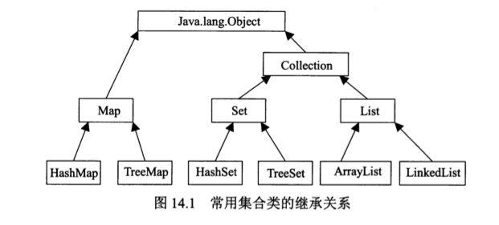

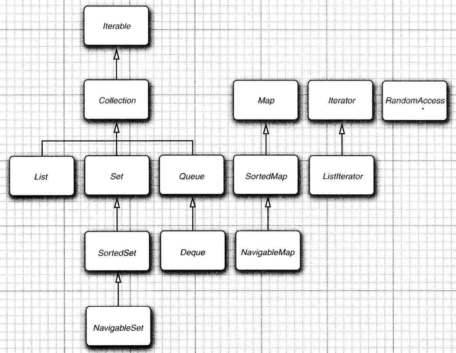

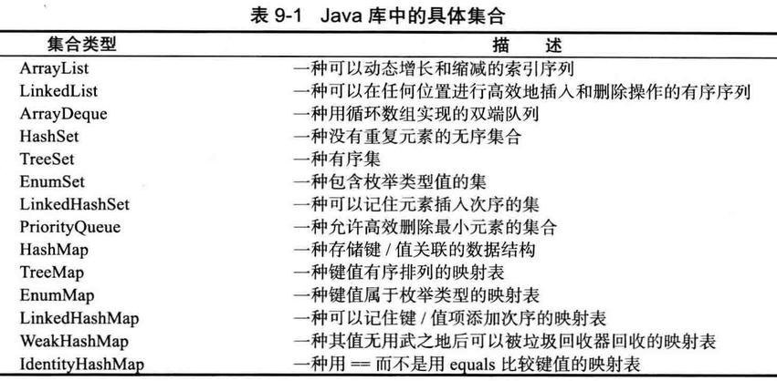

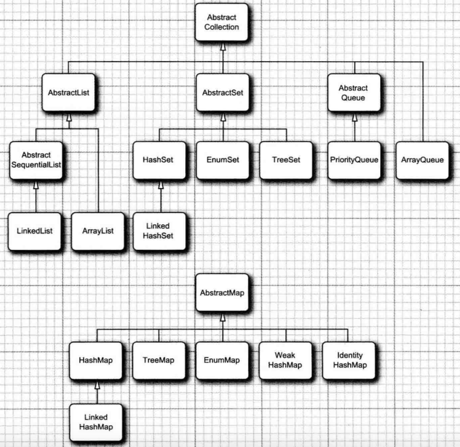

### 迭代器

```java
public interface Iterator <E> {
    E next(); // 逐个访问集合中的元素，到达末尾时，抛出NoSuchElementException
    boolean hasNext(); // 是否还有供访问的元素
    void remove(); // 删除上次调用next方法时返回的元素。
    default void forEachRemaining(Consumer<? super E> action); // 依次访问元素
}

// 遍历 Collection 中的元素
// 1. 使用迭代器
Collection<String> c = . . .;
Iterator<String> iterator = c.iterator();
while (iterator.hasNext()){
    String element = iterator.next();
    //do something with element
}
// 2. 使用for each 循环（对象需要实现Iterable接口）
// 3. 使用forEachRemaining方法（Java 8+）
iterator.forEachRemaining(element -> { dosomethingwith element });
```

Java迭代器位于两个元素之间，当调用next时，迭代器就越过下一个元素，返回刚刚越过的那个元素的引用

ListIterator

```java
interface ListIterator<E> extends Iterator<E> {
    void add(E element); // 在迭代器位置之前添加元素，总是默认添加成功
    E previous(); // 用于反向遍历
    boolean hasPrevious(); // 用于反向遍历
    void set(E element); // 将next或previous方法返回的上一个元素替换为新的值。
}
```

### Collection 接口

集合类的基本接口，不允许有重复数据

```java
public interface Collection {
    boolean add(E element); // 向集合中添加元素。集合中不允许有重复的对象。
    Iterator<E> iterator(); // 迭代器，用于依次访问集合中的元素。
}
```

AbstractCollection 类实现了 Collection 接口，提供了基础方法的实现。

Collections是一个工具类，方法都是静态的，用于操作Collection

### List

有序集合，提供随机访问方式。Java中所有链表都是双向链表

```java
public interface List<E> extends Collection<E>{
    void add(int index, E element);
    void remove(int index);
    E get(int index);
    E set(int index, E element);
}
```

LinkedList

链表是一个有序集合。

```java
public class LinkedList<E> implements List<E> {
    ListIterator<E> listIterator​(); // 返回 ListIterator 对象，按序访问
    get() & set(); // 随机访问某个元素（效率低）
}

List<String> staff = new LinkedList<>();
// add 方法将对象添加到链表的尾部，这种依赖于位置的add方法由迭代器负责
staff.add("Amy");
staff.add("Bob");
Iterator iter = staff.iterator();
String first = iter.next();
iter.add("Juliet"); // --> Amy Juliet Bob。Add 方法在迭代器位置之前添加一个新对象。
String second = iter.next();
iter.remove();

interface ListIterator<E> extends Iterator<E> {
    void add(E element);
    E previous();
    boolean hasPrevious(); // 可以向前遍历
}
```

ArrayList

封装了一个动态再分配的对象数组。ArrayList方法是不同步的（Vector是同步的）

```java
//泛型数组，创建，添加，确定容量，初始容量，返回实际元素数目
ArrayList<Employee> staff = new ArrayList<>();
staff.add(new Employee("Harry", ...));
staff.ensureCapacity(100);
ArrayList<Employee> staff = new ArrayList<>(100);
staff.size();
staff.set(i, harry);//等价于 staff[i] = harry;
Employee e = staff.get(i);//获取元素 等价于 e = staff[i];
staff.add(n, e);//插入元素
Employee e = staff.remove(n);//删除元素
```

### Set

Set的特点：无序、不允许重复、没有索引。

HashSet

采用链表数组实现，每个列表称为桶(bucket)，对象所在的桶=散列码%桶数。

HashSet的访问顺序几乎是随机的。

常用方法

```java
add(); // 添加元素
contains(); // 查找某个元素是否在set中
```

TreeSet

有序集合，使用红黑树数据结构。使用TreeSet的元素必须实现Comparable接口。

### Queue

Queue 队列

Deque 双端队列

ArrayDeque 双端队列，用数组实现

PriorityQueue 优先级队列，采用堆实现（对象需要实现Comparable接口，或提供Comparator对象）

### Map

用来存放键/值对

```java
public interface Map<K, V> {
    V put(K key, V value); // 添加键值对。如果对同一个建调用两次put，则第二个值会取代第一个值。
    V get(K key); // 根据key获取value
    V getOrDefault(K key, V defaultValue); // 获取key对应的value，如果key查不到，返回defaultValue。
    V remove(K key); // 根据指定的key删除对应的关系，并返回key所对应的value，没有删除成功则返回null
    int size(); // 返回映射中的元素数
    Set<K> keySet(); // 以set类型返回key组成的集合
    Collection<V> values(); // 以collection类型返回value组成的集合
    Set<Map.Entry<K, V>> entrySet(); // 返回key/value组成的集合
    boolean containsKey(Object key); // 判断指定的key是否存在
    boolean containsValue(Object value); // 判断指定的value是否存在
}

// 更新映射项
counts.put(word, counts.getOrDefault(word, 0) + 1); // 当word不存在时也不会出错
counts.putlfAbsent(word, 0); // word不存在时，将它设为0
counts.merge(word, 1, Integer::sum); // word不存在时为1，存在时和1相加

// 视图
Set<K> keySet();
Collection<V> values();
Set<Map.Entry<K, V>> entrySet();

// 访问映射条目
// 1
Set<String> keys = map.keySet();
for (String key : keys){
    // do something with keysey
}
// 2
for (Map.Entry<String, Employee> entry : staff.entrySet()){
    String k = entry.getKey();
    Employee v = entry.getValue();
    // do something with k, v
}
// 3
counts.forEach((k，v) -> { 
    // dos omething with k, v
});
```

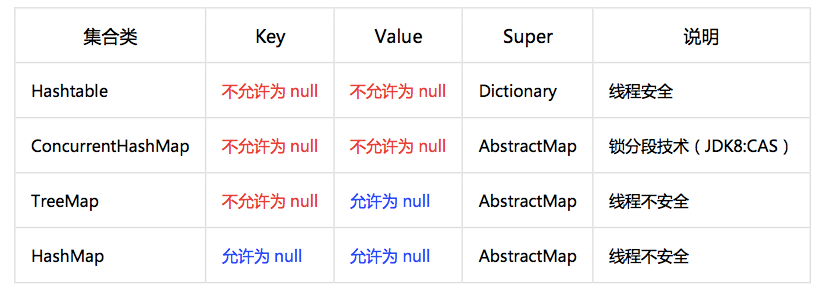

有 HashMap 和 TreeMap

WeakHashMap

只要映射对象是活动的，其中的所有桶也是活动的，即使其中有某些键已不再使用，它们不能被垃圾回收器回收。因此，需要由程序负责从长期存活的映射表中删除那些无用的值。或者使用 WeakHashMap 完成这件事情。

LinkedHashMap

LinkedHashSet 和 LinkedHashMap 类用来记住插人元素项的顺序。

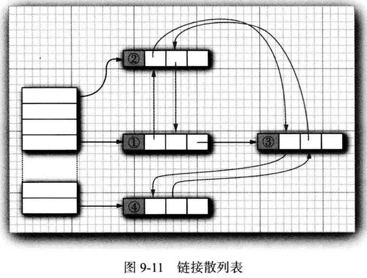

LinkedHashMap 将用访问顺序，而不是插入顺序，对映射条目进行迭代。每次调用 get 或 put，受到影响的条目将从当前的位置删除，并放到条目链表的尾部

EnumSet & EnumMap

```java
enum Weekday { MONDAY, TUESDAY, WEDNESDAY, THURSDAY, FRIDAY, SATURDAY, SUNDAY };
EnumSet<Weekday> always = EnumSet.allOf(Weekday.class);
EnumSet<Weekday> never = EnumSet.noneOf(Weekday.class);
EnumSet<Weekday> workday = EnumSet.range(Weekday.MONDAY, Weekday.FRIDAY);
EnumSet<Weekday> mwf = EnumSet.of(Weekday.MONDAY, Weekday.WEDNESDAY, Weekday.FRIDAY);

EnumMap<Weekday, Employee> personInCharge = new EnumMap<>(Weekday.class);
```

IdentityHashMap

键的散列值用 System.identityHashCode 方法计算，即根据对象的内存地址来计算。比较对象时，使用 ==。

视图与包装器

Map 的 keySet 方法返回一个实现了 Set 接口的类对象，这个类的方法对原 Map 进行操作。这种集合称为视图。

### 算法

```java
// 排序
List<String> staff = new LinkedList<>();
Collections.sort(staff);
staff.sort(Comparator.comparingDouble(Employee::getSalary)); // 用自定义的比较器排序
staff.sort(Comparator.reverseOrder()); // 逆序
staff.sort(Comparator.comparingDouble(Employee::getSalary).reversed()); // 逆序

// 打散顺序
Collections.shuffle(cards);

// 二分查找
i = Collections.binarySearch(c, element); // c(集合)必须是排好序的。i>0是匹配对象的索引，i<0则-i-1是保持顺序的插入位置。
i = Collections.binarySearch(c, element, comparator);

// 其他
words.removeIf(w -> w.length() <= 3); // 删除集合中长度小于等于3的单词
words.replaceAll(String::toLowerCase); // 将所有单词改成小写

// 求交集
Set<String> result = new HashSet<>(a);
result.retainAll(b);

// 数组转集合
String[] values = ...;
HashSet<String> staff = new HashSet<>(Arrays.asList(values));
// 集合转数组
Object[] values = staff.toArray();
String[] values = staff.toArray(new String[0]);
staff.toArray(new String[staff.size()]); // 不会再创建新数组
```

## 部署Java应用程序

### JAR文件

Java 归档(JAR)文件，将应用程序打包成一个文件(就像把一堆word文件打成一个压缩包一样)。一个 JAR 文件既可以包含类文件，也可以包含诸如图像和声音这些其他类型的文件。JAR 可被像编译器和 JVM 这样的工具直接使用。JAR 中的 manifests 和部署描述符，用来指示工具如何处理特定的 JAR。

META-INF 目录用于存储包和扩展的配置数据，如安全性和版本信息。目录中包含以下文件

1. MANIFEST.MF。这个 manifest 文件定义了与扩展和包相关的数据。
2. INDEX.LIST。这个文件由 jar 工具的新选项 -i 生成，它包含在应用程序或者扩展中定义的包的位置信息。
3. xxx.SF。这是 JAR 文件的签名文件。占位符 xxx 标识了签名者。
4. xxx.DSA。与签名文件相关联的签名程序块文件，它存储了用于签名 JAR 文件的公共签名。

创建 JAR 文件

使用jar工具（位于jdk/bin目录下）制作JAR文件

```sh
# 创建 jar 文件
jar cvf JarFileName File1 File2 ...
```

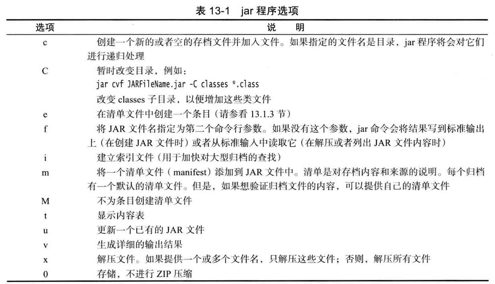

|功能|命令|
|---|---|
|用一个单独的文件创建一个 JAR 文件|jar cf jar-file input-file...|
|用一个目录创建一个 JAR 文件|jar cf jar-file dir-name|
|创建一个未压缩的 JAR 文件|jar cf0 jar-file dir-name|
|更新一个 JAR 文件|jar uf jar-file input-file...|
|查看一个 JAR 文件的内容|jar tf jar-file|
|提取一个 JAR 文件的内容|jar xf jar-file|
|从一个 JAR 文件中提取特定的文件|jar xf jar-file archived-file...|
|运行一个打包为可执行 JAR 文件的应用程序|java -jar app.jar|

### 清单文件

清单文件(manifest)，用于描述归档特征。被命名为 MANIFEST.MF，位于 META-INF 目录下。

条目被称为节，节与节之间用空行隔开，最后一行必须以换行符结束。

例子

```sh
Manifest-version: 1.0
# 第一节被称为主节，这行描述这个归档文件

Name: Woozle.class
# 描述这个文件的行
Name: com/mycompany/mypkg
# 描述这个包的行

# 清单文件的最后一行必须以换行符结束
```

操作清单文件

```sh
# 创建一个包含清单的 JAR 文件(统一目录下创建相同名字的jar，会覆盖)
jar cfm MyArchive.jar manifest.mf com/mycompany/mypkg/*.class
# 更新一个已有的JAR文件的清单，manifest-additions.mf是清单增加的部分
jar ufm MyArchive.jar manifest-additions.mf
```

如果要密封包，以保证不会有其他的类加人到其中。需要将包中的类放到一个 JAR 文件中，并配置清单文件。

```sh
# 主节中加入，默认包都密封
Sealed: true
# 指定单独的包密封
Name: com/mycompany/util/
Sealed: true
```

扩展类

```sh
Class-Path: extension2.jar # 相对路径，本jar可以调用 extension2.jar 中的类
```

### 可执行的JAR文件

一个可执行的 jar 文件是一个自包含的 Java 应用程序，它存储在特别配置的 JAR 文件中，可以由 JVM 直接执行它而无需事先提取文件或者设置类路径。

运行非可执行的 JAR 中的应用程序，则必须将它加入到类路径中，并用名字调用应用程序的主类。

```sh
# 指定程序的入口点，即运行jar程序时，开始的地方
jar cvfe MyProgram.jar com.mycompany.mypkg.MainAppClass filesToAdd
# 效果同上，在清单中指定应用程序的主类
Main-Class: com.mycompany.mypkg.MainAppClass
# 启动应用程序
java -jar MyProgram.jar
# 列出 JAR 内容
jar -tf packEx.jar
# 解压
jar -xf packEx.jar
```

完整创建步骤

```sh
# 1. 确定所有的类文件都在classes目录下
# 2. 创建manifest.mf来描述程序入口点。manifest.mf内容如下
Main-Class: com.mycompany.mypkg.MainAppClass
# 3. 执行jar工具来创建带有所有类以及mainifest的JAR文件
cd MyProject/classes
jar -cvmf manifest.mf MyProgram.jar *.class # jar cmf manifest ExecutableJar.jar(可执行jar名) application-dir(程序目录)
# 4. 启动程序
java -jar MyProgram.jar
```

### 资源

和类相关的数据文件，如图片、声音等，这些关联文件被称为资源。

类加载器可以记住如何定位类，然后在同一位置査找关联的资源。

```java
// 在找到 ResourceTest 类的地方查找 about.gif 文件。
URL url = ResourceTest.class.getResource("about.gif");
Image img = new ImageIcon(url).getImage();

// 读取 ResourceTest 类的 about.txt 文件
InputStream stream = ResourceTest.class.getResourceAsStream("about.txt");
Scanner in = new Scanner(stream, "UTF-8");
```

### 首选项(配置信息)

#### 属性映射(Properties)

属性映射（property map）是一种存储键/值对的数据结构，通常用来存储配置信息，它由3个特征：

- 键和值是字符串。
- 映射可以很容易地存人文件以及从文件加载。
- 有一个二级表保存默认值

实现属性映射的 Java 类名为 Properties。

```java
// 设置属性
Properties settings = new Properties();
settings.setProperty("width", "200");
settings.setProperty("title", "Hello, World!");

// 保存到文件
OutputStream out = new FileOutputStream("program.properties");
// 第二个参数是注释
settings.store(out, "Program Properties");

// 加载属性
String userDir = System.getProperty("user.home"); // 用户主目录
InputStream in = new FileInputStream("program.properties");
settings.load(in);
String title = settings.getProperty("title", "Default title");

// 指定settings中key的默认值（defaultSettings是一个Properties对象）
Properties settings = new Properties(defaultSettings);
```

属性映射是没有层次结构的简单表。通常会用类似window.main.color、window.main.title等键名引入一个伪层次结构。不过 Properties 类没有提供方法来组织这样一个层次结构。

#### 首选项API(Preferences)

Preferences 提供了存储配置信息的中心存储库。Preferences 存储库有一个树状结构，节点路径名类似于 `/com/mycompany/myapp`。

存储库的各个节点分别有一个单独的键/值对表，可以用来存储数值、字符串或字节数组，但不能存储可串行化的对象。

```java
// 根节点
Preferences root = Preferences.userRoot();
Preferences root = Preferences.systemRoot();
// 访问节点
Preferences node= root.node("/com/mycompany/myapp");
// 如果节点的路径=包名
Preferences node = Preferences.userNodeForPackage(obj.getClass());
Preferences node = Preferences.systemNodeForPackage(obj.getClass());
// 访问内容（对节点操作）
String get(String key, String defval)
int getInt(String key, int defval)
long getLong(String key, long defval)
float getFIoat(String key, float defval)
double getDouble(String key, double defval)
boolean getBoolean(String key, boolean defval)
byte[] getByteArray(String key, byte[] defval)
// 写数据（对节点操作）
put(String key, String value)
putInt(String key, int value)
// 导出一个子树或节点的配置信息(首选项)
void exportSubtree(OutputStream out)
void exportNode(OutputStream out)
// 导入到另一个存储库
void importPreferences(InputStream in)
```

## 并发

### 线程

线程的实现方法

1. 新建一个类，继承Thread类，并重写其中的run方法。
2. 声明实现Runnable接口的类，该类实现run方法。分配该类的实例，在创建Thread时作为参数传递进去。

```java
// 线程（java.lang.Thread)
// 定义线程需要执行的内容
public class MyRunnable implements Runnable{
    public void run(){ // Runnable接口只有一个方法需要实现，要运行的程序放在这里
        System.out.println("hello");
    }
}
try{
    Thread.sleep(200); // 使线程睡眠
} catch(InterruptedException ex){
    ex.printStackTrace();
}

// 启动线程
Runnable r = new MyRunnable(); // 定义线程的执行任务。Runnable是个接口
// 暂停当前线程的活动，停DELAY毫秒。
Thread.sleep(DELAY);
// 创建线程，r是Runnable类型
Thread t = new Thread(r);
// 执行线程
t.start();
// 中断线程，线程的中断状态将被置位
t.interrupt();
// 判断线程是否被中断，不改变中断状态
Thread.currentThread().isInterrupted()
// 线程的当前状态
t.getState();
```

发生 InterruptedException 时，run方法将结束执行。

没有强制线程终止的方法，interrupt方法可以用来请求终止线程。

如果线程被阻塞，就无法检测中断状态。在阻塞线程（调用sleep或wait后）上调用interrupt方法，会产生 InterruptedException，同时中断状态被清除（未被中断）。

被中断的线程可以决定如何响应中断，可以继续运行，也可以中断请求。

#### 线程状态

线程可以有如下 6 种状态

- New (新创建) 
- Runnable (可运行) 
- Blocked (被阻塞) 
- Waiting (等待)
- Timed waiting (计时等待) 
- Terminated (被终止)

带有超时参数的方法有：Thread.sleep, Object.wait, Thread.join, Lock.tryLock, Condition.await的计时版。

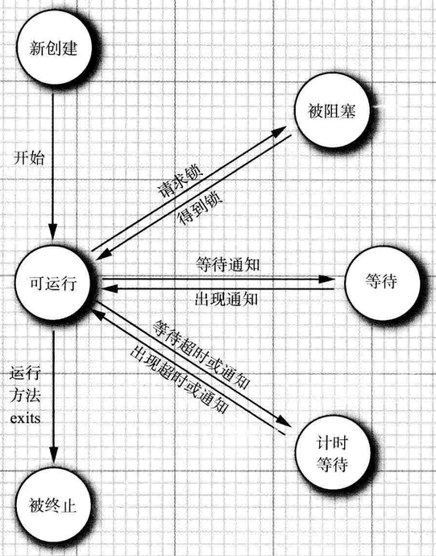

#### 线程属性

- 线程优先级 默认继承父线程的优先级，setPriority设置优先级。
- 守护线程 守护线程为其他线程提供服务。
- 线程组
- 处理未捕获异常的处理器 当一个线程因未捕获异常而终止，按规定要将客户报告记录到日志中。

线程优先级

每个线程有一个优先级。默认会继承父线程的优先级。

```java
setPriority() // 设置线程优先级
Thread.MIN_PRIORITY == 1
Thread.MAX_PRIORITY == 10
Thread.NORM_PRIORITY == 5
Thread.yield() // 线程在让步状态，则同等级或高等级的线程会被调度。
```

守护线程

```java
// 转换为守护线程
t.setDaemon(true);
```

守护线程的唯一用途是为其他线程提供服务。当只剩下守护线程时，虚拟机就退出了。

未捕获异常处理器

线程的run方法内出现未检查异常时，在线程死亡之前，异常被传递到一个用于捕获异常的处理器。该处理器实现 Thread.UncaughtExceptionHandler 接口。

不为独立的线程安装处理器，则处理器是该线程的 ThreadGroup 对象。ThreadGroup 类实现了 Thread.UncaughtExceptionHandler 接口。

```java
Thread.setDefaultUncaughtExceptionHandler() // 为线程安装默认处理器
t.setUncaughtExceptionHandler() // 为线程安装处理器

public class TestThread {
    public static void main(String[] args) {
        Runnable r = () -> {
            throw new MyException("这是我创建的异常");
        };
        Thread t = new Thread(r);
        MyHandler handler = new MyHandler();
        t.setUncaughtExceptionHandler(handler);
        t.start();
    }
}

class MyHandler implements UncaughtExceptionHandler {
    @Override
    public void uncaughtException(Thread t, Throwable e) {
        System.out.println("这是我创建的Handler");
        System.out.println(t.getName());
        System.out.println(e.getClass());
    }
    
}
```

### 同步

两个或两个以上的线程，对同一共享数据进行存取的情况，通常称为竞争条件(race condition)。

有2种机制防止代码并发访问的干扰

1. synchronized 关键字
2. ReentrantLock 类

```java
Lock myLock = new ReentrantLock();
myLock.lock(); // ReentrantLock 对象
try {
    // 临界区（critical section）
} finally {
    myLock.unlock(); // make sure the lock is unlocked even if an exception is thrown
}
```

如果在临界区发生异常，并且没有处理，则对象可能处于受损状态。即，不是原子操作，不会自动回退已发生的操作。

#### 条件对象（条件变量）

进入临界区后，如果不满足一定条件，会释放锁，并阻塞在这个条件的等待队列里。锁可以拥有一个或多个相关的条件对象。

```java
class Bank {
    private Condition sufficientFunds;
    ...
    public Bank() {
        ...
        sufficientFunds = bankLock.newCondition();
    }
    public void transfer(int from, int to, int amount) {
        bankLock.lock();
        try {
            while (accounts[from] < amount)
                sufficientFunds.await(); // 被条件阻塞，释放锁
            // transfer funds ...
            sufficientFunds.signalAll(); // 解除等待线程的阻塞，线程会通过竞争实现对象的访问
            // sufficientFunds.signal(); // 随机选择一个在该条件上被阻塞的线程，解除其阻塞状态。如果条件不满足，可能会继续阻塞。
        } finally {
            bankLock.unlock();
        } 
    }
}
```

可能导致死锁。

#### synchronized 关键字

Java 中的每一个对象都有一个内部锁。如果一个方法用 synchronized 关键字声明，那么对象的锁将保护整个方法。即

```java
public synchronized void method() {
    // method body
}
// 等价于
public void method() {
    this.intrinsicLock.lock();
    try {
        // method body
    } finally {
        this.intrinsicLock.unlock();
    }
}
```

非静态同步方法的锁对象是this。静态的同步方法的锁对象是当前类的字节码对象(Class对象)。

内部对象锁只有一个相关条件。wait 方法添加一个线程到等待集中，notifyAll/notify 方法解除等待线程的阻塞状态。

```java
// 调用 wait 或 notityAll 等价于
intrinsicCondition.await();
intrinsicCondition.signalAll();
```

内部锁和条件存在一些局限。包括

- 不能中断一个正在试图获得锁的线程。
- 试图获得锁时不能设定超时。
- 每个锁仅有单一的条件，可能是不够的。

#### 同步阻塞

同步阻塞，获得某个对象的内置锁

```java
public class Bank {
    private doublet] accounts;
    private Object lock = new Object(); // 创建这个对象，仅仅是为了使用它的对象锁
    public void transfer(int from, int to, int amount) {
        synchronized(lock) { // an ad-hoc lock
            accounts[from] -= amount;
            accounts[to] += amount;
        }
    }
}
```

使用一个对象的锁，来实现额外的原子操作，被称为客户端锁定(client-side locking)。不推荐使用。

监视器概念

- 监视器是只包含私有域的类。
- 每个监视器类的对象有一个相关的锁。
- 使用该锁对所有的方法进行加锁。换句话说，如果客户端调用 obj.method()，那么obj对象的锁是在方法调用开始时自动获得，并且当方法返回时自动释放该锁。
- 该锁可以有任意多个相关条件。

#### volatile 关键字

1. 计算机能够暂时在寄存器或本地内存缓冲区中保存内存中的值。可能导致在同一个内存位置取到不同的值
2. 编译器可以改变指令执行顺序，但是线程可以改变内存中的值。

加锁后，编译器被要求通过在必要的时候刷新本地缓存来保持锁的效应，并且不能不正当地重新排序指令。因此可以避免上面2个问题。

如果声明一个域为 volatile，那么编译器和虚拟机就知道该域是可能被另一个线程并发更新的。volatile 变量不能提供原子性。

```java
private volatile boolean done;
public boolean isDone() { return done; }
public void setDone() { done = true; }
```

#### 原子类

java.util.concurrent.atomic 包中有很多类使用了很高效的机器级指令(而不是使用锁)来保证其他操作的原子性。

```java
incrementAndGet()
decrementAndGet()
public static AtomicLong nextNumber = new AtomicLong();
// In some thread...
long id = nextNumber.incrementAndGet();

public static AtomicLong largest = new AtomicLong();
do {
    oldValue = largest.get();
    newValue = Math.max(oldValue, observed);
} while (!largest.compareAndSet(oldValue, newValue));

largest.updateAndGet(x -> Math.max(x, observed)); // 作用同上
largest.accumulateAndCet(observed, Math::max); // 作用同上

// LongAdder
final LongAdder adder = new LongAdder();
for (...) {
    pool.submit(() -> {
        while (...) {
            if (...)
                adder.increment();
        }
    });
}
long total = adder.sum();

// LongAccumulator
LongAccumulator adder = new LongAccumulator(Long::sum, 0);
// In some thread...
adder.accumulate(value) ;
```

死锁

当程序挂起时，键入 CTRL+\，将得到一个所有线程的列表。每一个线程有一个栈跟踪，告诉你线程被阻塞的位置。

线程局部变量

```java
// 为每个线程构造一个实例
public static final ThreadLocal<SimpleDateFormat> dateFormat = 
    ThreadLocal.withInitial(() -> new SimpleDateFormat("yyyy-MM-dd"));
// 调用当前线程的实例
String dateStamp = dateFormat.get().format(new Date());

// 为各个线程提供一个单独的随机数生成器。ThreadLocalRandom.current() 调用会返回特定于当前线程的 Random 类实例。
int random = ThreadLocalRandom.current().nextInt(upperBound);
```

锁测试与超时

tryLock方法试图申请一个锁，在成功获得锁后返回true；否则，立即返回 false，线程可以立即离开去做其他事情。

```java
if (myLock.tryLock()) {
    // now the thread owns the lock
    try { ... }
    finally { myLock.unlock(); }
} else {
    // do something else
}
// 使用超时参数
myLock.tryLock(100, TineUnit.MILLISECONDS)
```

lock 方法不能被中断。如果调用带有用超时参数的 tryLock，那么如果线程在等待期间被中断，将抛出 InterruptedException 异常。

lockInterruptibly 方法相当于一个超时设为无限的 tryLock 方法。

读/写锁

ReentrantReadWriteLock 类，允许读者线程共享访问数据，写者线程互斥访问。

```java
// 1) 构造一个 ReentrantReadWriteLock 对象
private ReentrantReadWriteLock rwl = new ReentrantReadWriteLock();
// 2) 抽取读锁和写锁
private Lock readLock = rwl.readLock();
private Lock writeLock = rwl.writeLock();
// 3) 对所有的获取方法加读锁
public double getTotalBalance() {
    readLock.lock();
    try { ... }
    finally { readLock.unlock(); }
}
// 4) 对所有的修改方法加写锁
public void transfer(...) {
    writeLock.lock();
    try { ... }
    finally { writeLock.unlock(); }
}
```

stop方法破坏对象的状态，suspend方法容易死锁，所以他们被废弃了。

### 阻塞队列

使用场景：生产者向队列装入产品，消费者从队列取出产品。由队列解决同步问题。

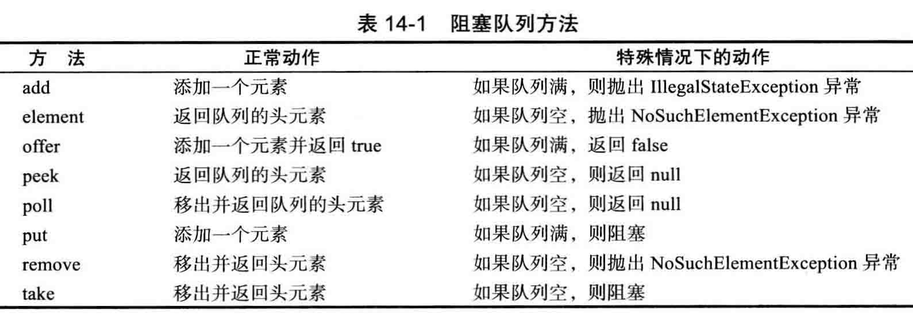

put -- take 阻塞

add -- remove -- element 发生异常

offer -- poll -- peek 返回false, null

```java
// 带有超时参数
boolean success = q.offer(x, 100, TimeUnit.MILLISECONDS);
Object head = q.poll(100, TimeUnit.MILLISECONDS);
```

常用阻塞队列

- LinkedBlockingQueue 容量无上限
- LinkedBlockingDeque 双端队列
- ArrayBlockingQueue 需要指定容量，可设置公平性
- PriorityBlockingQueue 带优先级的队列，没有容量上限
- DelayQueue 实现了 Delayed 接口
- TransferQueue 生产者调用 `q.transfer(iteni);` 这个调用会阻塞，直到另一个线程将元素(item) 删除。

### 线程安全的集合

java.util.concurrent 包提供了映射、有序集和队列的高效实现。

- ConcurrentHashMap
- ConcurrentSkipListMap
- ConcurrentSkipListSet
- ConcurrentLinkedQueue

这些集合的 size 方法不必在常量时间内操作，确定集合当前的大小通常需要遍历。

集合返回弱一致性(weakly consistent)的迭代器。这意味着迭代器不一定能反映出它们被构造之后的所有的修改，但是，它们不会将同一个值返回两次，也不会拋出 ConcurrentModificationException 异常。

并发散列映射将桶组织为树，而不是列表(Java SE 8+)。ConcurrentHashMap 中不允许有 null 值。

```java
// 将 ConcurrentHashMap 对象中的某个值更改为最新的值
do {
    oldValue = map.get(word);
    newValue = oldValue == null ? 1 : oldValue + 1;
} while (!map.replace(word, oldValue, newValue)); // replace时，如果oldvalue被修改了，则返回false。
// 同上
map.putIfAbsent(word, new LongAdder());
map.get(word).increment();
// 同上
map.putIfAbsent(word, new LongAdder()).increment();
// 同上
map.compute(word, (k, v) -> v == null ? 1 : v + 1);
// 同上
map.computeIfAbsent(word, k -> new LongAdder()).increment(); // computeIfAbsent：在没有原值的情况下计算
// 同上
map.merge(word, 1L, (existingValue, newValue) -> existingValue + newValue); // 第二个参数表示键不存在时的初始值，第三个参数表示键存在时的操作(返回null，则删除该条目)
map.merge(word, 1L, Long::sum);
```

ConcurrentHashMap 的批操作

有 3 种不同的操作:

- 搜索(search) 为每个键或值提供一个函数，直到函数生成一个非 null 的结果。然后搜索终止，返回这个函数的结果。
- 归约(reduce) 组合所有键或值，这里要使用所提供的一个累加函数。
- forEach 为所有键或值提供一个函数。

每个操作都有 4 个版本:

- operationKeys : 处理键。
- operatioriValues : 处理值。
- operation: 处理键和值。
- operatioriEntries: 处理Map.Entry对象。

```java
// 如果 map 中的元素数 > threshold ，则会分成多个线程，并行完成批操作。
String result = map.search(threshold, (k, v) -> v > 1000 ? k : null);
map.forEach(threshold, (k, v) -> System.out.println(k + " -> " + v));
map.forEach(threshold, (k, v) -> k + " -> " + v, // Transformer
    System.out::println); // Consumer
// 转换器可以用作为一个过滤器。只要转换器返回null, 这个值就会被悄无声息地跳过。
map.forEach(threshold, (k, v) -> v > 1000 ? k + " -> " + v : null, // Filter and transformer
    System.out::println); // The nulls are not passed to the consumer
// 计算所有值的和
Long sum = map.reduceValues(threshold, Long::sum);
// 计算最长键的长度
Integer maxlength = map.reduceKeys(threshold, String::length, // Transformer
    Integer::max); // Accumulator
long sum = map.reduceValuesToLong(threshold, Long::longValue, // Transformer to primitive type
    0, // Default value for empty map
    Long::sum); // Primitive type accumulator
```

并发集视图

没有 ConcurrentHashSet 类。静态 newKeySet 方法会生成一个Set<K>，这实际上是 ConcurrentHashMap<K, Boolean> 的一个包装器，所有映射值都为 Boolean.TRUE。

```java
Set<String> words = ConcurrentHashMap.<String>newKeySet();
Set<String> words = map.keySet(1L); // set 中加入 key时，key的value的默认值
words.add("Java");
```

写数组的拷贝

- CopyOnWriteArrayList
- CopyOnWriteArraySet

如果有多个调用者（Callers）同时要求相同的资源（如内存或者是磁盘上的数据存储），他们会共同获取相同的指针指向相同的资源，直到某个调用者修改资源内容时，系统才会真正复制一份专用副本（private copy）给该调用者，而其他调用者所见到的最初的资源仍然保持不变。这过程对其他的调用者都是透明的（transparently）。

并行数组算法

Arrays类提供了大量并行化操作。

```java
String contents = new String(Fi1es.readAllBytes(Paths.get("alice.txt")), StandardCharsets.UTF_8); // Read file into string
String[] words = contents.split("[\\P{L}]+"); // Split along nonletters
Arrays.parallelSort(words);

Arrays.parallelSort(words, Comparator.comparing(String::length));
values.parallelSort(values.length / 2, values.length); // Sort the upper half

Arrays.parallelSetAll(values, i -> i % 10); // i是数组索引，values的值为 0123456789012...

// parallelPrefix 用对应一个给定结合操作的前缀的累加结果替换各个数组元素
// values = [1，2,3,4,...]
Arrays.parallelPrefix(values, (x, y) -> x * y); // [1,1x2,1x2x3,1x2x3x4, ...]
```

较早的线程安全集合

任何集合类都可以通过使用同步包装器(synchronization wrapper)变成线程安全的

```java
List<E> synchArrayList = Collections.synchronizedList(new ArrayList<E>());
Map<K, V> synchHashMap = Col1ections.synchronizedMap(new HashMap<K, V>());
```

结果集合的方法使用锁加以保护，提供了线程安全访问。

### Callable 与 Future

Callable 与 Runnable 类似，但是有返回值。

Future 保存异步计算的结果。可以启动一个计算，将 Future 对象交给某个线程，Future 对象的所有者在结果计算好之后就可以获得它。

FutureTask 包装器可将 Callable 转换成 Future 和 Runnable。 

```java
public interface Callable<V> {
    V call() throws Exception;
}
public interface Future<V> {
    V get() throws ...; // 对 get 的调用会发生阻塞，直到有可获得的结果为止。
    V get(long timeout, TimeUnit unit) throws ...; // 调用超时，拋出 TimeoutException 异常。
    void cancel (boolean mayInterrupt);
    boolean isCancelled();
    boolean isDone();
}

Callable<Integer> myComputation = ...;
FutureTask<Integer> task = new FutureTask<Integer>(myComputation);
Thread t = new Thread(task); // it's a Runnable
t.start();
Integer result = task.get();// it's a Future
```

### 执行器

一个线程池(thread pool)中包含许多准备运行的空闲线程。将 Runnable 对象交给线程池，就会有一个线程调用 run 方法。当 run 方法退出时，线程不会死亡，而是在池中准备为下一个请求提供服务。

线程池可以限制并发线程的数目。

执行器(Executor)类有许多静态工厂方法用来构建线程池。

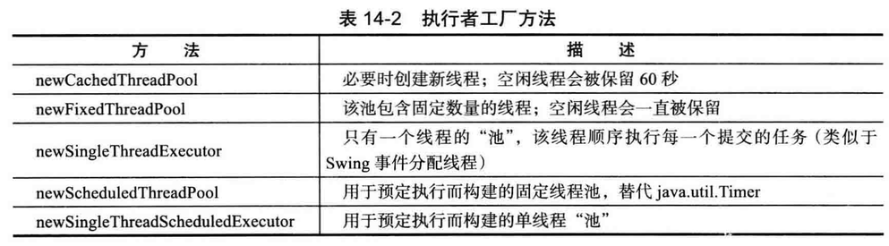

```java
// 向线程池提交任务
Future<?> submit(Runnable task) // 返回的 Future 对象调用 get 方法，在完成的时候只是简单地返回 null。
Future<T> submit(Runnable task, T result) // Future 的 get 方法在完成的时候返回指定的 result 对象。
Future<T> submit(Callable<T> task) // Future对象将在计算结果准备好的时候得到它。

// 关闭线程池
shutdown() // 等待所有线程执行完毕
shutdownNow() // 取消尚未开始的所有任务并试图中断正在运行的线程。

ScheduledFuture<V> schedule(Cal1able<V> task, long time, Timellnit unit) // 预定在指定的时间之后执行任务
ScheduledFuture<?> scheduleAtFixedRate(Runnable task, long initialDelay, long period, TimeUnit unit) // 预定在初始的延迟结束后，周期性地运行给定的任务，周期长度是 period
ScheduledFuture<?> scheduleWithFixedDelay(Runnable task, long initialDelay, long delay, TimeUnit unit)

List<Callab1e<T>> tasks = ...;
List<Future<T>> results = executor.invokeAll(tasks);
T oneResult = executor.invokeAny(tasks); // 其中一个返回结果，则计算停止。
for (Future<T> result : results)
    processFurther(result.get());

// 收集给定执行器的结果，能先获得已完成的任务结果
ExecutorCompletionService<T> service = new ExecutorCompletionService(executor);
for (Callable<T> task : tasks)
    service.submit(task);
for (int i = 0; i < tasks.size(); i++)
    processFurther(service.take().get()); // take()：移除下一个已完成的结果，如果没有任何已完成的结果可用则阻塞。
service.poll() // 移除下一个已完成的结果，如果没有任何已完成的结果可用则返回null。
```

Fork-Join 框架

```java
// 如果计算会生成一个类型为 T 的结果，提供一个扩展 RecursiveTask<T> 的类
// 如果没有结果，提供一个扩展 RecursiveAction 的类
class Counter extends RecursiveTask<Integer> {
    // ...
    protected Integer compute() {
        if (to - from < THRESHOLD) {
            // solve problem directly，返回一个类型为Integer的结果
        } else {
            int mid = (from + to) / 2;
            Counter first = new Counter(values, from, mid, filter); // values是待处理的数据，filter是处理方式
            Counter second = new Counter(values, mid, to, filter);
            invokeAll(first, second);
            return first.join() + second.join();
        }
    }
}

public static void main(String[] args) {
    Counter counter = ...;
    ForkJoinPool pool = new ForkJoinPool();
    pool.invoke(counter);
    syso(counter.join());
}
```

可完成 Future（重看）

利用可完成 Future(CompletableFuture)，可以指定你希望做什么，以及希望以什么顺序执行这些工作。

```java
// 抽取一个页面的所有url
public void CompletableFuture<String> readPage(URL url)
public static List<URL> getLinks(String page)

CompletableFuture<String> contents = readPage(url);
CompletableFuture<List<URL>> links = contents.thenApply(Parser::getLinks) ;
```

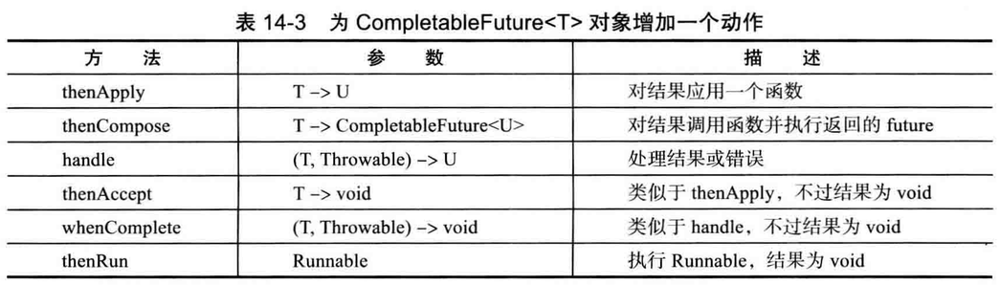

### 同步器

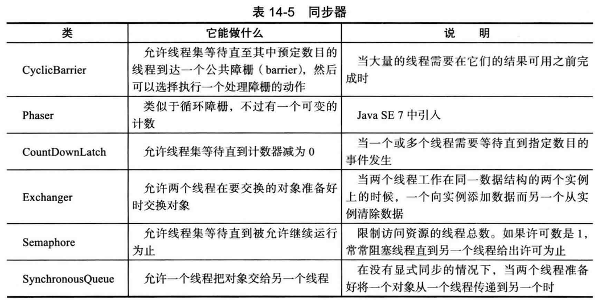

信号量

通过 acquire 请求许可，通过 release 释放许可。任何线程都可以释放任意数目的许可。

倒计时门栓 CountDownLatch

让一个线程集等待直到计数变为0。倒计时门栓是一次性的。一旦计数为0，就不能再重用了。可以用来保证工作流程，如，“工作”线程阻塞在门栓上，直到“准备”线程调用countDown使门栓的技术变为1，则工作线程可以获得门栓并开始运行。

障栅 CyclicBarrier

CyclicBarrier类实现了一个集结点(rendezvous)称为障栅(barrier)。

使用场景：大量线程运行在一次计算的不同部分的情形。当所有部分都准备好时，需要把结果组合在一起。当一个线程完成了它的那部分任务后，我们让它运行到障栅处。一旦所有的线程都到达了这个障栅，障栅就撤销，线程就可以继续运行。

障栅可以重用。

```java
CyclicBarrier barrier = new CyclicBarrier(nthreads); // nthreads: 参与的线程数
// 每个线程的工作
public void run() {
    doWork();
    barrier.await(); // 带有超时参数的 barrier.await(100, TimeUnit.MILLISECONDS);
}
// 障栅动作(线程全部完成后，将要执行的动作)
Runnable barrierAction = ...;
CyclicBarrier barrier = new CyclicBarrier(nthreads, barrierAction);
```

交换器

使用场景：一个线程向缓冲区填人数据，另一个线程消耗这些数据。当它们都完成以后，相互交换缓冲区。

同步队列

同步队列是一种将生产者与消费者线程配对的机制。当一个线程调用 SynchronousQueue 的 put 方法时，它会阻塞直到另一个线程调用 take 方法为止。

## 流库

流表面看起来和集合比较类似，可以转换和获取数据。但是

1. 流不存储元素
2. 流的操作不会修改数据源
3. 流的操作是尽可能惰性执行的

示例程序

```java
String contents = new String(Files.readAllBytes(Paths.get("myTxt.txt")), StandardCharsets.UTF_8); // 读入文件内容
List<String> words = Arrays.asList(contents.split("\\PL+")); // 分割成单词
long count = 0;
count = words.stream().filter(w -> w.length() > 12).count(); // 统计长度大于12的单词数
count = words.parallelStream().filter(w -> w.length() > 12).count(); // 并发统计
```

创建流

1. 用 Collection 接口的 stream 方法将任何集合转换为一个流。
2. 用静态的 Stream.of(array) 方法将数组转换成流
3. 使用 Array.stream(array, from, to) 为数组中的部分元素创建一个流
4. 用 Stream.empty() 创建一个空流
5. Stream 的 generate 和 iterate 方法

```java
Stream<String> words = Stream.of(contents.split("\\PL+"));
Stream<String> song = Stream.of("gently", "down");
Stream<String> wordsAnotherWay = Pattern.compile("\\PL+").splitAsStream(contents);
Stream<String> lines = Files.lines(path, StandardCharsets.UTF_8); // 包含文档所有行的stream
// 创建无限流
Stream<String> echos = Stream.generate(() -> "Echo"); // 产生无数个Echo
Stream<Double> randoms = Stream.generate(Math::random); // 产生无数个随机数
Stream<BigInteger> integers = Stream.iterate(BigInteger.ZERO, n -> n.add(BigInteger.ONE)); // 1 2 3 ...
```

流转换

```java
Stream<String> longwords = wordList.stream().filter(w -> w.length() > 12); // 将wordList中长度>12的单词转换成longwords流
Stream<String> lowerCaseWords = words.stream().map(String::toLowerCase); // map方法传递执行转换的函数
Stream<String> firstLetters = words.stream().map(s -> s.substring(0,1));
Stream<Stream<String>> result = words.stream().map(w -> leeters(w)); // letters返回一个流，result是包含流的流
Stream<String> result = words.stream().flatMap(w -> letters(w)); // letters返回一个流，flatMap把得到的流“展平”

stream.distinct(); // 去掉流中的重复元素
stream.sorted(Comparator.comparing(String::length).reversed()); // 流元素按长度排序生成新流
stream.peek(e -> System.out.println("Fetching " + e)); // 和原流的元素相同，但每获取一个元素都会调用一个函数
```

流的抽取和连接

```java
stream.limit(n); // 抽取流的前n个元素组成一个新流
stream.skip(n); // 丢掉流的前n个元素
stream.concat(stream1, stream2); // 将两个流连接起来
```

约简

约简是一种终结操作，将流约简为非流值，通常返回类型为 Optional<T>。

```java
Optional<String> largest = words.max(String::compareToIgnoreCase);
System.out.println("largest: " + largest.orElse(""));
Optional<String> startsWithQ = words.filter(s -> s.startsWith("Q")).findFirst(); // 找到流中第一个以Q开头的单词
Optional<String> startsWithQ = words.parallel().filter(s -> s.startsWith("Q")).findAny(); // 找到流中任意一个以Q开头的单词
boolean aWordstartsWithQ = words.parallel().anyMatch(s -> s.startsWith("Q")); // 找到流中是否存在以Q开头的单词
```

Optional 类型

Optional<T> 对象是一个包装器对象，要么包装了类型T的对象，要么没有包装任何对象。

```java
// 使用Optional对象。optionalString 是 Optional<String>对象
String result = optionalString.orElse(""); // 空值时返回""
String result = optionalString.orElseGet(() -> Locale.getDefault().getDisplayName()); // 空值时返回函数计算的值
String result = optionalString.orElseThrow(IllegalStateException::new); // 空值时抛异常
optionalValue.ifPresent(v -> Process v); // 空值时不做处理，有值时传递给函数
Optional<Boolean> result = optionalValue.map(v -> Process v); // 同上，但返回处理结果

// 创建Optional对象
Optional.empty();
Optional.of(obj);
Optional.ofNullable(obj); // obj为null时返回Optional.empty();不为null时返回Optional.of(obj);
// 假设s.f()返回Optional<T>类型，T类型的g()方法返回Optional<U>类型
Optional<U> result = s.f().flatMap(T::g);
```

收集结果

```java
// 遍历
stream.iterator(); // 返回迭代器，可以访问stream中的元素
stream.forEach(System.out::println);
// 收集到数组或集合
String[] result = stream.toArray(String[]::new); // 收集结果到数组
List<String> result = stream.collect(Collectors.toList());
Set<String> result = stream.collect(Collectors.toSet());
TreeSet<String> result = stream.collect(Collectors.toCollection(TreeSet::new));
// 收集到字符串中
String result = stream.collect(Collectors.joining("分隔符"));
String result = stream.map(Object::toString).collect(Collectors.joining(", "));
// 统计
IntSummaryStatistics summary = stream.collect(Collectors.summarizingInt(String::length));
double averageWordLength = summary.getAverage();
double maxWordLength = summary.getMax();
// 收集到map中
Map<Integer, String> idToName = people.collect(Collectors.toMap(Person::getId, Person::getName)); // people 的类型是 Stream<Person>
Map<Integer, Person> idToPerson = people.collect(Collectors.toMap(Person::getId, Function.identity()));
Map<String, String> languageNames = locales.collect(Collectors.toMap(Locale::getDisplayLanguage, l -> l.getDisplayLanguage(l), (existingValue, newValue) -> existingValue));
Map<Integer, Person> idToPerson = people.collect(Collectors.toMap(Person::getId, Function.identity(), (existingValue, newValue) -> { throw new IllegalStateException(); }, TreeMap::new)); // 结果集是TreeSet
```

群组和分区

```java
Map<String, List<Locale>> countryToLocales = locales.collect(Collectors.groupingBy(Locale::getCountry));
Map<Boolean, List<Locale>> englishAndOtherLocales = locales.collect(Collectors.partitioningBy(l -> l.getLanguage().equals("en")));
// 下游收集器
Map<String, Set<Locale>> countryToLocaleSet = locales.collect(Collectors.groupingBy(Locale::getCountry, toSet()));
Map<String, Long> countryToLocaleCounts = locales.collect(groupingBy(Locale::getCountry, counting()));
Stream<City> cities = readCities("cities.txt");
Map<String, Integer> stateToCityPopulation = cities.collect(groupingBy(City::getState, summingInt(City::getPopulation))); // 每个州的总人口数
Map<String, Optional<String>> stateToLongestCityName = cities.collect(groupingBy(City::getState, mapping(City::getName, maxBy(Comparator.comparing(String::length))))); // 每个州名字最长的城市
Map<String, IntSummaryStatistics> stateToCityPopulationSummary = cities.collect(groupingBy(City::getState, summarizingInt(City::getPopulation)));
```

基本类型流

```java
// 创建
IntStream stream = IntStream.of(1, 2, 3, 3, 5);
stream = Arrays.stream(values, from, to); // values的类型是int[]
IntStream zeroToNinetyNine = IntStream.range(0, 100); // [0, 100)
IntStream zeroToHundred = IntStream.rangeClosed(0, 100); // [0, 100]
String sentence = ...;
IntStream codes = sentence.codePoints();
// 对象流转换成基本类型流
Stream<String> words = ...;
IntStream lengths = words.mapToInt(String::length);
// 将基本流转换为对象流
Stream<Integer> integers = IntStream.range(0, 100).boxed();
```

并行流

```java
// 从任何集合中获取并行流
Stream<String> parallelWords = words.parallelStream();
// 顺序流转换为并行流
Stream<String> parallelWords = Stream.of(wordArray).parallel();
```

## IO

### IO流

可以从中读出一个字节序列的对象称为输入流，可以向其中写入一个自己序列的对象称为输出流。（即输入输出的主体是java程序）

字节序列的来源地和目的地可以是文件、网络连接、内存块。

因为面向字节的流不方便处理以 Unicode 形式存储的信息，所以从抽象类 Reader 和 Writer 中继承出来了一个专门用来处理 Unicode 字符的单独的类层次结构。这些类的读写操作都是基于2字节的 char 值。

读写字节

```java
read(); // InputStream/Reader 读字节/字符，执行时会阻塞
write(); // OutputStream/Writer 写字节/字符，执行时会阻塞
available(); // 检查当前可读入的字节数量
close(); // 关闭I/O流
flush(); // 输出流的内容会被放在缓冲区内，该方法将缓冲区的内容输出。
```

字节输入流（InputStream 及其子类）

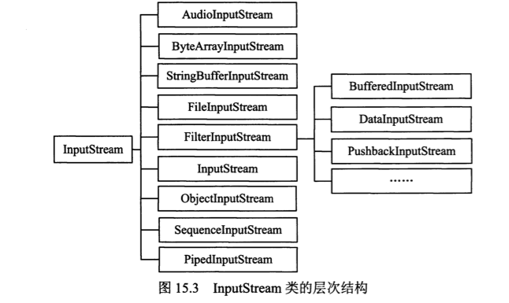

字节输出流（OutputStream 及其子类）

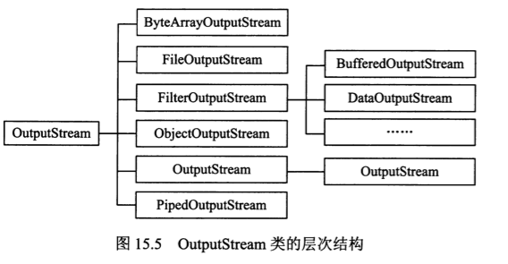

二进制文件只能使用字节流进行复制

字符输入流（Reader 及其子类）

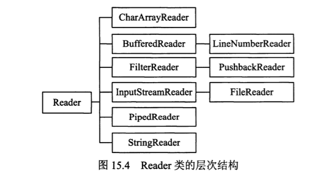

字符输出流（Writer 及其子类）

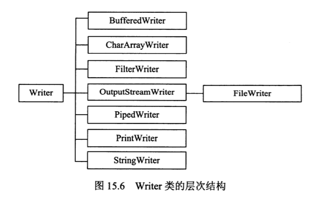

I/O流过滤器

```java
// 从文件中读取基本类型
FileInputStream fin = new FileInputStream("path/somedata.txt"); // 相对路径以用户工作目录开始。
DataInputStream din = new DataInputStream(fin); 
double x = din.readDouble();
// 从文件中读取基本类型，带缓冲机制
DataInputStream din = new DataInputStream(new BufferedInputStream(new FileInputStream("file.txt")));
// 预读字节
PushbackInputStream pbin = new PushbackInputStream(new BufferedInputStream(new FileInputStream("file.txt")));
pbin.read(); // 读字节
pbin.unread(); // 将值推回流中
// 从压缩文件中读基本类型
ZipInputStream zin = new ZipInputStream(new FileInputStream("file.zip"));
DataInputStream din = new DataInputStream(zin);
```

### 文本的IO

InputStreamReader 是从字节到字符的转化桥梁。StreamDecoder完成从字节到字符的解码。

OutputStreamWriter 完成从字符到字节的编码，由 StreamEncoder完成编码过程。

Java 内部使用 UTF-16 编码方式。

```java
// 文本输入
Reader in = new InputStreamReader(System.in); // 将字节输入流转成字符输入流，使用主机系统默认的字符编码方式
Reader in = new InputStreamReader(new FileInputStream("file.txt"), StandardCharsets.UTF_8);
String content = new String(Files.readAllBytes(path), charset); // 读入小文本文件
List<String> lines = Files.readAllLines(path, charset); // 读入文件的行
Stream<String> lines = Files.lines(path, charset); // 读入文件的行，惰性处理成流对象
BufferedReader in = new BufferedReader(new InputStreamReader(inputStream, StandardCharsets.UTF_8));
String line = in.readLine();
Scanner in = new Scanner(new FileInputStream("file.txt"), StandardCharsets.UTF_8);
// 文本输出
PrintWriter out = new PrintWriter("file.txt", "UTF-8"); // 等价于
PrintWriter out = new PrintWriter(new FileOutputStream("file.txt"), "UTF-8");
out.print("String");
out.print('A');
out.println(123);
PrintWriter out = new PrintWriter(new OutputStreamWriter(new FileOutputStream("data.txt"), "UTF-8"), true); // true 表示打开自动冲刷机制。
```

打印写出器总是带缓冲区的，默认情况下自动冲刷机制是禁用的。

字符编码

```java
// 平台使用的编码方式
Charset charset = Charset.defaultCharset();
// 所有可用的 Charset 实例
Map<String, Charset> charsets = Charset.availableCharsets();
// 获得编码方式
StandardCharsets.UTF_8;
Charset utf_8 = Charset.forName("UTF-8");
```

字符IO流

```java
// 读数据
// 1. 创建输入流对象
FileReader fr = new FileReader("a.txt");
// 2. 调用数据流对象的读数据方法
int ch1 = fr.read();
int ch2 = fr.read();//当ch2 = -1时，表示没有数据可读
int[] chs = new char[1024];
int len = fr.read(chs);//一次读取一个字符数组的数据，返回实际读取的字符数。当len = -1时，表示读到文件结尾。
// 3. 关闭资源
fr.close();

// 写数据
// 1. 创建输出流对象
FileWriter fw = new FileWriter("d:\\a.txt");
// 2. 调用输出流对象的写数据方法
fw.writer("IO流你好");
fw.flush();//将缓冲区的内容写入文件。
// 3. 释放资源
fw.close();

// 常见的输出流问题
// 换行(windows是"\r\n", mac是"\r", linux是"\n")
fw.write("\n");
// 追加写入
FileWriter fw = new FileWriter("a.txt", true);
```

字符缓冲流

```java
// 字符输入缓存流
BufferedReader br = new BufferedReader(new FileReader("a.txt"));
String line = br.readLine(); // 一次读取一行数据，当不读取换行符
// 字符输出缓存流。数据流向：字符数据 --> BufferedWriter --> OutputStreamWriter --> OutputStream --> 文件
BufferedWriter writer = new BufferedWriter(new FileWriter(aFile)); // 其他操作与FileWriter相同
writer.newLine(); // 写一个换行符，这个换行符由系统决定
```

### 二进制数据的 IO

随机访问文件

可以访问文件的任意位置，seek 方法将文件指针设置到文件中的任意字节位置，指示下一个将被读入或写出的字节。

```java
RandomAccessFile in = new RandomAccessFile("file.txt", "r"); // 读入访问
RandomAccessFile inOut = new RandomAccessFile("file.txt", "rw"); // 读写访问
in.seek(3 * RECORD_SIZE); // 文件指针指向第4条记录
long pointer = in.getFilePointer(); // 获得文件指针的位置
in.length(); // 文件总字节数
```

ZIP 文档

```java
// 读入zip文件的内容
ZipInputStream zin = new ZipInputStream(new FileInputStream(zipname));
ZipEntry entry;
while((entry = zin.getNextEntry()) != null){
    InpustStream in = zin.getInputStream(entry);
    // read the contents of in
    zin.closeEntry();
}
zin.close();

// 写入到zip文件
ZipOutputStream zout = new ZipOutputStream(new FileOutputStream("test.zip"));
{ // 对所有要写入到test.zip的文件，做如下处理
    ZipEntry ze = new ZipEntry(filename);
    zout.putNextEntry(ze);
    // send data to zout
    zout.closeEntry();
}
zout.close();
```

### 对象IO与序列化

```java
// 将任意对象写出到输出流
ObjectOutputStream out = new ObjectOutputStream(new FileOutputStream("employee.dat"));
Employee harry = ...;
out.writeObject(harry);
// 将对象读回
ObjectInputStream in = new ObjectInputStream(new FileInputStream("employee.dat"));
Employee harry = (Employee) in.readObject(); // 按写入时的顺序读回。Employee 类必须实现 Serializable 接口
```

序列化

序列化的目的：将对象当前的状态存储下来，可以放在硬盘，或者通过网络传输。

序列化的类必须实现 Serializable 接口。

每个对象都是用一个序列号(serial number)保存的。对象序列化是以特殊的文件格式存储对象数据。

序列化机制只使用了 SHA 码的前8个字节作为类的指纹。

当对象被序列化时，该对象引用的实例变量也会被序列化，且这些操作是自动进行的。

某些域不需要被序列化时，需要标记成 transient，在序列化时，这些域会被跳过。

静态变量不会被序列化，它是属于类而不是对象的。

```java
public class MyClass implements Serializable{
    private String myString;
    private transient Point2D.Double point; // 本域不会被序列化
    ...
}

//序列化（java.io.*)
//FileOutputStream把字节写入文件
FileOutputStream fileStream = new FileOutputStream("MyGame.ser");
//ObjectOutputStream把对象转换成可用写入串流的数据
ObjectOutputStream os = new ObjectOutputStream(fileStream);
os.writeObject(characterOne);//将对象序列化，并写入MyGame.ser这个文件
os.writeObject(characterTwo);
os.close();//关闭所有关联的输出串流
//声明类可用被序列化
public class Box implements Serializable{
    transient String currentID;//如果希望currentID不被序列化，就标记为transient
}
//解序列化
FileInputStream fileStream = new FileInputStream("MyGame.ser");
ObjectInputStream os = new ObjectInputStream(fileStream);
Object one = os.readObject();
Object two = os.readObject();//读出次序与写入顺序相同
GameCharacter elf = (GameCharacter) one;//转换对象
os.close();//关闭ObjectInputStream, FileInputStream

// 改写默认的序列化行为，需要定义如下的方法。只需要对自己类的域负责，不需要处理超类的。
private void readObject(ObjectInputStream in) throws IOException, ClassNotFoundException {
    in.defaultReadObject();
    // 读出对象属性
}
private void writeObject(ObjectOutputStream out) throws IOException {
    out.defaultWriteObject(); // 写出对象描述符和可序列化的域
    // 输出对象属性
}
```

如果类需要定义自己的保存和恢复对象数据的方法，需要实现 Externalizable 接口。Externalizable 接口里的方法对包括超类数据在内的整个对象的存储和恢复负责。

即使构造器是私有的，序列化机制也可以创建新的对象。可能会需要 readResolve 方法。

版本管理

```sh
# 获得某个类的指纹
serialver Employee
```

设置一个 `public static final long serialVersionUID = xxxxxxx;` 静态数据成员，则这个类直接使用这个值作为指纹。此时序列化系统可以读入这个类的对象的不同版本。

可以使用序列化来克隆对象，将对象序列化再读出时，会创建这个对象的深拷贝。但是会比直接构造对象慢的多。

Java的序列化算法

1. 将对象实例相关的类元数据输出。
2. 递归地输出类的超类描述直到不再有超类。
3. 类元数据完了以后，开始从最顶层的超类开始输出对象实例的实际数据值。
4. 从上至下递归输出实例的数据

### 操作文件(重看)

Path 和 Files 类封装了在用户机器上处理文件系统所需的所有功能。

Path

Path 表示的是一个目录名序列

```java
// 创建路径
Path absolute = Paths.get("/home", "harry"); // 路径是 /home/harry
Path relative = Paths.get("myprog", "conf", "user.properties"); // 路径是 myprog/conf/user.properties
// resolve 连接路径
Path workRelative = Paths.get("work");
Path workPath = basePath.resolve(workRelative); // 路径是 basePath/workRelative。如果workRelative是绝对路径，则最终路径是workRelative。
Path workPath = basePath.resolve("work"); // 效果同上
Path tempPath = workPath.resolveSibling("temp"); // workPath=/opt/myapp/work, tempPath=/opt/myapp/temp
// relativize 获得相对路径
Path p1 = Paths.get("/home/cay");
Path p2 = Paths.get("/home/fred/myprog");
Path result = p1.relativize(p2); // result=../fred/myprog
// normalize 移除冗余的.和..
Path p = Paths.get("/home/cay../fred/./myprog");
Path normalize = p.normalize(); // normalize=/home/fred/myprog
// toAbsolutePath 返回给定路径的绝对路径
Path absolutePath = p.toAbsolutePath();
// 断开路径
Path p = Paths.get("/home", "fred", "myprog.properties");
Path parent = p.getParent(); // parent = /home/fred
Path file = p.getFileName(); // file = myprog.properties
Path root = p.getRoot(); // root = /
// 构建Scanner对象
Scanner in = new Scanner(p);
```

Files 类

```java
// 读取文件内容
byte[] bytes = Files.readAllBytes(path);
String content = new String(bytes, charset); // 读入到字符串
List<String> lines = Files.readAllLines(path, charset); // 读入行到列表中
// 写入文件
Files.write(path, content.getBytes(charset), StandardOpenOption.APPEND); // 写入字符串
Files.write(path, lines); // 写入集合
// 读写大文件
InpustStream in = Files.newInputStream(path);
OutputStream out = Files.newOutputStream(path);
Reader in = Files.newBufferedReader(path, charset);
Writer out = Files.newBufferedWriter(path, charset);
// 创建文件和目录
Files.createDirectory(path); // 创建目录，除最后一个部件外，其他部分都必须是已存在的
Files.createDirectories(path); // 可以创建路径中的中间目录
Files.createFile(path); // 创建空文件。文件已存在会抛异常
// 复制文件
Files.copy(fromPath, toPath);
Files.copy(fromPath, toPath, StandardCopyOption.REPLACE_EXISTING, StandardCopyOption.COPY_ATTRIBUTES); // 文件存在则覆盖，拷贝所有文件属性。
// 移动文件
Files.move(fromPath, toPath);
Files.move(fromPath, toPath, StandardCopyOption.ATOMIC_MOVE); // 原子性的移动文件，要么成功，要么不移动。
// 删除文件
Files.delete(path); // 不存在会抛异常
boolean deleted = Files.deleteIfExists(path);
// 获取文件信息
long fileSize = Files.size(path); // 文件字节数
BasicFileAttributes attributes = Files.readAttributes(path, BasicFileAttributes.class);
PosixFileAttributes attributes = Files.readAttributes(path, PosixFileAttributes.class);
// 访问目录中的项
try(Stream<Path> entries = Files.list(pathToDirectory)){ ... } // 不会处理子目录
try(Stream<Path> entries = Files.walk(pathToRoot)){ ... } // 处理子目录，以深度优先顺序访问
// 复制目录
Files.walk(source).forEach(p -> {
    try {
        Path q = target.resolve(source.relativize(p));
        if(Files.isDirectory(p))
            Files.createDirectory(q);
        else
            Files.copy(p, q);
    } catch (IOException e){
        throw new uncheckedIOException(e);
    }
})
// 遍历目录，可以使用glob模式来过滤文件
try(DirectoryStream<Path> entries = Files.newDirectoryStream(dir, "*.java")){
    for(Path entry : entries)
        // process entry
}
walkFileTree
```

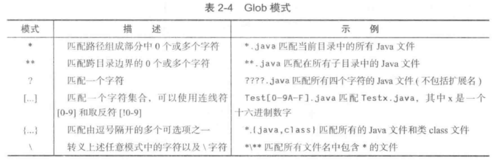

ZIP 文件系统

```java
// 建立一个文件系统，包含ZIP文档中的所有文件。
FileSystem fs = FileSystem.newFileSystem(Paths.get(zipname), null);
// 从zip文档中复制文件
Files.copy(fs.getPath(sourceName), targetPath);
// 遍历文件树
Files.walkFileTree(fs.getPath("/"), new SimpleFileVisitor<Path>(){
    public FileVisitResult visitFile(Path file, BasicFileAttributes attr) throws IOException{
        System.out.println(file);
        return FileVisitResult.CONTINUE;
    }
});
```

File 类

File 对象指向一个路径（不创建文件）

```java
// 创建代表现存盘文件的File对象
File f = new File("MyCode.txt");
f.exists(); // 判断文件是否存在
f.createNewFile(); // 创建文件
// 创建新目录
File dir = new File("Chapter7");
dir.mkdir();
// 列出目录下的内容
if(dir.isDirectory()){
    String[] dirContents = dir.list();
    for(int i = 0; i < dirContents.length; i++){
        System.out.println(dirContents[i]);
    }
}
// 取得文件或目录的绝对路径
System.out.println(dir.getAbsolutePath());
// 删除文件或目录
boolean isDeleted = f.delete();
```

### 内存映射文件

利用虚拟内存，将一个文件或文件的一部分映射到内存中。这个文件就可以当作是内存数组一样地访问。

```java
// 获得通道，通道是磁盘文件的一种抽象
FileChannel channel = FileChannel.open(path, options);
// 将文件的一个区域映射到内存中
MappedByteBuffer buffer = channel.map(FileChannel.MapMode.READ_ONLY, 0, (int) channel.size());
// 遍历
while(buffer.hasRemaining()){
    byte b = buffer.get();
}
for(int i = 0; i < buffer.limit(); i++){ // limit() 返回缓冲区的界限位置
    byte b = buffer.get(i);
}
// Java默认使用大端方式，使用小端存储数据
buffer.order(ByteOrder.LITTLE_ENDIAN);
// 查询字节顺序
ByteOrder b = buffer.order();
```

缓冲区数据结构

缓冲区是由具有相同类型的数值构成的数组。Buffer 类是一个抽象类，有众多的具体子类，最常用的是 ByteBuffer 和 CharBuffer。

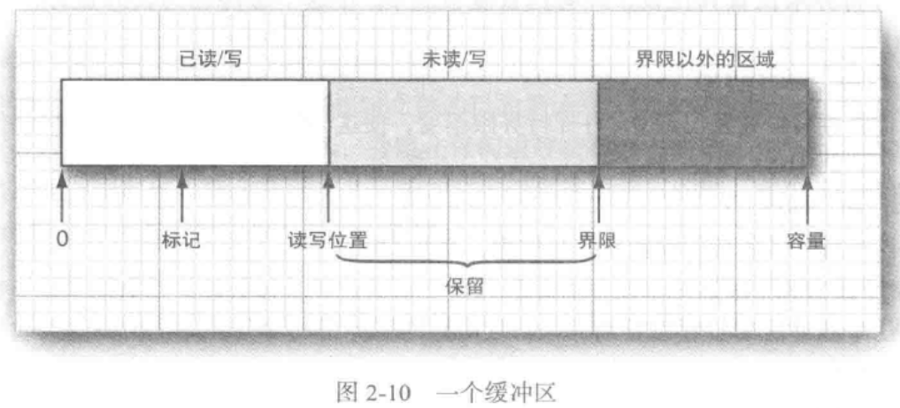

```java
ByteBuffer buffer = ByteBuffer.allocate(RECORD_SIZE); // 获取缓冲区
channel.read(buffer); // 填充数据到缓冲区
channel.position(newpos);
buffer.flip(); // 将界限设置到缓冲区的当前位置，并将位置复位到0
channel.write(buffer); // 读入缓冲区的数据到文件

buffer.clear(); // 位置复位到0，界限设置到容量。为重新读入内容做准备
buffer.rewind(); // 位置复位到0，界限保持不变。为读入相同内容做准备
buffer.mark(); // 将标记设置到读写位置
buffer.reset(); // 将读写位置设置到标记
buffer.remaining(); // 返回界限-位置的值
buffer.position(); // 返回缓冲区的位置
```

文件加锁机制

```java
// 锁定文件
FileLock lock = channel.lock(); // 阻塞直至获得锁
FileLock lock = channel.tryLock(); // 立即返回，要么返回锁，要么返回null
// 锁定文件的一部分
FileLock lock(long start, long size, boolean shared);
FileLock tryLock(long start, long size, boolean shared);
// 释放锁
lock.close();
```

### NIO

java.nio全称java non-blocking IO（实际上是 new io），是指JDK 1.4 及以上版本里提供的新api（New IO），为所有的原始类型（boolean类型除外）提供缓存支持的数据容器，使用它可以提供非阻塞式的高伸缩性网络。

数据总是从通道被读取到缓冲中或者从缓冲写入到通道中。

关键类： Channel 、 Selector 、 Buffer

通道Channel

NIO的通道类似于流，但有些区别如下：

1. 通道可以同时进行读写，而流只能读或者只能写
2. 通道可以实现异步读写数据
3. 通道可以从缓冲读数据，也可以写数据到缓冲。

Selector

一个组件，可以检测多个NIO channel，看看读或者写事件是否就绪。

多个Channel以事件的方式可以注册到同一个Selector，从而使用一个线程处理多个请求成为可能。

Selector 可以轮询 Channel 的状态，Buffer 相当于 Channel 里的一个位置。

```java
public void selector() throws IOException {
    ByteBuffer buffer = ByteBuffer.allocate(1024);
    Selector selector = Selector.open();
    ServerSocketChannel ssc = ServerSocketChannel.open();
    ssc.configureBlocking(false); // 非阻塞方式
    ssc.socket().bind(new InetSocketAddress(8080));
    ssc.register(selector, SelectionKey.OP_ACCEPT); // 注册监听的时间
    while(true) {
        Set selectedKeys = selector.selectedKeys(); // 取得所有key集合
        Iterator it = selectedKeys.iterator();
        while(it.hashNext()){
            SelectionKey key = (SelectionKey) it.next();
            if(...){
                ServerSocketChannel ssChannel = (ServerSocketChannel) key.channel();
                SocketChannel sc = ssChannel.accept(); // 接受请求
                sc.configureBlocking(false);
                sc.register(selector, SelectionKey.OP_READ);
                it.remove()
            } else if(...){
                SocketChannel sc = (SocketChannel)key.channel();
                while(true){
                    buffer.clear();
                    int n = sc.read(buffer); // 读数据
                    if(n <= 0){
                        break;
                    }
                    buffer.flip();
                }
                it.remove();
            }
        }
    }

}

// 通过Native代码操作与底层存储空间关联的缓冲区
ByteBuffer.allocateDirector(size);
```

Buffer中的索引

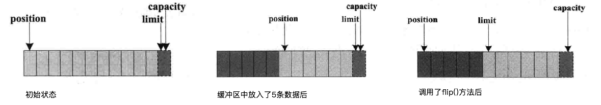

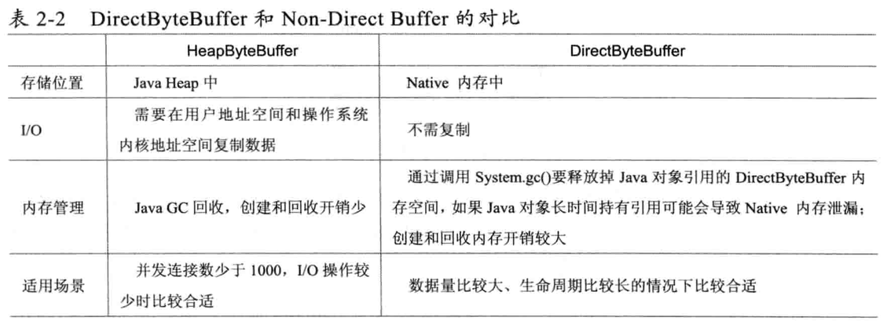

NIO的数据访问方式

FileChannel.transferXXX 减少数据从内核到用户空间的复制。

FileChannel.map 将文件按照一定大小映射为内存区域。

```java
public static void map(String[] args) {
    int BUFFER_SIZE = 1024;
    String filename = "test.db";
    long fileLength = new File(filename).length();
    int bufferCount = 1 + (int)(fileLength / BUFFER_SIZE);
    MappedByteBuffer[] buffers = new MappedByteBuffer[bufferCount];
    long remaining = fileLength;
    for(int i = 0; i < bufferCount; i++){
        RandomAccessFile file;
        try {
            file = new RandomAccessFile(filename, "r");
            buffers[i] = file.getChannerl().map(FileChannel.MapMode.READ_ONLY, i * BUFFER_SIZE, (int)Math.min(remaining, BUFFER_SIZE));
        } catch (Exception e) {
            e.printStackTrace();
        }
        remaining -= BUFFER_SIZE;
    }
}
```

## 正则表达式

正则表达式(regular expression)用于指定字符串的模式，用于定位匹配某种特定模式的字符串。

语法

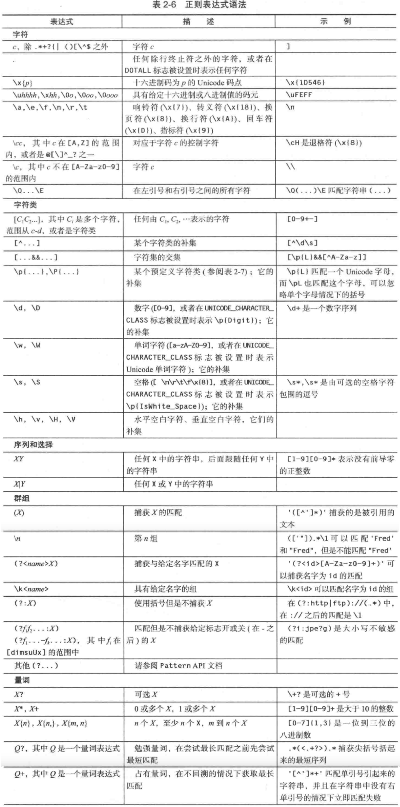

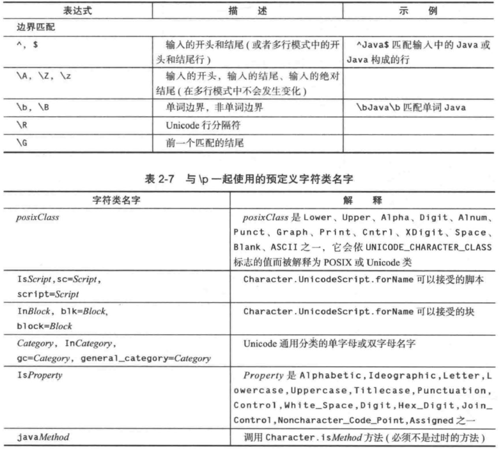

简略规则

- 字符类：匹配字符集中的某一个 `[A-Za-z]`；补集 `[^0-9]`；预定义的字符集，数字 `\d`，Unicode字母 `\p{L}`
- `.` 匹配任意字符
- `\` 转义字符
- `^` 匹配一行的开头，`$` 匹配一行的结尾
- 如果 XY 是正则表达式，则表示，任何X的匹配后面跟着Y的匹配；X|Y表示，任何X或Y的匹配
- 量词，`X+` 一个或多个X的匹配；`X*` 0个或多个；`X?` 0个或1个。
- 量词要匹配能够使整个匹配成功的最大可能的重复次数。后缀`?`表示使用吝啬匹配，即匹配最小的重复次数；后缀`+`表示贪婪匹配，即即使让整个匹配失败，也要匹配最大的重复次数。
- 使用群组 `()` 定义子表达式，`([+-]?)([0-9]+)`。可以询问模式匹配器，让其返回每个组的匹配；或者使用 `\n` (n是群组号，从1开始)来引用某个群组。

标志

- Pattern.CASE_INSENSITIVE(r) ：匹配字符时忽略字母的大小写，默认情况下，大小写不敏感的匹配假定只有US-ASCII字符集中的字符才能进行。
- Pattern.UNICODE_CASE(u) ：与 CASE_INSENSITIVE 组合使用时，用 Unicode 字母的大小写来匹配。
- Pattern.UNICODE_CHARACTER_CLASS(U) ：选择 Unicode 字符类代替 POSIX，其中蕴含了 UNICODE_CASE。
- Pattern.MULTILINE(m) ：在多行模式下，表达式^和$分别匹配一行的开始和结束，而不是整个输入的开头和结尾。
- Pattern.UNIX_LINES(d) ：在多行模式中匹配^和$时，只有 `\n` 识别成行终止符。
- Pattern.DOTALL(s) ：在dotall模式下，`.` 匹配所有字符，包括行终止符。默认情况下，`.` 不匹配行终止符。
- Pattern.LITERAL ：该模式将被逐字地采纳，必须精确匹配，因字母大小写造成的差异除外。
- Pattern.CANON_EQ ：考虑 Unicode 字符规范的等价性。例如，`\u030A` 就会匹配字符串 `?`。
- Pattern.COMMENTS(x) 在这种模式下，空格符将被忽略掉，并且以#开始直到行末的注释也会被忽略掉。通过嵌入的标记表达式也可以开启Unix的航模式

群组

群组0是整个输入，第一个实际群组的索引是1。嵌套群组是按前括号排序的。


```java
// 测试 input 是否和 patternString 匹配
Pattern pattern = Pattern.compile(patternString);
Matcher matcher = pattern.matcher(input);
if(matcher.matches()){ // 是否有匹配
}
// 设置标志
Pattern pattern = Pattern.compile(expression, Pattern.CASE_INSENSITIVE + Pattern.UNICODE_CASE);
String regex = "(?iU:expression)";
// 在集合或流中匹配元素(将模式转换为谓词)
Stream<String> strings = ...;
Stream<String> result = strings.filter(pattern.asPredicate());
// 群组。Matcher 对象
int start(int groupIndex) // 群组的开始索引
int end(int groupIndex) // 群组的结束索引
String group(int groupIndex) // 抽取匹配的字符串
while(matcher.find()) { // 逐个查找匹配
    int start = matcher.start();
    int end = matcher.end();
    String match = matcher.group();
}
// 替换
matcher.replaceAll("#"); // 将所有匹配的字符串替换成#
matcher.replaceAll("\$1"); // 将匹配的字符串替换成第1个群组的内容
matcher.replaceAll(Matcher.quoteReplacement(str)); // 不将\$解释成群组的替换符
matcher.replaceFirst(""); // 只替换第一次出现的匹配字符串
// 分割
Pattern pattern = Pattern.compile("...");
String[] tokens = pattern.split(input); // 将input字符串按照pattern切分
Stream<String> tokens = pattern.splitAsStream(input); // 同上，惰性获取
String[] tokens = input.split("\\s*,\\s*"); // 使用String.split方法
```

## 网络编程

### 连接到服务器

telnet 连接到服务器

```sh
# 启动telnet
telnet
# 连接服务
telnet ip port
```

java连接到服务器

TCP协议

```java
// 入门程序
public class SocketTest{
    public static void main(String[] args) {
        try(Socket s = new Socket("time-a.nist.gov", 13); // 目的地址、端口
            Scanner in = new Scanner(s.getInputStream(), "UTF-8")){
            while(in.hasNextLine()){ // 读入服务器发来的数据
                String line = in.nextLine();
                System.out.println(line);
            }
        }
    }
}

// 套接字读请求的超时时间
Socket s = new Socket(...);
s.setSoTimeout(10000); // 单位：毫秒
// 当没有读完数据就超时了
try {
    InpustStream in = s.getInputStream();
    // reading...
} catch(InterruptedIOException e){
    // 处理超时操作
}
// 给连接设定超时时间
Socket s = new Socket();
s.connect(new InetSocketAddress(host, port), timeout);

// 连接到服务器
Socket s = new Socket("127.0.0.1", 5000);//IP+端口
InputStreamReader stream = new InputStreamReader(s.getInputStream());
BufferedReader reader = new BufferedReader(stream);
String message = reader.readline();
reader.close();
```

因特网地址

需要在主机名和因特网地址之间进行转换，就需要使用 InetAddress 类

```java
// address对象封装了time-a.nist.gov的ip地址
InetAddress address = InetAddress.getByName("time-a.nist.gov");
InetAddress[] addresses = InetAddress.getAllByName("google.com"); // 一个主机名可能对应多个ip地址
// 访问ip地址
byte[] addressBytes = address.getAddress();
// 获得本地主机的地址
InetAddress address = InetAddress.getLocalHost();
```

UDP协议发送数据

```java
DatagramSocket ds = new DatagramSocket();
String s = "hello, UDP!"
byte[] bys = s.getBytes();
int length = bys.length;
InetAddress address = InetAddress.getByName("rainyrun.top"); // 目的地址
int port = 8888; // 目的端口
// 打包，提供必要信息
DatagramPackage dp = new DatagramPacket(bys, length, address, port);
// 发送数据
ds.send(dp);
// 释放资源
ds.close();
```

UDP协议接受数据

```java
// 创建接收端Scoket对象
DatagramSocket ds = new DatagramSocket(8888);
//接收数据
byte[] bys = new byte[1024];
DatagramPacket dp = new DatagramPacket(bys, bys.length);
ds.receive(dp);
//解析数据
InetAddress address = dp.getAddress();
byte[] data = dp.getData();
int length = dp.getLength();
//输出数据
syso
//释放资源
dp.close();
```

### 实现服务器

入门程序

```java
try(
    ServerSocket s = new ServerSocket(8189); // 建立一个负责监控端口8189的服务器
    Socket incoming = s.accept(); // 不停等待，直到有客户端连接到这个端口
    InpustStream inStream = incoming.getInputStream(); // 得到输入流，收到客户端发出的信息
    OutputStream outStream = incoming.getOutputStream(); // 得到输出流，发送信息给客户端
    Scanner in = new Scanner(inStream, "UTF-8");
    PrintWriter out = new PrintWriter(new OutputStreamWriter(outStream, "UTF-8"), true); // 自动冲刷
    ){
    // 回显客户端输入的数据，输入BYE时关闭链接
    boolean done = false;
    while (!done && in.hasNextLine()) {
        String line = in.nextLine();
        out.println("Echo: " + line);
        if (line.trim().equals("BYE"))
            done = true;
    }
    incoming.close(); // 关闭链接
}
// 备注：使用 out.write("...") 客户端无法接收到信息，原因是 SocketOutputStream 及其父类没有覆写 flush 方法。而 newLine 会自动调用flush方法。
```

当创建Socket对象时，操作系统将会为InputStream和OutputStream分配一定大小的缓存区。写入端将数据写到OutputStream对应的SendQ队列中，当队列填满时，数据被转移到另一端的InputStream的RecvQ队列中，如果RecvQ已经满了，那么OutputStream的write方法将会阻塞。

为多个客户端服务

```java
try(ServerSocket s = new ServerSocket(8189)){
    int i = 1; // 线程序号
    while(true){
        Socket incoming = s.accept(); // 不停等待，直到有客户端连接到这个端口
        System.out.println("Spawning " + i);
        // 创建线程，为客户端服务
        Runnable r = new ThreadEchoHandler(incoming);
        Thread t = new Thread(r);
        t.start();
        i++;
    }
}

class ThreadEchoHandler implements Runnable {
    private Socket incoming;
    public ThreadEchoHandler(Socket incoming){
        this.incoming = incoming;
    }
    public void run(){
        try(
            InputStream inStream = incoming.getInputStream(); // 得到输入流，收到客户端发出的信息
            OutputStream outStream = incoming.getOutputStream(); // 得到输出流，发送信息给客户端
            ){
            Scanner in = new Scanner(inStream, "UTF-8");
            PrintWriter out = new PrintWriter(new OutputStreamWriter(outStream, "UTF-8"), true); // 自动冲刷
            // 回显客户端输入的数据，输入BYE时关闭链接
            boolean done = false;
            while (!done && in.hasNextLine()) {
                String line = in.nextLine();
                out.println("Echo: " + line);
                if (line.trim().equals("BYE"))
                    done = true;
            }
        } catch(Exception e){
            e.printStackTrace();
        }
    }
}
```

半关闭

```java
socket.shutdownOutput(); // 关闭输出流
socket.shutdownInput(); // 关闭输入流
```

### 可中断套接字

当连接套接字或者通过套接字读写数据时，当前线程会被阻塞直到操作成功或超时为止。

使用 SocketChannel 类来中断套接字操作

```java
SocketChannel channel = SocketChannel.open(new InetSocketAddress(host, port));
Scanner in = new Scanner(channel, "UTF-8");
// 将 channel 转换成输出流
OutputStream outStream = Channels.newOutputStream(channel);
```

### 获取 Web 数据

```java
// 获取该资源的内容
URL url = new URL(urlString);
InpustStream inStream = url.openStream();
// 
```

URI 语法

`[scheme:]schemeSpecificPart[#fragment]`

包含 `scheme:` 部分的 URI 称为绝对 URI。否则，为相对 URI。绝对 URI 的 schemeSpecificPart 不是以 `/` 开头，就称它为不透明的。

分层 URI 的 schemeSpecificPart 具有以下结构

`[//authority][path][?query]`

基于服务器的 URI，authority 部分具有以下形式

`[user-info@]host[:port]`

URI 类的作用

- 解析标识符并将它分解成各种不同的组成部分。
- 处理绝对标识符和相对标识符。如，解析相对URL、相对化

```java
relative = base.relativize(combined);
combined = base.resolve(relative);
```

URLConnection 类

```java
// 从web服务器读取数据
// 1. 获取 URLConnection 对象
URLConnection connection = url.openConnection(); // url 是 URL 对象
// 2. 设置请求属性
connection.setDoOutput(true); // 表示需要向服务器写数据
    // 访问一个有密码保护的Web页面时，需要做的准备
    String input = username + ":" + password;
    Base64.Encoder encoder = Base64.getEncoder();
    String encoding = encoder.encodeToString(input.getBytes(StandardCharsets.UTF_8));
connection.setRequestProperty("Authorization", "Basic" + encoding);
// 3. 连接远程资源
connection.connect();
// 4. 查询头信息
String key = connection.getHeaderFieldKey(n); // 获得响应头的第n个键。n从1开始
String value = connection.getHeaderField(n); // 获得响应头的第n个值。
Map<String,List<String>> headerFields = connection.getHeaderFields(); // Map对象封装了响应头字段
// 5. 访问资源数据
getInputStream();
```

客户端提交表单数据

提交方式

1. GET 方式，将参数写在url后面
2. POST 方式，将参数以键值对的形式写入到从 URLConnection 获得的输出流中。

URL 编码规则

- 保留字符 A-Z, a-z, 0-9, . - ~ _ 。
- 使用 + 字符替换所有的空格。
- 将其他所有字符编码为 UTF-8，并将每个字节都编码为%XX，XX为2位十六进制数。

```java
// post方式发送数据
URL url = new URL("http://host/path");
URLConnection connection = url.openConnection();
connection.setDoOutput(true); // 建立一个用于输出的连接
PrintWriter out = new PrintWriter(connection.getOutputStream(), "UTF-8"); // 获得输出流，并包装成打印字符流
out.print(name1 + "=" + URLEncoder.encode(value1, "UTF-8")); // 向服务器发送数据
out.close(); // 关闭输出流
```

手动重定向

```java
// 配置全局的cookie处理器
CookieHandler.setDefault(new CookieManager(null, CookiePolicy.ACCEPT_ALL));
// 关闭自动重定向
connection.setInstanceFollowRedirects(false);
// 获取响应码
int responseCode = connection.getResponseCode();
// 手动重定向
String location = connection.getHeaderField("Location");
URL base = connection.getURL();
connection.disconnect();
connection = (HttpURLConnection) new URL(base, location).openConnection();
```

### 发送邮件

SMTP(简单邮件传输协议)用于描述E-mail消息的格式。

```java
// 1. 打开一个到达主机的套接字
Socket s = new Socket("mail.yourserver.com", 25); // SMTP服务的端口号
PrintWriter out = new PrintWriter(s.getOutputStream(), "UTF-8");
// 发送以下信息
HELO sending host
MAIL FROM: sender e-mail address
RCPT TO: recipient e-mail address
DATA
Subject: Subject

mail message ...
.
QUIT
```

JavaMail

属性文件

```sh
mail.transport.protocol=smtps # 使用的协议（JavaMail规范要求）
mail.smtps.auth=true # 需要请求认证
mail.smtps.host=smtp.gmail.com # 发件人的邮箱的 SMTP 服务器地址
mail.smtps.user=...
# 安全认证可能需要的属性
mail.smtp.port=... # 端口
mail.smtp.socketFactory.class=javax.net.ssl.SSLSocketFactory
mail.smtp.socketFactory.fallback=false
mail.smtp.socketFactory.port=...
```

JavaMail 发送邮件

```java
public class MailUtils {
    public static String fromEmailAccount = "xxx@126.com"; // 发件人的邮箱
    public static String fromEmailPassword = "xxx"; // 发件人的密码(某些邮箱服务器为了增加邮箱本身密码的安全性，给 SMTP 客户端设置了“授权码”，此时邮箱密码需要使用“授权码”。
    public static String fromEmailSMTPHost = "smtp.126.com"; // 发件人邮箱的 SMTP 服务器地址，一般格式为: smtp.xxx.com
    public static String toEMailAccount = "xxx@sina.com"; // 收件人邮箱

    public static void sendMail(String email, String emailMsg)
            throws AddressException, MessagingException, UnsupportedEncodingException {
        toEMailAccount = email;
        // 读入属性文件
        Properties props = new Properties();
        props.load(Files.newInputStream(Paths.get("mail/mail.properties")));
        // 根据配置创建会话对象, 用于和邮件服务器交互
        Session session = Session.getInstance(props);
        // 调试bug
        // mailSession.setDebug(true);
        // 1. 创建一封邮件
        MimeMessage message = new MimeMessage(session);
        // 2. From: 发件人
        message.setFrom(new InternetAddress(fromEmailAccount, "admin", "UTF-8"));
        // 3. To: 收件人（可以增加多个收件人、抄送、密送）
        message.setRecipient(MimeMessage.RecipientType.TO, new InternetAddress(toEMailAccount, "亲爱的用户", "UTF-8"));
        // To: 增加收件人（可选）
//      message.addRecipient(MimeMessage.RecipientType.TO, new InternetAddress("dd@receive.com", "USER_DD", "UTF-8"));
        // Cc: 抄送（可选）
//      message.setRecipient(MimeMessage.RecipientType.CC, new InternetAddress("ee@receive.com", "USER_EE", "UTF-8"));
        // Bcc: 密送（可选）
//      message.setRecipient(MimeMessage.RecipientType.BCC, new InternetAddress("ff@receive.com", "USER_FF", "UTF-8"));
        // 4. Subject: 邮件主题
        message.setSubject("激活邮件", "UTF-8");
        // 5. Content: 邮件正文（可以使用html标签）
        String content = "<h1>来自DemoShoppingMall01的激活邮件!请点击以下链接激活账户!</h1>";
        message.setContent(content, "text/html;charset=UTF-8");
        // 6. 设置发件时间
        // message.setSentDate(new Date());
        // 7. 保存设置
        // message.saveChanges();
        // 根据 Session 获取邮件传输对象
        Transport transport = session.getTransport();
        transport.connect(fromEmailAccount, fromEmailPassword);
        transport.sendMessage(message, message.getAllRecipients());
        // 关闭连接
        transport.close();
    }
}
```

### 远程调用

远程代理：远程对象的本地代表。

远程对象：活在不同JVM堆中的对象。或，在不同的地址空间运行的远程对象

本地代表：可以由本地方法调用的对象，其行为会转发到远程对象中。

RMI介绍

- 客户对象
- 客户辅助对象(stub)
    1. 有远程对象的方法，看起来像远程对象。
    2. 会联系服务器，传送方法调用信息，等待服务器返回
    3. 将得到的信息解包，将返回值交给客户对象
- 服务辅助对象(skeleton)
    1. 从客户辅助对象中接收请求（通过Socket连接）
    2. 将调用信息解包，然后调用真正服务对象上的真正方法。
    3. 将返回值打包，发送到客户辅助对象
- 服务对象

创建RMI远程服务的步骤

1. 创建远程接口：定义客户远程调用的方法
    1. Remote是个标记性接口，你需要继承它并创建自己的接口来实现远程调用的方法
    2. 声明所有的方法都会抛出RemoteException
    3. 确定参数和返回值都是primitive主数据类型或是可序列化的(Serializable)

```java
public interface MyRemote extends Remote{
	public String sayHello() throws RemoteException;
}
```

2. 实现远程接口
    1. 实现Remote这个接口
    2. 继承UnicastRemoteObject(java.rmi.server)
    3. 编写声明RemoteException的无参构造函数，因为UnicastRemoteObject的构造函数会抛出RemoteException
    4. 向RMI registry注册服务
	
```java
// 服务端的代码
public class MyRemoteImpl extends UnicastRemoteObject implements MyRemote {
	public String sayHello(){
		return "Server says, 'hey'";
    }
    // 3
	public MyRemoteImpl() throws RemoteException{}

    public static void main(String[] args){
    	try{
            // 4
    		MyRemote service = new MyRemoteImpl();
    		Naming.rebind("Remote Hello", service);//帮服务命名（客户端会靠名字查询registry）并向RMI registry注册
    	}catch(Exception ex){...}
    }
}
```

3. 产生stub和skeleton：对实现出的类执行rmic `%rmic MyRemoteImpl`
4. 执行rmiregistry `%rmiregistry`
5. 启动服务。调用另一个命令行来启动服务 `%java MyRemoteImpl`

客户取得stub对象

1. 客户查询RMI registry
2. RMI registry返回stub对象
3. 客户使用stub对象

```java
public class MyRemoteClient {
    public static void main(String[] args) {
        try {
            // 获取stub
            MyRemote service = (MyRemote) Naming.lookup("rmi://127.0.0.1/Remote Hello") // Remote Hellos是注册的名字
            String s = service.sayHello();
        } catch(Exception e){
            e.printStackTrace();
        }
    }
}
```

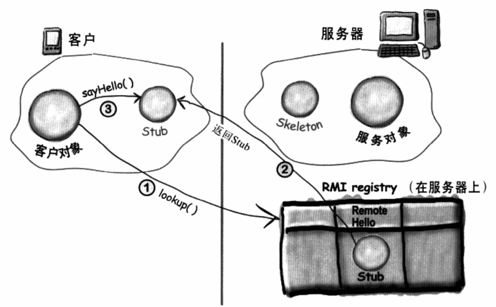

## 时间和日期API

```java
Instance start = Instance.now(); // 当前时刻，可当作时间戳
// 过一段时间
Instance end = Instance.now();
Duration timeElapsed = Duration.between(start, end); // 两个时刻间点时间量
long millis = timeElapsed.toMillis();

// 本地日期 LocalDate
birthday.plus(Period.ofYears(1)); // 下一年的生日
today.until(christmas); // 两个本地日期时间的时长
today.until(christmas, ChronoUnit.DAYS); // 两个本地日期时间的天数

// 日期调整器
LocalDate firstTuesday = LocaleDate.of(year, month, 1).with(TemporalAdjuster.nextOrSame(DayOfWeek.TUESDAY)); // 某月的第一个星期二
// 自定义日期调整器
TemporalAdjuster NEXT_WORKDAY = w -> {
    LocalDate result = (LocalDate) w;
    do {
        result = result.plusDays(1);
    } while(result.getDayOfWeek().getValue() >= 6);
    return result;
};
LocalDate backToWork = today.with(NEXT_WORKDAY);

// 本地时间 LocalTime
LocalTime now = LocalTime.now();
LocalTime bedtime = LocalTime.of(22, 30); // 22:30

// 时区时间 ZonedDateTime

```

### 格式化和解析

DateTimeFormatter 类提供了3种打印日期/时间值的格式器

- 预定义的格式器
- Locale相关的格式器
- 带有定制模式的格式器

```java
// Locale 相关的格式器
DateTimeFormatter formatter = DateTimeFormatter.ofLocalizedDateTime(FormatStyle.LONG);
String formatted = formatter.format(someday);
formatted = formatter.writeLocale(Locale.FRENCH).format(someday);
// 指定模式
formatter = DateTimeFormatter.ofPattern("E yyyy-MM-dd HH:mm");
```

SimpleDateFormat

自定义日期格式

```java
// 将字符串转换成Date
String date = "1992-07-13";
// 需转换的字符串中，日期的格式
SimpleDateFormat sdf = new SimpleDateFormat("yyyy-MM-dd HH:mm:ss");
Date result = sdf.parse(date);// result = Mon Jul 13 00:00:00 CST 1992
// 定制Date显示的格式，转换为sdf定义的格式
String formatDate = sdf.format(result);// formatDate = 1992-07-13
// 制定时区
sdf.setTimeZone(TimeZone.getTimeZone("GMT+8"));
// 修改本地时区
TimeZone.setDefault(TimeZone.getTimeZone("GMT+8"));

Date date = new Date(); 
DateFormat shortDateFormat = DateFormat.getDateTimeInstance(DateFormat.SHORT,DateFormat.SHORT); 
DateFormat mediumDateFormat = DateFormat.getDateTimeInstance(DateFormat.MEDIUM,DateFormat.MEDIUM); 
DateFormat longDateFormat = DateFormat.getDateTimeInstance(DateFormat.LONG,DateFormat.LONG); 
DateFormat fullDateFormat = DateFormat.getDateTimeInstance(DateFormat.FULL,DateFormat.FULL); 
shortDateFormat.format(date);
```

somedate.getTime()返回的是一个UTC的unix timestamp秒数，与时区无关；而转换为字符串后，就和时区相关了。

## 国际化

```java
// 构建 Locale 对象
Locale usEnglish = Locale.forLanguageTag("en-US");

// 数字格式
Locale loc = Locale.GERMAN;
NumberFormat currFmt = NumberFormat.getCurrencyInstance(loc);
double amt = 1234.567;
String result = currFmt.format(amt); // 1.234,567€
```

## 编译器 API

```java
JavaCompiler compiler = ToolProvider.getSystemJavaCompiler();
OutputStream outStream = ...;
OutputStream errStream = ...;
int result = compiler.run(null, outStream, errStream, "-sourcepath", "src", "Test.java");
```

## 注解

注解的作用

- 编译检查。测试、日志、事务语义等代码等自动生成。
- 配置信息。附属文件的自动生成，如部署描述符或者bean信息类
- 生成帮助文档

在java中，注解是当作一个修饰符（类似public、private）来使用的。是代码的一部分。它位于当前行其他修饰词的前面。是插入到代码中使用其他工具可以对其进行处理的标签。注解不会改变程序的编译方式。

格式：@ + 注解类型

每个注解都必须通过一个注解接口进行定义。接口中的方法与注解中的元素相对应。

```java
// 使用注解
@Reviewed(reviewer = "Joe", date = 2005)
public class Point{
	//code
}
// 注解类型的定义
public @interface Reviewed{
	String reviewer();
	int date();
}
```

处理注解的工具将接收那些实现了这个注解接口的对象。

入门示例

```java
// 定义注解
@Target(ElementType.METHOD)
@Retention(RetentionPolicy.RUNTIME)
public @interface ActionListenerFor{
   String source();
}
// 处理标注了该注解的对象
public class ActionListenerInstaller {
    // obj是标注了注解的对象
    public static void processAnnotations(Object obj) {
        try {
            Class<?> cl = obj.getClass();
            for (Method m : cl.getDeclaredMethods()) {
                ActionListenerFor a = m.getAnnotation(ActionListenerFor.class);
                if (a != null) {
                    Field f = cl.getDeclaredField(a.source());
                    f.setAccessible(true);
                    addListener(f.get(obj), obj, m); // 如果标注了该注解，则进行addListener操作
                }
            }
        } catch (ReflectiveOperationException e) {
            e.printStackTrace();
        }
    }
}
// 调用注解处理方法
ActionListenerInstaller.processAnnotations(someObj);
```

### 注解语法

注解是由注解接口来定义的。不需要提供实现了注解接口的类。

```java
modifiers @interface AnnotationName{
    type elementName(); // elementDeclaration1
    type elementName() default value; // elementDeclaration2
    ...
}
```

所有注解接口都隐式地扩展自java.lang.annotation.Annotation接口，这是一个常规接口。注解接口不能被扩展。

注解元素类型

- 基本类型
- String
- Class
- enum 类型
- 注解类型
- 以上所述类型组成的数组

注解格式

```java
// 格式
@AnnotationName(elementName1=value1, elementName2=value2, ...)
// 示例
//元素值是一个数组
@BugReport(..., reportedBy={"Harry", "Carl"})
//元素是另一个注解
@BugReport(ref=@Reference(id="123"), ...)
```

元素的顺序无关紧要。如果某个元素的值没有指定，那么就使用声明的默认值。一个注解元素永远不能设置为null。

简化注解

```java
// 标记注解：所有元素都使用默认值，不需要使用圆括号
@BugReport

// 单值注解：只有一个名为value的元素
public @interface ActionListenerFor{
	String value();
}
@ActionListenerFor("yellowButton")
```

包是在文件 package-info.java 中注解的。

### 标准注解

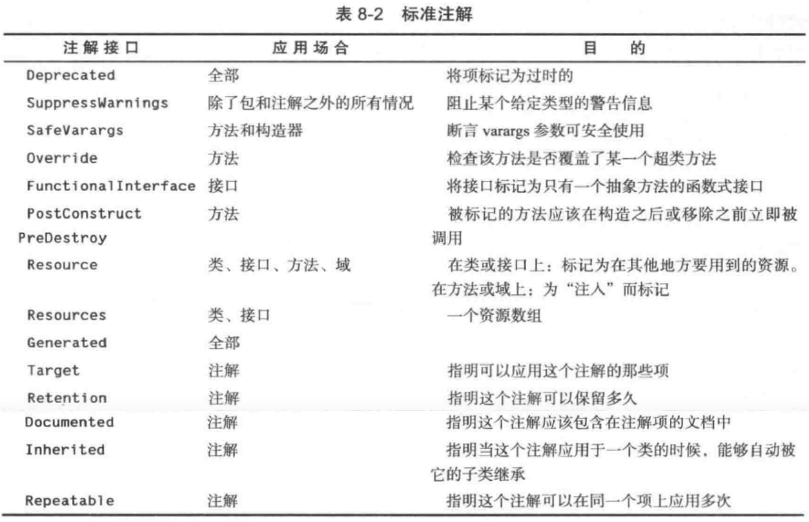

作用范围（作用域）

- 编译期间有效，如@SuppressWarnings
- 运行期间有效，如@Test(timeout=20)
- 源码期间有效，如@Author

元注解

注解的注解，用来说明当前注解的作用域、作用位置

- @Retention：作用域
- @Target：作用位置

```java
// 注解标注的位置
@Target(ElementType.METHOD)
// 注解的作用域
@Retention(RetentionPolicy.RUNTIME)
//上面2个是元注解，将Test注解标识成一个只能运用到方法上的注解
public @interface MyTest{
    long timeout() default 0L;
    //...
}
```

可重复注解需要提供一个容器注解

```java
@Repeatable(TestCases.class)
@interface TestCase{
    String params();
    String expected();
}
// 容器注解
@interface TestCases{
    TestCase[] value();
}
```

## 安全

### 类加载器

将类加载到虚拟机中的时候检查类的完整性。需要与安全管理器（负责控制代码运行）协同工作。

类加载过程

虚拟机只加载程序执行时所需要的类文件。

假设从 MyProgram.class 开始运行

1. 加载 MyProgram 类文件中的内容
2. 加载 MyProgram 类的超类，或者依赖的类。加载某个类所依赖的所有类的过程称为类的解析。
3. 执行 MyProgram 的 main 方法
4. 加载 main 方法中遇到的类

每个 Java 程序至少拥有3个类加载器

- 引导类加载器(Bootstrap)，负责加载系统类（通常从rt.jar中加载），没有对应的 ClassLoader 对象
- 扩展类加载器(Extension)，从 `jre/lib/ext` 目录加载“标准的扩展”。
- 系统类加载器(System)，用于加载应用类，从 CLASSPATH 环境变量或 -classpath 命令行选项设置的类路径中加载类。

类加载器的层次结构

除引导类加载器外，每个类加载器都有一个父类加载器。先由父类加载，加载不成功时，再由该加载器加载。

加载层次是

```
Bootstrap 类加载器
↑
Extension 类加载器
↑
System 类加载器
↑
Plugin 类加载器
```

每个线程都有一个对类加载器的引用，称为上下文类加载器。主线程的上下文类加载器是系统类加载器。每个线程创建时，上下文加载器会被设置成创建该线程的上下文加载器。

```java
// 设置线程的上下文类加载器
Thread t = Thread.currentThread();
t.setContextClassLoader(loader);
// 获取线程的上下文类加载器
ClassLoader loader = t.getContextClassLoader();
Class cl = loader.loadClass(className);
// 加载插件中的类
URL url = new URL("file:///path/to/plugin.jar");
URLClassLoader pluginLoader = new URLClassLoader(new URL[] {url});
Class<?> cl = pluginLoader.loadClass("mypackage.MyClass");
```

在虚拟机中，类是由它的全名和类加载器来确定的。可以有两个类，它们的类名和包名都是相同的。

编写自己的类加载器

```java
public class MyClassLoader extends ClassLoader {
    @Override
    findClass(String className) {
        // ...
    }
}
```

loadClass 方法用于将类的加载操作委托给父类加载器去进行。只有父类加载器无法加载时，才调用findClass方法。

ClassLoader中的几个方法

```java
// 将byte字节流解析成JVM能识别的Class对象
Class<?> defineClass(byte[], int, int)
// 实现类的加载机制
Class<?> findClass(String)
Class<?> loadClass(String)
void resolveClass(Class<?>)

// 常用实现类
URLClassLoader
```

调试需要的一些方法

```java
// 获取当前的 classpath 路径
this.getClass().getClassLoader.getResource("").toString()
```


## 参考资料

[JDK下载](https://www.oracle.com/technetwork/java/javase/downloads)

[jdk安装](https://www.cnblogs.com/yjd_hycf_space/p/7885099.html)

《core Java》

《Head First Java》

《Java程序设计语言》

[Jar 文件详解](https://blog.csdn.net/zhifeiyu2008/article/details/8829637)
