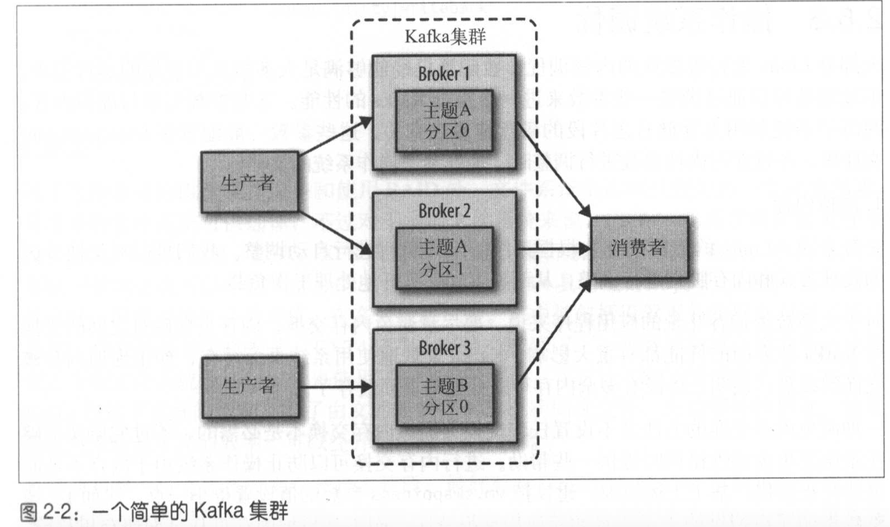

# Kafka

发布与订阅

消息

kafka的数据单元，消息可以有一个可选的元数据，即键。

消息被分批写入kafka。批次就是一组消息，这些消息属于同一个主题和分区。

消息模式

消息的结构

主题和分区

主题对消息进行分类，主题可以被分成若干个分区，一个分区就是一个提交日志。

消息以追加方式写入分区，然后以先进先出的顺序读取。分区可以分布在不同服务器上。

把消息写入指定的分区，可以使用消息键和分区器来实现。分区器为键生成一个哈希值，并将其映射到指定的分区上。

消费者

消费者通过检查消息的偏移量来区分已经读取过的消息。在给定的分区里，每个消息的偏移量都是唯一的。

群组保证每个分区只能被一个消费者使用。（rainy：那么，有n个消费者，是不是意味着，这个主题，至少要有n个分区？）


broker

一个独立的kafka服务器被称为broker

1. 接收消息
2. 为消息设置偏移量
3. 保存消息到磁盘
4. 为消费者取出消息

每个集群都有一个broker充当了集群控制器的角色。




保留消息

1. 保留一段时间，如7天
2. 保留到一定大小的字节，如1GB

```sh
# 创建topic test
/usr/local/kafka/bin/kafka-topics.sh --create --zookeeper localhost:2181 --replication-factor 1 --partitions 1 --topic test
# 显示topic test的信息
/usr/local/kafka/bin/kafka-topics.sh --zookeeper localhost:2181 --describe --topic test
# 往主题上发布消息
/usr/local/kafka/bin/kafka-console-producer.sh --broker-list localhost:9092 --topic test
# 从主题上读消息
bin/kafka-console-consumer.sh --bootstrap-server localhost:9092 --topic topicName --from-beginning

# 查看当前脏页数量
cat /proc/vmstat | egrep "dirty|writeback"

# 使用G1作为垃圾回收器
export JAVA_HOME=/usr/java/jdkl.8.0_51
export KAFKA_JVM_PERFORMANCE="-server -XX:+UseG1GC
-XX:MaxGCPauseMillis=20 -XX:InitialingHeapOccupancyPercent=35
-XX:+DisableExplicitGC -Djava.awt.headless=true"
/usr/local/kafka/bin/kafka-server-start.sh -daemon /usr/local/kafka/config/server.properties                                         
```

日志片段被关闭之前，消息是不会过期。

## 生产者

kafka提供了二进制连接协议：直接向kafka网络端口发送适当的字节序列，就可以实现从Kafka读取或写入消息。


发送消息主要有以下3种方式

1. 发送并忘记 fire-and-forget
2. 同步发送 send()返回Future对象，用get方法可知道消息是否发送成功
3. 异步发送 send()方法，指定回调函数。服务器在返回响应时调用该函数。

生产者属性

```sh
# broker 地址清单。不需要包含所有的broker地址，生产者会从给定的broker里查找到其他broker信息。
bootstrap.servers = host:port
# 将Java对象转换成字节数组的方式。需要实现了org.apache.kafka.common.serialization.Serializer接口
key.serializer = Class
# 将值序列化
value.serializer = Class

# 其他属性
# 指定了必须要有多少个分区副本收到消息，生产者才认为消息是写入成功的。
acks = [0(不管消息是否写入成功)|1(首领节点收到消息，则认为写入成功)|all(所有节点收到消息，则认为写入成功)]
# 生产者内存缓冲区大小
buffer.memory = 
# 消息被发送前，压缩的方式。默认不压缩
compression.type = [snappy|gzip|lz4]
# 重发消息的次数
retries = 
# 重发消息间隔时间
retry.backoff.ms = 
# 一个批次（被发送到同一个分区的多个消息）可以使用的内存大小(byte)
batch.size
# kafkaProducer会在批次填满或linger.ms达到上限时把批次发送出去。默认情况下，只要有可用的线程，生产者就会把消息发送出去。
linger.ms
# 标识消息来源
client.id
# 指定生产者在收到服务器响应前，可用发送多少个消息
max.in.flight.requests.per.connection
# 
timeout.ms # broker等待同步副本返回消息确认的时间
request.timeout.ms # 生产者在发送数据时，等待服务器返回响应的时间
metadata.fetch.timeout.ms # 生产者在获取元数据时，等待服务器返回响应的时间
# 发送的单个请求里所有消息总的大小
max.request.size

receive.buffer.bytes # socket 接收数据包的缓冲区大小，-1表示用系统默认值
send.buffer.bytes # socket 发送数据包的缓冲区大小
```


```java
Properties kafkaProps = new Properties();
// ... 设置属性
KafkaProducer producer = new KafkaProducer<String, String>(kafkaProps);

// 发送消息
ProducerRecord<String, String> record = new ProducerRecord<>("CustomerCountry", "Precision Products", "France");
try {
    // 发送忘记
    producer.send(record);
    // 同步发送消息
    producer.send(record).get(); // get方法等待服务器响应
    // 异步发送消息
    producer.send(record, new DemoProducerCallback());
} catch (Exception e) {
    e.printStackTrace();
}


private Class DemoProducerCallback implements Callback {
    @Override
    public void onCompletion(RecordMetadata recordMetadata, Exception e) {
        if(e != null) {
            e.printStackTrace();
        }
    }
}


// 自定义序列化器(不建议)
public class MyObjectSerializer implements Serializer<MyObject> {
    @Override
    public void configure(Map configs, boolean isKey) {
        // 配置
    }
    @Override
    public byte[] serialize(String topic, MyObject data) {
        try {
            byte[] serializedName;
            int stringSize;
            if(data == null)
                return null;
            else {
                if(data.getName() != null) {
                    serializedName = data.getName().getBytes("UTF-8");
                    stringSize = serializedName.length;
                } else {
                    serializedName = new byte[0];
                    stringSize = 0;
                }
            }
            ByteBuffer buffer = ByteBuffer.allocate(4+4+stringSize);
            buffer.putInt(data.getID());
            buffer.putInt(stringSize);
            buffer.put(serializedName);
            return buffer.array();
        } catch(Exception e) {
            throw new SerializationException("" + e);
        }
    }
}

// Avro序列化请参考《kafka权威指南p61》
```

分区

kafka消息的组成

1. topic
2. key（可选）
3. value

key的作用

1. 消息的附加信息
2. 决定消息被写入主题的哪个分区。相同key将被写入到同一个分区；没有key则使用分区器将消息均匀分布到各个分区上。

```java
// 自定义分区器
public class BananaPartitioner implements Partitioner {
    public void configure(Map<String, ?> configs) {}
    public int partition(String topic, Object key, byte[] keyBytes, Object value, byte[] valueBytes, Cluster cluster) {
        List<PartitionInfo> partitions = cluster.partitionsForTopic(topic);
        int numPartitions = partitions.size();
        if((keyBytes == null) || (!(key instanceof String)))
            throw new InvalidRecordException("...");
        if(((String) key).equals("Banana"))
            return numPartitions; // key是Banana的分配到最后一个分区
        return (Math.abs(Utils.murmur2(keyBytes))%(numPartitions - 1)) // 其他消息，分到剩余的分区
    }
    public void close(){}
}
```

## 消费者

### KafkaConsumer

kafka消费者从属于消费者群，一个群组里的消费者订阅的是同一个主题，每个消费者接收主题一部分分区的消息。


当消费者个数、或分区个数发生变化时，就会发生再均衡。分区的所有权会在所有消费者间进行再分配。

消费者维持群组从属关系、分区所有权的方式：向群组协调器（一个broker）发送心跳。

当消费者要加入群组时，它会向群组协调器发送一个JoinGroup请求。第一个加入的消费者，是群主，会从协调器获得群组成员列表，给成员分配分区。

### 创建消费者

属性

```sh
# broker地址
bootstrap.servers
# key和value转成对象的反序列化器
key.deserializer
value.deserializer
# 指定consumer属于哪一个消费者群组
group.id
```

Consumer

```java
Properties props = new Properties();
props.put("bootstrap.servers", "broker1:9092");
props.put("group.id", "CountryCounter");
...

KafkaConsumer<String, String> consumer = new KafkaConsumer<>(props);
// 订阅主题，可以订阅多个，也可以用正则匹配主题
consumer.subscribe(Collections.singletonList("customerContries"));
consumer.subscribe("test.*");
// 轮询读取主题
```

消费者必须持续对kafka进行轮询，否则会被认为已经死亡，它发分区会被移交给群组里的其他消费者。

```java
try {
    while(true){
        // poll()方法参数，指定了在多少ms内，等待broker返回数据（rainy: 也就说在，在poll指定的时间内，获取多少消息，就处理多少消息？）。
        ConsumerRecords<String, String> records = consumer.poll(100);
        for(ConsumerRecord<String, String> record : records) {
            // 处理消息
        }
    }
} finally {
    // 关闭消费者后，网络连接和socket也会随之关闭，并立即触发一次再均衡。
    consumer.close();
}
```

在第一次调用新消费者的poll()方法时，它会负责查找GroupCoordinator，然后加入群组，接受分配的分区。如果发生了再均衡，整个过程也是轮询期间进行的，心跳也是从轮询里发出去的。所以要确保在轮询期间所做的任何处理工作，都应该尽快完成。（rainy：为什么，不完成有什么后果？轮询时做的操作是，获取消息、心跳、再均衡，这些不都是kafka在做吗？）

最好是把消费者的逻辑，封装在自己的对象里，然后用Java的ExecutorService启动多个线程，使每个消费者运行在自己的线程上。

消费者的配置

```sh
# 指定了消费者从服务器获取记录的最小字节数。如果broker在收到消费者的数据请求时，如果可用的数量小于fetch.min.bytes指定的大小，那么它会等到有足够的可用数据时，才把它返回给消费者。
fetch.min.bytes
# 指定broker的等待时间。如果在该时间内也没有达到最小字节数，就直接返回。
fetch.max.wait.ms
# 服务器从每个分区里返回给消费者的最大字节数。
max.partition.fetch.bytes
# 指定了消费者在被认为死亡之前，可以与服务器断开的时间。即消费者多久可以不发心跳。
session.timeout.ms
# 指定了poll()方法向协调器发送心跳的频率。要和 session.timeout.ms 同时修改，一般是它的三分之一。
heartbeat.interval.ms
# 当消费者在读取一个没有偏移量（或偏移量无效）的分区，latest表示从消费者启动后生成的记录开始读，earliest表示从起始位置读。
auto.offset.reset
# 消费者是否自动提交偏移量。 true|false
enable.auto.commit
# 偏移量提交的频率，当 enable.auto.commit=true 时有效
auto.commit.interval.ms
# 分区策略 Range|RoundRobin
partition.assignment.strategy
# 标识从客户端发来的消息
client.id
# 控制单次调用call()方法能够返回的记录数量
max.poll.records
# TCP 缓冲区大小
receive.buffer.bytes
send.buffer.bytes
```

rainy：什么时候偏移量失效？分区重分配时，不会把偏移量设置成功吗？

rainy: 两个不同的消费者，订阅同一个分区，是会平分消息，还是会共享消息？

### 提交和偏移量

消费者可以使用Kafka追踪消息在分区里的位置（偏移量）

提交 commit：更新分区当前位置的操作

消费者往一个叫作_consumer_offset的特殊主题发送消息，消息里包含每个分区的偏移量。如果发生再均衡，消费者需要读取每个分区最后一次提交的偏移量，然后从偏移量指定的地方继续处理。

偏移量标识了分区里，已处理的消息。

提交的几种方式

1. 自动提交。enable.auto.commit=true时生效。提交时间间隔由auto.commit.interval.ms控制。自动提交也是在轮询里进行的。
2. 提交当前偏移量。调用 commitSync() 方法，提交由poll()返回的最新偏移量。

```java
try {
    while(true){
        // poll()方法参数，指定了在多少ms内，等待broker返回数据（rainy: 也就说在，在poll指定的时间内，获取多少消息，就处理多少消息？）。
        ConsumerRecords<String, String> records = consumer.poll(100);
        for(ConsumerRecord<String, String> record : records) {
            // 处理消息
            try{
                consumer.commitSync(); // 提交当前偏移量
            }
        }
    }
} finally {
    // 关闭消费者后，网络连接和socket也会随之关闭，并立即触发一次再均衡。
    consumer.close();
}
```

rainy: 如果轮询就是poll方法，那么提交当前偏移量，和自动提交，有什么区别呢？自动提交，是在poll方法里提交吗？

3. 异步提交。手动提交会等待broker响应。异步提交则不用

```java
while(true){
    // poll()方法参数，指定了在多少ms内，等待broker返回数据（rainy: 也就说在，在poll指定的时间内，获取多少消息，就处理多少消息？）。
    ConsumerRecords<String, String> records = consumer.poll(100);
    for(ConsumerRecord<String, String> record : records) {
        // 处理消息
    }
    consumer.commitAsync(); // 异步提交当前偏移量
}

// 有回调的异步提交
while(true){
    // poll()方法参数，指定了在多少ms内，等待broker返回数据（rainy: 也就说在，在poll指定的时间内，获取多少消息，就处理多少消息？）。
    ConsumerRecords<String, String> records = consumer.poll(100);
    for(ConsumerRecord<String, String> record : records) {
        // 处理消息
    }
    consumer.commitAsync(new OffsetCommitCallback(){
        public void onComplete(Map<TopicPartition, OffsetAndMetadata> offsets, Exception e) {
            if (e != null) {
                // 偏移量提交失败的处理
                // 如果要重试，需要检查在失败的那次提交后，有没有新的提交进来。
            }
        }
    }); 
}
```

4. 同步和异步组合提交。确保关闭消费者，或再均衡前的最后一次提交，能提交成功。

```java
try {
    while(true){
        // poll()方法参数，指定了在多少ms内，等待broker返回数据（rainy: 也就说在，在poll指定的时间内，获取多少消息，就处理多少消息？）。
        ConsumerRecords<String, String> records = consumer.poll(100);
        for(ConsumerRecord<String, String> record : records) {
            // 处理消息
        }
        consumer.commitAsync();
    }
} catch(Exception e) {
    // 处理异常
} finally {
    try{
        consumer.commitSync(); // 提交当前偏移量
    } finally {
        // 关闭消费者后，网络连接和socket也会随之关闭，并立即触发一次再均衡。
        consumer.close();
    }
}
```

5. 提交特定的偏移量

```java
private Map<TopicPartition, OffsetAndMetadata> currentOffsets = new HashMap<>();
int count = 0;
while (true) {
    ConsumerRecords<String, String> records = consumer.poll(100);
    for(ConsumerRecord<String, String> record : records) {
        // 处理消息
        currentOffsets.put(new TopicPartition(record.topic(), record.partition()), new OffsetAndMetadata(record.offset() + 1, "no metadata"));
        if(count % 1000 == 0) {
            consumer.commitAsync(currentOffsets, null);
        }
        count++;
    }
}
```

### 再均衡监听器

在为消费者分配新分区或移除旧分区时，可以通过消费者API执行一些应用程序代码

```java
// 会在再均衡开始之前，消费者停止读取消息之后被调用。
public void onPartitionsRevoked(Collection<TopicPartition> partitions)
// 在重新分配分区后，消费者开始读取消息之前被调用
public void onPartitionsAssigned(Collection<TopicPartition> partitions)

// 在失去分区所有权之前，通过 onPartitionsRevoked() 方法来提交偏移量
private Map<TopicPartition, OffsetAndMetadata> currentOffsets = new HashMap<>();

private class HandleRebalance implements ConsumerRebalanceListener {
    public void onPartitionsAssigned(Collection<TopicPartition> partitions){}
    public void onPartitionsRevoked(Collection<TopicPartition> partitions){
        consumer.commitSync(currentOffsets);
    }
    try {
        consumer.subscribe(topics, new HandleRebalance());
        while (true) {
            ConsumerRecords<String, String> records = consumer.poll(100);
            for(ConsumerRecord<String, String> record : records) {
                // 处理消息
                currentOffsets.put(new TopicPartition(record.topic(), record.partition()), new OffsetAndMetadata(record.offset() + 1, "no metadata"));
            }
            consumer.commitAsync(currentOffsets, null);
        }
    } catch (WakeupException e) {
        // 忽略异常，正在关闭消费者
    } finally {
        try{
            consumer.commitSync(); // 提交当前偏移量
        } finally {
            // 关闭消费者后，网络连接和socket也会随之关闭，并立即触发一次再均衡。
            consumer.close();
        }
    }
}
```

### 从特定偏移量处开始处理记录

```java
seekToBeginning(Clollection<TopicPartition> tp)
seekToEnd(Clollection<TopicPartition> tp)

// 偏移量保存在数据库里。
// 以下程序保证既不重复处理，又不丢失消息。利用了数据库事务的原子性。
public class SaveOffsetsOnRebalance implements ConsumerRebalanceListener {
    public void onPartitionsRevoked(Collection<TopicPartition> partitions) {
        commitDBTransaction();
    }
    public void onPartitionsAssigned(Collection<TopicPartition> partitions) {
        for (TopicPartition partition: partitions) {
            consumer.seek(partition, getOffsetFromDB(partition));
        }
    }
}

consumer.subscribe(topics, new SaveOffsetsOnRebalance(consumer));
consumer.poll(0);

for(TopicPartition partition: consumer.assignment()){
    consumer.seek(partition, getOffsetFromDB(partition));
}

while(true) {
    for(ConsumerRecords<String, String> record: records){
        processRecord(record);
        storeRecordInDB(record);
        sotreOffsetInDB(record.topic(), record.partition(), record.offset());
    }
    commitDBTransaction();
}
```

### 退出消费者

调用 consumer.wakeup() 可以退出 poll() 并抛出WakeupException。

```java
Runtime.getRuntime().addShutdownHook(new Thread(){
    public void run() {
        System.out.println("Starting exit...");
        consumer.wakeup();
        try {
            mainThread.join();
        } catch (InterruptedException e) {
            e.printStackTrace();
        }
    }
});
```


### 独立消费者

消费者不加入群组，而是为自己分配分区。

缺点：主题增加了新分区，消费者不会收到通知。

```java
List<PartitionInfo> partitionInfos = null;
partitionInfos = consumer.partitionsFor("topic");

if (partitionInfos != null) {
    for(PartitionInfo partition : partitionInfos) {
        partitions.add(new TopicPartition(partition.topic(), partition.partition()));
    }
    consumer.assign(partitions);
}

// 处理消息
```

## 深入kafka

broker启动时，通过创建临时节点把自己的id注册到Zookeeper

### 控制器

控制器就是一个broker，还负责分区首领的选举。

集群里第一个启动的broker通过在zookeeper里创建一个临时节点 /controller 让自己成为控制器。其他broker在尝试创建/controller临时节点时，会发现已存在，然后会创建zookeeper watch对象，这样就可以收到这个节点的变更通知。

控制器使用 epoch 来避免“脑裂”（指2个节点同时认为自己是当前的控制器）

### 复制

副本有以下两种类型

1. 首领副本。所有分区都有一个。所有生产者请求和消费者请求都会经过这个副本。
2. 跟随者副本。跟随者副本不处理来自客户端的请求，唯一的任务就是从首领那里复制消息，与首领保持一致。

跟随者如果在10s内没有请求任何消息，或没有请求最新数据，那它就被认为是不同步的。首领失效时，只有同步副本才有可能被选为新首领。

每个分区都有一个首选首领。选首领时会优选首选首领。

```sh
# 跟随者正常不活跃时间
replica.lag.time.max.ms
# 首选首领自动称为当前首领
auto.leader.rebalance.enable
```

### 处理请求

kafka请求消息

消息头

- request type
- request version
- correlation id
- client id

kafka 的broker上有2个分区

1. 请求队列：负责接收请求，并存储
2. 响应队列：负责接收响应结果，并发送给响应的客户端

客户端要自己负责把生产请求和获取请求发送到正确的broker中，即有该分区首领的broker。

客户端会发送请求获取元数据，然后把元数据缓存起来。当客户端收到“非首领错误”，它会尝试重发请求之前先刷新元数据。


```sh
# 获取元数据的请求间隔
metadata.max.age.ms
```

生产请求

生产请求的消息被写入分区的首领后，broker开始检查acks配置参数

1. acks=0，acks=1，立即返回响应
2. acks=all，请求被保存在“炼狱”缓冲区，当所有跟随副本都复制了消息，响应才会被返回给客户端。

消费请求

kafka使用零复制技术，向客户端发送消息。即，kafka直接把消息从文件里发送到网络通道，而不经过任何中间缓冲区。

消息在没有同步到所有分区副本时，不会发送给消费者。尝试获取这些消息，会得到空响应。


### 物理存储

分区由片段组成，每个片段包含1GB或者一周的数据。如果写入的数据超过片段上线，就关闭当前文件，并打开一个新文件。

当前正在写入数据的片段，叫做活跃片段。活跃片段永远不会被删除。

保存在磁盘上的数据格式，与从生产者发送过来的，或者发送给消费者的消息格式是一样的。

为了帮助broker更快地定位到指定的偏移量，kafka为每个分区维护了一个索引。

```sh
# 使用DumLogSegment工具，查看片段内容 deep-iteration 显示被压缩到包装消息里的消息
bin/kafka-run-class.sh kafka.tools.DumpLogSegments --deep-iteration
```

## 可靠的数据传递

ACID 原子性、一致性、隔离性、持久性

- kafka保证分区消息的顺序
- 只有当消息被写入分区的所有同步副本时，才被认为是已提交。
- 只要还有一个副本时活跃的，那么已提交的消息就不会丢失
- 消费者只能读取已提交的消息

### 复制

主题
    分区1(首领)
        数据片段1
        数据片段2
        ……
    分区1(副本1)
    分区1(副本2)
    分区2
    ……

分区可在线（可用），可离线（不可用）。分区保证有序.

副本满足以下条件才能被认为是同步的

1. 与Zookeeper间有一个活跃的会话
2. 在过去10s内（可配置）从首领那获取过最新消息

```sh
# 复制系数(分区+副本的个数)
replication.factor # 主题级别
default.replication.factor # broker级别

unclean.leader.election.enable=true # 允许不同步的副本成为首领

# 最少同步副本，如果小于这个值，broker就停止接收生产者请求。
min.insysc.replicas

```

生产者的重试参数

broker返回给生产者的响应有

1. 可以通过重试解决的。如，LEADER_NOT_AVAILABLE
2. 不能通过重试解决的。如，INVALID_CONFIG

消费者

消费者需要提交他们读取某分区的偏移量，当退出之后，同一群组里的其他消费者就可以接手它们的工作。

```sh
# 消费者属于的群组
group.id
# 没有偏移量可提交，或请求的偏移量在broker上不存在时，消费者的行为。earliest：从分区开始位置读取数据。latest：从分区末尾读取数据。
auto.offset.reset
# 消费者自动提交偏移量
enable.auto.commit
# 配置自动提交的频度
auto.commit.interval.ms
```

消费者的pause()确保其他轮询不会返回数据，resume()让消费者继续从轮询里获取数据。

