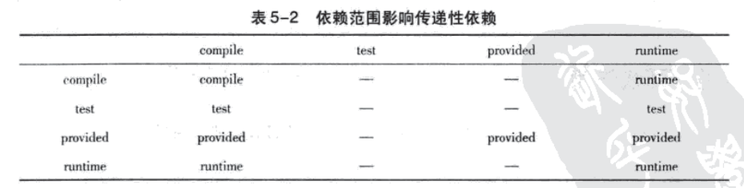

# Maven

作用

1. 依赖管理。使用POM（Project Object Model）项目对象模型实现，把项目当作对象管理
2. 一键构建。构建指项目从编译、测试、运行、打包、安装的整个过程。

Maven包的目录结构

- bin：命令
- boot：启动项
- conf：配置
- lib：文件库

## 入门程序

### 项目结构

maven工程的标准目录结构

```
- myProject
| - src/
| | - main/
| | | - java/		放入项目的源码
| | | - resources/	放入配置文件
| | | - webapp/		页面素材(仅web项目有)
| | - test/
| | | - java/		放入项目的测试代码
| | | - resources/	测试的配置文件
| - target/			放置项目的输出文件（自动生成）
| | - classes/ 		源码的编译文件
| | - test-classes/ 测试代码的编译文件
| - pom.xml 		Maven相关的配置
```

本例的项目结构

```
- hello-world
| - src/main/java/
| | - helloword/			包名（可任意指定，建议为groupId）
| | | - HelloWorld.java
| - src/test/java/
| | - helloword/
| | | - HelloWorldTest.java
| - pom.xml
```

### POM

pom.xml

```xml
<?xml version="1.0" encoding="UTF-8"?>
<project xmlns="http://maven.apache.org/POM/4.0.0"
		xmlns:xsi="http:www.w3.org/2002/XMLSchema-instance"
		xsi:schemaLocation="http://maven.apache.org/POM/4.0.0 http://maven.apache.org/maven-v4_0_0.xsd">
	<!-- 当前POM模型的版本 -->
	<modelVersion>4.0.0</modelVersion>
	<!-- 本项目的坐标 -->
	<groupId>com.mymaven.example</groupId>
	<artifactId>hello-world</artifactId>
	<version>1.0-SNAPSHOT</version>
	<name>Maven Hello World Project</name>

	<!-- 依赖的项目 -->
	<dependencies>
		<dependency>
			<groupId>junit</groupId>
			<artifactId>junit</artifactId>
			<version>4.11</version>
			<!-- 依赖范围 -->
			<scope>test</scope>
		</dependency>
	</dependencies>


	<build>
		<!-- 需要用到的插件 -->
		<plugins>
			<plugin>
				<groupId>org.apache.maven.plugins</groupId>
				<artifactId>maven-compiler-plugin</artifactId>
				<configuration>
					<source>1.7</source>
					<target>1.7</target>
				</configuration>
			</plugin>
		</plugins>
	</build>

</project>
```

### 主代码

HelloWorld.java

```java
package helloworld;

public class HelloWorld{
	public String sayHello(){
		return "Hello Maven";
	}
	public static void main(String[] args){
		System.out.print(new HelloWorld().sayHello());
	}
}
```

在项目根目录下运行命令，编译项目主代码

```
$ mvn clean compile
```

clean 告诉 Maven 清理输出目录 `target/`，compile 告诉 Maven 编译项目主代码

Maven 构建的所有输出都在 `target/` 目录下，项目主代码编译至 `target/classes` 目录

### 测试代码

HelloWorldTest.java

```java
package helloworld;
import static org.junit.Assert.assertEquals;
import org.junit.Test;

public class HelloWorldTest{
	@Test
	public void testSayHello(){
		HelloWorld hw = new HelloWorld();
		String result = hw.sayHello();
		assertEquals("Hello Maven", result);
	}
}
```

测试代码使用了 junit，需要将 junit 添加到项目POM文件的 `<dependencies>` 下的 `<dependency>` 元素中。

历史原因，maven 核心组件 compile 只编译 java1.3，需要添加 plugin 才能支持java7。需要在项目POM文件的 `<build>` 下的 `<plugins>` 下的 `<plugin>` 元素中添加插件。

在项目根目录下运行命令，编译项目测试代码

```
$ mvn clean test
```

在 `target/test-classes` 下生成了 .class 文件

### 打包和运行

POM中没有指定打包类型，使用默认的打包类型jar

打包

```
$ mvn clean package
```

将项目主代码打包成一个 hello-world-1.0-SNAPSHOT.jar 的文件

文件命名规则 artifact-version.jar

在target目录下

安装

```
$ mvn clean install
```

将打包出的 jar 安装到本地仓库 `~/.m2/repository/` 中。安装后，其他 Maven 项目可以通过它的坐标使用它

在仓库中的路径为

`groupId/artifactId/version/artifactId-version.jar`

HelloWorld 类带有 main 方法，该类的信息不会添加到 manifest 中，因此打出来的不是可执行的jar包。

为了生成可执行的jar包，需要借助 maven-shade-plugin

配置该插件如下：

```xml
<plugin>
	<groupId>org.apache.maven.plugins</groupId>
	<artifactId>maven-shade-plugin</artifactId>
	<version>1.2.1</version>
	<executions>
		<execution>
			<phase>package</phase>
			<goals>
				<goal>shade</goal>
			</goals>
			<configuration>
				<transformers>
					<transformer implementation="org.apache.maven.plugins.shade.resource.ManifestResourceTransformer">
						<mainClass>helloworld.HelloWorld</mainClass>
					</transformer>
				</transformers>
			</configuration>
		</execution>
	</executions>
</plugin>
```

打包后会生成 hello-world-1.0-SNAPSHOT.jar （可执行jar包）和 original-hello-world-1.0-SNAPSHOT.jar （原始jar包）

在Maven中，主要有3个插件可以用来打包：

- maven-jar-plugin，默认的打包插件，用来打普通的project JAR包；
- maven-shade-plugin，用来打可执行JAR包，也就是所谓的fat JAR包；
- maven-assembly-plugin，支持自定义的打包结构，也可以定制依赖项等。

### 创建项目骨架

因为 Maven 项目有一套固定的结构，使用 maven archetype 插件可以自动生成目录结构，即项目骨架

Maven 3

```
mvn archetype:generate
```

在提示框中，选择Archetype、输入groupId、artifactId、version、包名，会自动创建项目结构

## 依赖管理

Maven 项目中的依赖包、插件、项目组件...统称为构件。构件存储在仓库内，通过使用坐标来定位构件。

使用POM来管理本项目使用的依赖包、插件。

### 坐标

用来定位一个项目、插件等。具有唯一性。每个 Maven 项目都需要定义一组坐标。

坐标核心元素为

- groupId：项目属于哪个组，一般用包名表示
- artifactId：当前maven项目在组中唯一的ID，推荐用实际项目名称作为前缀（构件一般以artifactId作为开头）
- version：项目当前的版本号（SNAPSHOT意为快照，说明项目还在开发中）

可选元素为

- packaging（可选）：该maven项目对应的打包方式（如，jar、war）默认为jar
- classifier：定义附属构件。（如，javadoc、sources）
- name（非必需）：声明一个对用户更为友好的项目名称
- scope（非必需）：定义依赖范围，如 `<scope>test</scope>` 表明依赖只在测试代码上有效

项目构件打包后的文件名，一般为：artifactId-version[-classifier].packaging

### 依赖配置

在 pom.xml 中的 `<dependencies>` 元素下，配置项目用到的依赖包。

`<dependencies>` 元素可以包含一个或多个 `<dependency>` 元素，该元素包含的元素有：

- groupId, artifactId, version : 依赖的基本坐标
- type : 依赖的类型，对应于项目坐标定义的packaging，不声明时，默认为jar。还可以有pom、war
- scope : 依赖的范围
- optional : 依赖是否可选
- exclusions : 排除传递性依赖

#### 依赖范围

maven在编译项目主代码、测试代码、实际运行时，会使用不同的 classpath。scope元素就是用来控制依赖在哪个classpath下生效。

依赖范围有以下几种

- compile ：编译依赖范围。默认值。对编译、测试、运行三种 classpath 都有效。
- test ：测试依赖范围。只对测试 classpath 有效。在编译和运行时，无法使用该scope类型的依赖
- provided ：已提供依赖范围。对编译、测试的 classpath 有效，运行时无效
- runtime ：运行时依赖范围。对测试、运行 classpath 有效，在编译主代码时无效。
- system ：系统依赖范围。与provided完全一致，需要通过systemPath元素显式指定依赖文件的路径。可引用环境变量。
- import ：导入依赖范围（maven2.0.9及以上），不会对 classpath 产生实际影响。

#### 传递性依赖

传递性是指：项目可以使用依赖的依赖。间接依赖以传递性依赖的形式引入到当前的项目中。

并不是所有依赖都会传递，依赖范围影响依赖的传递。

第一列是直接依赖，第二列是第二层间接依赖



#### 可选依赖

A的依赖B有2个可选依赖X、Y，则X、Y不是A的依赖。如果A需要使用依赖X，则需要显式声明。

可选依赖用optional元素标注。理想情况下不应该使用可选依赖。

#### 依赖调解

当2个不同的依赖，依赖于同一个构件的不同版本时，会造成依赖重复，需要进行依赖调解

依赖调解的原则是

1. 路径最近者优先（构件在依赖路径中的深度）
2. 第一声明者优先（在POM中的声明顺序）

#### 排除依赖

作用

1. 排除掉某个依赖的 SNAPSHOT 版本的传递性依赖
2. 替换某个依赖的传递性依赖

使用exclusions（包含一个或多个 exclusion 子元素）排除一个或多个传递性依赖。exclusion 只需要 groupId 和 artifactId。

```xml
<project>
	<modelVersion>4.0.0</modelVersion>

	<groupId></groupId>
	<artifactId>project-a</artifactId>
	<version></version>

	<dependencies>
		<dependency>
			<groupId></groupId>
			<artifactId>project-b</artifactId>
			<version></version>

			<!-- project-a 排除了 project-b 的传递行依赖 project-c -->
			<exclusions>
				<exclusion>
					<groupId></groupId>
					<artifactId>project-c</artifactId>
				</exclusion>
			</exclusions>
		</dependency>

		<!-- project-a 声明了依赖 project-c(可能是一个新的版本) -->
		<dependency>
			<groupId></groupId>
			<artifactId>project-c</artifactId>
			<version></version>
		</dependency>

	</dependencies>
</project>
```

#### 归类依赖

类似于Java中将字面量3.14定义为常量PI=3.14，定义Maven属性管理依赖的版本

```xml
<project>
	<modelVersion>4.0.0</modelVersion>

	<groupId></groupId>
	<artifactId>project-a</artifactId>
	<version></version>

	<!-- 自定义maven属性 -->
	<properties>
		<springframework.version>2.5.6</springframework.version>
	</properties>

	<dependencies>
		<dependency>
			<groupId></groupId>
			<artifactId>spring-core</artifactId>
			<!-- 使用maven属性 -->
			<version>${springframework.version}</version>
		</dependency>
		...
	</dependencies>
</project>
```

#### 优化依赖

已解析依赖(Resolved Dependency)：解析直接依赖、传递性依赖，解决依赖冲突后，剩余的依赖。

可使用如下命令查看当前项目的已解析依赖

```
$ mvn dependency:list
```

查看当前项目的依赖树

```
$ mvn dependency:tree
```

分析当前项目的依赖

```
$ mvn dependency:analyze
```

## 仓库

定义：在某个统一位置存储所有Maven项目共享的构件，这个位置就是仓库。

某构件的仓库路径：`仓库名/groupId/artifactId/version/artifactId-version.packaging`

Maven 仓库的结构

- 本地仓库 		本地存放jar包的目录
- 远程仓库
	- 中央仓库是 	Maven核心默认的远程仓库
	- 私服 		另一种特殊的远程仓库，架设在局域网内，用以代理外部所有的远程仓库。
	- 公共仓库 	其他公司开放的远程仓库

寻找构件时，先查看本地仓库；如果没有，再去远程仓库，发现构件后下载到本地仓库后再使用；如果都没有，则报错。

### 本地仓库

默认路径： `~/.m2/repository`

自定义本地仓库目录地址： 编辑 `~/.m2/setting.xml` 文件（需要从Maven安装目录$M2_HOME/conf/setting.xml复制），设置 `<localRepository>` 元素的值为想要的仓库地址。

```xml
<settings>
	<localRepository>本地仓库地址</localRepository>
</settings>
```

### 远程仓库

中央仓库被配置在了超级 POM (所有 Maven 项目都会继承的 POM )中，位置在 `$M2_HOME/lib/maven-x.x.x-uber.jar/org/apache/maven/model/pom-4.0.0.xml` 。

#### 配置远程仓库

```xml
<project>
	...
	<repositories>
		<!-- 仓库id，是唯一的，重复声明会被覆盖 -->
		<id>jboss</id>
		<name>JBoss Repository</name>
		<!-- 仓库地址 -->
		<url>http://repository.jboss.com/maven2/</url>
		<!-- 可下载发布版本 -->
		<releases>
			<enabled>true</enabled>
		</releases>
		<!-- 不下载快照版本 -->
		<snapshots>
			<enabled>false</enabled>
		</snapshots>
		<!-- 使用默认仓库布局 -->
		<layout>default</layout>
	</repositories>
</project>

<!-- releases 和 snapshots 包含的子元素 -->
<snapshots>
	<!-- 是否下载快照版本的构件 -->
	<enabled>false</enabled>

	<!-- 配置从远程仓库检查更新的频率
		daily——每天检查一次
		never——从不检查更新
		always——每次构建都检查更新
		interval:X——每隔X分钟检查一次
	-->
	<updatePolicy>daily</updatePolicy>

	<!-- 配置检查检验和文件的策略（当构件被部署到Maven仓库中时，会同时部署对应的校验和文件。下载构件时， Maven 会验证校验和文件。）
		warn——执行构建时输出警告信息
		fail——遇到校验和错误就构建失败
		ignore——完全忽略校验和错误
	-->
	<checksumPolicy>ignore</checksumPolicy>
</snapshots>
```

#### 远程仓库的认证

某些仓库需要用户名和密码（认证信息）才能访问。

认证信息必需配置在settings.xml中（建议放在本机的配置文件中）

```xml
<settings>
	...
	<servers>
		<server>
			<!-- 与需要访问的repository元素的id一致 -->
			<id>my-proj</id>
			<username>repo-user</username>
			<password>repo-pwd</password>
		</server>
	</servers>
</settings>
```

#### 部署构件到远程仓库

配置构件部署地址

```xml
<project>
	...
	<distributionManagement>
		<!-- 发布版本的仓库 -->
		<repository>
			<!-- 远程仓库的唯一标识 -->
			<id>proj-releases</id>
			<name>Proj Release Repository</name>
			<!-- 仓库地址 -->
			<url>http://192.168.1.100/content/repositories/proj-releases</url>
		</repository>
		<!-- 快照版本的仓库 -->
		<snapshotRepository>
			<id>proj-snapshots</id>
			<name>Proj Snapshot Repository</name>
			<url>http://192.168.1.100/content/repositories/proj-snapshots</url>
		</snapshotRepository>
	</distributionManagement>
	...
</project>
```

配置完成后在命令行运行

```
$ mvn clean deploy
```

就会将构件部署到对应的远程仓库

#### 插件远程仓库

插件也基于坐标存储在 Maven 仓库中，使用 `<pluginRepositories>` 和 `<pluginRepository>` 配置插件的远程仓库

插件远程仓库，在POM(仅对本项目有效)或者setting.xml(对本机中所有项目有效)中配置

```xml
<pluginRepositories>
	<pluginRepository>
		<id></id>
		<name></name>
		<url></url>
		<layout>default</layout>

		<!-- 不下载快照版本 -->
		<snapshots>
			<enabled>false</enabled>
		</snapshots>

		<releases>
			<updatePolicy>never</updatePolicy>
		</releases>
		
	</pluginRepository>
</pluginRepositories>
```

### 仓库搜索服务

从仓库中搜索构件

- [Sonatype Nexus](http://repository.sonatype.org)
- [Jarvana](http://www.jarvana.com/jarvana)
- [MVNbrowser](http://www.mvnbrowser.com)
- [MVNrepository](http://mvnrepository.com)


## Maven属性

maven属性的种类

- 内置属性
	- ${basedir}	表示项目根目录
	- ${version}	表示项目版本
- POM属性：使用该类属性引用POM文件中对应元素的值，如${project.artifactId}对应了 `<project><artifactId>` 元素的值。常用的属性如下
	- ${project.build.sourceDirectory} 项目的主源码目录，默认为src/main/java/
	- ${project.build.testSourceDirectory} 项目的测试源码目录，默认为src/test/java/
	- ${project.build.directory} 项目构建输出目录，默认为target/
	- ${project.build.outputDirectory} 项目主代码编译输出目录，默认为target/classes/
	- ${project.build.testOutputDirectory} 项目测试代码编译输出目录，默认为target/testclasses/
	- ${project.groupId} 项目的groupId
	- ${project.artifactId} 项目的artifactId
	- `${project.version}` 项目的version，与 `${version}` 等价
	- ${project.build.finalName} 项目打包输出文件的名称
-  自定义属性：用户可以在POM的properties元素下自定义一个或多个Maven属性。在其他地方使用${my.prop}时，会被替换成2.5.6

```xml
<properties>
	<!-- my.prop 是自定义的属性 -->
	<my.prop>2.5.6</my.prop>
</properties>
```

- Settings属性：与POM属性类似，用户使用 settings. 开头的属性引用settings.xml文件中XML元素，如${settings.localRepository}指向本地仓库的地址。
- Java系统属性：所有Java系统属性都可以使用Maven属性引用，如${user.home}指向了用户目录。mvn help:system 查看所有的Java系统属性
- 环境变量属性：使用以 env. 开头的Maven属性引用，如${env.JAVA_HOME}指代了JAVA_HOME环境变量的值。

### 资源过滤

[Maven之profile实现多环境配置动态切换](https://www.cnblogs.com/zeng1994/p/a442108012ffd6a97b22c63055b48fe9.html)

资源文件的处理由 maven-resources-plugin 负责，为了使它能够解析资源文件中的Maven属性（默认只有在POM中才能解析），即开启资源过滤，需要在POM中加上

```xml
<resources>
	<resource>
		<directory>${project.basedir}/src/main/resources</directory>
		<!-- 开启资源过滤 -->
		<filtering>true</filtering>
	</resource>
</resources>

<!-- 开启测试的资源过滤 -->
<testResources>
	<testResource>
		<directory>${project.basedir}/src/test/resources</directory>
		<filtering>true</filtering>
	</testResource>
</testResources>
```

命令

```
$ mvn clean install -Pdev
```

-P表示激活一个profile，id为dev

Web资源过滤

```xml
<plugin>
	<groupId>org.apache.maven.plugins</groupId>
	<artifactId>maven-war-plugin</artifactId>
	<version></version>
	<configuration>
		<webResources>
			<resource>
				<!-- 开启过滤 -->
				<filtering>true</filtering>
				<!-- 声明了web资源目录 -->
				<directory>src/main/webapp</directory>
				<!-- 指定要过滤的文件 -->
				<includes>
					<include>**/*.css</include>
					<include>**/*.js</include>
				</includes>
			</resource>
		</webResources>
	</configuration>
</plugin>
```

### Maven Profile

profile能够在构建时修改POM的一个子集

```xml
<profiles>
	<profile>
		<id>id</id>
		<properties>
			<!-- 属性 -->
		</properties>
	</profile>
</profiles>
```

激活profile的方式

1. 命令行激活

```
$ mvn clean install -Pprofile1,profile2
```

-P加profile的id，多个profile间用","分隔

2. settings文件显示激活

```xml
<settings>
	<!-- 配置的profile对所有项目都处于激活状态 -->
	<activeProfiles>
		<activeProfile>profileId</activeProfile>
	</activeProfiles>
</settings>
```

3. 系统属性激活，当某系统属性存在时，自动激活profile

```xml
<profiles>
	<profile>
		<activation>
			<!-- test系统属性存在时激活profile -->
			<property>
				<name>test</name>
			</property>

			<!-- test系统属性存在，且值为x时，激活profile -->
			<property>
				<name>test</name>
				<value>x</value>
			</property>
		</activation>
	</profile>
</profiles>
```

可以在命令行声明系统属性

```
$ mvn clean install -Dtest=x
```

4. 操作系统环境激活

```xml
<profiles>
	<profile>
		<activation>
			<os>
				<name>Windows XP</name>
				<!-- 有： Windows、UNIX、Mac -->
				<family>Windows</family>
				<arch>x86</arch>
				<version></version>
			</os>
		</activation>
	</profile>
</profiles>
```

5. 文件存在与否激活

```xml
<profiles>
	<profile>
		<activation>
			<file>
				<missing>x.properties</missing>
				<exists>y.properties</exists>
			</file>
		</activation>
	</profile>
</profiles>
```

6. 默认激活

```xml
<profiles>
	<profile>
		<id>dev</id>
		<activation>
			<!-- 在定义时，指定默认激活(不指定其他激活方式时生效) -->
			<activeByDefault>true</activeByDefault>
		</activation>
	</profile>
</profiles>
```

命令

```
// 了解当前激活的profile
$ mvn help:active-profiles

// 列出所有的profile
$ mvn help:all-profiles
```

#### profile种类

可以在以下位置声明profile

- pom.xml 只对当前项目有效
- 用户settings.xml 位置 `~/.m2/` 对本机该用户的所有Maven项目有效
- 全局settings.xml 位置 `M2_HOME/conf/` 对本机所有项目有效
- profiles.xml 位置 `某项目名/` 只适用于Maven2

## 项目构建

构建指项目从编译、测试、运行、打包、安装的整个过程。

### 生命周期

Maven 有三套相互独立的生命周期，包括了项目的清理、初始化、编译、测试、打包、集成测试、验证、部署、站点生成

1. Clean Lifecycle： 	在进行真正的构建之前进行一些清理工作
2. Default Lifecycle： 	构建的核心部分：编译、测试、打包、部署等
3. Site Lifecycle：	 	生产项目报告、站点、发布站点。

每个生命周期包含一定阶段（phase），这些阶段是有顺序的。

clean 生命周期

- clean：清理项目
	- pre-clean：执行清理前需要完成的工作
	- clean：清理上一次构建生成的文件
	- post-clean：执行清理后需要完成的工作

default 生命周期

- default：构建项目
	- validate
	- initialize
	- generate-sources
	- process-sources：处理项目主资源文件。一般是对 src/main/resources 目录的内容进行变量替换等工作后，复制到项目输出的主classpath目录中
	- generate-resources
	- process-resources
	- compile：编译项目的主源码。一般是编译 src/main/java 目录下的Java文件至项目输出的主classpath目录中
	- process-classes
	- generate-test-sources
	- process-test-sources 处理项目测试资源文件。一般是对 src/test/resources 目录的内容进行变量替换等工作后，复制到项目输出的测试classpath目录中
	- generate-test-resources
	- process-test-resources
	- test-compile 编译项目的测试代码。一般是编译 src/test/java 目录下的Java文件至项目输出的测试classpath目录中
	- process-test-classes
	- test 使用单元测试框架运行代码，测试代码不会被打包或部署
	- prepare-package
	- package 接收编译好的代码，打包成可发布的格式，如jar
	- pre-integration-test
	- integration-test
	- post-integration-test
	- verify
	- install 将包安装到Maven本地仓库
	- deploy 将最终的包复制到远程仓库

site 生命周期

- site：建立项目站点
	- pre-site 执行在生成项目站点前需要完成的工作
	- site 生成项目站点文档
	- post-site 执行在生成项目站点后需要完成的工作
	- site-deploy 将项目站点发布到服务器

详细可参阅[官方解释](http://maven.apache.org/guides/introduction/introduction-to-the-lifecycle.html)

在命令行上输入

```sh
mvn 生命周期阶段
```

可以执行对应该阶段前的所有操作。属于同一个生命周期内的阶段，当后面的阶段指令执行时，前面的阶段会自动执行。

maven的生命周期是抽象的，本身不做任何实际的工作。实际任务都交由插件完成。(rainy: 类似java中接口的作用？)

每个构建步骤都包含了一个或多个插件，并绑定了默认的插件

### 插件

#### 插件目标

Plugin Goal

插件以独立的构件形式存在，maven会在需要的时候下载并使用插件。

为了能复用代码，插件往往可以完成多个功能。每个功能就是一个插件目标

使用插件功能的方式为，插件：插件目标。如 maven-dependency-plugin 插件的使用，后面的analyze、tree、list就是插件目标

- dependency:analyze
- dependency:tree
- dependency:list

#### 插件绑定

生命周期的阶段与插件的目标相互绑定

clean 生周期内置的绑定如下

|生命周期|阶段|插件目标|
|----|----|----|
|clean|pre-clean|maven-clean-plugin:clean|
||clean||
||post-clean||
|site|pre-site|maven-site-plugin:site|
||site||
||post-site|maven-site-plugin:deploy|
||site-deploy||

defalut生命周期的阶段与插件目标的绑定关系由项目打包类型决定。

自定义绑定

如，创建项目的源码jar包，将 maven-source-plugin:jar-no-fork 绑定到 default 生命周期的 verify 阶段

```xml
<build>
	<plugins>
		<plugin>
			<!-- 插件 -->
			<groupId>org.apache.maven.plugins</groupId>
			<artifactId>maven-source-plugin</artifactId>
			<version>2.1.1</version>
			<executions>
				<!-- 配置任务 -->
				<execution>
					<!-- 任务id -->
					<id>attach-sources</id>
					<!-- 将插件绑定到verify阶段 -->
					<phase>verify</phase>
					<!-- 指定执行的插件目标 -->
					<goals>
						<goal>jar-no-fork</goal>
					</goals>
				</execution>
			</executions>
		</plugin>
	</plugins>
</build>
```

很多插件的目标在编写时已经定义了默认绑定阶段。所以有时不配置 `<phase>` 元素也可以

当多个插件目标绑定到同一个阶段，插件声明的先后顺序决定了目标的执行顺序

#### 插件配置

1. 命令行配置插件

配置方式： `-D参数=参数值`

-D是Java自带的，功能是通过命令行设置一个Java系统属性。Maven重用了该参数。

```
$ mvn install -Dmaven.test.skip=true
```

2. POM中插件全局配置

适用于插件参数几乎不改变的情况

```xml
<build>
	<plugins>
		<plugin>
			<groupId>org.apache.maven.plugins</groupId>
			<artifactId>maven-compiler-plugin</artifactId>
			<version>2.1</version>
			<!-- 全局配置 -->
			<configuration>
				<source>1.8</source>
				<target>1.8</target>
			</configuration>
		</plugin>
	</plugins>
</build>
```

3. POM中插件任务配置

```xml
<build>
	<plugins>
		<plugin>
			<groupId>org.apache.maven.plugins</groupId>
			<artifactId>maven-antrun-plugin</artifactId>
			<version>1.3</version>
			<executions>
				<!-- 配置任务 -->
				<execution>
					<id>ant-validate</id>
					<phase>validate</phase>
					<goals>
						<goal>run</goal>
					</goals>
					<!-- 表示是特定任务的配置，而非整体的配置 -->
					<configuration>
						<tasks>
							<echo>I'm bound to validate phase.</echo>
						</tasks>
					</configuration>
				</execution>

				<!-- 第二个任务 -->
				<execution>
					<id>ant-verify</id>
					<phase>verify</phase>
					<goals>
						<goal>run</goal>
					</goals>
					<configuration>
						<tasks>
							<echo>I'm bound to verify phase.</echo>
						</tasks>
					</configuration>
				</execution>

			</executions>
		</plugin>
	</plugins>
</build>
```

#### 获取插件信息

Maven主要的插件都来自Apache和Codehaus

[Apache插件列表](http://maven.apache.org/plugins/index.html)
[Apache插件下载](http://repo1.maven.org/maven2/org/apache/maven/plugins/)
[Codehaus插件列表](http://mojo.codehaus.org/plugins.html)
[Codehaus插件下载](http://repository.codehaus.org/org/codehaus/mojo/)

使用 maven-help-plugin 获取插件的详细信息，使用方式见常用命令

#### 插件解析机制

版本解析

在用户没有提供插件版本的情况下，Maven会自动解析插件版本

1. 首先，超级POM（所有Maven项目的父POM）中为所有核心插件设定了版本
2. 当插件不属于核心插件时，检查所有仓库中的可用版本，插件版本会被解析至latest（含快照）（maven2）或release，即最新发布版本（maven3）

插件前缀解析

mvn命令行支持使用插件前缀来简化插件的调用。如

```
$ mvn clean
```

Maven是如何根据插件前缀得到插件坐标呢？

插件前缀和 groupId:artifactId 是一一对应的。这种匹配关系存储在仓库元数据（groupId/maven-metadata.xml）中。org.apache.maven.plugins 下 maven-metadata-central.xml 的部分内容如下

```xml
<plugin>
  <name>Apache Maven Clean Plugin</name>
  <prefix>clean</prefix>
  <artifactId>maven-clean-plugin</artifactId>
</plugin>
<plugin>
  <name>Apache Maven Compiler Plugin</name>
  <prefix>compiler</prefix>
  <artifactId>maven-compiler-plugin</artifactId>
</plugin>
```

Maven在解析插件仓库元数据时，会默认使用 org.apache.maven.plugins 和 org.codehaus.mojo 两个 groupId 的元数据。

配置 settings.xml 让Maven解析其他groupId上的插件仓库元数据

```xml
<settings>
	<pluginGroups>
		<pluginGroup>com.your.plugins</pluginGroup>
	</pluginGroups>
</settings>
```

### 聚合

聚合是指用一个Maven项目作为聚合项目，包含多个子项目，来实现一次构建多个项目的功能。

聚合项目pom.xml如下

```xml
<project>
	<modelVersion>4.0.0</modelVersion>

	<!-- 坐标 -->
	<groupId></groupId>
	<artifactId></artifactId>
	<version></version>
	<!-- 聚合项目必须为pom -->
	<packaging>pom</packaging>
	<name></name>

	<!-- 聚合2个项目 -->
	<modules>
		<!-- 值为当前POM的相对目录，目录下包含了maven项目（一般为artifactId） -->
		<module>account-email</module>
		<module>account-persist</module>
	</modules>
</project>
```

### 继承

为了解决某依赖在多个项目重复配置的问题。

创建POM的父子结构，在父POM中声明一些配置供子POM继承。

父模块

只含有一个POM，内容如下

```xml
<project>
	<modelVersion></modelVersion>
	<groupId></groupId>
	<artifactId>account-parent</artifactId>
	<version></version>
	<!-- 必须为pom -->
	<packaging>pom</packaging>
	<name></name>
</project>
```

子模块的POM

```xml
<project>
	<modelVersion></modelVersion>

	<!-- 声明父模块 -->
	<parent>
		<groupId></groupId>
		<artifactId>account-parent</artifactId>
		<version></version>
		<!-- 默认值为../pom.xml 当父模块没有安装到仓库时，通过这个路径找到父模块 -->
		<relativePath>../account-parent/pom.xml</relativePath>
	</parent>
	
	<!-- 从父模块隐式继承了groupId、version -->
	<artifactId>account-email</artifactId>
	<name></name>

	...
</project>
```

聚合和继承可以放在同一个项目中。

#### 可继承的POM元素

- groupId：项目组ID
- version：项目版本
- description：项目描述
- organization：项目的组织信息
- inceptionYear：创始年份
- url：url地址
- developers：开发者信息
- contributors：贡献者信息
- distributionManagement：部署配置
- issueManagement：缺陷跟踪系统信息
- ciManagement：持续集成系统信息
- scm：版本控制系统信息
- mailingLists：邮件列表信息
- properties：自定义Maven属性
- dependencies：依赖配置
- dependencyManagement：依赖管理配置
- repositories：仓库配置
- build：源码目录配置、输出目录配置、插件配置、插件管理等
- reporting：报告输出目录配置、报告插件配置

### 依赖&插件管理

`<dependencyManagement>` 元素既能让子模块继承到父模块到依赖配置，又能让子模块灵活使用依赖

在 `<dependencyManagement>` 元素下的依赖声明不会引入实际的依赖，但能约束 `<dependencies>` 下的依赖使用。

在父POM的 `<dependencyManagement>` 元素中声明了依赖，子模块的POM中只需要指定依赖的 groupId 和 artifactId 即可，如果不指定，则不引入依赖。

import的依赖范围：将指向的POM的 `<dependencyManagement>` 中的配置合并导入到当前POM的 `<dependencyManagement>` 元素中。

```xml
<dependencyManagement>
	<dependencies>
		<!-- 将account-parent项目中的 dependencyManagement 下的元素导入当前 dependencyManagement 元素中 -->
		<dependency>
			<groupId>com.mvnbook.account</groupId>
			<artifactId>account-parent</artifactId>
			<version></version>
			<type>pom</type>
			<scope>import</scope>
			</dependency>
	</dependencies>
</dependencyManagement>
```

与 `<dependencyManagement>` 元素类似，`<pluginManagement>` 用来管理插件，该元素下的插件配置并不会产生实际的行为，当POM中配置了真正的 plugin 元素（只需要groupId、artifactId）时，才会产生实际的插件行为。

### 反应堆

反应堆(Reactor)是指，多模块Maven项目中，所有模块组成的一个构建结构（构建顺序）。反应堆包含了模块之间继承与依赖的关系，从而能够自动计算出合理的模块构建顺序。

构建顺序依照模块间的依赖顺序而不是声明顺序

裁剪反应堆

是指仅构建反应堆中的某些模块

命令行选项支持裁剪反应堆

- -am, --also-make 同时构建所列模块的依赖模块
- -amd, --also-make-dependents 同时构建依赖于所列模块的模块
- -pl, --projects <arg> 构建指定的模块，模块间用“,”分隔
- -rf, -- resume-from <arg> 在完整的反应堆构建顺序基础上指定从哪个模块开始构建

### 构建web项目

Web项目必需显式指定打包方式为war。

除了src/main/java/, src/main/resources/, src/test/java/, src/test/resources/ 目录外，还有一个Web资源目录，默认位置是src/main/webapp/，目录结构如下

```
- webapp/
| - WEB-INF/
| | - web.xml
| - img/
| - css/
| ...
```

servlet-api, jsp-api几乎所有Web项目都需要，依赖范围应为provided，因为Web容器会提供这两个类库。

finalName 元素用来标识项目生成的主构件的名称（默认是artifactId-version.war）

## 用Maven测试

maven-surefire-plugin 的 test 目标和 default 生命周期的 test 绑定，会自动执行测试源码路径(src/test/java/)下所有符合以下命名模式的测试类。

- `**／Test*.java` 所有子目录下以Test开头的类
- `**/*Test.java` 所有子目录下以Test结尾的类
- `**/*TestCase.java` 所有子目录下以TestCase结尾的类

自动运行以Tests结尾的测试类

```xml
<plugin>
	<groupId>org.apache.maven.plugins</groupId>
	<artifactId>maven-surefire-plugin</artifactId>
	<version>2.5</version>
	<configuration>
		<includes>
			<!-- 自动运行以Tests结尾的测试类 -->
			<include>**/*Tests.java</include>
		</includes>
		<excludes>
			<!-- 排除了以ServiceTest结尾的测试类 -->
			<exclude>**/*ServiceTest.java</exclude>
			<!-- 排除了名为TempDaoTest的测试类 -->
			<exclude>**/TempDaoTest.java</exclude>
		</excludes>
	</configuration>
</plugin>
```

配置 maven-jar-plugin 的 test-jar 目标，在运行 mvn package 时，就会将测试类打包成jar

```xml
<plugin>
	<groupId>org.apache.maven.plugins</groupId>
	<artifactId>maven-jar-plugin</artifactId>
	<version>2.2</version>
	<executions>
		<execution>
			<goals>
				<goal>test-jar</goal>
			</goals>
		</execution>
	</executions>
</plugin>
```

依赖测试包构件的配置

```xml
<dependency>
	<groupId>com.mvnbook.account</groupId>
	<artifactId>account-captcha</artifactId>
	<version></version>
	<!-- 表明依赖的是测试包构件（内含测试类） -->
	<type>test-jar</type>
	<!-- 依赖范围也只用test -->
	<scope>test</scope>
</dependency>
```

## 创建私服

### 镜像

X是Y的镜像，则Y的任何内容都可以从X中取得。

私服是所有外部仓库的镜像。

镜像配置

```xml
<settings>
	...
	<mirrors>
		<mirror>
			<id>internal-repository</id>
			<name>Internal Reopsitory Manager</name>
			<url>http://192.168.1.100/maven2/</url>
			<!-- 是所有仓库的镜像 -->
			<mirrorOf>*</mirrorOf>
			<!-- 
				<mirrorOf>central</mirrorOf> 是中央仓库的镜像
				<mirrorOf>external:*</mirrorOf> 匹配所有不在本机上的远程仓库，即：使用localhost除外、使用file://协议的除外。
				<mirrorOf>repo1, repo2</mirrorOf> 匹配仓库repo1和repo2
				<mirrorOf>*,!repo1</mirrorOf> 匹配所有远程仓库，reop1除外
			 -->
		</mirror>
	</mirrors>
	...
</settings>
```

### Nexus

仓库类型

- group：仓库组（没有实际内容，会转向宿主或代理仓库获得构件）
- hosted：宿主（存储组织内部的，或者无法从公共仓库中获得的第三方构件）
- proxy：代理（代理外部公共仓库）
- virtual：虚拟（为maven1仓库服务）

在POM中配置Nexus仓库

```xml
<project>
	<repositories>
		<repository>
			<id>nexus</id>
			<name>Nexus</name>
			<url>http://localhost:8081/nexus/content/groups/public/</url>
			<releases>
				<enabled>true</enabled>
			</releases>
			<snapshots>
				<enabled>true</enabled>
			</snapshots>
		</repository>
	</repositories>

	<pluginRepositories>
		<pluginRepository>
			<id>nexus</id>
			<name>Nexus</name>
			<url>http://localhost:8081/nexus/content/groups/public/</url>
			<releases>
				<enabled>true</enabled>
			</releases>
			<snapshots>
				<enabled>true</enabled>
			</snapshots>
		</pluginRepository>
	</pluginRepositories>
</project>
```

以上配置只对当前Maven项目有效，在setting.xml中配置可对所有本机Maven项目有效，配置需要放在profile中

```xml
<settings>
	...
	<profiles>
		<profile>
			<id>nexus</id>
			<!-- 此处为上方配置的内容 -->
		</profile>
	</profiles>

	<activeProfiles>
		<!-- 激活的profile会将仓库配置应用到项目中去 -->
		<activeProfile>nexus</activeProfile>
	</activeProfiles>
	...
</settings>
```

在setting.xml中配置所有仓库的镜像，使得本机对所有仓库的访问都通过私服（Nexus仓库）。

### 部署构件到Nexus

```xml
<project>
	...
	<distributionManagement>
		<repository>
			<id>nexus-releases</id>
			<name>Nexus Releases Repository</name>
			<url>http://localhost:8081/nexus/content/repositories/releases/</url>
		</repository>

		<snapshotRepository>
			<id>nexus-snapshots</id>
			<name>Nexus Snapshots Repository</name>
			<url>http://localhost:8081/nexus/content/repositories/snapshots/</url>
		</snapshotRepository>
	</distributionManagement>
	...
</project>
```

还需要在settings.xml中配置认证消息

## Hudson持续集成（现在都使用Jenkins）

Hudson是开源持续集成服务器软件。

持续集成是快速且高频率地自动构建项目的所有代码，并提供反馈信息。

|命令|作用|
|---|---|
|$ java -jar hudson.war|使用命令行，启动hudson.war|
|$ java -jar hudson.war --httpPort8082|指定Hudson的运行端口|

Subversion

|命令|作用|
|---|---|
|mkdir svn-repos|创建目录|
|svnadmin create svn-repos/account|在目录下创建一个Subversion仓库|
|svn import -m "initial import" . file:///svn-repos/account/trunk|导入当前目录的代码到仓库|
|svnserve -d -r svn-repos --listen-host 0.0.0.0|启动svnserve服务，-d表示将svnserve作为守护进程，-r表示仓库位置，--listen-host强制将svnserve绑定到IPv4
地址上|
|svn list svn://192.168.1.101/account/trunk|查看svnserve服务是否可用（列出仓库下的内容）|


### Jetty

jetty-maven-plugin 可以周期性地检查项目内容，发现变更后自动更新到内置的Jetty Web 容器中，即省去了打包和部署的步骤。

配置方式如下

```xml
<plugin>
	<groupId>org.mortbay.jetty</groupId>
	<artifactId>jetty-maven-plugin</artifactId>
	<version></version>
	<configuration>
		<!-- 扫描时间间隔，默认是0，即不扫描 -->
		<scanIntervalSeconds>10</scanIntervalSeconds>
		<webAppConfig>
			<!-- 部署后的地址，可通过http://hostname:prot/test/来访问该web应用 -->
			<contextPath>/test</contextPath>
		</webAppConfig>
	</configuration>
</plugin>

<!-- 为了能使用简化命令 -->
<settings>
	<pluginGroups>
		<pluginGroup>org.mortbay.jetty</pluginGroup>
	</pluginGroups>
	...
</settings>
```

相关命令

```
// 启动Jetty
$ mvn jetty:run

// 更改默认端口号
$ mvn jetty:run-Djetty.prot=9999

// 停止Jetty
$ Ctrl + C
```

## Cargo

Cargo能够帮助用户实现自动化部署，通过cargo-maven2-plugin提供了Maven集成

Cargo支持两种本地部署方式

- standalone模式：从Web容器的安装目录复制一份配置到用户指定的目录，在此基础上部署应用，每次重新构建，这个目录都会被清空。
- existing模式：需要指定想有的Web容器配置目录，Cargo会直接使用这些配置并将应用部署到对应位置。

standalone模式部署应用到本地Web容器

```xml
<plugin>
	<groupId>org.codehaus.cargo</groupId>
	<artifactId>cargo-maven2-plugin</artifactId>
	<version>1.0</version>
	<configuration>
		<container>
			<!-- 表示容器类型 -->
			<containerId>tomcat6x</containerId>
			<home>tomcat安装目录</home>
		</container>
		<configuration>
			<!-- 部署模式 -->
			<type>standalone</type>
			<!-- 复制容器配置到什么位置 -->
			<home>${project.build.directory}/tomcat6x</home>
			<properties>
				<!-- 修改默认监听端口，默认为8080 -->
				<cargo.servlet.port>8081</cargo.servlet.port>
			</properties>
		</configuration>

<!-- existing模式部署应用到本地Web容器，启动后，能在tomcat的webapps子目录看到被部署的Maven项目
		<container>
			<containerId>tomcat6x</containerId>
			<home>tomcat安装目录</home>
		</container>

		<configuration>
			<type>existing</type>
			<home>tomcat安装目录</home>
		</configuration>
-->

<!-- 部署应用到远程Web容器
		<container>
			<containerId>tomcat6x</containerId>
			<type>remote</type>
		</container>
		<configuration>
			<type>runtime</type>
			<properties>
				<cargo.remote.username>admin</cargo.remote.username>
				<cargo.remote.password>admin123</cargo.remote.password>
				<cargo.remote.manager.url>http://localhost:8080/manager</cargo.remote.manager.url>
			</properties>
		</configuration>
-->

	</configuration>
</plugin>
```

相关命令

```
// 让Cargo启动tomcat并部署应用
$ mvn cargo:start

// 部署应用
$ mvn cargo:redeploy
```

## 版本管理

### 快照版本

快照版本2.1-SNAPSHOT在发布过程中，Maven会自动为构件打上时间戳，如2.1-20091214.221414-13（2009.12.14-22:14:14的第13次快照）。使用时Maven会找到最新的版本。

### 版本解析

RELEASE：最新发布版本

LATEST：最新版本（含快照）

“最新”基于 groupId/artifactId/maven-metadata.xml（元数据） 计算出来的。该文件列出了仓库中存在的该构件所有可用版本。Maven通过合并多个远程仓库及本地仓库的元数据，就能计算出基于所有仓库的latest和release分别是什么。

版本控制工具的几个概念

- 主干：项目开发代码的主体，是从项目开始直到当前都处于活动状态。
- 分支：从主干的某个点分离出来的代码拷贝。为了在不影响主干的前提下，修复bug或增加新功能
- 标签：用来标识主干或分支的某个点的状态，以代表项目的某个稳定状态。

[Subversion与版本控制](http://svnbook.red-bean.com)

### 自动化版本发布

maven-release-plugin提供自动化版本发布功能，有3个目标
- release:prepare 准备版本发布
- release:rollback 回退release:prepare所执行的操作，prepare目标生成标签需要手动删除
- release:perform 执行版本发布

为版本发布配置SCM信息

```xml
<project>
	...
	<scm>
		<!-- 只读的scm地址 -->
		<connection>scm:svn:http://192.168.1.103/app/trunk</connection>
		<!-- 可写的scm地址 -->
		<developerConnection>scm:svn:https://192.168.1.103/app/trunk</developerConnection>
		<!-- 可在浏览器中访问的scm地址 -->
		<url>http://192.168.1.103/account/trunk</url>
	</scm>
	...
</project>

<!-- 配置 maven-release-plugin 提供标签基础目录 -->
<plugin>
	<groupId>org.apache.maven.plugins</groupId>
	<artifactId>maven-release-plugin</artifactId>
	<version></version>
	<configuration>
		<tagBase>https://192.168.1.103/app/tags/</tagBase>
	</configuration>
</plugin>
```

常用命令

```
// 准备发布版本
$ mvn release:prepare
// 自动使所有子模块与父模块的版本保持一致
$ mvn release:prepare-DautoVersionSubmodules=true
// 将标签中代码签出，执行mvn deploy 命令构建版本，并部署到仓库
$ mvn release:perform
```

### 自动化创建分支

maven-release-plugin 的branch目标可以自动化创建分支

```xml
<!-- 配置 maven-release-plugin 提供分支基础目录 -->
<plugin>
	<groupId>org.apache.maven.plugins</groupId>
	<artifactId>maven-release-plugin</artifactId>
	<version></version>
	<configuration>
		<tagBase>https://192.168.1.103/app/tags/</tagBase>
		<branchBase>https://192.168.1.103/app/branches/</branchBase>
	</configuration>
</plugin>
```

常用命令

```
$ mvn release:branch-DbranchName=1.1.x \
-DupdateBranchBersions=true -DupdateWorkingCopyVersions=false

分支使用最新的版本，不更新本地代码（主干）的版本
```

## 附录

### 常用命令

|命令|作用|
|---|---|
|mvn help:system|打印出所有的Java系统属性和环境变量|
|mvn clean compile|主代码编译|
|mvn clean test|执行测试代码|
|mvn clean package|打包|
|mvn clean install|将jar(构件)安装到本地仓库|
|java-jar target hello-world-1.0-SNAPSHOT.jar|执行jar文件|
|mvn archetype:generate|创建项目骨架（maven3）|
|mvn org.apache.maven.plugins:maven-archetype-plugin:2.0-alpha-5:generate|创建项目骨架（maven2）格式：groupId:artifactId:version:goal|
|mvn dependency:list|查看当前项目的已解析依赖|
|mvn dependency:tree|查看当前项目的依赖树|
|mvn dependency:analyze|分析当前项目的依赖（只分析编译主代码和测试代码需要的依赖）|
|mvn clean deploy|将项目输出的构件，部署到配置的远程仓库|
|mvn help:describe-Dplugin=org.apache.maven.plugins:maven-source-plugin:2.1.1-Ddetail|输出插件的详细信息，-Ddetail表示详细信息|
|mvn help:describe-Dplugin=compiler|输出插件的信息，compiler是插件前缀|
|mvn help:describe-Dplugin=compiler-Dgoal=compile|输出插件目标的信息，compiler是插件前缀|
|mvn-h|显示mvn命令帮助|
|mvn package -DskipTests|跳过测试|
|mvn package-Dmaven.test.skip=true|跳过测试代码的编译，maven.test.skip参数同时控制了maven-compiler-plugin 和 maven-surefire-plugin 2个插件的行为|
|mvn test-Dtest=RandomGeneratorTest|指定要运行的测试用例，RandomGeneratorTest是类名|
|mvn test-Dtest=Random*Test|运行以Random开头以Test结尾的测试类|
|mvn test-Dtest=Random*Test,RandomGeneratorTest|多个测试类以“,”分隔|
|mvn test-Dtest-DfailIfNoTests=false|没有任何测试类运行时，不报错|
|mvn cobertura:cobertura|生成测试覆盖率报告，需要使用cobertura工具|
|mvn help:system|查看所有的Java系统属性|
|mvn help:active-profiles|了解当前激活的profile|
|mvn help:all-profiles|列出所有的profile|
|mvn help:effective-pom|查看Effective pom(合并整个继承结构所有的POM)|
