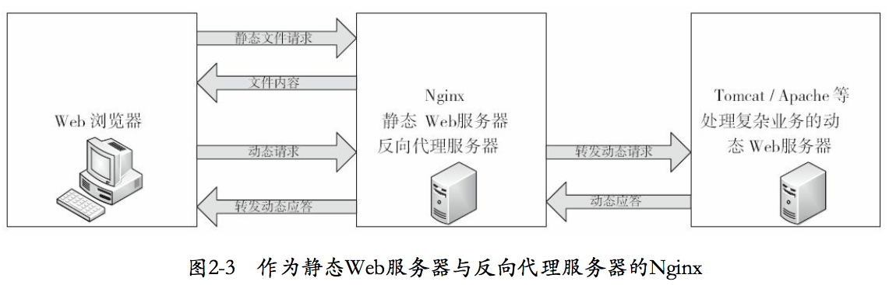

# Nginx

Nginx 是一款轻量级的 Web 服务器/反向代理服务器/电子邮件(IMAP/POP3)代理服务器，其特点是占有内存少，并发能力强。

作用

- 静态web服务器
- 反向代理服务器
- 负载均衡

Nginx 在 unix 系统中会以后台守护进程(daemon)的方式运行，包含一个master进程和多个worker进程。worker进程数最好和cpu内核一致。

master 进程主要来管理 worker 进程，作用如下：

- 接收来自外界的信号
- 向各 worker 进程发送信号
- 监控 worker 进程的运行状态
- 当 worker 进程退出后(异常情况下)，会自动重新启动新的 worker 进程。

worker进程处理网络事件

## 安装

[Nginx安装和配置](https://blog.csdn.net/t8116189520/article/details/81909574)

## 常用命令

Nginx的命令行控制

`$NGINX_HOME` 表示nginx的安装目录，默认为 `/usr/local/nginx`

```sh
# 启动
# 执行Nignx(读取默认路径下的配置文件/usr/local/nginx/sbin/nginx/conf/nginx.conf)
$NGINX_HOME/sbin/nginx
# 另行指定配置文件
$NGINX_HOME/sbin/nginx -c /tmp/nginx.conf
# 另行指定安装目录
$NGINX_HOME/sbin/nginx -p /usr/local/nginx/
# 另行指定全局配置项的启动方式(执行其他命令时，也需要带上-g和它的参数，否则会出错)
$NGINX_HOME/sbin/nginx -g "pid /var/nginx/test.pid;"

# 测试
# 测试配置文件是否有错(不启动)
$NGINX_HOME/sbin/nginx -t
# 不输出error级别以下的错误信息
$NGINX_HOME/sbin/nginx -t -q

# 显示信息
# 版本信息
$NGINX_HOME/sbin/nginx -v
# 编译阶段的参数
$NGINX_HOME/sbin/nginx -V

# 停止
# 强制停止(-s表示发送信号量)
$NGINX_HOME/sbin/nginx -s stop
# 处理完当前所有请求后停止
$NGINX_HOME/sbin/nginx -s quit

# 重新加载配置
$NGINX_HOME/sbin/nginx -s reload

# 日志回滚
$NGINX_HOME/sbin/nginx -s reopen

# 平滑升级（不需要重启）
# 1. 通知旧版本Nginx准备升级
kill -s SIGUSR2 <nginx master pid>
# 2. 启动新版本（此时新旧版本同时运行）
# 3. 关闭旧版本

# 帮助，使用-h或-?会显示支持的所有命令行参数
```

reload命令工作原理

1. 主进程接收到重载配置文件的命令，先检查配置文件语法的合法性，如果没有错误，则会重新加载配置文件。
    1. 如果成功，则主进程会重新创建一个子进程并且发送关闭请求给以前的子进程。
        1. 老的子进程在接受关闭的命令后，会停止接受新的请求并且继续处理当前的请求，直到处理完毕。之后，该子进程就直接退出了。
    2. 如果没有成功，主进程会回滚改动并且继续使用以前的配置。

在 Unix 工具的帮助下，比如使用 kill 工具，“退出”信号会被发送给 nginx 进程。在这种情况下，信号会被直接发送给带有进程 ID 的进程。

Nginx 的主进程的进程 ID 是写死在 nginx.pid 文件中的。该文件通常放在 /usr/local/nginx/logs 或者 /var/run 目录下。比如，如果主进程的 ID 是 1628，为了发送 QUIT 信号来使 nginx 优雅退出，可以执行：kill -s QUIT 1628

## 配置

Nginx 是由一些模块组成，我们一般在配置文件中使用一些具体的指令来控制它们。如，只有当配置 `http{...}` 这个配置项时，ngx_http_module 模块才会在 Nginx 中启用。

指令被分为简单指令和块级命令。以 # 开头的行，会被当做注释。

```sh
# 简单指令
配置项名 [参数];

# 块级指令
块配置项名 [参数]{
    配置项名 配置项值 [配置项值...];
    ...
}
```

块配置项由一个块配置项名和一对大括号组成，表示大括号内的配置项同时生效。可以嵌套，内层块直接继承外层块的配置，如果同名，一般是内层块内部会覆盖外层块的配置。

如果一个块级指令的大括号里有其他指令，则它被叫做一个上下文（比如：events，Module ngx_http_core_module，server，和 location）

在配置文件中，没有放在任何上下文中的指令都是处在主上下文中。events 和 http 的指令是放在主上下文中，server 放在 http 中, location 放在 server 中。

配置项值如果包含空格，需要用单引号或双引号括住。多个配置项值以空格分隔。

### 单位和变量

时间：ms(毫秒), s(秒), m(分钟), h(小时), d(天), w(周7d), M(月30d), y(年365d)

大小：k or K(千字节kb), m or M(兆字节mb)

仅某些模块支持变量，如 `$remote_addr`

### 基本配置

所有其他模块执行时都依赖的配置项。某些选项即使没有配置，也会有默认值。

- 用于调试、定位问题的配置项

```sh
# 是否以守护进程(脱离终端、后台运行的进程)方式运行Nginx，默认on
daemon on|off;
# 是否以master/worker方式工作，默认on
master_process on|off;
# error日志的设置，默认 error_log logs/error.log error
error_log path/file level;
# 是否处理几个特殊的调试点
debug_points [stop|abort]
# 仅对指定的客户端输出debug级别的日志(必须放在events{}中)
debug_connection [IP|CIDR]
# 限制coredump核心转储文件的大小
worker_rlimit_core size;
# 指定coredump文件生成目录
working_directory path;
```

- 正常运行必备配置项

```sh
# 设置操作系统上的环境变量
env VAR|VAR=VALUE
# 将其他配置文件嵌入到nginx.conf文件中。path可以是绝对路径，也可以是相对于nginx.conf所在目录的相对路径
include path/file
# pid文件路径。默认 pid logs/nginx.pid;
pid path/file;
# Nginx worker进程运行的用户及用户组。默认 user nobody nobody;
user username [groupname];
# worker进程可以打开的最大句柄描述符个数
worker_rlimit_nofile limit;
# 限制信号队列
worker_rlimit_sigpending limit;
```

- 优化性能的配置项

```sh
# worker进程个数，默认 worker_processes 1;
worker_processes number;
# 绑定worker进程到指定的cpu内核
worker_cpu_affinity cpumask [cpumask...]
# ssl硬件加速
ssl_engine device
# 系统调用gettimeofday的执行频率。一般不必使用。
timer_resolution time;
# worker进程优先级设置，默认 0
worker_priority nice;
```

```sh
# 查看是否有ssl硬件加速设备
openssl engine -t
```

- 事件类配置项

```sh
# 是否打开accept锁(负载均衡锁)，默认on
accept_mutex on|off;
# lock文件(accept锁可能需要)的路径，默认lock_file logs/nginx.lock
lock_file path/file;
# 使用accept锁后，如果没有取到锁，再次取锁需要至少等待的时间间隔，默认 500ms
accept_mutex_delay Nms;
# 批量建立新连接，默认off
multi_accept on|off;
# 选择事件模型
use kqueue|rtsig|epoll|/dev/poll|select|poll|eventport;
# 每个worker的最大连接数
worker_connections number;
```

## 配置静态web服务器

一个经典的静态Web服务器会包含多个server块和location块

### 入门配置

```sh
# 在http块内配置
server {
    server_name image.mall.rainyrun.top; # 域名
    location /images/ {
            root /data;  
    }
    location / {
            root /data/www;
    }
}
```

它监听标准的 80 端口并且可以在本地上通过 http://image.mall.rainyrun.top/ 访问。

对于 URI 以 /images/ 开头的请求，服务器会从 /data/images 目录中，返回对应的文件。例如，nginx 会返回 /data/images/example.png 文件，当接收到 http://image.mall.rainyrun.top/images/example.png 的请求响应时。如果该文件不存在，nginx 会返回一个 404 错误的响应。

没有以 /images/ 开头的 URI 的请求，将会直接映射到 /data/www 目录中。比如，响应 http://image.mall.rainyrun.top/some/example.html 的请求，nginx 会发送 /data/www/some/example.html 文件。

## 配置反向代理服务器

当多个主机域名对应同一个ip地址时，可以使用Nginx作为代理服务器，该ip地址就是nginx服务器的地址。nginx.conf中每个server块就是一个虚拟主机，只处理与之对应的主机域名请求。



### 入门配置

1. 修改本机host文件(位置：`/etc/hosts`)，使多个域名映射到同一个ip地址上。

```sh
# ip[:port] 域名
127.0.0.1 www.mall.rainyrun.top
127.0.0.1 manager.mall.rainyrun.top
```

如果已购买了域名，则不需要这一步。DNS 会将ip和域名映射。

当访问不同端口时，可以通过端口区分。当访问同一个端口时，通过域名区分

- 端口区分：在nginx.conf里的http下配置的多个server监听不同端口即可。
- 域名区分：在nginx.conf里的http下配置的多个server的server_name(域名)不同即可

2. 在 nginx.conf 里配置

```sh
http{
    ...
    server {
        listen 80; # 监听的端口
        server_name www.mall.rainyrun.top; # 虚拟主机的域名或ip
        location / {
            proxy_pass http://localhost:8888; # 实际使用的地址和端口
            index index.html index.jsp; # 设置网站的默认首页
        }
    }
}
```

### 负载均衡的配置项

入门配置

```sh
http{
    upstream mymall {
        server ip1:port1; # 被负载均衡的服务器1
        server ip2:port2; # 被负载均衡的服务器2
        ...
    }
    ...
    server {
        listen 80; # 监听的端口
        server_name www.mall.rainyrun.top; # 虚拟主机的域名或ip
        location / {
            proxy_pass http://mymall; # 实际使用的服务器集群，“域名”需要和upstream的名字保持一致
        }
    }
}
```

即访问 www.mall.rainyrun.top 则会将请求轮询的发送到服务器1和服务器2。

#### upstream

```sh
# 配置块 http
# upstream块
upstream name {...}
```

upstream 块定义了一个上游服务器的集群，用于反向代理中的proxy_pass使用

#### server

server 配置项指定了一台上游服务器的名字，这个名字可以是域名、ip地址端口、Unix句柄等，还可以有以下参数。

- weight=number：设置向这台服务器转发的权重，默认为1
- max_fails=number：与fail_timeout配合使用，在fail_timeout时间段内，如果向这台服务器转发失败次数超过number，则当前的fail_timeout时间段内，该服务器不可用。默认值为1，为0时表示不检查失败次数。
- fail_timeout=time：同上。默认为10s
- down：表示该服务器永久下线，只在使用ip_hash配置项时才有用。
- backup：在使用ip_hash配置项时无效。表示该服务器只是备份服务器。只有非备份服务器全部失效后，才会向该服务器转发请求。

ip_hash，确保同一个客户端的请求只会转发到指定的上游服务器中。与weight不能同时使用

配置多个server表示这些服务器都可以提供服务。

默认的负载均衡策略是轮询，加上weight参数会改变服务器访问的权重。

### 反向代理的基本配置项

#### proxy_pass

```sh
# 配置块 location, if
# proxy_pass
proxy_pass url;
```

proxy_pass 将请求反向代理到url指定的服务器上。url可以是

- 主机名或ip地址+端口
- unix句柄
- upstream块

默认情况下，反向代理不会转发请求中的host头部，需要转发时，需要加上配置。

```sh
proxy_pass http://localhost:8000/uri/
proxy_pass http://unix:/path/to/backend.socket:/uri/
proxy_pass http://backend

# 转发头部
proxy_set_header Host $host;
```

p121 有时间抄上

```sh
# 配置块 http, server, location
# 转发时的协议方法名
proxy_method method;
# 指定哪些http头部字段不能被转发
proxy_hide_header the_header;
# 将原来禁止转发的header设置为允许转发
proxy_pass_header the_header;
# 确定是否向上游服务器发送http包体部分，默认为on
proxy_pass_request_body on|off;

proxy_method POST;
proxy_hide_header Cache-Control;
proxy_pass_header X-Accel-Redirect;
```

### 虚拟主机与请求转发

当多个主机域名对应着同一个ip地址时，可以通过 server 块中的 server_name 来定义虚拟主机，server_name 对应用户请求中的主机域名。每个 server 块就是一个虚拟主机，只处理与之相对应的主机域名的请求。

#### listen

```sh
# 配置块 server
# 监听端口，默认 listen 80;
listen address:port [default_server|backlog=num|rcvbuf=size|sndbuf=size|accept_filter=filter|deferred|bind|ipv6only=[on|off]|ssl];
```

参数含义

- default_server：将所在的server块作为整个Web服务的默认 server 块。没有配置时，第一个server块为默认server块。当一个请求无法匹配配置文件中的所有主机域名时，会使用默认的虚拟主机。
- backlog=num：tcp中backlog队列的大小。
- rcvbuf=size：设置监听句柄的SO_RCVBUF参数
- sndbuf=size：设置监听句柄的SO_SNDBUF参数
- accept_filter=filter：设置accept过滤器，只对FreeBSD有效
- deferred：只有用户真的发送请求数据时，才调用worker进行处理
- bind：绑定当前端口/地址对
- ssl：在当前监听的端口上建立的连接必须基于ssl协议

#### server_name

```sh
# 配置块 server
# 主机域名，默认 server_name "";
server_name name [name...];
```

处理一个http请求时，nginx会取出header中的host，与每个server中的server_name进行匹配，以此决定到底由哪个server块来处理这个请求。

如果匹配到多个server块，则

1. 首先选择所有字符串完全匹配的server_name，如 `www.testweb.com`
2. 其次选择通配符载前面的server_name，如 `*.testweb.com`
3. 再次选择通配符在后面的，如 `www.testweb.*`
4. 最后选择正则表达式的，如 `~^\.testweb\.com$`

server_name ""; 表示匹配没有host这个http头部的请求

为了快速找到server_name，Nginx使用散列表来存储server_name。

```sh
# 配置块：http，server，location
# server_name散列桶占用内存的大小。默认 32|64|128。
server_names_hash_bucket_size size;
# 默认 512
server_names_hash_max_size size;
```

#### location

```sh
# 配置块 server
# location
location [=|~|~*|^~|@] /uri/ {...}
```
location 参数含义

location 会尝试根据用户请求中的uri来匹配上面的/uri表达式，匹配成功，则选择location块中的配置来处理用户请求。uri可以使用正则表达式

- `=` 表示完全匹配
- `~` 表示匹配uri时，大小写敏感
- `~*` 表示忽略大小写
- `^~` 表示只需要前半部分uri参数匹配即可。
- `@` 表示仅用于Nginx服务内部请求之间的重定向，不直接处理用户请求

当一个请求可能匹配多个location时，会被第一个location处理。使用"/"做参数的location，会匹配所有请求。

疑问：有的参考书说，会选择最长的前缀的location。

```sh
# 配置块：http，server，location
# 重定向主机名称的处理。默认on
server_name_in_redirect on|off;
```

### 文件路径的定义

```sh
# 配置块 http, server, location, if
# 设置http请求的根目录。默认 root html;
root path; # 实际路径为：path + 请求uri
# 根据http返回码重定向页面
error_page code [code...] [=|=answer-code] uri|@named_location

# 配置块 location
# 实际路径为 path + 请求uri丢掉和location中的uri相匹配的部分后，剩余的部分
alias path;

# 配置块 http, server, location
# 访问首页，默认 index index.html
index file [file...]; # 访问到第一个可访问的文件为止
# 是否允许递归使用error_page，默认off
recursive_error_pages on|off;

# 配置块 server, location
# try_files
try_files path [path...] uri;
```

### 内存及磁盘资源的分配

```sh
# 配置块 http, server, location
# http包体只存储到磁盘文件中，默认off
client_body_in_file_only on|clean|off;
# http包体尽量写入到一个内存buffer中，默认off
client_body_in_single_buffer on|off;

# 配置块 http, server
# 存储http头部的内存buffer大小
```

p93，有时间抄一份

- 网络连接的配置
- MIME类型的设置
- 对客户端请求的限制
- 文件操作的优化
- 对客户端请求的特殊处理

## 内核调优

修改/etc/sysctl.conf来更改内核参数
执行sysctl-p命令，使修改生效

## keepalived

实现主备

## 日志

如果你发现有些地方出了问题，你可以在 /usr/local/nginx/logs 或者 /var/log/nginx 目录下的 access.log 和 error.log 文件中，找到原因。

## 参考资料

[官方文档](http://nginx.org/en/docs/)

《深入理解Nginx：模块开发与架构解析》

[Nginx模块和配置项](http://wiki.nginx.org/Modules)

