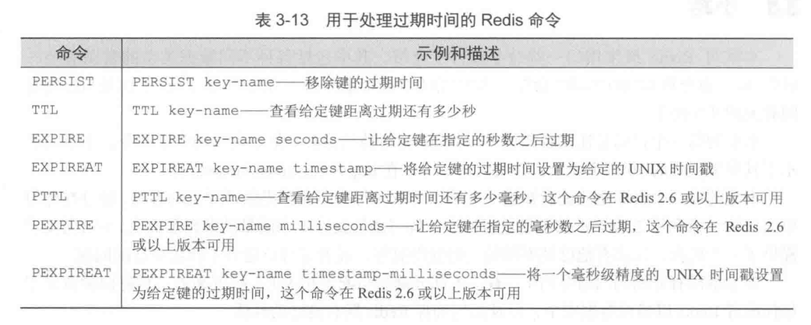

# Redis

## 介绍

由C语言实现的直接操作内存的开源数据库软件

NoSQL：not only SQL

数据库主流类型

- 键值对数据库（redis）
- 列存储数据
- 文档型数据库
- 图形数据库

应用场景

- 缓存
- 分布式集群架构中的session分离
- 任务队列（秒杀）
- 排行榜
- 网站访问统计
- 数据过期处理(expire)

作用

1. 存储key和5种不同类型的value之间的映射
2. 将存储在内存的键值对数据持久化到硬盘
3. 使用复制特性扩展读性能
4. 使用客户端分片来扩展写性能

redis 命令不区分大小写，但key区分

redis中的数据都是字符串

redis是单线程的，不适合存储数据较大的数据

## 安装配置

目录(Mac)：usr/local

[安装和配置](https://www.jianshu.com/p/4f75db8b56fd)

### 启动

$REDIS_HOME表示redis的安装目录

```sh
# 前端启动
$REDIS_HOME/bin/reids-server
# 后端启动。需要配置redis.conf中的daemonize=yes (修改为守护模式)
$REDIS_HOME/bin/redis-server $REDIS_HOME/redis.conf
# 打开redis客户端
$REDIS_HOME/bin/redis-cli 
# 连接到另一个服务器上的redis
$REDIS_HOME/bin/redis-cli -h [ipaddr] -p [port]`
# 关闭redis
$REDIS_HOME/bin/redis-cli shutdown
```

## 命令

使用内存存储，有5种数据类型，每种数据类型都有自己的专属命令。

redis控制5种数据类型

| 数据类型 | 说明 |
|----|----|
| 字符串(String) | 可以是字符串、整数、浮点数 |
| 列表(List) | 一个链表，链表上的每个节点都包含了一个字符串 |
| 集合(Set) | 包含字符串的collection，无序，唯一 |
| 散列(Hash) | 包含键值对的无序散列表 |
| 有序集合(Zset) | 字符串member与浮点数score之间的有序映射 |

### 仓库命令

|命令|作用|
|--|--|
|move key 1|将key移动到1号仓库|
|ping|测试redis是否连通|
|echo||
|dbsize||
|info||
|flushdb|删除当前选择仓库中的所有key|
|flushall|删除所有仓库中的所有key|
|keys *|查看所有的 key|
|select 1|选择数据仓库，最多支持16个仓库（0-15），默认放在0号仓库|

### 字符串

可以存储以下3种类型的值

- 字节串
- 整数（取值范围和long int相同）
- 浮点数（取值范围和double相同）

整数和浮点数有自增、自减操作

|命令|作用|
|--|--|
|set key value|设置 key 的值为 value|
|get key|获取 key 的值|
|incr key|value加一，value需要是整数或浮点数类型|
|decr key|value减一，value需要是整数或浮点数类型|
|incrby key increment|将 value 加上整数increment|
|decrby key increment|将 value 减去整数increment|
|incrbyfloat key increment|将 value 加上浮点数increment（redis2.6+）|
|del key|删除key，适用于所有数据类型|
|exists key|查看此 key 是否存在，1:存在|

当用户将一个不存在的键或者值为空串的键进行自增或自减操作时，这个键的值将被当作0处理。

字符串操作的命令


进行字符串操作时，如果字符串长度不够，会自动填充空字节(null)扩展到需要的长度，位操作时，空字节会被当成0

一个字节的每一位对应的偏移量为[01234567]

### List

列表：是有顺序可重复的，相当于数据结构中的链表，可从左端或右端添加元素。

|命令|作用|
|--|--|
|lpush key value [value ...]|对列表从左添加元素|
|rpush key value [value ...|对列表从右添加元素|
|lpop key|从左端弹出元素|
|rpop key|从右端弹出元素|
|lindex key offset|返回列表中偏移量为offset的元素|
|lrange key start stop|返回列表中[start, end]范围内的所有元素|
|ltrim key start stop|对列表进行修剪，只保留[start, end]范围内的所有元素|
|blpop key [key ...] timeout|从第一个非空key中弹出最左端的元素，如果列表为空，则在timeout秒内阻塞，并等待可能弹出的元素出现|
|brpop key [key ...] timeout|同上，从右侧弹出|
|rpoplpush source destination|从source中弹出右侧元素，推入到destination的左侧，并返回这个元素|
|brpoplpush source destination timeout|同上，如果source为空，则在timeout秒内阻塞并等待可弹出的元素出现|

### Set

集合：无顺序，不能重复

|命令|作用|
|--|--|
|sadd key member [member ...]|向集合key中添加数据，数据不重复，并返回实际加入的元素数量|
|srem key member [member ...]|移除元素，返回被移除的元素数量|
|sismember key member|查询member是否在集合key中|
|scard key|返回集合包含的元素数量|
|smembers key|获取所有元素|
|srandmember key [count]|从集合中随机取出count个元素。count为正，取出的元素不重复；count为负，取出的元素可能重复|
|spop key|随机删除集合中的一个元素，并返回被删除的元素|
|smove source destination member| 将source中的member移除并添加到destination中。成功返回1|


### hash

散列：可以存储多个键值对之间的映射，相当于Map<String, Map<String, String>>。键各不相同，且无序

|命令|作用|
|--|--|
|hset key field value|hash设置值|
|hmset key field value [field value ...]|hash设置多个值|
|hget key field|hash获取值|
|hmget key field [field ...]|从散列里获得一个或多个键的值|
|hdel key field [field ...]|删除键值对，返回实际删除的数量|
|hlen key|散列包含的键值对数量|
|hexists key field|检查制定键是否存在与散列中|
|hkeys key|获取散列包含的所有键|
|hvals key|获取散列包含的所有值|
|hgetall key|获取散列包含的所有键值对|
|hincrby key field increment|将key存储的值加上整数increment|
|hincrbyfloat key field increment|将key存储的值加上浮点数increment|

对散列中一个尚未存储在的键执行自增操作时，Redis会将键的值当作0来处理

### Sorted Set(Zset)

又称zset，用于存储键值对[member, score]，score必须为浮点数。是唯一一个既可以根据member访问元素，又可以根据score和它的排序来访问元素的结构。

|命令|作用|
|--|--|
|zadd key score member [score member ...]|如，zadd zset1 9 a 8 b 7 c 6 d，将带有给定分值的成员添加到有序集合里|
|zrem key member [member ...]|移除元素，返回被移除成员的数据|
|zcard key|集合中的成员数量|
|zincrby key increment member|对成员member的分值增加increment|
|zcount key min max|返回分值介于min和max之间的成员数量|
|zrank key member|返回成员member在有序集合中的排名，排名从0开始|
|zscore key member|返回成员member的分值|
|zrange key start stop [withscores]|返回集合中排名介于start和stop之间的成员。withscores表示将score一并返回。|
|zrevrank key member|返回member的排名，按分值从大到小排|
|zrevrange key start stop [withscores]|返回指定排名范围内的成员，按分值从大到小排|
|zrangebyscore key min max [withscores] [limit offset count]|返回分值介于min和max之间的所有成员|
|zrevrangebyscore key min max [withscores] [limit offset count]|同上，按分值从大到小排|
|zremrangebyrank key start stop|移除集合中排名位于start到stop之间的成员|
|zinterstore destination numkeys key [key ...] [weights weight [weight ...]]|对多个集合(key)进行交集运算，结果存放在 destination 中，numkeys是集合的数量|
|zunionstore destination numkeys key [key ...] [weights weight [weight ...]]|对多个集合(key)进行并集运算，结果存放在 destination 中，numkeys是集合的数量|

可以把集合set作为输入传给zinterstore和zunionstore，集合将被看作是成员分值全为1的有序集合来处理

### 发布和订阅

|命令|作用|
|--|--|
|subscribe channel [channel ...]|订阅1个或多个频道|
|unsubscribe [channel [channel ...]]|退订1个或多个频道，不指定频道则退订全部频道|
|publish channel message|向频道发送消息|
|psubscribe pattern [pattern ...]|订阅与给定模式相匹配的所有频道，如，psubscribe my*|
|punsubscribe [pattern [pattern ...]]|退订与给定模式相匹配的所有频道，不指定模式则退订全部频道|

风险：当客户端在执行订阅操作时断线，可能接受不到断线期间频道发布的消息。

### 排序

|命令|作用|
|--|--|
|sort key [by pattern] [limit offset count] [get pattern [get pattern ...]] [asc|desc] [alpha] [store destination]|根据给定的选项，对输入列表、集合、有序集合进行排序，返回或存储排序结果|

### 过期时间



对于list, set, hash, zset来说，键过期命令只能为整个键设置过期时间，而没办法为键里的field设置过期时间。

## 持久化方案

redis数据都存储在内存中，如果机器挂掉，内存的数据就不存在。需要将数据从内存中同步到硬盘中

持久化方法

1. 时间点转储(point in time dump)
2. 将所有修改了数据库的命令都写入一个只追加(append only)文件里


有2种持久化方法。可以同时使用。

- RDB：快照(snapshotting)，将存在于某一时刻的所有数据都写入硬盘。会产生一个dump.rdb文件（位置：bin目录）。默认开启（bin/redis.conf中）。
  - 特点：可能会发生数据丢失的问题，性能好
- AOF：只追加文件(append-only file)，执行写命令时，将被执行的写命令复制到硬盘里。恢复数据，重新执行一遍即可。
  - 特点：每秒保存，数据比较完整，耗性能。

redis提供的持久化配置选项

```sh
# 快照
save 60 1000 # 当距离上次生成快照有60s，且期间至少有1000次写入时，就会自动触发bgsave命令。
stop-writes-on-bgsave-error no # 快照创建失败后，是否继续执行写命令 
rdbcompression yes # 是否压缩快照
dbfilename dump.db # 快照的文件名
# AOF
appendonly no # 是否开启
appendfsync everysec # 多久同步到硬盘。[always(每个命令都同步), everysec(每秒同步), no(由操作系统决定何时同步)]
no-appendfsync-on-rewrite no # 压缩时是否执行同步
auto-aof-rewrite-percentage 100 # | 
auto-aof-rewrite-min-size 64mb  # | 当aof文件体积大于64mb，且比上一次重写之后体积大了至少100%时，会执行bgrewriteaof命令
# 共享选项，决定了快照和aof文件的保存位置
dir ./
```

创建快照的办法

- 客户端使用bgsave命令来创建快照。redis会调用fork来创建一个子进程将快照写入硬盘，父进程继续处理命令请求。
- 客户端使用save命令来创建快照。redis服务器在快照完成之前不再响应其他命令。
- 设置save配置选项。
- 当通过shutdown命令接受到关闭服务器的请求时，或者接受到term信号时，会执行save命令。
- 当一个redis连接另一个redis，并向对方发送sync命令来进行复制操作时，会执行bgsave命令。

为了解决AOF文件体积不断增大的问题

- 使用bgrewriteaof命令，该命令会移除aof文件中的冗余命令来重写aof文件。

### 复制

从服务器配置

```sh
slaveof host port # host:port 是redis主服务器的地址
```

命令

```sh
slaveof no one # 让服务器终止复制操作
slaveof host port # 开始复制一个新的主服务器
```

### 系统故障

```sh
# 在系统故障发生后，检查aof文件和快照的状态，看是否有错误
redis-check-aof
redis-check-dump
```

更换故障主服务器


## redis集群

因投票机制，至少3个节点。每个节点需要一个备份机，共6台服务器。

ruby环境

yum install ruby
yum install rubygems

mkdir redis-cluster

拷贝6个redis实例

配置redis.conf

```
cluster-enabled yes
port xxxx
```

写启动脚本，启动6个redis服务。需要给脚本设置可执行权限

```sh
# 打开redis服务所在目录
# 启动redis服务
```

从src下拷贝redis-trib.rb到redis-cluster目录
执行创建
/redis-trib.rb create --replicas 1 host:port [host:port ...]


集群使用

启动：./redis-cli -p 7001 -c

-c表示集群
-p表示端口

[redis集群搭建](https://blog.csdn.net/qq_42815754/article/details/82912130)


## Jedis

redis的Java版客户端。在Java项目中使用，需要使用Jedis.jar

连上redis所在的服务器后，直接使用redis命令即可。

```java
// 单机版
public void testJdeis(){
    Jdeis j = new Jdeis(host, port);
    j.set("key", "value");
    j.close();
}

// 单机版，使用连接池
public void testJdeisPool(){
    JedisPool pool = new JedisPool(host, port);
    Jdeis j = pool.getResource();
    j.set("key", "value");
    j.close();
    pool.close();
}

// 集群版
public void testJdeisCluster(){
    // 集群中的所有redis节点的host&port
    Set<HostAndPort> nodes = new HashSet<>();
    nodes.add(new HostAndPort(host,port));
    // 创建集群对象
    JdeisCluster cluster = new JdeisCluster(nodes);
    cluster.set("keycluster","value");
    cluster.close();
}
```

Utils

```java
public class JedisUtils {
    //创建连接池
    private static JedisPoolConfig config;
    private static JedisPool pool;
    
    static{
        config = new JedisPoolConfig();
        config.setMaxTotal(30);
        config.setMaxIdle(2);
        
        pool = new JedisPool(config, "127.0.0.1", 6379);
    }
    
    //获取连接的方法
    public static Jedis getJedis(){
        return pool.getResource();
    }
    
    //释放连接
    public static void closeJedis(Jedis j){
        j.close();
    }
}
```

封装代码

开发一个接口，封装redis的命令。
单机版和集群版写两套代码，根据开发或生产环境，注入不同的redis实现。


## 事务

乐观锁机制。

基本事务：被multi命令和exec命令包围的命令。事务中的所有命令都将被串行化的顺序执行，事务执行期间，redis不会再为其他客户端的请求提供任何服务，保证了事务中的所有命令的原子性。有一条命令失败，其后的命令仍会执行。

|命令|作用|
|--|--|
|multi|开启事务|
|exec|执行事务|
|watch|使用watch命令对键进行监视后，直到用户执行exec命令这段时间里，如果有其他客户端对被监视的键进行了写操作，那么当用户尝试执行exec命令时，会失败并抛出异常。|
|unwatch|在watch执行之后，multi执行之前，对连接进行重置。|
|discard|在multi执行后，exec执行前，对连接进行重置。对连接进行重置。|

## 和spring整合

注入Jedis客户端

```xml
<!-- 单机版：注入jedisclient -->
<bean class="redis.clients.jedis.JedisPool">
  <constructor-arg name="host" value="192.168.56.4"></constructor-arg>
  <constructor-arg name="port" value="6379"></constructor-arg>
</bean>

<!-- 集群版 -->
<bean class="redis.clients.jedis.JedisCluster">
  <constructor-arg name="nodes">
    <set>
      <bean class="redis.clients.jedis.HostAndPort">
        <constructor-arg name="host" value="192.168.25.153"></constructor-arg>
        <constructor-arg name="port" value="7001"></constructor-arg>
      </bean>
      <bean class="redis.clients.jedis.HostAndPort">
        <constructor-arg name="host" value="192.168.25.153"></constructor-arg>
        <constructor-arg name="port" value="7002"></constructor-arg>
      </bean>
      <bean class="redis.clients.jedis.HostAndPort">
        <constructor-arg name="host" value="192.168.25.153"></constructor-arg>
        <constructor-arg name="port" value="7003"></constructor-arg>
      </bean>
      <bean class="redis.clients.jedis.HostAndPort">
        <constructor-arg name="host" value="192.168.25.153"></constructor-arg>
        <constructor-arg name="port" value="7004"></constructor-arg>
      </bean>
      <bean class="redis.clients.jedis.HostAndPort">
        <constructor-arg name="host" value="192.168.25.153"></constructor-arg>
        <constructor-arg name="port" value="7005"></constructor-arg>
      </bean>
      <bean class="redis.clients.jedis.HostAndPort">
        <constructor-arg name="host" value="192.168.25.153"></constructor-arg>
        <constructor-arg name="port" value="7006"></constructor-arg>
      </bean>
    </set>
  </constructor-arg>
</bean>
```

在java代码中使用

```java
@Autowired
private JedisPool jedisPool;
Jedis jedis = jedisPool.getResource();
```


# redis实例

## 文章投票网站的后端

文章属性

- 发布时间
- 支持票数

文章评分 = 支持票x432 + 文章发布时间

redis中文章的存储结构


为了获得排序的文章，使用zset存储文章的排序顺序


为了防止一个用户多次投票，需要文章已投票的用户


投票规则

1. 一个用户对一个文章只能投一次票
2. 文章发布1周后不能再投票

功能逻辑

投票

1. 检查文章是否能投票
    1. 是，检查用户是否已投票
        1. 是，投票失败
        2. 否，投票成功。文章增加投票数，修改评分，修改已投票用户
    2. 否，投票失败

发布文章

1. 构造文章id
2. 构造已投票用户，设置过期时间为1周，并将发布者加入
3. 存储文章数据
4. 将文章加入到两个zset里

取评分最高的文章（or最新发布的文章）

## Web 应用

需求

1. 让用户保持登录状态
2. 记录用户最近浏览的商品
3. 清理多余的会话以及和会话相关的数据
4. 存储购物车中的商品，cookie不再存储购物车。订购商品时会更新购物车信息。
5. 用redis缓存网页
6. 用redis缓存数据行，数据行需要转换成json串。需要定期刷新缓存中的数据，将不需要缓存的数据行移除。
7. 计算用户最常用的商品，并缓存商品详情页

记录已登录用户

存储结构hash

- login:
    - token userId

最近登录用户

存储结构zset

- recent:
    - token 登录时间

用户最近浏览过的商品

存储结构zset

- viewed:token
    - 商品id 浏览时间

用户购物车

存储结构hash

- cart:session
    - 商品id 数量

数据行缓存

存储结构string

- inv:行id
    - 数据库行的json串

数据行调度 zset

- schedule:
    - 行id 加入缓存的时间


数据行更新 set

- delay:
    - 行id 每隔x秒更新

被浏览的商品 zset

- viewed:
    - 商品id 浏览次数的负数


程序逻辑

清理会话

1. 检查recent:里存储的数据数量，看是否超过限定值
    1. 超过，清理最多100个最旧的令牌。同时删除login:中对应的token记录、对应的viewed:token
    2. 未超过。休息1s后重新执行该程序

调度缓存和终止缓存

1. 从schedule:中取出一条数据，查看调度时间是否到达
    1. 是，从delay:中找出对应的数据，查看更新间隔
        1. 更新间隔<=0，从schedule:、delay、inv:行id中删除该数据
        2. 更新间隔>0，从数据库中取出对应行，以json串的形式存储到redis；更新schedule:中的调度时间
    2. 否，休眠50ms后重新执行函数


```
redis 中 value 不显示中文

解决方法： 
启动redis-cli时，在其后面加上--raw即可，汉字即可显示正常。
```


## 参考资料

[官网](https://redis.io/)

[redis命令文档](https://redis.io/commands)

[《redis实战》代码](https://github.com/josiahcarlson/redis-in-action)

[spring-redis整合？](https://www.springsource.org/spring-data/redis)

[redis邮件列表](https://groups.google.com/d/forum/redis-db/)

