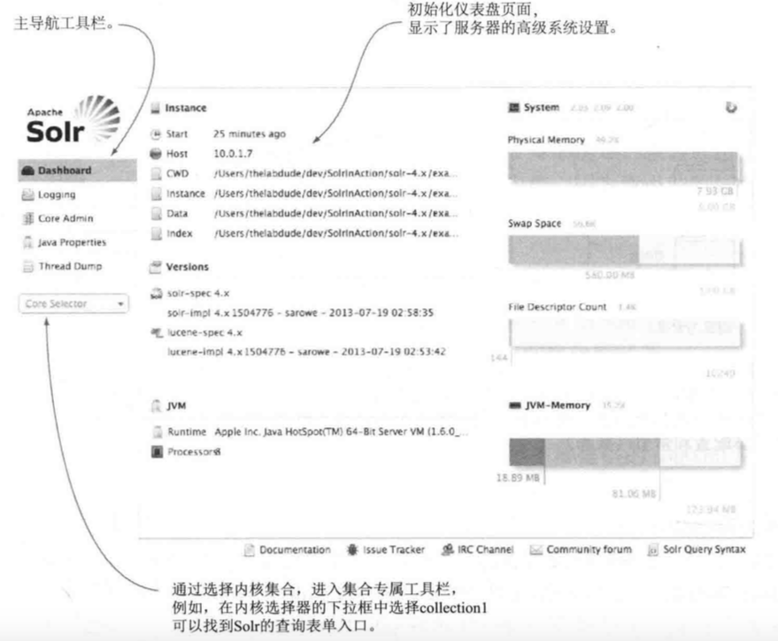
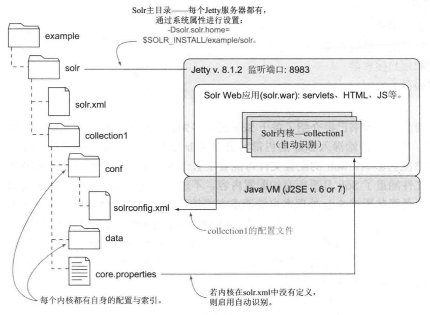

# Solr


## 示例程序

安装 Solr：下载安装包并解压即可

启动示例程序

```sh
# $SOLR_INSTALL 表示solr的安装目录
$SOLR_INSTALL/bin/solr start -e techproducts [-force] # root用户下，需要加上-force。会自动提交文档病生成索引
```

使用 Web 浏览器查看管理控制台。url： `http://localhost:8983/solr/`

常用命令

```sh
# 检查 Solr 是否正在运行
$SOLR_INSTALL/bin/solr status

# 停止
$SOLR_INSTALL/bin/solr stop [options]
$SOLR_INSTALL/bin/solr stop -help

# Solr 版本信息
$SOLR_INSTALL/bin/solr version

solr start –p 端口号 # 单机版启动solr服务
solr restart –p 端口号 # 重启solr服务
solr stop –p 端口号 # 关闭solr服务
solr create –c name # 创建一个core实例
```

### 控制台介绍



删除全部索引数据

```xml
<delete>
    <query>*:*</query>
</delete>
<commit/>
```


## 搜索原理


## 自定义内核

[Solr(7+)部署到tomcat](https://www.jianshu.com/p/573d54d53916)


### 字符

### managed-schema


搜索的两条线

1. 建索引。将符合格式的文档
2. 搜出相关文档

## 搜索流程


Solr 是一个JavaWeb应用，控制台相当于它的前端界面。


Solr的功能

- 为文档建立索引
- 当输入搜索语句(query)后，能通过索引快速匹配到文档，并返回匹配结果

建索引的步骤

1. 提供待索引的文档
	1. 文档需要满足一定的格式(如，json、xml)
	2. 文档由字段构成，字段有各种字段类型。字段类型可以是预定义的，也可以是自定义的。
2. 生成索引
	1. 需要在schema.xml中明确索引需要的字段(文档中某些字段并不适合搜索，因而不需要在构建索引时使用)
	2. 定义字段的类型，告知 Solr 如何处理字段
	3. 对字段内容进行处理，生成索引
3. 有新文档加入时，更新索引。

搜索的步骤

1. 输入搜索语句(query)，并通过HTTP协议，将query传送到Solr
2. 对query进行处理，从索引中找到匹配的文档
	1. 调用请求处理器(RequestHandler)，将query分解成词元流
	2. 通过过滤器，对词元进行处理
	3. 在索引里查找，搜索出合适的结果
	4. 排序
3. 展示搜索结果

## Solr结构

文件结构



Solr内核包含了搜索文档所需的所有功能，可以看成是一个独立的搜索模块。

conf目录存放搜索相关的配置。

data目录存储文档生成的索引。

内核间相互独立，共同存储在Solr主目录下。


Solr 存储有关模式文件中需要理解的字段类型和字段的详细信息。

- managed-schema 是 Solr 默认使用的模式文件的名称，用于支持通过 Schema API 或 Schemaless Mode 功能在运行时进行模式更改。如果您选择了，您可以 显式配置 managed-schema 功能以使用备用文件名，但文件内容仍由 Solr 自动更新。
- schema.xml 是模式文件的传统名称，可以由使用 ClassicIndexSchemaFactory 的用户手动编辑该模式。
- 如果您使用的是 SolrCloud，则您可能无法通过本地文件系统上的这些名称找到任何文件。您将只能通过 Schema API（如果已启用）或通过 Solr 管理界面的Cloud Screens 来查看模式。

### 文档

是提交给solr的数据，可以是新闻报道、简历、用户信息、书……

每个文档包含一个或多个字段，每个字段被赋予具体的字段类型：字符串、标记化文本、布尔值、日期、经纬度……

一个字段类型是由若干分析步骤组成的，这些步骤会决定数据如何在字段中被处理，如何映射到Solr索引中。

字段在Solr的schema中被定义为特定的字段类型。文档中的字段需要被处理时，才会被映射到特定字段类型中。

当首次接收到包含新字段的文档时，solr会自动猜测未知的新字段类型。通过检查字段中的数据类型，自动将字段增加到Solr的schema中。

示例

```xml
<doc>
	<field name="id">company</field>
	<field name="companycity">Beijing</field>
</doc>
```

### 查询

```
必备词项
+word1 +word2
word1 AND word2

可选词项
word1 word2
word1 OR word2

排除词项
-word1
NOT word1

短语搜索
"this is a sequence" OR "another sequence"

通配符搜索
* 0个或多个字符(尽量不要放在首位)
? 单个字符
off*r
off?r

区间搜索
yearsOld:[18 TO 21] 匹配 18、19、20、21（闭区间）
yearsOld:{18 TO 21} 匹配 19、20（开区间）
yearsOld:[18 TO 21} 匹配 18、19、20

模糊/编辑距离搜索
编辑距离被定义为一次插入、删除、替换、位置互换。
Solr使用~表示模糊编辑距离搜索。默认匹配与原始词项距离2个编辑距离的词项。
administrator~（与administrator有2个以内的编辑距离的词）
administrator~N（与administrator有N个以内的编辑距离的词）

邻近搜索
"chief officer"~1（chief和officer之间最多可以相隔1个词）
```

## 配置

core.properties

```
name=coreName (配置内核的名字，用来自动发现内核)
```

solrconfig.xml


### 分词器


## 索引


### 字段

字段分析

字段类型定义可以包括以下四种类型的信息：

- 字段类型的名称（必填）。
- 一个实现类的名字（必填）。
- 如果一个字段的类型是 TextField，则为字段类型的字段分析说明。
- 字段类型属性取决于实现类，一些属性可能是强制性的。

实现类负责确保字段被正确处理。

可以为给定字段类型指定的属性分为三个主要类别：

- 特定于字段类型的类的属性。
- 常规属性 Solr 支持任何字段类型。
- 字段默认属性可以在字段类型上指定，这些字段将由使用此类型而不是默认行为的字段继承。

域 field

页面上展示的字段

SolrHome是Solr运行的主目录，该目录中包括了多个SolrCore目录。SolrCore目录中包含了运行Solr实例所有的配置文件和数据文件，Solr实例就是SolrCore。

一个SolrHome可以包括多个SolrCore（Solr实例），每个SolrCore提供单独的搜索和索引服务。（类似于MySQL数据库服务器可以创建多个数据库）

分析器是绑定在域的类型中的。在schame.xml可以进行配置

定义Field域

```xml
<field name="id" type="string" indexed="true" stored="true" required="true" multiValued="false" />
```

- Name：域的名称
- Type：域的类型
- Indexed：是否索引
- Stored：是否存储
- Required：是否必须
- multiValued：是否是多值，存储多个值时设置为true，solr允许一个Field存储多个值，比如存储一个用户的好友id（多个），商品的图片（多个，大图和小图）


文档的格式


中文分词器


## Solr结构


Solr Home

Solr 主目录包含重要的配置信息，并且是 Solr 将存储其索引的地方。

结构

- 主目录 用来存放内核
	- 内核1 
		- conf目录(放配置文件)
		- data目录(放索引)
	- 内核2

主目录由solr.xml配置，4.4版本后，内核可被自动发现。

每个solr服务器有且仅有一个包含所有内核的主目录。


## SolrJ

solrj是访问Solr服务的java客户端，提供索引和搜索的请求方法，SolrJ通常在嵌入在业务系统中，通过SolrJ的API接口操作Solr服务，如下图：

solr 擅长处理的数据表现为4个主要特征
1. 以文本为中心
2. 读主导
3. 面向文档
4. 灵活的模式


solr查询表单


solr配置

- solr.xml 定义管理、日志、分片和solrCloud的有关属性
- solrconfig.xml 定义Solr内核的主要配置
- schema.xml 定义索引结构，包括字段及其数据类型

使用全局Java属性(solr.solr.home)来定位配置文件的根目录。Solr在主目录下扫描包含core.properties文件的文件夹，该文件定义了Solr中自动发现内核的基本属性。

Files连接：显示了core的所有配置文件的目录结构

Solr不会自动识别配置文件的更改，需要重新加载内核之后才会生效。
1. 点击控制管理台中的内核管理中的reload按钮
2. 使用内核管理AP编写程序重载内核

sorlconfig.xml

```xml
<config>
	<!-- 配套的lucene版本 -->
	<luceneMatchVersion>8.2.0</luceneMatchVersion>
	<lib dir="" regix=".jar" />
	<lib path="../../.jar" />
	<jmx />

	<requestHandler name="/select" class="solr.SearchHandler">
		<lst name="defaults">
			<str name="echoParams">explicit</str>
			<int name="rows">10</int>
		</lst>
	</requestHandler>

	<!-- 过滤器缓存的初始配置
		autowarmCount 预热的过滤器数量
	 -->
	<filterCache class="solr.LFUCache"
		size="100"
		initialSize="20"
		autowarmCount="10" />
	<!-- 查询结果缓存 -->
	<queryResultCache class="solr.LFUCache"
		size="512"
		initialSize="512"
		autowarmCount="0" />
</config>
```

- lib 依赖的jar包
	- dir属性 是以内核的根目录为起点的相对路径。内核的根目录也被称为内核的instanceDir
	- regix 指向jar包的正则表达式
	- path 指向jar包
- jmx 用于激活Solr的MBeans，它是一个Java对象，可以调用Java管理扩展JMX的API获得Solr的配置参数和统计信息。
- requestHandler 请求处理器
	- 利用solr.前缀简写Solr类的名称。(指向Solr的核心java包，如analysis.、schema.、request.)运行时再解析至相应的内置Solr类
	- 只启用了默认值修饰

请求处理器

有2类请求处理器
	- 处理查询请求的搜索处理器
	- 处理索引请求的更新处理器

搜索处理器的组成（每个组件都定义在solrconfig.xml中）
- 请求参数修饰组件
	- 默认值修饰(defaults)	为客户端未指定值的参数添加默认值
	- 常量修饰(invariants)	将客户端的参数值覆写为固定值
	- 后缀修饰(appends)		在客户端请求的末尾添加额外参数
- 预处理组件(first-components)一组优先执行的可选搜索组件，执行预处理任务
- 主搜索组件(components)		一组链式组合的搜索组件，至少包含查询组件
- 后处理组件(last components)	一组可选的链式组合的搜索组件，执行后处理任务

搜索组件

查询组件

查询组件利用处于活跃状态的搜索器对查询语句进行解析和执行。

查询语句的解析策略由defType参数指定。

查询组件默认处于启用状态，所有的其他组件则需要在查询请求中指定相应的参数来启用。

分面组件

搜索器

Solr所有查询语句都由一个叫“搜索器”的组件处理。任何时候只能存在一个处于活跃状态的搜索器。所有搜索请求处理器中的查询组件都向这个搜索器发起查询请求。

提交操作会创建新的搜索器，以保证更新后的文档和索引可以被搜索器检索到。

schema的设计过程实际是确定文档如何表征为Solr索引的过程。

索引字段

用户可以对该字段的内容进行搜索

需要对索引字段进行标记

存储字段

需要在搜索结果中展示的字段

schema.xml(或者 managed-schema)

```xml
<!-- 名称仅用于展示目的，版本仅用于Solr内部，启用具体功能 -->
<schema name="example"
	version="1.5">
	<fields>
		<!-- 字段 -->
		<field name="id" type="string" indexed="true" stored="true" />
		<!-- 多值字段 -->
		<field name="link" type="string" indexed="true" stored="true" multiValued="true" />
		...
		<!-- 动态字段 -->
		<dynamicField name="*_s" type="string" indexed="true" stored="true" />
	</fields>

	<!-- 标识唯一字段 -->
	<uniqueKey>id</uniqueKey>

	<!-- 从一个字段向另一个字段复制，字段必须是已被定义的 -->
	<copyField source="" dest="" />

	<!-- 字段类型 -->
	<types>
		<fieldType name="string" class="solr.StrField" ... />
	</types>
</schema>
```

字段field

Solr根据字段定义来调用合适的字段分析器，将字段内容解析为词项，添加到倒排索引中。

动态字段
可以对文档中的一些字段赋予相同的定义，其名称匹配采用前缀(s_*)或后缀(*_s)模式

复制字段
将一个或多个字段值填充到一个字段中。

Solr为结构化数据内建了许多字段类型。如，数字、日期、地理位置


添加文档到Solr

```xml
<add>
	<doc>
		<field name="id">value</field>
		...
	</doc>
	<doc>
		...
	</doc>
</add>
```

## SolrJ

SolrJ是Solr的Java版客户端，用来操作Solr。

依赖

```xml
<dependency>
    <groupId>org.apache.solr</groupId>
    <artifactId>solr-solrj</artifactId>
    <version>8.2.0</version>
</dependency>
<dependency>
    <groupId>commons-logging</groupId>
    <artifactId>commons-logging</artifactId>
    <version>1.2</version>
</dependency>
```

- 添加(修改)文档索引

```java
public void testAddDocument(){
	// 创建 HttpSolrClient.Builder 对象，通过它创建客户端通信
    HttpSolrClient.Builder builder = new HttpSolrClient.Builder("http://localhost:8983/solr");
    HttpSolrClient solr = builder.build();
	// 新建被索引的文档
	SolrInputDocument doc = new SolrInputDocument();
	doc.setField("id", "1");
	//...
	// 添加，需要制定要添加的core
	sorl.add("coreName", doc);
	// 提交到制定的core
	sorl.commit("coreName");
}
```

- 删除文档

```java
public void testDelete() throws Exception{
    // 创建 HttpSolrClient.Builder 对象，通过它创建客户端通信
    HttpSolrClient.Builder builder = new HttpSolrClient.Builder("http://localhost:8983/solr");
    HttpSolrClient solrClient = builder.build();
    // 根据id删除文档
    solrClient.deleteById("coreName", "1");
    // 根据query删除文档
    solrServer.deleteByQuery("item_title:vivo手机hahaha");
    // 提交
    solrClient.commit("coreName");
}
```

- 搜索（查询）

```java
public void testQuery(){
	// 创建 HttpSolrClient.Builder 对象，通过它创建客户端通信
    HttpSolrClient.Builder builder = new HttpSolrClient.Builder("http://localhost:8983/solr");
    HttpSolrClient solr = builder.build();
	SolrQuery query = new SolrQuery();
	// 设置主查询条件
	// SolrQuery query = new SolrQuery("*:*");
	query.setQuery("小红帽");
	// 设置过滤条件
	query.addFilterQuery("item_price:[0 to 300]");
	// 设置分页(从第0个记录开始，查10条数据)
	query.setStart(0);
	query.setRows(10);
	// 设置默认搜索域
	query.set("df","item_title")
	// 设置高亮
	query.setHighlight(true);
	query.setHighlightSimplePre("<em style=\"color:red\">");
	query.setHighlightSimplePost("</em>");
	// 设置高亮显示的域
	query.addHighlightField("item_title");
	// 取高亮
    Map<String, Map<String, List<String>>> highlighting = queryResponse.getHighlighting();
	// 执行查询
	QueryResponse response = solr.query(query);
	// 获取结果集
	SolrDocumentList results = response.getResults();
	// 遍历结果
	for(SolrDocument doc : results){
		print(doc.get("id"));
		print(doc.get("item_title"));
		List<String> titleList = highlighting.get(solrDocument.get("id")).get("item_title");
        if (titleList !=null && titleList.size()>0) {
            //能取到高亮,输出高亮
            System.out.print(titleList.get(0));
        }
	}
}

public void queryTest() throws Exception {
    //1.创建 HttpSolrClient.Builder 对象，通过它创建客户端通信
    HttpSolrClient.Builder builder = new HttpSolrClient.Builder("http://localhost:8983/solr");
    HttpSolrClient solrClient = builder.build();
    //2.创建一个map封装搜索条件
    Map<String, String> queryMap = new HashMap<>();
    queryMap.put("q","音乐盒");//关键字
    queryMap.put("df", "product_name");//默认搜索域
    //queryMap.put("sort","id asc");//结果以 id 升序排列,默认以关联度排序
    queryMap.put("rows","20");//默认只有十条
    //3.使用map创建 MapSolrParams 对象
    SolrParams solrParams = new MapSolrParams(queryMap);
    //4.使用客户端进行查询
    QueryResponse response = solrClient.query("product", solrParams);
    //5.提取结果
    SolrDocumentList documents = response.getResults();
    //6.循环输出
    documents.forEach(document ->{
        System.out.println("编号" + document.get("id") + ":" + document.get("product_name"));
    });
}
```


DIH

数据导入处理器

可以与具备主流JDBC驱动的任何数据库对话，DIH组件会对数据库进行查询，将查询结果转换为Solr索引需要的文档。

更新处理器

处理文档提交到索引的请求，并让这些文档可以被搜索

负责索引的所有更新请求，包括提交与优化请求。

更新处理器配置
```xml
<updateHandler class="solr.DirectUpdateHandler2">
	<!-- 更新事件监听器 -->
	<updateLog>
		<str name="dir">${solr.ulog.dir:}</str>
	</updateLog>
	<!-- 自动提交策略 -->
	<autoCommit>
		<!-- 每隔15s提交一次 -->
		<maxTime>15000</maxTime>
		<!-- 每500个文档提交一次 -->
		<maxDocs>500</maxDocs>
		<!-- 提交后不打开一个新搜索器 -->
		<openSearcher>false</openSearcher>
	</autoCommit>
	<!-- 软自动提交策略 -->
	<autoSoftCommit>
		<maxTime>1000</maxTime>
	</autoSoftCommit>
	<!-- 启用事务日志 -->
	<listener event="postCommit" ...>
		...
	</listener>
</updateHandler>
```

硬提交

文档写入磁盘。需要开启一个新搜索器。

软提交

支持近实时搜索。软提交使得文档可以被搜索到，不需要写入持久存储上。但某一时刻仍需要硬提交。

事务日志

确保提交到索引并已接受的更新保存在持久存储器。

更新字段

```xml
<add>
	<doc>
		<field name="id">1</field>
		<field update="set" name="retweet_count_ti">100</field>
	</doc>
</add>
```

积极的并发控制

```xml
<field name="_version_" type="long" indexed="true" stored="true" />
```

当添加一个新文档时，Solr会自动分配一个唯一版本号

solrconfig.xml配置

索引管理

默认情况下，Solr为内核设置一个数据目录，将数据存储在本地文件系统中。

在solrconfig.xml中使用 `<dataDir>` 元素定位data目录

solr.data.dir 属性是内核的默认数据目录，可以在sorl.xml中修改。

文本分析消除了索引词项和用户搜索词项之间的语言差异.

文本分析的基本元素

- 分析器(Analyzer)
- 分词器(Tokenizer)
- 分词过滤器(TokenFilter)
- 字符过滤器(CharFilter)

如果Solr的预定义字段类型无法满足需要，可以使用Solr插件框架创建自己的字段类型。

分析器将字段文本分解称为词元

```xml
<fieldType name="text_general" class="solr.TextField" positionIncrementGap="100">
	<!-- 为索引文档定义分析器 -->
	<analyzer type="index">
		<!-- 分词器将字段文本分解为词元 -->
		<tokenizer class="solr.StandardTokenizerFactory" />
		<filter class="solr.StopFilterFactory" ignoreCase="true" words="lang/stopwords_en.txt" />
		<filter calss="solr.LowerCaseFilterFactory" />
	</analyzer>
	<!-- 为分析查询表达式定义分析器 -->
	<analyzer type="query">
		<!-- 标准分词器 -->
		<tokenizer class="solr.StandardTokenizerFactory" />
		<!-- 停用词过滤器 -->
		<filter class="solr.StopFilterFactory" ignoreCase="true" words="lang/stopwords_en.txt" />
		<!-- 同义词过滤器 -->
		<filter class="solr.SynonymFilterFactory" synonyms="synonyms.text" ignoreCase="true" expand="true" />
		<!-- 小写转换过滤器 -->
		<filter calss="solr.LowerCaseFilterFactory" />
	</analyzer>
</fieldType>
```

字符过滤器

CharFilters

可对文本字符进行添加更改和移除


分析器

用元素 `<analyzer>` 定义。最好定义2个，一个用于分析索引时的文本，一个用于分析用户搜索输入的文本。

每个 `<analyzer>` 将文本分析过程分为2个阶段：语词切分(解析)、语词过滤。

分词器

用元素 `<tokenizer>` 定义。

语词切分(解析)

文本会以各种解析形式(如，空格、标点)被拆分成词元流

分词过滤器

对词元执行以下3种操作中的一种

- 词元转换：改变词元的形式，如，字母小写、词干提取
- 词元注入：向词元流中添加一个词元，如，同义词过滤器
- 词元移除：删除不需要的词元，如，停用词过滤器。

请求处理器

功能

Solr所有请求的入口

接受请求、执行功能、向客户端返回结果

基础类

SolrRequestHandler

接口

SolrRequestHandler

请求处理器的name以"/"开头，就使用该请求处理器的相对url。如select请求处理器

`http://host:port/solr/corename/select/`


搜索组件

是在搜索处理器声明周期内发生的可配置的处理步骤。搜索组件让搜索处理器将实现单个搜索请求的可重用功能组合链接在一起。

```xml
<!-- 搜索组件只需定义一次，可被任意数量的请求处理器调用 -->
<searchComponent name="query" class="solr.QueryComponent" />
<searchComponent name="facet" class="solr.FacetComponent" />

<requestHandler name="/select" class="solr.SearchHandler">
	<arr name="components">
		<str>query</str>
		<str>facet</str>
	</arr>
</requestHandler>
```

查询解析器

使用url中的defType修改默认查询解析器

`/select?defType=edismax&q=...`

修改查询中使用的查询解析器

`/select?q={!edismax}hello world OR {!lucene}title:"my title"`

局部参数

为特定上下文提供定制化请求参数。

语法

`{!param1=value1 param2=value2 ... paramN=valueN}` 

如果关键词搜索不指定字段的话，它会在默认字段上搜索。type是局部参数的默认键

关闭过滤器

fq={!cache=false}id:123

执行成本
fq={!cost=1}category:technology

执行成本大于等于100的过滤器都被视为后置过滤器

Lucene 查询解析器

字段搜索
字段名：搜索表达式
title:solr content:(search engine)

一般在定义的默认字段上进行关键词搜索

假如默认字段是content
则

solr
content:solr

title:apache solr
title:apache content:solr

在同一个字段中搜索多个词项
title:(apache solr)

搜索短语（将短语作为一个整体进行搜索）
title:"apache solr"

必备词项

要求词项在文档中必须出现
+solr
apache AND solr
apache && solr
+apache +solr

可选词项

默认运算符是OR

apache OR solr
apache || solr
apache solr

组合表达式

(apache AND (solr OR lucene)) AND title:(apache solr)

词项邻近度

"apache software foundation"~2
对原始短语进行不超过2个位置的词项移动。短语搜索可以看成是隐含距离为0的邻近搜索。

字符邻近

solr~1
查找出词项solr的编辑距离为1的相关词项，如sol、sor等

排除词项

文档中不包含某个词项

solr -panel
solr NOT panel
solr AND NOT(panel OR electricity)

区间搜索

闭区间搜索

number:[12.5 TO 100]
date:[2013-11-04T10:05:00Z TO NOW-1DAY]
string:[ape TO apple]

日期必须使用祖鲁时间(Zulu time)

不限定上下限
number:[100 TO *]
number:[* TO 0]

开区间搜索

number:{0 TO 100}

混合使用

number:[1 TO 100}

通配符搜索

* 表示1个或多个字符
? 表示某个字符

权重表达式

调整相关度权重

(apache^10 solr^1.23) AND (apache lucene^2.5)^10

特殊字符转义

将特殊字符用引号扩起来，或者使用"\"进行转义

q=content:"I'm" so "happy!!!" ":)"
q=content:(I\'m so happy\!\!\! \: \))


eDisMax 查询解析器

由 Lucene 查询解析器和 DisMax 查询解析器组成。

eDisMax 查询解析器
1. 支持 Lucene 查询解析器的所有语法
2. 不会对无效的输入语法抛出异常，而是会将它作为文本字符串进行搜索。
3. 可以理解小写转换后的AND和OR
4. 可以对多个字段进行搜索

对多个字段进行搜索

通过指定查询字段(qf)
q=solr in action&qf=title description author
调整权重
q=solr in action&qf=title^1.5 description author^3

字段别名

通过在请求中添加参数

f.{alias}.qf={realfield}

/select?defType=edismax&q=title:"some title"&f.title.qf=title_t_en

title 是 title_t_en 的别名，查询将在 title_t_en 字段上进行

适用于动态字段名

可用字段

uf=title city date

禁用所有字段

uf=-*

禁用某些字段

uf=* -hiddenFiled1 -hiddenFiled2

uf参数既接受真实字段，也接受别名

参数解释

wt
write type
响应格式

fl
field list
字段列表
定义了搜索结果中每个文档需要返回的字段

文档转换器

使用方法
/select?...&fl=*,[explain],[shared]


默认排序

相关度得分
Lucene内部文档编号(升序)

sort参数
修改默认排序

sort=score desc, date asc

排序字段必须在schema.xml中标记为indexd=true

对缺失值排序

sortMissingLast 不包含该字段值的所有文档都显示在搜索结果排序列表的末尾
sortMissingFirst

```xml
<fieldType name="string" class="sort.StrField"
	sortMissingLast="true"
	sortMissingFirst="false" />
```

调试查询结果

在请求中传入debug=true，激活DebugComponent


中文分词器

managed-schema

```xml
<!-- ik分词器 -->
<fieldType name="text_ik" class="solr.TextField">
    <!-- 索引分词器 -->
    <analyzer type="index">
        <tokenizer class="org.wltea.analyzer.lucene.IKTokenizerFactory" useSmart="false" conf="ik.conf"/>
        <filter class="solr.LowerCaseFilterFactory"/>
    </analyzer>
    <!-- 查询分词器 -->
    <analyzer type="query">
        <tokenizer class="org.wltea.analyzer.lucene.IKTokenizerFactory" useSmart="true" conf="ik.conf"/>
        <filter class="solr.LowerCaseFilterFactory"/>
    </analyzer>
</fieldType>
```

业务域

```xml
<field name="item_title" type="text_ik" indexed="true" stored="true" />
```


数据导入到索引库


集群

httpclient


## solrCloud

跨多个节点的索引分割称为集合(collection)。

Zookeeper作为集群的配置信息中心

Collection 的索引被分成N片，每片存储在不同的Solr服务器上。服务器最好有一个备份。

使用zookeeper集群来管理solrCloud


属性文件放在zookeeper上

zookeeper 3个

core 4个

### zookeeper集群

在每个zoo.cfg里加上

```
server.1=ip:port1:port2
server.2=ip:port1:port2
server.3=ip:port1:port2
```

1，2，3是节点id

port1是通信端口
port2是投票端口


写一个shell文件，启动所有zookeeper，或者关闭所有。

zkcli -server:port 

### solr集群

4个tomcat上运行solr，并进行配置tomcat的server.xml和solrhome


测试集群

```java
public void testAdd(){
	// 创建solrserver 集群的实现类
	CloudSolrServer cloud = new CloudSolrServer("ip1:port1,ip2:port2,ip3:port3");
	// 设置默认的搜索collection
	cloud.setDefaultCollection("collectionName");
	// 创建solrinputdocument对象
	SolrInputDocument doc = new SolrInputDocument();
	// 添加域到文档
	doc.addField("id", "123");
	// 将文档提交到索引库
	cloud.add(doc);
	// 提交
	cloud.commit();
}
```


Solr可以检索Document里面的内容
Document由Field组成
Field有name、type、indexed、stored等属性。name用来标识这个field，type指示如何处理这个Field的内容，indexed表示field的内容是否可以搜索，stored表示是否将field存储到索引
type的类型有string、等
还可以自定义FieldType

solr相关的配置在schema.xml(或者managed-schema)中配置

配置的内容有

FiledType：field类型，告知field应该如何处理。

```xml
<fieldType name="string" class="solr.StrField" sortMissingLast="true" />
<fieldType name="boolean" class="solr.BoolField" sortMissingLast="true"/>
<fieldType name="pint" class="solr.IntPointField" docValues="true"/>
```

class 决定了这个fieldType的行为

solrconfig.xml


## 安装DataImport插件

Dataimport插件说明

使用该插件后，可以在管理界面直接从数据库导入数据到索引库。（即：一个插件解决入门示例中，创建索引的全部操作）

3.2.2 安装步骤

（1）拷贝相关 jar 包到文件夹

solr-dataimporthandler.jar

mysql-connector-java.jar

（2）修改 \solr-8.2.0\server\solr\product\conf\solrconfig.xml 文件，增加以下代码

```xml
<!-- 新增 dataimport -->
<requestHandler name="/dataimport" class="org.apache.solr.handler.dataimport.DataImportHandler">
	<lst name="defaults">
		<str name="config">DIHconfig.xml</str>
	</lst>
</requestHandler>
```

（3）在 \solr-8.2.0\server\solr\product\conf\ 目录下新建 DIHconfig.xml 文件，并编写以下内容

```xml
<dataConfig>
    <dataSource type="JdbcDataSource"
                driver="com.mysql.cj.jdbc.Driver"
                url="jdbc:mysql://localhost:3306/solr?serverTimezone=UTC&amp;useUnicode=true&amp;characterEncoding=utf8&amp;useSSL=false"
                user="root"
                password="password"
    />
    <document>
        <entity name="product"
                query="SELECT * FROM products">
            <field column="pid" name="id"/>
            <field column="name" name="product_name"/>
            <field column="price" name="product_price"/>
            <field column="category_name" name="product_category_name"/>
            <field column="description" name="product_description"/>
            <field column="picture" name="product_picture"/>
        </entity>
    </document>
</dataConfig>

```

（4）重启 solr 服务

image

3.2.3 测试

（1） 清空索引库

image

（2）导入索引库

image


## 入门程序


## 参考资料

《Sorl in action》

[入门及原理](https://blog.51cto.com/wyait/1944677)

[Solr官方参考文档](https://www.w3cschool.cn/solr_doc/solr_doc-xcdq2fly.html)

[全文检索原理](https://www.jb51.net/article/129238.htm)

[Solr(7+)部署到tomcat](https://www.jianshu.com/p/573d54d53916)

[IK分词器下载地址](https://github.com/magese/ik-analyzer-solr)


## 待整理

常用命令

```sh
cd $SOLR_INSTALL/example/exampledocs
java -jar post.jar *.xml
```


