# Solr

Solr 是一个文档存储与检索引擎，可以帮助我们实现全文检索功能。

## 示例程序

安装 Solr：下载安装包并解压即可

启动示例程序

```sh
# $SOLR_INSTALL 表示solr的安装目录
$SOLR_INSTALL/bin/solr start -e techproducts [-force] # root用户下，需要加上-force。会自动提交文档生成索引
```

使用 Web 浏览器查看管理控制台。url： `http://localhost:8983/solr/`

相当于启动了一个可以建索引、搜索文档的 JavaWeb 应用，控制台是它的前端界面。

常用命令

```sh
# 检查 Solr 是否正在运行
$SOLR_INSTALL/bin/solr status
# 停止
$SOLR_INSTALL/bin/solr stop [options]
$SOLR_INSTALL/bin/solr stop -help
# Solr 版本信息
$SOLR_INSTALL/bin/solr version

solr start –p 端口号 # 单机版启动solr服务
solr restart –p 端口号 # 重启solr服务
solr stop –p 端口号 # 关闭solr服务
solr create –c name # 创建一个core实例
```

Solr部署到Tomcat

[Solr(7+)部署到tomcat](https://www.jianshu.com/p/573d54d53916)

### 控制台介绍


### 表单查询

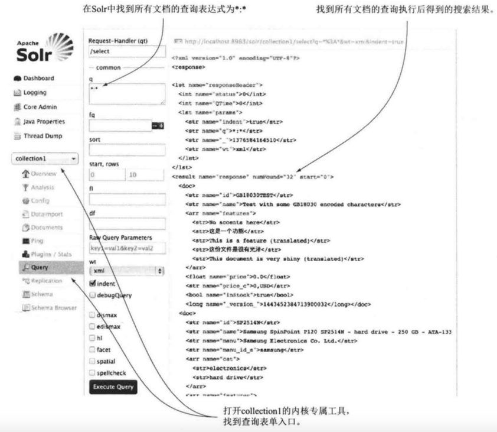

填写查询表单后，会创建一个 HTTP GET 请求并发送给Solr

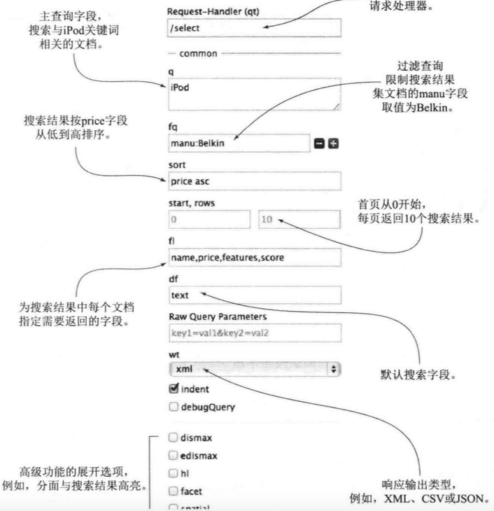

删除全部索引数据

```xml
<delete>
    <query>*:*</query>
</delete>
<commit/>
```

添加文档到Solr

```xml
<add>
    <doc>
        <field name="id">value</field>
        ...
    </doc>
    <doc>
        ...
    </doc>
</add>
```


## 搜索原理

搜索的两条线

1. 索引。将符合格式的文档添加到索引
2. 搜索。根据关键词，搜出相关文档


Solr的功能

- 为文档建立索引
- 当输入搜索语句(query)后，能通过索引快速匹配到文档，并返回匹配结果

建索引的步骤

1. 提供待索引的文档
   1. 文档需要满足一定的格式(如，json、xml)
   2. 文档由字段构成，字段有各种字段类型。字段类型可以是预定义的，也可以是自定义的。
2. 生成索引
   1. 需要在schema.xml中明确索引需要的字段(文档中某些字段并不适合搜索，因而不需要在构建索引时使用)
   2. 定义字段的类型，告知 Solr 如何处理字段
   3. 对字段内容进行处理，生成索引
3. 有新文档加入时，更新索引。

搜索的步骤

1. 输入搜索语句(query)，并通过HTTP协议，将query传送到Solr
2. 对query进行处理，从索引中找到匹配的文档
   1. 调用请求处理器(RequestHandler)，将query分解成词元流
   2. 通过过滤器，对词元进行处理
   3. 在索引里查找，搜索出合适的结果
   4. 排序
3. 展示搜索结果

### 文档

是提交给solr的数据，可以是新闻报道、简历、用户信息、书……

每个文档包含一个或多个字段，每个字段被赋予具体的字段类型：字符串、标记化文本、布尔值、日期、经纬度……

一个字段类型是由若干分析步骤组成的，这些步骤会决定数据如何在字段中被处理，如何映射到Solr索引中。

字段在Solr的schema中被定义为特定的字段类型。文档中的字段需要被处理时，才会被映射到特定字段类型中。

文档示例

```xml
<doc>
    <field name="id">company</field>
    <field name="companycity">Beijing</field>
</doc>
```

文档通过定义 managed-schema (旧版本是 schema.xml)，指定字段的字段类型，并将字段分析的结果保存在索引中。

```xml
<!-- managed-schema.xml 定义字段类型的部分 -->
<field name="id" type="string"/>
```


### 查询

```
必备词项
+word1 +word2
word1 AND word2

可选词项
word1 word2
word1 OR word2

排除词项
-word1
NOT word1

短语搜索
"this is a sequence" OR "another sequence"

通配符搜索
* 0个或多个字符(尽量不要放在首位)
? 单个字符
off*r
off?r

区间搜索
yearsOld:[18 TO 21] 匹配 18、19、20、21（闭区间）
yearsOld:{18 TO 21} 匹配 19、20（开区间）
yearsOld:[18 TO 21} 匹配 18、19、20

模糊/编辑距离搜索
编辑距离被定义为一次插入、删除、替换、位置互换。
Solr使用~表示模糊编辑距离搜索。默认匹配与原始词项距离2个编辑距离的词项。
administrator~（与administrator有2个以内的编辑距离的词）
administrator~N（与administrator有N个以内的编辑距离的词）

邻近搜索
"chief officer"~1（chief和officer之间最多可以相隔1个词）
```

## 配置 Solr

配置Solr一般与3个 XML 文件打交道

- solr.xml 定义管理、日志、分片和 SolrCloud 有关的属性
- solrconfig.xml 定义 Solr 内核的主要配置
- managed-schema(旧版本的schema.xml) 定义索引结构，包括字段及其数据类型

### Solr主目录

Solr主目录是封装一个或多个内核的目录结构。每个服务器仅有一个包含所有内核的主目录。

主目录结构


主目录由solr.xml配置，4.4版本后，内核可被自动发现，不需要在 solr.xml 中配置。

内核间相互独立，共同存储在Solr主目录下。Solr内核由几部分构成

- conf目录 存放搜索相关的配置。
  - managed-schema(旧版本是schema.xml) 对内核进行文本分析与索引的主要配置文件
  - solrconfig.xml 内核的主要配置文件
- data目录 存储文档生成的索引。
- Solr事务日志
- core.properties 内核属性，一般只放name属性

Solr内核包含了搜索文档所需的所有功能，可以看成是一个独立的搜索模块，提供单独的搜索和索引服务。

使用全局Java属性(solr.solr.home)来定位配置文件的根目录。Solr在主目录下扫描包含core.properties文件的文件夹，该文件定义了Solr中自动发现内核的基本属性。

core.properties

```
name=coreName (配置内核的名字，用来自动发现内核)
```

### solrconfig.xml

Solr 利用 solrconfig.xml 来初始化内核。所做的修改只有在重新加载内核后才会生效。

Solr 中描述数据结构的 XML 元素

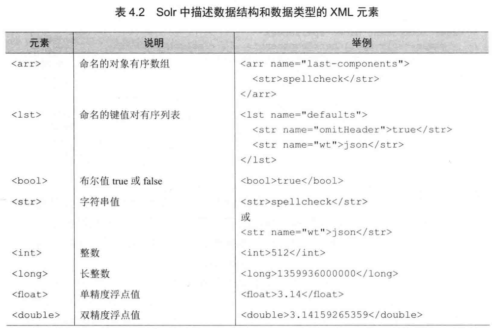

sorlconfig.xml

```xml
<config>
    <!-- 配套的lucene版本 -->
    <luceneMatchVersion>8.2.0</luceneMatchVersion>
    <!-- 载入相关jar包 -->
    <lib dir="../sompath/lib/" regix="*.jar" />
    <lib path="../../.jar" />
    <!-- 启用JMX -->
    <jmx />
    ...
</config>
```

- lib 依赖的jar包
    - dir属性 是以内核的根目录为起点的相对路径。内核的根目录也被称为内核的instanceDir
    - regix 指向jar包的正则表达式
    - path 指向jar包
- jmx 用于激活Solr的MBeans，它是一个Java对象，可以调用Java管理扩展JMX的API获得Solr的配置参数和统计信息。
- requestHandler 请求处理器
    - 利用solr.前缀简写Solr类的名称。(指向Solr的核心java包，如analysis.、schema.、request.)运行时再解析至相应的内置Solr类
    - 只启用了默认值修饰

### 搜索请求处理

#### 请求处理介绍

可以使用 curl 工具向 Solr 发送查询请求。

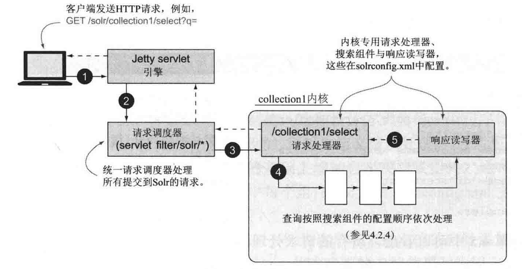

统一请求分配器是一个 Java servlet 过滤器，用来过滤出符合条件的URL。这里的主要作用是定位到处理该请求的内核。

/select请求处理器利用一系列搜索组件处理客户端请求。

#### 搜索处理器

```xml
<!-- solrconfig.xml -->
<!-- select 请求处理器的定义 -->
<requestHandler name="/select" class="solr.SearchHandler"> <!-- solr.前缀简写Solr类的名称，运行时再解析到相应的内置Solr类 -->
    <!-- 仅定义了默认值修饰组件 -->
    <lst name="defaults">
        <str name="echoParams">explicit</str>
        <int name="rows">10</int>
        <str name="df">text</str>
    </lst>
</requestHandler>
```

Solr 有两类请求处理器

- 搜索处理器：处理搜索请求
- 更新处理器：处理索引请求

搜索处理器处理查询请求的过程

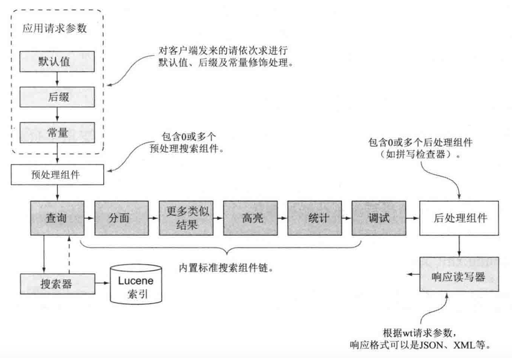

通常，搜索处理器的组件为：（每个组件都定义在solrconfig.xml中）

- 请求参数修饰组件
    - 默认值修饰(defaults)   为客户端未指定值的参数添加默认值
    - 常量修饰(invariants)  将客户端的参数值覆写为固定值
    - 后缀修饰(appends)     在客户端请求的末尾添加额外参数
- 预处理组件(first-components)一组优先执行的可选搜索组件，执行预处理任务
- 主搜索组件(components)     一组链式组合的搜索组件，至少包含查询组件
- 后处理组件(last components)    一组可选的链式组合的搜索组件，执行后处理任务

将搜索组件添加到请求处理器

```xml
<!-- 搜索组件只需定义一次，可被任意数量的请求处理器调用 -->
<searchComponent name="query" class="solr.QueryComponent" />
<searchComponent name="facet" class="solr.FacetComponent" />

<requestHandler name="/select" class="solr.SearchHandler">
    <arr name="components">
        <str>query</str>
        <str>facet</str>
    </arr>
</requestHandler>
```

##### 搜索组件

搜索组件

是在搜索处理器声明周期内发生的可配置的处理步骤。搜索组件让搜索处理器将实现单个搜索请求的可重用功能组合链接在一起。

6个内置搜索组件

- 查询

查询组件利用处于活跃状态的搜索器对查询语句进行解析和执行。查询语句的解析策略由defType参数指定。如，指定 eDisMax 作为查询语句的解析器 `<str name="defType">edismax</str>`。查询组件默认处于启用状态，所有的其他组件则需要在查询请求中指定相应的参数来启用。

- 分页

已内置，但需要指定参数来启用。

- 更多类似结果

识别与查询结果类似的文档

- 高亮
- 统计

为结果文档中的数值字段计算统计

- 调试

##### 后处理组件

被定义在 `<last-component>` 中。

```xml
<!-- 定义拼写检查组件 -->
<searchComponent name="spellcheck" class="solr.SpellCheckComponent">
    <str name="queryAnalyzerFieldType">textSpell</str>
    <lst name="spellchecker">
        <str name="name">default</str>
        ...
    </lst>
</searchComponent>
```

### 管理搜索器

新建搜索器

Solr 所有查询语句都由一个叫“搜索器”的组件处理。任何时候只能存在一个处于活跃状态的搜索器。所有搜索请求处理器中的查询组件都向这个搜索器发起查询请求。

搜索器拥有 Lucene 索引快照的只读视图。提交操作会创建新的搜索器，以保证更新后的文档和索引可以被搜索器检索到。

新搜索器预热

为了提高查询性能，需要对新搜索器进行预热。有两种预热机制：

- 缓存预热查询（预先把结果查询出来，进行缓存）。太多会降低性能

```xml
<!-- 定义一个执行预热查询的 newSearcher 事件的监听器 -->
<listener event="newSearcher" class="solr.QuerySenderListener">
    <arr name="queries">
        <lst>
            <str name="q">solr</str>
            <str name="sort">price asc</str>
        </lst>
    </arr>
</listener>
```

- 利用旧缓存，自动预热缓存

两个搜索器相关的配置元素

```xml
<!-- 当提交搜索请求，但没有搜索器时，是否等待新搜索器预热完成 -->
<useColdSearcher>false</useColdSearcher>
<!-- 定义并发预热的搜索器的最大数目 -->
<maxWarmingSeachers>2</maxWarmingSeachers>
```

### 缓存管理

略，之后看

```xml
<!-- 过滤器缓存的初始配置
     autowarmCount 预热的过滤器数量
-->
<filterCache class="solr.LFUCache"
    size="100"
    initialSize="20"
    autowarmCount="10" />
<!-- 查询结果缓存 -->
<queryResultCache class="solr.LFUCache"
    size="512"
    initialSize="512"
    autowarmCount="0" />
```

## 创建索引

Solr 索引构建可分解为三个主要任务

1. 将文档从原始格式转换为 Solr 支持的格式（XML、JSON等）
2. 通过接口，将文档添加到 Solr
3. 在索引中，配置 Solr，对文档文本进行转换

xml 格式的文档

```xml
<doc>
    <field name="id">value</field>
    <field name="price">100</field>
</doc>
```

添加文档到Solr

可以通过控制台中的Documents模块

```xml
<add>
    <doc>
        <field name="id">value</field>
        ...
    </doc>
    <doc>
        ...
    </doc>
</add>
```

索引的构建

managed-schema 文件定义了文档的字段和字段类型

### 设计自己的schema

schema文件定义的内容

- 哪个字段是被索引的文档的唯一标识。有唯一标识可以避免重复
- 文档中的哪些字段应该被索引
- 哪些字段可以在搜索结果中展示

示例

schema.xml(或者 managed-schema)

```xml
<!-- name 仅用于展示目的，version 仅用于Solr内部，启用具体功能 -->
<schema name="example"
    version="1.5">
    <fields>
        <!-- 表示文档中的字段 -->
        <field name="id" type="string" indexed="true" stored="true" />
        <field name="core" type="string" indexed="true" stored="true" />
        <!-- 多值字段 -->
        <field name="keywords" type="string" indexed="true" stored="true" multiValued="true" />
        ...
        <!-- 动态字段 -->
        <dynamicField name="*_s" type="string" indexed="true" stored="true" />
    </fields>

    <!-- 标识唯一字段（类似数据库中的主键） -->
    <uniqueKey>id</uniqueKey>

    <!-- 从 source 字段向 dest 字段复制，dest 字段必须是已被定义的 -->
    <copyField source="id" dest="keywords" />
    <copyField source="core" dest="keywords" />

    <!-- fieldType 元素定义，及如何分析字段 -->
    <types>
        <fieldType name="string" class="solr.StrField" ... />
        <fieldType name="text_general" class="solr.TextField">
            <!-- 为索引文档定义分析器 -->
            <analyzer type="index">
                <!-- 分词器将字段文本分解为词元 -->
                <tokenizer class="solr.StandardTokenizerFactory" />
                <filter class="solr.StopFilterFactory" ... />
                <filter calss="solr.LowerCaseFilterFactory" />
            </analyzer>
            <!-- 为分析查询表达式定义分析器 -->
            <analyzer type="query">
                <!-- 标准分词器 -->
                <tokenizer class="solr.StandardTokenizerFactory" />
                <!-- 停用词过滤器 -->
                <filter class="solr.StopFilterFactory" ignoreCase="true" words="lang/stopwords_en.txt" />
                <!-- 同义词过滤器 -->
                <filter class="solr.SynonymFilterFactory" synonyms="synonyms.text" ignoreCase="true" expand="true" />
                <!-- 小写转换过滤器 -->
                <filter calss="solr.LowerCaseFilterFactory" />
            </analyzer>
        </fieldType>
    </types>
</schema>
```

### 字段 field

Solr 根据 schema 中的字段定义来调用合适的字段分析器，将字段内容解析为词项，添加到倒排索引中。

定义字段

```xml
<field name="id" type="string" indexed="true" stored="true" required="true" multiValued="false" />
```

字段属性

- name：字段的名称
- type：字段的类型
- indexed：是否被索引
- stored：是否被存储
- required：是否必须
- multiValued：是否是多值。即，如果在某个文档中，该字段有多个值。例如下面文档中，friend 字段的 multiValued=true (一个用户有多个好友）。

```xml
<doc>
    <field name="id">value</field>
    <field name="friend">someone</field>
    <field name="friend">anotherOne</field>
</doc>
```

Solr存储的是字段的原始值

动态字段

可以批量为字段添加字段类型，使用名称匹配的方式。有2种匹配方式

- 前缀匹配，如，`prefix_*`
- 后缀匹配，如，`*_suffix`

动态字段示例

```xml
<!-- 文档中所有以 _s 结尾的字段，字段类型都是 string -->
<dynamicField name="*_s" type="string" indexed="true" stored="true" />
```

复制字段

将一个或多个字段值填充到某个字段中。有2种情况

- 将多个字段内容填充到一个字段。
- 对同一字段内容进行不同的文本分析，创建一个新的可搜索字段。

示例

```xml
<fields>
    <field name="id" type="string" indexed="true" stored="true" />
    <field name="core" type="string" indexed="true" stored="true" />
    <field name="keywords" type="string" indexed="true" stored="true" multiValued="true" />
    <field name="id_copy" type="text_general" indexed="true" stored="true" />
</fields>

<!-- 将id和core两个字段合并成一个keywords字段 -->
<copyField source="id" dest="keywords" />
<copyField source="core" dest="keywords" />
<!-- 将id字段的内容复制到id_copy字段，但使用不同的字段类型 -->
<copyField source="id" dest="id_copy" />
```

### 结构化非文本字段类型

Solr为结构化数据内建了许多字段类型。如，数字、日期、地理位置

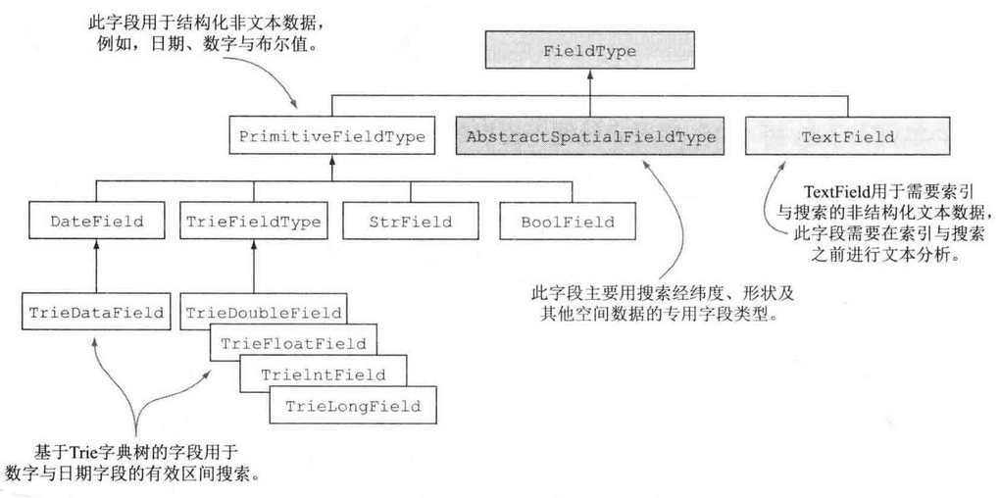

字符串字段

不需要变更的结构化值，使用 string 字段类型。即，使用 string 类型的字段的内容，会完整的排进倒排索引中，不会被分割、格式处理等。

```xml
<!-- string 字段类型定义 -->
<fieldType name="string" class="solr.StrField" sortMissingLast="true" omitNorms="true"/>
```

日期字段

```xml
<fieldType name="tdate" class="solr.TrieDateField" omitNorms="true" precisionStep="6" positionIncrementGap="0"/>
```

数值字段

```xml
<fieldType name="int" class="solr.TrieIntField" precisionStep="0" positionIncrementGap="0"/>
```

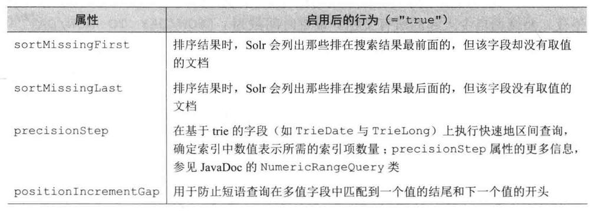

发送文档到Solr进行索引的几种方式

1. 使用 post.jar 工具
2. 使用 SolrJ 客户端
3. 数据导入处理器(DIH)
4. ExtractingRequestHandler

post.jar 工具

```sh
java -jar post.jar mydoc.xml
```

数据导入处理器(DIH)

可以与具备主流JDBC驱动的任何数据库对话，DIH组件会对数据库进行查询，将查询结果转换为Solr索引需要的文档。

ExtractingRequestHandler

又名 Solr Cell，可以抽取二进制文件(如PDF、Word)中的文本内容进行索引。

Nutch

是一个基于 Java 的开源网络爬虫。Nutch采集网页，Solr实现网页的搜索。

### 更新处理器

更新处理器负责索引的所有更新请求，包括提交和优化请求。

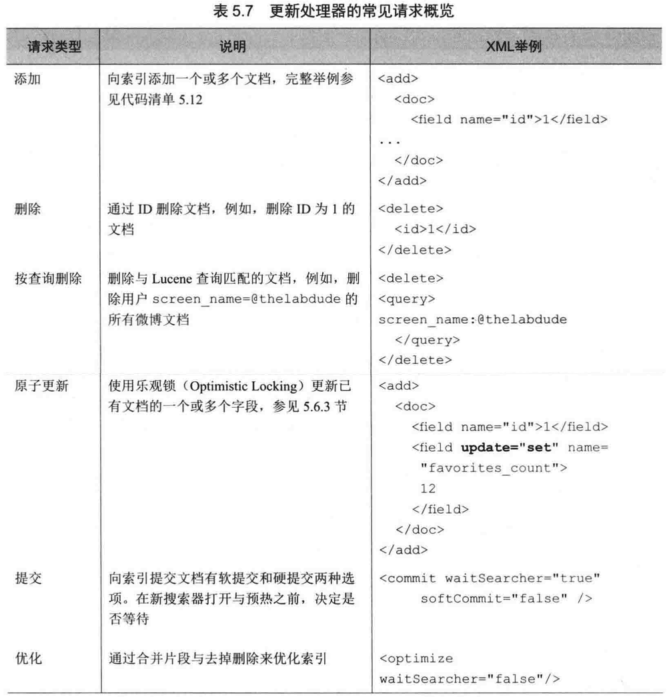

更新处理器配置

```xml
<updateHandler class="solr.DirectUpdateHandler2">
    <!-- 注册一个更新事件监听器 -->
    <updateLog>
        <str name="dir">${solr.ulog.dir:}</str>
    </updateLog>
    <!-- 自动提交策略 -->
    <autoCommit>
        <!-- 每隔15s提交一次 -->
        <maxTime>15000</maxTime>
        <!-- 每500个文档提交一次 -->
        <maxDocs>500</maxDocs>
        <!-- 提交后不打开一个新搜索器 -->
        <openSearcher>false</openSearcher>
    </autoCommit>
    <!-- 软自动提交策略 -->
    <autoSoftCommit>
        <maxTime>1000</maxTime>
    </autoSoftCommit>
    <!-- 启用事务日志 -->
    <listener event="postCommit" ...>
        ...
    </listener>
</updateHandler>
```

Solr 有两种将文档提交到索引的方式

- 软提交
- 正常提交（硬提交）

正常提交

将为提交的文档写入磁盘，刷新一个内部搜索器组件，让新提交的文档能够被搜索。花销较大

软提交（Solr 4+）

支持近实时搜索。软提交使得文档可以被搜索到，不需要写入持久存储上。但某一时刻仍需要硬提交。

自动提交

软硬提交的自动提交的策略有

- 在指定时间内提交文档
- 未提交文档数达到某个阈值后提交文档
- 每隔固定的时间间隔提交所有文档

自动提交时通常会打开一个新搜索器，通过 `<openSearcher>false</openSearcher>` 元素可禁用

事务日志

确保提交到索引并已接受的更新保存在持久存储器。

作用

- 支持近实时获取和原子更新
- 解除提交过程中写入的持久性。
- 通过 SolrCloud 的分片代表支持副本的同步

```xml
<updateLog>
    <str name="dir">${solr.ulog.dir:}</str>
</updateLog>
```

原子更新

通过发送文档的新版本可以实现对已有文档的更新。Solr的操作是，删除现有的文档并创建一个新的文档。

字段级别的更新

```xml
<add>
    <doc>
        <field name="id">1</field>
        <!-- 为文档id=1的文档，增加一个新字段 retweet_count_ti -->
        <field update="set" name="retweet_count_ti">100</field>
        <!-- 增加某个字段的值 -->
        <field update="inc" name="retweet_count_ti">10</field>
    </doc>
</add>
```

积极的并发控制

```xml
<field name="_version_" type="long" indexed="true" stored="true" />
```

当添加一个新文档时，Solr会自动分配一个唯一版本号。当并发更新时，需要提交 `_version_` 字段，后端根据该字段的值，进行并发控制。

### 索引管理

大多数情况下，solrconfig.xml 中索引管理相关的设置，默认值就够用。

默认存储配置

默认情况下，Solr为内核设置一个数据目录（data目录），将数据存储在本地文件系统中。

在solrconfig.xml中使用 `<dataDir>` 元素定位data目录。

```xml
<dataDir>${solr.data.dir:}</dataDir>
```

solr.data.dir 属性是内核的默认数据目录，可以在 sorl.xml 中修改。

```xml
<core loadOnStartup="true" instanceDir="coreName/"
    transient="false" name="coreName"
    dataDir="/usr/local/solrHome/coreName"/>
```

其他略，回头看

## 文本分析

文本分析的主要目标是让用户使用自然语言进行搜索，无需考虑搜索词项应该如何组合。


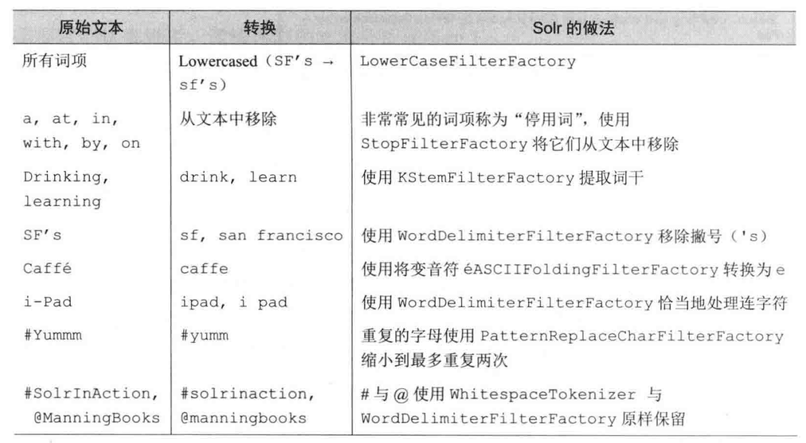

### 基础文本分析

Solr 的示例 schema 中预定义了很多有用的文本分析字段类型。如 text_general 字段类型

```xml
<fieldType name="text_general" class="solr.TextField" positionIncrementGap="100">
    <!-- 为 索引文档(索引部分) 定义分析器 -->
    <analyzer type="index">
        <!-- 分词器将字段文本分解为词元流 -->
        <tokenizer class="solr.StandardTokenizerFactory" />
        <filter class="solr.StopFilterFactory" ignoreCase="true" words="lang/stopwords_en.txt" />
        <filter calss="solr.LowerCaseFilterFactory" />
    </analyzer>
    <!-- 为 分析查询表达式(搜索部分) 定义分析器 -->
    <analyzer type="query">
        <!-- 标准分词器：使用空格和标点符号来拆分文本。 -->
        <tokenizer class="solr.StandardTokenizerFactory" />
        <!-- 停用词过滤器：去掉停用词。words指向停用词列表 -->
        <filter class="solr.StopFilterFactory" ignoreCase="true" words="lang/stopwords_en.txt" />
        <!-- 同义词过滤器 -->
        <filter class="solr.SynonymFilterFactory" synonyms="synonyms.text" ignoreCase="true" expand="true" />
        <!-- 小写转换过滤器：将词元所有字母转成小写。 -->
        <filter calss="solr.LowerCaseFilterFactory" />
    </analyzer>
</fieldType>
```

文本分析的基本元素

- 分析器(Analyzer)
- 分词器(Tokenizer)
- 分词过滤器(TokenFilter)
- 字符过滤器(CharFilter)

如果Solr的预定义字段类型无法满足需要，可以使用Solr插件框架创建自己的字段类型。

分析器

常见的做法是定义两个单独的 `<analyzer>` 元素：一个用于分析索引时的文本，一个用于分析用户搜索时输入的文本。用2个分析器，是因为查询的文本分析，通常会添加同义词，而索引的文本分析并不会。

分词器 & 分词过滤器

`<analyzer>` 将文本分析过程分为两个阶段

- 词语切分（解析）：文本会以各种解析形式(如，空格、标点)被拆分成词元流。分词器用元素 `<tokenizer>` 定义。
- 词语过滤：对词元执行以下3种操作中的一种。分词过滤器用元素 `<filter>` 定义
    - 词元转换：改变词元的形式，如，字母小写、词干提取
    - 词元注入：向词元流中添加一个词元，如，同义词过滤器
    - 词元移除：删除不需要的词元，如，停用词过滤器。

Solr分析表单

在控制台中的 Analysis 中

- 在 Field Value(Index) 中输入待索引的文本，选择字段类型，点击分析，查看分析后的结果。
- 在 Field Value(Query) 中输入搜索词，点击分析，查看匹配情况。

字符过滤器

可对文本字符进行添加更改和移除。在分词前使用。

```xml
<!-- 将重复2个及以上的字符替换成2个该字符 -->
<charFilter class="solr.PatternReplaceCharFilterFactory"
    pattern="([a-zA-Z])\1+"
    replacement="$1$1"/>
```

内置的 3 个 charFilters

- solr.MappingCharFilterFactory：使用外部配置文件中定义的字符进行替换
- solr.PatternReplaceCharFilterFactory：使用正则表达式进行字符替换
- solr.HTMLStripCharFilterFactory：从文本中除去 HTML 标记

其他过滤器

WordDelimiterFilterFactory 

ASCIIFoldingFilterFactory 将变音符转变成ASCII码的等价值

KStemFilterFactory 提取词干

SynonymFilterFactory 加入同义词

## 执行查询和处理搜索结果

### Solr请求详解

所有的请求基本上都是通过请求处理器提交给 Solr。搜索处理器(search handler) 是查询处理的默认请求处理器。

#### 请求处理器(Request Handler)

Solr所有请求的入口。作用是

- 接受请求
- 执行功能
- 向客户端返回结果

基础类

RequestHandlerBase

接口

SolrRequestHandler

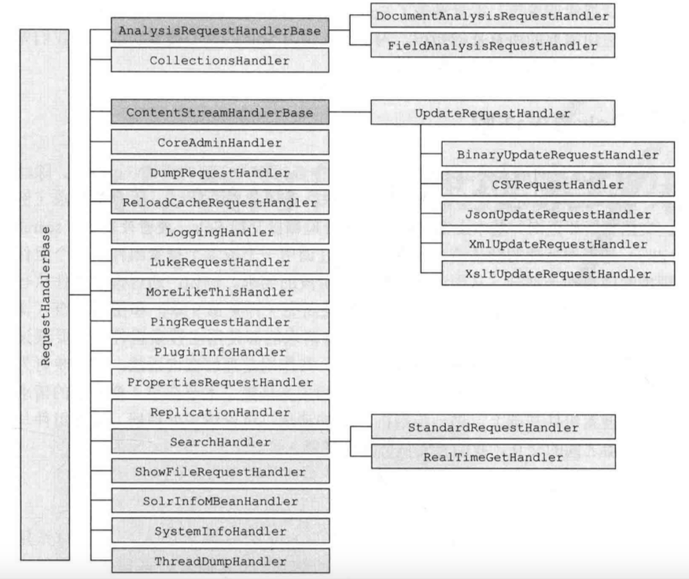

每个请求处理器使用前都需要在 solrconfig.xml 中进行定义和配置

```xml
<config>
    <requestHandler name="/select" class="solr.SearchHandler"/>
</config>
```

Solr 维护了一个请求处理器查找列表，根据每个请求的指定要求，派发对应的请求处理器。

请求处理器的name以"/"开头，就使用该请求处理器的相对url。如select请求处理器 `http://host:port/solr/coreName/select/`

#### 搜索组件

搜索组件是在搜索处理器生命周期内发生的可配置的处理步骤。

```xml
<!-- 搜索组件只需定义一次，可被任意数量的请求处理器调用 -->
<searchComponent name="query" class="solr.QueryComponent" />
<searchComponent name="facet" class="solr.FacetComponent" />

<requestHandler name="/select" class="solr.SearchHandler">
    <arr name="components">
        <!-- 搜索组件名 -->
        <str>query</str>
        <str>facet</str>
    </arr>
</requestHandler>
```

### 查询解析器

将 Lucene 查询解释称搜索语法，以便查找所需的文档集。

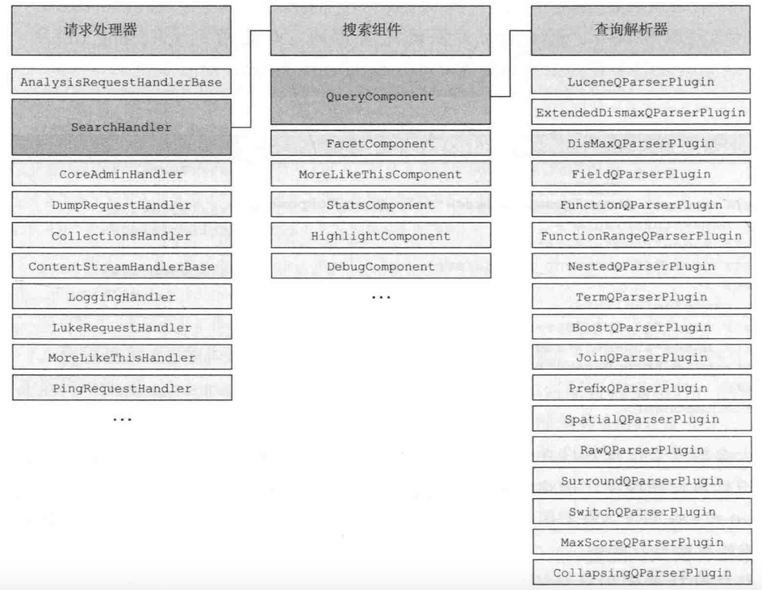

Solr最常用的查询解析器是 Lucene 查询解析器和 eDisMax 查询解析器

指定查询解析器

```
# 使用url中的defType修改默认查询解析器
/select?defType=edismax&q=...

# 修改查询中使用的查询解析器，在一个查询中调用了两个不同的查询解析器
/select?q={!edismax}hello world OR {!lucene}title:"my title"
```

局部参数

为特定上下文提供定制化请求参数。只限于当前上下文有效。局部参数要传递给查询解析器。

语法

`{!param1=value1 param2=value2 ... paramN=valueN}` 

示例

```
/select?q=hello world&defType=edismax&qf=title^10 text&q.op=AND # 请求参数是全局的
# 等价于
/select?q={!defType=edismax qf="title^10 text" q.op=AND}hello world # 参数只在q参数范围内使用
/select?q={!type=edismax qf="title^10 text" q.op=AND}hello world # type参数只在局部参数中使用，defType修改默认类型。
# 如果只指定一个值，type会被视为默认局部参数的键
/select?q={!edismax}hello world 
# 参数值可以放在局部参数内
/select?q={!type=edismax qf="title^10 text" v="hello world"}
# 参数引用，提供了查询中任意变量的替换方法
/select?q={!type=edismax v=$userQuery}$userQuery="hello world"
```

### 查询和过滤器

两个查询参数

- fq：对匹配的文档进行查询限定。请求url中可以有多个。
- q：同fq，并提供相关度算法、用于相关度评分的词项列表。请求url中只能有一个。

关闭过滤器缓存

fq={!cache=false}id:123

改变过滤器执行顺序

fq={!cost=1}category:technology

执行成本越高的，执行顺序越靠后。执行成本大于等于100的过滤器都被视为后置过滤器

### Lucene 查询解析器

语法如下。语法必须严格执行，如果查询和语法不匹配，会抛出查询异常。

字段搜索

格式：`字段名：搜索表达式`

```
title:solr
title:"apache solr" content:(search engine)
```
一般在定义的默认字段上进行关键词搜索。假如默认字段是content，则

```
# 等价的2组
solr
content:solr
# 等价的2组
title:apache solr
title:apache content:solr

#在同一个字段中搜索多个词项。()是组合表达式
title:(apache solr)

搜索短语（将短语作为一个整体进行搜索）
title:"apache solr"
```

必备词项

要求词项在文档中必须出现

```
+solr
apache AND solr
apache && solr
+apache +solr
```

可选词项

搜索出的文档至少包含一个词项。默认运算符是OR

```
apache OR solr
apache || solr
apache solr
```

组合表达式

```
(apache AND (solr OR lucene)) AND title:(apache solr)
```

词项邻近度

```
# 对原始短语进行不超过2个位置的词项移动。短语搜索可以看成是隐含距离为0的邻近搜索。
"apache software foundation"~2
```

字符邻近

```
# 查找出词项solr的编辑距离为1的相关词项，如sol、sor等
solr~1
```

排除词项

文档中不包含某个词项

```
solr -panel
solr NOT panel
solr AND NOT(panel OR electricity)
```

区间搜索

```
# 闭区间搜索
number:[12.5 TO 100]
date:[2013-11-04T10:05:00Z TO NOW-1DAY]
string:[ape TO apple]

# 日期必须使用祖鲁时间(Zulu time)

# 不限定上下限
number:[100 TO *]
number:[* TO 0]

# 开区间搜索
number:{0 TO 100}

# 混合使用
number:[1 TO 100}
```

通配符搜索

`*` 表示1个或多个字符
`?` 表示某个字符

```
hel* w?rld
```

权重表达式

```
# 调整相关度权重
(apache^10 solr^1.23) AND (apache lucene^2.5)^10
```

特殊字符转义

将特殊字符用引号扩起来，或者使用"\"进行转义

```
# 特殊字符
+ - && || ! () {} [] ^ " ~ * ? : /

q=content:"I'm" so "happy!!!" ":)"
q=content:(I\'m so happy\!\!\! \: \))
```

### eDisMax 查询解析器

由 Lucene 查询解析器和 DisMax 查询解析器组成。

eDisMax 查询解析器

1. 支持 Lucene 查询解析器的所有语法
2. 不会对无效的输入语法抛出异常，而是会将它作为文本字符串进行搜索。
3. 可以理解小写转换后的AND和OR
4. 可以对多个字段进行搜索

对多个字段进行搜索(通过指定查询字段(qf))

```
q=solr in action&qf=title description author
# 调整权重
q=solr in action&qf=title^1.5 description author^3
```

字段别名

为文档中的字段添加别名，可以按照别名搜索该字段。通过在请求中添加参数 `f.{alias}.qf={realfield}`

```
/select?defType=edismax&q=title:"some title"&f.title.qf=title_t_en
# title 是 title_t_en 的别名，查询将在 title_t_en 字段上进行

f.who.qf=personLastName^30 personFirstName^10
```

可访问字段

表示除了uf指定的字段，其他字段都不能被搜索到。uf参数既接受真实字段，也接受别名

```
uf=title city date

# 禁用所有字段
uf=-*

# 禁用某些字段
uf=* -hiddenFiled1 -hiddenFiled2
```

最小匹配

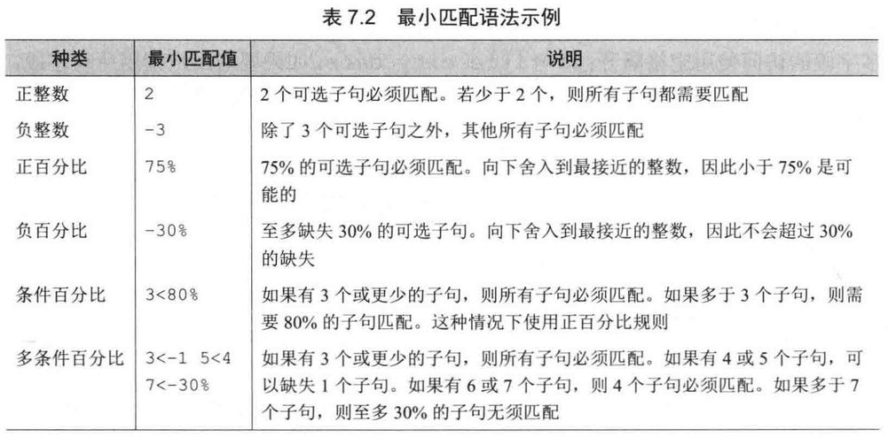

## 返回搜索结果

### 响应格式

wt(write type) 参数修改响应格式，可以是一下几种格式

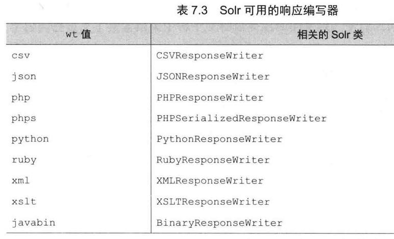

自定义响应格式

1. 编写一个继承 Solr 的 QueryResponseWriter 的类
2. 在solrconfig.xml 中注册该响应读写器 `<queryResponseWriter name="myapp" class="...MyAppResponseWriter"/>`

### 返回字段

fl(field list) 字段列表参数决定了从搜索结果中每个文档需要返回的字段

```
/select?...&fl=id,name
/select?...&fl=*, score # 返回所有值，相关度得分
/select?...&fl=id,sum(integerField,10) # 返回id，整数字段+10后的结果

# 文档转换器
/select?...&fl=*,[explain],[shared]
```

其他略

### 结果分页

使用start和rows参数

```
/select?q=*:*&rows=5&start=0 # 从0条结果开始，返回5条结果
```

### 搜索结果排序

按字段排序

搜索结果默认按照文档的相关度得分，降序排。相同得分，按 Lucene 内部文档编号升序排。

使用sort参数修改默认排序

```
sort=score desc, date asc
```

排序字段必须在schema.xml中标记为indexd=true

对缺失值排序

sortMissingLast =true时，不包含该字段值的所有文档都显示在搜索结果排序列表的末尾
sortMissingFirst

```xml
<fieldType name="string" class="sort.StrField"
    sortMissingLast="true"
    sortMissingFirst="false" />
```

### 调试查询结果

在请求中传入debug=true，激活DebugComponent

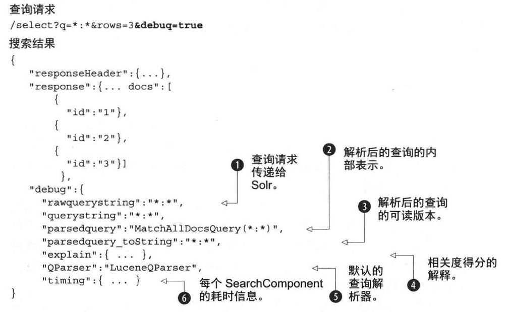

## SolrJ

SolrJ 是访问 Solr 服务的java客户端，提供索引和搜索的请求方法。

Maven依赖

```xml
<dependency>
    <groupId>org.apache.solr</groupId>
    <artifactId>solr-solrj</artifactId>
    <version>8.2.0</version>
</dependency>
<dependency>
    <groupId>commons-logging</groupId>
    <artifactId>commons-logging</artifactId>
    <version>1.2</version>
</dependency>
```

- 添加(修改)文档索引

```java
public void testAddDocument(){
	// 创建 HttpSolrClient.Builder 对象，通过它创建客户端通信
    HttpSolrClient.Builder builder = new HttpSolrClient.Builder("http://localhost:8983/solr");  // 当url中指定内核时，就不需要内核名了。 http://localhost:8983/solr/coreName
    HttpSolrClient solr = builder.build();
	// 新建被索引的文档
	SolrInputDocument doc = new SolrInputDocument();
	doc.setField("id", "1");
	//...
	// 添加，需要制定要添加的core
	sorl.add("coreName", doc);
	// 提交到制定的core
	sorl.commit("coreName");
}
```

- 删除文档

```java
public void testDelete() throws Exception{
    // 创建 HttpSolrClient.Builder 对象，通过它创建客户端通信
    HttpSolrClient.Builder builder = new HttpSolrClient.Builder("http://localhost:8983/solr");
    HttpSolrClient solrClient = builder.build();
    // 根据id删除文档
    solrClient.deleteById("coreName", "1");
    // 根据query删除文档
    solrServer.deleteByQuery("item_title:vivo手机hahaha");
    // 提交
    solrClient.commit("coreName");
}
```

- 搜索（查询）

```java
public void testQuery(){
	// 创建 HttpSolrClient.Builder 对象，通过它创建客户端通信
    HttpSolrClient.Builder builder = new HttpSolrClient.Builder("http://localhost:8983/solr");
    HttpSolrClient solr = builder.build();
	SolrQuery query = new SolrQuery();
	// 设置主查询条件
	// SolrQuery query = new SolrQuery("*:*");
	query.setQuery("小红帽");
	// 设置过滤条件
	query.addFilterQuery("item_price:[0 to 300]");
	// 设置分页(从第0个记录开始，查10条数据)
	query.setStart(0);
	query.setRows(10);
	// 设置默认搜索域
	query.set("df","item_title")
	// 设置高亮
	query.setHighlight(true);
	query.setHighlightSimplePre("<em style=\"color:red\">");
	query.setHighlightSimplePost("</em>");
	// 设置高亮显示的域
	query.addHighlightField("item_title");
	// 取高亮
    Map<String, Map<String, List<String>>> highlighting = queryResponse.getHighlighting();
	// 执行查询
	QueryResponse response = solr.query(query);
	// 获取结果集
	SolrDocumentList results = response.getResults();
	// 遍历结果
	for(SolrDocument doc : results){
		print(doc.get("id"));
		print(doc.get("item_title"));
		List<String> titleList = highlighting.get(solrDocument.get("id")).get("item_title");
        if (titleList !=null && titleList.size()>0) {
            //能取到高亮,输出高亮
            System.out.print(titleList.get(0));
        }
	}
}

public void queryTest() throws Exception {
    //1.创建 HttpSolrClient.Builder 对象，通过它创建客户端通信
    HttpSolrClient.Builder builder = new HttpSolrClient.Builder("http://localhost:8983/solr");
    HttpSolrClient solrClient = builder.build();
    //2.创建一个map封装搜索条件
    Map<String, String> queryMap = new HashMap<>();
    queryMap.put("q","音乐盒");//关键字
    queryMap.put("df", "product_name");//默认搜索域
    //queryMap.put("sort","id asc");//结果以 id 升序排列,默认以关联度排序
    queryMap.put("rows","20");//默认只有十条
    //3.使用map创建 MapSolrParams 对象
    SolrParams solrParams = new MapSolrParams(queryMap);
    //4.使用客户端进行查询
    QueryResponse response = solrClient.query("product", solrParams);
    //5.提取结果
    SolrDocumentList documents = response.getResults();
    //6.循环输出
    documents.forEach(document ->{
        System.out.println("编号" + document.get("id") + ":" + document.get("product_name"));
    });
}
```

## 中文分词器

[IK分词器下载地址](https://github.com/magese/ik-analyzer-solr)

在 managed-schema 中配置

```xml
<!-- ik分词器 -->
<fieldType name="text_ik" class="solr.TextField">
    <!-- 索引分词器 -->
    <analyzer type="index">
        <tokenizer class="org.wltea.analyzer.lucene.IKTokenizerFactory" useSmart="false" conf="ik.conf"/>
        <filter class="solr.LowerCaseFilterFactory"/>
    </analyzer>
    <!-- 查询分词器 -->
    <analyzer type="query">
        <tokenizer class="org.wltea.analyzer.lucene.IKTokenizerFactory" useSmart="true" conf="ik.conf"/>
        <filter class="solr.LowerCaseFilterFactory"/>
    </analyzer>
</fieldType>

<!-- 业务域 -->
<field name="item_title" type="text_ik" indexed="true" stored="true" />
```

## solrCloud

跨多个节点的索引分割称为集合(collection)。

Zookeeper 作为集群的配置信息中心，属性文件放在zookeeper上

Collection 的索引被分成N片，每片存储在不同的Solr服务器上。服务器最好有一个备份。

其他信息略

### solr集群

测试集群

```java
public void testAdd(){
	// 创建solrserver 集群的实现类
	CloudSolrServer cloud = new CloudSolrServer("ip1:port1,ip2:port2,ip3:port3");
	// 设置默认的搜索collection
	cloud.setDefaultCollection("collectionName");
	// 创建solrinputdocument对象
	SolrInputDocument doc = new SolrInputDocument();
	// 添加域到文档
	doc.addField("id", "123");
	// 将文档提交到索引库
	cloud.add(doc);
	// 提交
	cloud.commit();
}
```

## 安装DataImport插件

Dataimport插件说明

使用该插件后，可以在管理界面直接从数据库导入数据到索引库。

安装步骤

1. 拷贝相关 jar 包到文件夹

solr-dataimporthandler.jar

mysql-connector-java.jar

2. 修改 `\solr-8.2.0\server\solr\product\conf\solrconfig.xml` 文件，增加以下代码

```xml
<!-- 新增 dataimport -->
<requestHandler name="/dataimport" class="org.apache.solr.handler.dataimport.DataImportHandler">
	<lst name="defaults">
		<str name="config">DIHconfig.xml</str>
	</lst>
</requestHandler>
```

3. 在 `\solr-8.2.0\server\solr\product\conf\` 目录下新建 DIHconfig.xml 文件，并编写以下内容

```xml
<dataConfig>
    <dataSource type="JdbcDataSource"
                driver="com.mysql.cj.jdbc.Driver"
                url="jdbc:mysql://localhost:3306/solr?serverTimezone=UTC&amp;useUnicode=true&amp;characterEncoding=utf8&amp;useSSL=false"
                user="root"
                password="password" />
    <document>
        <entity name="product"
                query="SELECT * FROM products">
            <field column="pid" name="id"/>
            <field column="name" name="product_name"/>
            <field column="price" name="product_price"/>
            <field column="category_name" name="product_category_name"/>
            <field column="description" name="product_description"/>
            <field column="picture" name="product_picture"/>
        </entity>
    </document>
</dataConfig>
```

4. 重启 solr 服务

## 参考资料

《Sorl in action》

[入门及原理](https://blog.51cto.com/wyait/1944677)

[Solr官方参考文档](https://www.w3cschool.cn/solr_doc/solr_doc-xcdq2fly.html)

[全文检索原理](https://www.jb51.net/article/129238.htm)

[Solr(7+)部署到tomcat](https://www.jianshu.com/p/573d54d53916)

[IK分词器下载地址](https://github.com/magese/ik-analyzer-solr)

[Solr使用示例](https://www.jb51.net/article/129231.htm)
