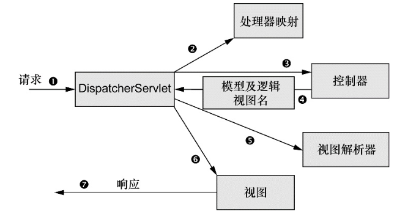
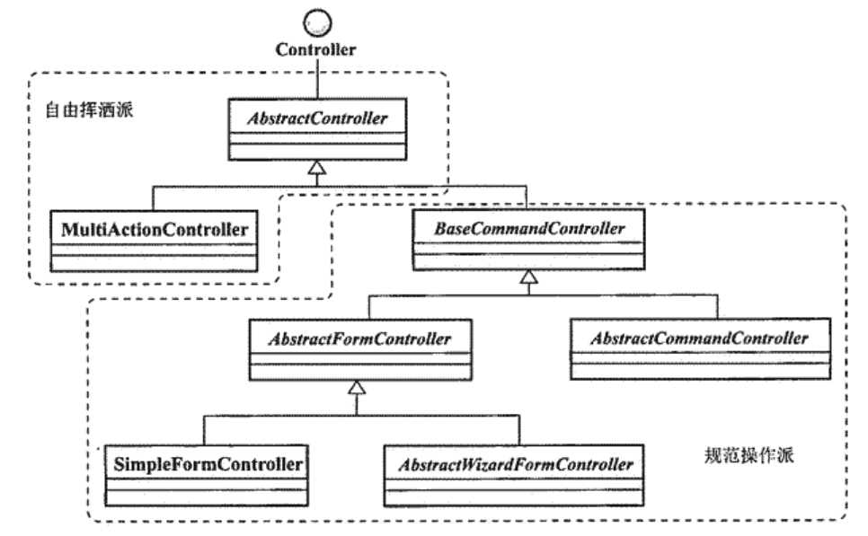

# Spring MVC

Web框架存在的意义在于，它们为Web应用程序的开发提供了一套可复用的基础设施。

## 我的理解

给整个web工程搭建了一个模板(or架构)，依照这个架构可以使服务规范化。在这个架构的基础上，开发了很多内部使用的工具，能够简化开发。

## 入门程序

文件结构

```
- myProject/
| - src/
| | - controller/
| | | - DemoController.java
| - web/
| | - WEB-INF
| | | - web.xml
| | | - controller-servlet.xml
| | | - applicationContext.xml
| | - index.jsp
| | - lib/
```

DemoController.java

```java
@Controller
public class DemoController {
	@RequestMapping("/demo")
	public String MyControllerTest(Model model){
		return "index"
	}
}
```

web.xml

springmvc需要的基本配置

```xml
<?xml version="1.0" encoding="UTF-8"?>
<web-app xmlns:xsi="http://www.w3.org/2001/XMLSchema-instance"
	xmlns="http://java.sun.com/xml/ns/javaee"
	xsi:schemaLocation="http://java.sun.com/xml/ns/javaee http://java.sun.com/xml/ns/javaee/web-app_2_5.xsd"
	id="WebApp_ID" version="2.5">
	<display-name>SpringMVC</display-name>

	<!-- 配置ContextLoaderListener -->
	<listener>
		<listener-class>org.springframework.web.context.ContextLoaderListener</listener-class>
	</listener>

	<!-- 配置DispatcherServlet -->
	<servlet>
		<servlet-name>controller</servlet-name>
		<servlet-class>org.springframework.web.servlet.DispatcherServlet</servlet-class>
	</servlet>
	<servlet-mapping>
		<servlet-name>controller</servlet-name>
		<url-pattern>*.do</url-pattern>
	</servlet-mapping>
</web-app>
```

applicationContext.xml

web项目的应用上下文，类似于一个spring项目的ApplicationContext

```xml
<?xml version="1.0" encoding="UTF-8"?>
<beans>
  <!-- 放行静态资源 -->
	<mvc:resources location="/WEB-INF/css/" mapping="/css/**" />
  
  <!--或者-->
  <servlet-mapping>
    <servlet-name>default</servlet-name>
    <url-pattern>/WEB-INF/page/*</url-pattern>
  </servlet-mapping>
</beans>
```

WEB-INF文件夹下的资源安全性比较高，只能通过dispatchServlet进行访问。如果需要访问静态资源，一是放行；二是将静态资源放在webapp文件夹下。

controller-servlet.xml

配置springmvc需要的工具

```xml
<?xml version="1.0" encoding="UTF-8"?>
<beans xmlns="http://www.springframework.org/schema/beans"
	xmlns:xsi="http://www.w3.org/2001/XMLSchema-instance"
	xmlns:context="http://www.springframework.org/schema/context"
	xmlns:aop="http://www.springframework.org/schema/aop"
	xsi:schemaLocation="
        http://www.springframework.org/schema/beans
        http://www.springframework.org/schema/beans/spring-beans.xsd
        http://www.springframework.org/schema/context
        http://www.springframework.org/schema/context/spring-context.xsd
        http://www.springframework.org/schema/aop
        http://www.springframework.org/schema/aop/spring-aop.xsd">

	<!-- 配置HandlerMapping -->
	<bean id="handlerMapping"
		class="org.springframework.web.servlet.handler.BeanNameUrlHandlerMapping"></bean>

	<!-- 配置自定义controller -->
	<bean name="/demoController.do"
		class="controller.DemoController" />

	<!-- 配置视图解析器 -->
	<bean id="viewResolver"
		class="org.springframework.web.servlet.view.InternalResourceViewResolver">
		<property name="prefix" value="/WEB-INF/jsp/" />
		<property name="suffix" value=".jsp" />
	</bean>
</beans>
```

## 整体架构



Spring MVC 中各servlet的职责

- DispatcherServlet：Front Controller的角色，接受请求，并分发到Page Controller进行处理
- HandlerMapping（处理器映射）：处理Web请求与具体请求处理控制器之间的映射匹配
- Controller（控制器）：Page Controller的角色，某个具体Web请求的处理逻辑。返回一个ModelAndView实例（包含视图逻辑名称、模型数据等信息）
- ViewResolver（视图解析器）：根据ModelAndView的信息查找相应的View，将结果返回给DispatcherServlet
- View（视图）：视图模版和模型数据的合并逻辑，合并后的视图结果的输出逻辑。

## ContextLoaderListener

作用：为整个Web应用程序加载顶层的 WebApplicationContext(ROOT WebApplicationContext) 

> 该 webApplicationContext 主要用于提供应用所使用的中间层服务，如
>
> 1. 数据源(DataSource)定义
> 2. 数据访问对象(DAO)定义
> 3. 服务对象(Services)定义等。
>
> 相当于独立运行的应用程序中的ClassPathXmlApplicationContext
>
> 默认配置文件路径为 `/WEB-INF/applicationContex.xml` 

xml配置

```xml
<!-- web.xml -->
<!-- 监听器 -->
<listener>
	<listener-class>org.springframework.web.context.ContextLoaderListener</listener-class>
</listener>
<!-- 配置监听器加载的应用上下文(默认是applicationContext.xml) -->
<context-param>
		<param-name>contextConfigLocation</param-name>
		<!-- 使用","或" "来分割多个配置文件路径 -->
		<param-value>/WEB-INF/applicationContext.xml,/WEB-INF/applicationContext-module1.xml</param-value>
</context-param>
```

## DispatcherServlet

前端控制器

任务

1. 接收请求
2. 查询一个或多个处理器映射器(handler mapping)来确定要请求的控制器。
3. 将请求发送给SpringMVC控制器(controller)，得到模型和逻辑视图名
4. 调用视图解析器，获得视图实现
5. 交付模型数据给视图，视图使用模型数据渲染输出，输出通过响应传递给客户端

> 使用了一个外部化的配置文件，用来配置SrpingMVC框架在处理Web请求过程中所涉及的各个组件，包括：
> 
> 1. HandlerMapping定义
> 2. Controller定义
> 3. ViewResolver定义等。
>
> 默认路径是 `/WEB-INF/[servlet-name]-servlet.xml` [servlet-name]指 DispatcherServlet 定义时的servlet-name。本例中是 controller-servlet.xml

xml配置

```xml
<!--web.xml-->
<!-- 前端控制器 -->
<servlet>
	<servlet-name>controller</servlet-name>
	<servlet-class>org.springframework.web.servlet.DispatcherServlet</servlet-class>
  <!-- 配置webApplicationContext的路径，使用","或" "来分割多个配置文件路径
  		 默认是文件是/WEB-INF/[servlet-name]-servlet.xml -->
	<init-param>
		<param-name>contextConfigLocation</param-name>
		<param-value>/WEB-INF/controller-servlet.xml,/WEB-INF/module1-servlet.xml, ...</param-value>
	</init-param>
  <load-on-startup>2</load-on-startup>
</servlet>

<servlet-mapping>
	<servlet-name>controller</servlet-name>
	<!-- 前端控制器拦截的url
		1. /* 拦截所有 jsp, js, png, css都拦截
		2. *.do 拦截以do结尾的请求
		3. / 拦截所有（不包括jsp，包括js、png、css）建议使用
	 -->
	 <url-pattern>*.action</url-pattern>
</servlet-mapping>
```

DispatcherServlet 启动之后，加载对应的配置文件(controller-servlet.xml )，构建 WebApplicationContext

1. 该 WebApplicationContext ，以通过 ContextLoaderListener 加载的顶层 WebApplicationContext 为父容器。
2. 配置文件的默认名，为DispatcherServlet的 servlet-name 的值的基础上后缀 -servlet.xml，即 `<servlet-name>-servlet.xml`， 本例为 `controller-servlet.xml`
3. 配置文件内包含Web组件的bean，如控制器、视图解析器、处理器映射。

顶层WAC与DispatcherServlet的WAC间的关系


web.xml 创建的上下文 > applicationContext.xml 创建的上下文 > controller-servelt.xml 创建的上下文

JavaConfig

```java
public class SpittrWebAppInitializer extends AbstractAnnotationConfigDispatcherServletInitializer{
	@Override
	// 该方法将一个或多个路径映射到 DispatcherServlet 上
	protected String[] getServletMappings(){
		// 将DispatcherServlet映射到"/"，DispatcherServlet将会处理所有进入应用的请求
		return new String[] {"/"};
	}
	// 返回的类用来配置ContextLoaderListener创建的应用上下文
	protected Class<?>[] getRootConfigClasses(){
		return new Class<?>[] {RootConfig.class};
	}
	// 返回的类用来配置dispatcherServlet的应用上下文
	protected Class<?>[] getServletConfigClasses(){
		return new Class<?>[] {WebConfig.class};
	}
}

@Configuration
// 启动SpringMVC
@EnableWebMvc
// 启用组件扫描
@ComponentScan("spitter.web")
public class WebConfig extends WebMvcConfigurationAdapter{
	@Bean
	public 
}
```

AbstractAnnotationConfigDispatcherServletInitializer 会同时创建 DispatcherServlet 和 ContextLoaderListener。

## HandlerMapping

处理器映射器

作用

根据请求携带的URL信息，来决策应该请求哪个控制器（Handler）。

可用的HandlerMapping

- BeanNameUrlHandlerMapping：请求url与Handler的beanName相匹配
- SimpleUrlHandlerMapping：需要提供url与Handler的beanName间的映射关系。
- ControllerClassNameHandlerMapping：url与去除Controller后缀的类名相匹配。可以设置指定路径前缀。
- DefaultAnnotationHandlerMapping：处理新提供的基于注解的Handler的查找。

```xml
<!-- controller-servlet.xml -->
<?xml version="1.0" encoding="UTF-8" ?>
<beans ...>
	<!-- 默认使用的HandlerMapping，不配置也可以 -->
	<bean id="handlerMapping" class="org.springframework.Web.servlet.handler.BeannameUrlHandlerMapping" />

	<!-- 使用 SimpleUrlHandlerMapping -->
	<bean id="handlerMapping" class="org.springframework.Web.servlet.handler.SimpleUrlHandlerMapping">
		<property name="mappings">
			<!-- 方式1：一一映射 -->
			<props>
				<!-- url与controller的beanName的映射关系 -->
				<prop key="demoController.do">demoController</prop>
			</props>
      
			<!-- 方式2：将一组url与某个controller映射 -->
			<value>
				orderList.do=demoController
				/**/*list.do=genericController
				/user*.do=userController
				/module/*.do=ModuleController
			</value>
		</property>
	</bean>
</beans>
```

执行序列

可以为 DispatcherServlet 提供多个 HandlerMapping ，DispatcherServlet 在选择 HandlerMapping 时，先选择优先级(由Ordered 接口提供)高的。如果能返回 Handler ，则不再询问其他 HandlerMapping；否则根据优先级进行询问，直到找到可用的 Handler

HandlerMapping 全都实现了 Order 接口，以便配置优先级。方式如下

```xml
<bean id="handlerMapping" class="org.springframework.Web.servlet.handler.SimpleUrlHandlerMapping">
	<!-- Handler优先级 -->
	<property name="order" value="1" />
	<property name="mappings">
		<value>
			...
		</value>
	</property>
</bean>
```

不指定order，默认值为Integer.MAX_VALUE，对应最低优先级

## Handler

控制器

通常为Controller类型，也可以使用其他类型的次级控制器。次级控制器在SpringMVC中称为Handler

作用

1. 处理请求
2. 得到模型(Model)，模型就是返回给用户并需要在浏览器上显示的信息
3. 将模型数据、逻辑视图名打包成 ModelAndView 实例，发送回 DispatcherServlet。

定义Handler有2种方式

1. 实现Controller接口或继承它的实现类
2. 使用注解方式，标注POJO类为Controller（常用）

### 基于注解的Controller

基于注解的Controller就是一个普通的POJO，只是使用注解附加了一些相关的元数据信息

```java
// 声明这个POJO是一个controller
@Controller
// 该类下所有方法的url前缀为/hello
@RequestMapping("/hello")
public class AnyTypeOfController{
	// 处理以get方法提交的请求
	@RequestMapping(method=RequestMethod.GET)
	public String processWebRequest(){
		return "anno/hello";
	}
	// 处理以post方法提交的请求
	@RequestMapping(method=RequestMethod.POST)
	public String processWebRequest2(){
		return "anno/hello";
	}
	// 处理以post方法提交的，locale参数值为zh的请求
	@RequestMapping(parmas="locale=zh", method={RequestMethod.POST})
	public String processWebRequest3(){
		return "anno/hello";
	}
	// 处理以post方法提交的，含有参数delete的请求
	@RequestMapping(parmas="delete", method={RequestMethod.POST})
	public String processWebRequest4(){
		return "anno/hello";
	}
	// 处理以post方法提交的，url为/hello/request1.anno的请求
	@RequestMapping(value="/request1.anno", method={RequestMethod.POST})
	public String processWebRequest4(){
		return "anno/hello";
	}
}
```

需要在WebApplicationContext中开启扫描，使用DefaultAnnotationHandlerMapping提供基于注解的Handler查询(Spring 3.2已废弃）

```xml
<!-- controller-servlet.xml -->
<!-- 开启扫描@controller @Service -->
<context:component-scan base-package="your.controller.package"/>

<!-- 处理器映射器(Spring3.2+) -->
<bean class="org.springframework.web.servlet.mvc.method.annotation.RequestMappingHandlerMapping" />
<!-- 处理器适配器(Spring3.2+) -->
<bean class="org.springframework.web.servlet.mvc.method.annotation.RequestMappingHandlerAdaptor" />

<!-- 注解驱动（导入处理器映射器和处理器适配器，代替上面两个） -->
<mvc:annotation-driven />
```

最终需要写入的配置为

```xml
<context:component-scan base-package="your.controller.package"/>
<mvc:annotation-driven />
```

#### 使用的注解

@Controller

1. 被标注的对象可以被纳入Spring的IoC容器进行管理
2. 在 DefaultAnnotationHandlerMapping 查找Handler时，被标注的对象会被列入考虑的范畴

@RequestMapping

1. 用在类定义上，所有方法上的路径，都以类上的路径开头
2. 用在方法定义上，表明当前方法定义是一个Web请求处理方法
3. 多请求路径，vaule={url, url}

@CrossOrigin(origins="http://host:port", allowCredentials=true)

1. 用在方法上，表示跨域请求。origins是发出请求的域。(Spring 4.2+)
2. allowCredentials=true表示可以跨域携带cookie，默认为true。

@ResponseBody

1. 将返回的对象转成json格式

#### 方法签名规则

方法参数

方法参数可以为以下类型。通过声明这些类型的方法参数，我们可以获得请求处理过程中所需要的各种依赖。

- HttpServletRequest/Response/Session 可以在方法中直接使用对应当前Web请求的request对象。
- WebRequest 获得WebRequest实例
- Locale 获得Locale实例 
- InputStream/Reader 用于访问当前Web请求的request内容，相当于request.getInputStream()或request.getReader()
- OutputStream/Writer 相当于response.getOutputStream()response.getWriter()
- Map/ModelMap 对模型数据进行操作
- validation.Errors/BindingResult 用于对Command对象进行数据验证的Errors或BindingResult对象。声明必需紧跟Command对象定义。
- SessionStatus 管理请求处理之后的Session状态

返回值类型

- ModelAndView 模型和视图
- String 代表逻辑视图名，模型数据需要以其他形式提供，比如ModelMap类型的参数。
  - 带有"redirect:"前缀， 表示重定向到某个url
  - 带有"forword:"前缀，表示内部请求转发
- ModelMap 代表模型数据，将根据url，使用默认规则提取相应的逻辑视图名
- void 没有返回值。视图信息从请求url中提取，模型数据需要以其他形式提供。

#### 请求参数到方法参数的绑定

有了数据绑定，就不用自己通过 `request.getParameter(String)` 方法获取请求参数，再转换成自己需要的类型。数据绑定可以帮我们完成这一目标，而我们需要提供一个目标对象(即我们最终需要的数据类型)，Spring中称为Command对象。

##### 默认绑定行为

根据名称匹配原则进行的数据绑定。

1. 对于简单数据类型，当 请求中的参数名=方法参数名 时，相应的参数值将被绑定到对应的方法参数上。
2. 对于 JavaBean(Command对象) ，当 请求中的参数名=Command对象对应的属性名称 时，该参数值就会被绑定到Command对象对应的属性中。

前端页面

```html
<a href="/someUrl?age=18&author=rainy&bookName=abc&bookPublisher=def"></a>
```

Controller

```java
@RequestMapping("/someUrl")
// 方法参数age=18、author=rainy。book.bookName=abc, book.bookPublisher=def
public String processMethod(int age, String author, Book book){
	...
	return "view";
}

public class Book{
	private String bookName;
	private String bookPublisher;
	// settr & getter
}
```

为了能够顺利实现参数绑定，参数的名称对应Command对象的属性名称。对于嵌套的集合类型，参数名还支持简单的表达式：

- Map类型的集合(集合中是User对象，有name属性)
  - mapping[key].name
  - mapping['key'].name
  - mapping["key"].name
- list[0].name
- array['1'].name
- list["2"].name

##### 使用 @RequestParam 明确指定绑定关系

@RequestParam只能标注在方法参数上。将url中的参数绑定到方法中的参数上。如果指定的参数不存在，则会抛出异常。可将required参数改为false(默认为true)来修改这一行为。

```java
@RequestMapping("/someUrl")
// 将url中的age的参数值绑定到ageOfAuthor上
public String processMethod(@RequestParam("age") int ageOfAuthor, String author, Book book){
	...
}
// url中找不到age，也不会抛出异常，默认值是18
public String processMethod(@RequestParam(value="age", required=false, defaultValue="18") int ageOfAuthor, String author, Book book){
	...
}
```

##### 添加自定义数据绑定规则

日期转化器

```java
// String转换成Date类型
public class DateConverter implements Converter<String, Date>{
	public DateConverter(String source){
		try{
			if(source != null){
				DateFormat df = new SimpleDateFormat("yyyy-MM-dd HH:mm:ss");
				return df.parse(source);
			}
		} catch(Exception e){
			//
		}
		return null;
	}
}
```

xml配置

```xml
<!-- controller-servlet.xml -->
<!-- conversion-server是转换器(用于自定义数据绑定) -->
<mvc:annotation-driven conversion-service="converter"/>

<!-- 配置Converter转换器 转换工厂(转换日期格式) -->
<bean id="converter" class="org.springframework.format.support.FormattingConversionServiceFactoryBean">
	<!-- 配置多个转换器 -->
	<property name="converters">
		<list>
			<bean class="自定义转换器的类(实现了Converter接口)" />
		</list>
	</property>
</bean>
```

参数绑定时，如果需要将String转换成Date，将会使用我们定义的日期转换器


（rainy备注：不懂，需看）

提供针对特殊数据类型转换的自定义PropertyEditor实现。

1. 使用 @IniMallInder 标注的方法(即，初始化方法)，会在数据绑定之前被调用。初始化方法不能有有返回值，至少要有一个类型为WebDataBinder的方法参数。
2. 指定自定义的WebBindingInitializer。可以避免在多个Controller中重复定义相同逻辑的@IniMallInder初始化方法。

使用 @ModelAttribute 访问模型数据

作用

1. 将标注的数据添加到模型数据中。

可以应用在方法、方法参数上。应用在方法上，将方法的返回值添加到模型数据中。

```java
// 将["commond", report]添加到ModelMap中
@ModelAttribute("commond")
public Report referenceDate(){
	return new Report();
}

// 从ModelMap中取出command对应的值，赋值给report
public String update(@ModelAttribute("commond") Report report){
	...
}
```

通过 @SessionAttribute 管理Session数据

@SessionAttribute 只应用在类的声明上

### Controller 实现类


自定义的一个Controller，用来处理web请求

```java
public class DemoController extends AbstractController {
	@Override
	protected ModelAndView handleRequestInternal(HttpServletRequest request, HttpServletResponse response) throws Exception {
		String[] list = {"abc", "def"};
		ModelAndView mav = new ModelAndView();
    // 设置视图名
		mav.setViewName("list");
    // 将数据添加到模型（相当于加到request作用域）
		mav.addObject("list", list);		
		return mav;
	}
}
```

入门程序

```java
public class DemoController extends AbstractController{
	private OrderService orderService;
	private String viewName;
	@Override
	protected ModelAndView handleRequestInternal(HttpServletRequest request, HttpServletResponse response) throws Exception{
		List<Order> orders = getOrderService().getOrders();
		// 设置逻辑视图名
		ModelAndView mav = new ModelAndView(getViewName());
		// 添加模型
		mav.addObject("orders", orders);
		return mav
	}
	// getter & setter
}
```

Model（模型）实际上是一个Map，当视图是JSP时，放在Model里的数据会作为请求属性放在request作用域内。

当控制器返回一个对象数据时，它将自动加入到Model中，对应的key是它的类型。

注册Controller

```xml
<!-- applicationContext.xml -->
<beans>
	<!-- 使用 SimpleUrlHandlerMapping，controller 的 name 与 SimpleUrlHandlerMapping 定义中 prop 元素的 value 保持一致 -->
	<bean name="demo" class="DemoController" />

	<!-- 使用 BeannameUrlHandlerMapping 时，controller 的 name 与 url后缀保持一致 -->
	<bean name="/demoController.do" class="DemoController">
		...
	</bean>
</beans>
```

#### Controller层次体系



- AbstractController：使用 handleRequestInternal() 方法自行处理
- MultiActionController：用来处理一系列相似的Web请求。类下有一系列Web请求处理方法，使用 MethodNameResolver 决定使用哪个方法。MethodNameResolver的实现有
	- InternalPathMethodNameResolver：默认，提取url最后一个/之后的部分，并去除扩展名，作为要返回的方法名。
	- PropertiesMethodNameResolver：指定url和方法的映射关系
	- ParameterMethodNameResolver：根据请求中的参数，映射方法。默认检测的参数名为action。
- BaseCommandController：提供数据绑定功能，将数据绑定到Command对象。
- AbstractFormController：
- SimpleFormController：


#### AbstractController

可以使用 ServletRequestUtils 来获取 request 中的参数。需要关注如，参数抽取、数据验证等细节。

#### MultiActionController

对逻辑相近的一组Web请求进行管理。继承了 AbstractController ，还有以下功能

1. 请求参数到Command对象的绑定。绑定过程中会自动调用数据验证
2. 通过Validator的数据验证
3. 细化的异常处理方法

web请求处理方法的签名必须符合下面的格式

(ModelAndView | Map | void) methodName (HttpServletRequest request, HttpServletResponse response [, (HttpSession session | Object command)]);

创建 MultiActionController 有2种方式

1. 继承 MultiActionController 类
2. 为 MultiActionController 提供一个委派对象。委派对象的类实现了web请求的处理方法。配置委派对象的方法如下

```xml
<bean name="/groupAdmin.do" class="org.springframework.Web.servlet.mvc.multication.MultiActionController">
	<!-- 配置委派对象 -->
	<property name="delegate" ref="委派对象的类的beanId"/>
	<!-- 配置methodNameResolver -->
	<property name="methodNameResolver" ref="methodNameResolver" />
</bean>

<!-- methodNameResolver(略) -->
<!-- 委派对象的类(略) -->
```

##### MethodNameResolver

web请和处理方法的映射

```java
protected ModelAndView handleRequestInternal(HttpServletRequest request, HttpServletResponse, response) throws Exception{
	try{
		String methodName = this.methodNameResolver.getHandlerMethodName(request);
		return invokeNamedMethod(methodName, request, response);
	} catch(){
		...
	}
}
```

MethodNameResolver 的实现类

- InternalPathMethodNameResolver: 默认的 MethodNameResolver 实现。提取URL最后一个"/"之后的部分并去除扩展名，作为要返回的方法名。

可以使用prefix和suffix来将方法名中共有的部分提取出来

```xml
<bean id="internalPathMethodNameResolver" class="org.springframework.Web.servlet.mvc.multication.InternalPathMethodNameResolver">
	<property name="prefix" value="rate_" />
</bean>
```

- PropertiesMethodNameResolver: 指定完全匹配的映射关系，或者ANT形式的路径匹配模式所表达的映射关系

```xml
<bean id="propsMethodNameResolver" class="org.springframework.Web.servlet.mvc.multication.PropertiesMethodNameResolver">
	<property name="mappings">
		<value>
			url路径=方法名
			...
		</value>
	</property>
</bean>
```

- ParameterMethodNameResolver: 根据请求中的一个或预定义的一组参数的值作为映射的方法名。
  - 一对一映射：默认的参数名称为action。可以通过 ParameterMethodNameResolver 的 setParamName(String) 方法来更改默认的参数名称。将url映射到与参数值同名的方法上。
  - 多对一映射：多个参数值映射到一个方法上。最好提供一个默认方法
  - 如果同时设置，则“多对一映射”将优先被选择。

```xml
<!-- 一对一映射 -->
<bean class="org.springframework.Web.servlet.mvc.multication.ParameterMethodNameResolver">
	<property name="paramName" value="methodName" />
</bean>

<!-- 多对一映射 -->
<bean class="org.springframework.Web.servlet.mvc.multication.ParameterMethodNameResolver">
	<property name="methodParamNames" value="list,update,delete" />
	<!-- 默认处理方法 -->
	<property name="defaultMethodName" value="list" />
</bean>
```

#### SimpleFormController

专门面向单一表单的处理

（rainy的备注：不是很懂，需要重看）

处理流程
- isFormSubmission(request)：判断当前请求是否为表单提交请求
	- 否：表单显示阶段流程
		- formBackingObject()：获得Command对象
		- iniMallInder()：初始化DataBinder
		- seMallIndOnNewForm(true)：执行数据绑定（在构造方法内）
		- 处理表单的显示
	- 是：表单处理阶段流程
		- 获取要绑定的目标对象。
			- 如果sessionForm属性为true，则从HttpSession中获取
			- 否则，formBackingObject()重新生成一个Command对象
		- iniMallInder()：初始化DataBinder
		- 执行数据绑定/数据验证
		- 处理表单提交

参数绑定

1. 可以通过commandClass属性设置数据绑定的目标Command对象类型

```xml
<bean id="commandController" class="..AnySubClassOfBaseCommandController">
	<property name="commandClass" value="..Command"/>
</bean>
```

2. 直接在子类的构造方法中设定

```java
public class BindingDemoController extends SimpleFormController{
	public BindingDemoController(){
		setCommandClass(Command.class);
	}
}
```


《Spring揭秘》24.2 p492

SimpleFormController 允许我们在如下两个地方提供表单数据的处理逻辑实现

- 通过覆写 doSubmitAction(Object command)来添加针对当前表单数据的处理逻辑。执行该方法之后，SimpleFormController将构建一个ModelAndView将视图导向successView属性所指定的视图。
- 覆写onSubmit(...)方法(doSubmitAction是该方法的一个回调方法)

实现创建分组功能的 GroupCreateController 定义

```java
public class GroupCreateController extends SimpleFormController {
	// 为分组对象提供的服务
	private IGroupService groupService;
	// 为权限提供的服务
	private IAuthorityService authorityService;

	public GroupCreateController(){
		// 配置绑定对象的类型
		setCommandClass(Group.class);
		// 配置绑定对象的名字，视图将使用该名字来绑定数据到表单
		setCommandName("group");
	}

	// 创建绑定对象。如果不需要在表单上显示对象的信息，则不需要覆写该方法
	@Override
	protected Object formBackingObject(HttpServletRequest request) throws Exception{
		Group group = new Group();
		List<AuthorityRule> rules = getAuthorityService().getAvailableAuthorityRules();
		// 设置已有的权限列表
		group.setRules(rules);
		return group;
	}

	// 处理绑定好的对象
	@Override
	protected void doSubmitAction(Object command) throws Exception{
		getGroupService().createGroup((Group) command);
	}

	// getter & setter
}

public class GroupValidator implements Validator {
	// 验证范围是Group类
	public boolean supports(Class clazz){
		return ClassUtils.isAssignable(clazz, Group.class);
	}
	public void validator(Object target, Errors errors){
		ValidationUtils.rejectIfEmptyOrWhitespace(errors,"groupName", "group.name.empty");
	}
}
```

将 GroupCreateController 添加到 controller-servlet.xml 中

```xml
<bean name="/createGroup.do" class="xxx.xxx.GroupCreateController">
	<property name="groupService" ref="groupService" />
	<property name="authorityService" ref="authorityService" />
	<!-- 数据验证，非必需 -->
	<property name="Validator" ref="groupValidator" />
	<property name="formView" ref="createGroup" />
	<!-- 跳转视图 -->
	<property name="successView" ref="redirect:groupAdmin.do" />
</bean>

```

#### AbstractWizardFormController

提供多页面向导的交互能力


controller测试

```java
public class MyControllerTest{
	@Test
	public void test1() throws Exception{
		MyController controller = new MyController();
		MockMvc mockMvc = standaloneSetup(controller).build();
		// 对"/"执行get请求，期望得到home视图
		mockMvc.perform(get("/")).andExpect(view().name("home"));
	}
}
```

## ViewResolver

视图解析器

```java
public interface ViewResolver{
	View resolveViewName(String viewName, Locale locale) throws Exception;
}
```

作用

1. 将逻辑视图名匹配为一个特定的视图实现(即view实例)。
2. 将查找结果返回给 DispatcherServlet。

实现类

- 面向单一视图类型的ViewResolver。
  - InternalResourceViewResolver 处理JSP模板类型的视图映射。是默认的 ViewResolver。
  - FreeMarkerViewResolver 负责 FreeMarkerView 类的视图的查找工作
  - VelocityLayoutViewResolver 将视图解析为Velocity布局，从不同的Velocity模板中组合页面
  - VelocityViewResolver 将视图解析为 VelocityView 模板
  - JasperReportsViewResolver 查找 JasperReport 类型模板文件(将视图解析为JasperReports定义)
  - XsltViewResolver 查找 XsltView 类型的 View 实例。将视图解析为XSLT转换后的结果
  - TilesViewResolver 将视图解析为Apache Tile定义，其中tile ID与视图名称相同。
- 面向多视图类型的ViewResolver
  - ResourceBundleViewResolver 映射关系默认保持在views.properties文件中。将视图解析为资源bundle（一般为属性文件）
  - XmlViewResolver 与上一个的差别是配置文件的格式不同，默认加载 `/WEB-INF/views.xml` 作为配置文件。将视图解析为特定XML文件中的bean定义，类似于BeanNameViewResolver
  - BeanNameViewResolver 可直接将View实例注册到WebApplicationContext中。将视图解析为Spring应用上下文中的bean，其中bean的Id与视图的名字相同。
  - ContentNegotiatingViewResolver 考虑客户端需要的内容类型来解析视图，委托给另外一个能够产生对应内容类型的视图解析器
  - UrlBasedViewResolver 直接根据视图的名称解析视图，视图的名称匹配一个物理视图的定义

xml配置

```xml
<!-- controller-servlet.xml -->
<!-- 视图解析器(已默认加载，不需要前后缀时，无需配置) -->
<bean id="viewResolver" class="org.springframework.Web.servlet.view.InternalResourceViewResolver" >
	<property name="prefix" value="/WEB-INF/jsp/" />
	<property name="suffix" value=".jsp" />
	<!-- 实际路径为：[prefix]+viewName+[suffix] -->
</bean>
```

查找序列

可以配置多个 ViewResolver ，DispatcherServlet初始化时，根据 ViewResolver 的优先级排序，依次查找需要的View，当找到时，查找结束。

ViewResolver 优先级的指定使用Order接口作为标准。

### InternalResourceViewResolver

它会在视图名上添加前缀和后缀，进而确定一个Web应用中视图资源的物理路径。最终将逻辑视图名解析为 InternalResourceView 实例。

xml配置方法

```xml
<bean id="viewResolver" class="org.springframework.web.servlet.view.InternalResourceViewResolver" >
	<property name="prefix" value="/WEB-INF/jsp/" />
	<property name="suffix" value=".jsp" />
	<!-- 视图资源路径为：[prefix]+viewName+[suffix] -->
</bean>
```

javaConfig

```java
@Bean
public ViewResolver viewResolver() {
	InternalResourceViewResolver resolver = new InternalResourceViewResolver();
	resolver.setPrefix("/WEB-INF/views");
	resolver.setSuffix(".jsp");
	return resolver;
}
```

解析JSTL视图

JSTL格式化标签需要一个Locale对象，以便于恰当格式化地域相关的值。需要让 InternalResourceViewResolver 将视图解析为 JstlView 实例。

xml配置方法

```xml
<bean id="viewResolver" class="org.springframework.Web.servlet.view.InternalResourceViewResolver" >
	<property name="prefix" value="/WEB-INF/jsp/" />
	<property name="suffix" value=".jsp" />
	<property name="viewClass" value="org.springframework.web.servlet.view.JstlView" />
</bean>
```

javaConfig

```java
@Bean
public ViewResolver viewResolver() {
	InternalResourceViewResolver resolver = new InternalResourceViewResolver();
	resolver.setPrefix("/WEB-INF/views");
	resolver.setSuffix(".jsp");
	resolver.setViewClass(org.springframework.web.servlet.view.JstlView.class);
	return resolver;
}
```

Spring的JSP库

```jsp
<!-- 声明 -->
<%@ taglib uri="http://www.springframework.org/tags/form" prefix="sf" %>
```

## View

视图实现

```java
public interface View{
	String getContentType();
	void render(Map<String, ?> model, HttpServletRequest request, HttpServletResponse response) throws Exception;
}
```

作用

1. 接受模型、request、response对象，将输出结果渲染到response中。
2. 屏蔽Web框架在使用不同的Web视图技术时的差异性

JSP模板文件与模型数据的合并操作，将由Web容器(如Tomcat)来完成。

## HandlerAdaptor

Controller 是特殊类型的 Handler，HandlerMapping 通过 HandlerExcecutionChain 返回的是一个 Object 类型的Handler对象。

作用

1. 为 DispatcherServlet 屏蔽不同 Handler 类型
2. 支持新增的 Handler 只需要增加 HandlerAdaptor 即可，不需要改动其他地方。

所有SpringMVC框架内的 Handler 都提供有相对应的 HandlerAdapter 实现

- SimpleControllerHandlerAdaptor ：Controller的
- ThrowawayControllerHandlerAdaptor ：ThrowawayController的
- AnnotationMethodHandlerAdapter ：基于注解的Handler的
- HttpRequestHandlerAdaptor ：

以上4个是默认使用的

将自定义的 HandlerAdaptor(实现了HandlerAdaptor接口的类) 注册到容器内，DispatcherServlet会根据类型自动检测容器内可用的 HandlerAdaptor。

## HandlerInterceptor

拦截器

HandlerMapping 返回的用于处理具体Web请求的Handler对象，是通过一个HandlerExecutionChain对象封装的，这个对象是一个数据载体，包含了2个方面的内容

1. 用于处理Web请求的Handler
2. 一组 HandlerInterceptor ，可以在Handler的执行前后对处理流程进行拦截操作。

HandlerInterceptor 定义了3个拦截方法

- boolean preHandle(...) 将在Handler处理Web请求前执行。通过boolean返回值表明是否继续执行后继处理流程
  - true 允许后继处理流程执行
  - false 不允许后继处理流程执行，包括 HandlerInterceptor 链中的其他 HandlerInterceptor 和其后的 Handler
- void postHandle(...) 在Handler处理完Web请求后，在视图解析和渲染前执行。可以对Handler执行后的结果ModelAndView作一些处理。
- void afterCompletion(...) 在视图渲染完毕后，该方法将执行。可以处理异常、释放资源等。

可用的 HandlerInterceptor 实现

- UserRoleAuthorizationInterceptor 使用指定的一组用户角色(UserRoles)对当前请求进行验证，验证不过则403。

```xml
<bean id="userRoleAuthorizationInterceptor" class="org.springframework.Web.servlet.handler.UserRoleAuthorizationInterceptor">
	<property name="authorizedRoles">
		<list>
			<value>Admin</value>
			...
		</list>
	</property>
</bean>
```

- WebContentInterceptor 
  - 检查请求方法类型是否在支持方法之列。可用通过setSupportedMethods(..)方法设置
  - 检查必要的Session实例。如果requiredSession为true，但又没有发现Session实例，则抛异常。
  - 检查缓存时间并通过设置HTTP头的方式控制缓存行为。通过setCacheSeconds(..)方法设置请求内容的缓存时间，通过useCacheControlHeader或userExpiresHeader属性

```xml
<bean id="webContentInterceptor" class="org.springframework.Web.servlet.mvc.WebContentInterceptor" p:cacheSeconds="30" p:supportedMethod="POST">
</bean>
```

自定义 HandlerInterceptor

实现 HandlerInterceptor 接口

```java
public class MyInterceptor implements HandlerInterceptor{
	// 3个拦截方法
}
```

```xml
<!-- 拦截器 -->
<mvc:interceptors>
	<mvc:interceptor>
		<mvc:mapping path="/**" />
		<bean class="自定义拦截器的类1" />
		<bean class="自定义拦截器的类1" />
	</mvc:interceptor>
</mvc:interceptors>
```

多个拦截器的调用顺序

- preHandler按拦截起定义顺序调用
- postHandler、afterCompletion按拦截起定义逆序调用
- postHandler在拦截器链内所有拦截器的preHandler返回成功才调用
- afterCompletion只有preHandler返回成功才调用

## Filter

DelegatingFilterProxy 在web.xml中配置，用来指定controller-servlet.xml中的filter

```xml
<!--web.xml-->
<filter>
	<!-- 根据filter-name从controller-servlet.xml中抓取对应的Filter实例作为委派对象来使用 -->
	<filter-name>anyCustormFilter</filter-name>
	<filter-class>org.springframework.Web.filter.DelegatingFilterProxy</filter-class>
	<!-- 将委派对象的Filter实例的生命周期，由原始Web容器管理 -->
	<init-param>
		<param-name>targetFilterLifecycle</param-name>
		<param-value>true</param-value>
	</init-param>
</filter>

<filter-mapping>
	<filter-name>anyCustormFilter</filter-name>
	<url-pattern>...</url-pattern>
</filter-mapping>
```


Post提交乱码问题

配置一个encoding过滤器

```xml
<!--web.xml-->
<!-- 配置编码过滤器 -->
<filter>
	<filter-name>encoding</filter-name>
	<filter-class>org.springframework.web.filter.CharacterEncodingFilter</filter-class>
	<init-param>
		<param-name>encoding</param-name>
		<param-value>UTF-8</param-value>
	</init-param>
</filter>

<filter-mapping>
	<filter-name>encoding</filter-name>
	<servlet-name>controller</servlet-name>
</filter-mapping>
```

## HandlerExceptionResolver

在处理请求过程中，出现异常信息交由异常处理器处理。

实现类

- SimpleMappingExceptionResolver

示例

```xml
<bean name="handlerExResolver" class="org.springframework.Web.servlet.handler.SimpleMappingExceptionResolver">
	<property name="defaultErrorView" value="defaultErrorView" />
	<property name="exceptionMappings">
		<props>
			<prop key="TradeRateException">tradeRateException</prop>
			...
			<prop key="java.lang.Exception">..</prop>
		</props>
	</property>
</bean>
```

SimpleMappingExceptionResolver 内部将遍历 exceptionMappings 的所有元素，寻找其中与当前抛出类型“最接近”的映射项，并将其对应的值作为错误页面信息的逻辑视图名，然后封装到ModelAndView中返回以供后继处理流程使用。

一些属性

- defaultErrorView 指定默认的错误信息页面对应的逻辑视图名
- defaultStatusCode 指定异常情况下默认返回给客户端的HTTP状态码
- exceptionAttribute 
- mappedHandlers, mappedHandlerClasses 不指定，将捕获和处理所有的Handler抛出的异常。
- order 指定优先级

自定义

实现 HandlerExceptionResolver 接口

```java
public class CustomerExceptionResolver implements HandlerExceptionResolver{
	public ModelAndView resolveException(HttpServletRequest request, HttpServletResponse response, Object obj, Exception e){
		// obj 记录了异常发生的地方
		// 自定义异常
		if(e instanceof MyException){
			// 预期异常
		}
		return null;
	}
}
```


### 异常转化为响应

Spring提供了多种方式将异常转化为响应：

- 特定的Spring异常将会自动映射为指定的Http状态码
- 异常上添加 @ResponseStatus 注解，将其映射为Http状态码
- 方法上添加 @ExceptionHandler 注解，使其用来处理异常

特定异常和Http状态码的映射

略

其他异常映射为http状态码

```java
@ResponseStatus(value=HttpStatus.NOT_FOUND, reason="Spittle Not Found")
public class SpittleNotFoundException extends RuntimeException{
	// code
}
```

异常处理的方法

```java
@ExceptionHandler(MyException.class)
public String handleMyException(){
	return "error/myException";
}
```

@ExceptionHandler 注解标注的方法，可以处理同一个控制器中所有处理器方法所抛出的异常。

## 控制器通知

带有 @ControllerAdvice 注解的类，会自动被组件扫描到。可以处理所有控制器中带有@RequestMapping注解的方法。包含一个或多个如下类型的方法

- @ExceptionHandler 注解标注的方法
- @IniMallInder 标注的方法
- @ModelAttribute 标注的方法

## LocalResolver

作用

1. 由Local resolveLocal(request)方法负责当前Local解析策略，获取当前请求对应的Local值
2. 通过setLocal(..)方法对当前策略默认取得的Local值进行变更

实现类

- FixedLocaleResolver 指定一个Local值并保持不变
- AcceptHeaderLocaleResolver 根据HTTP的Accept-Language协议头来解析并返回Local值
- SessionLocaleResolver 从Session中获取Local
- CookieLocaleResolver 从Cookie中获取Local

配置

```xml
<bean id="localResolver" class="org.springframework.Web.servlet.i18n.SessionLocaleResolver" p:defaultLocal="zh_ch"></bean>
```

如果找不到名为“localResolver”的实例，则默认使用 FixedLocaleResolver

LocaleChangeInterceptor

根据用户提交的内容变更Local值

## ThemeResolver

ThemeSource 负责管理针对各个主题的静态资源

ResourceBundleThemeSource 允许我们以properties文件来定义每个主题所持有的各项资源

ThemeResolver 管理主题

实现类

- FixedThemeResolver 默认值，指定一个主题并保持不变
- SessionThemeResolver 从Session中获取主题
- CookieThemeResolver 从Cookie中获取主题

ThemeChangeInterceptor 切换主题

## 文件上传与MultipartResolver

场景：在表单中上传文件时

```html
<form action="..." method="post" enctype="multipart/form-data">
	<input name="fileElement" type="file">
	<input type="submit" value="Upload">
</form>
```

流程：

1. DispatcherServlet查看是否能找到 MultipartResolver 的实例
   1. 是，则使用该实例的isMultipart(request)方法检查当前Web请求是否为multipart类型。
      1. 是，则调用该MultipartResolver的resolveMultipart(request)方法，返回一个MultipartHttpServletRequest供后继使用。
      2. 否，则返回原HttpServletRequest

实现类

- CommonsMultipartResolver 使用 Commons FileUpload 类库实现
- CosMultipartResolver 使用 Oreilly Cos 类库实现
- StandardServletMultipartResolver 依赖于Servlet3.0对multipart请求的支持(Spring3.1+)

使用方式

1. 在controller-servlet.xml中配置MultipartResolver的实例
2. 在Controller内获取参数

### StandardServletMultipartResolver

javaConfig

```java
@Bean
public MultipartResolver multipartResolver() throws IOException{
	return new StandardServletMultipartResolver();
}
```

xml配置

```xml
<!-- 在DispatcherServlet中配置 -->
<servlet>
	<servlet-name>controller</servlet-name>
	<servlet-class>..DispatcherServlet</servlet-class>
	<!-- 配置文件上传的路径、大小 -->
	<multipart-config>
		<location>/tmp/spittr/uploads</location>
		<max-file-size>2097152</max-file-size>
		<max-request-size>4194304</max-request-size>
	</multipart-config>
</servlet>
```

### CommonsMultipartResolver

如果是maven，需要在pom中加入依赖

```xml
<!-- 图片服务器 -->
<dependency>
  <groupId>org.csource</groupId>
  <artifactId>fastdfs-client-java</artifactId>
</dependency>
<!-- 图片上传 -->
<dependency>
  <groupId>commons-fileupload</groupId>
  <artifactId>commons-fileupload</artifactId>
</dependency>
<dependency>
  <groupId>commons-io</groupId>
  <artifactId>commons-io</artifactId>
</dependency>
```

在dispatchServlet对应的应用上下文的xml中配置

```xml
<!-- 上传图片实现类 id是固定的，dispatchServlet根据id查找实现类 -->
<bean id="multipartResolver" class="org.springframework.web.multipart.commons.CommonsMultipartResolver">
	<!-- 显示上传的大小上限，单位为B -->
	<property name="maxUploadSize" value="" />
</bean>
```

javaConfig

```java
@Bean
public MultipartResolver multipartResolver() {
	CommonsMultipartResolver multipartResolver = new CommonsMultipartResolver();
	// 设置上传路径。默认为servlet容器的临时目录
	multipartResolver.setUploadDir(new FileSystemResource("/tmp/spittr/uploads"));
	// 上传文件的最大值(2MB)
	multipartResolver.setMaxUploadSize(2097152);
	// 最大内存大小为0，即不论大小如何都写入磁盘
	multipartResolver.setMaxInMemorySize(0);
	return multipartResolver;
}
```

使用代码示例

```java
protected ModelAndView handleRequestInternal(HttpServletRequest request, HttpServletResponse response) throws Exception {
	MultipartHttpServletRequest multipartRequest = (MultipartHttpServletRequest) request;
	// 上传的文件
	MultipartFile multipartFile = multipartRequest.getFile("filename");
	// 普通字段
	String fileDesc = multipartRequest.getParameter("desc");
	// 文件内容（二进制）
	byte[] fileContent = multipartFile.getBytes();

	return new ModelAndView();
}

// 或者，使用数据绑定，直接绑定到方法参数
public String update(MultipartFile pictureFile){
	// 存储到
	pictureFile.transferTo(new File("/user/local/" + pictureFile.getOriginalFilename()));
}

public String update(@RequestPart("pictureFile") byte[] pictureFile){
	// 存储到
	pictureFile.transferTo(new File("/user/local/" + pictureFile.getOriginalFilename()));
}
// 通过Part参数接收文件时，不需要配置MultipartResolver
public String update(@RequestPart("pictureFile") Part pictureFile){
	// 存储到
	pictureFile.transferTo(new File("/user/local/" + pictureFile.getOriginalFilename()));
}
```

参数里可以有pojo，但pojo里的属性的名字不能和 MultipartFile 参数的名字一样，否则会报错（400，Bad Request）

## json数据交互

前端

```js
$(function(){
	var params = 'json字符串';
	$.ajax({
		url: "/json.action",
		data:params,
		contentType:"application/json;charset=UTF-8";
		type:"post",
		dataType:"json",
		success:function(data){
			// 回调
    // var dataObj = eval("("+data+")");//将json字符串data转换为json对象
		}
	});
});
```

后端

```java
@RequestMapping(value="/json.action")
// @RequestBody把json字符串转换成对象，对象转成json字符串
public @RequestBody Items json(@RequestBody Items items){
	return items;
}
```

## RESTful 风格

- Representational 表述性：REST资源可以用各种形式来进行表述，包括XML、JSON、HTML
- State 状态：当使用REST的时候，我们更关注资源的状态而不是对资源采取的行为
- Transfer 转移：REST涉及到转移资源数据，它以某种表述性形式，从一个应用转移到另一个应用。

REST就是将资源的状态，以最适合客户端或服务端的形式，从服务器端转移到客户端（或反过来）。

资源通过URL进行定位和识别。

REST中的行为通过HTTP方法来定义的(并不严格遵循)

|CRUD动作|HTTP方法|
|---|---|
|create|POST|
|read|GET|
|update|PUT/PATCH|
|delete|DELETE|

Spring 提供了2种方式，将资源的Java表述形式转换为发送给客户端的表述形式

- 内容协商：选择一个视图，它能够将模型渲染为呈现给客户端的表述形式
- 消息转换器：通过一个消息转换器，将控制器所返回的对象转换为呈现给客户端的表述形式

内容协商

ContentNegotiatiingViewResolver 视图解析器的工作内容

1. 确定请求的媒体类型（URL结尾处的文件扩展名、基于Accept头部信息、默认"/"即所有类型。）
2. 找到适合请求媒体类型的最佳视图（委托给其他视图解析器）

影响媒体类型的选择

ContentNegotiationManager 

资源id放在url上，如，`http://jd.com/12345.html` 12345是资源编号

```java
@RequestMapping(value="/jd.com/{id}")
// id从url中获取
// 不管占位符内是什么，都会传入id参数中
public void method(@PathVariable("id") Integer id){
	// code
}
// url参数名和方法参数名相同时，可省略
public void method(@PathVariable Integer id){
	// code
}
```
`{}` 是占位符，里面的内容可以是任意值。

## 跨重定向请求传递数据

- 使用url模板，以路径变量和/或查询参数的形式传递数据

```java
return "redirect:/{username}?id={id}";
```

- 通过flash属性发送数据

将数据发送为flash属性，flash属性会一直携带数据直到下一次请求，然后才会消失。

```java
@RequestMapping("...")
public String processRegistration(RedirectAttributes model){
	// 添加flash属性
	model.addFlashAttribute("spitter", spitter);
	return "redirect:/{username}";
}
```

在重定向执行之前，所有的flash属性都会复制到会话中，在重定向后，flash属性会被取出，从会话转移到模型中。

## 数据验证

用来验证数据绑定后的Command对象，比如对象的某字段是否为空，“电话号码”字段的值是否满足要求？

核心是 Validator 接口。

```java
public interface Validator {
	// 限定Validator可验证的范围
	boolean supports(Class clazz);
	// 验证target，将错误信息放在errors中
	void validate(Object target, Errors errors);
}
// 验证属性是否为空，并将错误加入到errors
ValidationUtils.rejectIfEmpty(errors,"属性名","errorCode");
// (嵌套属性域)明确当前被验证对象的上下文路径，如path为list[0]
errors.pushNestedPath(String path);
// (嵌套属性域)恢复之前的上下文路径
errors.popNestedPath();

```

验证的内容包括2部分

1. 被验证对象本身。
   1. 比如对象为空。这类错误称为 Global Error。
   2. 使用Errors的reject(String,...)方法，向Errors中添加错误信息。
      1. 第一个参数是errorCode
2. 被验证对象的属性。
   1. 如果属性验证不通过，则称为Field Error。
   2. 要使用Errors的rejectValue(String,String,...)方法，向Errors中添加错误信息。
      1. 第一个参数是未能通过验证的属性域的名称
      2. 第二个参数是 errorCode

为 Controller 提供需要使用的 Validator实现

```xml
<bean id="commandController" class="..AnySubClassOfBaseCommandController">
	<property name="validators">
		<list>
			<ref bean="validator1" />
			<ref bean="validator2" />
			...
		</list>
	</property>
</bean>
```

java校验API

应用在字段(属性)上

|注解|描述|例子|
|---|---|---|
|@AssertFalse|所有注解的元素必需是Boolean类型，并且值为false||
|@AssertTrue|所有注解的元素必需是Boolean类型，并且值为true||
|@DecimalMax||所有注解的元素必需是数字，并且它的值要小于等于给定的BigDecimalString值||
|@DecimalMin|所有注解的元素必需是数字，并且它的值要大于等于给定的BigDecimalString值||
|@Digits|所有注解的元素必需是数字，并且它的值必须有指定的位数||
|@Future|所有注解的元素的值必须是一个将来的日期||
|@Max|所有注解的元素必须是数字，并且它的值要小于等于给定的值||
|@Min|所有注解的元素必须是数字，并且它的值要大于等于给定的值||
|@NotNull|所有注解的元素值不能为null||
|@Null|所有注解的元素值必须为null||
|@Past|所注解的元素的值必须是一个已过去的日期||
|@Pattern|所注解的元素的值必须匹配指定的正则表达式||
|@Size|所注解的元素的值必须是String、集合或数组，并且它的长度要复合给定的范围|@Size(min=2, max=30)|
|@Valid|应用在参数上，表示需要确保这个对象满足校验限制|

在属性上添加校验限制并不能阻止表单提交。可以通过Errors对象访问校验错误，Errors参数需要紧跟在带有@Valid注解的参数后面。

## 日志

```xml
<!-- web.xml -->
<!-- 配置日志监听器 -->
<listener>
	<listener-class>org.springframework.Web.util.Log4jConfigListener</listener-class>
</listener>
```


## 待整理

```xml
<build>
	<!-- 替换默认的资源拷贝行为 -->
	<resources>
		<resource>
			<directory>src/main/java</directory>
			<includes>
				<include>**/*.properties</include>
				<include>**/*.xml</include>
			</includes>
			<filtering>false</filtering>
		</resource>
	</resources>
</build>
```


## 参考资料

[官方说明文档](https://docs.spring.io/spring/docs/current/spring-framework-reference/web.html)