# Spring

框架是一些接口和类的集合。

Spring的根本使命：简化java开发

JavaBean表示一个应用组件

需要依赖log4j

## 依赖注入(DI)

别名：IoC(Inversion of Control)控制反转

依赖注入的3种方式

1. 构造方法注入（constructor injection）
2. setter方法注入（setter injection）
3. 接口注入（interface injection）

### 构造方法注入

在构造方法中声明依赖对象的参数列表。IoC Service Provider会检查被注入对象的构造方法，取得它所需要的依赖对象列表，进而为其注入相应的对象。同一个对象是不可能被构造两次的，因此，被注入对象的构造乃至其整个生命周期，应该是由IoC Service Provider来管理的。

```java
// 构造方法
public FXNewsProvider(IFXNewsListener newsListner, IFXNewsPersister newsPersister) {
	this.newsListener = newsListner;
	this.newPersistener = newsPersister;
}
```

### setter方法注入

当前对象只要为其依赖对象所对应的属性添加setter方法，就可以通过setter方法将相应的依赖对象设置到被注入对象中。

```java
public class FXNewsProvider{
	private IFXNewsListener newsListener;
	private IFXNewsPersister newPersistener;
  // setter & getter
	public IFXNewsListener getNewsListener() {
		return newsListener;
	}
	public void setNewsListener(IFXNewsListener newsListener) {
		this.newsListener = newsListener;
	}
	public IFXNewsPersister getNewPersistener() {
		return newPersistener;
	}
	public void setNewPersistener(IFXNewsPersister newPersistener) {
		this.newPersistener = newPersistener;
	}
}
```

## Spring配置方案

创建应用组件之间协作的行为通常称为装配(wiring)

Spring容器

1. bean工厂(org.springframework.beans.factory.BeanFactory)(低级别)
2. 应用上下文(org.springframework.context.ApplicationContext)(常用)

Spring 容器全权负责对象的创建和组装。

记录被注入对象和依赖对象，明确相互间的依赖注入关系的方式有：

1. 在xml中进行显示配置
2. 在java中进行显示配置
3. 隐式的bean发现机制和自动装配（注解配置）
4. 直接编码（底层实现方式）

### 自动装配(注解)

Spring从2个角度实现自动化装配

- 组件扫描：自动发现 ApplicationContext 中创建的bean
- 自动装配：自动满足bean之间的依赖关系

@Component 注解

表明：类会作为组件类，告知Spring要为这个类创建bean，bean默认的ID为第一个字母小写的类名。修改ID名的方式：@Component("newName")。或者使用：@Named("newName")（不推荐）

有3个衍生注解，功能目前和@Component相同

- @Controller：标注web层类定义
- @Service：标注service层类定义
- @Repository：标注dao层类定义

组件扫描默认不开启，需要使用 @ComponentScan 开启(JavaConfig)。

```java
// 开启组件扫描，basePackage指出了扫描范围
@ComponentScan(basePackages="packagename")
// 等价于
@ComponentScan("packagename")
// 设置多个基础包（传一个数组进去）
@ComponentScan(basePackages={"packagename", "packagename2"})
//指定为包中所包含的类或接口，这些类所在的包会作为组件扫描的基础包
@ComponentScan(basePackageClasses={CDPlayer.class, DVDPlayer.class})
public class CDPlayerConfig{}

// 通过@Component注解设置id
@Component("idname")
// 使用java依赖注入规范中的@Named注解
import javax.inject.Named;
@Named("idname")
```

或者使用 xml 配置(需要在xml文件中引入context约束)

`<context:component-scan>` 将遍历扫描base-package包下的所有类型定义，寻找标注了相应注解的类，并添加到IoC容器。

默认情况下它只关心@Component、 @Repository、@Service和@Controller四位大员

```xml
<context:component-scan base-package="org.spring21"/>
```

@Autowired 注解

设置对象类型的属性的值，按类型注入，与byType类型的自动绑定类似

可标注位置

- 域（Filed）（即，属性（Property））
- 构造方法定义
- 方法定义

适用于任何方法，不限于setter方法

`@Autowired(required=false)`：Spring会尝试自动装配，如果没有匹配的bean，会让这个bean处在未装配状态。

在没有扫描的情况下，加入以下配置，就可以使用属性注入相关的注解

```xml
<!-- 注册所有BeanPostProcessor到容器 -->
<context:annotation-congfig />
```

该注解本质上是把 AutowiredAnnotationBeanPostProcessor（@Autowired注解需要的BeanPostProcessor）、CommonAnnotationBeanPostProcessor、PersistenceAnnotationBeanPostProcessor、RequiredAnnotationBeanPostProcessor注册到配置文件

@Qualifier

对依赖注入的条件做进一步限定，是byName自动绑定的注解版

和@Autowired一起使用

@Value注解

用在属性和setter方法上。

```java
// 属性值绑定为"name"
@Value("name")
```

@Resource

是实际开发中使用的注解。是byName自动绑定形式

#### 生命周期相关的注解

@PostConstruct

初始化注解，相当于init-method。该方法在对象实例化之后被调用，以做某些准备工作

@PreDestroy

销毁注解，相当于destroy-method。对象销毁之前调用该方法清理某些资源

#### 自动装配的歧义性

如何消除？

1. 使用 @Primary 标识首选的bean
2. 使用 @Qualifier 限定自动装配的bean。注解的参数就是想要注入的bean的ID

还可以使用 @Qualifier 自定义类的限定符，参数即为指定的限定符。

### JavaConfig

任何一个标注了@Configuration的java类定义都是一个JavaConfig的配置类

```java
@Configuration 
public class MockConfiguration{ 
　　@Bean 
　　public MockService mockService(){ 
　　　　return new MockServiceImpl(dependencyService()): 
　　}
　　@Bean 
　　public DependencyService dependencyService(){ 
　　　　return new DependencyServiceImpl(): 
　　}
} 
```

@Bean注解告诉Spring这个方法会返回一个对象，该对象要注册为Spring ApplicationContext 中的bean。默认ID是方法名。

### XML配置

#### 概览

xml文件配置

```xml
<beans>
  <!-- 
			bean表示一个对象（实例）
				class指向需要被实例化的类
				id是对象的名字，用来被其他对象引用
	-->
	<bean id="djNewsProvider" class="..FXNewsProvider">
    <!-- 
				构造器注入 
				index是构造器参数的位置
		-->
		<constructor-arg index="0">
			<ref bean="djNewsListener"/>
		</constructor-arg>

		<constructor-arg index="1">
			<ref bean="djNewsPersister"/>
		</constructor-arg>
    
    <!-- 
				setter方法注入
				name是setter方法的参数名
 		-->
    <property name="newsListener">
			<ref bean="djNewsListener"/>
		</property>
    
		<property name="newPersistener">
			<ref bean="djNewsPersister"/>
		</property>
	</bean>
  
  <bean id="djNewsListener" class="..impl.DowJonesNewsListener"></bean>
	<bean id="djNewsPersister" class="..impl.DowJonesNewsPersister"></bean>
</beans>
```

容器读取配置文件完成对象组装，从该容器中获取FXNewsProvider并使用

```java
// 读取配置文件并生成容器
BeanFactory container = new XmlBeanFactory(new ClassPathResource("配置文件路径"));
// 从容器中获取对象
FXNewsProvider newsProvider = (FXNewsProvider)container.getBean("djNewsProvider");
// 调用对象的方法
newsProvider.getAndPersistNews();

//或者如以下代码所示:
ApplicationContext container = new ClassPathXmlApplicationContext("配置文件路径");
FXNewsProvider newsProvider = (FXNewsProvider)container.getBean("djNewsProvider");
newsProvider.getAndPersistNews();

//亦或如以下代码所示:
ApplicationContext container = new FileSystemXmlApplicationContext("配置文件路径");
FXNewsProvider newsProvider = (FXNewsProvider)container.getBean("djNewsProvider");
newsProvider.getAndPersistNews();
```

#### 元素详解

所有注册到容器的业务对象，在Spring中称之为Bean。XML文件中的元素如下：

1. beans

| 属性 | 值 | 说明  |
| --- | -- | ---- |
| default-lazy-init        | [true, false(默认)]                                 | 是否对所有的 `<bean>` 进行延迟初始化。 |
| default-autowire         | [no(默认), byName, byType, constructor, autodetect] | 标志全体bean使用哪一种默认绑定方式     |
| default-dependency-check | [none(默认), objects, simple, all]                  | 依赖检查                               |
| default-init-method      | 初始化方法名                                        | 所有bean都有的初始化方法               |
| default-destroy-method   | 销毁方法名                                          | 所有bean都有的销毁化方法               |

2. 非必需的元素

| 元素   | 作用   | 例子  |
| --- | --- | --- |
| description | 配置的文件的描述性信息       |                                                              |
| import      | 对其所依赖的配置文件进行引用 | `<import resource="B.xml"/>`                                 |
| alias       | 为某些bean起一些“外号”(别名) | `<alias name="dataSourceForMasterDatabase" alias="masterDataSource"/>` |

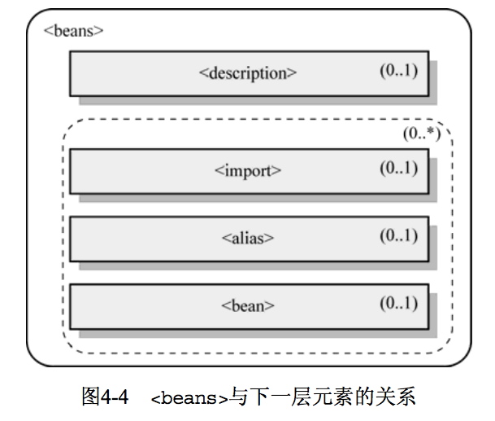

3. bean

每个业务对象作为个体，在Spring的XML配置文件中是与bean元素一一对应的。

| 属性             | 作用                                                         | 例子or值                                                     |
| ---------------- | ------------------------------------------------------------ | ------------------------------------------------------------ |
| id               | 指定当前注册对象的beanName                                   | id="djNewsListener"                                          |
| name             | 指定bean的别名                                               | name="/news/djNewsListener,dowJonesNewsListener"             |
| class            | 指定类型                                                     | class="..impl.DowJonesNewsListener"                          |
| depends-on       | 要求容器在初始化自身实例之前，首先实例化depends-on指定的实例 | depends-on="configSetup, configSetup2"                       |
| autowire         | 根据bean定义的某些特点，将相互依赖的某些bean直接自动绑定     | no：不自动绑定<br />byName：将相同名字的实例变量和bean进行绑定<br />byType：将相同类型的实例变量与bean绑定相同，有多个同类型的bean时，会报错<br />constructor：针对构造方法的自动绑定，是byType类型。<br />autodetect：byType和constructor模式的结合体 |
| dependency-check | 检查每个对象某种类型的所有依赖是否全部已经注入完成           | none：不检查<br />simple：只检查简单属性类型<br />object：只检查对象引用类型<br />all：全部检查 |
| lazy-init        | 值=true时，不在容器启动时实例化                              |                                                              |
| parent           | 指定父bean，继承父bean的依赖关系                             |                                                              |
| abstract         | 定义bean模版，值=true说明这个bean不需要实例化                |                                                              |
| init-method      | 指定初始化方法                                               |                                                              |
| destroy-method   | 指定销毁方法                                                 |                                                              |

bean标签的id和name的区别

- id：使用了约束中的唯一约束，不能含有特殊字符。
- name：没有唯一约束，但实际开发中不能重复。可以有特殊字符。

```xml
<!-- parent abstract 元素用法 -->
<bean id="newsProviderTemplate" abstract="true">
	<property name="newPersistener">
	<ref bean="djNewsPersister"/>
</property>

<!-- 继承了newsProviderTemplate的newPersistener属性的依赖关系 -->
</bean>
<bean id="superNewsProvider" parent="newsProviderTemplate" class="..FXNewsProvider">
	<property name="newsListener">
		<ref bean="djNewsListener"/> </property>
	</bean>
<bean id="subNewsProvider" parent="newsProviderTemplate" class="..SpecificFXNewsProvider">
	<property name="newsListener">
		<ref bean="specificNewsListener"/>
	</property>
</bean>
```

#### 依赖注入

1. 构造方法注入

使用 `<constructor-arg>` 元素。

| 属性  | 作用                  |
| ----- | -------------------- |
| type  | 指定参数类型          |
| index | 指定参数索引，从0开始 |

```xml
<bean id="mockBO" class="..MockBusinessObject">
	<constructor-arg type="int" index="1">
		<value>111</value>
	</constructor-arg>
	<constructor-arg type="String" index="0">
		<value>111</value>
	</constructor-arg>
	<constructor-arg name="name" vaule="abc"></constructor-arg>
</bean>
```

或者Spring的c-命名空间(Spring 3.0+)


```xml
<!-- 引入名称空间 -->
<beans 
	xmlns:c="http://www.springframework.org/schema/c">
	<!-- cd是构造器参数名 -->
	<bean id="" class="" c:cd-ref="" />
	<!-- _0是构造器参数索引 -->
	<bean id="" class="" c:_0-ref="" />
	<!-- _仅在构造器只有一个参数时使用 -->
	<bean id="" class="" c:_-ref="" />
	<!-- 装配普通值，artist是变量名 -->
	<bean id="" class="" c:_artist="" />
</beans>
```

2. setter方法注入

使用 `<property>` 元素

| 属性 | 作用                                             |
| ---- | ------------------------------------------------ |
| name | 指定该property将会注入的对象所对应的实例变量名称 |

```xml
<bean id="djNewsProvider" class="..FXNewsProvider">
	<property name="newsListener">
		<ref bean="djNewsListener"/>
	</property>
</bean>

<!-- 简写形式 -->
<bean id="djNewsProvider" class="..FXNewsProvider">
	<property name="newsListener" ref="djNewsListener"/>
</bean>
```

或者使用：p名称空间的属性注入（Spring2.5+）

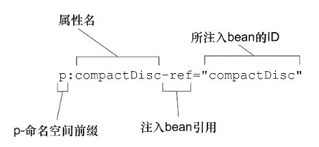

需要引入p名称空间 `xmlns:p="http://www.springframework.org/schema/p"` 

```xml
<!-- 普通属性 -->
p:属性名="属性值"
<!-- 对象属性 -->
p:属性名-ref="属性值"

<bean id="" class="" p:name="" p:name-ref=""/>
```

依赖注入的通用元素

| 元素     | 作用                                                         | 属性                                                         |
| -------- | ------------------------------------------------------------ | ------------------------------------------------------------ |
| value    | 为主体对象注入简单的数据类型（String、Java语言中的原始类型以及它们的包装器类型） |                                                              |
| ref      | 引用容器中其他的对象实例                                     | local：只能指定与当前配置的对象在同一个配置文件的对象定义的名称<br />parent：只能指定位于当前容器的父容器中定义的对象引用<br />bean：通用 |
| idref    | 为当前对象注入所依赖的对象的名称                             |                                                              |
| 内部bean | 定义在bean的内部，只有当前bean才可以使用该内部bean           |                                                              |
| list     | 有序地注入一系列依赖，注入对象类型是java.util.List及其子类或者数组类型 |                                                              |
| set      | 无序注入一系列依赖，注入对象类型是java.util.Set或者其子类    |                                                              |
| map      | 以键值对方式注入依赖                                         |                                                              |
| props    | 简化后的map，注入对象为java.util.Properties类型              |                                                              |
| null     | 是一个空元素 `<null />`                                      |                                                              |

```xml
<!-- map -->
<property name="mapping">
	<map>
    <!-- 键值对写法1：值为普通类型 -->
		<entry key="strValueKey">
			<value>something</value>
		</entry>
    <!-- 键值对写法2：值为对象类型 -->
		<entry>
			<key>objectKey</key>
			<ref bean="someObject"/>
		</entry>
    <!-- 键值对写法3：值为list数组 -->
		<entry key-ref="lstKey">
			<list>
				<value> something</value>
				<ref bean="someBeanName"/>
				<bean class="..."/>
				<!-- ... -->
			</list>
		</entry>
		<!-- ... -->
	</map>
</property>

<!-- props -->
<property name="valueSet">
	<props>
		<prop key="author">fujohnwang@gmail.com</prop>
		<prop key="support">support@spring21.cn</prop>
		<!-- ... -->
	</props>
</property>
```

3. util-命名空间

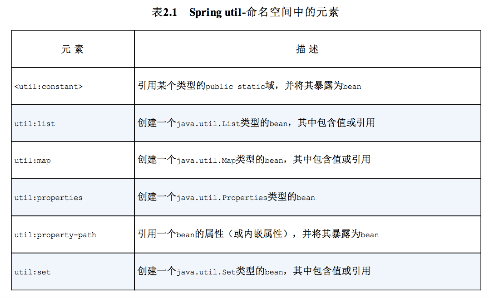

####工厂模式

1. 静态工厂方法

```java
public class StaticBarInterfaceFactory {
  public static BarInterface getInstance(String s) {
    return new BarInterfaceImpl(String s);
  }
}
```

配置方式

```xml
<bean id="foo" class="...Foo">
	<property name="barInterface">
    <!-- 此处引用的是工厂类的getInstance方法生成的对象 -->
		<ref bean="bar"/>
	</property>
</bean>
<!--
	factory-method 表示 
		1. class指向的类是工厂类
		2. 对象由该类的getInstance方法生成
-->
<bean id="bar" class="...StaticBarInterfaceFactory" factory-method="getInstance">
	<constructor-arg>
		<value>111</value>
	</constructor-arg>
</bean>
```

barInterface变量实际注入的是StaticBarInterfaceFactory工厂类的getInstance工厂方法返回的对象，即BarInterfaceImpl的实例。

用constructor-arg元素为工厂方法指定参数。

2. 非静态工厂方法

```java
public class NonStaticBarInterfaceFactory {
  public BarInterface getInstance() {
    return new BarInterfaceImpl();
  }
}
```

配置方式

```xml
<bean id="foo" class="...Foo">
	<property name="barInterface">
		<ref bean="bar"/>
	</property>
</bean>

<bean id="barFactory" class="...NonStaticBarInterfaceFactory"/>
<bean id="bar" factory-bean="barFactory" factory-method="getInstance"/>
```

NonStaticBarInterfaceFactory是作为正常的bean注册到容器的

bar中使用factory-bean属性来指定工厂方法所在的工厂类实例

用constructor-arg元素为工厂方法指定参数。

###直接编码

通过为相应的类指定对应的具体实例，可以告知IoC容器，当我们要这种类型的对象实例时，请将容器中注册的、对应的那个具体实例返回给我们。

```java
IoContainer container = ...;
container.register(FXNewsProvider.class,new FXNewsProvider());
container.register(IFXNewsListener.class,new DowJonesNewsListener());
//接口注入方式，需要加入下面这句，将“注入标志接口”与相应的依赖对象绑定一下
container.bind(IFXNewsListenerCallable.class, container.get(IFXNewsListener.class));
//...
FXNewsProvider newsProvider = (FXNewsProvider)container.get(FXNewsProvider.class);
newProvider.getAndPersistNews();
```

### 混合配置

使用根配置来将多个JavaConfig和XML文件组合起来。

#### 在JavaConfig中用XML

```java
// 把2个配置类组合在一起
@Configuration
@Import({CDPlayerConfig.class, CDConfig.class})
public class SoundSystemConfig{}

// 加载XML配置
@ImportResource("classpath:cd-config.xml")
public class SoundSystemConfig{}
```

#### 在XML中用JavaConfig

```xml
<!-- 加载其他xml配置 -->
<import resource="cdplayer-config.xml"/>

<!-- 加载JavaConfig(使用bean元素) -->
<bean class="soundsystem.CDConfig" />
```

### 分模块配置

有2种方式

1. 在appliconContext中配置多个路径

```java
ApplicationContext context = new ClassPathXmlApplicationContext("applicationContext.xml", "applicationContext2.xml");

// 传入数组
String[] locations = new String[]{ "conf/dao-tier.springxml", "conf/view-tier.springxml",  "conf/business-tier.springxml"};
ApplicationContext container = new FileSystemXmlApplicationContext(locations);
// 或者
ApplicationContext container = new ClassPathXmlApplicationContext(locations);

// 使用通配符
ApplicationContext container = new FileSystemXmlApplicationContext("conf/**/*.springxml");
```

2. 在配置文件中引入多个配置文件

```xml
<import resource="applicationContext2.xml">
```

### 环境和profile

[profile切换环境](https://www.cnblogs.com/strugglion/p/7091021.html)

#### 在JavaConfig中配置profile

@Profile

指定某个bean属于哪一个profile。应用在类级别上。spring3.2+可以应用在方法级别。

```java
@Profile("dev")
public class DataSourceConfig{}
// 这个配置类中的bean只有当 dev profile 激活时才会创建。
```

没有指定profile的bean始终都会被创建。

#### 在XML中配置profile

使用 `<beans>` 元素的profile属性， `<beans>` 元素可以嵌套。

```xml
<beans>
	<beans profile="dev"></beans>
</beans>
```

#### 激活profile

Spring在确定哪个profile处于激活状态时，需要依赖2个属性

- spring.profiles.active
- spring.profiles.default

先查询active，它的值来确定哪个profile是激活的。没有设置的话，再查询default。都没有设置，则没有激活的profile。

如何设置这两个属性？

- 作为DispatcherServlet的初始化参数
- 作为Web应用的上下文参数
- 作为JNDI条目
- 作为环境变量
- 作为JVM的系统属性
- 在集成测试类上，使用@ActiveProfiles注解设置

```xml
<!-- 在Web应用的web.xml文件中设置默认的profile -->
<web-app>
	<context-param>
		<param-name>spring.profiles.default</param-name>
		<param-value>dev</param-value>
	</context-param>
</web-app>
```

在测试环境中，可以使用@ActiveProfiles激活profile

```java
@ActiveProfiles("dev")
```

### 条件化的bean

@Conditional 注解应用到带有@Bean注解的方法上，如果给定的条件计算为true就会创建这个bean，否则忽略这个bean

设置给@Conditional 的类可以是任意实现了Condition接口的类。

```java
@Bean
@Conditional(MagicExistsConditon.class)
public MagicBean magicBean(){
	return new MagicBean();
}

public class MagicExistsConditon implements Conditon {
	public boolean matches(ConditionContext context, AnnotatedTypeMetadata metadata){
		Environment env = context.getEnvironment();
		return env.containsProperty("magic");
	}
}
```

ConditionContext是一个接口，方法如下

- getRegistry()：检查bean定义
- getBeanFactory()：检查bean是否存在，属性等
- getEnvironment()：检查环境变量是否存在，值是什么
- getResourceLoader()：检查资源
- getClassLoader()：检查类是否存在

AnnotatedTypeMetadata是一个接口，可以检查带有@Bean的方法上还有什么注解。

### bean的作用域(Scope)

Spring定义的作用域

- 单例(Singleton)：在整个应用中，只创建bean的一个实例（默认的作用域）
- 原型(Prototype)：每次注入或者通过Spring ApplicationContext 获取的时候，都会创建一个新的bean实例
- 会话(Session)：在Web应用中，为每个会话创建一个bean实例
- 请求(Request)：在Web应用中，为每个请求创建一个bean实例

可使用@Scope注解来改变作用域

```java
// 更安全不容易出错
@Scope(ConfigurableBeanFactory.SCOPE_PROTOTYPE)
@Scope(value=WebApplicationContext.SCOPE_SESSION, proxyMode=ScopedProxyMode.INTERFACES)
// 也可以使用
@Scope("prototype")
```

会话作用域和请求作用域的装配问题

在装配时，bean实际并不存在（因为会话或请求开始时，bean才会存在），装配的是bean的代理，代理将方法调用委托给实际的bean，需要在Scope内设置proxyMode属性来设置代理模式。

- 接口设置为 ScopedProxyMode.INTERFACES
- 类设置为 ScopedProxyMode.TARGET_CLASS

XML的设置方式

```xml
<bean id="" class="" scope="session">
	<!-- 默认会使用CGLib创建目标类的代理 -->
	<aop:scoped-proxy />
	<!-- 要求生成基于接口的代理 -->
	<aop:scoped-proxy proxy-target-class="false" />
</bean>
```

bean的scope属性

- singleton

在容器中只存在一个实例，所有对该对象的引用将共享这个实例。

生命周期：容器启动 <--> 容器退出

容器默认的scope

- prototype

多例模式，每次都生成一个新的对象实例给请求方。对象实例返回给请求方之后，容器就不再拥有当前返回对象的引用。由请求方负责对象的生命周期管理。

- request

只适用于Web应用程序，容器为每个HTTP请求创建一个全新的bean对象，当请求结束后，对象的生命周期结束。Spring创建类后，将这个类放入request范围内。

- session

只适用于Web应用程序，容器为每个session创建一个全新的bean对象，当 session 结束后，对象的生命周期结束。Spring创建类后，将这个类放入 session 范围内。

- global session

只适用于Web应用程序，只有应用在基于portlet的Web应用程序中才有意义，它映射到portlet的global范围的session。如果不是portlet环境，和session一样

- 自定义scope

《spring揭秘》p53

参考：
[ThreadScope](http://www.jroller.com/eu/entry/implementing_efficinet_id_generator)
[More fun with Spring scopes](http://jroller.com/eu/entry/more_fun_with_spring_scopes)

### 运行时值注入

有2种方式

- 属性占位符
- Spring表达式语言(SpEL)

#### Environment

声明属性源并通过 Spring 的 Environment 来检索属性。

```java
@Configuration
// 声明属性源
@PropertySource("classpath:/com/soundsystem/app.properties")
public class ExpressiveConfig{
	@Autowired
	Environment env;
	
	@Bean
	public BlankDisc disc(){
		// 检索属性值
		return new BlankDisc(env.getProperty("disc.title"), env.getProperty("disc.artist"));
	}
}

// 直接取得某个类型的值，参数依次为：key、返回值类型、默认值
int connectionCount = env.getProperty("db.connection.count", Integer.class, 30);

// 获得的属性必须要定义
env.getRequiredProperty("disc.title");

// 检查某个属性是否存在
boolean titileExists = env.containsProperty("disc.title");

// 将属性解析为类
Class<CompactDisc> cdClass = env.getPropertyAsClass("disc.class", CompactDisc.class);
```

#### 属性占位符

占位符形式："${...}"

```xml
<!-- 使用占位符需要 PropertySourcesPlaceholderConfigurer bean -->
<context:property-placeholder location="classpath:db.properties"/>
<bean id="" class="" c:_title="${disc.title}" />
```

自动装配使用@Value注解

```java
public BlankDisc(@Value("${disc.title}") String title, @Value("${disc.artist}") String artist){
	this.title = title;
	this.artist = artist;
}

// 使用占位符需要 PropertySourcesPlaceholderConfigurer bean
@Bean
public static PropertySourcesPlaceholderConfigurer placeholderConfigurer(){
	return new PropertySourcesPlaceholderConfigurer();
}
```

解析外部属性能够将值的处理推迟到运行时

#### Spring表达式语言（Spring3.0+）

Spring Expression Language

表达式要放在"#{...}"中，表达式会在运行时计算值

示例

```java
// T(System)相当于java.lang.System
#{T(System).currentTimeMillis()}
// 得到ID为sgtPeppers的bean的artist属性的值
#{sgtPeppers.artist}
// 系统属性disc.title的值
#{systemProperties['disc.title']}

// 表示字面值
#{1}
#{3.14}
#{9.87E4}
#{'hello'}
#{true}

// 引用bean
#{sgtPeppers}
// 引用属性
#{sgtPeppers.artist}
// 引用方法
#{sgtPeppers.getArtist()}
// 调用返回值的方法，假设返回的是String类型
#{sgtPeppers.getArtist().toUpperCase()}
// 使用"?."运算符，如果元素为null，则不调用右边的方法
#{sgtPeppers.getArtist()?.toUpperCase()}

// 使用类型。T()运算符的结果是一个Class对象，能够访问目标类型的静态方法和常量
#{T(java.lang.Math).PI}
#{T(java.lang.Math).random()}
```

使用

```java
public BlankDisc(@Value("#{systemProperties['disc.title']}") String title, @Value("#{systemProperties['disc.artist']}") String artist){
	this.title = title;
	this.artist = artist;
}
```

```xml
<bean id="" class="" c:_title="#{systemProperties['disc.title']}" />
```

SpEL运算符

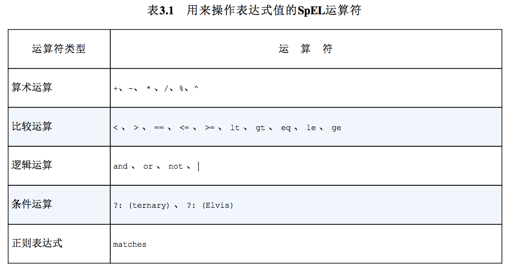

```java
#{2 * T(java.lang.Math).PI * circle.radius}
// 连接字符串，+的用法与Java相同
#{disc.title + 'by' + disc.artist}
// 表达式计算结果是boolean值
#{counter.total == 100}
// disc.title 为 null， 则表达式结果为'Red'
#{disc.title ?: 'Red'}
```

正则表达式

```java
// 检查admin.email是否符合正则表达式的规范，返回boolean值
#{admin.email matches '[a-zA-Z0-9._%+-]+@[a-zA-Z0-9.-]+\\.com'}
```

计算集合

```java
// 取出 jukebox bean 的 songs集合的第4个元素中的title属性
#{jukebox.songs[3].title}
// 随机取一个元素的title属性
#{jukebox.songs[T(java.lang.Math).random() * jukebox.songs.size()].title}
// 从String中取一个字符(c)
#{'abcd'[2]}
// 过滤集合，得到一个子集
#{jukebox.songs.?[artist eq 'Aerosmith']}
// 得到第一个满足条件的值
#{jukebox.songs.^[artist eq 'Aerosmith']}
// 得到最后一个满足条件的值
#{jukebox.songs.$[artist eq 'Aerosmith']}
// 选出特定属性，放到另外一个集合中
#{jukebox.songs.![title]}
// 组合使用：获得Aerosmith所有歌曲的名称列表
#{jukebox.songs.?[artist eq 'Aerosmith'].![title]}
```

### spring注入静态成员变量（待整理）


　　工作中遇到的问题，在工具类里面需要给静态成员变量注入值，而静态成员变量是在类加载的时候加载的，所以一直报空指针。

​       在网上找了几种方法，记录一下。

　　第一种：使用set函数注入。

```java
@Component
public class LogUtil {

    private  static PayLogDao logDao ;
    @Autowired
    public void setLogDao(PayLogDao logDao){
        LogUtil.logDao = logDao;
    }
}
```

　　第二种：使用@PostConstructy注解。

```java
@Component
public class LogUtil {
    @Autowired
    private  PayLogDao logDao ;

    private static LogUtil logUtil;

    @PostConstruct
    private void init() {
        logUtil = this;
    }

    public  static void writeSuccessLog(String ip,String mac,String clazz,String msg){
        PayLog log = new PayLog();
        log.setLogId(IDUtil.getId());
        log.setLogIp(ip);
        log.setLogMac(mac);
        log.setLogMsg(msg);
        log.setLogClass(clazz);
        log.setLogTime(DateUtil.getNowTime());
        try{
            logUtil.logDao.writeLog(log);
        }catch (Exception e){
            //捕获异常,不阻断业务
        }
    }
}
```

第一种没有尝试过，我使用的是第二种。

 

　　


## Spring整合Junit单元测试

引入spring-test包

```java
@RunWith(SpringJUnit4ClassRunner.class)
@ContextConfiguration("classpath:applicationContext.xml")
public class SpringDemo{
	@Resource(name="productDao")
	private ProductDao productDao;

	@Test
	public void demo1(){
		//test code
	}
}
```

## Bean的生命周期

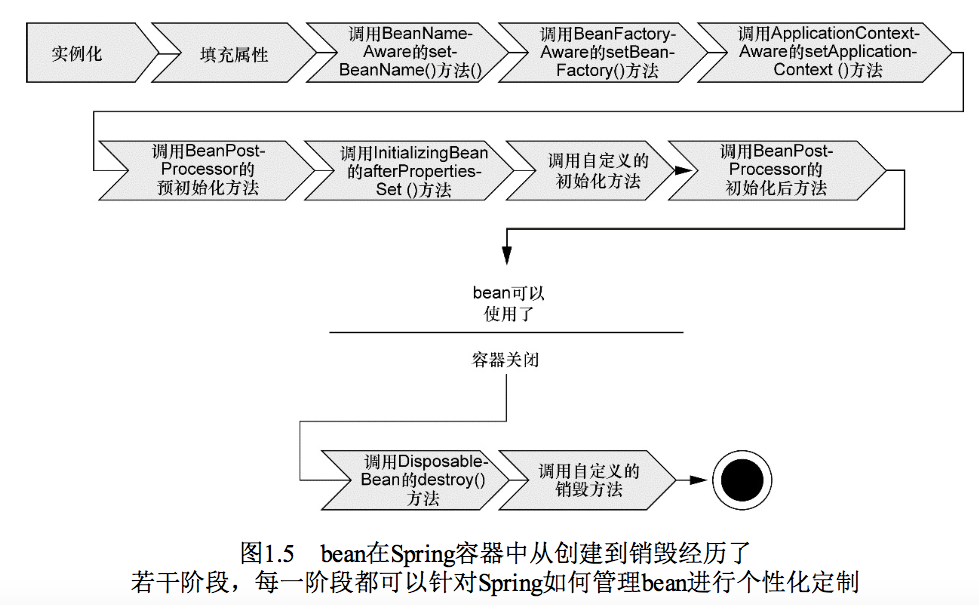

1. Spring对bean进行实例化
2. Spring将值和bean的引用注入到对应的属性中
3. 如果bean实现了BeanNameAware接口，Spring将bean的ID传递给setBeanName()方法
4. 如果bean实现了BeanFactoryAware接口，Spring将调用setBeanFactory()方法，将BeanFactory容器实例传入
5. 如果bean实现了 ApplicationContextAware 接口，Spring将调用 setApplicationContext() 方法，将 bean 所在的 ApplicationContext 引用传入
6. 如果bean实现了BeanPostProcessor接口，Spring将调用它们的postProcessBeforeInitialization()方法
7. 如果bean实现了InitializingBean接口，Spring将调用它们的afterPropertiesSet()方法。如果bean使用了init-method声明了初始化方法，该方法也会调用
8. 如果bean实现了BeanPostProcessor接口，Spring将调用它们的postProcessAfterInitialization()方法
9. 此时，bean已准备就绪，它将被应用程序使用，一直驻留在 ApplicationContext 中，直到 ApplicationContext 被销毁
10. 如果bean实现了 DisposableBean 接口，Spring将调用它们的 destroy()方法。如果bean使用了 destroy-method声明了初始化方法，该方法也会调用

分为2个阶段

- 容器启动阶段
	- 加载配置信息
	- 分析配置信息
	- 装配到BeanDefinition
	- 其他后处理
- Bean实例化阶段
	- 实例化对象
	- 装配依赖
	- 生命周期回调
	- 对象其他处理
	- 注册回调接口

### 容器启动阶段

BeanFactoryPostProcessor机制：容器扩展，允许在容器实例化相应对象之前，对注册到容器的BeanDefinition做修改。

实现类

- PropertyPlaceholderConfigurer

当 PropertyPlaceholderConfigurer 作为 BeanFactoryPostProcessor 被应用时，它会使用 properties 配置文件中的配置信息来替换相应 BeanDefinition 中占位符所表示的属性值。

- PropertyOverrideConfigurer

可以通过 PropertyOverrideConfigurer 对容器中bean定义的property信息进行覆盖替换。

需要按照如下规则提供一个 PropertyOverrideConfigurer 使用的配置文件

beanName.propertyName=value

```xml
<bean class="org.springframework.beans.factory.config.PropertyOverrideConfigurer">
	<property name="location" value="pool-adjustment.properties"/>
</bean>
```

- CustomEditorConfigurer

提供将XML中的String类型转换成各种类型的信息。

Spring内部通过JavaBean的PropertyEditor来帮助进行String类型到其他类型的转换工作。

PropertyEditor 类型

- StringArrayPropertyEditor
- ClassEditor
- FileEditor
- LocaleEditor
- PatternEditor

自定义PropertyEditor、通过CustomEditorConfigurer注册自定义PropertyEditor

《spring揭秘》p70

### Bean实例化阶段

当对应某个bean的getBean()方法第一次被调用时，bean实例化阶段的活动才会被触发。第二次被调用则会直接返回上次调用缓存的实例(prototype类型bean除外)

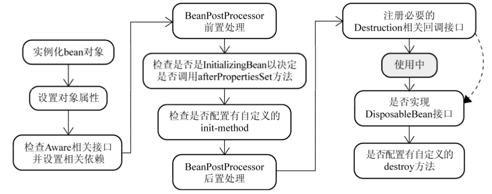

初始化bean实例

容器在内部实现的时候，采用“策略模式(Strategy Pattern)”来决定采用何种方式初始化bean实例

InstantiationStrategy 是实例化策略的抽象接口，它的实现类

- SimpleInstantiationStrategy：通过反射来实例化对象实例，但不支持方法注入方式的对象实例化
- CglibSubclassingInstantiationStrategy：默认使用。有反射方式、CGLIB 的动态字节码生成，2种方式生成对象实例

返回相应的BeanWrapper实例

BeanWrapper接口通常在Spring框架内部使用，它有一个实现类 BeanWrapperImpl。其作用是对某个bean进行“包裹”，然后对这个“包裹”的bean进行操作。

#### Aware接口

之后，Spring容器会检查当前对象实例是否实现了一系列的以Aware命名结尾的接口定义。如果是，则将这些Aware接口定义中规定的依赖注入给当前对象实例。

BeanFactory

- BeanNameAware：将该对象实例的bean定义对应的beanName设置到当前对象实例
- BeanClassLoaderAware：将对应加载当前bean的Classloader注入当前对象实例
- BeanFactoryAware：BeanFactory容器会将自身设置到当前对象实例

ApplicationContext

- ResourceLoaderAware：将当前ApplicationContext自身设置到对象实例
- ApplicationEventPublisherAware：将当前ApplicationContext自身设置到对象实例
- MessageSourceAware：将当前ApplicationContext自身设置到对象实例
- ApplicationContextAware：将当前ApplicationContext自身设置到对象实例

#### BeanPostProcessor

- postProcessBeforeInitialization()：BeanPostProcessor前置处理
- postProcessAfterInitialization()：BeanPostProcessor后置处理

自定义BeanPostProcessor

《spring揭秘》p79


##容器类型

Spring提供了2种容器类型：

- BeanFactory

基础类型IoC容器。默认采用延迟初始化策略(lazy-load)。只有当客户端对象需要访问容器中的某个受管对象的时候，才对该受管对象进行初始化以及依赖注入操作。

- ApplicationContext

ApplicationContext所管理的对象，在该类型容器启动之后，默认全部初始化并绑定完成。目前使用的都是ApplicationContext。

两者之间的关系

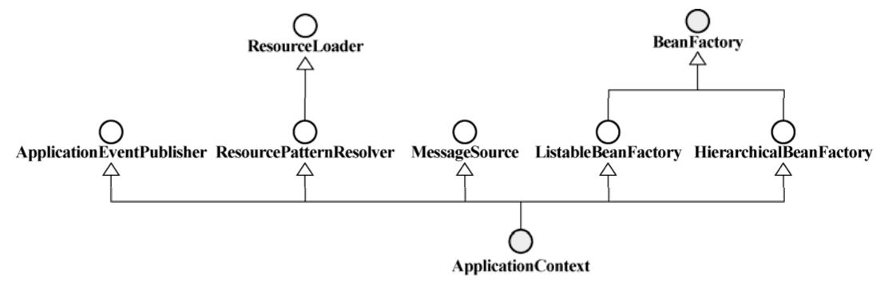

###BeanFactory

BeanFactory接口只定义如何访问容器内管理的Bean的方法，各个BeanFactory的具体实现类负责具体Bean的注册以及管理工作。

#### 注册和依赖绑定的底层实现

- DefaultListableBeanFactory：是BeanFactory、BeanDefinitionRegistry的实现类
- BeanDefinitionRegistry：接口定义抽象了Bean的注册逻辑
- BeanDefinition：每一个受管的对象，在容器中都会有一个 BeanDefinition 的实例(instance)与之相对应，该BeanDefinition的实例负责保存对象的所有必要信息。当客户端向BeanFactory请求相应的对象时，BeanFactory会通过这些信息为客户端返回一个完备可用的对象实例。

```java
public static void main(String[] args) {
  DefaultListableBeanFactory beanRegistry = new DefaultListableBeanFactory();
  BeanFactory container = (BeanFactory)bindViaCode(beanRegistry);
  FXNewsProvider newsProvider = (FXNewsProvider)container.getBean("djNewsProvider");
  newsProvider.getAndPersistNews();
}

public static BeanFactory bindViaCode(BeanDefinitionRegistry registry) {
  AbstractBeanDefinition newsProvider = new RootBeanDefinition(FXNewsProvider.class,true);
  AbstractBeanDefinition newsListener = new RootBeanDefinition(DowJonesNewsListener.class,true);
  AbstractBeanDefinition newsPersister = new RootBeanDefinition(DowJonesNewsPersister.class,true);
// 将bean定义注册到容器中
  registry.registerBeanDefinition("djNewsProvider", newsProvider);
  registry.registerBeanDefinition("djListener", newsListener);
  registry.registerBeanDefinition("djPersister", newsPersister);
// 指定依赖关系
  // 1. 可以通过构造方法注入方式
	ConstructorArgumentValues argValues = new ConstructorArgumentValues();
  argValues.addIndexedArgumentValue(0, newsListener);
  argValues.addIndexedArgumentValue(1, newsPersister);
  newsProvider.setConstructorArgumentValues(argValues);
// 2. 或者通过setter方法注入方式
	MutablePropertyValues propertyValues = new MutablePropertyValues();
  propertyValues.addPropertyValue(new ropertyValue("newsListener",newsListener));
  propertyValues.addPropertyValue(new PropertyValue("newPersistener",newsPersister));
  newsProvider.setPropertyValues(propertyValues);
// 绑定完成
	return (BeanFactory)registry;
}
```


《Spring揭秘》-第四章-4.4 容器背后的秘密

###ApplicationContext

常用实现如下

```java
//从应用的类路径下的XML文件中加载ApplicationContext
ApplicationContext context = new ClassPathXmlApplicationContext("knight.xml");
//从文件系统下的XML文件中加载
ApplicationContext context = new FileSystemXmlApplicationContext("c:/knight.xml");
//从java配置中加载
ApplicationContext context = new AnnotationConfigApplicationContext(com.springinaction.knights.config.KnightConfig.class);
//从java配置中加载Spring Web的ApplicationContext
ApplicationContext context = new AnnotationConfigWebApplicationContext();
//从Web应用下的XML文件中加载
ApplicationContext context = new XmlWebApplicationContext();
```

#### 统一资源加载策略

spring的资源抽象和加载策略，框架内使用Resource接口作为所有资源的抽象和访问接口。

##### Resource

资源的抽象

- ByteArrayResource：将字节(byte)数组提供的数据作为一种资源进行封装
- ClassPathResource：从Java应用程序的ClassPath中加载具体资源并进行封装
- FileSystemResource：对java.io.File类型的封装
- UrlResource：通过java.net.URL进行的具体资源查找定位的实现类
- InputStreamSource：将InputStream视为一种资源的类，较少用

##### ResourceLoader

查找和定位资源

- DefaultResourceLoader：默认实现类

1. 首先检查资源路径是否以classpath:前缀打头，如果是，则尝试构造ClassPathResource类型资源并返回。
2. 否则
	1. 尝试通过URL，根据资源路径来定位资源，如果没有抛出MalformedURLException，则会构造UrlResource类型的资源并返回
	2. 如果还是无法根据资源路径定位指定的资源，则委派 getResourceByPath(String)方法来定位，该方法默认实现逻辑是：构造ClassPathResource类型的资源并返回。

- FileSystemResourceLoader

覆写了getResourceByPath(String)方法，使之从文件系统加载资源并以 FileSystemResource类型返回。

##### ResourcePatternResolver

批量查找的 ResourceLoader

根据路径匹配模式返回多个Resource

常用实现

PathMatchingResourcePatternResolver

构造PathMatchingResourcePatternResolver实例
1. 指定一个ResourceLoader
	1. 不指定，PathMatchingResourcePatternResolver 内部会默认构造一个 DefaultResourceLoader实例。PathMatchingResourcePatternResolver 在加载资源的行为上会与DefaultResourceLoader基本相同， 只存在返回的Resource数量上的差异。
2. PathMatchingResourcePatternResolver内部会将匹配后确定的资源路径， 委派给它的ResourceLoader来查找和定位资源。

#### 扮演ResourceLoader

ApplicationContext继承了ResourcePatternResolver，所以，任何的ApplicationContext实现都可以看作是一个 ResourceLoader 甚至ResourcePatternResolver。

注入ResourceLoader对象

如果某个类需要注入ResourceLoader类型的对象，可以让其实现ResourceLoaderAware或ApplicationContextAware接口。

容器启动的时候，就会自动将当前ApplicationContext容器本身注入到FooBar中，因为ApplicationContext类型容器可以自动识别Aware接口。

注入Resource对象

```xml
<bean id="mailer" class="...XMailer">
	<property name="template" value="..resources.default_template.vm"/>
</bean>
```

Resource加载行为

支持前缀，如file:、http:、ftp: 等，表明资源类型。Spring新增了一种资源路径协议：classpath:

`classpath*:` 与 `classpath:` 的唯一区别就在于，如果能够在classpath中找到多个指定的资源，则返回多个。

```java
// 代码中使用协议前缀
ResourceLoader resourceLoader = new FileSystemXmlApplicationContext("classpath:conf/container-conf.xml");
```

```xml
<!-- 配置中使用协议前缀 -->
<bean id="..." class="...">
	<property name="..."> 
		<value>classpath:resource/template.vm</value>
	</property>
</bean>
```

在没有指明前缀时，

ClassPathXmlApplicationContext默认从classpath中加载bean定义配置文件

FileSystemXmlApplicationContext默认从文件系统中加载bean定义文件

#### 国际化

《spring揭秘》p95

#### 内部事件发布

《spring揭秘》p100


## 待归类

#### FactoryBean

《spring揭秘》p57

是一种生产对象的工厂Bean，作用是使用Java代码配置bean

#### Scope=prototype的问题

《spring揭秘》p60

方法注入

配合prototype使用，使每次调用都让容器返回新的实例对象

其他方式

BeanFactoryAware接口

自动将容器本身注入该bean

ObjectFactoryCreatingFactoryBean

方法替换

MethodReplacer

BeanFactoryPostProcessor


## AOP

面向切面编程（aspect-oriented programing，AOP）

AOL：AOP的实现语言

引入jar包
aopalliance
aspectj.weaver
spring.aop
spring.aspect

### AOP术语

横切关注点：跨多个应用对象的逻辑、功能

切面：特殊的类，实现了横切关注点的模块化

#### Joinpoint

连接点，可以被拦截的点（在程序执行过程中能够应用通知(Advice)的所有点）。可以有以下几种：

- 方法调用
- 方法调用执行
- 构造方法调用
- 构造方法执行
- 字段设置
- 字段获取
- 异常处理执行
- 类初始化

#### Pointcut

切点，真正被拦截到的点，缩小切面(Aspect)通知的连接点的范围。定义了通知被应用的具体位置（在哪些连接点）

使用以下方式来指定切点

- 明确的类和方法名
- 正则表达式
- 动态创建

#### Advice

通知，定义了切面的工作，何时执行这个工作。是对方法的增强

如果将Aspect比做OOP中的Class，那么Advice就相当于Class中的Method。

有5种类型

- Before Advice
- After Advide
- After returning Advice
- After throwing Advice
- Around Advice

Advice按照自身实例能否在目标对象类的所有实例中共享，可分为

per-class类型：可共享，只提供方法拦截，不会为目标对象保存任何状态或添加新的特征。

per-instance类型：只有Introduction是这种类型。

Advice执行顺序

1. 都声明在同一个Aspect内：先声明的Advice拥有最高优先级。Before Advice的最高优先级的最先运行，AfterReturningAdvice最高优先级的最后运行。
2. 不在同一个Aspect内：未实现Ordered接口，则执行顺序不确定。Ordered接口定义的顺序，适用于自动代理机制的织入方式。

#### Aspect

切面，是通知和切点的结合

Aspect的实例化模式

Spring AOP支持 singleton、perthis、pertarget三种

#### Introduction

引入，向现有的类添加新方法和属性。是类层面的增强。

#### Target

被增强的对象

#### Weaving

织入，把切面应用到目标对象并创建新的代理对象的过程。

在目标对象的生命周期里有多个点可以进行织入：

- 编译期
- 类加载期
- 运行期


### 底层原理

Spring 提供了4种类型的 AOP 支持

- 基于代理的经典 Spring AOP
- 纯 POJO 切面
- @AspectJ 注解驱动的切面
- 注入式 AspectJ 切面

Spring 的通知是Java编写的。Spring在运行时通知对象。Spring AOP 构建在动态代理基础上，因此spring只支持方法级别的Joinpoint。

- jdk动态代理：只能对实现了接口的类产生代理
- cglib动态代理：对没有接口的类产生代理，生成子类对象

动态代理

由一个类(java.lang.reflect.Proxy)和一个接口(java.lang.reflect.InvocationHandler)组成。

默认情况下，如果 Spring AOP 发现目标对象实现了相应Interface，则采用动态代理机制为其生成代理对象实例。如果没有，则会尝试使用CGLIB(Code Generation Library)的开源的动态字节码生成类库，为目标对象生成动态的代理对象实例。

《java reflection in action》对reflection机制进行了详尽描述

动态字节码生成

原理：对目标对象进行继承，生成子类，通过子类覆盖父类的方法，将横切逻辑的实现放到子类中。让系统使用子类对象，就可以达到与代理模式相同的效果。

### AspectJ 的切点表达式

在Spring AOP中，要使用 AspectJ 的切点表达式语言来定义切点。

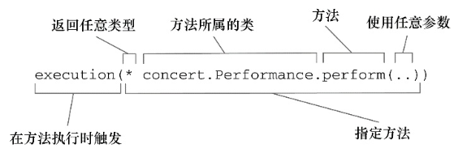

使用 AspectJ 指示器

```java
//"*"表示返回任意类型，".."表示含有任意个参数。within表示范围
execution(* concert.Performance.perform(..)) && within(concert.*)
//bean限定bean的ID
execution(* concert.Performance.perform()) and !bean('woodstock')
```

AspectJ的Pointcut表达式支持"&&", "||", "!"逻辑运算符

Spring AOP支持的AspectJ的Pointcut表达式

- execution

`execution(modifiers-pattern? ret-type-pattern declaring-type-pattern? name-pattern(param-pattern) throws-pattern?`

其中，后面带? 的可省略

可以使用通配符 `*` 和 `..`

`*` 可匹配0-N个任意相邻字符

`..` 可以在 declaring-type-pattern 和 param-pattern 的位置使用。前者可以指定多个层次的类型声明，后者表示有0-N个参数，类型不限。

```java
execution(void doSomething(String))
//可简化为
execution(* *(String))
//方法只有一个参数，类型不限
execution(* *(*))

//只能指定到cn.spring21这一层下的类
execution(void cn.spring21.*.doSomething(*))
//匹配到cn.spring21这一层下的及下层包下的类
execution(void cn.spring21..*.doSomething(*))
//表示方法有0—N个参数
execution(void *.doSomething(..))
```

- within

只接受类型声明，匹配指定类下所有的Joinpoint

```java
within(cn.spring21.aop.target.MockTarget)
within(cn.spring21.aop.target.*)
```

- this和target

在AspectJ中，this指代调用方法一方所在的对象，target指代被调用方法所在的对象。可以使用这两个标志符限定方法的调用关系。

在Spring AOP中，this指代目标对象的代理对象，target指代目标对象。

- args

捕捉拥有指定参数类型、指定参数数量的方法级Joinpoint，不管该方法在什么类中被声明

- @within

只接受注解类型，对被指定注解类型所标注的类生效，该类内所有的joinpoint都会被匹配

- @target

类似@within，是运行时动态匹配joinpoint

- @args

检查方法参数类型，传入的参数类型拥有@args指定的注解，joinpoint会被匹配。每次方法调用都会检查。

- @annotation

检查方法，有被@annotation标志指定的注解，则会被匹配。@annotation所接受的注解类型只应用于方法级别。

参照[The AspectJ Programming Guide](http://www.eclipse.org/aspectj/doc/released/progguide/index.html)获得Pointcut表达式相关内容

出了AspectJ的指示器外，Spring还引入了一个新的bean()指示器，使用beanID或者beanName作为参数来限制切点只匹配特定bean。

```java
execution(* concert.Performance.perform()) and bean('woodstock')
```

### XML配置切面

|配置元素|用途|
|-|-|
|aop:after|后置通知（不管怎样都执行）|
|aop:after-returning|返回通知|
|aop:after-throwing|异常通知|
|aop:around|环绕通知|
|aop:before|前置通知|
|aop:pointcut|切点|
|aop:aspect|切面|
|aop:advisor|通知器|
|aop:aspectj-autoproxy|启用@AspectJ注解驱动的切面|
|aop:config|顶层的aop配置元素，aop元素大都包含在该元素内|
|aop:declare-parents|为被通知对象引入额外的方法|


在xml中声明切面

```xml
<aop:config>
  <!-- 将Audience类声明为切面 -->
	<aop:aspect ref="audience">
		<!-- 定义切点 -->
		<aop:pointcut
			id="performance"
			expression="execution(* concert.Performance.perform(..))" />
		<!-- 为通知传递参数 -->
		<aop:pointcut id="args" expression="execution(* soundsystem.CompactDisc.playTrack(int)) and args(trackNumber)" />

		<!-- 前置通知 -->
		<aop:before
			pointcut="execution(* concert.Performance.perform(..))"
			method="takeSeats" />
		<aop:before
			pointcut-ref="performance"
			method="silenceCellPhones" />
		<aop:around
			pointcut-ref="args"
			method="watchPerformance" />
	</aop:aspect>
</aop:config>

<bean id="audience" class="" />
```

所有配置元素都包含在 `<aop:config>` 中。该元素只有一个属性proxy-target-class，可以控制是使用基于接口的代理还是基于类的代理。一个配置文件中可以配置多个 `<aop:config>`

该元素内部可以有 `<aop:pointcut>` `<aop:advisor>` `<aop:aspect>` 3个子元素，且必须按照顺序进行配置。

`<aop:advisor>` 

属性

- id：当前Advisor的标志id
- pointcut-ref：指向Advisor对应的Pointcut
- advice-ref：指向Advisor对应的Advice
- order：指定Advisor的顺序号
- pointcut：指定AspectJ形式的Pointcut表达式

`<aop:pointcut>`

属性
- type：指定expression的表达式形式，[regex(正则表达式形式，目前不支持), aspectj(AspectJ形式，默认)]
- expression：pointcut表达式

有2个位置

1. 在 `<aop:config>` 下面，Pointcut定义可以被其余Advisor定义和Aspect定义共享
2. 在 `<aop:aspect>` 元素内部，只能在所声明的Aspect内部引用。

`<aop:aspect>` 

将Aspect像普通bean一样注册到容器，然后使用 `<aop:aspect>` 引用它

属性

- id：标志id
- ref：Aspect对应的容器内的bean
- order：Aspect对应的顺序号

Advice

在 `<aop:aspect>` 内，有 `<aop:before>`、`<aop:after-returning>`、`<aop:after-throwing>`、`<aop:after>`、`<aop:around>`。使用method属性指定定义Advice的方法。

通用属性

- pointcut-ref：切点引用
- method：通知的方法

`<aop:after-returning>` 的returning属性指定返回参数名称（与方法声明中的参数名称相同）

`<aop:after-throwing>` 的throwing属性指定异常参数名称（与方法声明中的参数名称相同）

Introduction

属性

- types-matching：指定要对哪些目标对象进行Introduction逻辑的织入
- implement-interface：指定新增加的Introduction行为的接口定义类型
- default-impl：新增加的Introduction行为的接口定义的默认实现类

```xml
<aop:declare-parents
	types-matching="cn.spring21.unveilspring.target.*"
		implement-interface="cn.spring21.unveilspring.introduction.ICounter"
		default-impl="cn.spring21.unveilspring.introduction.CounterImpl" />
		
<!-- 或者使用delegate-ref属性引用一个Spring bean -->
<aop:declare-parents
	types-matching="cn.spring21.unveilspring.target.*"
		implement-interface="cn.spring21.unveilspring.introduction.ICounter"
		delegate-ref="counterImpl" />

<bean id="counterImpl" class="cn.spring21.unveilspring.introduction.CounterImpl" />
```

### 注解驱动的切面

在JavaConfig中启动AspectJ注解的自动代理

```java
@Configuration
// 启动AspectJ自动代理
@EnableAspectJAutoProxy
@ComponentScan
public class ConcertConfig{
}
```

在XML中启动AspectJ注解的自动代理

```xml
<!-- 需要引入aop命名空间 -->
<beans>
	<context:component-scan base-package="" />
	<!-- 启动AspectJ自动代理 -->
	<aop:aspectj-autoproxy />
</beans>
```

AspectJ提供了5个注解来定义通知

- @After：通知方法会在目标方法返回或抛出异常后调用（不论怎样都会调用，类似finally）
- @AfterReturning：通知方法会在目标方法返回后调用（正常返回调用）
- @AfterThrowing：通知方法会在目标方法抛出异常后调用
- @Around：通知方法会在目标方法执行前后调用
- @Before：通知方法会在目标方法执行前调用

@Pointcut注解

声明频繁使用的pointcut表达式

```java
// 整个类是切面。
@Aspect
public class Audience{
	@Pointcut("execution(* concert.Performance.perform(..))")
	// performance是空方法，为方便添加@Pointcut注解
	public void performance(){}
	// Before是通知，参数是切点。
	@Before("performance()")
	public void takeSeats(){
		//code
	}
}
```

处理通知中的参数

1. 将第一个参数声明为org.aspectj.lang.JoinPoint类型

除 Around Advice 和 Introduction 外，其他Advice都可以这样使用。

```java
@Before("execution(boolean *.execute())")
public void setupResourcesBefore(JoinPoint joinpoint) throws Throwable{
	joinpoint.getArgs();
}
//JoinPoint参数永远处于第一个位置，可选
```

2. 通过args标志绑定

当args标志符接受的不是具体的对象类型，而是某个参数名称时，它会将这个参数名称对应的参数值绑定到对Advice方法的调用。

除execution外，其他标志都可以这样使用。

```java
@Before(value="execution(boolean *.execute(String,..)) && args(taskName)")
public void setupResourcesBefore(String taskName) throws Throwable{
	//访问taskName参数
}

@Pointcut("execution(boolean *.execute(String,..)) && args(taskName)")
private void resourceSetupJoinPoints(String taskName){}
@Before(value="resourceSetupJoinPoints(taskName)")
public void setupResourcesBefore(String taskName) throws Throwable{
	//访问taskName参数
}
```

@AfterThrowing有一个属性throwing，将异常绑定到具体方法参数上。

```java
@AfterThrowing(pointcut="execution(boolean *.execute(String,..))",  throwing="e")
public void afterThrowing(JoinPoint joinpoint, RuntimeException e){
	//code
}
```

@AfterReturning有一个属性returning，将返回值绑定到具体方法参数上。

@Around
第一个参数必须是ProceedingJoinPoint类型

```java
@Aspect
public class Audience{
	@Pointcut("execution(* concert.Performance.perform(..))")
	public void performance(){}
	
	@Around("performance()")
	public void watchPerformance(ProceedingJoinPoint jp){
		// ...
		// 调用被通知的方法
		jp.proceed();
		// ...
	}
}
```

@DeclareParents注解

Introduction，引入新功能

使用@DeclareParents注解对Aspect中的Field进行标注。

属性

- value：指定将要应用到的目标对象。可通过通配符指定一批目标对象。
- defaultImpl：指定新增加的接口定义的实现类。

```java
//将ICounter的行为逻辑加到ITask类型的目标实现类MockTask上
@Aspect
public class IntroductionAspect{
	@DeclareParents(
		value="...MockTask",
		defaultImpl=CounterImpl.class
	)
	public ICounter counter;
}

// 将DefaultEncoreable应用到concert.Performance+
@Aspect
public class EncoreableIntroducer{
	@DeclareParents(value="concert.Performance+", defaultImpl=DefaultEncoreable.class)
	public static Encoreable encoreable;
}
```

### 注入式AspectJ切面

AspectJ以Java语言扩展的方式实现的，需要额外学习新的工具和语法。

示例

```java
public aspect CriticAspect{
	// 构造器
	public CriticAspect () {}
	// 切点
	pointcut performance() : execution(* perform(..));
	// 通知
	afterReturning() : performance () {
		System.out.println(criticismEngine.getCriticism());
	}
	
	private CriticismEngine criticismEngine;
	
	public void setCriticismEngine(CriticismEngine criticismEngine) {
		this.criticismEngine = criticismEngine;
	}
}
```

需要在Spring配置中把切面声明为一个bean

```xml
<bean class="com.springinaction.springidol.CriticAspect" factory-method="aspectOf">
	<property name="criticismEngine" ref="criticismEngine" />
</bean>
```

AspectJ切面提供了一个静态的aspectOf()方法，该方法返回切面的一个单例。

### 扩展

在目标对象中使用AopContext.currentProxy()就可以取得当前目标对象所对应的代理对象。

## Spring 访问数据

DAO模式：Data Access Object（数据访问对象），该模式可以完全分离数据的访问和存储

### 数据访问异常层次体系

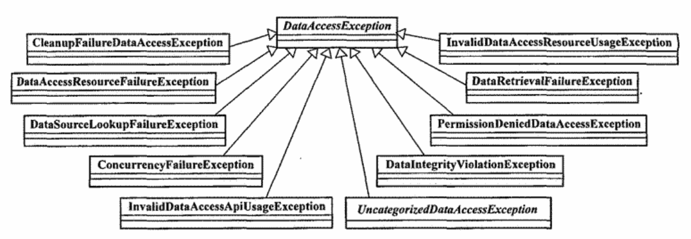

- CleanupFailureDateAccessException：对使用的资源清理失败
- DataAccessResourceFailureException：无法访问相应的数据资源
- DataSourceLookupFailureException：对JNDI服务上的DataSource进行查找，但查找失败。
- ConcurrencyFailureException：并发进行数据访问，操作失败。
- InvalidDataAccessApiUsageException：以错误的方式，使用了特定的数据访问API
- InvalidDataAccessResourceUsageException：以错误的方式，访问数据资源
- DataRetrievalFailureException：获取预期的数据却失败了
- PermissionDeniedDataAccessException：访问没有访问权限的数据
- DataIntegrityViolationException：数据一致性冲突异常
- UncategorizidDataAccessException：无法详细分类的数据访问异常

DataAccessException是一个非检查型异常，没有必要捕获。

### 基于Template的JDBC

模板方法模式(Template Method Pattern)

将相似的逻辑提取到模板方法类中实现，让子类根据需要实现自定义的逻辑。

Spring将数据访问过程中固定和可变的部分明确划分成两个不同的类：模板(template)和回调(callback)

模板处理数据访问的固定部分：事务控制、管理资源、处理异常

回调处理可变的部分：sql语句、参数绑定、整理结果集

### 配置数据源

数据源DataSource的角色，可以看作是JDBC的连接工厂，是作为获取数据库资源的统一接口。

Spring提供了在上下文中配置数据源bean的多种方式，包括

- 通过JDBC驱动程序定义的数据源
- 通过JNDI查找的数据源
- 连接池的数据源

#### 使用JNDI数据源

jee命名空间下的 `<jee:jndi-lookup>` 元素可以用于检索JNDI中的任何对象，并将其作为Spring的bean。

```xml
<jee:jndi-lookup id="dataSource" jndi-name="/jdbc/SpitterDS" resource-ref="true" />
```

属性

jndi-name：指定JNDI中资源的名称。

resource-ref：如果应用程序运行在Java应用服务器中，设置为true，这样jndi-name会自动添加"java:comp/env/"前缀。

JavaConfig方式

```java
@Bean
public JndiObjectFactoryBean dataSource(){
	JndiObjectFactoryBean jndiObjectFB = new JndiObjectFactoryBean();
	jndiObjectFB.setJndiName("jdbc/SpittrDS");
	jndiObjectFB.setResourceRef(true);
	jndiObjectFB.setProxyInterfacee(javax.sql.DataSource.class);
	return jndiObjectFB;
}
```

#### 使用数据源连接池

开源数据源连接池

- [DBCP](http://jakarta.apache.org/commons/dbcp)
- [c3p0](http://sourceforge.net/projects/c3p0)
- [BoneCP](http://jolbox.com)

##### DBCP

BasicDataSource的配置方式

```xml
<bean id="dataSource" class="org.apache.commons.dbcp.BasicDataSource"
	p:driverClassName="org.h2.Driver"
	p:url="jdbc:h2:tcp://localhost/~/spitter"
	p:username="sa"
	p:password=""
	p:initialSize="5"
	p:maxActive="10" />

<!-- 第二种方式 -->
<bean id="dataSource" class="org.apache.commons.dbcp.BasicDataSource" destroy-method="close">
	<property name="url">
    <!-- 使用了属性文件中的值 -->
		<value>${jdbc.url}</value>
	</property>
	<property name="driverClassName">
		<value>${jdbc.driver}</value>
	</property>
	<property name="username">
		<value>${jdbc.username}</value>
	</property>
	<property name="password">
		<value>${jdbc.password}</value>
	</property>
</bean>
<!-- 数据源连接到 JdbcTemplate 模板 -->
<bean id="jdbcTemplate" class="org.springframework.jdbc.core.JdbcTemplate">
	<property name="dataSource">
		<ref bean="dataSource" />
	</property>
</bean>
```

JavaConfig方式

```java
@Bean
public BasicDataSource dataSource(){
	BasicDataSource ds = new BasicDataSource();
	ds.setDriverClassName("org.h2.Driver");
	ds.setUrl("");
	ds.setUsername("");
	ds.setPassword("");
	ds.setInitialSize(5);
	ds.setMaxActive(10);
	return ds;
}
```

在代码中初始化 JdbcTemplate

```java
//使用 Commons DBCP 创建 JdbcTemplate
BasicDataSource dataSource = new BasicDataSource();
dataSource.setDriverClassName("com.mysql.jdbc.Driver");
dataSource.setUrl("jdbc:mysql://localhost/mysql?useUnicode=true&amp;characterEncodeing=utf8&amp;failOverReadOnly=false&amp;roundRobinLoadBalance=true");
dataSource.setUsername("user");
dataSource.setPassword("password");

JdbcTemplate jdbcTemplate = new JdbcTemplate(dataSource);
```

BasicDataSource的池配置属性

|池配置属性|所指定的内容|
|-|-|
|initialSize|池启动时创建的连接池数量|
|maxActive|同一时间可从池中分配的最多连接数。0表示无限制|
|maxIdle|池里不会被释放的最多空闲连接数。0表示无限制|
|maxOpenPreparedStatements|同一时间能分配的预处理语句(prepared statement)的最大数量。0表示无限制|
|maxWait|抛出异常之前，池等待回收的最大时间（没有可用连接时）。-1表示无限等待|
|minEvictableIdleTimeMillis|在连接池中保持空闲而不被回收的最大时间|
|minIdle|在不创建新连接的情况下，池中保持空闲的最小连接数|
|poolPreparedStatements|是否对预处理语句(prepared statement)进行池管理(boolean类型)|

##### C3P0

配置方式

```xml
<bean id="dataSource" class="com.mchange.v2.c3p0.ComboPooledDataSource">
	<property name="driverClass" value="com.mysql.jdbc.Driver" />
	<property name="jdbcUrl" value="" />
	<property name="user" value="" />
	<property name="password" value="" />
</bean>
```

#### 基于JDBC驱动的数据源

Spring提供了3个数据源

- DriverManagerDataSource：每个连接请求时都会返回一个新建的连接
- SimpleDriverDataSource：与DriverManagerDataSource工作方式类似，直接使用JDBC驱动
- SingleConnectionDataSource：每个连接请求时都会返回同一个连接（只有一个连接的数据源）。

XML配置方式

```xml
<bean id="dataSource" class="org.springframework.jdbc.datasource.DriverManagerDataSource"
	p:driverClassName="org.h2.Driver"
	p:url="jdbc:h2:tcp://localhost/~/spitter"
	p:username="sa"
	p:password="" />
```

JavaConfig方式

```java
@Bean
public DataSource dataSource(){
	DriverManagerDataSource ds = new DriverManagerDataSource();
	ds.setDriverClassName("org.h2.Driver");
	ds.setUrl("");
	ds.setUsername("");
	ds.setPassword("");
	return ds;
}
```

#### 使用嵌入式的数据源

嵌入式数据库作为应用的一部分运行，而不是应用连接的独立数据库服务区。

Spring的jdbc命名空间能够简化嵌入式数据库的配置。

```xml
<beans ...>
	<jdbc:embeded-database id="dataSource" type="H2">
		<!-- 引入在数据库中创建表的sql语句 -->
		<jdbc:script location="com/habum/a/spitter/db/jdbc/schema.sql" />
		<!-- 在数据库中填充测试数据 -->
		<jdbc:script location="com/habum/spitter/db/jdbc/test-data.sql" />
	</jdbc:embeded-database>
</beans>
```

JavaConfig方式

```java
@Bean
public DataSource dataSource(){
	return new EmbededDatabaseBuilder()
		.setType(EmbededDatabaseType.H2)
		.addScript("classpath:schema.sql")
		.addScript("classpath:test-data.sql")
		.build();
}
```

#### 使用profile选择数据源

```java
@Configuration
public class DataSourceConfiguration{
	// 开发环境
  @Profile("development")
  @Bean
  public DataSource embededDataSource(){
    return new EmbededDatabaseBuilder()
      .setType(EmbededDatabaseType.H2)
      .addScript("classpath:schema.sql")
      .addScript("classpath:test-data.sql")
      .build();
  }
  
  // QA环境
  @Profile("qa")
  @Bean
  public BasicDataSource dataSource(){
    BasicDataSource ds = new BasicDataSource();
    ds.setDriverClassName("org.h2.Driver");
    ds.setUrl("");
    ds.setUsername("");
    ds.setPassword("");
    ds.setInitialSize(5);
    ds.setMaxActive(10);
    return ds;
  }
  
  // 生产环境
  @Profile("production")
  @Bean
  public JndiObjectFactoryBean dataSource(){
    JndiObjectFactoryBean jndiObjectFB = new JndiObjectFactoryBean();
    jndiObjectFB.setJndiName("jdbc/SpittrDS");
    jndiObjectFB.setResourceRef(true);
    jndiObjectFB.setProxyInterfacee(javax.sql.DataSource.class);
    return jndiObjectFB;
  }
}
```

#### 自定义DataSource

《spring揭秘》14章p299

#### JdbcDaoSupport

Spring提供了JdbcDaoSupport作为所有基于JDBC进行数据访问的DAO实现类的超类，提供了DataSource和JdbcTemplate

```java
public class GenericDao extends JdbcDaoSupport implements IDaoInterface{
  public void update(DomainObject obj){
    getJdbcTemplate().update(...);
  }
  ...
}
```

### JDBC模板

共有3个模板类供选择

- JdbcTemplate：基本模板，支持数据库访问和基于索引参数的查询
- NamedParameterJdbcTemplate：执行查询时可用将值以命名参数的方式绑定到SQL，而不是简单的索引参数
- SimpleJdbcTemplate：利用Java5的特性简化JDBC模板的使用（已废弃）

#### JdbcTemplate

继承层次

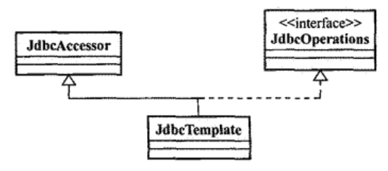

JdbcAccessor 是一个抽象类，为子类提供了一些公共属性

- DataSource：数据源
- SQLExceptionTranslator：负责对SQLException的转译

JdbcTemplate中各种模板方法，按照Callback接口公开的API自由度的大小，可分为4组

- 面向Connection的模板方法（可以对Connection做处理）
- 面向Statement的模板方法。
- 面向PrepareStatement的模板方法。
- 面向CallableStatement的模板方法

对于DataSource实现来说，当从中请求Connection以及相关的Statement时，返回的其实是他们的代理。

想要获得原始的Connection或Statement，就可以通过JdbcTemplate的setNativeJdbcExtractor方法设置相应的NativeJdbcExtractor实现类

JdbcTemplate获取的Connection实际是从DataSourceUtils获取的，增加了一些东西，以便事务管理时使用。

```java
Connection con = DataSourceUtils.getConnection(getDataSource());

stmtToUse = this.nativeJdbcExtractor.getNativeStatement(stmt);
```

SQLExceptionTranslator负责对SQLException转译到统一的异常体系(DataAccessException)，有3个实现类：

- SQLErrorCodeSQLExceptionTranslator：基于ErrorCode进行异常转译
- SQLStateSQLExceptionTranslator：基于SQLException.getSQLState()返回的信息进行转译
- SQLExceptionSubclassTranslator：将jdbc4新定义的异常体系转化到数据访问异常体系

转译流程

《spring揭秘》p271

##### 配置

JavaConfig方式

```java
@Bean
public JdbcTemplate jdbcTemplate(DataSource dataSource){
	return new JdbcTemplate(dataSource);
}
```

#####查询数据

queryForObject()

参数

- String对象，SQL语句
- RowMapper对象，用来从ResultSet中提取数据并构建域对象
- 可变参数列表，列出了要绑定到查询上的索引参数值（SQL语句中的参数）

RowMapper可以使用Lambda表达式

用于查询的回调接口定义主要有3种

- ResultSetExtractor

属于JdbcTemplate内部使用的callback接口，需要自行处理ResultSet

- RowCallbackHandler

只关注单行结果的处理

- RowMapper

只关注处理单行的结果，处理后的结果会由ResultSetExtractor实现类进行组合。

使用不同回调接口处理结果的代码示例

```java
String sql = "select * from customer";

// ResultSetExtractor
// 返回结果需要进行强制类型转换
List customerList = (List) jdbcTemplate.query(sql, new ResultSetExtractor() {
	public Object extractData(ResultSet rs) throws SQLException, DataAccessException {
		List customers = new ArrayList();
		while(rs.next()){
			Customer customer = new Customer();
			customer.setFirstName(rs.getString(1));
			customer.setLastName(rs.getString(2));
			...
			customers.add(customer);
		}
		return customers;
	}
});

// RowMapper
// 直接返回List型结果
List customerList = jdbcTemplate.query(sql, new RowMapper(){
	public Object mapRow(ResultSet rs, int rowNumber) throws SQLException {
		Customer customer = new Customer();
		customer.setFirstName(rs.getString(1));
		customer.setLastName(rs.getString(2));
		...
		return customer;
	}
});

// RowCallbackHandler
final List customerList = new ArrayList();
// 返回值为void
jdbcTemplate.query(sql, new RowCallbackHandler(){
	public void processRow(ResultSet rs) throws SQLException {
		Customer customer = new Customer();
		customer.setFirstName(rs.getString(1));
		customer.setLastName(rs.getString(2));
		...
		customerList.add(customer);
	}
})
```

#####更新数据

插入、更新、删除操作，使用JdbcTemplate的update()模板方法。返回值为操作所影响的记录数目。

```java
jdbcTemplate.update("insert into customer(customerName, age, ...) values('darran', '28', ...");
int affectedRows = jdbcTemplate.update("update customer set customerName=?, age=? where customerId=?", new Object[]{"Daniel", new Integer(36), new Integer(101)});
```

如果想对更新操作有更多的控制权，可以使用PreparedStatement相关的Callback接口。

```java
// int update(String sql, PreparedStatementSetter pss)
String sql = "update customer set customerName=?, age=? where customerId=?";
int affectedRows = jdbcTemplate.update(sql, new PreparedStatementSetter() {
	public void setValues(PreparedStatement ps) throws SQLException {
		ps.setString(1, "Daniel");
		ps.setInt(2, 36);
		ps.setInt(3, 101);
	}
});

// int update(PreparedStatementCreator psc)
int affectedRows = jdbcTemplate.update(new PreparedStatementCreator() {
	public PreparedStatement createPreparedStatement(Connection con) throws SQLException {
		PreparedStatement ps = con.preparedStatement(sql);
		ps.setString(1, "Daniel");
		ps.setInt(2, 36);
		ps.setInt(3, 101);
		return ps;
	}
});
```

还可使用execute()方法，该方法没有返回值，只接受sql语句。

批量更新使用batchUpdate()方法

```java
public int[] insertNewCustomers(final List customers){
	String sql = "insert into customer value(?,?,...)"
	jdbcTemplate.batchUpdate(sql, new BatchPreparedStatementSetter() {
		// 返回批量更新的数目
		public int getBatchSize() {
			return customer.size();
		}
		// 设置具体的更新数据
		public void setValues(PreparedStatement ps, int i) throws SQLException {
			Customer customer = (Customer) customers.get(i);
			ps.setString(1, customer.getFirstname());
			ps.setString(2, customer.getLastName());
			...
		}
	});
}
```

##### 调用存储过程

递增主键、LOB类型处理

《spring揭秘》p281

#### NamedParameterJdbcTemplate

NamedParameterJdbcTemplate 支持使用命名参数，使用更有语义的符号来代替SQL中的?参数占位符。

声明方式

```java
@Bean
public NamedParameterJdbcTemplate jdbcTemplate(DataSource dataSource){
	return new NamedParameterJdbcTemplate(dataSource);
}
```

使用

```java
public void addSpitter(Spitter spitter){
  // 数据源
  DataSource dataSource = ...;
NamedParameterJdbcTemplate npJdbcTemplate = new NamedParameterJdbcTemplate(dataSource);
  // SQL语句
  private static final String SQL_INSERT = "insert into tablename (username, password, fullname)" + "values (:username, :password, :fullname)";
  // 参数
	Map<String, Object> paramMap = new HashMap<String, Object>();
	paramMap.put("username", sppiter.getUsername());
	paramMap.put("password", sppiter.getPassword());
	paramMap.put("fullname", sppiter.getFullName());
	// 执行
	npJdbcTemplate.update(SQL_INSERT, paramMap);
}
```

`:username` 就是命名的参数符号。

使用了命名参数查询，绑定值的顺序就无所谓了。

使用 BeanPropertySqlParameterSource 可以对 Bean进行封装，作为参数传递给 NamedParameterJdbcTemplate 进行数据访问。


引入属性文件

1. 通过bean标签引用（很少用）

```xml
<bean class="org.springframework.beans.factory.config.PropertyPlaceholderConfigurer">
	<property name="location" value="classpath:jdbc.properties" />
</bean>
```

2. 通过context标签引用

```xml
<context:property-placeholder location="classpath:jdbc.properties" />
```

使用属性的值

${jdbc.name}

### 基于操作对象的JDBC

《spring揭秘》第14章


## Spring事务管理

设计理念：让事务管理的关注点与数据访问关注点相分离。

### 事务家族成员

- Resource Manager(RM)：负责存储并管理系统数据资源的状态。如数据库服务器、JMS消息服务器。
- Transaction Processing Monitor(TPM, TP Monitor)：在分布式事务场景中协调包含多个RM的事务处理。如，中间件、应用服务器
- Transaction Manager(TM)：TP Monitor的核心模块，负责多RM之间事务处理的协调工作，并提供事务界定、事务上下文传播等功能接口。
- Application：应用程序，事务边界的出发点。

按事务中涉及的RM的多寡，可分为

- 全局事务：有多个RM，需要TP Monitor的介入，
- 局部事务：只有一个RM


Spring的事务抽象包括3个主要接口

- PlatformTransactionManager：是Spring事务抽象架构的核心接口，主要作用是为应用程序提供事务界定的统一方式。
- TransactionDefinition：负责定义事务相关属性，包括隔离级别、传播行为
- TransactionStatus：负责事务开启到结束期间的事务状态

#### TransactionDefinition

定义事务的相关属性，如

- 隔离(Isolation)级别
- 传播行为(Propagation Behavior)
- 超时时间(Timeout)
- 是否只读(ReadOnly)

##### 隔离级别

TransactionDefinition 内定义了5个常量用于标志可供选择的隔离级别

- ISOLATION_DEFAULT ：表示使用数据库默认的隔离级别
- ISOLATION_READ_UNCOMMITTED ：Read Uncommitted隔离界别
- ISOLATION_READ_COMMITTED ：Read Committed隔离界别
- ISOLATION_REPEATABLE_READ ：Repeatable read隔离级别
- ISOLATION_SERIALIZABLE ：Serializable隔离级别

##### 传播行为

事务的传播行为主要用来解决业务层方法相互调用的问题。表示整个事务处理过程所跨越的业务对象，将以什么样的行为参与事务。

比如，当Foobarservice调用 FooService 和 BarService 两个方法的时候，FooService 的业务方法和 BarService 的业务方法可以指定它们各自的事务传播行为。

有7种传播行为，分为3类。

- 保证多个操作在同一个事务中
	- PROPAGATION_REQUIRED ：默认值。如果当前存在事务，则加入当前事务；如果没有，就创建一个新的事务。
	- PROPAGATION_SUPPORTS ：如果当前存在事务，则加入当前事务；如果没有，就不使用事务，直接执行。
	- PROPAGATION_MANDATORY ：强制要求当前存在一个事务；如果没有，就报异常。
- 保证多个操作不在同一个事务中
	- PROPAGATION_REQUIRED_NEW ：不管当前是否存在事务，都会创建新的事务；如果当前有事务，就将事务挂起。
	- PROPAGATION_NOT_SUPPORTED ：不使用事务；如果当前有事务，就将事务挂起。
	- PROPAGATION_NEVER： 不使用事务；如果当前有事务，就报异常。
- 嵌套式事务
	- PROPAGATION_NESTED：当前有事务，则在当前事务的一个嵌套事务中执行；如果没有，则创建新事务。

提供了 TIMEOUT_DEFAULT 常量，用来指定事务的超时时间。默认值为-1(采用当前事务系统默认的超时时间)

相关实现类

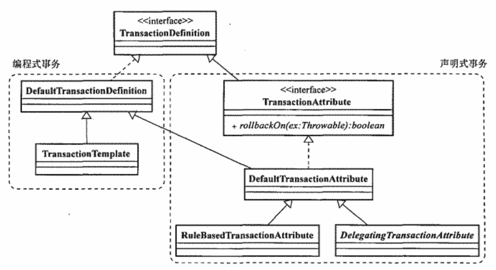

- DefaultTransactionDefinition：默认实现类，提供了各事务属性的默认值
	- propagationBehavior = PROPAGATION_REQUIRED
	- isolationLevel = ISOLATION_DEFAULT
	- timeout = TIMEOUT_DEFAULT
	- readOnly = false

TransactionAttribute 主要面向使用Spring AOP进行声明式事务管理的场合。添加了一个rollbackOn()方法。

DefaultTransactionAttribute 指定了当异常类型为 unchecked exception 的情况下将回滚事务。

RuleBasedTransactionAttribute 允许同时指定多个回滚规则，它的rollbackOn将传入的异常类型和回滚规则进行匹配，决定是否回滚事务。


#### TransactionStatus

事务状态：用于记录在事务管理过程中，事务状态的对象

可以做的工作如下：

- 查询事务状态
- 通过setRollbackOnly()方法标记当前事务以便使其回滚
- 创建内部嵌套事务（适用于支持保留点的PlatformTransactionManager）

实现类

- DefaultTransactionStatus

#### PlatformTransactionManager 

接口，是Spring事务抽象框架的核心组件，整个抽象体系基于Strategy模式。

实现类

面向局部事务的

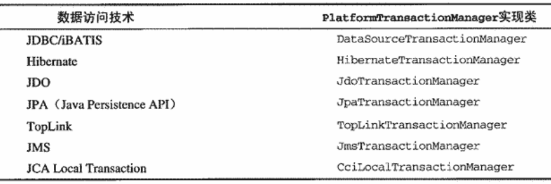

面向全局事务的

- JtaTransactionManager

各实现类的实现原理

《spring揭秘》19章p385


管理事务的时候

1. PlatformTransactionManager 根据 TransactionDefinition 进行事务的管理
2. 在事务管理过程中，产生各种状态，将这些信息记录到 TransactionStatus 的对象中。


## Spring事务管理

有2种方式

1. 编程式管理
2. 声明式管理

### 编程式管理

TransactionTemplate 对 PlatformTransactionManager 相关的事务界定操作、异常处理进行了模板化封装，提供了两个Callback接口

- TransactionCallback：带有返回结果
- TransactionCallbackWithoutResult：不带返回结果

必须的配置

```xml
<!-- 配置事务管理器 -->
<bean id="transactionManager" class="org.springframework.jdbc.datasource.DataSourceTransactionManager">
	<property name="dataSource" ref="dataSource" />
</bean>

<!-- 事务管理模板类 -->
<bean id="transactionTemplate" class="org.springframework.transction.support.TransactionTemplate">
	<property name="transactionManager" ref="transactionManager" />
</bean>
```

编写代码

```java
// 注入 TransactionTemplate
TransactionTemplate txTemplate = ...;
// 事务管理
txTemplate.execution(new TransactionCallbackWithoutResult() {
	// 将需要事务的操作，放在该方法内
	public Object doInTransactionWithoutResult(TransactionStatus txStatus) {
		try {
			boolean needRollback = false;
			Object result = null;
			// 各种事务操作
			// 保留点
			Object savePoint = txStatus.createSavepoint();
			// 回退到保留点
			txStatus.rollbackToSavepoint(savePoint);

			if(needRollback){
				// 事务回滚
				txStatus.setRollbackOnly();
			}
			return result;
		} catch (CheckedException e) {
			throw new RuntimeException(e);
		} finally {
			// 是否保留点
			txStatus.releaseSavepoint(savePoint);
		}
	}
});
```

### 声明式事务管理

基于AOP的思想

#### XML方式

使用tx命名空间

```xml
<!-- 配置DataSource -->
<bean id="dataSource" class="org.apache.commons.dbcp.BasicDataSource"
	p:driverClassName="com.mysql.jdbc.Driver"
	p:url="jdbc:mysql://localhost/databaseName"
	p:username="sa"
	p:password="" />

<!-- 配置JdbcTemplate -->
<bean id="jdbcTemplate" class="org.springframework.jdbc.core.JdbcTemplate">
	<property name="dataSource" ref="dataSource" />
</bean>

<!-- 配置事务管理器 -->
<bean id="transactionManager" class="org.springframework.jdbc.datasource.DataSourceTransactionManager">
	<property name="dataSource" ref="dataSource" />
</bean>

<!-- 配置事务的属性定义 -->
<tx:advice id="txAdvice" transaction-manager="transactionManager">
	<tx:attributes>
		<!-- 定义以transfer开头的方法为通知，并定义它的传播行为 -->
		<tx:method name="transfer*" propagation="PROPAGATION_REQUIRED" />
	</tx:attributes>
</tx:advice>

<!-- 配置切面 -->
<aop:config>
	<aop:pointcut expression="execution(* transfer(..))" id="pointcut1" />
	<!-- advisor是一个切点和一个通知的组合，aspect是多个切点和多个通知的组合 -->
	<aop:advisor advice-ref="txAdvice" pointcut-ref="pointcut1" />
</aop:config>
```

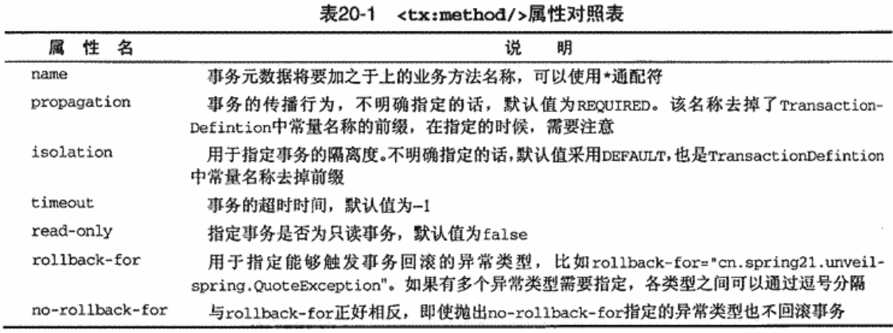

使用ProxyFactory + TransactionInterceptor

```xml
<!-- 配置DataSource -->
<bean id="dataSource" class="org.apache.commons.dbcp.BasicDataSource"
	p:driverClassName="com.mysql.jdbc.Driver"
	p:url="jdbc:mysql://localhost/databaseName"
	p:username="sa"
	p:password="" />

<!-- 配置JdbcTemplate -->
<bean id="jdbcTemplate" class="org.springframework.jdbc.core.JdbcTemplate">
	<property name="dataSource" ref="dataSource" />
</bean>

<!-- 配置事务管理器 -->
<bean id="transactionManager" class="org.springframework.jdbc.datasource.DataSourceTransactionManager">
	<property name="dataSource" ref="dataSource" />
</bean>

<!-- 配置事务属性 -->
<bean id="transctionInterceptor" class="org.springframework.transction.interceptor.TransctionInterceptor">
	<property name="transactionManager" ref="transactionManager" />
	<!-- 方式1来设置transactionAttributeSource -->
	<property name="transactionAttributes">
		<props>
			<!-- 配置业务对象上每个业务方法的事务管理信息 -->
			<prop key="saveQuate">PROPAGATION_REQUIRED</prop>
			...
		</props>
	</property>
	<!-- 方式2来设置transactionAttributeSource -->
	<property name="transactionAttributeSource">
		<value>
			<!-- 需要使用全限定的类名和方法名 -->
			org.spring21.package.IQuoteService.saveQuate=PROPAGATION_REQUIRED
			...
		</value>
	</property>
</bean>

<!-- 使用ProxyFactoryBean 织入 TransctionInterceptor -->
<bean id="quoteServiceTarget" class="...QuoteService">
	<property name="jdbcTemplate" ref="jdbcTemplate" />
</bean>

<!--  -->
<bean id="quoteService" class="org.springframework.aop.framework.ProxyFactoryBean">
	<property name="target" ref="quoteServiceTarget" />
	<property name="proxyInterfaces" value="...IQuoteService" />
	<property name="interceptorNames">
		<list>
			<value>transactionInterceptor</value>
		</list>
	</property>
</bean>

<bean id="client" class="...QuoteServiceClient">
	<property name="quoteService" ref="quoteService" />
</bean>
```

#### 注解方式

```xml
<!-- 配置事务管理器 -->
<bean id="transactionManager" class="org.springframework.jdbc.datasource.DataSourceTransactionManager">
	<property name="dataSource" ref="dataSource" />
</bean>

<!-- 开启注解事务 -->
<tx:annotation-driven transaction-manager="transactionManager" />
```

在业务层添加注解@Transactional，@Transactional标注在类上，类中的方法将继承该注解里的信息。


## 待整理

AOP

在切面上使用注解

```xml
<!-- 在配置文件中开启注解的AOP开发 -->
<aop:aspectj-autoproxy/>
```

JDBC 模板使用

入门程序

```java
public void demo(){
	// 创建连接池
	DataSource datasource = ...;
	// 创建jdbc模板
	JdbcTemplate jdbcTemplate = new JdbcTemplate(datasource);
	// 更新数据
	jdbcTemplate.update("insert into account values (null, ?, ?)", "songs", 1000);
}
```

将连接池和jdbc模板交由spring管理，使用xml配置。

事务

事务管理的api

## 参考资料

[Spring官网](https://spring.io)

[官方说明文档](https://docs.spring.io/spring/docs/current/spring-framework-reference/index.html)

[开源组织 AOP Alliance](http://aopalliance.sourceforge.net/)
