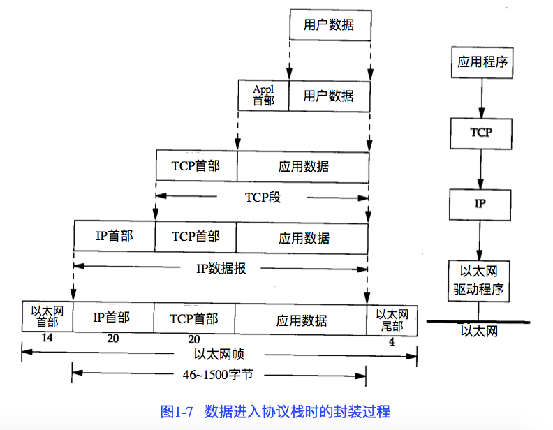
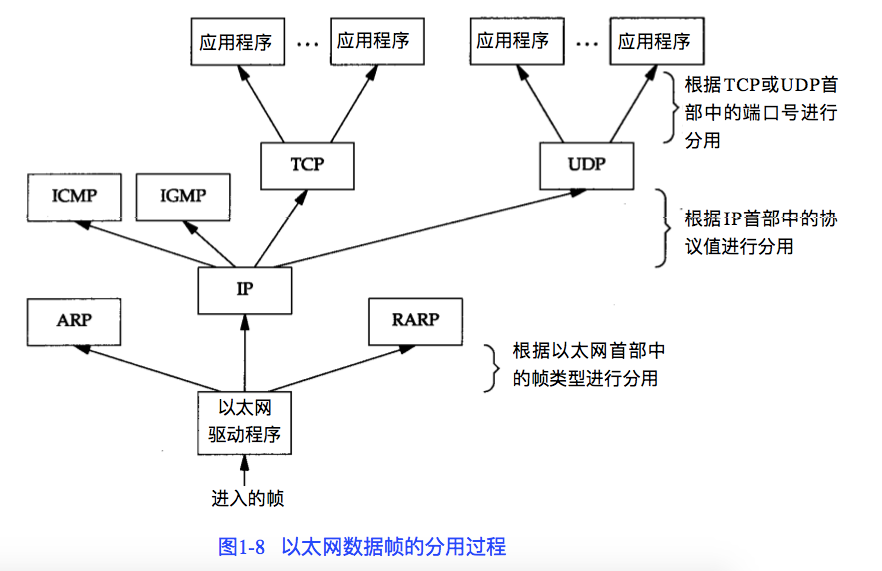

# TCP/IP 详解

## 概述

分层

- 链路层：对应操作系统驱动程序和计算机中的网卡，它们一起处理与电缆的物理接口细节。
- 网络层：处理分组在网络中的活动，如分组的选路。网络层协议包括：IP,ICMP,IGMP
- 运输层：为两台主机上的应用程序提供端到端的通信。
- 应用层：负责处理特定的应用程序细节。

TCP段、IP数据报（分组，可分片）、帧（46-1500字节）

互联网的地址

互联网上的每个接口必须有一个唯一的IP地址，因此需要InterNIC(Internet Network Information Center)为接入的互联网的网络分配IP地址。它只分配网络号，主机号由系统管理员来负责。





一般来说，TCP服务器是并发的（多线程处理任务），而UDP服务器是重复的（只能依次处理任务）。

知名端口号是 1-1023

TCP/IP 分配的临时端口号是 1024-5000

`/etc/services` 里包含了人们熟知的端口号

保留端口号：Unix系统的概念，介于1-1023之间，只有超级权限的进程才允许给自己分配一个保留端口号。

RFC

所有关于 Internet 的正式标准都以 RFC(Request for Comment) 文档出版。每一篇都用一个数字标识，数字越大说明 RFC 内容越新。

发邮件来获取 RFC

```
To: rfc-info@ISI.EDU
Subject: getting rfcs
help: ways_to_get_rfcs
```

赋值 RFC (Assigned Numbers RFC)列出了所有 Internet 协议中使用的数字和常数。

应用编程接口

使用 TCP/IP 协议的应用程序通常采用两种应用编程接口（API）：socket和TLI（运输层接口，Transport Layer Interface）

