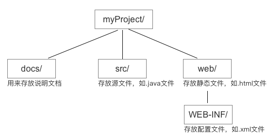

# Tomcat

Tomcat是一个web服务器软件，也是一个servlet容器。用来调用servlet的doGet、doPost等方法，封装HTTP请求和响应对象，管理servlet生命周期和servlet的资源。

web服务器

- 作用：处理客户端的请求，返回资源or信息

- 实质：一台配置比较高的电脑

web服务器软件

- 作用：处理客户端的请求

容器可以提供什么？

- 通信支持。创建ServerSocket、监听端口、创建流等
- 生命周期管理。加载类、实例化和初始化servlet、调用servlet方法、垃圾回收等
- 多线程支持。为每个servlet请求创建一个新的java线程。
- 声明方式实现安全。使用XML部署描述文件来配置安全性。
- JSP支持。将JSP翻译成Java代码


## Tomcat目录结构

- bin：包含jar、bat文件。starup.bat
- conf：配置。server.xml，web.xml
- lib：tomcat运行所需的jar文件
- logs：运行的日志文件
- temp：临时文件
- webapps：发布到tomcat服务器上的项目，放在此目录
- work：jsp翻译成class文件存放地

将web服务器的本地文件系统中的某个目录映射成一个虚拟web目录，这个过程叫web发布。

当浏览器请求某个路径的资源时，Tomcat按照最长路径匹配原则进行处理。

1. 首先以请求路径中最深子目录作为一个虚拟子目录名称，查看是否存在这个虚拟子目录
   1. 不存在，则查找是否存在上一级目录名称的虚拟子目录
   2. 存在，则进入该虚拟目录中去查找指定名称的资源。

## web项目目录结构

开发环境


tomcat建议的开发环境



部署环境


## 部署&发布

Tomcat部署Java Web应用程序有两种方式：静态部署和动态部署。（这里记录的是静态部署的笔记）
- 静态部署：指的是服务器启动之前部署Web应用程序，只有当服务器启动之后，Web应用程序才能访问。
- 动态部署：指的是服务器启动之后部署web应用程序，而不用重新启动服务器。动态部署要用到服务器提供的manager.war文件。在目录.../webapps/下没有该文件，需重新下载tomcat，否则不能完成以下的功能。

静态部署分为以下3种方式

1. 利用Tomcat自动部署

- 拷贝文件到webapps/ROOT下（<tomcat主目录>/webapps/ROOT 目录可以自动映射为Web站点的虚拟根目录），在浏览器访问：http://localhost:8080/stu.xml
- 在webapps新建一个文件夹project（一个文件夹表示一个项目），访问：http://localhost:8080/project/stu.xml

2. 配置虚拟路径

   使用帮助文档

   位置：tomcat首页--Tomcat Documentation--Reference--Apache Tomcat Configuration--Context

   文档地址：http://localhost:8080/docs/config/context.html

   在conf/server.xml，找到host元素，添加 `<context docBase="" path="/a"></Context>`

   docBase：项目的路径地址

   path：对应的虚拟路径，要以/开头。

   在浏览器上访问：http://localhost:8080/a/person.xml

3. 配置虚拟路径

   在tomcat/conf/catalina/localhost/文件夹下新建xml文件

   在文件里写入

   ```xml
   <?xml version="1.0" encoding="utf-8"?>
   <context docBase="" path="/person"></Context>
   ```

   在浏览器上访问
   http://localhost/8080/person/person.xml

一个web虚拟目录就是一个独立的Web应用程序，每个web应用程序的配置信息都保存在各自所映射的文件系统目录下的Web-INF/web.xml文件中。web.xml也称为应用程序的部署描述符。

<tomcat主目录>/conf/web.xml 文件中设置的信息对所有的web应用程序都起作用。

`<welcome-file-list>`  元素用于设置Web目录的默认网页文档列表

```xml
<welcome-file-list>
	<welcome-file>index.html</welcome-file>
	<welcome-file>index.htm</welcome-file>
	<welcome-file>index.jsp</welcome-file>
</welcome-file-list>
```


配置虚拟主机

<Host>：建立一个web站点
<Engine>：构建一个处理客户端请求的引擎


给eclipse配置tomcat
在server里面右键新建一个服务器

eclipse配置tomcat

使用servlet

1. 建web工程
2. 测试
3. 新建类，实现servlet接口
4. 注册：配置servlet(web-inf/web.xml)


Linux命令

查看日志（tomcat目录下）：`tail -f logs/catalina.out`

## Tomcat 热部署

1. 修改linux系统中的tomcat的conf/tomcat-users.xml配置文件。添加用户名、密码、权限

```xml
<role rolename="manager-gui" />
<role rolename="manager-script" />
<user username="tomcat" password="tomcat" roles="manager-gui, manager-script" />
```

2. 配置tomcat插件

在pom中的tomcat插件中，加入

```xml
<!-- <port>8080</port> -->
<path>/program</path>
<url>http://ip:port/manager/text</url>
<username>tomcat</username>
<password>tomcat</password>
```

3. 使用maven命令进行部署

```
tomcat7:deploy
tomcat7:redeploy
tomcat7:redeploy -DskipTests
```


热部署、热加载

热加载：服务器会监听 class 文件改变，包括web-inf/class,wen-inf/lib,web-inf/web.xml等文件，若发生更改，则局部进行加载，不清空session ，不释放内存。开发中用的多，但是要考虑内存溢出的情况。

热部署：整个项目从新部署，包括你从新打上.war 文件。 会清空session，释放内存。项目打包的时候用的多。

1.热加载：在server.xml -> context 属性中 设置 reloadable="true"

```xml
<Context docBase="xxx" path="/xxx" reloadable="true"/>
```

2. 热部署：在server.xml -> context 属性中 设置  autoDeploy="true"

```xml
<Context docBase="xxx" path="/xxx" autoDeploy="true"/> 
```

或者

```xml
<Host name="localhost"  appBase="webapps" 
            unpackWARs="true" autoDeploy="true" 
            xmlValidation="false" xmlNamespaceAware="false"> 
<Context docBase="xxx" path="/xxx"/>  
</Host> 
```

也可以通过Eclipse上设置实现上述配置文件的修改 

Eclipse的工程名右键: properties->Tomcat->General->Make this context as reloadable(reloadable="true")不要选中 Eclipse的工程名右键: Tomcat project->Update Context Definition

    path: 项目访问路径
    docBase: 项目路径。/开头的是实际路径，没有/开头的为相对路径，相对于webapps
    reloadable: 开启热更新，热部署

[CentOS下安装Tomcat](https://blog.51cto.com/13525470/2073657)

补充说明：使用wget获取jdk的命令为 `wget --no-check-certificate --no-cookies --header "Cookie: oraclelicense=accept-securebackup-cookie" +链接地址` 否则会安装失败（因为默认是不接受协议）

遇到的问题

访问远程服务器Tomcat 8的管理页面报错

```
403 Access Denied
You are not authorized to view this page.
```

解决方法

修改 `/webapps/manager/META_INF/context.xml` 文件，将文件中对访问的来源受限设置注释:

```xml
<Context antiResourceLocking="false" privileged="true" >
  <!--注释这里，去除对访问权限的设置
    <Valve className="org.apache.catalina.valves.RemoteAddrValve"
         allow="127\.\d+\.\d+\.\d+|::1|0:0:0:0:0:0:0:1" />
  -->
</Context>
```

然后直接刷新页面就行了，无需重启tomcat。


显式部署
显式部署总的来说就是以目录结构的方式部署，不打包，只要项目根目录（Maven为webapp  普通项目为webRoot/webContent）有WEB-INF（WEB-INF下有classes，jar包，配置文件），有静态资源（HTML，CSS，JS ，图片等）即可。再通过一个在Tomcat中的配置文件来将我们的程序发布出来。

显式部署有两种方式：

在Tomcat的conf/Catalina/localhost目录下创建一个XML文件
在Tomcat的conf/server.xml文件中添加一个Context元素
方式一
如果决定给每一个上下文都创建一个XML文件（第一种方式），那么这文件名就很重要了，因为上下文路径就是从这个文件名的衍生得到的。例如，将一个Demo1.xml文件放在conf/Catalina/localhost目录下，那么这个应用程序的上下文路径就是Demo1，访问的URL就为：http://localhost:8080/Demo1

这个上下文文件只有一行代码：

<?xml version="1.0" encoding="UTF-8"?>
<Context docBase="d:/Demo1" reloadable="true"></Context>
这里的docBase是必须的属性，它定义了应用程序的位置。reloadable属性是可选的，如果存在并且值为true，那么一旦程序中Java类文件或者是其他资源文件有任何添加，减少或者是更新，TOmcat都可以检测到，并且重新加载该应用程序

当把上下文文件添加到Tomcat的指定目录下，Tomcat就会自动加载应用程序。当删除这个文件时，Tomcat就会自动卸载应用程序

方式二
在conf/server.xml文件中的Host标签下添加一个Context元素

<Host appBase="webapps" autoDeploy="true" name="localhost" unpackWARs="true">
      
      <Context path="/Demo2" docBase="d:/Demo1" reloadable="true"></Context>

</Host>
以第一种方式不同之处在于此处定义上下文需要给上下文路径定义path属性，这个path属性的值表示需要访问的项目名，访问的URL就为：http://localhost:8080/Demo2

一般来说，不建议通过server.xml来管理上下文，因为修改后只有重启Tomcat后，配置才能生效。不过，如果有多个应用程序需要测试，使用这种方式或许更为方便，因为可以在一个文件中同时管理所有的应用程序

隐式部署
方式三
隐式部署真是太方便了，非常建议使用这种方式部署项目。通过将一个war文件或者整个应用程序复制到Tomcat的webapps(Tomcat默认的部署项目位置，可以在server.xml文件中修改，但不建议修改)目录下，启动服务器就可以了

**将应用部署到Tomcat根目录的三种方法
将应用部署到Tomcat根目录的目的是可以通过“http://[ip]:[port]”直接访问应用，而不是使用“http://[ip]:[port]/[appName]”上下文路径进行访问。

方法一：（最简单直接的方法）
删除原 webapps/ROOT 目录下的所有文件，将应用下的所有文件和文件夹复制到ROOT文件夹下。

方法二：
删除原webapps/ROOT 目录下的所有文件，修改文件“conf/server.xml”，在Host节点下增加如下Context的内容配置：

<Host name="localhost"  appBase="webapps" unpackWARs="true" autoDeploy="true"
    xmlValidation="false" xmlNamespaceAware="false">
    ......
    <Context path="" docBase="C:/apache-tomcat-6.0.32/myapps/bc.war"></Context>
</Host>
注意：

1）path 的值设置为空； 
2）应用不要放到tomcat的webapps目录下(如上述配置是放到自定义的文件夹myapps内的)，否则访问时路径会有问题； 
3）docBase指定到绝对路径。

如配置此设置后重启tomcat，如果docBase指向的是war文件，则会自动将war解压到 webapps/ROOT 目录；如果docBase指向的是应用已解压好的目录，如 docBase=”C:/apache-tomcat-6.0.32/myapps/bc” ，则tomcat不会生成 webapps/ROOT 目录（这种情况下，这样就可以不用删除 webapps/ROOT 目录，但 webapps/ROOT 目录内的内容是无法访问的），访问时将直接使用docBase指定的目录。

方法三：
与方法二类似，但不是修改全局配置文件“conf/server.xml，而是在“conf/Catalina/localhost”目录下增加新的文件”ROOT.xml”（注意大小写），文件内容如下：

<?xml version="1.0" encoding="UTF-8"?>
<Context path="" docBase="C:/apache-tomcat-6.0.32/myapps/bc.war" reloadable="true">
</Context>
注意：

Tomcat5.0以下版本在d:/Tomcat/conf/Catalina/localhost目录下会自动生成了一个ROOT.xml文件，但是5.0以上版本已不再生成此文件。


另外一个

在conf/server.xm的<Host></Host>区域的末尾添加

<Context path="" docBase="/home/apache-tomcat-8.5.35/webapps/myproject" debug="0" reloadable="true"/>


该监听端口

```sh
vim /usr/local/tomcat/conf/server.xml
```

```xml
 <!-- 把8080改成80的话，重启后就监听80端口 -->
<Connector port="80" protocol="HTTP/1.1"
                connectionTimeout="20000"
                redirectPort="8443" />
```


```
查看现有tomcat的内存大小情况

1、启动tomcat
2、访问 http://localhost:8080/manager/status ,并输入您在安装tomcat时输入的用户与口令，如 admin ，密码 admin（密码是您在tomcat安装时输入的）

修改tomcat的内存大小
打开在Tomcat的安装目录的bin文件的catalina.sh文件,进入编辑状态.
在注释后面加上如下脚本:
JAVA_OPTS='-Xms512m -Xmx1024m'
JAVA_OPTS="$JAVA_OPTS -server -XX:PermSize=64M -XX:MaxPermSize=256m"

其中 JAVA_OPTS='-Xms512m -Xmx1024m' 是设置Tomcat使用的内存的大小.
-XX:PermSize=64M -XX:MaxPermSize=256m 指定类空间(用于加载类)的内存大小 
```

