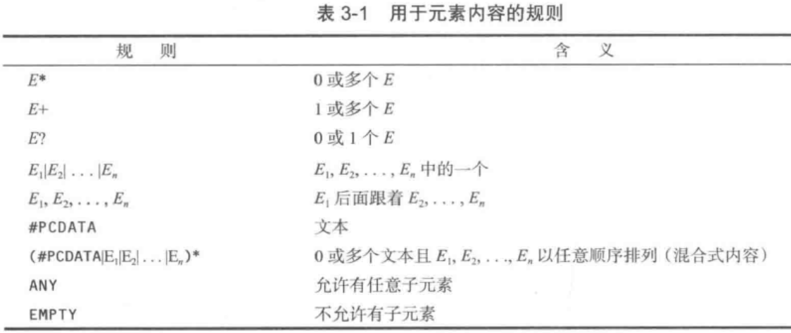
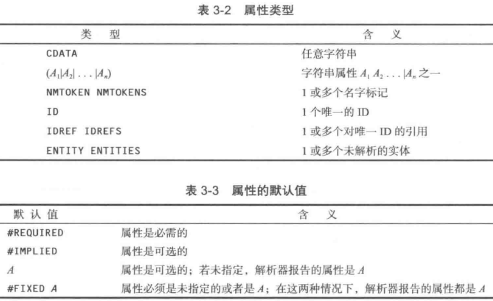

# XML

eXtendsible markup languge, 可扩展的标记语言。

用来描述结构化信息的技术，能够表示层次结构。没有固定的标记，只提供一个标准，允许用户创建自己的标记。

作用

1. 保存数据
2. 做配置文件
3. 数据传输载体

xml文档是树状结构的。

## 基础语法

XML 大小写敏感，属性值必须用引号扩起来，所有属性都必须有属性值，必须有结尾标签。

入门案例

```xml
<?xml version="1.0" encoding="UTF-8" standalone="no"?><!-- 文档头 -->
<!DOCTYPE web-app PUBLIC
    "-//Sun Microsystems, Inc.//DTD Web Application 2.2//EN"
    "http://java.sun.com/j2ee/dtds/web-app_2_2.dtd"> <!-- 文档类型定义(DTD)，非必需 -->
<stu> <!-- 根元素 -->
	<name>zhangsan</name>
	<age>19</age>
    <size unit="pt">36</size> <!-- 元素可以包含属性 -->
</stu>
```

必写属性：

- version：xml版本

可选属性：

- encoding=[utf-8, utf-16, gb2312]。编码方式，默认是unicode编码
- standalone=[yes, no]。说明文档是否独立。no表示可能依赖某个DTD文件等。默认为yes。位于encoding之后。

### 元素

被<>括起来的，成对出现。元素可以嵌套。

根元素：文档声明下来的第一个元素叫根元素。xml必须有且仅有一个根元素。

简单元素：元素里面包含了普通的文本

复杂元素：元素里包含了元素

空元素：没有嵌套子元素和数据的元素。如， ``

元素名称命名规范

- 区分大小写
- 不能以数字或"_"开头
- 不能以xml开头
- 不能包含空格
- 不能包含":"

元素文本里的空格和换行都作为原始内容被处理。

### 属性

属性是自定义的，一定要用单引号或双引号引起来。命名规范与元素相同。

### 字符引用

形式是 `&#十进制值` `&#x十六进制值`。

### 特殊符号

想要输入><&等特殊符号时，需要用它们的替代符号。

|特殊字符|替代符号|
|------|-------|
|&|\&amp;|
|<|\&lt;|
|>|\&gt;|
|"|\&quot;|
|'|\&apos;|

### CDATA区

CDATA是 character data 的缩写，即字符数据。指不想被解析程序解析的一片原始数据区。通常将JS之类的程序代码嵌入到CDATA区

```xml
<!-- 文档声明 -->
<?xml version="1.0" ?>
<!-- 元素定义 -->
<书名>我是MT</书名>
<!-- 与上个元素不同，这个元素里的内容有换行符 -->
<书名>
  我是MT
</书名>
<!-- CDATA区 -->
<![CDATA[这里的数据不解析，原封不动的传递。比如<stu>不会被解析成元素]]>
```

### 处理指令

Processing Instruction的中文翻译，简称PI。为处理xml文档的应用程序提供指示信息。
以 `<?` 开头，以 `?>` 结尾

```xml
<!-- 告诉浏览器使用book.css控制显示效果 -->
<?xml-stylesheet type="text/css" href="book.css"?>
```

## 解析 XML 文档

解析器的作用：读入文件，确认文件有正确的格式，将文件分解成各种元素，使程序员能够访问这些元素。

Java库提供的XML解析器

- 类似 DOM(Document Object Model, 文档对象模型)解析器的树形解析器，将文档转换为树结构
- 类似 SAX(Simple API for XML, XML 简单API)解析器的流机制解析器，读入文档生成相应的事件。基于事件驱动。读一行，解析一行。只能查找，不能增删。

针对这两种解析方式，给出的解决方案（API）有

- jaxp：sum公司出品，比较繁琐。
- jdom
- dom4j：使用比较广泛

### 树型解析器

DOM 解析器会完整地读入 XML 文档，然后将其转换成一个树形的数据结构。

Document 对象是 XML 文档的树型结构在内存中的表示方式。

```java
DocumentBuilderFactory factory = DocumentBuilderFactory.newInstance();
DocumentBuilder builder = factory.newDocumentBuilder();
// 读入文档
File f = ...;
Document doc = builder.parse(f);
URL u = ...;
Document doc = builder.parse(u);
InputStream in = ...;
Document doc = builder.parse(in);
// 读取元素
Element root = doc.getDocumentElement(); // 返回根元素
String name = root.getTagName(); // 返回根元素标签名
NodeList children = root.getChildNodes(); // 根元素的子元素
// 遍历元素
for(int i = 0; i < children.getLength(); i++){
    Node child = children.item(i); // 包含空白字符
    if (child instanceof Element){ // 忽略空白字符
        Element e = (Element) child;
        Text textNode = (Text) e.getFirstChild(); // 获取第一个子元素
        String text = textNode.getData().trim(); // 获取存储在Text节点中的字符串
        // ...
    }
}
// 其他方法
Node childNode = e.getLastChild(); // 获得最后一项子元素
Node childNode = e.getNextSibling(); // 得到下一个兄弟节点
// 枚举节点属性
NamedNodeMap attributes = e.getAttributes(); // 节点属性
for(int i = 0; i < attributes.getLength(); i++){
    Node attribute = attributes.item(i);
    String name = attribute.getNodeName();
    String value = attribute.getNodeValue();
    // ...
}
String name = e.getAttribute("name"); // 获取name属性的值
```

### 流机制解析器

SAX 解析器

在解析 XML 时会报告事件，由事件处理器建立相应的数据结构。

```java
// 得到SAX解析器
SAXParserFactory factory = SAXParserFactory.newInstance();
factory.setNamespaceAware(true); // 感知命名空间
SAXParser parser = factory.newSAXParser();
factory.setFeature("http://xxx/xxx.dtd", false) // 如果不需要验证文件，设置为false
// 处理文档
parser.parse(source, handler); // source是文件|URL|InputStream，handler是DefaultHandler的子类。

DefaultHandler handler = new DefaultHandler() {
    public void startElement(String namespaceURI, String lname, String qname, Attributes attrs) throws SAXException {
        // 自定义的处理代码
    }
}
```

StAX 解析器

StAX 解析器是一种“拉解析器(pull parser)”

```java
InputStream in = url.openStream();
XMLInputFactory factory = XMLInputFactory.newInstance(); // 命名空间默认启用
factory.setProperty(XMLInputFactory.IS_NAMESPACE_AWARE, false) // 取消感知命名空间
XMLStreamReader parser = factory.createXMLStreamReader(in);
while(parser.hasNext()){
    int event = parser.next();
    // 处理事件
    String units = parser.getAttributeValue(null, "units"); // 获取当前元素的units属性
}
```

### 使用 XPath 定位信息

[详细规范](http://www.zvon.org/xxl/XPathTutorial/General/examples.html)

```
获得某个节点(username)的值
/root/sompath/username
获得某个节点集
/root/sompath/node
获得节点集中的某个元素
/root/sompath/node[1]
获得某个节点或节点集(username)的属性(name)
/root/sompath/username/@name
返回某元素子元素的数量
count(/root/node)
```

java 处理 XPath

```java
XPathFactory xpfactory = XPathFactory.newInstance();
XPath path = xpfactory.newXPath();
String username = path.evaluate("/root/database/username", doc);
NodeList nodes = (NodeList) path.evaluate("/root/row", doc, XPathConstans.NODESET);
Node node = (Node) path.evaluate("/root/row[1]", doc, XPathConstans.NODE);
int count = ((Number) path.evaluate("count(/root/row)", doc, XPathConstans.NUMBER)).intValue();
// 可以从任意一个节点开始检索
result = path.evaluate(expression, node);
```

### dom4j

```java
import org.dom4j.io.SAXReader;
//创建sax对象
SAXReader reader = new SAXReader();
//指定xml文件
Document doc = reader.read(new File("src/xml/stus.xml"));
//得到根元素
Element rootElement = doc.getRootElement();//根元素
rootElement.element("stu").getName();//子元素
List<Element> list = rootElement.elements();//所有子元素
for(Element e : list){
  String id = e.attributeValue("id");
}
//常用方法
getName()
getValue()
getText()
size()
```

Dom4j的Xpath使用

作用：解析xml时，快速定位到元素，类似选择器。（需要添加jar）

```java
//创建sax对象
SAXReader reader = new SAXReader();
//指定xml文件
Document doc = reader.read(new File("src/xml/stus.xml"));
//得到根元素
Element rootElement = doc.getRootElement();//根元素
rootElement.selectSingleNode("//stu");//获取文档中的第一个stu元素
rootElement.selectNodes("//name");//获取文档中的所有stu元素
```

## 验证 XML 文档(约束)

定义一套规则对xml文档中的内容做出限制，即指定文档结构。这套规则就是xml文档的约束模式，指定了每个元素的合法子元素和属性、内容类型、元素之间的嵌套关系、出现顺序等。

常用约束模式语言

- XML DTD(Document Type Definition)
- XML Schema

XML文档只能有一个DTD约束，可以有多个schema约束

### DTD

入门案例

```xml
<!-- 规则写在DOCTYPE声明中，文档必须匹配根元素的名字 -->
<?xml version="1.0" encoding="UTF-8"?>
<!DOCTYPE configuration [
    <!ELEMENT configuraton ...>
    <!-- 更多规则 -->
]>
<configuration>
    ...
</configuration>

<!-- 引入规则 -->
<!DOCTYPE configuration SYSTEM "config.dtd">
<!DOCTYPE configuration SYSTEM "http://myserver.com/config.dtd">
```

在 java 中使用 DTD

```java
// 使用验证
factory.setValidating(true);
// 安装错误处理器
ErrorHandler handler = ...;
builder.setErrorHandler(handler);
```

#### 定义元素

格式： `<!ELEMENT 元素名称 (使用规则)>`

使用规则：定义了元素的组成成分、成分出现的次数(用正则表达式)、次序。



```DTD
<!ELEMENT bookshelf (book+)>
<!ELEMENT book (bookname, author, price)>
<!ELEMENT bookname (#PCDATA)>
<!ELEMENT author (#PCDATA)>
<!ELEMENT price (#PCDATA)>
```

解释说明

- `#PCDATA`：表示元素中嵌套的内容是普通文本字符串
- `bookname, author, price`：表示要嵌套3个元素且依次出现
- `bookname author price`：表示要嵌套3个元素，次序随意
- `book+`：表示book元素出现一次或多次。+是正则表达式符号。

#### 属性

```DTD
<!ATTLIST stu id CDATA #IMPLIED>
<!ATTLIST font style (plain|bold|italic) "plain">
<!ATTLIST size unit CDATA #IMPLIED>
```

解释

- stu元素有id属性，是CDATA文本类型，该属性非必填。
- font元素有style属性，有3个合法值，默认是plain。



#### 引入DTD文档

```xml
<!DOCTYPE 文档类型名称 SYSTEM "DTD文件的URL">
<!DOCTYPE 文档类型名称 PUBLIC "DTD名称" "DTD文件的URL">

<!-- 引入网络的dtd -->
<!DOCTYPE stus PUBLIC "//UNKNOWN//" "unknown.dtd">
<!-- 引入本地的dtd -->
<!DOCTYPE stus SYSTEM "stus.dtd">
```

文档类型名称：通常使用XML文档的根元素名称。

SYSTEM：表明遵循本地或组织内部所编写和使用的DTD文件

PUBLIC：表明遵循某权威机构制定的、公开提供给公众使用的DTD文件

DTD名称：DTD文件的标识名称

DTD文件的URL：DTD文件所在位置

#### 直接嵌入DTD语句

```xml
<!DOCTYPE 根元素名 [
	DTD定义语句
]>

<!-- 例子 -->
<?xml version="1.0" ?>
<!DOCTYPE 书架 [
    <!ELEMENT 书架 (书+)>
    <!ELEMENT 书 (书名, 作者)>
    <!ELEMENT 书名 (#PCDATA)>
    <!ELEMENT 作者 (#PCDATA)>
]>

<书架>
    <书>
        <书名>我是MT</书名>
        <作者>牛xx</作者>
    </书>
</书架>
```

约束规则的细节，可通过查阅文档获知。

### Schema

[详细指南](http://www.w3.org/TR/xmlschema-0)

入门案例

```xml
<!-- 引入验证文档。说明config.xsd会被用来验证该文档 -->
<?xml version="1.0" encoding="UTF-8"?>
<configuration xmlns:xsi="http://www.w3.org/2001/XMLSchema-instance"
    xsi:noNamespaceSchemaLocation="config.xsd">
    ...
</configuration>
```

config.xsd

```xml
<xsd:schema xmlns:xsd="http://www.w3.org/2001/XMLSchema">
    <xsd:element name="name" type="xsd:string" />
</xsd:schema>
```

`<schema>` 元素是所有XML Schema模式文档的根元素。声明该文档是一个XML Schema模式文档

XML Schema 模式文档本身也是一种XML文档，后缀为.xsd。里面的词汇来自一个统一的模式文档，名称空间将以前缀方式，加在元素前面。

`<element>` 元素用于定义实例文档中的元素

#### 元素类型

Schema 为每个元素都定义了类型，定义元素时，要指定它的类型。类型约束了元素的内容。

定义元素

```xml
<xsd:element name="name" type="xsd:string" />
<xsd:element name="stype" type="StyleType" />
```

简单类型已被内建到 XML Schema 中。如 `xsd:string xsd:int xsd:boolean`

自定义简单类型

```xml
<!-- 自定义的枚举类型 -->
<xsd:simpleType name="StyleType">
    <xsd:restriction base="xsd:string">
        <xsd:enumeration value="PLAIN" />
        <xsd:enumeration value="BOLD" />
        <xsd:enumeration value="ITALIC" />
    </xsd:restriction>
</xsd:simpleType>
```

可以把类型组成复杂类型

```xml
<xsd:complexType name="FontType">
    <xsd:sequence>
        <xsd:element ref="name" />
        <xsd:element ref="size" />
        <xsd:element ref="style" />
    </xsd:sequence>
</xsd:complexType>

<xsd:complexType name="contactinfo">
    <xsd:choice> <!-- 二选一，相当于DTD的| -->
        <xsd:element ref="email" />
        <xsd:element ref="phone" />
    </xsd:sequence>
</xsd:complexType>
```

具有子元素或属性的元素，类型符复杂类型，必须用 `<complexType>` 元素来定义。子元素必须嵌套在 `<sequence>`（定义顺序）、`<choice>`（只出现其中一个）等标签内。 

```xml
<!-- 允许重复 -->
<xsd:element name="item" type="..." minoccurs="0" maxoccurs="unbounded" />
<!-- 指定属性 -->
<xsd:element name="size">
    <xsd:complexType>
        <xsd:attribute name="unit" type="xsd:string" use="optional" default="cm"/>
    </xsd:complexType>
</xsd:element>
```

#### 引入 XML Schema

```xml
<?xml version="1.0" encoding="UTF-8"?>
<书架 xmlns="命名空间" xmlns:xsi="命名空间" xsi:schemaLocation="命名空间 文档URI">
    <书>
        <书名>我是MT</书名>
        <作者>牛xx</作者>
    </书>
</书架>
```

#### java处理

```java
// 必须打开对命名空间的支持
factory.setNamespaceAware(true);
// 配置处理Schema的工厂
final String JAXP_SCHEMA_LANGUAGE = "http://java.sun.com/xml/jaxp/properties/schemaLanguage";
final String W3C_XML_SCHEMA = "http://www.w3.org/2001/XMLSchema";
factory.setAttribute(JAXP_SCHEMA_LANGUAGE, W3C_XML_SCHEMA);
```

### 命名空间

为了避免名字冲突。

命名空间由统一资源标识符(URI)来标识。如 HTTP 的 URL 格式。URL 只用做标识符字符串，而不是文件的定位符。

```xml
<element xmlns="namespaceURI1">
    <child xmlns="namespaceURI2">
        <!-- 这里的元素属于 namespaceURI2。子元素继承了父元素的命名空间 -->
    </child>
    <!-- 这里的元素属于 namespaceURI1 -->
</element>

<!-- 使用前缀指定命名空间 -->
<xsd:schema xmlns:xsd="http://www.w3.org/2001/XMLSchema">
    <xsd:element name="name" type="xsd:string" /> <!-- 此元素属于命名空间http://www.w3.org/2001/XMLSchema -->
</xsd:schema>
```

默认情况下，Java XML 库的 DOM 解析器不能感知到命名空间，需要进行如下设置

```java
factory.setNamespaceAware(true);
```

名称空间声明

作用：为某个模式文档的名称空间指定一个临时的简写名称

格式：`xmlns:前缀名称="URI"`

作用范围：只对声明名称空间的元素及其子元素有效。

默认名称空间

格式：`xmlns="URI"`

作用范围：作用域中没有指定前缀的元素，都属于这个名称空间。

```xml
<!-- 根元素schema -->
<xs:schema xmlns:xs="http://www.w3.org/2001/XMLSchema">
	<!-- schema、element前增加xs:前缀，表示来自xs所代表的名称空间"http://www.w3.org/2001/XMLSchema"中的词汇 -->
	<xs:element name="书架">
		 <!-- 更多约束 -->
```
#### 属性

前缀名xml被隐式绑定到了一个名称空间。内容属性名称以xml:作为前缀

xml:space 属性

设置如何处理空格，可选值[preserve, default]。preserve表示当成普通字符处理；default表示自行处理。

xml:lang 属性

设置本地化语言信息，可选值[en, la, zh, zh-CN, zh-TW]

## 生成 XML 文档

不使用命名空间的文档

```java
// 创建DOM文档
DocumentBuilderFactory factory = DocumentBuilderFactory.newInstance();
DocumentBuilder builder = factory.newDocumentBuilder();
Document doc = builder.newDocument();
// 构建元素
Element root = doc.createElement(rootName);
Element child = doc.createElement(childName);
Text textNode = doc.createTextNode(textContents); // 文本节点
doc.appendChild(root); // 给文档添加根元素
root.appendChild(child); // 根元素添加子元素
child.appendChild(textNode); // 子元素添加文本
// 设置元素属性
root.setAttribute(name, value);
```

使用命名空间的文档

```java
factory.setNamespaceAware(true);
builder = factory.newDocumentBuilder();
Element root = doc.createElementNS(namespaceURI, "svg");
Element svg = doc.createElement(namespaceURI, "svg:svg"); // <svg:svg xmlns:svg=namespaceURI>
root.setAttributeNS(namespaceURI, qualifiedName, value);
```

写出文档


## xstream

使用xstream工具

```java
//使用XStream转换bean对象成xml
XStream xstream = new XStream();
//将CityBean中的id字段，从标签转成属性
xstream.useAttributeFor(CityBean.class, "id");
//为CityBean的全路径，设置别名city
xstream.alias("city", CityBean.class);
// 将CityBean的list对象，转换成xml
String xml = XStream.toXML(list);
//xml转成对象
xstream.fromxml(file);

//设置回复数据类型
response.setContentType("text/xml; charset=utf-8");
response.getWriter().write(xml);
```

js代码

```js
$(function(){
	$("#province").change(function(){
		var pid = $(this).val();
		$.post("CityServlet", {pid:pid}, function(data, status){
			alert(data);
			//找到city元素，再对每个city做处理
			$(data).find("city").each(function(){
				var id = $(this).children("id").text();
				var cname = $(this).children("cname").text();
				// 将代码加入到页面
				$("#city").append("<option value='" + id +"' />" + cname);
			});
		});
	});
});
```