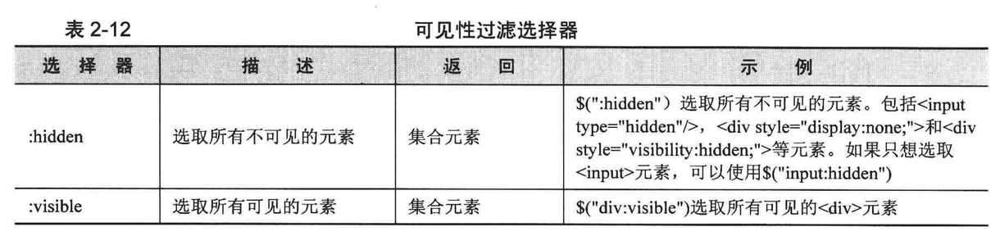

# jQuery

## 概述

jQuery是一个JavaScript程序库，里面有很多函数工具，能够简化操作。同样的功能，用jQuery实现比用DOM实现成本低。

jQuery类库定义了一个全局函数： `jQuery()`。快捷名： `$`。是jQuery的核心查询方法。调用方式如下：

1. 传递：CSS选择器，返回：文档中匹配该选择器的元素集。
2. 传递：一个Element、Document、window对象，返回：该对象封装成的jQuery对象。
3. 传递：HTML文本字符串，返回：根据传入文本创建好的HTML元素并封装成为jQuery对象。传入纯文本（没有html标签）将会当成css选择器.`$("<p>this is a p.</p>").appendTo("#div1");`
4. 传递：函数。文档加载完毕时，将调用该函数。

this 代表调用当前函数的对象

### jQuery 对象转换成 DOM 对象

1. jQuery对象是一个数组，可以通过[index]得到DOM对象

```js
var $cr = $("#cr"); // jQuery对象，通常在变量前加 $ 表示是一个jQuery对象
var cr = $cr[0]; // DOM对象
```

2. 通过get(index)方法得到DOM对象

```js
var $cr = $("#cr");//jQuery对象
var cr = $cr.get(0);//DOM对象
```

### DOM对象转换成jQuery对象

使用 `$()` 把DOM对象包装起来，即可

```js
var cr = document.getElementById("cr");//DOM对象
var $cr = $(cr);//jQuery对象
```

## 选择器（查找元素）

和css选择器相同，用来查找元素节点

### 基本选择器


### 层次选择器


可以使用next()方法来代替\$("prev+next")选择器

```js
$(".one+div");
$(".one").next("div");//两者相等
```

可以使用 nextAll() 方法来代替 `$("prev~siblings")` 选择器

```js
$("#prev~div");//选取#prev之后的所有同辈div元素
$("#prev").nextAll("div");//同上
$("#prev").siblings("div");//选取#prev所有的同辈div元素，无论前后位置
```

### 属性选择器


### 基本过滤器


### 表单对象属性过滤器


### 子元素过滤器


### 可见性过滤器



### 内容过滤器


### 注意事项

1. 选择器中含有".", "#", "(", "]"等特殊字符时，需要转义

```js
//<div id="id#b">bb</div>
$("#id\\#b");//正确写法，转义特殊字符#
```

2. 注意选择器中的空格，空格是后代选择器的分隔符

### 常用方法

```js
$("#test1").parent(); // 最近的父节点
$("#test1").parents(); // 全部父节点
$("#test1").parents(".mui-content"); // 父节点中class=mui-content的元素
$("#test").children(); // 全部子节点
$("#test").children("#test1");
$("#test").contents(); // 返回#test里面的所有内容，包括节点和文本
$("#test").contents("#test1");
$("#test1").prev();  // 上一个兄弟节点
$("#test1").prevAll(); // 之前所有兄弟节点
$("#test1").next(); // 下一个兄弟节点
$("#test1").nextAll(); // 之后所有兄弟节点
$("#test1").siblings(); // 所有兄弟节点
$("#test1").siblings("#test2");
$("#test").find("#test1"); // 查找 test 子元素中id=test1的元素

$("ul li").eq(1); // 选取ul li中匹配的索引顺序为1的元素(也就是第2个li元素)
$("ul li").first(); // 选取ul li中匹配的第一个元素
$("ul li").last(); // 选取ul li中匹配的最后一个元素
$("ul li").slice(1, 4); // 选取第2 ~ 4个元素
$("ul li").filter(":even"); // 选取ul li中所有奇数顺序的元素
```

查找节点的思路，为某个代码块设置一个id，再这个代码块内再找其他元素

```js
$("#myId .subTotal"); // 定位myId模块的class=subTotal的元素
```

## 操作元素

### 创建节点

`$(html)` 方法会根据传入的HTML标记字符串，创建一个DOM对象，并将这个DOM对象包装成一个jQuery对象后返回。

```js
var $li = $("<li title="banana">banana</li>"); //无论HTML字符串多么复杂，都可以创建
```

### 插入节点

| 方法 | 作用 |
| ---- | ---- |
|append()|向每个匹配的元素内部追加内容|
|appendTo()|将匹配的元素追加到指定元素|
|prepend()|向每个匹配的元素内部前置内容|
|prependTo()|将匹配的元素前置到指定元素|
|after()|在每个匹配的元素后插入内容|
|insertAfter()|将所有匹配的元素插入到指定元素的后面|
|before()|在每个匹配的元素前插入内容|
|insertBefore()|将所有匹配的元素插入到指定元素的前面|

使用示例：

```js
$("ul").append($li);//将$li插入到节点ul内部
```

### 删除节点

1. remove()

删除所有匹配的元素，该节点包含的所有后代节点将同时被删除。返回被删除节点的引用。

```js
$("ul li:eq(1)").remove(); //获取第二个li元素，将它从网页中删除
$("ul li").remove("li[title!=banana]"); //还可传入选择器，删除选中的元素
```

2. detach()
  

同remove()一样，但与remove不同的是，删除元素的所有绑定事件，附加数据等，都会保留下来。

3. empty()

清空元素中的所有后代节点

### 复制节点

clone(): 被复制的新元素并不具有任何行为。

clone(true): 复制元素的同时复制元素中所绑定的事件

### 替换节点

| 方法 | 作用 |
| ---- | ---- |
|replaceWith()|将所有匹配的元素都替换成指定的HTML或者DOM元素，替换后原先绑定事件会消失。|
|replaceAll()|颠倒了replaceWith()的操作|

使用示例：

```js
//将p元素替换成字符串里的内容
$("p").replaceWith("<strong>your favorate food?</strong>");
$("<strong>your favorate food?</strong>").replaceAll("p");
```

### 包裹节点

|方法|作用|
|-|-|
|wrap()|将所有元素进行单独的包裹。|
|wrapAll()|将所有匹配的元素用一个元素来包裹，如果被包裹元素中间有其他元素，其他元素会被放到包裹元素之后。|
|wrapInner()|将每一个匹配元素的子内容（包括文本节点）用其他标记包裹起来|

使用示例：

```js
//包裹前：<strong>your favorate food?</strong>
$("strong").wrap("<b></b>");//用<b>标签把<strong>元素包裹起来
//包裹后：<b><strong>your favorate food?</strong></b>

$("strong").wrapInner("<b></b>");
//包裹后：<strong><b>your favorate food?</b></strong>
```

### 属性操作

- attr()：获取和设置属性
- removeAttr()：删除属性

```js
$("p").attr("title");//获取
$("p").attr("title", "your title");//设置
$("p").attr("title":"your title", "name":"test");//设置多个属性
$("p").removeAttr("title");
```

以上两个方法可以处理自定义的属性。下面两个方法只能处理已定义的属性。

- prop()
- removeProp()

### 样式操作

#### addClass()：追加样式

1. 如果给一个元素添加了多个class值，那么就相当于合并了它们的样式
2. 如果有不同的class设定了同一样式属性，则后者覆盖前者。

#### removeClass()：移除样式

```js
$("p").removeClass("high");//删除class="high"
$("p").removeClass("high another");//删除class="high", class="another"
$("p").removeClass();//删除所有class
```

#### toggle()：切换样式

toggle(function, function)

toggleClass()：如果类名存在则删除它，不存在则添加它

```js
//<p class="myClass">your favorate food?</p>
$("p").toggleClass("another");//p元素的类会在class="myClass"和class="myClass another"之间反复切换
```

#### hasClass()：判断样式

判断是否有某个class，有返回true，没有返回false

### 内容操作

- html()：类似JS中的innerHTML，用来读取或者设置某个元素中的HTML内容
- text()：类似JS中的innerText，用来读取或者设置某个元素中的文本内容
- val()：类似JS中的value，设置或获取元素的值

### 遍历节点

| 方法 | 作用 |
| ---- | ---- |
|children()|取得匹配元素的子元素（不是后代元素）集合|
|next()|匹配元素后面紧邻的同辈元素|
|prev()|匹配元素前面紧邻的同辈元素|
|siblings()|匹配元素前后所有的同辈元素|
|closest()|取得最近的匹配元素。从元素本身开始，逐级向上级元素匹配，返回最先匹配的祖先元素。|
|each(data, function(index, obj){...})|data表示要遍历的元素，function对遍历的元素进行处理，index是下标，obj是处理的元素|

使用示例：

```js
$(document).bind("click", function(e){
	$(e.target).closest("li").css("color", "red");//给点击的目标元素最近的li元素添加颜色
});

// data是json数组格式的字符串，index表示下标，obj表示index对应的对象
$.each(data, function(index, obj){
	var li = "<li><a href='#'>" + obj.name + "</a></li>";
	$("#category").append(li);
});

// 遍历jQuery元素集合
var objs = $('.img');
for(var i = 0; i < objs.length; i++){
	objs.eq(i).attr('id', i);
}
// 或者
objs.each(function(index, item){
  alert($(this).attr("id"));
  alert($(item).attr("id")); // 作用同上
});
```

### 其他方法

| 方法 | 作用 |
| ---- | ---- |
|filter(expr)|筛选出与指定表达式匹配的元素集合，其中expr可以是多个选择器的组合。|
|find()|在元素内寻找匹配元素|
|jQuery.noConflict()|函数将变量\$的控制权移交出去。|

```js
$(".tag").find("[name='school']");
$(".tag").filter('[name="school"]');
```

`var $j = jQuery.noConflict();//自定义一个快捷方式，$j取代了$`

## 事件处理

jQuery中的事件和DOM中类似，只是少了前缀on

格式：

```js
$("#元素id").某事件(function(){
	// 当发生该事件时，如何处理
});
```

常用事件

- focus()：类似JS中的onfocus
- blur()：类似JS中的onblur
- click()：单击
- dbclick()：双击
- change()：当元素的值发生改变时。仅适用于文本域（text field）、textarea、select元素。

### 文档加载完毕的事件

等待DOM元素加载完毕，执行function

```js
$(document).ready(function(){
	//code
});
//简写形式
$(function(){
	//code
});
```

### 事件绑定bind

作用：为元素绑定事件

bind(type [, data], fn);

- type：事件类型，如blur、focus、load、click。绑定多个事件则使用"blur click"这种字符串。
- data：传递给事件对象的数据对象
- fn：用来绑定的处理函数

简写方式

`$("#panel").mouseover(function(){});`

### 合成事件hover，toggle

jQuery提供一些方法将两种或多种效果合并到一起，就叫合成事件。

`hover(enter, leave);`

用于模拟光标悬停事件。当光标移动到元素上，触发enter函数，移出时，触发leave函数

`toggle(fn1, fn2, ...fnN);`

用于模拟鼠标连续单击事件。第一次单击，触发第一个函数，第二次单击，触发第二个函数……之后从第一个函数开始重复。

### 事件对象

#### 事件冒泡

内层元素的点击事件被触发时，有同样点击事件的父元素的事件也会被触发
阻止事件冒泡，需要事件对象。

```js
//当点击"element"元素时，事件对象event就被创建了。
$("element").bind("click",function(event){
	//code
});

event.stopPropagation();//停止事件冒泡
event.preventDefault();//阻止默认行为
return flase;//以上2个事件的简写形式
```

#### 事件捕获

是事件冒泡的反过程，由父元素向子元素传递。

#### 事件对象的属性

| 属性 | 作用 |
| ---- | ---- |
|event.type|事件对象的类型，如"click"|
|event.target|捕获到触发事件的元素，如a元素|
|event.relatedTarget|发生元素的父元素|
|event.pageX|光标相对于页面的x坐标|
|event.pageY|光标相对于页面的y坐标|
|event.which|在鼠标点击事件中，获取到鼠标的左中右键。1=左；2=中；3=右|

### 移除事件unbind，one

`unbind([type], [data]);`

作用：移除绑定的事件

- type：事件类型，删除对应的绑定事件。如果没有参数，则删除所有绑定事件。
- data：可以是绑定函数名。如果click事件有多个绑定函数，则只删除参数里的绑定函数。

`one(type, [data], fn);`

作用：只触发一次，随后立即解除绑定。

### 模拟操作trigger

trigger()

作用：该方法触发事件后，会执行浏览器默认操作。如触发input元素的focus事件，input元素本身会得到焦点（默认操作）。

triggerHandler()

作用：不想执行默认操作，则使用该方法。

```js
//触发click事件（不需要用户点击即可触发）
$("#btn").trigger("click");
//简写形式
$("#btn").click();

//自定义事件
$("#btn").bind("myClick", function(){
	//code
});
//触发自定义事件
$("#btn").trigger("myClick");

//传递数据
$("#btn").bind("myClick", function(event, message1, message2){
	$("#test").append("<p>"+ message1 + message2 +"</p>");
});
$("#btn").trigger("myClick", ["我的自定义", "事件"]);//传递2个数据
```

## CSS-DOM

### 常用方法

无论color属性是外部css导入，还是拼接在HTML元素里的，css()方法都可以获取

```js
$("p").css("color");
$("p").css("color", "red");
$("p").css({"color":"red", "fontSize":"30px"});
```

height()：获取or设置元素在页面中的实际高度

width()：获取or设置元素在页面中的实际宽度

offset()：获取元素在当前视窗的相对偏移

```js
var offset = $("p").offset();
var left = offset.left;//左偏移
var right = offset.right;//右偏移
```

position()：相对于最近一个position样式属性设置为relative或者absolute的祖父节点的相对偏移。也包含left和right两个属性。

scrollTop()，scrollLeft()：元素的滚动条距顶端的距离和左侧的距离

### 动画

#### 展示&隐藏

show()

调用该方法，会将元素的display样式改为显示状态。

可以指定速度参数，如"slow", "normal", "fast"；或者是数字（单位毫秒）

```js
$("element").show("slow");
$("element").show(1000);
```

hide()

调用该方法，会将元素的display样式改为none

```js
$("element").hide();
$("element").css("display", "none");//以上两段效果相同
```

改变透明度

- fadeIn()
- fadeOut()

改变高度

- slideUp()
- slideDown()

#### 自定义动画

animate(params, [speed], [callback]);

- params：样式{属性1:值1, 属性2:值2}的映射
- speed：速度参数
- callback：动画完成时执行的函数

#### 停止动画

stop([clearQueue], [gotoEnd]);

- clearQueue：Boolean值，是否要清空未执行完的动画队列。
- gotoEnd：Boolean值，是否将正在执行的动画跳转到末状态。

## jQuery中的Ajax

jQuery对Ajax进行了封装。

- 第一层：`$.ajax()`
- 第二层：`load(), $.get(), $.post()`
- 第三层：`$.getScript(), $.getJSON()`

### load()方法

能载入远程 HTML 并插入 DOM 中。从web服务器上获取静态的数据文件。

结构：`load(url [.data] [.callback])`

参数解释

|参数名称|类型|说明|语法|
|---|---|---|---|
|url|String|请求HTML页面的url地址|语法结构为"url selector"，如"test.htm .para"表示test.html里的para元素。|
|data（可选）|Object类型|发送至服务器的key/value数据|决定load方法等传递方式。有data采用POST方式，无data采用GET方式。|
|callback（可选）|Function类型|请求完成时的回调函数，无论请求成功或失败|有3个参数：responseText（请求返回的内容）、textStatus（请求状态）、XMLHttpRequest（对象）|

网页

```html
<input type="button" id="send" value="Ajax获取" />
<div id="resText"></div>
```

jQuery代码

```js
$(function(){
  $("#send").click(function(){
    $("#resText").load("test.html");
  });
});

$("#div1").load("project/DemoServlet02", function(responseText, statusTXT, xhr){
	$("#dvi1").val(responseText);
});
```

### get()方法

`$.get()` 使用GET方式进行异步请求

结构：`$.get(url [.data] [.callback] [.type])`

参数解释

|参数名称|类型|说明|补充|
|---|---|---|---|
|url|String|请求HTML页面的url地址||
|data（可选）|Object类型|发送至服务器的key/value数据，会作为QueryString附加到url中||
|callback（可选）|Function|载入成功时的回调函数|有2个参数：data（服务器返回的内容）、textStauts（请求状态）|
|type|String|服务器返回内容的格式，如xml、html、script、json、text、_default等||

网页

```html
<form id="form1" action="#">
  <p>
    姓名：<input type="text" name="username" id="username" />
  </p>
  <p>
    内容：<textarea name="content" id="content" rows="2" cols="20"></textarea>
  </p>
  <p>
    <input type="button" id="send" value="submit" />
  </p>
</form>
<div id="resText">
  
</div>
```

jQuery代码

```js
$("#send").click(function(){
  $.get("get1", {
    username: $("#username").val(),
    content: $("#content").val()
  }, function(data, textStatus){
    $("resText").html(data); // 返回类型是html，将返回的数据添加到页面上
  });
});
```

`$.post()` 使用方法与get相同，只是发送方式不同。

### ajax()方法

结构：`$.ajax(options)`

参数解释

|参数名称|类型|说明|
|---|---|---|
|url|String|（默认为当前页地址）发送请求的地址|
|type|String|请求方式，默认为GET|
|timeout|Number|请求超时时间（毫秒）|
|data|Object或String|发送到服务器的数据，会自动转换为字符串格式|
|dataType|String|预期服务器返回的数据类型。可用类型：xml、html、script、json、jsonp、text|
|beforeSend|Function|发送请求前，可以修改 XMLHttpRequest 对象的函数|
|complete|Function|请求完成后的回调函数|
|success|Function|请求成功后的回调函数|
|error|Function|请求失败时被调用的函数，有三个参数：XMLHttpRequest、textStatus、errorThrown|
|global|Boolean|默认为true。表示是否触发全局Ajax时间。|

```js
$(function(){
  $.ajax({
    type: "GET",
    url: "xxxx",
    dataType: "json",
    success: function(){},
    error: function(XMLHttpResponse, textStatus, errorThrown){
      console.log("1 异步调用返回失败,XMLHttpResponse.readyState:"+XMLHttpResponse.readyState);
      console.log("2 异步调用返回失败,XMLHttpResponse.status:"+XMLHttpResponse.status);
      console.log("3 异步调用返回失败,textStatus:"+textStatus);
      console.log("4 异步调用返回失败,errorThrown:"+errorThrown);
    }
  });
});
````

### 序列化方法

serialize()

```js
// 提交表单loginForm
$.post("/user/login", $("#loginForm").serialize(), function(data){
  alert(data.msg);
});
```

serializeArray()

将 DOM 元素序列化后，返回 JSON 格式的数据。

param()

用来对一个数组或对象按照 key/value 进行序列化。

## 参考资料

《锋利的jQuery》

[jQuery API 中文版](https://www.jquery123.com)

[jQuery官网](https://jquery.com)

[jQuery API](https://api.jquery.com)

