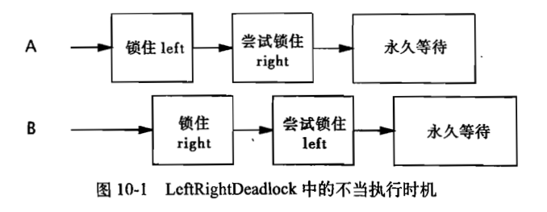

# 并发编程

分析某操作在多线程情况下，是否会出问题的方法

1. 将操作拆分成多个原子操作。如 value = value++; 拆分成：1.获取value；2.value加1；3.将值赋给value
2. 在每一步，假设有2个进程同时停在了这一步，分析下一步的结果，是否符合预期。

## 线程安全性

无状态对象一定是线程安全的。因为线程间没有共享的变量。

```java
// 没有属性的类，是线程安全的
public class Exemple {
    public int exemple() {}
}

// 非线程安全
public class Exemple {
    private int count = 0;
    public int exemple() {
        return count++;
    }
}
```

原子性

竞态条件：程序的正确性，依赖于某种执行时序。

常见的竞态条件类型是：

- 先检查后执行（Check Then Act）
- 读取 - 修改 - 写入

为了保证线程安全，需要将以上复合操作，组成原子操作。要么都执行，要么都不执行。

例子：如 AtomicLong 类，将 incrementAndGet 组成了一个原子操作。

```java
final AtomicLong count = new AtomicLong(0);
count.get();
count.incrementAndGet();

final AtomicReference<BigInteger> aNumber = new AtomicReference<BigInteger>();
aNumber.get();
aNumber.set(100);
```

加锁机制

- 内置锁：同步代码块（Synchronized Block）

每个 Java 对象都可以用做一个实现同步的锁，被称为内置锁或监视器锁。线程在进入同步代码块之前会自动获得锁，在退出时自动释放锁。内置锁是一种互斥锁。释放锁之前会将对变量的修改刷新到主存中。

```java
// 同步代码块
Object lock = new Object();
synchronized (lock) {
    // 临界区
}
// 同步方法(性能较差)，以类的 Class 对象作为锁
public synchronized void service() {...}
```

- 重入

内置锁可以重入，即线程试图获得一个已由自己持有的锁，则可以成功获得。

```java
public class Test {
    public synchronized void doSomething() {
        System.out.println("Test: doSomething...");
    }
}
// 可以重入，所以不会死锁
class ChildTest extends Test {
    public synchronized void doSomething() {
        System.out.println("ChildTest: doSomething..");
        super.doSomething();
    }
}

// 子类调用超类同步方法时，用的谁的锁？答：用的子类的对象的锁
public class Test {
    public synchronized void doSomething() {
        try {
            Thread.sleep(10000);
            System.out.println("Test: doSomething...");
        } catch (InterruptedException e) {
            e.printStackTrace();
        }
    }

    public static void main(String[] args) throws InterruptedException {
        ChildTest childTest = new ChildTest();
        Thread childTestThread = new Thread(() -> {
            childTest.doSomething();
        });
        childTestThread.start();
        Thread.sleep(1000);
        childTest.lockChildTest();
    }
}
class ChildTest extends Test {
    public void doSomething() {
        System.out.println("ChildTest: doSomething..");
        super.doSomething();
    }
    public synchronized void lockChildTest() {
        System.out.println("ChildTest: lockChildTest..");
    }
}
// 输出内容：表示锁的是ChildTest。否则，假设锁的是Test，则输出应该是 ChildTest: doSomething.. ChildTest: lockChildTest... Test: doSomething...
ChildTest: doSomething..
Test: doSomething...
ChildTest: lockChildTest...

// synchronized 方法，用的是ChildTest.class的锁，还是对象的锁？答：对象的锁。
public class Test {
    public synchronized void doSomething() {
        try {
            System.out.println("Test: doSomething start");
            Thread.sleep(10000);
            System.out.println("Test: doSomething end");
        } catch (InterruptedException e) {
            e.printStackTrace();
        }
    }

    public static void main(String[] args) throws InterruptedException {
        Test test = new Test();
        Thread testThread = new Thread(() -> {
            test.doSomething();
        });
        testThread.start();

        Test another = new Test();
        Thread thread = new Thread(() -> {
            another.doSomething();
        });
        thread.start();
        thread.join();
    }
}
// 输出结果。说明是对象的锁。如果是class的锁，则应该是串行的，一个start-end结束后，再开始另一个start
Test: doSomething start
Test: doSomething start
Test: doSomething end
Test: doSomething end
```

重入的一种实现方式：为锁关联一个获取计数值和所有者线程。当计数值=0时，锁未被获取；当锁被获取时，计数值=1，记录所有者线程；当本线程重入时，计数值+1；当线程退出时，计数值-1。

用锁来保护状态

对于可能被多个线程同时访问的可变状态变量，在访问（不论是写入还是读取）它时都需要持有同一个锁。

活跃性与性能

在一个方法内的局部变量，是线程安全的。但是类的属性，在多线程下不是线程安全的。可以使用同步代码块来保护可变状态变量

```java
synchronized (this) {
    // code
}
```

当执行时间较长的计算或无法快速完成的操作时，请不要持有锁。

## 对象的共享

我们希望当一个线程修改了对象状态后，其他线程能够看到发生的状态变化。

### 可见性

重排序 Reordering

在没有同步的情况下，编译器、处理器以及运行时等都可能对操作的执行顺序进行一些意想不到的调整，对内存操作的执行顺序是无法判断的。重排序是为了使多核处理器充分发挥作用。

```java
public class NoVisibility {
    private static boolean ready;
    private static int number;

    public static void main(String[] args) {
        Thread readerThread = new Thread(() -> {
            while (!ready) {
                Thread.yield();
            }
            System.out.println(number);
        });
        readerThread.start();
        number = 42;
        ready = true;
    }
}
// 可能的结果
// 1. 线程永远不结束，因为它看不到ready已经变成true了
// 2. 线程打印出0，因为它看到ready=true，但是没看到number变成42
```

代码中的执行顺序，可能不是最终的执行顺序，中间可能有寄存器置位，导致后面的变量先被设置。

失效值

当线程在没有同步的情况下读取变量，可能会得到一个失效值。

非 volatile 类型的64位数值变量(double, long)，JVM 允许将64位的读操作或写操作分解为2个32位的操作，因此高32位和低32位的数值，可能来自2个不同的线程。long和double类型在多线程场景下，必须用 volatile 修饰。

加锁与可见性

被内置锁保护的同步代码块，可以保证在A线程操作完之后，B线程进入同一个锁的同步代码块时，能看到A线程做的全部操作的结果。即A写入的值，对B是可见的。

volatile

当把变量声明为volatile类型时，编译器和运行时都会注意到这个变量是共享的，因此不会把该变量上的操作与其他内存操作一起重新排序。从内存可见性的角度看，写入 volatile 变量相当于退出同步代码块（已更改的变量对其他线程可见），读取 volatile 变量相当于进入同步代码块。

正确使用方式

1. 确保变量状态的可见性
2. 确保引用对象的状态的可见性
3. 重要的程序生命周期事件

```java
volatile boolean asleep;
while(!asleep)
    countSomeSheep();
```

volatile 变量不足以确保递增操作(count++)的原子性。

满足以下所有条件时，才使用 volatile 变量

- 对变量的写入操作不依赖变量的当前值，或者确保只有单个线程更新变量的值。（即，volatile 变量不保证 读取-写入 操作的原子性）
- 该变量不会与其他状态变量一起纳入不变性条件中
- 访问变量时不需要加锁

### 发布与逸出

发布一个对象：指对象能够在当前作用域之外的代码中使用。

逸出：某个不应该发布的对象被发布了的情况。比如某共有方法返回了一个私有对象；在构造时将this逸出。

当把一个对象传递给某个外部方法(既不是private也不是final的方法)时，就相当于发布了这个对象。

使用工厂方法，防止this引用在构造过程中逸出

```java
public class SafeListener {
    private final EventListener listener;
    private SafeListener() {
        listener = new EventListener() {
            public void onEvent(Event e) {
                doSomething();
            }
        }
    }
    public static SafeListener newInstance(EventSource source) {
        SafeListener safe = new SafeListener();
        source.registerListener(safe.listener);
        return safe;
    }
}
```

### 线程封闭

只在单线程内访问数据，称为线程封闭。

线程封闭是程序设计需要考虑并实现的。Java语言无法强制将对象封闭在某个线程中。

ad-hoc 线程封闭

ad-hoc 线程封闭是指，维护线程封闭性的职责完全由程序实现承担。即，保证只有单个线程操作，防止发生竞态条件。比较脆弱。

栈封闭

在栈封闭中，只能通过局部变量才能访问对象。如，在某个方法内部的局部变量。

对于基本类型的局部变量，无论如何都不会破坏栈封闭性，因为任何方法都无法获得对基本类型的引用。前提是不要将局部变量逸出。

ThreadLocal 类

这个类能使线程中的某个值与保存值的对象关联起来。ThreadLocal 的 get 和 set 等访问接口或方法为每个使用该变量的线程都存有一份独立的副本，get 总是返回由当前执行线程在调用set时设置的最新值。

```java
private static ThreadLocal<Connection> connectionHolder = new ThreadLocal<Connection>() {
    public Connection initialValue() {
        return DriverManager.getConnection(DB_URL);
    }
};
public static Connection getConnection() {
    return connectionHolder.get();
}

// 示例，每个 Thread 一个变量，不共享
public class Test {
    private static ThreadLocal<String> threadLocal = new ThreadLocal<>();

    public static void main(String[] args) {
        Thread thread1 = new Thread(() -> {
            threadLocal.set("thread1");
            try {
                Thread.sleep(1000);
            } catch (InterruptedException e) {
                e.printStackTrace();
            }
            System.out.println(threadLocal.get());
        });
        thread1.start();
        Thread thread2 = new Thread(() -> {
            System.out.println(threadLocal.get());
            threadLocal.set("thread2");
            System.out.println(threadLocal.get());
        });
        thread2.start();
    }
}
// 结果：
null
thread2
thread1
```

当某个线程初次调用 ThreadLocal.get 方法时，就会调用 initialValue 来获取初始值。

ThreadLocal 变量类似于全局变量，它能降低代码的可重用性，并在类之间引入隐含的耦合性。

### 不变性

使用不可变对象来满足同步需求。不可变对象指，某个对象在被创建后其状态就不能被修改。

final 域

final 域能确保初始化过程的安全性。


即使某个对象的引用对其他线程是可见的，也并不意味着对象状态对于使用该对象的线程来说一定是可见的。

任何线程都可以在不需要额外同步的情况下，安全地访问不可变对象。

```java
// Thread Safe
public class VolatileCachedFactorizer implements Servlet {
    private volatile OneValueCache cache = new OneValueCache(null, null);
    public void service(ServletRequest req, ServletResponse resp) {
        BigInteger i = extractFromRequest(req);
        BigInteger[] factors = cache.getFactors(i);
        if (factors == null) {
            factors = factor(i);
            cache = new OneValueCache(i, factors);
        }
        encodeIntoResponse(resp, factors);
    }
}

class OneValueCache {
    private final BigInteger lastNumber;
    private final BigInteger[] lastFactors;

    private OneValueCache(BigInteger i, BigInteger[] factors) {
        lastNumber = i;
        lastFactors = Arrays.copyOf(factors, factors.length);
    }
    public BigInteger[] getFactors(BigInteger i) {
        if (lastNumber == null || !lastNumber.equals(i)) {
            return null;
        }
        return Arrays.copyOf(lastFactors, lastFactors.length); // 防止逸出
    }
}
```

### 安全发布

非线程安全的发布方式

```java
public Holder holder;
public void initialize() {
    holder = new Holder(42);
}
```

任何线程都可以在不需要额外同步的情况下安全地访问不可变对象。

对象安全发布的方式

- 在静态初始化函数中初始化一个对象引用
- 将对象的引用保存到 volatile 类型的域或者 AtomicReferance 对象中。
- 将对象的引用保存到某个正确构造对象的final类型域中。
- 将对象的引用保存到一个由锁保护的域中

安全发布一个静态构造的对象

```java
public static Holder holder = new Holder(42);
```

静态初始化器由JVM在类的初始化阶段执行，JVM内部存在同步机制，因此可以安全发布。

事实不可变对象


对象的发布需求取决于它的可变性

- 不可变对象可以通过任意机制来发布
- 事实不可变对象必须通过安全方式来发布
- 可变对象必须通过安全方式来发布，并且必须是线程安全的或由某个锁保护起来

共享对象的安全策略

- 线程封闭。对象只能被一个线程拥有，只能由这个线程修改。
- 只读共享。对象是不可变的或事实不可变的，线程不能修改它。
- 保护对象。对象只由持有特定锁的线程来访问。

## 对象的组合

### 设计线程安全的类

需要包含以下三个要素

- 找出构成对象状态的所有变量
- 找出约束状态变量的不变性条件
- 建立对象状态的并发访问管理策略

### 实例封闭

对象可以封装在

- 类的私有成员
- 某个作用域，如作为一个局部变量
- 在线程内部

只要包装器对象拥有对底层容器对象的唯一引用，那么它就是线程安全的。

Java监视器模式

如果一个状态变量是线程安全的，并且没有任何不变性条件来约束它的值，在变量的操作上也不存在任何不允许的状态转换，那么就可以安全地发布这个变量。

组合 Composition

为现有的类添加一个原子操作

```java
public class ImprovedList<T> implements List<T> {
    private final List<T> list;
    // list是线程安全的
    public ImprovedList(List<T> list) { this.list = list; }

    public synchronized boolean putIfAbsent(T x) {
        boolean contains = list.contains(x);
        if (contains)
            list.add(x);
        return !contains;
    }

    public synchronized boolean add(T e) {
        return list.add(e);
    }

    // 按照类似的方式委托 List 的其他方法
}
```

### 将同步策略文档化

## 基础构建模块

### 同步容器类

容器上常见的复合操作

1. 迭代
2. 跳转
3. 条件运算

迭代器，及时失败(fail-fast)，在迭代期间计数器被修改，那么hasNext或next将抛出 ConcurrentModificationException 。避免出现该异常的方法：

1. 加锁后访问对象
2. 克隆容器，并在副本上进行迭代。

某些操作可能会调用迭代器，进而导致 ConcurrentModificationException ，如 容器的toString、hashCode、equals(当集合作为某对象的元素时)

### 并发容器

同步容器将所有对容器状态的访问都串行化，以实现它们的线程安全性。

并发容器针对多线程设计

1. ConcurrentHashMap -- Map
2. ConcurrentLinkedQueue
3. ConcurrentSkipListMap -- SortedMap
4. ConcurrentSkipListSet -- SortedSet

ConcurrentHashMap

1. 使用分段锁(Lock Striping)机制。
2. 返回的迭代器具有弱一致性，可以容忍并发的修改，可以（但不保证）将修改操作反映给容器。
3. 允许size、isEmpty等方法返回一个近似值而不是精确值
4. 不能被加锁来执行独占访问

CopyOnWriteArrayList

1. 每次修改时，都会创建并重新发布一个新的容器副本，从而实现可变性。

### BlockingQueue

生产者-消费者模式

- LinkedBlockingQueue FIFO
- ArrayBlockingQueue FIFO
- PriorityBlockingQueue 优先级排序
- SynchronousQueue 不是真正的队列，直接将数据交给线程

串行线程封闭

类似于令牌？线程可以获得对象的访问权，其他没有访问权的线程不能访问该对象。

双端队列

- Deque
    - ArrayDeque
- BlockingDeque
    - LinkedBlockingDeque

工作密取

1. 每个消费者有一个双端队列，从各自的队列中消费。消费者可以从其他消费者的队列的尾端消费。
2. 适用于某线程既是生产者，又是消费者的时候。如，网页爬虫线程，从网页中抓取page，当发现新url(有新任务)时，将该url从尾部放入自己的双端队列中。


### 阻塞方法与中断方法

当某方法抛出 InterruptedException 时，表示该方法是一个阻塞方法，如果这个方法被中断，那么它将努力提前结束阻塞状态。

```java
// 中断某线程，设置中断标志位为true
thread1.interrupt();
// 查看某线程的中断标志位
thread1.isInterrupted();
// 返回某线程的中断标志位，并将它设置为false
Thread.interrupted();
```

### 同步工具类

同步工具类可以是任何一个对象，只要它根据其自身的状态来协调线程的控制流。如

- 阻塞队列 BlockingQueue
- 信号量 Semaphore
- 栅栏 Barrier
- 闭锁 Latch

闭锁

可以延迟线程的进度直到其达到终止状态。在闭锁达到结束状态之前，没有线程能通过闭锁运行；达到结束状态后，所有线程都可以通过。闭锁是一次性对象，一旦进入终止状态，就不能被重置。

CountDownLatch 是一种闭锁的实现，它可以使一个或多个线程等待一组事件发生。

闭锁状态包括一个计数器，该计数器初始化为一个正数，表示需要等待的事件数量。countDown 方法递减计数器，表示有一个事件发生了；await方法等待计数器达到零，表示所有等待的事件都已经发生了。

```java
// 测试并发的nThreads个线程从启动到结束的运行时间
public class TestHarness {
    public long timeTasks(int nThreads, final Runnable task)
            throws InterruptedException {
        final CountDownLatch startGate = new CountDownLatch(1);
        final CountDownLatch endGate = new CountDownLatch(nThreads);

        for (int i = 0; i < nThreads; i++) {
            Thread t = new Thread() {
                public void run() {
                    try {
                        startGate.await(); // await在事件数没有减少到0时，会一直阻塞
                        try {
                            task.run();
                        } finally {
                            endGate.countDown();
                        }
                    } catch (InterruptedException ignored) {
                    }
                }
            };
            t.start();
        }

        long start = System.nanoTime();
        startGate.countDown(); // 使线程能同时开始运行
        endGate.await();
        long end = System.nanoTime();
        return end - start;
    }
}
```

FutureTask

FutureTask 表示一个计算的过程。FutureTask表示的计算是通过 Callable 来实现的，可以处于以下 3 种状态

- 等待运行 Waiting to run
- 正在运行 Running
- 运行完成 Completed
    - 正常结束
    - 由于取消而结束
    - 由于异常而技术

Future.get的行为取决于任务状态，任务完成，则立即返回结果；否则将阻塞直到任务进入完成状态，然后返回结果或抛出异常。

Callable 表示的任务可以抛出受检查的或未受检查的异常，无论抛出什么异常，都会被封装到一个 ExecutionException 中，并在Future.get中抛出。

Callable 和 Runnable 相比，可以抛出异常，返回结果。而 Runnable 只能返回 void，且不能抛出异常。

FutureTask 实现了 RunnableFuture 接口（实现了Future接口）

```java
// 用FutureTask提前加载稍后需要的数据，减少消耗的时间
public class Preloader {
    private final FutureTask<ProductInfo> future = new FutureTask<>(new Callable<ProductInfo>(){
        public ProductInfo call() throw DataLoadException {
            return loadProductionInfo();
        }
    });
    private final Thread thread = new Thread(future);
    public void start() {thread.start();}
    public ProductInfo get() throws DataLoadException, InterruptedException {
        try {
            return future.get();
        } catch (ExecutionException e) {
            Throwable cause = e.getCause();
            if (cause instanceof DataLoadException) {
                throw (DataLoadException) cause;
            } else {
                throw launderThrowable(cause);
            }
        }
    }
}

public static RuntimeException launderThrowable(Throwable t) {
    if (t instanceof RuntimeException) {
        return (RuntimeException) t;
    } else if (t instanceof Error) {
        return (Error) t;
    } else {
        throw new IllegalStateException("Not unchecked", t);
    }
}
```

信号量

Semaphore 中管理者一组虚拟的许可(permit)，许可的初始数量可以通过构造函数制定。在执行操作时可以首先获得(acquire)许可，并在使用后释放(release)许可。如果没有许可，那么acquire将阻塞直到有许可。

计算信号量：初始值为1的Semaphore，可以用作互斥体(mutex)，不可重入。

使用场景：数据库连接池（池里的连接数是有限个），有边界的容器

```java
public class BoundedHashSet<T> {
    private final Set<T> set;
    private final Semaphore sem;

    public BoundedHashSet(int bound) {
        this.set = Collections.synchronizedSet(new HashSet<T>());
        sem = new Semaphore(bound);
    }

    public boolean add(T o) throws InterruptedException {
        sem.acquire();
        boolean wasAdded = false;
        try {
            wasAdded = set.add(o);
            return wasAdded;
        } finally {
            if (!wasAdded) {
                sem.release();
            }
        }
    }
    public boolean remove(Object o) {
        boolean wasRemoved = set.remove(o);
        if (wasRemoved) {
            sem.release();
        }
        return wasRemoved;
    }
}
```

栅栏

类似于闭锁，阻止一组线程直到某个事件发生。所有线程必须同时到达栅栏位置，才能继续执行。闭锁用于等待事件，而栅栏用于等待其他线程。

当线程到达栅栏时，将调用await方法，这个方法将阻塞直到所有线程都到达栅栏位置。如果线程都到达了，那么栅栏将打开，释放所有线程，await将为每个线程返回一个唯一的到达索引号。而栅栏将被重置，以便下次使用。如果await调用超时，或者await阻塞的线程被中断，那么栅栏就认为是被打破了，所有等待在栅栏的线程，将终止并抛出 BrokenBarrierException。

使用场景：如map-reduce，所有被切片的操作执行完之后，才能执行下一步操作。

```java
// 协调细胞自动衍生系统中的计算
public class CellularAutomata {
    private final Board mainBoard;
    private final CyclicBarrier barrier;
    private final Worker[] workers;

    public CellularAutomata(Board board) {
        this.mainBoard = board;
        int count = Runtime.getRuntime().availableProcessors();
        this.barrier = new CyclicBarrier(count, new Runnable(){
            public void run() {
                mainBoard.commitNewValues(); // 所有线程都到达后，执行
            }
        });
        this.workers = new Worker[count];
        for (int i = 0; i < count; i++) {
            workers[i] = new Worker(mainBoard.getSubBoard(count, i));
        }
    }

    private class Worker implements Runnable {
        private final Board board;
        public Worker(Board board) {this.board = board;}
        public void run() {
            while (!board.hasConverged()) {
                for (int x = 0; x < board.getMaxX(); x++) {
                    for (int y = 0; y < board.getMaxY(); y++) {
                        board.setNewValue(x, y, computeValue(x, y));
                    }
                }
                try {
                    barrier.await(); // 阻塞在栅栏
                } catch (InterruptedException | BrokenBarrierException e) {
                    return;
                }
            }
        }
    }
    public void start() {
        for (int i = 0; i < workers.length; i++) {
            new Thread(workers[i]).start();
        }
        mainBoard.waitForConvergence();
    }
}
```

### 高效可伸缩的结果缓存

使用 ConcurrentHashMap 和 FutureTask

```java
public class Memoizer <A, V> implements Computable<A, V> {
    // 使用Future当value，可以解决一个计算正在执行还没有结果时，另一个线程可以等待结果，而不是重新计算。
    private final ConcurrentMap<A, Future<V>> cache = new ConcurrentHashMap<A, Future<V>>();
    private final Computable<A, V> c;

    public Memoizer(Computable<A, V> c) {
        this.c = c;
    }

    public V compute(final A arg) throws InterruptedException {
        while (true) {
            Future<V> f = cache.get(arg);
            if (f == null) {
                Callable<V> eval = new Callable<V>() {
                    public V call() throws InterruptedException {
                        return c.compute(arg);
                    }
                };
                FutureTask<V> ft = new FutureTask<V>(eval);
                // 原子方法
                f = cache.putIfAbsent(arg, ft);
                if (f == null) {
                    f = ft;
                    ft.run();
                }
            }
            try {
                return f.get();
            } catch (CancellationException e) {
                // 解决缓存污染的问题。当计算被取消，则Future从缓存中移除
                cache.remove(arg, f);
            } catch (ExecutionException e) {
                throw LaunderThrowable.launderThrowable(e.getCause());
            }
        }
    }
}
```

总结

1. 并发问题可以归结为如何协调对并发状态的访问。可变状态越少，越容易确保线程安全性。
2. 尽量将域声明为final类型
3. 不可变对象一定是线程安全的
4. 封装有助于管理复杂性。将数据封装在对象中，将同步机制封装在对象中。
5. 用锁来保护每个可变变量
6. 保护同一个不变性条件中的所有变量时，要使用同一个锁。
7. 执行复合操作期间，要持有锁


## 任务执行

大多数服务器应用程序都以独立的客户请求为边界。

无限制创建线程的不足

1. 线程生命周期的开销非常高。如果请求到达的非常频繁，并且请求处理是轻量级的，那么频繁创建新线程将消耗大量的计算资源。
2. 内存等资源消耗。活跃的线程会消耗系统资源，如内存。大量线程在竞争CPU资源时，将产生性能开销。
3. 稳定性。如果超出了系统可创建的线程数量，可能报OutOfMemoryError。一定范围内的线程可以提高系统吞吐量，但超过范围反而会降低执行速度。

### Executor 框架

在java类库中，任务执行的主要抽象不是 Thread，而是 Executor

```java
public interface Executor {
    void execute(Runnable command);
}

public class TaskExecutionWebServer {
    private static final int NTHREADS = 100;
    private static final Executor exec = Executors.newFixedThreadPool(NTHREADS);

    public static void main(String[] args) throws IOException {
        ServerSocket socket = new ServerSocket(80);
        while (true) {
            final Socket connection = socket.accept();
            Runnable task = new Runnable() {
                public void run() {
                    handleRequest(connection);
                }
            };
            exec.execute(task);
        }
    }
}
```

Executor 基于生产者-消费者模式，提交任务的操作相当于生产者，执行任务的线程相当于消费者。将任务的提交和执行解耦开来。

线程池

工作队列(Work Queue)保存了所有等待执行的任务，工作者线程从工作队列中获取任务并执行，然后返回线程池并等待下一个任务。

已有的线程池

- Executors.newFixedThreadPool 创建一个固定长度的线程池，每提交一个任务就创建一个线程，直到达到最大数量。
- Executors.newCachedThreadPool 创建一个可缓存的线程池，线程池规模没有限制，会自动回收空闲线程。
- Executors.newSingleThreadPool 单线程的Executor
- Executors.newScheduledThreadPool 创建一个固定长度的线程池，以延迟或定时的方式执行任务，类似于Timer

Executor 的生命周期

```java
// ExecutorService 中的生命周期管理方法
public interface ExecutorService extends Executor {
    void shutdown(); // 平缓关闭。不再接受新任务，等待已提交的任务完成。
    List<Runnable> shutdownNow(); // 尝试取消所有运行中的任务，不再执行已提交未开始的任务
    boolean isShutdown();
    boolean isTerminated();
    boolean awaitTermination(long timeout, TimeUnit unit) // 等待 ExecutorService 到达终止状态
        throws InterruptedException;
}
```

ExecutorService 的生命周期

- 运行
- 关闭
- 已终止

ExecutorService 关闭后提交的任务，将由“拒绝执行处理器”(Rejected Execution Handler)来处理。

rainy: 线程池需要手动关闭吗？线程池没有关闭，JVM就无法关闭

延迟任务与周期任务

找出可利用的并行性

CompletionService

将 Executor 和 BlockingQueue 的功能融合在一起。

```java
// 渲染html页面，并行下载图片，并在图片下载完以后，立即显示出来
public class Renderer {
    private final ExecutorService executor;
    public Renderer (ExecutorService executor) {
        this.executor = executor;
    }
    void renderPage(CharSequence source) {
        List<ImageInfo> info = scanForImageInfo(source);
        CompletionService<ImageData> completionService = new ExecutorCompletionService<>(executor);
        for (final ImageInfo imageInfo : info) {
            completionService.submit(new Callable<ImageData>(){
                public ImageData call() {
                    return imageInfo.downloadImage();
                }
            });
        }

        renderText(source);

        try {
            for (int t = 0, n = info.size(); t < n; t++) {
                // CompletionService 中 有一个 BlockingQueue。任务完成时，将封装成 Future 放入队列中。因此take出的是最先完成的任务。
                Future<ImageData> f = completionService.take();
                // get 中添加时间参数，可以限定超时时间
                ImageData imageData = f.get();
                renderImage(imageData);
            }
        } catch (InterruptedException e) {
            Thread.currentThread().interrupt();
        } catch (ExecutionException e) {
            throw launderThrowable(e.getCause());
        }
    }
}
```

invokeAll

```java
public class Test {
    private static final ExecutorService executor = Executors.newFixedThreadPool(5);

    public static void main(String[] args) throws InterruptedException {
        List<Callable<Integer>> list = new ArrayList<>();
        for (int i = 0; i < 5; i++) {
            final int num = i;
            list.add(() -> {
                System.out.println(Thread.currentThread() + "  " + num);
                Thread.sleep(1000 * (5 - num));
                return num;
            });
        }

        // 开始执行全部任务，超时时间是3s。超时后，任务会被取消。
        List<Future<Integer>> futures = executor.invokeAll(list, 3, TimeUnit.SECONDS);
        for (Future<Integer> f : futures) {
            try {
                Integer integer = f.get();
                System.out.println(integer);
            } catch (ExecutionException | CancellationException e) {
                e.printStackTrace();
            }
        }
    }
}
```

## 取消和关闭

### 任务取消

- 中断

每个线程都有一个 Boolean 类型的中断状态。

```java
public class Thread {
    public void interrupt(){} // 中断目标线程
    public boolean isInterrupted(){} // 返回目标线程的中断状态
    public static boolean interrupted(){} // 返回中断状态，并将当前线程的中断状态设为false
}
```

阻塞库方法，如 Thread.sleep Object.wait 等，在响应中断时执行的操作有：

1. 清除中断状态
2. 抛出InterruptedException

调用了 interrupt 并不意味着立即停止目标线程正在进行的工作，而只是传递了请求中断的消息（中断状态变成true）

自定义的取消机制，如设置一个取消标志，在方法里调用了阻塞方法的情况下，可能失效。如方法一直被阻塞住，无法检查取消标志的状态。

```java
private final BlockingQueue<Integer> queue;
public void run() {
    try {
        int count = 0;
        // 中断实现取消
        while(!Thread.currentThread().isInterrupted()) {
            queue.put(count++);
        }
    } catch (InterruptedException e) {
    }
}
```

当自己不处理中断时，建议抛出 InterruptedException，交给调用方来处理。

```java
// 通过Future来取消任务
public static void timedRun(Runnable r, long timeout, TimeUnit unit) throws InterruptedException {
    Future<?> task = taskExec.submit(r);
    try {
        task.get(timeout, unit);
    } catch (TimeoutException e) {
        // ...
    } catch (ExecutionException e) {
        throw launderThrowable(e.getCause());
    } finally {
        // 参数为true，表示任务可被中断
        task.cancel(true);
    }
}
```

- 处理不可中断的阻塞

1. 同步Socket I/O
2. 同步 I/O
3. Selector 的异步 I/O
4. 获取某个锁

```java
// 通过改写 interrupt 方法将非标准的取消操作封装在 Thread 中
public class ReaderThread extends Thread {
    private final Socket socket;
    private final InputStream in;

    public ReaderThread(Socket socket) throws IOException {
        this.socket = socket;
        this.in = socket.getInputStream();
    }

    @Override
    public void interrupt() {
        try {
            socket.close();
        } catch (IOException e) {
        } finally {
            super.interrupt();
        }
    }

    public void run() {
        try {
            byte[] buf = new byte[BUFSZ];
            while (true) {
                int count = in.read(buf);
                if (count < 0)
                    break;
                else if (count > 0)
                    processBuffer(buf, count);
            }
        } catch (IOException e) {
            // 退出
        }
    }
}

// 通过 newTaskFor 将非标准的取消操作封装在一个任务中
public interface CancellableTask<T> extends Callable<T> {
    void cancel();
    RunnableFuture<T> newTask();
}
public class CancellingExecutor extends ThreadPoolExecutror {
    protected<T> RunnableFuture<T> newTaskFor(Callable<T> callable) {
        if (callable instanceof CancellableTask)
            return ((CancellableTask<T>)callable).newTask();
        else {
            return super.newTaskFor(callable);
        }
    }
}

public abstract class SocketUsingTask<T> implements CancellableTask<T> {
    private Socket socket;
    protected synchronized void setSocket(Socket s) {
        socket = s;
    }
    public synchronized void cancel() {
        try {
            if (socket != null)
                socket.close();
        } catch (IOException e) {
        }
    }
    public RunnableFuture<T> newTask() {
        return new FutureTask<T>(this) {
            public boolean cancel(boolean mayInterruptIfRunning) {
                try {
                    SocketUsingTask.this.cancel();
                } finally {
                    return super.cancel(mayInterruptIfRunning);
                }
            }
        }
    }
}
```

### 停止基于线程的服务

```java
// 向 LogWriter 添加可靠的取消操作
public class LogService {
    private final BlockingQueue<String> queue;
    private final LoggerThread loggerThread;
    private final PrintWriter writer;
    private boolean isShutdown;
    private int reservations; // 队列中的消息数

    public void start() {
        loggerThread.start(); // 打印日志的读线程启动
    }
    public void stop() {
        synchronized(this) {
            isShutdown = true;
        }
        loggerThread.interrupt();
    }

    public void log(String msg) throws InterruptedException {
        synchronized(this) {
            if (shutdown) 
                throw new IllegalStateException("can't log");
            ++reservations;
        }
        queue.put(msg);
    }

    private class LoggerThread extends Thread {
        public void run() {
            try {
                while(true) {
                    try {
                        synchronized(LogService.this) {
                            if (isShutdown && reservations == 0)
                                break;
                        }
                        String msg = queue.take();
                        synchronized(LogService.this) {
                            --reservations;
                        }
                        writer.println(msg);
                    } catch (InterruptedException e) {
                        // retry
                    }
                }
            } finally {
                writer.close();
            }
        }
    }
}
```

关闭 ExecutorService

```java
public class LogService {
    private final ExecutorService exec = newSingleThreadExecutor();
    public void start() {}
    public void stop() throws InterruptedException {
        try {
            exec.shutdown();
            exec.awaitTermination(TIMEOUT, UNIT);
        } finally {
            writer.close();
        }
    }
    public void log(String msg) {
        try {
            exec.execute(new WriteTask(msg));
        } catch (RejectedExecutionException e) {
        }
    }
}

// shutdownNow 关闭 ExecutorService 时，会返回所有已提交但未执行的任务。
// 返回已开始但被中断的任务
public class TrackingExecutor extends AbstractExecutorService {
    private final ExecutorService exec;
    private final Set<Runnable> tasksCancelledAtShutdown = Collections.synchronizedSet(new HashSet<Runnable>());

    public List<Runnable> getCancelledTasks() {
        if (!exec.isTerminated())
            throw new IllegalStateException();
        return new ArrayList<Runnable>(tasksCancelledAtShutdown);
    }

    public void execute(final Runnable runnable) {
        exec.execute(()->{
            try {
                runnable.run();
            } finally {
                if (isShutdown() && Thread.currentThread().isInterrupted())
                    tasksCancelledAtShutdown.add(runnable);
            }
        });
    }
}
```

rainy: 那种使用脚本来关闭的程序，应该怎么关闭线程池呢？

### 处理非正常的线程终止

任何代码都可能抛出 RuntimeException。

```java
// 将不可信代码放到 Runnable 里
public void run() {
    Throwable thrown = null;
    try {
        while (!isInterrupted())
            runTask(getTaskFromWorkQueue());
    } catch (Throwable e) {
        thrown = e;
    } finally {
        threadExited(this, thrown);
    }
}
```

未捕获异常的处理

当一个线程由于未捕获异常而退出时，JVM会把这个事件报告给应用程序提供的 UncaughtExceptionHandler 。如果没有，默认是将堆栈信息输出到 System.errs

```java
public class Test {
    public static void main(String[] args) throws InterruptedException {
        Thread a = new Thread(()->{
            throw new MyException();
        });
        a.setUncaughtExceptionHandler(new UEHandler());
        a.start();
    }
}

class MyException extends RuntimeException {
}

// 使用线程池时，会将提交的Runnable再包裹一层，实际执行的不是我们提交的Runnable，因此 UncaughtExceptionHandler 不生效
// 可以在线程内再设置一遍 Thread.currentThread(). setUncaughtExceptionHandler(...) 或者再构造函数内提供一个 ThreadFactory
class UEHandler implements Thread.UncaughtExceptionHandler {
    public void uncaughtException(Thread t, Throwable e) {
        System.out.println("hhhhhhhhhh");
    }
}

// 设置默认未捕获异常处理器
Thread.setDefaultUncaughtExceptionHandler(new UEHandler());
```

JVM首先搜索每个线程的异常处理器，然后在搜索一个ThreadGroup的异常处理器。ThreadGroup中的默认处理器实现将异常处理工作逐层委托给它的上层ThreadGroup，直到其中某个ThreadGroup的异常处理器能够处理，否则一直传递到顶层ThreadGroup。顶层 ThreadGroup 将异常委托给默认的系统处理器，否则把堆栈信息输出到控制台。

由 submit 提交的任务如果抛出了异常，那么这个异常将被 Future.get 封装在 ExecutionException 中重新抛出。

### JVM 关闭

关闭钩子

- 正常关闭
    1. 调用所有已注册的关闭钩子（并发执行）。如果有守护进程，会和守护进程并发执行。
    2. runFinalizersOnExit == true: JVM运行终结器
    3. 停止JVM。强制结束应用程序的所有线程。
- 强制关闭
    1. 关闭JVM。不运行关闭钩子

```java
public void start() {
    Runtime.getRuntime().addShutdownHook(new Thread() {
        public void run() {
            try {
                LogService.this.stop();
            } catch (InterruptedException e) {
            }
        }
    });
}
```

守护线程

在JVM启动时创建的所有线程中，除了主线程以外，其他的线程都是守护线程。当创建一个新线程时，新线程将继承创建它的线程的守护状态。

当一个线程退出时，JVM会检查其他正在运行的线程，如果都是守护线程，那么JVM会正常退出操作，守护线程会被抛弃：不执行finally代码块，不执行回卷栈。

终结器

作用：调用对象的finalize方法。

需要避免使用。

## 线程池的使用


### 任务与执行策略的隐性耦合

- 线程饥饿死锁 Thread Starvation Deadlock：在线程池中，如果任务依赖于其他任务，那么可能产生死锁。如，在单线程的Executor中，一个任务将另一个任务提交到同一个Executor，并且依赖这个任务的结果。
- 运行时间较长的任务：造成线程池堵塞，造成短任务响应时间过长。

### 设置线程池大小

定义

```
N(cpu) = number of CPUs
U(cpu) = target CPU utilization, 0 <= U(cpu) <= 1
W/C = ratio of wait time to compute time
```

要使处理器达到期望的使用率，线程池的最优大小等于：

N(threads) = N(cpu) * U(cpu) * (1 + W/C)

CPU 数目

int N_CPUS = Runtime.getRuntime().availableProcessors();

### 配置 ThreadPoolExecutor

ThreadPoolExecutor 是一个灵活的、稳定的线程池，允许进行各种定制。

线程池的大小

- 基本大小 Core Pool Size：线程池创建时，含有的线程数
- 最大大小 Maximum Pool Size：线程池最多含有的线程数。当线程空闲，且线程数大于基本大小时，超过超时时间，线程会被回收。

newFixedThreadPool 基本大小=最大大小=设置的参数

newCachedThreadPool 基本大小=0 最大大小=Integer.MAX_VALUE 超时时间1分钟

如果客户提交给服务器请求的速率超过了服务器的处理速率，即使使用了线程池，也可能会耗尽资源。因此此时任务都存储在Executor管理的Runnable队列中。

使用有界队列，如 ArrayBlockingQueue，有界的 LinkedBlockingQueue, priorityBlockingQueue 可以解决问题。

对于很大或无界的线程池，可以使用 SynchronousQueue 来避免任务排队。SynchronousQueue 不是一个真正的队列，而是一种在线程之间进行移交的机制。要将一个元素放入 SynchronousQueue 中，必须有另一个线程等待接收这个元素，否则任务将被拒绝。

饱和策略

饱和策略在线程池的有界队列填满时拒绝新来的线程。可以通过调用 setRejectedExecutionHandler 来修改

- AbortPolicy ：默认策略，抛出未检查的 RejectedExecutionException
- CallerRunsPolicy ：回退到调用者来执行，即在主线程内执行。在这期间，主线程不会调用accept，因此到达的请求会被保存在TCP层的队列中
- DiscardPolicy ：抛弃任务
- DiscardOldestPolicy ：抛弃下一个将被执行的任务

```java
ThreadPoolExecutor executor = new ThreadPoolExecutor(0, 100, 0L, TimeUnit.MILLISECONDS, new LinkedBlockingQueue<Runnable>(CAPACITY));
executor.setRejectedExecutionHandler(new ThreadPoolExecutor.CallerRunsPolicy());

// 使用信号量来控制任务的提交速率
public class BoundedExecutor {
    private final Executor exec;
    private final Semaphore semaphore;

    public BoundedExecutor(Executor exec, int bound) {
        this.exec = exec;
        this.semaphore = new Semaphore(bound);
    }

    public void submitTask(final Runnable command) throws InterruptedException {
        semaphore.acquire();
        try {
            exec.execute(() -> {
                try {
                    command.run();
                } finally {
                    semaphore.release();
                }
            });
        } catch (RejectedExecutionException e) {
            semaphore.release();
        }
    }
}
```

rainy: 阻塞在信号量，和阻塞在队列，不都是阻塞吗？

线程工厂

每当线程池需要创建一个线程时，都是通过线程工厂方法来完成的。

```java
public interface ThreadPoolFactory {
    Thread newThread(Runnable r);
}

public class MyThreadFactory implements ThreadPoolFactory {
    private final String poolName;
    public MyThreadFactory(String poolName) {
        this.poolName = poolName;
    }
    public Thread newThread(Runnable r) {
        return new MyAppThread(runnable, poolName);
    }
}

public class MyAppThread extends Thread {
    private static final AtomicInteger created = new AtomicInteger();
    public MyAppThread(Runnable r, String name) {
        super(r, name + "-" + created.incrementAndGet());
        setUncaughtExceptionHandler(...);
    }
    public void run() {
        // do something
    }
}
// 通过 privilegedThreadFactory 控制产生线程的权限
```

修改 ThreadPoolExecutor 参数

```java
ExecutorService exec = Executors.newCachedThreadPool();
if (exec instanceof ThreadPoolExecutor) {
    ((ThreadPoolExecutor)exec).setCorePoolSize(10);
}
// 被包装的exec不能再被修改。 newSingleThreadExecutor 返回的Executor就不能修改
ExecutorService exec2 = Executors.unconfigurableExecutorService(exec);
```

扩展 ThreadPoolExecutor

可覆写的方法

- afterExecute: 任务执行完毕之后调用。除非带有Error
- beforeExecute: 任务执行前调用，如果 beforeExecute 抛出 RuntimeException，则任务不会执行
- terminated: 线程池完成关闭操作时调用terminated

### 递归算法的并行化

```java
// 将串行递归转换为并行递归
public<T> void sequentialRecursive(List<Node<T>> nodes, Collections<T> results) {
    for (Node<T> node : nodes) {
        results.add(node.compute());
        sequentialRecursive(node.getChildren(), results);
    }
}

public<T> void parallelRecursive(final Executor exec, List<Node<T>> nodes, final Collections<T> results) {
    for (final Node<T> node : nodes) {
        exec.execute(() -> {
            results.add(nodes.compute());
        });
        parallelRecursive(exec, nodes.getChildren(), results);
    }
}
```

## 避免活跃性危险

### 死锁



死锁原因：两个线程试图以不同的顺序来获得相同的锁。

```java
// 通过锁顺序来避免死锁
private static final Object tieLock = new Object();
public void transferMoney(final Account fromAcct, final Account toAcct, final DollarAmount amount) throws InsufficientFundsException {
    class Helper {
        public void transfer() throws InsufficientFundsException {
            if (fromAcct.getBalance().campareTo(amount) < 0)
                throw new InsufficientFundsException();
            else {
                fromAcct.debit(amount);
                toAcct.credit(amount);
            }
        }
    }
    int fromHash = System.identityHashCode(fromAcct);
    int toHash = System.identityHashCode(toAcct);

    // 控制银行账户的加锁顺序
    if (fromHash < toHash) {
        synchronized (fromAcct) {
            synchronized(toAcct) {
                new Helper().transfer();
            }
        }
    } else if (fromHash > toHash) {
        synchronized(toAcct) {
            synchronized(fromAcct) {
                new Helper().transfer();
            }
        }
    } else {
        synchronized(tieLock) {
            synchronized(fromAcct) {
                synchronized (toAcct) {
                    new Helper().transfer();
                }
            }
        }
    }
}
```

开放调用：收缩同步代码块的保护范围，只对自己的共享变量加锁（可能丢失原子性）。避免在不同类之间相互调用造成死锁。

线程转储信息，可以获得线程的加锁信息。

## 性能与可伸缩性

可伸缩性：当增加计算资源时（如 CPU、内存、存储容量、I/O带宽）程序的吞吐量或者处理能力相应地增加。

串行操作会降低可伸缩性，上下文切换会降低性能。

有 3 种方式可以降低锁的竞争程度

- 减少锁的持有时间。如，将不需要同步的代码，移出同步代码块。
- 降低锁的请求频率。如，锁分解（将一个锁，拆成2个锁）和锁分段（对一组独立对象上的锁进行分解，如ConcurrentHashMap）。
- 使用带有协调机制的独占锁，这些机制允许更高的并发性

## 并发程序测试

测试不变性条件。有哪些值不管多少个线程去执行，最后值或总和是不变的。

### 正确性测试

后验条件，不变性条件。

初始和结束条件。

1. 先做串行测试，找出与并发性无关的问题。
2. 对阻塞操作的测试

```java
void testTakeBlocksWhenEmpty() {
    final BoundedBuffer<Integer> bb = new BoundedBuffer<>(10);
    Thread taker = new Thread() {
        public void run() {
            try {
                int unused = bb.take();
                fail();
            } catch (InterruptedException e) {                
            }
        }
    };
    try {
        taker.start();
        Thread.sleep(LOCKUP_DETECT_TIMEOUT);
        taker.interrupt();
        taker.join(LOCKUP_DETECT_TIMEOUT);
        assertFalse(taker.alive());
    } catch (Exception e) {
        fail();
    }
}
```

不能使用 Thread.getState 验证线程的状态。可能不准。

3. 安全性测试

```java
// 测试 生产者-消费者
public class PutTaskTest {
    private static final ExecutorService pool = Executors.newCachedThreadPool();
    private final AtomicInteger putSum = new AtomicInteger(0);
    private final AtomicInteger takeSum = new AtomicInteger(0);
    private final CyclicBarrier barrier;
    private final BoundedBuffer<Integer> bb;
    private final int nTrials, nPairs;

    public static void main(String[] args) {
        new PutTaskTest(10, 10, 100000).test();
        pool.shutdown();
    }

    public PutTaskTest(int capacity, int nPairs, int nTrials) {
        this.bb = new BoundedBuffer<Integer>(capacity);
        this.nTrials = nTrials;
        this.nPairs = nPairs;
        this.barrier = new CyclicBarrier(nPairs * 2 + 1);
    }

    public void test() {
        try {
            for (int i = 0; i < nPairs; i++) {
                pool.execute(new Producer());
                pool.execute(new Consumer());
            }
            barrier.await(); // 等待所有线程就绪
            barrier.await(); // 等待所有的线程执行完成
            assertEquals(putSum.get(), takeSum.get());
        } catch (Exception e) {
            throws new RuntimeException(e);
        }
    }

    class Producer implements Runnable {
        public void run() {
            try {
                int seed = (this.hashCode() ^ (int) System.nanoTime()); // 随机数
                int sum = 0;
                barrier.await(); // 等待所有线程准备就绪
                for (int i = nTrials; i > 0; i--) {
                    bb.put(seed);
                    sum += seed;
                    seed = xorShift(seed); // 生成下一个随机数
                }
                putSum.getAndAdd(sum);
                barrier.await(); // 等待所有线程执行完毕
            } catch (Exception e) {
                throw new RuntimeException(e);
            }
        }
    }

    class Consumer implements Runnable {
        public void run() {
            try {
                barrier.await();
                int sum = 0;
                for (int i = nTrials; i > 0; i--) {
                    sum += bb.take();
                }
                takeSum.getAndAdd(sum);
                barrier.await();
            } catch (Exception e) {
                throw new RuntimeException(e);
            }
        }
    }
}
```

4. 资源管理的测试

```java
class Big {
    double[] data = new double[1000000];
}

void testLeak() throws InterruptedException {
    BoundedBuffer<Big> bb = new BoundedBuffer<>(CAPACITY);
    int heapSize1 = xxxx;
    for (int i = 0; i < CAPACITY; i++)
        bb.put(new Big());
    for (int i = 0; i < CAPACITY; i++)
        bb.take();
    int heapSize2 = xxx;
    assertTrue(Math.abs(heapSize1 - heapSize2) < THRESHOLD);
}
```

5. 使用回调

```java
// 测试 ThreadPollExecutor
class TestingThreadFactory implements ThreadFactory {
    public final AtomicInteger numCreated = new AtomicInteger();
    private final ThreadFactory factory = Executors.defaultThreadFactory();

    public Thread newThread(Runnable r) {
        numCreated.incrementAndGet();
        return factory.newThread(r);
    }
}
```

6. 产生更多的交替操作

在访问共享状态的操作中，使用 Thread.yield 将产生更多上下文的切换。使用 Thread.sleep 可以达到相同的效果

```java
public synchronized void transferCredits(Account from, Account to, int amount) {
    from.setBalance(from.getBalance() - amount);
    if (random.nextInt(1000) > THRESHOLD)
        Thread.yield();
    to.setBalance(to.getBalance() + amount);
}
```

### 性能测试

目标：根据经验值来调整不同的限值。

```java
// 测试 生产者-消费者 性能，添加了基于栅栏的定时器
public class TimedPutTaskTest {
    private static final ExecutorService pool = Executors.newCachedThreadPool();
    private final AtomicInteger putSum = new AtomicInteger(0);
    private final AtomicInteger takeSum = new AtomicInteger(0);
    private final CyclicBarrier barrier;
    private final BarrierTimer timer;
    private final BoundedBuffer<Integer> bb;
    private final int nTrials, nPairs;

    public static void main(String[] args) {
        int tpt = 100000; // 每个线程中的测试次数
        // 对不同的容量，不同数量的生产者消费者进行测试
        for (int cap = 1; cap <= 1000; cap *= 10) {
            System.out.println("Capacity: " + cap);
            for (int nPairs = 1; nPairs <= 128; nPairs *= 2) {
                TimedPutTaskTest t = new TimedPutTaskTest(cap, nPairs, tpt);
                System.out.println("nPairs: " + nPairs);
                t.test();
                System.out.println();
                Thread.sleep(1000);
                t.test();
                System.out.println();
                Thread.sleep(1000);
            }
        }
        pool.shutdown();
    }

    public TimedPutTaskTest(int capacity, int nPairs, int nTrials) {
        this.bb = new BoundedBuffer<Integer>(capacity);
        this.nTrials = nTrials;
        this.nPairs = nPairs;
        this.timer = new BarrierTimer();
        this.barrier = new CyclicBarrier(nPairs * 2 + 1, timer); // 栅栏启动时，执行timer
    }

    public void test() {
        try {
            timer.clear();
            for (int i = 0; i < nPairs; i++) {
                pool.execute(new Producer());
                pool.execute(new Consumer());
            }
            barrier.await(); // 等待所有线程就绪
            barrier.await(); // 等待所有的线程执行完成
            long nsPerItem = timer.getTime() / (nPairs * (long)nTrials);
            System.out.println("Throughput: " + nsPerItem + " ns/item");
            assertEquals(putSum.get(), takeSum.get());
        } catch (Exception e) {
            throws new RuntimeException(e);
        }
    }

    class BarrierTimer implements Runnable {
        private boolean started;
        private long startTime, endTime;

        public synchronized void run() {
            long t = System.nanoTime();
            if (!started) {
                started = true;
                startTime = t;
            } else {
                endTime = ;
            }
        }
        public synchronized void clear() {
            started = false;
        }
        public synchronized long getTime() {
            return endTime - startTime;
        }
    }

    class Producer implements Runnable {
        public void run() {
            try {
                int seed = (this.hashCode() ^ (int) System.nanoTime()); // 随机数
                int sum = 0;
                barrier.await(); // 等待所有线程准备就绪
                for (int i = nTrials; i > 0; i--) {
                    bb.put(seed);
                    sum += seed;
                    seed = xorShift(seed); // 生成下一个随机数
                }
                putSum.getAndAdd(sum);
                barrier.await(); // 等待所有线程执行完毕
            } catch (Exception e) {
                throw new RuntimeException(e);
            }
        }
    }

    class Consumer implements Runnable {
        public void run() {
            try {
                barrier.await();
                int sum = 0;
                for (int i = nTrials; i > 0; i--) {
                    sum += bb.take();
                }
                takeSum.getAndAdd(sum);
                barrier.await();
            } catch (Exception e) {
                throw new RuntimeException(e);
            }
        }
    }
}
```

可能影响性能测试结果的因素

1. 垃圾回收：性能测试中垃圾回收的次数，影响测试结果。垃圾回收次数足够多，会减少影响。
2. 动态编译：某段代码执行次数够多后，会使用缓存的机器码，直接执行。程序运行时间足够长（分钟级），会减少影响。
3. 代码路径
4. 竞争程度
5. 无用代码消除

### 其他测试

1. 多人代码审查
2. 静态分析工具

## 显式锁

```java
Lock lock = new ReentrantLock();
lock.lock();
lock.unlock();

// 用 tryLock 避免锁顺序死锁
if(lock1.tryLock()) {
    try {
        if (lock2.tryLock()) {
            try {
                // do something
            } finally {
                lock2.unlock();
            }
        }
    } finally {
        lock1.unlock();
    }
}

// 可中断的锁
public boolean doSomething() throws InterruptedException {
    // 相当于tryLock(long time, TimeUnit unit)把超时时间设置为无限，在等待锁的过程中，线程可以被中断
    lock.lockInterruptibly();
    lock.unlock();
}

// 读写锁
// 公平锁：等待时间最长的线程优先获得锁，但请求写的线程优先
// 非公平锁：写线程可以降级为读线程。
ReadWriteLock lock = new ReentrantReadWriteLock();
public class ReadWriteMap<K, V> {
    private final Map<K, V> map;
    private final ReadWriteLock lock = new ReentrantReadWriteLock();
    private final lock r = lock.readLock();
    private final lock w = lock.writeLock();

    public ReadWriteMap(Map<K, V> map) {
        this.map = map;
    }

    public V put(K key, V value) {
        w.lock();
        try {
            return map.put(key, value);
        } final {
            w.unlock();
        }
    }

    public V get(Object key) {
        r.lock();
        try {
            return map.get(key);
        } final {
            r.unlock();
        }
    }
}
```

### 公平性

在公平锁上，线程将按照他们发出的请求顺序来获得锁。

在非公平锁上，则允许插队，当一个线程请求时，锁刚好可用，则它可能会优先于正在等待的线程，立马获得锁。

公平性将由于在挂起线程和恢复线程时存在的开销而极大地降低性能。因此非公平锁的性能要高于公平锁的性能。


## 参考书籍

《Java并发编程实战》
