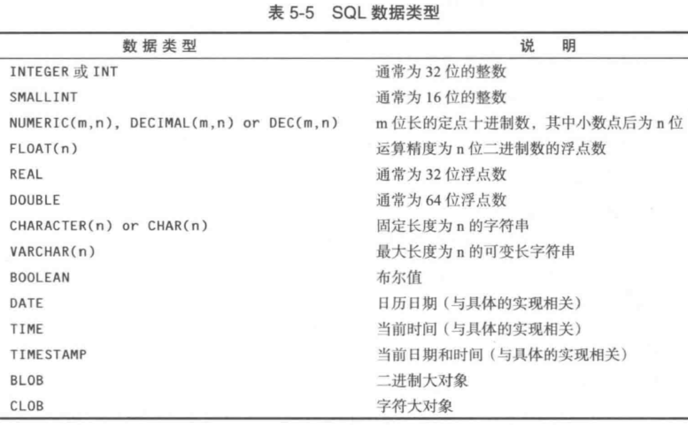
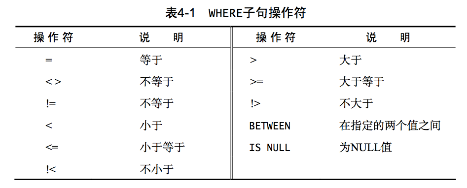
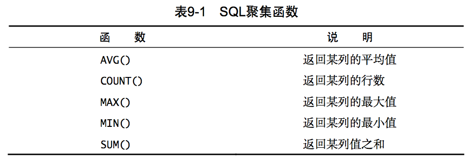
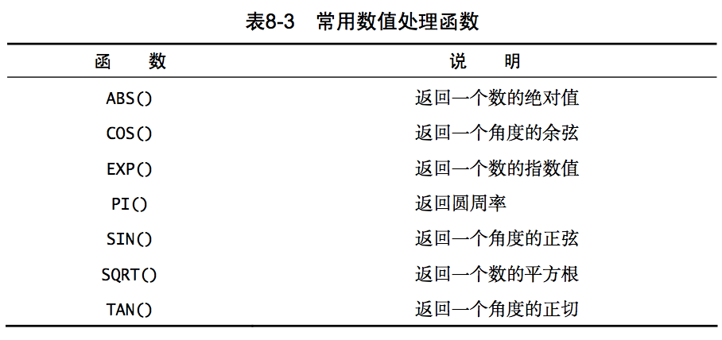
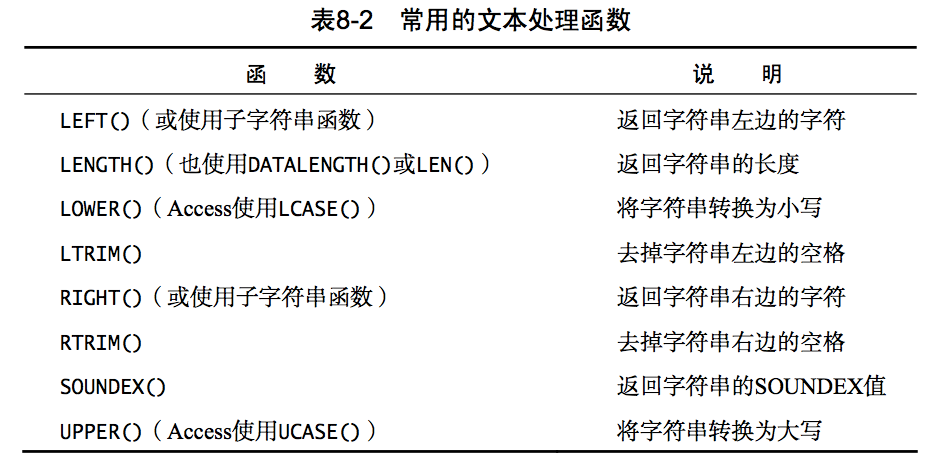

# MySQL

适用数据库：MySQL

## E-R关系图

- 实体：方框
- 属性：椭圆
- 关系：菱形

## 和Java中的Date类型转换问题

解决因mysql和java中的Date类型的时区划分不一致，导致相互存取时间显示不一致的问题

从mysql中取得的Date类型数据需要转成字符串，再转成Java中的Timestamp类型

```java
// 从数据库中取出数据
String date = rs.getString("create_time");
// 转换成Java中的Date类型
Timestamp javaDate = Timestamp.valueOf(date);
```

将Java中的Date类型的数据存入mysql，需要将数据库的地址加上时区参数，serverTimezone默认是UTC或者GMT

```xml
<property name="jdbcUrl">jdbc:mysql://localhost/DemoShoppingMall01?serverTimezone=CTT</property>
```

## mysql安装

CentOS7不再支持mysql，使用mariadb代替mysql

```java
yum install mariadb-server -y //如果已安装可以省略
systemctl start mariadb.service //启动服务
systemctl enable mariadb.service //开机启动服务
//初始化数据库配置
mysql_secure_installation
mysql -u root -p //登录mysql
```

开启远程访问

```sql
-- 首先配置允许访问的用户，采用授权的方式给用户权限。说明：root是登陆数据库的用户，123456是登陆数据库的密码，*就是意味着任何来源任何主机反正就是权限很大的样子。
GRANT ALL PRIVILEGES ON *.* TO 'root'@'%'IDENTIFIED BY '123456' WITH GRANT OPTION;
-- 刷新权限使之生效。
flush privileges;
```
开启centOS7的防火墙端口3306：https://www.cnblogs.com/moxiaoan/p/5683743.html

# SQL

Structure Query Language，结构化查询语言

SQL 是一门 ANSI 的标准计算机语言，用来访问和操作数据库系统。可与数据库程序协同工作，比如 MS Access、DB2、Informix、MS SQL Server、Oracle、Sybase 以及其他数据库系统。

不幸地是，存在着很多不同版本的 SQL 语言，但是为了与 ANSI 标准相兼容，它们必须以相似的方式共同地来支持一些主要的关键词（比如 SELECT、UPDATE、DELETE、INSERT、WHERE 等等）。

除了 SQL 标准之外，大部分 SQL 数据库程序都拥有它们自己的私有扩展。

SQL的分类

- DDL：数据定义语言，定义数据库，数据表它们的结构，create(创建)drop(删除)alter(修改)
- DML：数据操纵语言，用来操作数据，insert(插入)，update(修改)，delete(删除)
- DCL：数据控制语言，定义访问权限，取消权限，安全设置，grant
- DQL：数据查询语言，select查询，from，where子句
 数据库

SQL语句必须以;分隔。

SQL语句不区分大小写。

语句中的空格会被忽略。

## 名词解释

数据库：保存有组织的数据的容器

表：某种特定类型数据的结构化清单

模式：关于数据库和表带布局及特性的信息

列：表中的一个字段。表由一个或多个列组成。

数据类型：所容许的数据的类型。

行：表中的一个记录

主键：一列，其值能够唯一标识表中每个行

子句：由一个关键字+数据组成。如，select的from子句。

## 数据库操作

- 登录数据库：mysql -uroot -p（-u后面是username，-p后面是password）
- 创建数据库
	- 创建数据库：create database 数据库名;
	- 创建时指定字符集：create database 数据库名 character set 字符集;
	- 创建时指定校对规则：create database 数据库名 character set 字符集 collate 校对规则; `create database mydatabase character set utf8 ;`
- 查看数据库
	- 查看所有数据库：show databases;
	- 查看数据库定义：show create database 数据库名;
	- 查看当前数据库：select database();
- 修改数据库的字符集：alter database 数据库名 character set 字符集;

- 删除数据库：drop database 数据库名;
- 切换数据库：use 数据库名;

## 表的操作

### 创建表

```
create table 表名(
	列名 列的类型（长度） 约束,
	列名2 列的类型（长度） 约束
);

create table student(
	sid int primary key auto_increment,
	sname varchar(31),
	sex int,
	age int
);
```

#### 列的类型



字符串
不管使用何种形式的字符串数据类型，字符串值都必须括在单引号内。

- 定长字符串char：接受长度固定的字符串，其长度是在创建表时指定的。缺少的字符用空格填充。
- 变长字符串varchar：储任意长度的文本。
- text：文本
- blob：二进制

数值

- int

- decimal：定点或精度可变的浮点值
- double
- float
- boolean

日期和时间

- date：YYYY-MM-DD，日期值

- time：hh:mm:ss，时间值

- datatime（或timestamp）：YYYY-MM-DD hh:mm:ss 

#### 列的约束

约束(constraint)：管理如何插入或处理数据库数据的规则

- 主键约束：primary key

- 唯一约束：unique

  用来保证一列(或一组列)中的数据是唯一的。

  - 表可包含多个唯一约束，但每个表只允许一个主键。
  - 唯一约束列可包含 NULL 值。
  - 唯一约束列可修改或更新。
  - 唯一约束列的值可重复使用。
  - 与主键不一样，唯一约束不能用来定义外键。

  唯一约束既可以用 UNIQUE 关键字在表定义中定义，也可以用单独的 CONSTRAINT 定义。

- 非空约束：not null

  NULL为默认设置，如果不指定NOT NULL，就认为指定的是NULL。

- 检查约束：check

  检查约束用来保证一列(或一组列)中的数据满足一组指定的条件

  ```sql
  ADD CONSTRAINT CHECK (gender LIKE '[MF]')
  ```

- 自动增长：auto_increment

默认值在 CREATE TABLE 语句的列定义中用关键字 DEFAULT 指定。如，默认日期（mysql），DEFAULT CURRENT_DATE()。


#### 主键

包含主键值的列从不修改或更新

主键值不能重用。如果从表中删除某一行，其主键值不分配给新行。

关键词：PRIMARY KEY

#### 外键

外键是表中的一列，其值必须列在另一表的主键中。

```sql
-- 定义主键、外键
CREATE TABLE Vendors
(
  -- 设vend_id为主键
	vend_id CHAR(10) NOT NULL PRIMARY KEY,
	vend_name CHAR(50) NOT NULL,
  -- 设prod_id为外键
	prod_id CHAR(50) NOT NULL,
  FOREIGN KEY (prod_id) REFERENCES Products(prod_id)
);

-- 添加主键
ALTER TABLE Vendors
ADD CONSTRAINT PRIMARY KEY (vend_id);

--添加外键
ALTER TABLE Vendors
ADD CONSTRAINT
FOREIGN KEY (prod_id) REFERENCES Products (prod_id);
```

### 更新表

```sql
-- 添加列add
alter table 表名 add 列名 列的类型 约束;
-- 修改列modify
alter table 表名 modify 列名 列的类型;
-- 修改列名change
alter table 表名 change 旧列名 新列名 列的类型;
-- 删除列drop
alter table 表名 drop 列名;
-- 修改表名rename
rename table 旧表名 to 新表名;
-- 修改表的字符集
alter table 表名 character set 字符集;
```

### 删除表

删除表全部数据和表结构，立刻释放磁盘空间

drop table 表名;

删除带外键的表

1. 设置忽略外键：SET FOREIGN_KEY_CHECKS=0;
2. 删除表
3. 恢复外键：SET FOREIGN_KEY_CHECKS=1;

查看当前 FOREIGN_KEY_CHECKS 的值：SELECT @@FOREIGN_KEY_CHECKS;

删除表全部数据，保留表结构，立刻释放磁盘空间

truncate table table_name;

### 查询表结构

show tables：查询出所有的表
show create table 表名：表的创建语句，表的定义
desc 表名：表的结构

### 建表原则

多对多的建表：
多建一张中间表，将多对多的关系拆成一对多关系，中建表至少要有2个外键，这两个外键分别指向原来的那张表。

##注释

1. 单行注释：--之后的文本就是注释（最通用）
2. 多行注释：/* */
3. 单行注释：#

## 检索数据

第一个被检索的行是第0行

| 命令 | 语句 | 说明 |
| ---- | ---- | ---- |
|检索单列|SELECT prod_name FROM Products;|从Products表中检索prod_name列|
|检索多列|SELECT prod_id, prod_name, prod_price FROM Products;|从Products表中检索多列|
|检索所有列|SELECT * FROM Products;||
|检索不同值(去重)|SELECT DISTINCT vend_id FROM Products;|DISTINCT必须放在列名前，作用于所有列|
|限制结果|SELECT prod_name FROM Products LIMIT 5;|显示前5条|
|限制结果|SELECT prod_name FROM Products LIMIT 4 OFFSET 3;|显示从第3行开始的4条结果，简写：LIMIT 3,4|

### 排序

| 命令 | 语句 | 说明 |
| ---- | ---- | ---- |
|排序|SELECT prod_name FROM Products ORDER BY prod_name;|对prod_name以字母顺序排序，ORDER BY应该是最后一条子句|
|多列排序|SELECT prod_id, prod_price, prod_name FROM Products ORDER BY prod_price, prod_name;|按prod_price排序后，在内部按prod_name排序|
|按位置排序|SELECT prod_id, prod_price, prod_name FROM Products ORDER BY 2, 3;|效果同上，要保证第二列是prod_price，第三列是prod_name|
|指定排序方向|SELECT prod_id, prod_price, prod_name FROM Products ORDER BY prod_price DESC, prod_name;|prod_price降序排序，prod_name升序（ASC）|

### 过滤数据

通过过滤选择不包含指定值的所有行时，含有null的行可能不会被返回。

SQL在处理 OR 操作符前，优先处理 AND 操作符。改变求值顺序可以使用()。

| 命令 | 语句 | 说明 |
| ---- | ---- | ---- |
|where子句|SELECT prod_name, prod_price FROM Products WHERE prod_price = 3.49;|返回prod_price = 3.49的列|
|检查空值|SELECT prod_name FROM Products WHERE prod_price IS NULL;|返回prod_price字段为空的行|
|and操作符|SELECT prod_id, prod_price, prod_name FROM Products WHERE vend_id = 'DLL01' AND prod_price <= 4;|与|
|OR操作符|SELECT prod_name, prod_price FROM Products WHERE vend_id = 'DLL01' OR vend_id = ‘BRS01’;|或|
|IN 操作符|SELECT prod_name, prod_price FROM Products WHERE vend_id IN ( 'DLL01', 'BRS01' )|IN 操作符用来指定条件范围，范围中的每个条件都可以进行匹配。和OR的作用类似|
|NOT 操作符|SELECT prod_name FROM Products WHERE NOT vend_id = 'DLL01'|非，可用!=或<>替代|



### 通配符

通配符LIKE搜索只能用于文本字段(字符串)

| 命令 | 语句 | 说明 |
| ---- | ---- | ---- |
|% 通配符|SELECT prod_name FROM Products WHERE prod_name LIKE 'F%y';|%表示0-N个任意字符（null除外）|
|_ 通配符|SELECT prod_id, prod_name FROM Products WHERE prod_name LIKE '__ inch teddy bear';|匹配单个字符|
|[] 通配符|FROM Customers WHERE cust_contact LIKE '[JM]%' ORDER BY cust_contact;|指定一个字符集，只能匹配单个字符。可以用前缀字符^(脱字号)来否定|

### 计算字段

直接从数据库中检索出转换、计算或格式化过的数据

计算字段并不实际存在数据库表中，而是运行时在select语句中创建的。

| 命令 | 语句 | 说明 |
| ---- | ---- | ---- |
|拼接字段|SELECT vend_name + ' (' + vend_country + ')' FROM Vendors ORDER BY vend_name;|不同的数据库，使用+，||，Concat(列名, 字符串, 列名2)。在列名上使用RTRIM()去掉值右边多余空格|
|别名|SELECT RTRIM(vend_name) + ' (' + RTRIM(vend_country) + ')' AS vend_title FROM Vendors ORDER BY vend_name;||
|算数计算|SELECT prod_id,quantity,item_price,quantity*item_price AS expanded_price FROM OrderItems WHERE order_num = 20008;|支持+，-，*，／|

测试计算，检验函数

select 省略了 FROM 子句后就是简单地访问和处理表达式，例如 SELECT 3 * 2;将返回 6，SELECT Trim(' abc ');将返回 abc，SELECT Now();使用 Now()函数返回当前日期和时间。

### 函数

与 SQL 语句不一样，SQL 函数不是可移植的。不同数据库支持的函数不同。

使用场景
1. 确定表中行数
2. 获得表中某些行的和
3. 找出表列的最大值、最小值、平均值

#### 聚集函数



AVG()函数只能用来确定单个数值列的平均值，忽略列值为 NULL 的行。

COUNT()函数有两种使用方式:

1. 使用 COUNT(*)对表中行的数目进行计数，不管表列中包含的是空值(NULL)还是非空值。
2. 使用 COUNT(column)对特定列中具有值的行进行计数，忽略 NULL 值。

MAX()，MIN()，SUM()函数忽略列值为 NULL 的行。

#### 数值处理函数



#### 文本处理函数



### 分组数据

#### 分组GROUP BY

除聚集计算语句外，select中的每一列都必须在GROUP BY子句中给出。

GROUP BY子句必须出现在WHERE子句之后，ORDER BY子句之前

#### 过滤分组HAVING

HAVING 非常类似于 WHERE。所有类型的 WHERE 子句都可以用 HAVING 来替代。唯一的差别是，WHERE 过滤行，而 HAVING 过滤分组。

WHERE 在数据分组前进行过滤，HAVING 在数 据分组后进行过滤。

| 命令 | 语句 | 说明 |
| ---- | ---- | ---- |
|GROUP BY|SELECT vend_id, COUNT(*) AS num_prods FROM Products GROUP BY vend_id;|对每个vend_id计算num_prods。|
|HAVING|SELECT cust_id, COUNT(\*) AS orders FROM Orders GROUP BY cust_id HAVING COUNT(*) >= 2;|过滤分组|

### select子句顺序

select.. from.. where.. group by.. having.. order by

## 插入数据

不要使用没有明确给出列的 INSERT 语句。给出列能使 SQL 代码继续发挥作用，即使表结构发生了变化。

```sql
-- 插入数据
insert into 表名(列名1，列名2，列名3) values(值1，值2，值3);

-- 简单写法（不推荐）
insert into 表名 values(值1，值2，值3);

-- 批量插入
insert into 表名 values
(值1，值2，值3), 
(值1，值2，值3),
(值1，值2，值3);

-- 插入检索出的数据
insert into 表名1(列名1, 列名2, 列名3) select 列名1, 列名2, 列名3 from 表名2;
```

## 更新和删除数据

更新表中的特定行

update 表名 set 列名1=列值1, 列名2=列值2 [where 条件];

```sql
UPDATE Customers
SET cust_contact = 'Sam Roberts',
    cust_email = 'sam@toyland.com'
WHERE cust_id = '1000000006';
```

删除数据

```sql
-- 删除一行数据。没有指定条件，会删除全部数据
DELETE FROM Customers
WHERE cust_id = '1000000006';

-- 删除所有行
TRUNCATE TABLE
```

delete和truncate删除数据有什么区别？

​	delete：DML 一条一条删除表中数据

​	truncate：DDL 先删除表，再重建表

数据少时，delete高效；数据多时，truncate高效

## 子查询

子查询：嵌套在其他查询中的查询。

在 SELECT 语句中，子查询总是从内向外处理。

分为：

- 单行子查询：子查询语句返回一行数据，用关系运算符连接
- 多行子查询：子查询语句返回多行数据，用IN连接

作为子查询的 SELECT 语句只能查询单个列。企图检索多个列将返回错误。

```sql
-- 查询订购了RGAN01产品的用户
SELECT cust_id
FROM Orders
WHERE order_num IN (SELECT order_num
					FROM OrderItems
					WHERE prod_id = 'RGAN01');

-- 相当于
SELECT order_num FROM orderitems WHERE prod_id='RGAN01';//返回两个订单号:20007 和 20008
SELECT cust_id FROM orders WHERE order_num IN (20007,20008)
```

作为计算字段使用子查询

```sql
-- 显示 Customers 表中每个顾客的订单总数
-- WHERE使用了完全限定列名
SELECT cust_name,
		cust_state,
		(SELECT COUNT(*)
		FROM Orders
		WHERE Orders.cust_id = Customers.cust_id) AS orders
FROM Customers
ORDER BY cust_name;
```
## 别名

使用as关键字，as可省略

```sql
-- 给表起别名
SELECT cust_name, cust_contact
FROM Customers AS C, Orders AS O, OrderItems AS OI
WHERE C.cust_id = O.cust_id
 AND OI.order_num = O.order_num
 AND prod_id = 'RGAN01';

-- 列别名
select pname as pn, price as pp from product;
select pname pn, price pp from product;
```

## 联结表

联结是一种机制，用来在一条 SELECT 语句中关联表，因此称为联结。

内联结，也称为等值联结

```sql
-- 创建联结
SELECT vend_name, prod_name, prod_price
FROM Vendors, Products
WHERE Vendors.vend_id = Products.vend_id;

-- 效果同上
SELECT vend_name, prod_name, prod_price
FROM Vendors INNER JOIN Products
 ON Vendors.vend_id = Products.vend_id;
```

自联结，引用不止一次相同的表

```sql
-- 找出 Jim Jones 工作的公司，然后找出在该公司工作的顾客
-- 子查询
SELECT cust_id, cust_name, cust_contact
FROM Customers
WHERE cust_name = (SELECT cust_name
					FROM Customers
					WHERE cust_contact = 'Jim Jones');

-- 自联结
SELECT c1.cust_id, c1.cust_name, c1.cust_contact
FROM Customers AS c1, Customers AS c2
WHERE c1.cust_name = c2.cust_name
 AND c2.cust_contact = 'Jim Jones';
```

自然联结，自然联结排除多次出现，使每一列只返回一次。自然联结要求只能选择那些唯一的列。

```sql
SELECT C.*, O.order_num, O.order_date,
       OI.prod_id, OI.quantity, OI.item_price
 FROM Customers AS C, Orders AS O, OrderItems AS OI
 WHERE C.cust_id = O.cust_id
  AND OI.order_num = O.order_num
  AND prod_id = 'RGAN01';
```

外联结，外联结包含了那些在相关表中没有关联行的行。

在使用 OUTER JOIN 语法时，必须使用 RIGHT 或 LEFT 关键字指定包括其所有行的表

全外联结包含两个表的不关联的行（仅部分数据库使用）

```sql
SELECT Customers.cust_id, Orders.order_num
FROM Customers LEFT OUTER JOIN Orders
 ON Customers.cust_id = Orders.cust_id;

-- 全外联结（mysql不支持）
SELECT Customers.cust_id, Orders.order_num
FROM Orders FULL OUTER JOIN Customers
 ON Orders.cust_id = Customers.cust_id;
```
带聚集函数的联结
```sql
-- 检索所有顾客及每个顾客所下的订单数
SELECT Customers.cust_id,
       COUNT(Orders.order_num) AS num_ord
FROM Customers INNER JOIN Orders
 ON Customers.cust_id = Orders.cust_id
GROUP BY Customers.cust_id;
```

## 组合查询

执行多个查询(多条 SELECT 语句)，并将结果作为一个查询结果集返回。

适合从多个表中检索数据。

使用规则

1. UNION 必须由两条或两条以上的 SELECT 语句组成，语句之间用关键字 UNION 分隔(因此，如果组合四条 SELECT 语句，将要使用三个 UNION 关键字)。
2. UNION 中的每个查询必须包含相同的列、表达式或聚集函数(不过，各个列不需要以相同的次序列出)。
3. 列数据类型必须兼容:类型不必完全相同，但必须是 DBMS 可以隐含转换的类型(例如，不同的数值类型或不同的日期类型)。

UNION 从查询结果集中自动去除了重复的行，如果想返回所有的匹配行，可使用UNION ALL而不是UNION。

```sql
-- 需求：需要 Illinois、Indiana 和 Michigan 等美国几个州的所有顾客的报表，还想包括不管位于哪个州的所有的 Fun4All。
-- 组合查询
SELECT cust_name, cust_contact, cust_email
FROM Customers
WHERE cust_state IN ('IL','IN','MI');
UNION
SELECT cust_name, cust_contact, cust_email
FROM Customers
WHERE cust_name = 'Fun4All';

-- 使用where语句，效果同上
SELECT cust_name, cust_contact, cust_email
FROM Customers
WHERE cust_state IN ('IL','IN','MI')
 OR cust_name = 'Fun4All';
```

## 复制表

要将一个表的内容复制到一个全新的表(运行中创建的表)，可以使用SELECT INTO语句。

- 任何SELECT选项和子句都可以使用，包括WHERE和GROUP BY;
- 可利用联结从多个表插入数据;
- 不管从多少个表中检索数据，数据都只能插入到一个表中。

```sql
SELECT *
INTO CustCopy
FROM Customers;

-- mysql的语法
CREATE TABLE CustCopy AS
SELECT * FROM Customers;
```

## 视图

视图是虚拟的表。与包含数据的表不一样，视图只包含使用时动态检索数据的查询。视图必须唯一命名。

```sql
-- 创建视图
CREATE VIEW 视图名;
-- 删除视图
DROP VIEW viewname;

-- 返回已订购了任意产品的所有顾客的列表
CREATE VIEW ProductCustomers AS
SELECT cust_name, cust_contact, prod_id
FROM Customers, Orders, OrderItems
WHERE Customers.cust_id = Orders.cust_id
AND OrderItems.order_num = Orders.order_num;
-- 检索订购了产品 RGAN01 的顾客
SELECT cust_name, cust_contact
FROM ProductCustomers
WHERE prod_id = 'RGAN01';
```
利用视图，可一次 性编写基础的 SQL，然后根据需要多次使用。

## 存储过程

存储过程就是为以后使用而保存的一条或多条 SQL 语句。可将其视为批文件，虽然它们的作用不仅限于批处理。

```sql
-- 执行存储过程
EXECUTE AddNewProduct( 'JTS01',
                       'Stuffed Eiffel Tower',
                      	6.49,
												'Plush stuffed toy with the text La Tour Eiffel in red white and blue' );
```
创建存储过程(不同数据库有不同创建版本)

## 事务处理

使用事务处理(transaction processing)，通过确保成批的 SQL 操作要么完全执行，要么完全不执行，来维护数据库的完整性。

事务处理用来管理 INSERT、UPDATE 和 DELETE 语句。

- 事务(transaction)指一组 SQL 语句;
- 回退(rollback)指撤销指定 SQL 语句的过程;
- 提交(commit)指将未存储的 SQL 语句结果写入数据库表;
- 保留点(savepoint)指事务处理中设置的临时占位符(placeholder)，
可以对它发布回退(与回退整个事务处理不同)。

管理事务的关键在于将 SQL 语句组分解为逻辑块，并明确规定数据何时应该回退，何时不应该回退。

ROLLBACK：用来回退(撤销)SQL 语句

在事务处理块中，提交不会隐式进行。进行明确的提交，使用 COMMIT 语句。

普通sql语句是自动提交的。

```sql
-- 开启一个事务
START TRANSACTION
-- 各种操作命令...
DELETE FROM Orders;

-- 回退命令or提交命令（代表事务结束）
ROLLBACK;
COMMIT;

-- 查看自动提交选项
show variables like '%commit%';
-- 关闭自动提交（只对当前实例有效，mysql重启后实效）
set session autocommit=0;
```
### 事务特性

1. 原子性：事务中包含的逻辑，不可分割
2. 一致性：事务执行前后。数据完整性
3. 隔离性：事务在执行期间，不应受到其他事务的影响。
4. 持久性：事务执行成功，那么数据应该持久保持在磁盘上。

### 事务安全隐患

不考虑隔离级别设置，会出现以下问题

读

- 脏读：一个事务读到另一个事物还未提交的数据。
- 不可重复读：一个事务读到另一个事物提交的数据，造成两次读取数据不一致。
- 幻读：一个事务读到另一个事物插入的数据，造成两次读取数据不一致。

解决方法，设置隔离级别

隔离级别

- Read Uncommitted（读未提交）
- Read Committed（读已提交）：解决脏读
- Repeatable Read（重复读）：mysql默认级别。
- Serializable（可串行化）：解决脏读、不可重读、幻读

```sql
-- 查看隔离级别
select @@tx_isolation;
-- 设置隔离级别为Read Uncommitted
set session transaction isolation level Read Uncommitted;
```

写

- 丢失更新

解决丢失更新的方法

- 悲观锁：select * from account for update;

  for update：数据库锁机制，排他锁

- 乐观锁：要求程序员自己控制（通过增加version字段等）

### 保留点

要支持回退部分事务，必须在事务处理块中的合适位置放置占位符。这样，如果需要回退，可以回退到某个占位符。在 SQL 中，这些占位符称为保留点。

```sql
-- 创建占位符
SAVEPOINT delete1;
-- 回退
ROLLBACK TO delete1;
```

## 游标

游标(cursor)是一个存储在 DBMS 服务器上的数据库查询， 它不是一条 SELECT 语句，而是被该语句检索出来的结果集。在存储了游标之后，应用程序可以根据需要滚动或浏览其中的数据。

```sql
-- 创建游标(找出空缺的电子邮件地址)
DECLARE CustCursor CURSOR
FOR
SELECT * FROM Customers
WHERE cust_email IS NULL
-- 打开游标
OPEN CURSOR CustCursor
-- 访问游标数据(查看文档)
-- 关闭游标(查看文档)
```

## 索引

可以在一个或多个列上定义索引，使 DBMS 保存其内容的一个排过序的列表。不同 DBMS 创建索引的语句变化很大。

索引必须唯一命名。

```sql
CREATE INDEX prod_name_ind
ON Products (prod_name);
```

## 触发器

触发器是特殊的存储过程，它在特定的数据库活动发生时自动执行。触发器与单个的表相关联。

# JDBC

JDBC(java database connectivity)，java数据库连接。可以看作是一个用于将SQL语句传递给数据库的应用编程接口(API)。

JDBC结构图


JDBC API提供了以下接口和类：

- DriverManager: 这个类管理数据库驱动程序的列表。确定内容是否符合从Java应用程序使用的通信子协议正确的数据库驱动程序的连接请求。识别JDBC在一定子协议的第一个驱动器将被用来建立数据库连接。
- Driver: 此接口处理与数据库服务器通信。很少直接直接使用驱动程序（Driver）对象，一般使用DriverManager中的对象，它用于管理此类型的对象。它也抽象与驱动程序对象工作相关的详细信息
- Connection : 此接口与接触数据库的所有方法。连接对象表示通信上下文，即，与数据库中的所有的通信是通过此唯一的连接对象。
- Statement : 可以使用这个接口创建的对象的SQL语句提交到数据库。一些派生的接口接受除执行存储过程的参数。
- ResultSet: 这些对象保存从数据库后，执行使用Statement对象的SQL查询中检索数据。它作为一个迭代器，可以通过移动它来检索下一个数据。
- SQLException: 这个类用于处理发生在数据库应用程序中的任何错误。

## 快速入门

前置条件

- JAVA(JDK)安装
- 数据库系统的安装(如：MySQL的安装)

1. 导入包在程序中包含数据库编程所需的JDBC类。大多数情况下，使用 import java.sql.* 就足够了，如下所示：

```java
//STEP 1. Import required packages
import java.sql.*;
```

2. 注册JDBC驱动程序需要初始化驱动程序，这样就可以打开与数据库的通信。以下是代码片段实现这一目标：

```java
//STEP 2: Register JDBC driver
Class.forName("com.mysql.jdbc.Driver");
```

3. 打开一个连接使用DriverManager.getConnection()方法来创建一个Connection对象，它代表一个数据库的物理连接，如下所示：

```java
//STEP 3: Open a connection
//Database credentials
static final String USER = "root";
static final String PASS = "pwd123456";
System.out.println("Connecting to database...");
conn = DriverManager.getConnection(DB_URL, USER, PASS);
```

4. 执行一个查询需要使用一个类型为Statement或PreparedStatement的对象，并提交一个SQL语句到数据库执行查询。如下：

```java
//STEP 4: Execute a query
System.out.println("Creating statement...");
Statement stmt = conn.createStatement();
String sql;
sql = "SELECT id, first, last, age FROM Employees";
ResultSet rs = stmt.executeQuery(sql);
```

如果要执行一个SQL语句：UPDATE，INSERT或DELETE语句，那么需要下面的代码片段：

```java
//STEP 4: Execute a query
System.out.println("Creating statement...");
stmt = conn.createStatement();
String sql;
sql = "DELETE FROM Employees";
int result = stmt.executeUpdate(sql);//返回修改的行数
```

5. 从结果集中提取数据这一步中演示如何从数据库中获取查询结果的数据。可以使用适当的ResultSet.getXXX()方法来检索的数据结果如下：

```java
//STEP 5: Extract data from result set
while(rs.next()){
    //Retrieve by column name
    int id  = rs.getInt("id"); // or rs.getInt(1); 当前行第一列的值
    int age = rs.getInt("age");
    String first = rs.getString("first");
    String last = rs.getString("last");

    //Display values
    System.out.print("ID: " + id);
    System.out.print(", Age: " + age);
    System.out.print(", First: " + first);
    System.out.println(", Last: " + last);
}
```

6. 清理环境资源在使用JDBC与数据交互操作数据库中的数据后，应该明确地关闭所有的数据库资源以减少资源的浪费，对依赖于JVM的垃圾收集如下：

```java
//STEP 6: Clean-up environment
closeRs(rs);
stmt.close();
conn.close();

//可以使用closeRs关闭文件
private static void closeRs(ResultSet rs){
	try{
		if(rs != null){
			rs.close();
		}
	} catch(SQLException){
		e.printStackTrace();
	} finnally{
		rs = null;
	}
}
```

## 配置

数据库 URL 

JDBC 使用了与普通 URL 相似的语法来描述数据源

```
jdbc:subprotocol:other stuff
jdbc:mysql://localhost:1527/dbname
```

驱动程序 JAR 文件

mysql 是 mysql-connector-java.jar

注册驱动器类

包含 `META-INF/services/java.sql.Driver` 文件的驱动程序 JAR 文件可以自动注册驱动器类。

手动注册驱动 

```java
Driver myDriver = Class.forName("com.mysql.jdbc.Driver"); // 方法1
Driver myDriver = DriverManager.registerDiver(new com.mysql.jdbc.Driver()); // 方法2
System.setProperty("jdbc.drivers", "com.mysql.jdbc.Driver:..."); // 方法3
```

连接到数据库

```java
String url = "jdbc:mysql://localhost:1527/dbname";
String username = "root";
String password = "pwd123456";
Connnection conn = DriverManager.getConnection(url, username, password);
```

SQLException

每个 SQLException 都有一个由多个 SQLException 对象构成的链。

```java
// 遍历所有异常
for (Throwable t : sqlException){
    // 处理异常
}

SQLWarning w = stat.getWarning();
while(w != null){
    w = w.nextWarning();
}
```

## Statement

JDBC Statement，CallableStatement 和 PreparedStatement 接口定义了可用于发送SQL或PL/SQL命令，并从数据库接收数据的方法和属性。

statement 其实是拼接sql语句，先拼接sql，然后一起执行。因此可能会把字符串当成sql关键字。

```java
Statement stat = conn.createStatement();
String command = "select * from mall_item";
ResultSet rs = stat.executeQuery(command);
String command = "update ...";
stat.executeUpdate(command);
// 遍历结果
while(rs.next()){
    // ...
}
```

如果 Statement 对象上有一个打开的结果集，那么调用 close 方法将自动关闭该结果集。

## PrepareStatement

PrepareStatement 可以动态地提供/接受参数。预先对sql语句进行语法检查

JDBC中的所有参数都由 ? 符号作为占位符，这被称为参数标记。

```java
String sql = "select * from tablename where username=? and password=?";
PreparedStatement ps = conn.prepareStatement(sql);
ps.setString(1, username); // 给第一个参数设置值 username
ps.setString(2, password);
ResultSet rs = ps.excuteQuery();
```

## 读写 LOB

数据库可以存储大对象，二进制大对象称为 BLOB ，字符型大对象称为 CLOB 。

```java
// 读 LOB
try(ResultSet rs = stat.executeQuery()){
    if(rs.next()){
        Blob coverBlob = rs.getBlob(1);
        Image coverImage = ImageIO.read(coverBlob.getBinaryStream());
    }
}
// 写 LOB
Blob coverBlob = connection.createBlob();
int offset = 0;
OutputStream out = coverBlob.setBinaryStream(offset);
ImageIO.write(coverImage, "PNG", out);
PrepareStatement stat = conn.prepareStatement("insert into Cover values(?, ?)");
stat.set(1, isbn);
stat.set(2, coverBlob);
stat.executeUpdate();
```

## SQL 转义

```java
// 日期
{d '2018-01-23'}
{t '23:59:59'}
{ts '2018-01-23 23:59:59'}
// 标量函数
{fn left(?, 20)}
{fn user()}
// 存储过程
{call PROC1(?, ?)}
{call PROC2}
{call ?=PROC3(?)}
// 特殊字符
... where ? like %!_% {escape '!'} // !定义为转义字符
```

获取自动生成的键

```java
stat.executeUpdate(insertStatement, Statement.RETURN_GENERATED_KEYS);
ResultSet rs = stat.getGneratedKeys();
if(rs.next()){
    int key = rs.getInt(1);
}
```

## 元数据

在 SQL 中，描述数据库或其组成部分的数据称为元数据。

```java
DatabaseMetaData meta = conn.getMetaData();
meta.supportsCatalogsInPrivilegeDefinitions();
ResultSet rs = ...;
ResultSetMetaData meta = rs.getMetaData(); // 列名、类型、字段宽度
```


## Dao模式

dao全称是data access object，数据库访问对象，主要的功能就是用于进行数据操作的，在程序的标准开发架构中属于数据层的操作。

企业分层架构

- 客户层：因为现在都采用了B/S开发架构，所以一般都使用浏览器进行访问。
- 显示层：使用JSP/Servlet进行页面效果的显示
- 业务层：（Business Object，业务对象）：会将多个原子性的DAO操作进行组合，组合成一个完整的业务逻辑。
- 数据层（DAO）：提供多个原子性的DAO操作，例如：增加、修改、删除等，都属于原子性的操作。
  声明与实现分开

DAO组成

- DatabaseConnection：专门负责数据库打开与关闭操作的类
- VO：主要由属性，setter, getter方法组成，VO类中的属性与表中的字段相对应，每一个VO类的对象都表示表中的每一条记录；
- DAO：主要定义操作的接口，定义一系列数据库的原子性操作，例如增删改查等；
- Impl: DAO接口的真实实现类，主要完成具体数据库操作，但不负责数据库的打开和关闭；
- Proxy：代理实现类，主要完成数据库的打开和关闭并且调用真实实现类对象的操作；
- Factory: 工厂类，通过工厂类取得一个DAO的实例化对象。

## 事务

可以将一组语句构建成一个事务。原因是为了确保数据库完整性。

默认情况下，数据库连接处于自动提交模式(autocommit mode)，SQL语句一旦被执行便被提交给数据库。

一个保存点意味着稍后只需要返回到这个点，而非事务的开头。

```java
//关闭自动提交
conn.setAutoCommit(false);
Statement stat = conn.createStatement();
...
// 保存点
Savepoint svpt = conn.setSavepoint();
...
if(...){
    //回滚
    conn.rollback(); // 回退到保存点
}
//提交
conn.commit();
// 释放保存点
conn.releaseSavepoint(svpt);

// 批处理
stat.addBatch(command);
int[] counts = stat.executeBatch();
```

代码里的事务，主要针对连接来的。

## 连接池

因为创建java程序到数据库的连接，比较消耗性能。所以一开始在内存中开辟一块空间（集合），里面放置多个连接对象，用来与javac程序连接。

这意味着数据库连接在物理上并未被关闭，而是保留在一个队列中被反复重用。

DataSource接口，针对连接池定义的一套规范。

```java
public class MyDataSource implements DataSource{
  List<Connection> conns = new ArraryList<>();
  public MyDataSource(){
    //创建一个有10个连接的连接池
    for(int i = 0; i < 10; i++){
      Connection conn = DriverManager.getConnection();
      connes.add(conn);
    }
  }
  
  //公布可用连接
  public Connection getConnection() throws SQLException{
    Connection conn = connes.remove()[0];
    return conn;
  }
  //归还连接
  
}
```

使用装饰者模式，自定义连接池

开源连接池

DBCP

C3P0

### DBCP

```java
BasicDataSource dataSource = new BasicDataSource();
//填写内容
dataSource.setDriverClassName("");
dataSource.setUrl(url);
dataSource.setUserName("root");
dataSource.setPassword("root");
Connection conn = dataSource.getConnection();
//后续内容与之前一致
```

配置文件

配置文件放在：src根目录

```java
//（实际开发时，使用配置文件）
BasicDataSourceFactory factory = new BasicDataSourceFactory();
Properties properties = new Properties();
Inputstream is = new FileInputStream("src//dbcpconfig.properties");
properties.load(is);
DataSource dataSource = factory.createDataSource(properties);
```

###C3P0

把c3p0-0.9.5.2.jar和mchange-commons-java-0.2.11.jar放在项目里

```java
import com.mchange.v2.c3p0.*;

ComboPooledDataSource cpds = new ComboPooledDataSource();
//填写配置内容
cpds.setDriverClass( "com.mysql.jdbc.Driver" ); //loads the jdbc driver            
cpds.setJdbcUrl( "jdbc:mysql://localhost/testdb" );
cpds.setUser("dbuser");                                  
cpds.setPassword("dbpassword");  

//使用配置文件，默认会找c3p0-config.xml文件

//关闭连接池
cpds.close();
```

###DBUtils

开源数据库工具，简化增删查改

```java
import org.apache.commons.dbutils.*;
//建立连接（使用c3p0）
ComboPooledDataSource dataSource = new ComboPooledDataSource();
//创建dbutils对象
QueryRunner queryRunner = new QueryRunner(dataSource);
//增删改
queryRunner.update("insert into account values(null, ?, ?)", "abc", 100);
//查
//给出sql模板
String sql = "SELECT * FROM t_stu WHERE sid=?";
//给出参数
Object[] params = {1002};
//执行query()方法，需要给出集处理器，即 ResultSetHandler 的实现类对象
//我们需要给的是BeanHandler,它实现了ResultSetHandler
//它需要一个类型，然后它会把rs中的数据封装到指定类型的javabean对象中，然后返回javabean对象
Stu stu = queryRunner.query(sql, new BeanHandler<Stu>(Stu.class), params);
//结果集合
List<Stu> stuList = qr.query(sql,new BeanListHandler<Stu>(Stu.class));
// 使用聚合函数
Long result = (Long) qr.query("select count(*) from tablename",new ScalarHandler());
// MapListHandler
List<map<String, Object>> list = qr.query(sql, new MapListHandler());
```

## 调用存储过程

需要依赖包orcal

```java
public void test(){
  // 注册驱动
  Class.forName("oracle.jdcb.driver.OracleDriver");
  // 获取链接
  String url = "jdbc:oracle:thin:@IP地址:端口:orcl";
  String username = "";
  String password = "";
  Connection conn = DriverManager.getConnection(url, username, password);
  // 调用存储过程的sql
  String sql = "{call proc_updatesal(?,?)}";
  // 获取Statement(存储过程)
  CallableStatment state = conn.prepareCall(sql);
  // 设置输入参数
  state.setInt(1, 7788);
  // 注册输出参数
  state.registerOutParameter(2, OracleTypes.Number)
  // 执行statement
  state.execute();
  // 获取结果
  int result = state.getInt(2);
  // 释放资源
  state.close();
  conn.close();
}

// 调用存储函数的sql
String sql = "{? = call func_getsal(?)}";
CallableStatment state = conn.prepareCall(sql);
// 设置返回值类型
state.registerOutParameter(1, OracleTypes.Number);
```


# Oracle

数据库层级结构

数据库 --> 数据库实例ORCL --> 表空间(用户里面创建表) --> 数据文件

- ORCL
  - 表空间（逻辑空间）（用户）
    - 数据文件（表）

## 基本查询

- 四则运算

```sql
select 1+1; -- 报错

select 1+1 from dual;

select sal*12 from emp;

select sal*12 + nvl(comm,0) from emp;
```

dual是Oracle中的虚表、伪表，主要是用来补齐语法结构

nvl(param1, param2)表示如果param1为null，则返回param2。null代表不确定不可预知的内容，不可以做四则运算

- 别名查询

使用as关键字，可以省略。别名中不能有特殊字符，要使用需要用双引号圈起来。

```sql
select ename "姓   名", sal "工%资" from emp;
```

- 去除重复

用distinct

```sql
-- 多列去除重复
select DISTINCT job, deptno from emp;
```

- 字符串拼接

用 `||` 拼接

```sql
select '姓名'||ename from emp;
```

在oracle中，双引号主要在别名的时候使用；单引号是使用的值，字符。

使用concat函数拼接

```sql
select concat('姓名', ename) from emp;
```

在mysql和oracle中都可以使用

- 伪列

rownum

伪列，oracle特有的用来表示行号的，默认起始值为1，在查询出结果后加1

不能做大于号判断

```sql
select rownum,e1.* from emp e1;
-- 无结果
select rownum,e1.* from emp e1 where rownum > 2;
-- 能正确显示
select rownum,e1.* from emp e1 where rownum < 6;
-- 用子查询，结合order by，可以获得正确的排序
select rownum, t1.* from (select e1.* from emp e1 order by sal desc) t1;
```

rowid

每行记录所存放的真实物理地址

```sql
-- 去除重复记录
delete from p p1 where rowid > (select min(rowid) from p p2 where p1.name = p2.name)

```

## 条件查询

和mysql类似

  - 关系运算符: > >= = < <= !=(某些产品不支持) <>
  - 逻辑运算符: and or not
  - 其他运算符:
    - 模糊查询 like
    - 范围查询 in(set)
    - 在..之间 between..and..
    - 判断为空 is null
    - 判断不为空 is not null

- 转义字符

```sql
-- 查询员工姓名中，包含%的员工信息，escape告诉oracle，"\"是一个转义字符
select * from emp where ename like '%\%%' escape '\';
```

- 条件表达式

```sql
-- 通用写法，mysql和oracle都能用
select
  case 字段:
    when 值1 then 值
    when 值2 then 值
    else
      默认值
    end
from emp;

-- oracle特有写法
select
  decode(字段, if1, then1, if2, then2, ..., else1)
from emp;
```

- 分页查询

```sql
-- oracl中只能用子查询实现分页查询
select * from (select rownum num, emp.* from emp) tt where tt.num between 6 and 10;
```

## 排序

```sql
-- 查询员工信息，按照奖金由高到低排序。
select * from emp order by comm desc, deptno asc nulls last;
```

nulls表示空值，默认是first(排在前面)，改成last(排在后面)

分组

```sql
-- 查询各部门的平均工资，找出大于2000的部门
select deptno, avg(sal) from emp group by deptno having avg(sal) > 2000;
```

where 和 having 区别

- where 后面不能接聚合函数，可以接单行函数
- having 是在group by之后执行，可以接聚合函数


## 函数

必需要有返回值

- 单行函数
  - 数值函数，对数字进行操作，如43.34
    - ceil() 向上取整
    - floor() 向下取整
    - round() 四舍五入
    - trunk() 截断
    - mod() 求模
  - 字符函数
    - substr(startIndex, length) 截取子串，从第一个字符开始
    - length() 字符串长度
    - trim() 去除左右两端的空格
    - replace(str, originSubStr, finalSubStr) 替换字符串
  - 日期函数
    - sysdate 今天的日期
  - 转换函数
    - to_number(str) 字符转数值(默认会自动转)
    - to_char(num, '$9,999.99') 数值转字符，第二个参数是格式
    - to_char(sysdate, 'yyyy-mm-dd hh:mi:ss') 日期转字符
    - to_date('2019-07-07', 'yyyy-mm-dd') 字符转日期
  - 通用函数
    - nvl(param1, param2) 如果param1=null，就返回param2
    - nvl2(param1, param2, param3) 如果param1=null，就返回param3，否则返回param2
    - nullif(param1, param2) 如果param1=param2，就返回null，否则返回1
    - coalesce()
- 多行函数(聚合函数)，直接忽略空值
  - sum 求和
  - max 求最大值
  - min 求最小值
  - count 行数
  - avg 求平均值

```sql
-- 统计员工的平局奖金
select sum(comm)/count(1) from emp;
select ceil(sum(comm)/count(1)) from emp;

-- 3个月后的今天
select add_month(sysdate, 3) from dual;
-- 3天后的日期
select sysdate + 3 from dual;
```

## 多表查询

笛卡尔积，同mysql

联结表，见sql

  - 内连接
  - 外连接，见sql

```sql
-- oracle中的左外连结
select * from emp e1, dept d1 where e1.deptno = d1.deptno(+);
```

## 子查询

子查询的结果集中出现空值，所有值和null比较还是null

exists查询语句：存在的意思，当作boolean值处理

```sql
-- 查询有员工的部门信息
select * 
from dept d1 
where exists(select * from emp e1 where e1.deptno = d1.deptno);
```

## 集合运算(组合查询)

并集

- union：去除重复，并且排序
- union all：不去除重复

交集

- intersect

差集

- minus

```sql
-- 并集
select * from emp where sal > 1500
union 
select * from emp where deptno = 20;

select * from emp where sal > 1500
union all
select * from emp where deptno = 20;
```

注意事项

1. 列的类型要匹配
2. 按照顺序与
3. 列的数量要匹配，可以用null补齐

## 表空间

表空间一般对应一个项目，在表空间里创建用户来创建表

语法

```sql
create tablespace 表空间的名称
  datafile '文件的路径（服务器上）'
  size 大小
  autoextend on 自动扩展
  next 每次扩展的大小;

-- 切换到system帐号下创建
create tablespace tableName
  datafile 'c:\tableName.dbf'
  size 100m
  autoextend on
  next 10m;

-- 删除表空间（逻辑删除）
drop tablespace tableName;

-- 创建用户
create user 用户名
  identified by 密码
  default tablespace 表空间的名称;

-- 分配权限
grant 角色|权限 to 用户名

-- 创建表
create table 表名(
  列名 列的类型 [列的约束],
  ...
);

-- 使用子查询的方式创建表。
-- 可以复制表，只能复制表结构和数据，不会复制表的约束
-- 如果查询语句没有结果，就只复制表结构
create table 表名 as 查询语句;
create table emp as select * from scott.emp;

-- 修改表
-- 添加列
alter table stu add phone varchar2(11);
-- 添加多个列
alter table stu add (
  mobile varchar2(11),
  sex varchar2(10)
);
-- 修改列类型
alter table stu modify sex varchar2(4);
-- 修改列名
alter table stu rename column sex to gender;
-- 删除列
alter table stu drop column gender;
-- 重命名表
rename stu to student;

-- 删除表
drop table stu;
````

列的类型

- varchar 目前支持，以后不一定支持
- varchar2(长度) 可变字符长度 varchar2(10)占5个字符
- char(长度) 固定长度字符 char(10)占10个字符，用空格填充
- number(总长度，小数长度) 数字类型，小数长度不能大于等于总长度
- date 年月日时分秒
- timestamp 时间戳，比date更精确

```sql
select current_date from dual;
select current_timestamp from dual;
```

列的类型

- 主键约束 primary key
- 非空约束 not null
- 唯一约束 UNIQUE
- 检查约束 check(条件) mysql忽略了检查约束
- 外键约束 

```sql
create table stu(
  stuid number primary key,
  sname varchar2(10) UNIQUE,
  age varchar2(10) not null,
  gender varchar2(4) check(gender in ('男', '女'))
);

-- 外键约束
-- 已存在不符合外键约束的数据时，无法添加外键
alter table product add FOREIGN key(cno) REFERENCES category(cid);
-- 表中记录被外键关联时，无法删除，只能强制删除(先删除外键关联，再删除表)
drop table category cascade constraint;
-- 级联删除，在删除时使用级联删除(先删除关联数据，再删除表中数据)
alter table product add FOREIGN key(cno) REFERENCES category(cid) on delete cascade;

-- 插入数据
insert into 表名 values();
insert into 表名() values();
-- 使用子查询插入数据
insert into 表名 查询语句;

-- 更新数据
update 表名 set 列名 = 列的值 [where 条件];

-- 删除数据
delete from 表名 [where 条件];

-- 
```

事务

oracle隔离级别

- read committed,
- serializable
- read only

提交 commit

保存点 savepoint

回滚 rollback，rollback to savepoint

```sql
DECLARE
begin
-- 插入数据
savepoint s1;
-- 插入数据
commit;
-- 捕获异常
exception
  when others then
    rollback to s1;
    commit;
end;
```

## 视图

是对查询结果的一个封装，所有数据都来自它查询的那张表，视图本身不存储任何数据。

1. 能够封装复杂的查询结果
2. 屏蔽表中的细节

语法

```sql
create [or replace] view 视图的名称 as 查询语句 [with read only];

-- 示例
create or replace view view1 as select ename,job,mgr from emp;

-- 修改数据
update view1 set ename='smith' where ename = 'SMITH';
```

- 同义词

```SQL
-- 创建同义词
create synonym dept for view1;
-- 创建后，使用方式和表一样
select * from dept;
```

## 序列

用来生成类似于auto_increment这种ID自动增长的

语法

```sql
-- 创建序列
create sequence 序列的名称
  start with 从几开始 默认1
  increment by 每次增加多少 默认1
  maxvalue 最大值
  minvalue 最小值
  cycle | nocycle 是否循环
  cache 3 缓存的数量 | nocache;

-- 从序列取值
序列的名称.currval 当前值，需要在调用一次nextval后才能使用。
序列的名称.nextval 下一个值

-- 用的最多的写法
create sequence seq_test2;


```

## 索引

相当于书的目录，目的是提高查询效率。经常使用的、作为查询条件的列，可以创建索引。

主键约束自带主键索引，唯一约束自带唯一索引

语法

```sql
create index 索引的名称 on 表名(列);
-- 复合索引
create index 索引的名称 on 表名(列, 列2, ...);
```

考虑指标

- cost：cpu调用次数
- Cardinality：影响行数

原理

索引使用了平衡二叉树，可以提高查询效率。但修改的时候树的结构需要调整，因此修改数据会变慢。需要每过一段时间，重构索引

## PLSQL编程

procedure Language 过程语言，是oracle对SQL的扩展，可以编写条件、循环等……

```sql
declear
  -- 声明变量
  变量名 变量类型;
  变量名 变量类型:= 初始值;
begin
  -- 业务逻辑
end;

declear
  i varchar2(10) := '张三';
  -- 引用型变量，变量类型和emp表中的sal列的类型一致
  vsal emp.sal%type;
  -- 记录型变量，和emp一行的类型相同
  vrow emp%rowtype;
begin
  -- 打印语句
  dbms_output.put_line(i);
  -- 不换行
  dbms_output.put(i);
  -- 一个换行
  dbms_output.new_line();
  -- 将7369员工的工资赋值给变量
  select sal into vsal from emp where empno = 7369;
  -- 将7369员工的信息赋值给变量
  select * into vrow from emp where empno = 7369;
end;

-- 条件判断
if then
elseif then
else
end if;

declear
  age number := 20;
  -- age number := &aaa;可以在控制台输入
begin
  if age < 18 then
    -- 语句
  elseif age >= 18 and age < 24 then
    -- 语句
  else
    -- 语句
  end if;
end;

-- 循环操作
-- while 循环
while 条件 loop
  -- 语句
end loop;

-- for 循环，reverse表示倒序
for 变量 in [reverse] 起始值..结束值 loop
  -- 语句
end loop;

-- loop 循环
loop
  exit when 条件
  -- 语句
end loop;
```

## 游标

用来操作查询结果集，类似JDBC中的 ResultSet，指向结果集中的数据

开发步骤

1. 声明有标
2. 打开游标
3. 从游标中提取数据
4. 关闭游标

语法

```sql
-- 声明游标
cursor 游标名 is 查询结果集;
-- 带参
cursor 游标名(参数名 参数类型) is 查询结果集;
-- 打开游标
open 游标名;
-- 从游标中取数据
fetch 游标名 into 变量;
游标名%found：找到数据;
游标名%notfound：没找到数据;
-- 关闭游标
close 游标名;

cursor vrows(dno number) is 
  select * from emp where deptno = dno;
```

系统引用游标

1. 声明游标
2. 打开游标
3. 从游标中取数据
4. 关闭游标

```sql
-- 声明游标
游标名 sys_refcursor
-- 打开游标
open 游标名 for 结果集
-- 从游标中取数据
fetch 游标名 into 变量;
游标名%found：找到数据;
游标名%notfound：没找到数据;
-- 关闭游标
close 游标名;
```

for 循环遍历游标

```sql
declear
  cursor vrows is select * from emp;
begin
  -- for循环自动声明变量、打开、关闭游标
  for vrow in vrows loop
    dbms_output.put_line('name:'||vrow.ename||'  sal:'||vrow.sal);
  end loop;
end;
```

## 例外(异常)

类似Java中的异常

```sql
-- 声明异常
no_emp exception;

-- 抛出异常
raise no_emp;

-- 捕获异常
declear
begin
exception
  -- 捕获异常
  when 异常1 then 
    ...
  when 异常2 then 
    ...
  when others then
    ...
end;

-- 异常信息
sqlerrm
```

异常类型

- zero_divide 除零异常
- value_error 类型转换异常
- too_many_rows 查出多行，但赋值给了rowtype记录一行数据
- no_date_found 没找到数据

## 存储过程

封装在服务器上的一段PLSQL片段，已经编译好了，客户端调用存储过程，效率会比较高效。

语法

```sql
-- in表示向参数输入值（输入参数），out表示在过程内部给参数赋值（输出参数）。
create [or replace] procedure 存储过程名称(参数名 in|out 参数类型, ...) is|as
  -- 声明部分
begin
  -- 业务逻辑
end;

create or replace procedure proc_updatesal(vempno in number, vnum in number) is
  vsal number;
begin
  select sal into vsal from emp where empno = vempno;
  update emp set sal = vsal + vnum where empno = vempno;
  -- 提交
  commit;
end; 

-- 调用：方式1
call proc_updatesal(7788,10);
-- 调用：方式2(常用)
declear
begin
  -- 类似函数调用
  proc_updatesal(7788,10);
end;
```

## 存储函数

是一段封装在Oracle服务器中的一段PLSQL代码片段，它已经编译好了。与存储过程的区别：

- 本质没有区别
- 函数存在的意义是为了给存储过程调用
- 函数可以在sql语句里直接调用

语法

```sql
-- 默认是in
create [or replace] function 存储函数名称(参数名 in|out 参数类型, ...) return 返回类型 is|as
  -- 声明部分
begin
  -- 业务逻辑
  return 返回值;
end;
```

## 触发器

当用户执行了 insert, update, delete这些操作之后，可以触发一系列其他的操作。

语法

```sql
create [or replace] triger 触发器名称
before | after
insert | update | delete
on 表名
-- 表示是行级触发器
[fro each row]
declear
begin
end;

-- 抛出系统异常
raise_application_error(-20001,"异常原因");
```

触发器种类

- 语句级触发器：不管影响多少行，只会执行一次
- 行级触发器：影响多少行就触发多少次
  - :old 代表更新前的数据
  - :new 代表更新后的数据

示例

```sql
-- 序列
create sequence seq_person_pid;

create or replace triger tri_pid
  before
  insert
  on person
  for each row
declear
  -- 给person表的pid赋值（模拟auto_increment）
  select seq_person_pid.nextval into :new.pid from dual;
begin
end;

-- null 代表pid
insert into person values(null, 'potter')
```

# 参考资料

## SQL

《SQL必知必会_第四版》
《IT黑马视频》

## JDBC

网站：https://www.yiibai.com/jdbc/jdbc_quick_guide.html#article-start

## 待整理

导出数据


```

方法一

cmd 到mysql bin目录下用 如下命令 mysqldump --opt -h192.168.0.156 -uusername -ppassword --skip-lock-tables databasename>database.sql 
把ip改成localhost就可以的
如果装了navicate那就更简单了 先连接上数据库，选中数据库 再选择转储sql 就好了

方法二
进入cmd (注意在os cmd中 而不是在mysql中)
===================
1.导出数据库（sql脚本） 
mysqldump -u 用户名 -p 数据库名 > 导出的文件名
　　mysqldump -u root -p db_name > test_db.sql
　　2.mysql导出数据库一个表
　　mysqldump -u 用户名 -p 数据库名 表名> 导出的文件名
　　mysqldump -u wcnc -p test_db users> test_users.sql （结尾没有分号）

方法三

启动mysql服务
/etc/init.d/mysql start

导出整个数据库
mysqldump dbname > c:mydb.sql -u root -p

导入数据库
source mydb.sql

mysql -u用户名 -p 数据库名 < 数据库名.sql

更详细的导入数据库教程


2.1. 导出sql脚本
在原数据库服务器上，可以用php教程myadmin工具，或者mysqldump(mysqldump命令位于mysql/bin/目录中)命令行，导出sql脚本。
2.1.1 用php(www.111cn.net)myadmin工具
导出选项中，选择导出"结构"和"数据"，不要添加"drop database"和"drop table"选项。
选中"另存为文件"选项，如果数据比较多，可以选中"gzipped"选项。
将导出的sql文件保存下来。

2.1.2 用mysqldump命令行
命令格式
mysqldump -u用户名 -p 数据库名 > 数据库名.sql
范例：
mysqldump -uroot -p abc > abc.sql
（导出数据库abc到abc.sql文件）

提示输入密码时，输入该数据库用户名的密码。

2.2. 创建空的数据库
通过主控界面/控制面板，创建一个数据库。假设数据库名为abc，数据库全权用户为abc_f。

2.3. 将sql脚本导入执行
同样是两种方法，一种用phpmyadmin（mysql数据库管理）工具，或者mysql命令行。
2.3.1 用phpmyadmin工具
从控制面板，选择创建的空数据库，点"管理"，进入管理工具页面。
在"sql"菜单中，浏览选择刚才导出的sql文件，点击"执行"以上载并执行。

注意：phpmyadmin对上载的文件大小有限制，php本身对上载文件大小也有限制，如果原始sql文件
比较大，可以先用gzip对它进行压缩，对于sql文件这样的文本文件，可获得1:5或更高的压缩率。
gzip使用方法：
gzip xxxxx.sql
得到
xxxxx.sql.gz文件。

2.3.2 用mysql命令行
命令格式
mysql -u用户名 -p 数据库名 < 数据库名.sql
范例：
mysql -uabc_f -p abc < abc.sql
（导入数据库abc从abc.sql文件）

提示输入密码时，输入该数据库用户名的密码。
from:http://www.111cn.net/database/mysql/33830.htm


查看mysql 默认端口号和修改端口号
1. 登录mysql

1
2
mysql -u root -p
//输入密码
　　

2. 使用命令show global variables like 'port';查看端口号

1
mysql> show global variables like 'port';
　　

3. 修改端口，编辑/etc/my.cnf文件，早期版本有可能是my.conf文件名，增加端口参数，并且设定端口，注意该端口未被使用，保存退出。

1
2
3
4
5
6
7
8
9
10
11
12
13
14
15
[root@test etc]# vi my.cnf
[mysqld]
port=3506
datadir=/var/lib/mysql
socket=/var/lib/mysql/mysql.sock
user=mysql
# Disabling symbolic-links is recommended to prevent assorted security risks
symbolic-links=0
 
[mysqld_safe]
log-error=/var/log/mysqld.log
pid-file=/var/run/mysqld/mysqld.pid
 
"my.cnf" 11L, 261C written
[root@test etc]#
　　

4. 重启mysql

1
2
3
[root@test ~]# /etc/init.d/mysqld restart
Stopping mysqld: [ OK ]
Starting mysqld: [ OK ]
　　


```
[导入导出参考文章](https://www.cnblogs.com/lonmyblog/p/9235136.html)


MySql导入.sql文件时外键报错

解决方法

解决此问题，需要关闭关系检查 FOREIGN_KEY_CHECKS=0 ，在导入的sql文件开头加上

`/*!40014 SET @OLD_FOREIGN_KEY_CHECKS=@@FOREIGN_KEY_CHECKS, FOREIGN_KEY_CHECKS=0 */;`


查看mysql编码方式
show variables like '%char%';


```sh
# 重启 mariadb
service mariadb restart
# 重启 mysql
service mysqld restart


如何启动/停止/重启MySQL 
 
一、启动方式 
 
1、使用 service 启动：service mysqld start 
 
2、使用 mysqld 脚本启动：/etc/inint.d/mysqld start 
 
3、使用 safe_mysqld 启动：safe_mysqld& 
 
二、停止 
 
1、使用 service 启动：service mysqld stop 
 
2、使用 mysqld 脚本启动：/etc/inint.d/mysqld stop 
 
3、 mysqladmin shutdown 
 
三、重启 
 
1、 使用 service 启动：service mysqld restart 
 
2、使用 mysqld 脚本启动：/etc/inint.d/mysqld restart 
提问 编辑摘要 
 
 
如何启动/停止/重启MySQL 
一、 启动方式 
 
1、使用 service 启动：service mysqld start 
 
2、使用 mysqld 脚本启动：/etc/inint.d/mysqld start 
 
3、使用 safe_mysqld 启动：safe_mysqld& 
 
二、停止 
 
1、使用 service 启动：service mysqld stop 
 
2、使用 mysqld 脚本启动：/etc/inint.d/mysqld stop 
 
3、 mysqladmin shutdown 
 
三、重启 
 
1、使用 service 启动：service mysqld restart 
 
2、使用 mysqld 脚本启动：/etc/inint.d/mysqld restart 
 
刚开始学 mysql时都是用redhat自带的。启动是什么 /rc.d/init.d/ start 
这很简单，但是后来越学越多，系统自带的 mysql，有的是版本太低，有的是与 
自己想要装的web服务需要的低版本的mysql 
 
 
后来自己学着以tar的方式安装 mysql，我的mysql装在/usr/local/mysql目录下启 
 
 
动碰到过很多问题。最常见的是： 
ERROR 2002: Can't connect to local MySQL server through socket 
'/tmp/mysql.sock' (111) 
解决办法： 
[root@test mysql]# /usr/local/mysql/bin/mysqladmin -u root / 
> -S /var/lib/mysql/mysql.sock password 'your.passwd' 
或者做个连接 
ln -s /var/lib/mysql/mysql.sock /tmp 
其实提示找不到 /tmp/mysql.sock有时也并不是/tmp目录下没这个文件，是启动 
命令不对，我碰到过 
常见的几种启动方式，自己也不是记得很 清楚，如果你确定tmp下有mysql.sock这 
个文件不妨试试另外的几个命令 
/usr/local/mysql/bin/mysql -u root -p 
/usr/local/mysql/bin/mysqld --user=mysql& 
/usr/local/mysql/bin/mysqld --user=root& 
/usr/local/mysql/bin/mysqld_safe --user=root& 
/usr/local/mysql/bin/mysqld_safe --user=mysql& 
/usr/local/mysql/bin/safe_mysqld--uer=root&(注意 safe_mysqld与mysqld_safe是不同的，&表示mysql在后台运行)我的就会报错了 
STOPPING server from pid file 
/usr/local/mysql/data/localhost.localdomain.pid 
060304 11:46:21 mysqld ended 
这是权限问题，我的mysql目录属于root用户，也属于root群组，改用 mysqld_safe启动就没问题了， 
大家只要注意这几个 mysql,safe_mysqld,mysqld_safe,mysqld,mysqladmin.多试 
几次 
其实有时mysql已经正 常启动了，查看mysql是否启动命令 
ps -aux | grep mysqld 
会看到如下类似内容 
mysql 6394 0.0 1.5 10528 992 pts/3 S 16:16 0:00 
/usr/local/mysql/ 
mysql 6395 0.0 1.5 10528 992 pts/3 S 16:16 0:00 
/usr/local/mysql/ 
mysql 6396 0.0 1.5 10528 992 pts/3 S 16:16 0:00 
/usr/local/mysql/ 
root 6422 0.0 1.1 2408 732 pts/3 S 16:20 0:00 grep 
mysql 
查看mysql是否在监 听端口命令 
netstat -tl | grep mysql 
会看到如下类似内容 

————————————————
版权声明：本文为CSDN博主「Architect_csdn」的原创文章，遵循 CC 4.0 BY-SA 版权协议，转载请附上原文出处链接及本声明。
原文链接：https://blog.csdn.net/Architect_CSDN/article/details/90789013


mysql 查看事务

查询 正在执行的事务：
SELECT * FROM information_schema.INNODB_TRX

根据这个事务的线程ID（trx_mysql_thread_id）:
可以使用mysql命令：kill  线程id       杀掉线程

到information_schema库下面，查看下面这个表： 
innodb_trx ## 当前运行的所有事务 
innodb_locks ## 当前出现的锁 
innodb_lock_waits ## 锁等待的对应关系
```

