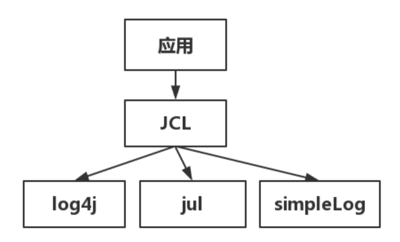

# 日志

常见的日志框架组合是 Slf4j + Logback(or Log4j)

应用中的扩展日志(如打点、临时监控、访问日志等)命名方式: appName_logType_logName.log。

## slf4j


```java
private static final Logger logger = LoggerFactory.getLogger(Test.class);
logger.debug("Processing trade with id: {} and symbol: {}", id, symbol);
logger.error(各类参数或者对象 toString() + "_" + e.getMessage(), e);
```

[优雅的使用slf4j（排除其他日志框架的干扰）](https://www.jianshu.com/p/7b5860be190f)

[Slf4j 官网：使用手册](http://www.slf4j.org/manual.html)


## Log4j

log4j.xml

```xml
<!-- 避免重复打印日志 -->
<logger name="com.taobao.dubbo.config" additivity="false">
```


## 桥接器

要使得jul-to-slf4j生效，需要执行

```java
SLF4JBridgeHandler.removeHandlersForRootLogger();
SLF4JBridgeHandler.install();
```

spring boot 中的日志初始化模块已经包括了该逻辑，故无需手动调用。


日志框架发展

有多套日志框架，API完全不同。

JCL(Jakarta Commons Logging) 只提供 log 接口，在运行时动态查找框架，调用框架的API




Log4j

## 参考资料

[Java日志体系](https://www.cnblogs.com/xiang--liu/p/11856203.html)

[Log4j 官方文档](https://logging.apache.org/log4j/2.x/)