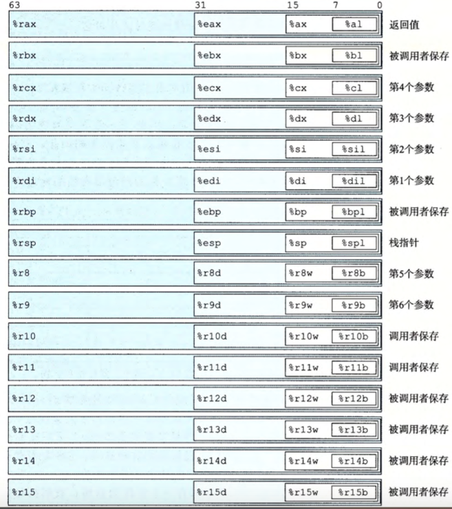
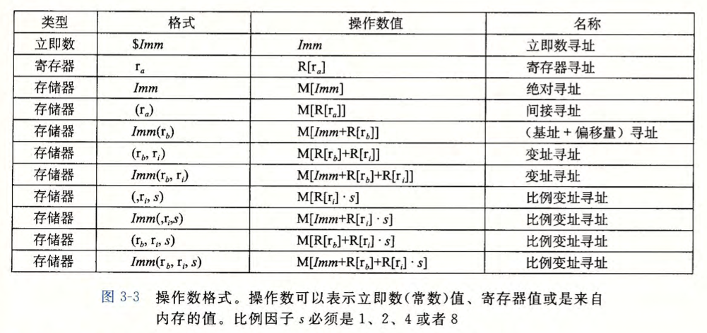
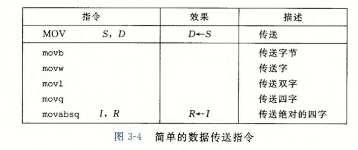
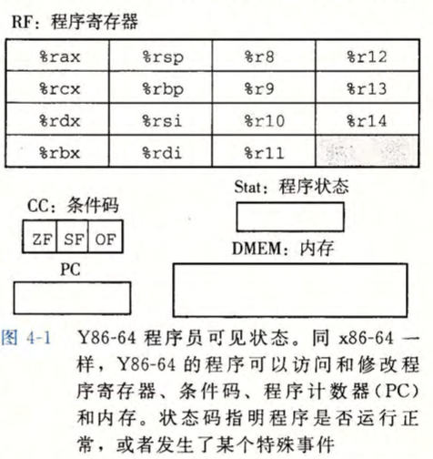

# 深入理解计算机系统

## 程序结构和执行

### 程序的机器级表示

将 c 源代码转换成可执行代码时，gcc编译器的执行步骤

`linux> gcc -Og -o p p1.c p2.c`

- C预处理器扩展源代码，插入所有 `#include` 命令指定的文件，扩展所有用 `#define` 声明指定的宏。
- 编译器产生两个源文件的汇编代码，分别为 p1.s p2.s
- 汇编器将汇编代码转化成二进制 目标代码 文件 p1.o p2.o。目标代码是机器代码的一种形式，它包含所有指令的二进制表示，但是还没有填入全局值的地址。
- 链接器将两个目标代码文件与实现库函数（如printf）的代码合并，并产生最终可执行文件p

```sh
# 只生成汇编文件 p1.s
gcc -Og -S p1.c
# 产生目标代码文件 p1.o
gcc -Og -c p1.c
# 反汇编目标代码文件
objdump -d p1.o
```

机器执行的程序只是一个字节序列，它是对一系列执行的编码。



指令操作数的类型

1. 立即数
2. 寄存器内存储的值
3. 内存中存储的值

内存中的值的寻址模式： Imm(rb, ri, s)；  Imm 立即数偏移； rb 基址寄存器； ri 变址寄存器； s 比例因子。
有效地址 = `Imm + R[rb] + R[ri] * s`





## 处理器体系结构

指令体系结构(ISA, Instruction-Set Architecture)：一个处理器支持的指令和指令的字节级编码。

假如一个指令可以分解成5个阶段，则处理器流水线可以同时执行5条指令的不同阶段。

冒险：一条指令的位置或操作数依赖于其他仍在流水线中的指令。

rainy：为什么RISC会比CISC 成本低，功耗低？



条件码：

zero flag
overflow flag

CF：进位标志。最近的操作使最高位产生了进位。可用来检查无符号操作的溢出。

ZF：零标志。最近的操作得出的结果为0.

SF：符号标志。最近的操作得到的结果为负数

OF：溢出标志。最近的操作导致一个补码溢出——正溢出或负溢出。