# 网络协议

各层协议

    应用层：DHCP HTTP HTTPS RTMP P2P DNS GTP RPC
    传输层：UDP TCP
    网络层：ICMP IP OSPF BGP IPSec GRE
    链路层：ARP VLAN STP
    物理层：网络跳线

网络传输以包为单位。二层叫帧，三层叫包，四层叫段。

二层设备：只把MAC头摘下来，看看是丢弃、转发还是自己留着。

三层设备：把MAC头摘下后，再把IP头摘下，看看到底是丢弃、转发还是留着。

```sh
# 查看ip地址
# linux 
ip addr   # iproute2
ifconfig  # net-tools
# windows
ipconfig
```

ip addr 结果解析

```
1: lo: <LOOPBACK,UP,LOWER_UP> mtu 65536 qdisc noqueue state UNKNOWN group default qlen 1000
    link/loopback 00:00:00:00:00:00 brd 00:00:00:00:00:00
    inet 127.0.0.1/8 scope host lo
       valid_lft forever preferred_lft forever
    inet6 ::1/128 scope host 
       valid_lft forever preferred_lft forever
```

`lo`: loopback 回环口

`<UP,LOOPBACK,RUNNING,MULTICAST>`: net_device flags 网络设备的状态标识

    UP：表示网卡处于启动状态
    LOOPBACK：表示环回口
    MULTICAST：表示支持多播
    BROADCAST：表示支持广播
    LOWER_UP：表示L1启动，即插着网线

`mtu 16384`: mtu 最大传输单元，是二层MAC层的概念，如果正文放不下，就分片传输

`qdisk pfifo_fast`: qdis 全称 queueing discipline 排队规则

    pfifo 即先进先出（队列）
    pfifo_fast 也是队列，分3队，每队的优先级不同，先处理优先级高的

无类型域间选路（cidr）

ip地址分类

|类别|ip地址范围|最大主机数|私有ip地址范围|
|---|---|---|---|---|
|A|0.0.0.0-127.255.255.255|16777214|10.0.0.0-10.255.255.255|
|B|128.0.0.0-191.255.255.255|65534|172.16.0.0-172.31.255.255|
|C|192.0.0.0-223.255.255.255|254|192.168.0.0-192.168..255.255|

配置网卡

```sh
# 配地址
sudo ifconfig eh1 10.0.0.1/24
# 启动网卡
sudo ifconfig eth1 up

sudo ip addr add 10.0.0.1/24 dev eth1
sudo ip link set up eth1
```

Linux会先判断目的ip和源ip是否是同一个网段，是的话再发ARP请求，获取MAC地址；如果不在同一个网段，则linux会获取网关的MAC地址，把包发到网关。

## DHCP 协议

动态主机配置协议 Dynamic Host Configuration Protocol

从共享IP地址里，给网络里的主机配置ip地址。

办公网络，每次主机重启，都会用 DHCP 从地址池里分ip。数据中心里的服务器，则是固定IP。

DHCP 工作方式

    DHCP discover： 新机器使用 0.0.0.0 发广播包，向DHCP server申请ip
    DHCP offer： DHCP server发广播包，给新机器一个ip（因为新机器还没有ip。如果是老机器伪装新机器，通过mac可以识别）
    DHCP request： 新机器可能收到多个 DHCP 的offer，选择一个发request，表示接受ip。还是广播包
    DHCP ACK： 目标DHCP收到后，表示接收新机器，然后将ip地址的租用信息和配置信息都放入广播包，发给新机器。

报文格式

```
| MAC头 | IP头 | UDP头 | BOOTIP头 | 请求内容 |
```

IP回收or续租：客户机在租期过去50%的时候，向 DHCP server 发送 DHCP request 消息包，DHCP server 发送 DHCP ACK。客户机根据 ack 包更新自己的配置信息。

预启动执行环境（PXE, pre-boot Execution Environment）

能帮数据中心中的主机自动安装操作系统。

BIOS 工作原理

1. 加载BIOS（一个特别小的系统）
2. BIOS读取硬盘的MBR启动扇区，将GRUB启动起来
3. 权利交给 GRUB，GRUB 架子内核，加载作为根文件系统的 initramfs 文件
4. 权利交给内核，内核启动，初始化整个操作系统

PXE 协议分为客户端和服务器端。

1. 客户端放在BIOS里，计算机启动时，BIOS把客户端调入内存
2. 客户端发送 DHCP 请求，获得一个ip地址，获得 PXE 服务器的ip和初始启动文件名(DHCP 的next-server就是PXE的服务器地址，filename是PXE的初始（操作系统的）启动文件，客户端需要下载这个文件)
3. 客户端去PXE服务器下载这个文件（使用TFTP协议）。
4. 客户端执行这个文件。这个文件会指示客户端向 TFTP 服务器请求计算机的配置信息 pxelinux.cfg，文件里有内核、 initramfs 在哪儿的信息。
5. 客户端获得内核文件，启动 linux 内核

DHCP Server 配置示例

```
ddns-update-style interim;
ignore client-updates;
allow booting;
allow bootp;
subnet 192.168.1.0 netmask 255.255.255.0
{
  option routers 192.168.1.1
  option subnet-mask 255.255.255.0
  option time-offset -18000;
  default-lease-time 21600;
  max-lease-time 43200;
  range dynamic-bootp 192.168.1.240 192.168.1.1250;
  filename "pxelinux.0";
  next-server 192.168.1.180;
}
```

## 第一层（物理层）

## 二层（数据链路层）

有两台没有网络的电脑，把他们的网卡连在一起，配置成同一个网段，它们俩就组成 lan（局域网）了，就可以通信了

有3台电脑，可以用hub，电脑都接到hub上，然后配置成同一个网段，它们就可以通信了。

但是hub是广播的，会把某端口收到的包，复制到所有其他端口上。如果在一条路上，同时有多个端口在发送数据，数据该怎么样才不会发生混乱？

二层 MAC 层用来解决这个问题

MAC: Medium Access Control 媒体访问控制。控制在媒体上发送数据的时候，谁先发，谁后发，防止发生混乱。

有3种方式

1. 信道划分：分车道，每个人都不同的车道
2. 轮流协作：一会儿你发，一会儿我发
3. 随机接入协议：我先发，发现堵塞了，我就等一会儿再发

MAC 层网络报的格式

```
| 目标MAC | 源MAC | 类型 | 数据 | CRC
```

类型：上层协议是什么，比如 IP(0800) ARP(0806)

CRC：循环冗余检测。用来检查报文在传出过程中，有没有产生错误

ARP 协议报文内容

```
| ff:ff:ff:ff:ff:ff（目的MAC） | 源MAC | 0806（类型） | 硬件类型 | 协议类型 | 硬件地址长度 | 协议地址长度 | 操作代码 | 发送者 MAC | 发送者 IP | 目标MAC | 目标IP |
|------------------- MAC 头------------------------|--------------------------------------------------------- ARP报文 --------------------------|
```

交换机有转发表，能够学习去往某个MAC地址，需要从哪个端口出。在目的MAC明确的情况下，就不用像hub一样，所有端口都转发数据了。但因为网络结构在变化，所以交换机的转发表里的表项，是有过期时间的。

### STP

目标：解决二层环路问题

对照数据结构中的算法，是最小生成树。将一个图变成树。

Root Bridge: 根交换机。

Designated Bridge: 指定交换机。是根交换机的“小弟”，通过它连接到根交换机。

Bridge Protocol Data Units(BPDU): 网桥协议数据单元。只有根交换机能发。

Priority Vector: 优先级向量。[Root Bridge ID, Root Path Cost, Bridge ID, Port ID]。值越小越优先。

工作过程（重看）

1. 刚开始，所有人都是根交换机，每个人都有一个ID。
2. 然后互相发 BPDU，输的人当小弟。
3. 根交换机相遇，输的人当小弟
4. 有2条路径到小弟，离掌门近的路被采纳
5. 

### 二层网络隔离

当办公室的网络越来越大，不同的部门需要自己的网络时，就需要把不同的网络隔离开。

虚拟隔离，VLAN 虚拟局域网。

报文格式

```
| 目标MAC | 源MAC | 801.1QTag | 类型 | 数据 |
                      |
-----------------------------------------
| 类型 | 优先级 | 规范格式 | VLAN-ID（12位） |
```

把交换机的某端口，放到某 vlan 中，那和这个口相连的主机，就加入了这个vlan，也只能和这个vlan里的主机通信。

交换机之间相连的口，可以设置成Trunk口，它可以转发任何vlan的数据。

## 三层（网络层）

### ICMP

ping 是基于ICMP协议工作的，ICMP Internet Control Message Protocol 互联网控制报文协议

ICMP报文封装在IP包里

报文格式

```
| IP头 | ICMP报文 |
            |
-------------------------------------------------------
| 类型 | 代码（8位） | 校验和（6位） | 根据类型和代码不同而不同 |
                                | 标识位(16) | 序号(16) | 数据 |
                                | 标识位(16) | unused(16) | IP 头 | 正文（8B) |
```

查询报文类型

ping 使用的就是主动请求查询报文(类型8)，并获得主动应答的icmp报文(类型0)

差错报文类型

1. 终点不可达(类型3)
    1. 网络不可达(代码0)：找不到地方
    2. 主机不可达(代码1)：找到网络了，但没找到主机
    3. 协议不可达(代码2)：主机上没这个协议
    4. 端口不可达(代码3)：主机上没应用监听这个端口
    5. 需要分片但设置了不分片(代码4)
2. 源抑制(类型4)
3. 时间超时(类型11)
4. 路由重定向(类型5)

在节点上 `tcpdump -i eth0 icmp` 查看包有没有到达某个点

traceroute 使用的差错报文类型，通过获得ICMP应答的差错报文，来得到想要的信息

traceroute 作用

1. 故意设置特殊的TTL，来追踪去往目的地时沿途经过的路由器
2. 故意设置不分片，从而确定路径的MTU

### 静态路由

网关和路由器的关系：路由器是一台设备，它有5个网口或网卡，分别连着5个局域网。每个网卡的IP地址和局域网的IP地址在相同的网段，每个网卡就是它所在局域网的网关。

静态路由：在路由器上配置的一条一条规则。指明了去往某个地址，要从哪个出口出，下一跳是哪个网段。

转发网关：转发时，不改变源IP地址。

NAT(Network Address Translation)网关：转发时，改变源IP地址。
  - 静态NAT：公网ip对应一个私网ip，不能节省公网ip
  - 动态NAT：多个公网ip对应多个私网ip，不能节省公网ip
  - PAT端口多路复用：一个公网ip对应多个私网ip，可以节省公网ip。原理：改变数据包的源ip和源端口号。

rainy：SNAT和DNAT原理是什么？

#### 配置路由

```sh
# 添加路由表
echo 200 rainy >> cat /etc/iproute2/rt_tables

# 配置路由的查找规则
# 源地址是 10.0.0.0/24 则查路由表 10
ip rule add from 10.0.0.0/24 table 10
# 查看rule
ip rule ls

# 路由规则
# 10.1.1.0/24 目的地址 10.1.1.1 下一跳 eth0 出接口
ip route add 10.1.1.0/24 via 10.1.1.1 dev eth0
# 等价路由，下一跳是2个地址：100.100.100.1 200.200.200.1，权重分别是1和2
ip route add default scope global nexthop via 100.100.100.1 weight 1 nexthop via 200.200.200.1 weight 2
# rainy路由表中添加默认路由
ip route add default via 192.168.1.1 dev eth0 table rainy
ip route flush cache

# 查看路由表里的路由
ip route list table main
# 1.1.1.0/24 dev eth1 proto kernel scope link src 1.1.1.1
# default via 1.1.1.1 dev eth1
```

### 动态路由

求最短路径的方法：

- Bellman-Ford 算法：源点到自己为0，其他点到源点是无穷大。迭代：找到不超过1条边的最短路，不超过2条边，……。最多迭代到边的个数次。
- Dijkstra 算法：对图G(V, E)设置集合S，存放已被访问的顶点，然后每次从集合V-S中选择与起点s的最短距离最小的一个顶点(记为u)，访问并加入集合S。之后，令顶点u为中介点，优化起点s与所有从u能到达的顶点v之间的最短距离。这样的操作执行n次(n为顶点个数)，直到集合S已包含所有顶点。

- 距离矢量路由算法

基于 Bellman-Ford 算法。

每个路由器每隔一段时间都把自己所知的到达所有路由器的距离告知邻居。最后每个路由器都知道全局信息。

特点：好消息传的快，坏消息传的慢。每次发送时要发送整个路由表。

- 链路状态路由算法

基于 Dijkstra 算法。

当一个路由启动时，先发现邻居，邻居回复后，则知道和邻居的距离。将自己和邻居的链路状态广播出去，发送到整个网络的路由器。每个路由器在本地构建一个完整的图，然后使用 Dijkstra 算法，找到两点间的最短路径。

- OSPF(Open Shortest Path First)：基于链路状态路由算法

广泛应用在数据中心的协议，因而成为内部网关协议(Interior Gateway Protocol, IGP)

- BGP(Border Gateway Protocol): 基于距离矢量路由算法。

自治系统(AS, Autonomous System)

1. Stub AS: 对外只有一个连接。这类AS不会传输其他AS的包。
2. Multihomed AS: 可能有多个连接到其他AS，但拒绝帮其他AS传输包。比如大公司的网络。
3. Transit AS: 有多个连接到其他AS，并且帮其他AS传输包。如主干网。

每个自治系统都有边界路由器，通过它和外面世界建立联系。

BGP 分为 eBGP 和 iBGP。边界路由器之间使用eBGP广播路由，内部网络的路由器与边界路由器之间运行iBGP，使得内部的路由器能够找到到达外网目的地的最好的边界路由器。

在BGP中，除了下一跳，还包括了自治系统 AS 的路径。

## 四层（传输层）

建立连接，是为了在客户端和服务端维护连接，而建立一定的数据结构来维护双方交互的状态，用这样的数据结构来保证面向连接的特性。

TCP

- 面向连接
- 提供可靠交付
- 面向字节流。没头没尾，有可能不是完整信息。
- 有拥塞控制。会根据网络情况控制自己的发送速度。
- 有状态。知道哪些发送了，哪些已接收

```
| 源端口号(16) | 目的端口号(16) | 序号(32) | 确认序号(32) | 首部长度(4) | 保留(6) | URG | ACK | PSH | RST | SYN | FIN | 窗口大小(16) | 校验和(16) | 紧急指针(16) | 选项 | 数据 |
```

TCP 三次握手

```
-------------------------------------------
客户端                                  服务端
syn_send(SYN,seq=x)
                                       syn_rcvd(SYN,seq=y,ack=x+1)
established(ACK,seq=x+1,ack=y+1)
                                       established
```

TCP 四次挥手

```
-------------------------------------------
客户端                                  服务端
established(FIN,seq=p)
fin_wait_1
                                       established(ACK,ack=p+1)
                                       closed_wait
fin_wait_1
fin_wait_2
                                       closed_wait(FIN,ACK,seq=q,ack=p+1)
                                       last_ack
fin_wait_2(ACK,ack=q+1)
time_wait 2MSL
                                       last_ack
                                       closed
closed
```

MSL: Maximum Segment Lifetime，报文最大生存时间

流量控制

UDP

- 无连接
- 尽最大可能交付
- 基于数据报，一个个发，一个个收。
- 没有拥塞控制。
- 无状态。

```
| 源端口号(16) | 目的端口号(16) | UDP 长度(16) | UDP 校验和(16) | 数据 |
```

应用场景

- QUIC(Quick UDP Internet Connections, 快速 UDP 互联网连接)：在应用层自己实现快速连接建立，减少重传时延，自适应拥塞控制。
- 流媒体协议：比如直播场景
- 实时游戏
- 物联网
- 移动通信: GTP-U 协议基于 UDP

### socket

```sh
# ipv4
AF_INET
# ipv6
AF_INET6
# TCP
SOCKET_STREAM
# UDP
SOCKET_DGRAM
```

socket建立过程

```
---------------------------------------------------------
服务端                                            客户端
socket:                                          socket:
bind:   监听ip:port
(创建监听Socket)
listen:
(有2个连接队列，一个已处于established的，一个syn_rcvd的)
                                                 connect:   要连接ip:port，随机分配客户端端口
accept:
(连接成功后返回 已连接Socket，并处理established的连接)
                                                 write:
read:
write:                                           read:
```

TCP 的 Socket 就是一个文件，有对应的文件描述符。

每个进程有一个数据结构 task_struct，里面指向一个文件描述符数组，列出了这个进程打开的所有文件的文件描述符。文件描述符是一个数组下标，这个数组里有内核中所有打开的文件。

通过 ulimit 配置文件描述符的数目

```
task_struct  ------  List(进程打开的文件)          List(内核中所有打开的文件)        in-core inode
                     文件描述符1(是数组下标) -----  文件指针1(Socket文件的地址) ----- socket文件
                     文件描述符2

socket 文件结构 ---- sk_write_queue(里面是数据包)
              ---- sk_receive_queue
```

UDP

```
socket建立过程
---------------------------------------------------------
服务端                                            客户端
socket:                                          socket:
bind:   监听ip:port
(创建监听Socket)
                                                 sendto:
recvfrom:
sendto:                                          recvfrom:
```

多进程 do_fork 多线程 pthread_create 

IO多路复用（一个线程维护多个Socket，一个Socket变化了，就遍历所有Socket找到变化的那个，Socket存放在fd_set中）

IO多路复用（一个线程维护多个Socket，一个Socket变化了，就通知线程来处理它。用epoll实现）

比如：进程打开了Socket m,n,x 等多个文件描述符，需要通过epoll来监听这些Socket是否有事件发生。其中epoll_create创建一个epoll对象，也是一个文件，也有一个文件描述符。在这个文件里，有一个红黑树，保存了epoll要监听的所有Socket。当epoll_ctl添加一个Socket时，这个Socket就加入了这个红黑树。被监听的Socket，可以调用call_back通知epoll。

## 七层（应用层）

### HTTP 协议

请求行
请求头
请求体

请求头

Cache-control 来控制缓存，当客户端发送的请求中包含max-age指令时，如果判定缓存层中，资源的缓存时间数值比指定时间的数值小，那么客户端可以接受缓存的资源；当指定max-age值为0，那么缓存层就需要将请求转发给应用集群。

If-Modified-Since 也是关于缓存的。如果服务器的资源在某个时间之后更新了，那么客户端就应该下载最新的资源；如果没有更新，服务端会返回 304 Not Modified 的响应，客户端就不用下载了。

响应行
响应头
响应体

响应头

Retry-After 告诉客户端应该在多长时间后再尝试一次。通常此时响应码为503，表示服务暂时不再和这个值配合使用

### HTTP 2.0

- 对http的头进行一定的压缩，将原来每次都要携带的大量key value 在两端建立一个索引表，对相同的头只发送索引表中的索引。
- 将一个TCP的连接中，切分成多个流，每个流都有自己的ID，而且流可以是客户端发往服务端，也可以服务端发往客户端。它其实是一个虚拟的通道。流有优先级。
- 能够并发发送请求。将传输的信息分割成为更小的信息和帧，并对它们二进制编码。Header帧用于传输Header内容，并开启一个新的流。Data帧用于传输正文，多个Data帧属于同一个流。

比如，页面同时发送3个请求，分别用于获取css，js，jpg。使用HTTP2.0，就可以在一个连接里，有这3个请求的分片，服务器可以同时获得这3个请求的信息。而HTTP1.1，则只能先获得css的请求，响应完之后再获得js的请求。

### QUIC 协议

应用层协议，Quick UDP Internet Connection，基于UDP协议，在应用层自定义了重传机制。

- 自定义连接机制：使用64位的ID来标识连接，而不是源和目的IP和端口（TCP的四元组）
- 自定义重传机制：
    - TCP 自适应重传算法，超时时间使用 “采样往返时间RTT”。但响应包有可能是第一次发的响应包，也可能是第二次重传发的响应包，RTT计算不准确。
    - QUIC 也采用往返时间作为超时时间，但每个包的序号是唯一的（第一次发的和重传发的包序号不一样），包的顺序使用offset来保证（相当于TCP的序号）。如果offset相同，则表示传的同一个包。
- 无阻塞的多路复用：一条QUIC连接可以创建多个Stream
- 自定义流量控制：
    - TCP 流量控制通过 “滑动窗口协议”，拥塞窗口和接收窗口
    - QUIC 流量控制通过 window_update，告诉对端它可以接受的字节数，可以在连接中的每个Stream控制窗口。窗口的起始位置为当前接收到的最大offset，从这个offset到当前stream所能容纳的最大缓存，是窗口的大小。

```
TCP 窗口
接收已确认          等待接收未确认                    不能接收
|----------|      |-------|                      |        
--------------------------------------------------
           |-------- 窗口大小 ---------------------|

QUIC 窗口
接收已确认    已发送待接收   接收已确认   等待接收，可发   不能接收
|----------|            |-------|                |        
--------------------------------------------------
                                |---- 窗口大小 ----|
```

### HTTPS

对称加密：加密和解密使用的秘钥一样。效率高
非对称加密：非公钥和私钥，公钥加密，私钥解密。

客户端和服务器，都要有自己的公钥和私钥。

```
客户端                         服务器
服务器公钥加密“我要点外卖”
                              服务器私钥解密
                              客户端公钥加密“给银行卡和密码”
客户端私钥解密
服务器公钥加密“我的银行卡是xxx”
                              服务器私钥解密
                              ……
```

问：客户端怎么拿到服务器的公钥？

答：1. 通过某个网站获取，服务器会把公钥发布在网站上。2. 在客户端和服务器建立连接时，将公钥发给客户端。

问：拿到公钥后，怎么验证这个公钥是服务器的，而不是黑客的？

答：需要CA颁发的证书

每个人都能创建自己的公钥和私钥

```sh
# 创建私钥
openssl genrsa -out mypriate.key 1024
# 创建私钥对应的公钥
openssl rsa -in mypriate.key -pubout -out mypublic.pem
```

由权威机构 CA(Certificate Authority) 来颁发证书 Certificate，证明公钥的所有者是谁

证书里的内容

- 公钥
- 公钥所有者
- 证书有效期

生成证书过程

```sh
# 生成证书请求
openssl req -key myprivate.key -new -out mycertificate.req 
# CA 用自己的私钥，给证书签名
    # 对信息做一个Hash计算，得到一个Hash值(不可逆，无法通过Hash值得到原来的信息)
    # 把Hash值用CA私钥加密，作为签名和信息一起发出去
# mycertificate.pem 签过名的证书
openssl x509 -req -in mycertificate.req -CA cacertificate.pem -CAkey caprivate.key -out mycertificate.pem
# 查看证书内容
openssl x509 -in mycertificate.pem -noout -text
# Issuer 证书谁颁发的
# Subject 证书颁发给谁
# Validity 证书有效期
# Public-key 公钥内容
# Signature Algorithm 签名算法
```

更详细的过程见：https://www.cnblogs.com/f-ck-need-u/p/7113610.html

```
客户端                              服务器
                                   给客户端自己的证书
用证书里的CA机构的公钥解密签名，查看解密出的hash值，和自己计算出的hash值是否一致
```

CA的证书的有效性，需要CA的上级CA来保证，层层上升，直到上升到几大著名CA，成为rootCA，作为最后的背书。

非对称加密加密对称加密秘钥，对称加密加密信息

HTTPS 加密过程

```
客户端                                                服务器
你好，我的加密方式是：随机数+"Client Hello"
                                                     你好，我的加密方式是：随机数+"Server Hello"
                                                     这是我的证书（Server Certificate）
                                                     我就这些信息了（Server Hello Done）
这是我的证书(Client Certificate)
产生随机数 pre-master，并用服务端公钥加密
计算出对称秘钥：客户端随机数+服务端随机数+pre-master        计算出对称秘钥：客户端随机数+服务端随机数+pre-master
以后使用对称秘钥传输
先将商量过的参数，加密传输试试
                                                    好的，使用对称加密
                                                    先将商量过的参数，加密传输试试
                    ----------- 加密通信 -------------
```

重放与篡改

使用 Timestamp 和 Nonce 随机数联合起来，做一个不可逆的签名。服务端多次收到相同的Timestamp和Nonce，则视为无效。

### 流媒体协议

视频是一张张图片组成的，每秒播放的图片就叫 帧率（FPS）

每一张图片，都是由像素组成的，每个像素，都是由RBG组成的，每个8位，共24位。

将视频压缩（视频编码）后，才有传输的可能。视频和图片的压缩，利用的是图片的：空间冗余、时间冗余、视觉冗余、编码冗余。

编码过程

```
帧内预测（去除空间冗余） --》 帧间预测（去除时间冗余） --》 变换 （去除空间冗余） --》 量化（去除视觉冗余，通过降低图像质量提高压缩比） --》 熵编码（去除编码冗余，变长编码）
```

视频编码的2大流派

- VCEG (Video Coding Experts Group) from ITU (International Telecommunications Union)
- MPEG (Moving Picture Experts Group) from ISO (International Standards Organization)

两大流派联合制定了标准 H.264/MPEG-4 AVC 

视频流传输过程

```
主播端                       服务器                       观众
采样 -> 编码 -> 推流    ->    接流 -> 流处理 -> 分发   ->    拉流 -> 解码 -> 播放
                   RTMP协议
```

视频序列分成3种帧

- I帧，关键帧。里面是完整的图片
- P帧，向前预测编码帧。表示这一帧和前面一个帧的差别，需要结合前面的帧才能生成最终画面。
- B帧，双向预测内插编码帧。记录的是本帧与前后帧的差别。需要前后画面的数据与本帧叠加，取得最终画面。

压缩后帧的序列，应该在IBBP的间隔出现，这就是通过时序进行编码。

帧会再进行拆分，方便空间上的编码

- 视频
    - 帧
        - 片
            - 宏块
                - 子块

NALU（网络提取层单元, Network Abstraction Layer Unit): 方便在网络上传输

```
| 00 00 00 01 | NALU Header | NALU Payload |
               -------------
                     |
--------------------------------------------
|                    |                     |
类型 0x07        类型 0x80          类型 0x01/0x05
SPS 参数序列集    PPS 图像参数集       I/P/B 帧
```

SPS 图像序列的所有信息，如图像尺寸、视频格式
PPS 图像的所有分片信息，如图像类型、序列号

为了保证容错性，每个I帧前面都会传一遍这2个参数。

RTMP 协议
基于TCP协议，在TCP连接的基础上，还要建立一个RTMP的连接，来保证传输。
RTMP连接里，协商客户端和服务器的版本号、时间戳

```
客户端                服务器
Uninitialized        Uninitialized
C0(版本号)
C1(时间戳)
version send
                     S0(C0收到后，发版本号)
                     version send
                     S1(时间戳)
                     S2(时间戳应答)
                     ack send
C2(时间戳应答)
ack send
handshake done       handshake done
```

推流的过程，就是将 NALU 放在Message（RTMP Packet包）里发送

RTMP 在收发数据时，需要把Message拆分成Chunk发送，每个Chunk中都有Message ID

### 文件传输

FTP 协议

- 控制连接：服务器打开21端口，等待客户端发起连接
- 数据连接：每当一个文件在客户端和服务器之间传输时，就创建一个数据连接

工作模式（站在服务器视角）

- 主动模式 PORT: 客户端端口N向服务器21端口发起连接，并开放N+1端口；服务端20端口主动向N+1端口发送文件
- 被动模式 PASV: 客户端端口N向服务器21端口发起连接，提交PASV命令；服务器任意端口P，向客户端返回开放端口P的信息，客户端端口N+1连到服务器的P端口，然后传输数据。

P2P 协议

peer to peer 下载文件后，就变成了服务器，别人可以从中心侧服务器下载，也可以在你这里下载。你在下载时，既有下载的流量，又有上传的流量。

怎么知道这个文件都有哪些peer呢？

种子（.torrent）文件

有2部分组成

- announce（tracker URL）
- 文件信息
    - info 区：该种子有几个文件，文件有多长，目录结构，目录和文件的名字
    - name字段：指定顶层目录的名字
    - 每个段的大小：BitTorrent协议把一个文件分成多个小段，默认是4M，然后分段下载
    - 段哈希值：整个种子中，每个段的SHA-1哈希值拼在一起。用来确认段是不是下载对了。

文件下载过程

```
下载者                 其他下载者1               tracker服务器
从torrent中拿到tracker URL连接tracker服务器
                                              提供可下载的IP
连接ip，告知自己有的块
                      告知有的块，互相交换
```

去中心化网络（DHT）

Distributed Hash Table，每个加入DHT网络的人，都负责存储这个网络里的资源信息和其他成员的联系信息，所有人都成了一个庞大的分布式数据库。

Kademlia 协议

BitTorrent 启动后，有2个角色

- Peer 监听TCP端口，用来上传和下载文件
- DHT node 监听UDP端口，加入了DHT网络
    - ID：和哈希值相同长度的串
    - 文件索引：文件保存在了哪里。不是全量的，根据Hash算法获得自己需要知道的文件的索引
    - node list：不是全量的

每个文件能计算出一个hash值。ID是这个hash值的 DHT node 和相近的N个node（距离=两个ID的异或的值），有责任知道从哪儿下载这个文件，可能本身并没有存这个文件。

Torrent 文件里，不再有 tracker URL，而是DHT node list

DHT网络就像一个朋友圈，如果一个node找不到目标文件的node，就会在朋友圈里问。

每个节点只有4个指令

- PING: 测试一个节点是否在线
- STORE: 要求一个节点存储一份数据
- FIND_NODE: 根据节点ID查找一个节点
- FIND_VALUE: 根据文件 key，找到数据

节点的node list里，有多个bucket，根据距离不同，分布在不同bucket里。比如A和B的倒数第i位首先不同，则B在A的k-bucket i里

## 数据中心

### DNS 协议

DNS 服务器，一定要设置成高可用、高并发、分布式的

DNS服务器的树状结构

- 根DNS服务器：返回顶级域DNS服务的ip地址
- 顶级域DNS服务器：返回权威DNS服务器的ip地址
- 权威DNS服务器：返回相应主机的ip地址

```
                     根DNS
                       |
-------------------------------------------
|              |             |            |
.com          .cn          .net           ……
|              |             |
163.com     google.cn      csdn.net
```

DNS 解析流程

0. 本地DNS解析器，查看本地DNS缓存（/etc/hosts）。有，则直接使用缓存；否则发出DNS请求
1. 发出DNS请求，问 www.163.com 的ip，发给本地域名服务器（本地DNS）。如果通过DHCP配置，本地DNS由你的网络服务商（ISP）如电信、移动等自动分配，通常在你网络服务商的某个机房。
2. 本地DNS，如果有域名和ip的对应关系（缓存），就返回ip；否则，就去根域名服务器问
3. 根DNS告诉本地DNS，.com顶级域DNS服务器的ip。本地DNS去问顶级DNS
4. 顶级域DNS服务器告诉本地DNS，163.com的权威DNS服务器ip。本地DNS去问权威DNS
5. 权威DNS服务器告诉本地DNS，www.163.com 对应的ip
6. 本地DNS将ip返回客户端

负载均衡

- 内部负载均衡。一个域名对应多个ip
- 全局负载均衡。上海用户访问上海数据中心，北京的访问北京数据中心。

增加了GSLB（Global Server Load Balance）后的解析过程

0-4步相同

5. （一层GSLB）权威DNS服务器查看本地DNS服务器所在的运营商，将运营商的GSLB域名 www.vip.163.com (任意取名) 以 cname 的方式告诉本地DNS，本地DNS去问GSLB
6. （二层GSLB）GSLB查看了本地DNS的ip所在的位置，将距离较近的2个SLB(内部负载均衡，Server Load Balancer)的ip告诉了本地DNS。
7. 本地DNS将ip返回客户端，客户端任选一个访问。

### httpDNS

本地 DNS 服务器的问题

- 域名缓存问题：本地缓存，当服务器换地址时，会失效；可能会让负载均衡失效，因为负载均衡后，2次返回的ip可能不同。
- 域名转发问题：当A运营商委托B运营商去解析域名时，DNS可能会返回一个离B近的ip，而不是离A近的。
- 出口NAT问题：NAT后的地址，会让权威DNS误判地址的运营商，导致跨运营商访问。
- 域名更新问题：比如跨机房的容灾，当机房出问题后，需要修改权威DNS，将域名指向新的ip，如果生效慢，就会出现访问异常。
- 解析延迟问题：DNS的查询时间长

httpDNS

基于HTTP协议，自己做自己的DNS服务器集群，分布在多个地点和运营商，绕过传统的DNS域名解析过程。需要使用HttpDNS的客户端

rainy：相当于另起炉灶自己做一套本地DNS服务器。可以更自由的管理自己发布的域名。

域名解析过程

0. 客户端的SDK动态请求服务器，获取httpDNS服务器的ip列表，缓存到本地
1. 访问域名，本地有缓存，就直接返回；没有，就请求HttpDNS的服务器，在ip列表中选择一个发出HTTP请求，返回域名的ip列表，并缓存到本地。

访问请求

```sh
curl http://10.xx.xx.xx/d?dn=c.m.163.com
{"dns":[{"host":"c.m.163.com", "ips":["2.2.2.2"], "ttl":300, "http2":0}], "client":{"ip":"10.x.x.x", "line":123456}}
```

架构对比

```
应用架构                 httpDNS
---------------------------------
Tomcat（应用）           客户端SDK
Redis（缓存）            本地缓存
MySQL（数据库）          httpDNS服务器
```

httpDNS 缓存设计

问题点：缓存过期、更新、不一致

1. 缓存持久化：app重启时可以从硬盘获取缓存，不用全部重新解析
2. 严格执行缓存的过期时间：过期缓存不允许使用
3. 解析可以同步进行（Cache-Aside机制），也可以异步进行（在缓存即将过期时，就去重新解析）

### CDN

类似电商的分布式仓储系统，分为中心节点、区域节点、边缘节点，而数据缓存在离用户最近的位置

添加 CDN 后的域名解析过程

0-4步相同

5. 权威DNS服务器返回 CNAME 记录，指向CDN的权威DNS服务器
6. CDN的权威DNS服务器，返回 CNAME 指向CDN网络的全局负载均衡器
7. CDN负载均衡器根据用户信息，如：ip、运营商、请求内容等，综合选择，返回一台最适合的服务器ip
8. 本地DNS使用这个ip，到边缘服务器请求，如果边缘服务器没有，就向上级服务器一层一层请求。

防盗链

目标：只有公司A的服务器才能请求公司A的内容，其他服务器请求不了。

- 使用referer机制。即请求时，在请求头的referer字段中，加上请求来源。缺点：容易被破解
- 时间戳防盗链。
    - 和CDN厂商约定一个加密字符串。
    - 客户端使用当前时间戳+要访问资源路径+加密字符串，进行签名得到一个字符串，生成一个下载链接并带上签名+截止时间戳，去访问CND。
    - CDN使用时间戳+资源+加密字符串算签名，并和链接中的签名比对，签名一致才提供服务

动态 CDN

目标：缓存动态内容

- 生鲜超市模式：边缘计算模式。将数据传输到边缘节点，边缘节点计算出最终结果。
- 冷链运输模式：路径优化模式。找到一个离源和用户，都比较近的节点，不走公网，走CDN的网络，比如通过专线访问；使用大的TCP窗口；多个请求复用一个链接。

### 数据中心

- 数据中心的入口和出口，也是路由器，叫边界路由器 Border Router
    - 数据中心是路由协议中的自治区域（AS），路由器上跑BGP协议
- 数据中心里的服务器，被放在一个个机架(Rack)上
    - 服务器为了保证高可用，每个服务器有2个网卡。而为了工作的像一张网卡，就需要网卡绑定（bond）
        - 服务器和交换机都支持 LACP (Link Aggreation Control Protocol) 能将多个网卡聚合成一个，多个网线聚合成一个，并在他们之间负载均衡
- 一个机架的服务器，被交换机连接起来。交换机通常放在机架顶端，称为 TOR (Top Of Rack)交换机。这一层的交换机称为接入层（Access Layer）
- TOR交换机互相通过 汇聚层交换机（Aggregation Layer）连起来
    - 接入层交换机、汇聚层交换机，也需要高可用。需要部署2个。然后两两连接，但是会成环
        - 方案1：STP协议去环，但只有1个交换机能工作
        - 堆叠：把多个交换机形成一个逻辑交换机
- 汇聚层将大量的计算节点连接在一起，形成一个集群。在这个集群内，服务器之间二层互通，成为一个POD (Point Of Delivery)，有时也称为一个可用区（Available Zone）
- 连接多个可用区的交换机，称为核心交换机。还是会存在环路问题
    - 方案：汇聚和核心之间，使用三层网络。

数据中心机器越来越多以后，要求在同一个二层网络里面，需要二层网络互连从汇聚层上升为核心层。即核心层以下全部二层互连，全部在一个广播域里，这就是常说的大二层。

大二层

问题点：当横向流量很大，需要部署多个核心交换机，并且需要和汇聚层进行全互联。（rainy：只有纵向流量时，可以一个核心管一部分服务器，在核心交换机上做分流）堆叠只能解决一个核心交换组内的无环问题，而组之间全互联还需要其他机制进行解决。STP只有一组核心交换机起作用，无法扩大横向流量的能力。

TRILL 协议 Transparent Interconnection of Lots Of Link 多链接透明互联协议

目标：解决大二层的环路问题。

基本思想：二层环有问题，三层环没有问题。那么就把三层的路由能力模拟在二层实现

RBridge：运行 TRILL 协议的交换机，具有路由转发特性的网桥设备，路由根据MAC地址来的。

RBridge 之间通过链路状态协议运作。这个协议可以学习整个大二层的拓扑，知道访问哪个MAC应该从哪个网桥走。

TRILL 协议在原来的MAC头外面，加上自己的头，以及外层MAC头，TRILL头里的Ingress RBridge，有点像IP头里的源IP地址，Egress RBridge是目标IP地址，这2个地址是端到端的，不会变化。而外层MAC，可以有下一跳的Bridge，就像路由的下一跳，也是通过MAC地址呈现的。

报文

```
| 外部目标MAC | 外部源MAC | 外部VLAN Tag | TRILL Header(Egress RBridge; Ingress RBridge; HopCount) | 内部目标MAC | 内部源MAC | 内部VLAN Tag | PayLoad |
```

Egress RBridge: 类似IP的目的地址

Ingress RBridge: 类似IP的源地址

相当于在原MAC帧上，加了一层IP头（TRILL Header），在加一层MAC头，可以在二层网络上传输。（rainy：虽然也是二层传输，但可以缩小二层网络的范围，即一个 RBridge 就可以终结一个二层网络，而不用是物理上的大二层，是逻辑上的大二层）

大二层的广播包

通过分发树技术来实现。分发树是一个有环的图形成多颗树，不同的树有不同的VLAN。

安全

核心交换机之上，挂一些安全设备，如入侵检测、DDoS防护

网络架构

三层网络架构：接入层、汇聚层、核心层。这种架构有利于外部流量请求到内部，上北下南，所以称为南北流量。


叶脊网络(Spine/Leaf)

目标：解决东西流量（从左到右）问题。

叶子交换机(Leaf): 直连物理服务器。L2/L3 网络的分界点在叶子交换机上，叶子交换机之上是三层网络。

脊交换机(Spine Switch): 相当于核心交换机。叶脊之间通过ECMP动态选择多条路径。脊交换机现在只是为叶子交换机提供一个弹性的L3路由网络。南北流量可以通过与 leaf 交换机并行的交换机，再接到边界路由器去。


跨机房高可用

同城双活和异地灾备。数据双活是一切双活的基础。

同城双活：在同一个城市，距离30km到100km的2个数据中心之间，通过高速专线互联的方式，让两个数据中心形成一个大二层网络。

1. 存储双活：基于双数据中心的数据同步，可以形成一个统一的存储池。如 Oracle RAC
2. 虚机在统一存储池下，可以实现跨机房的HA
3. SLB实现在同一个机房的各个虚机之间的负载均衡，GSLB可以实现跨机房的负载均衡，实现外部访问的切换
4. 2个数据中心很近，且二层可通的情况下，可以使用VRRP协议，通过VIP进行外部访问的切换。

异地灾备

2地距离比较远，使用异步方式进行数据同步。容灾切换时，数据可能丢失。

### VPN

#### ipsec vpn

```
| 外层ip头 | ipsec头 | 内层ip包 |
-------------------------------
| 承载协议 | 隧道协议 | 乘客协议 |
```

为了保证安全，需要有

- 私密性： vpn采用对称加密。需要用到因特网密钥交换协议 IKE, Internet Key Exchange
- 完整性： 信息没有被非法篡改。对数据hash计算，产生数据摘要
- 真实性： 身份认证，需要保证数据是由特定的对端发出
    - 预共享密钥
    - 数字签名

IPSec 协议簇

- IPSec Authentication Header(AH): 完整性
- Encapsulation Security Payload(ESP): 完整性加密
- Encryption Algorithms, Hashing Algorithms: 加密算法，哈希算法
- Security Associations: 连接维护
- Internet Key Exchange(IKE), Key Management: 秘钥交换，秘钥管理

ipsec vpn建立过程

1. 建立IKE自己的SA。通过DH算法计算出一个对称密钥K
2. 建立 ipsec sa。双方生成一个随机的对称密钥M，由K加密传给对方，然后使用M进行通信加密。M有过期时间，每过一段时间重新生成一个。SA内容如下：
    - SPI Security Parameter Index，用于标识不同的连接
    - 双方协商好的加密算法、哈希算法和封装模式
    - 生存周期，超过这个周期，就需要生成一个新的 ipsec SA，重新生成对称密钥
3. 传输数据

SA：用来维护一个通过身份认证和安全保护的通道

DH算法计算密钥的过程

```
             客户端                                      服务端
-----------------------------------------------------------------------------
          私密  | 公开                                 公开 | 私密
-----------------------------------------------------------------------------
               | 生成公开质数p    <-- 交换 -->    生成公开质数q |
               | 获得公开质数q                   生成公开质数p |
    随机生成私钥a|                                           | 随机生成私钥b
               | 计算出公钥A                       计算出公钥B |
               | A = q^a mod p  <-- 交换 -->  B = q^b mod p |
               | 得到公钥A，B                     得到公钥A，B |
   计算对称密钥K |                                计算对称密钥K |
K = B^a mod p  |                                           | K = A^b mod p
  = q^ba mod p |                                           |   = q^ab mod p
```

传输的数据，（）内是加密数据

```
| 外层ip头 | ESP头 | （内层ip头 | 内层TCP头 | 数据） | ESP认证信息 |
```

ATM 和 IP 都是网络层协议，ATM是面向连接的，传输前先建立一个连接，形成一个虚拟的通路，一旦连接建立，所有的包都按相同的路径走，不会分头行事。

#### MPLS VPN

多协议标签交换 MPLS Multi-Protocol Lable Switching

目标：提供路由器的转发能力。（需要从运营商购买）

MPLS 格式

```
二层头 | MPLS头(s=0) | MPLS头(s=0) | MPLS头(s=1,栈底) | IP 头 | 数据 |
```

二层头类型字段里，0x8847 表示 MPLS 协议。

MPLS头

```
标签(20bit) | CoS(实验位, 3bit) | S(栈底标识位, 1bit) | TTL(8bit) |
```

标签交换路由器：LSR Label Switching Router，认识 MPLS 标签的路由器。有2个表格：FIB（路由表）；LFIB（标签转发表）

在 MPLS 域内，可以按标签转发，通过标签转换而建立的路径，称为 LSP 标签交换路径。

在一条 LSP 上，沿数据包传送的方向，相邻的LSR分别叫 上游LSR(upstream LSR) 和 下游LSR(downstream LSR)

动态生成标签的协议 LDP Label Distribution Protocol

MPLS vpn 中的路由器有以下几种类型

- PE （Provider Edge）：运营商网络与客户网络相连接的边缘网络设备
- CE （Customer Edge）：客户网络与PE相连接的边缘设备
- P （Provider）：特指运营商网络中除PE外的其他运营商网络设备

如何处理不同客户，地址重叠问题？

- PE路由器：使用 MP-BGP来发布VPN路由
- 路由表：通过VRF(VPN Routing & Forwarding Instance)给每个用户建立一个路由表

VPN 报文转发采用两层标签方式：

- 第一层（外层）标签在骨干网内部进行交换，指示从PE到对端PE的一条LSP。
- 第二层（内层）标签在从对端PE到达CE时使用，在PE上，通过查找VRF表项，指示表文应该被送到那个VPN用户的哪个CE上。

### 移动网络（rainy: 看）

2G 网络

- 客户端: 手机。通过收发无线信号来通信，Mobile Station 简称 MS，需要嵌入 SIM。
- 服务端: 基站子系统 (BSS, Base Station Subsystem)，分为2部分
    - 基站收发信台(BTS, Base Transceiver Station): 对外提供无线通信
    - 基站控制器(BSC, Base Station Controller) : 对内提供有线网络
- 无线接入网(RAN, Radio Access Network)：客户端和服务端，通过无线信号，进行通信。属于无线的部分，统称为RAN
- 核心网(CN, Core Network): 基站控制器，通过有线网络，连接到提供手机业务的运营商的数据中心。这部分称为核心网。还没有接入互联网
- 移动业务交换中心(MSC, Mobile Server Switching Center): 进入核心网的入口，接待基站来的数据。
- 鉴权中心(AUC, Authentication-Center) 设备识别寄存器(EIR, Equipment Identity Register)：负责安全，鉴别手机接入是否合法
- 访问位置寄存器(VLR, Visit Location Register): 查看你目前的地方
- 归属位置寄存器(HLR, Home Location Register): 查看你手机号的归属的。和访问位置结合，可以得出你是否在漫游
- 网关移动交换中心(GMSC, Gateway Mobile Switching Center): 是一个网关，连接核心网和真正的互联网。
- 公共交换电话网(PSTN, Public Switched Telephone Network): 2G时代，手机上网使用的电话网络，走模拟信号。
- 网络子系统(NSS, Network and Switching Subsystem): 数据中心里的模块

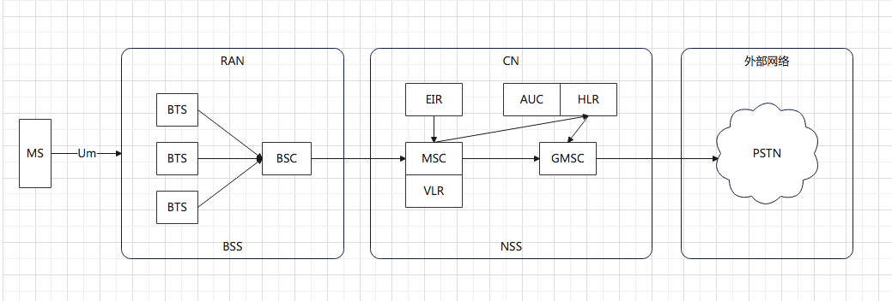

2.5G 网络

在2G网络基础上，加入了分组交换业务，支持Packet的转发，从而支持IP网络

- 分组控制单元(PCU, Packet Control Unit): 提供分组交换的通道
- (SGSN, Service GPRS Supported Node):
- (GGSN, Gateway GPRS Supported Node): 连接ip网络的网关型GPRS支持节点

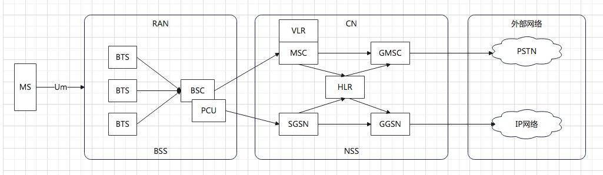

3G 网络

增加了无线的带宽，W-CDMA林论最高2M下行速度。

无线网络控制器(RNC, Radio Network Controller): 连接核心网络

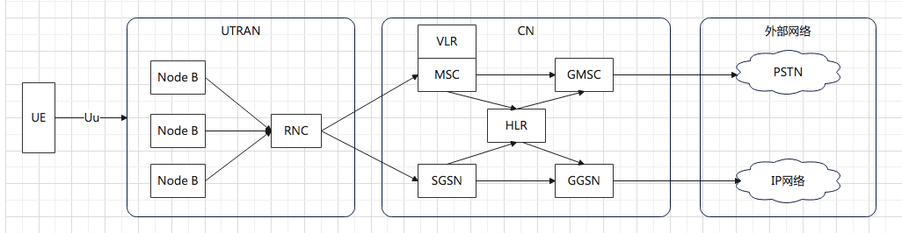

4G 网络

E-NodeB: 实现了原来NodeB和RNC的功能，下行速度向百兆级别迈进。

核心网实现了控制面和数据面的分离。控制面主要是指令，多是小包，往往需要高的及时性；数据面主要是流量，多是大包，往往需要吞吐量。

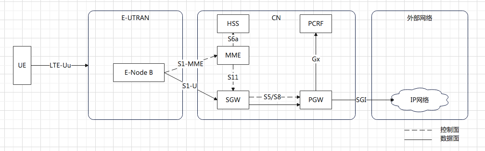

- HSS: 用于存储用户签约信息的数据库，比如号码归属地
- MME: 核心控制网元，是控制面的核心。当手机通过eNodeB连上时，会根据HSS的信息，判断你是否合法。合法，告诉eNodeB去SGW连上核心网，并通过PGW连接到IP网络。
- SGW: 数据面网关。本地的运营商设备
- PGW: 出口网关。所属的运营商的设备
- PCRF: 策略和计费控制单元，用来控制上网策略和流量的计费。

4G 网络协议

- 控制面协议
    - S1-MME
    - GTP-C：基于UDP，建立数据通路。从eNodeB到SGW，从SGW到PGW
- 数据面协议
    - S1-U: eNodeB 到 SGW
    - S8: SGW到PGW
    - GTP-U: 数据面协议。

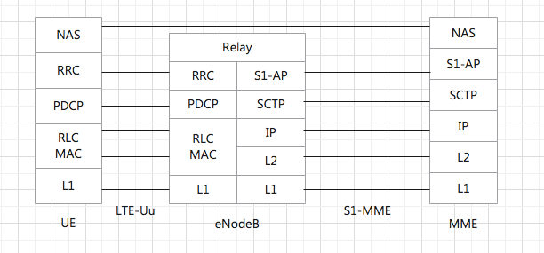

SCTP: 在移动网络中替换TCP协议，面向连接，更适合移动网络。

- 多宿主：一台机器可以有多个网卡，SCTP将多个接口，多条线路放到一个联合(association)中。当一条路径失败，则使用另一条路径。
- 将一个联合分成多个流：一个联合中的所有流都是独立的。每个流有流编号，通过联合在网络上传输。
- 四次握手：防止SYN攻击。
- 将消息分帧：
- 断开连接三次挥手：当一端关闭自己的套接字时，对等的两端需要全部关闭，不允许半关闭。

GTP-U

```
格式
| MAC头 | 外层IP | UDP头 | GTP头 | 内部IP头 | 内层 TCP/UDP | Data |
|--------承载协议--------|隧道协议|-------------乘客协议-----------|
```

异地上网

SGW是本地的运营商设备，PGW是你所属的运营商的设备。在国外时，国外的SGW和国外的E-NodeB建立隧道，国外的SGW和国内的PGW建立隧道，国内的运营商给手机分配ip，上网的流量全部通过国内的运营商。


## 云计算中的网络

### 云中网络

开源技术 qemu-kvm 可以用来创建虚拟机。

虚拟网卡

虚拟机要有一张网卡。虚拟机是物理机上跑的一个软件，可以像其他应用打开文件一样，打开一个称为 TUN/TAP 的 Char Dev（字符设备文件）。打开了这个字符设备文件后，在物理机上就能看到一张虚拟TAP网卡。

1. 虚拟机：虚拟机的网卡，打开tun/tap字符设备文件/dev/net/tun
2. 物理机（内核态）：打开物理机的 tun/tap 字符设备驱动
3. 物理机（内核态）：tun/tap 虚拟网卡驱动
4. 物理机（内核态）：TCP/IP 协议栈
5. 物理机（用户态）：虚拟网卡TAP0，发出网络包

虚拟机的互访

使用虚拟的交换机，将两个虚拟机的网卡，都连到虚拟网桥里，配置相同的网段，就可以通信了

```sh
# 创建虚拟的网桥（交换机）
brctl addbr br0
# 将虚拟网卡，连接到虚拟网桥
brctl addif br0 tap0
```

虚拟机连外网

- 桥接：将物理网卡，也连接到虚拟网桥上，形成一个二层网络。缺点：二层网络有广播问题
- NAT：虚拟机自成一个网络，需要一个DHCP服务器来给虚拟机分配ip。通过虚拟网桥br0互相通信。通过br0连接到路由器（物理网卡），通过路由器将请求NAT成为物理网络的地址，转发到物理网络，和物理机通信。（物理网卡是一个路由器？那是不是至少要有2个ip？）

```sh
# 将虚拟机所在网络的网关地址直接配置到br0上，给虚拟机手动分配ip
# 在物理机网卡配置nat，所有从这个网卡出去的包都nat成这个网卡的地址
iptables -t nat -A POSTROUTING -o ethX -j MASQUERADE
# 开启物理机的转发功能，当做路由器
net.ipv4.ip_forward = 1
```

虚拟机隔离

brctl 虚拟网桥支持vlan，虚拟机之间通过vlan隔离。

虚机间跨物理机互通，但vlan隔离

网桥上的tag只能在网桥范围内使用。因此需要 vconfig 在物理网卡上，创建2个带vlan的虚拟网卡，从这个虚拟网卡出去的包，都带vlan号。虚拟机的包通过物理机之后，也可以互相隔离。

### SDN 软件定义网络

特点

- 控制和转发分离
    - 控制平面：统一的控制中心。类比小区的监控
    - 转发平面：虚拟或物理的网络设备。类比小区的路
- 控制平面和转发平面之间的开放接口
    - 控制器向上提供接口（北向接口），被应用调用
    - 向下提供接口（南向接口），用来控制网络设备。
- 逻辑上的集中控制：可以控制整个网络

实现方式

- OpenFlow：SDN控制器和网络设备之间互通的南向接口协议
- OpenvSwitch：用于创建软件的虚拟交换机，支持OpenFlow协议，可以被SDN控制器管理。

SDN 控制器如何通过 OpenFlow 协议控制网络 ？

在OpenvSwitch里面，有一个流表规则，任何通过这个交换机的包，都会经过这些规则进行处理，从而接收、转发、放弃。

流表就是一个个表格，表格里每行都是一条规则，每个规则都有优先级，先看优先级高的，再看优先级低的。

每个规则，要看是否满足匹配条件，如：从哪个端口进来的，网络包头里有什么等等。

满足条件后，就可以执行一个动作，如：跳转到某个表格，修改包头里的内容，转发到哪个网口，丢弃。

OpenvSwitch 实验

实验一：实现vlan功能

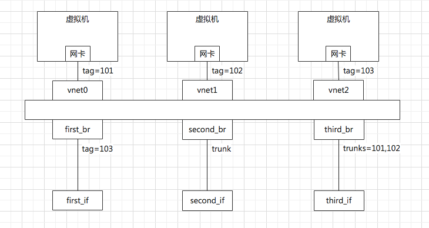

```sh
# 创建虚拟交换机
ovs-vsctl add-br br0
# 新创port，连到网桥br0
ovs-vsctl add-port br0 first_br
ovs-vsctl add-port br0 second_br
ovs-vsctl add-port br0 third_br
ovs-vsctl add-port br0 vnet0
ovs-vsctl add-port br0 vnet1
ovs-vsctl add-port br0 vnet2
# 设置port的类型，access口只能过和接口vlan号相同的包，通过后把vlan id剥离掉；trunk口能过它配置的包，并不剥离vlan tag
ovs-vsctl set Port vnet0 tag=101
ovs-vsctl set Port vnet1 tag=102
ovs-vsctl set Port vnet2 tag=103
ovs-vsctl set Port first_br tag=103
ovs-vsctl clear Port second_br tag
ovs-vsctl set Port third_br trunks=101,102
# 禁止mac学习
ovs-vsctl set bridge br0 flood-vlans=101,102,103
```

实验二：模拟网卡绑定，连接交换机

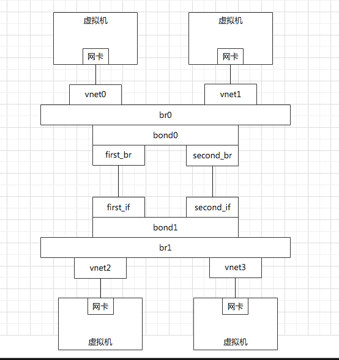

```sh
# 模拟网卡绑定，连接交换机
# bond_mode
# - active-backup: 一个连接是active，其他是backup，只有active失效，backup才顶上。默认模式
# - balance-slb: 流量按照源MAC和output VLAN进行负载均衡
# - balance-tcp: 必须在支持LACP协议的情况下才可以，可根据L2, L3, L4进行负载均衡
ovs-vsctl add-bond br0 bond0 first_br second_br
ovs-vsctl add-bond br1 bond1 first_if second_if
ovs-vsctl set Port bond0 lacp=active
ovs-vsctl set Port bond1 lacp=active
# 设置bond_mode
ovs-vsctl set Port bond0 bond_mode=balance-slb
ovs-vsctl set Port bond1 bond_mode=balance-slb
```

OpenvSwitch 在用户态的2个进程

- OVSDB进程：和 ovs-vsctl 命令通信，执行创建交换机、端口等命令，并把拓扑信息放在数据库里
- vswitchd进程：和 ovs-ofctl 命令通信，下发流表规则，将流表放在用户态Flow Table中。

在内核态，有内核模块 OpenvSwitch.ko，它会在网卡上注册一个函数，每当有网络包到达网卡时，这个函数就被调用。

在内核中，还有一个内核态Flow Table，这个流表里有部分常用的规则，一段时间后就会过期。如果内核态的流表没有匹配到，内核会通过upcall，告知用户态进程的vswitchd，到用户态的全量流表中去匹配。用户态和内核态之间，通过Linux的机制Netlink进行通信。

当在用户态匹配到了流表规则之后，就在用户态执行操作，同时将这个匹配成功的流表通过reinject下发到内核，从而接下来的包都能在内核中找到这个规则，来进行转发。

OpenFlow 也可以通过远程的SDN控制器来控制，比如 OpenDaylight。

### 云中网络安全

访问控制列表 ACL Access Control List

安全规则的集合，称为安全组。

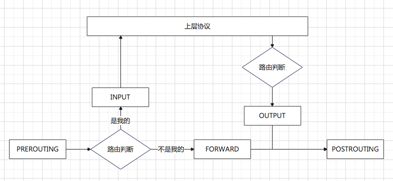

linux内核中，有一个叫 Netfilter 的框架，可以在这些节点插入hook函数。这些函数可以截获数据包，对数据包进行干预。比如

- ACCEPT: 交给协议栈处理
- DROP: 丢弃
- QUEUE: 给某个用户态进程处理

内核模块 ip_tables。它在这5个节点上埋下函数。按功能分为四大类

- 连接追踪(conntrack)
- 数据包的过滤(filter)
- 网络地址转换(nat)
- 数据包的修改(mangle)

用户态有客户端 iptables，用命令行来干预内核的规则。内核的功能对应iptables的命令行来说，就是表和链的概念。

iptables的表分为四种：raw -> mangle -> nat -> filter。这四个优先级依次降低。每个表可以设置多个链。

filter 表处理过滤功能，主要包含3个链

- INPUT链：过滤所有目标地址是本机的数据包
- FORWARD链：过滤所有路过本机的数据包
- OUTPUT链：过滤所有由本机产生的数据包

nat表主要处理网络地址转换，可以进行Snat(改变数据包的源地址)、Dnat(改变数据包的目标地址)，包含3个链

- PREROUTING链：在数据包到达防火墙时改变目的地址
- OUTPUT链：改变本地产生的数据包的目标地址
- POSTROUTING链：在数据包离开防火墙时改变数据包的源地址

mangle 主要是修改数据包，包括

- PREROUTING链
- INPUT链
- FORWARD链
- OUTPUT链
- POSTROUTING链

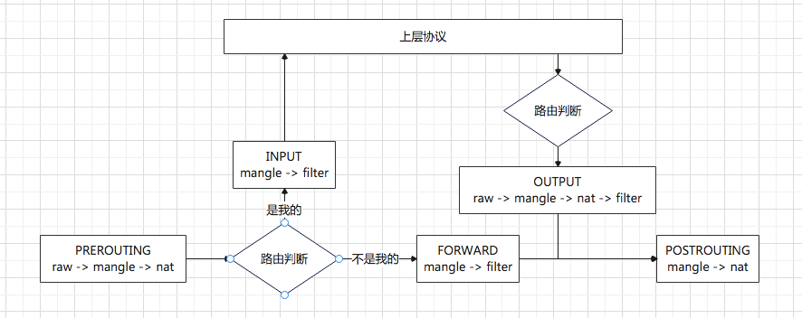

```sh
# 丢掉所有包。-s 源ip地址段 -d 目标地址段 DROP 丢弃
iptables -t filter -A INPUT -s 0.0.0.0/0.0.0.0 -d X.X.X.X -j DROP
# 打开ssh的22端口
iptables -I INPUT -s 0.0.0.0/0.0.0.0 -d X.X.X.X -p tcp --dport 22 -j ACCEPT
# 打开80端口
iptables -A INPUT -s 0.0.0.0/0.0.0.0 -d X.X.X.X -p tcp --dport 80 -j ACCEPT
```

云平台上，允许一个或多个虚机属于一个安全组，不同安全组之间的虚机之间的访问，通过安全组过滤。

在每台机器上跑一个agent，将用户配置的安全组变成iptables规则，配置在网桥上。

云平台里的虚机只有私网ip地址，到达外网网口要做一次Snat，转换成为机房网IP，然后出数据中心的时候，再转换为公网IP。

所有虚机共享一个机房网和公网ip，所有从外网口出去的，都转换成这个ip地址。

Netfilter的连接追踪(conntrack)，使用 源/目的ip + 源/目的的端口，唯一标识一条连接，放在conntrack里。

```sh
# 源地址转换Snat
iptables -t nat -A -s 私网ip -j Snat --to-source 外网ip
# 目的地址转换
iptables -t nat -A -PREROUTING -d 外网ip -j Dnat --to-destination 私网ip
```

### 云中网络QoS

QoS: Quality Of Service 实现流量控制

有两个方向

- 入方向: Policy（控制丢包）
- 出方向: Shaping

在 linux 下，通过TC控制网络的QoS，主要是通过队列的方式

- 无类别排队规则(Classless Queuing Disciplines)
    - pfifo_fast: 有3个队列，band0,band1,band2，band0优先级最高。根据网络包里的TOS，将包分在3个队列里。TOS是4位的，从高到低代表：最小延迟、最大吞吐量、最大高可靠、最小代价。都为0表示正常，放在band1。
    - 随机公平队列(Stochastic Fair Queuing): 建立很多FIFO队列，TCP计算hash值，根据hash值分配到某个队列。网络包会通过轮询策略从各个队列中取出发送。这样不会有一个Session占据所有的流量。
    - 令牌桶规则(TBF, Token Bucket Filte): 只有一个队列，但队头的包只有拿到令牌才能发送。令牌按照既定速度生成。
- 基于类别的队列规则(Classful Queuing Disciplines)
    - 分层令牌桶规则(HTB, Hierarchical Token Bucket)

tc linux流量控制程序

```sh
# pfifo_fast
# 输出 priomap，是TOS和band的对应关系。
tc qdisc show dev eth0

# htb
# 给网卡eth0创建HTB队列规则
tc qdisc add dev eth0 root handle 1: htb default 12
# 配置网卡发送的速度 rate 一般情况下的速度 ceil 最高情况下的速度
tc class add dev eth0 parent 1: classid 1:1 htb rate 100kbps ceil 100kbps
# 创建分支，即几个子class
tc class add dev eth0 parent 1:1 classid 1:10 htb rate 30kbps ceil 100kbps
tc class add dev eth0 parent 1:1 classid 1:11 htb rate 10kbps ceil 100kbps
tc class add dev eth0 parent 1:1 classid 1:12 htb rate 60kbps ceil 100kbps
# 创建队列
tc qdisc add dev eth0 parent 1:10 handle 20: pfifo limit 5
tc qdisc add dev eth0 parent 1:11 handle 30: pfifo limit 5
tc qdisc add dev eth0 parent 1:12 handle 40: sfq perturb 10
# 设定发送规则
# 从 1.2.3.4 来的，发送给port 80 的包，从第一个分支1:10走
tc filter add dev eth0 protocol ip parent 1:0 prio 1 u32 match ip src 1.2.3.4 match ip dport 80 0xfff flowid 1:10
tc filter add dev eth0 protocol ip parent 1:0 prio 1 u32 match ip src 1.2.3.4 flowid 1:11

# 控制QoS
# OpenvSwitch 设置Ingress policy 控制 入口流量
ovs-vsctl set Interface tap0 ingress_policing_rate=10000
ovs-vsctl set Interface tap0 ingress_policing_burst=1000
# 发出的流量，设置Egress shaping规则

# 在port上创建QoS
ovs-vsctl set port first_br qos=@newqos -- --id=@newqos create qos type=linux-htb other-config:max-rate=1000000 queues=0=@q0,1=@q1,2=@q2 -- --id=@q0 create queue other-config:min-rate=300000 other-config:max-rate=1000000 -- --id=@q1 create queue other-config:min-rate=100000 other-config:max-rate=1000000 -- --id=@q2 create queue other-config:min-rate=600000 other-config:max-rate=1000000
# 添加流表规则
ovs-ofctl add-flow br0 "in_port=6 nw_src=192.168.100.100 actions=enqueue:5:0"
ovs-ofctl add-flow br0 "in_port=7 nw_src=192.168.100.101 actions=enqueue:5:1"
ovs-ofctl add-flow br0 "in_port=8 nw_src=192.168.100.102 actions=enqueue:5:2"
```

### 云中网络隔离

vlan 数量有限，只有4096个。而固有协议不能改变，需要在已有协议的基础上，扩展协议。

底层的物理网络设备组成的网络我们成为Underlay网络

用于虚拟机和云中的这些技术组成的网络称为Overlay网络

#### GRE

Generic Routing Encapsulation 是一种 IP-over-IP 的隧道技术。将IP包封装在GRE包里，外面加上IP头，在隧道的一端封装数据包，并在通路上传输，到另一端解封装。

目标：网络隔离

```
| 外层IP头 | GRE头 | 内层IP包 |

GRE 头
| 标识位(4位) | 预留 | 版本(3位) | 协议类型(16位) |
|      Checksum(optional)    |     预留      |
|            key(optional) (标识网络)         |
|       Sequence Number (optional)          |


专用于网络虚拟化
| 外层IP头 | NVGRE头 | 内层MAC帧 |

NVGRE 头
| 标识位(4位) | 预留 | 版本(3位) | 协议类型(16位) |
|   Virtual Subnet ID(24位)   | Flow ID(8位) |
```

GRE需要有一个来封装和解封装GRE的包，这个地方往往是路由器或者有路由功能的linux机器。

缺点：

1. Tunnel数量：GRE是一个点对点隧道，全互联时隧道成指数增长
2. GRE不支持组播
3. 有很多防火墙和三层网络设备无法解析GRE

#### VXLAN

```
| 外层Mac头 | 外层IP头 | 外层UDP头| VXLAN头 | 内层MAC头 | 内层IP包 |

VXLAN 头
| 标识位(8位) |            预留            |
| Virtual Subnet ID(24位) | Flow ID(8位) |
```

VXLAN 作为扩展性协议，也需要一个地方对VXLAN的包进行封装和解封装。实现这个功能的点成为 VTEP (VXLAN Tunnel Endpoint)

当一个VTEP启动时，需要通过 IGMP 协议，加入一个组播组，所有发到这个组里的消息，大家都能收到。

#### 实验

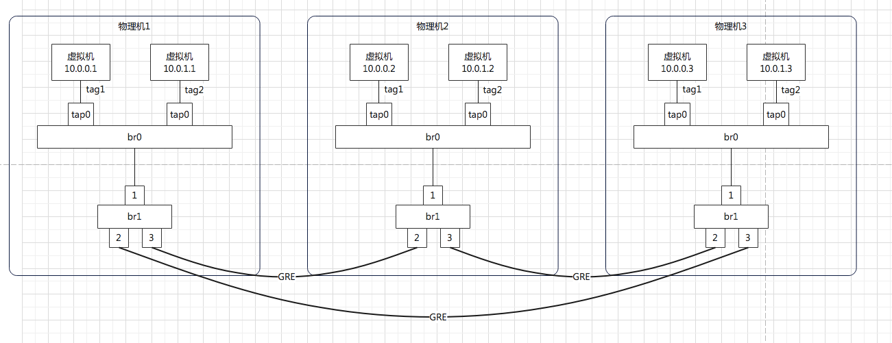

Flow Table 设计

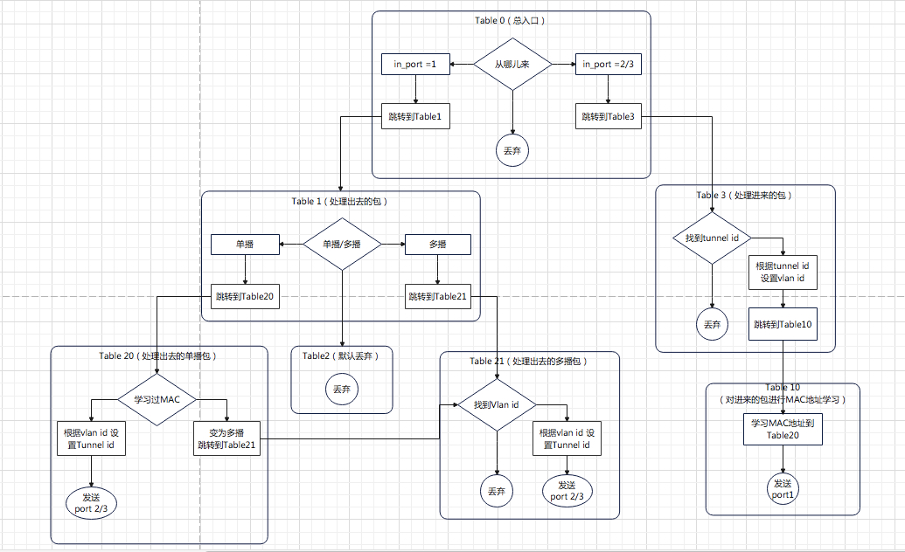

```sh
# table0
# port1 进来的流量，给Table1处理
ovs-ofctl add-flow br1 "hard_timeout=0 idle_timeout=0 priority=1 in_port=1 actions=resubmit(,1)"
# port2 3 进来的，全部由Table3处理
ovs-ofctl add-flow br1 "hard_timeout=0 idle_timeout=0 priority=1 in_port=2 actions=resubmit(,3)"
ovs-ofctl add-flow br1 "hard_timeout=0 idle_timeout=0 priority=1 in_port=3 actions=resubmit(,3)"
# 都没匹配到，就丢弃
ovs-ofctl add-flow br1 "hard_timeout=0 idle_timeout=0 priority=0 actions=drop"

# table1
# 单播
ovs-ofctl add-flow br1 "hard_timeout=0 idle_timeout=0 priority=1 table=1 dl_dst=00:00:00:00:00:00/01:00:00:00:00:00 actions=resubmit(,20)"
# 多播
ovs-ofctl add-flow br1 "hard_timeout=0 idle_timeout=0 priority=1 table=1 dl_dst=01:00:00:00:00:00/01:00:00:00:00:00 actions=resubmit(,21)"

# table2
ovs-ofctl add-flow br1 "hard_timeout=0 idle_timeout=0 priority=0 table=2 actions=drop"

# table3
# 匹配tunnel id，匹配不到就丢弃
ovs-ofctl add-flow br1 "hard_timeout=0 idle_timeout=0 priority=0 table=3 actions=drop"
# 匹配到，就转成vlan id
ovs-ofctl add-flow br1 "hard_timeout=0 idle_timeout=0 priority=1 table=3 tun_id=0x1 actions=mod_vlan_vid:1,resubmit(,10)"
ovs-ofctl add-flow br1 "hard_timeout=0 idle_timeout=0 priority=1 table=3 tun_id=0x2 actions=mod_vlan_vid:2,resubmit(,10)"

# table10，Mac学习，结果放在table20
# NXM_OF_VLAN_TCI: vlan tag
# NXM_OF_ETH_DST[]=NXM_OF_ETH_SRC[]: 当前源mac会放在dl_dst里
# load:0->NXM_OF_VLAN_TCI[]: 将包从物理机发出时，vlan id 设为0
# load:NXM_NX_TUN_ID[]->NXM_NX_TUN_ID[]：将包从物理机发出时，tunnel id保持不变
# output:NXM_OF_IN_PORT[]：发送给哪个端口
ovs-ofctl add-flow br1 "hard_timeout=0 idle_timeout=0 priority=1 table=10 actions=learn(table=20,priority=1,hard_timeout=300,NXM_OF_VLAN_TCI[0,11],NXM_OF_ETH_DST[]=NXM_OF_ETH_SRC[],load:0->NXM_OF_VLAN_TCI[],load:NXM_NX_TUN_ID[]->NXM_NX_TUN_ID[],output:NXM_OF_IN_PORT[]),output:1"

# table20
ovs-ofctl add-flow br1 "hard_timeout=0 idle_timeout=0 priority=0 table=20 actions=resubmit(,21)"

# table21
ovs-ofctl add-flow br1 "hard_timeout=0 idle_timeout=0 priority=0 table=21 actions=drop"
ovs-ofctl add-flow br1 "hard_timeout=0 idle_timeout=0 priority=1 table=21 dl_vlan=1 acitons=strip_vlan,set_tunnel:0x1,output:2,output:3"
ovs-ofctl add-flow br1 "hard_timeout=0 idle_timeout=0 priority=1 table=21 dl_vlan=2 acitons=strip_vlan,set_tunnel:0x2,output:2,output:3"
```

## 容器网络

容器打包，需要有一个封闭环境，将货物封装起来。

- namespace：看起来隔离的技术。namespace中的应用，看到的是不同的ip地址，用户空间、进程号
- cgroup：用起来隔离的技术。应用只能用整机的部分cpu和内存。

将集装箱标准化，镜像：将集装箱的状态保存下来。

namespace

不同命名空间，可以重名，资源不会冲突。相当于划了一个范围，我的资源在这个范围内是唯一的。

```sh
# 基于网络namespace的路由器
# 创建namespace
ip netns add routerns
# 能转发
ip netns exec routerns sysctl -w net.ipv4.ip_forward=1
# 设置nat
# 初始化iptables
ip netns exec routerns iptables-save -c 
ip netns exec routerns iptables-restore -c 
# 创网卡
ovs-vsctl -- add-port br0 taprouter -- set Interface taprouter type=internal -- set Interface taprouter external-ids:iface-status=active -- set Interface taprouter external-ids:attached-mac=fa:16:3e:84:6e:cc 
# 加入namespace
ip link set taprouter netns routerns
# 给网卡配ip
ip netns exec routerns ip -4 addr add 192.168.1.1/24 brd 192.168.1.255 scope global dev taprouter
# 另一个网卡，连接在外网网桥br-ex
ovs-vsctl -- add-port br-ex taprouterex -- set Interface taprouterex type=internal -- set Interface taprouterex external-ids:iface-status=active -- set Interface taprouterex external-ids:attached-mac=fa:16:3e:68:12:c0
ip link set taprouterex netns routerns
ip netns exec routerns ip -4 addr add 16.158.1.100/24 brd 16.158.1.255 scope global dev taprouterex
# 配置路由表
# 查看路由表
ip netns exec routerns route -n
# 配置nat规则
# 查看nat规则
ip netns exec routerns iptables -t nat -nvL
```

cgroup

control groups 是linux内核提供的一种可以限制、隔离进程使用的资源的机制

net_cls 子系统使用等级标识符 classid 标记网络数据包，可允许 linux 流量控制程序 tc 识别从具体cgroup中生成的数据包

cgroup 提供了一个虚拟文件系统，作为分组管理和各子系统设置的用户接口。

```sh
# 挂载 net_cls 文件系统
mkdir /sys/fs/cgroup/net_cls
mount -t cgroup -onet_cls net_cls /sys/fs/cgroup/net_cls

# 设置 cgroup 规则
tc filter add dev eth0 protocol ip parent 1:0 prio 1 handle 1: cgroup
# 假设有用户a和b，对它们限制带宽
mkdir /sys/fs/cgroup/net_cls/a
mkdir /sys/fs/cgroup/net_cls/b 
# 放 flow id 0x00010010=10 0x00010011=11
echo 0x00010010 > /sys/fs/cgroup/net_cls/a/net_cls.classid
echo 0x00010011 > /sys/fs/cgroup/net_cls/b/net_cls.classid
# 这样，用户进程a发的包，会打上1:10标签，用户进程b发的包，会打上1:11标签；然后结合htb策略，走不同的分支
```

容器里的网络

docker1 和 docker2 各有一张网卡，连在网桥 docker0 上，这样各个容器之间的网络就可以互通了。

连接容器和网桥的网卡，是 linux 创建的一对 veth pair 的网卡，从一边发送包，另一边就能收到。而虚拟机的网卡，是通过TUN/TAP设备虚拟出的网卡。

```sh
# 查看 docker0 网桥
brctl show docker0
# 创建一对 veth pair 网卡
ip link add name veth1 mtu 1500 type veth peer name veth2 mtu 1500
# 一端连到docker0网桥上
ip link set veth1 master testbr
ip link set veth1 up
# 一端放到容器内
# 一个容器的启动对应一个namespace，对docker来讲，pid就是namespace。找到pid
docker inspect '--format={{.State.Pid}}' test
# 将docker创建的网络namespace软连接到netns目录下，这样就可以用ip netns操作了
rm -f /var/run/netns/12065
ln -s /proc/12065/ns/net /var/run/netns/12065
# 将另一端塞到namespace
ip link set veth2 netns 12065
# 将容器内的网卡重命名
ip netns exec 12065 ip link set veth2 name eth0
# 给容器内网卡设置ip
ip netns exec 12065 ip addr add 172.17.0.2/16 dev eth0
ip netns exec 12065 ip link set eth0 up

# 容器访问外网
# 使用桥接模式和nat模式。docker默认使用nat模式
# 宿主机上的iptables规则
-A POSTROUTING -s 172.17.0.0/16 ! -o docker0 -j MASQUERADE
# docker 端口映射
# 通过 docker-proxy 方式
/usr/bin/docker-proxy -proto tcp -host-ip 0.0.0.0 -host-port 10080 -container-ip 172.17.0.2 -container-port 80 
# 通过 DNAT 方式
-A DOCKER -p tcp -m tcp --dport 10080 -j DNAT --to-destination 172.17.0.2:80
```

### 容器网络之Flannel

目标：解决不同物理机上的容器的地址冲突问题

解决方案：每个物理机划分不同的网段。如：172.17.8.0/24 和 172.17.9.0/24

容器间网络互通

- 同一个物理机的容器，通过docker0进行通信
- 不同物理机的容器，通过docker0，经过flannel.1网卡，由flanneld进程处理
    - flanneld进程打开 /dev/net/tun字符设备，就出现了flannel.1的网卡
    - 物理机A上的flanneld将网络包封装在UDP包里，外层加上物理机A和物理机B的ip地址，发送给物理机B上的flanneld
    - 物理机B的flanneld收到包后，解开UDP包，将网络包拿出来，从物理机B的flannel.1网卡发送出去

以上发生在用户态，所以性能差了点

VXLAN 方案

- 通过netlink通知内核建立一个VTEP的网卡flannel.1
- 通过docker0将包发送给flannel.1网卡，网卡将包封装成VXLAN包，通过VXLAN隧道发送到物理机B

### 容器网络之Calico

把物理机当成路由器

## 微服务相关协议

### RPC

远程调用需要解决的问题

rainy：相当于到了网络，就要遵守网络的规矩。而使用网络的双方，要约定经过网络后，应该如何接受和处理网络数据。那我是不是可以认为，使用http协议的api调用，也是一种rpc？封装参数，就是http的头、请求体、api。http协议就起到了RPCRuntime的角色。但是rpc可以像调用本地一样调用远方，但是http要自己组装

- 语法
- 参数
- 数据表示
- 如何得知支持rpc的服务，端口是哪个？
- 错误重传

Little Endian： 最低位放在最后一个位置
Big Endian： 最低位放在第一个位置

TCP/IP 协议栈是 Big Endian

x86 是 Little Endian

RPC 框架标准的论文 Implementing Remote Procedure Calls [Bruce Jay Nelson]

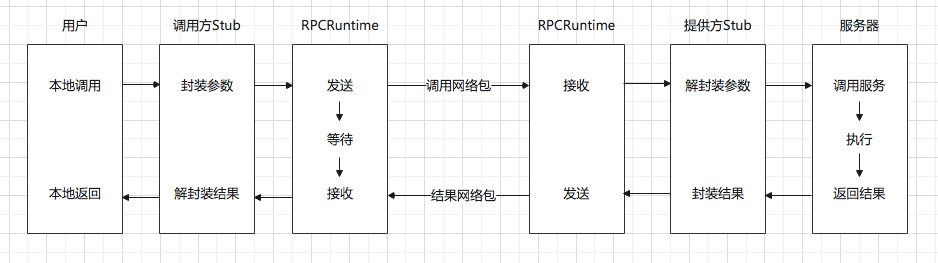

所有RPC调用的底层，都是Socket编程。

Sun RPC 或 ONC RPC

XDR(External Data Representation, 外部数据表示法)是一个标准的数据压缩格式，可以表示基本类型，也可以表示结构体。

服务发现问题

ONC RPC 使用 portmapper 实现

portmapper 会启动在一个众所周知的端口上。rpc程序是自己写的，会监听一个随机端口上，但是rpc程序启动时，会向portmapper注册。客户端要访问rpc服务端，就去查询服务端的portmapper，获取服务程序的端口，然后建立连接。

### SOAP 协议

RPC 框架，比较适合客户端和服务端都是同一拨人开发的，因为要配置大量的参数，一旦参数对不上，就容易无法通信。

SOAP(Simple Object Acces Protocol) 简单对象访问协议，使用XML编写请求和回复消息，使用HTTP协议进行传输。

协议约定使用xml。请求体使用XML描述，而且可以有动作 <ADD> 等。

WSDL(Web Service Description Languages) Web服务描述语言，是一个XML文件。定义了请求和响应的格式。

服务发现问题

UDDI(Universal Description, Discovery, and Integration) 统一描述、发现和集成协议。

### RESTful 接口协议

是一种架构风格，表述性状态转移，Representational State Transfer。来自一篇重要的论文《架构风格与基于网络的软件架构设计》(Architectural Styles and the Design of Network based Software Architectures)

服务端无状态：服务端记录资源状态，如文件状态、库存状态；客户端维护自己的状态（会话的状态），如访问到了哪个目录，到报表的哪一页。

这种API的设计，需要实现幂等。即同一个调用，多次调用的结果应该一样。

协议约定采用JSON，请求和响应体，使用JSON描述资源。

服务发现问题：如 Spring Cloud 框架。服务分提供方，和消费方。提供方向Eureka做服务注册，续约和下线等操作，注册的主要数据包括服务名，机器ip，端口号，域名等。消费方要调用服务时，会从注册中心读出服务，使用RESTful方式调用。Spring Cloud 提供一个RestTemplate工具，用于将请求对象转换成JSON，发起调用。

### 二进制类RPC协议

对于微服务的架构，api需要一个api网关统一的管理，api常用的实现方式是：用Nginx或者OpenResty结合Lua脚本。

Dubbo 服务化框架二进制的PRC方式

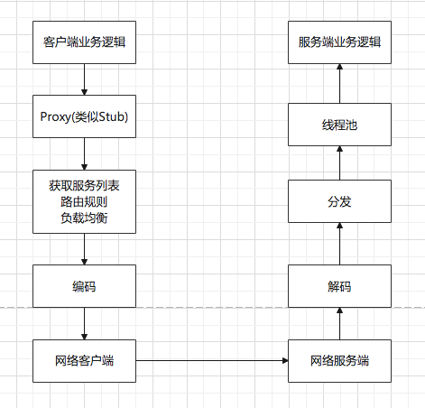

```
报文格式
| IP 头 | TCP 头 | Dubbo头 | 序列化数据 |
```

Dubbo 中默认的 RPC 协议是 Hessian2。为保证传输效率，Hessian2 将远程调用序列化为二进制进行传输，并且可以进行一定的压缩。Hessian2 是自描述的，根据二进制文件里的信息，就能将传输内容解析出来，不需要再配置协议文件。

二进制传输的好处

如 123 采用二进制，是8位，采用字符串再转二进制，一个字符是8位，共24位。

rainy：Hessian2 等RPC协议，定义了序列化的方式。那我是不是可以认为，它类似于Java的序列化和反序列化？

Dubbo 使用 Netty 做网络传输框架。

Netty 非阻塞，基于事务的网络传输框架。在Netty服务端启动时候，会监听一个端口，并注册以下事件。

- 连接事件：当收到客户端的连接事件时，会调用 void connected(Channel channel)
- 可写事件：触发时，会调用void sent(Channel channel, Object message)，服务端向客户端返回响应数据。
- 可读事件：触发时，会调用void received(Channel channel, Object message)，服务端在收到客户的请求数据。
- 发生异常：会调用void caught(Channel channel, Throwable exception)

在SOA的架构中，使用二进制的方式进行序列化，虽然不用协议文件来生成Stub，但对于接口的定义，以及传输的对象DTO，还是要共享JAR，而且要客户端和服务端的JAR版本要匹配好，否则就可能序列化不成功。而且不同服务之间，可能循环依赖。

有2种解决方案

1. 建立严格的项目管理流程
    - 不允许循环调用，跨层调用，只允许上层调用下层。
    - 接口要保持兼容性，不兼容的接口要新增而不是修改。下线接口要保证接口没人在使用
    - 升级要先升服务端，再升消费端
2. 改使用RESTful方式（性能会降低）

服务发现：注册中心；协议约定：Hessian2；网络传输：Netty

### 跨语言类 RPC

二进制的rpc难以跨语言

GRPC 跨语言的二进制rpc，需要双方有一个协议约定文件。二进制序列化协议是 Protocol Buffers，协议文件是 .proto。有和语言对应的工具来生成客户端和服务器的Stub程序。

网络传输：java技术栈，GPRC的客户端和服务端通过Netty Channel作为数据通道，每个请求都被封装成 HTTP2.0 的stream

可以定义4种服务方法

- 单向 RPC：客户端发送请求，服务端响应。像一次普通的函数调用
- 服务端流式 RPC: 服务端返回的不是一个结果，而是一个数据流，里面有一系列消息。
- 客户端流式 RPC: 客户端的请求时一个数据流，里面有一系列请求消息。
- 双向流式 RPC：客户端和服务端都用流来发送消息

```
rpc SayHello(HelloRequest) returns (HelloResponse) {}
rpc LostOfReplies(HelloRequest) returns (stream HelloResponse) {}
rpc LostOfGreetings(stream HelloRequest) returns (HelloResponse) {}
rpc BidiHello(stream HelloRequest) returns (stream HelloResponse) {}
```

服务发现：需要借助其他组件，如 Envoy，它是一个Proxy转发器，可以配置灵活的转发规则。

- listener：监听端口，接入请求
- endpoint：请求转发的地方
- cluster：具有完全相同行为的多个endpoint。从cluster到endpoint的过程，称为负载均衡
- route：可以通过route规则，将请求路由到某一个版本号的cluster

## 双十一相关的网络协议

### 部署一个高可用高并发的电商平台

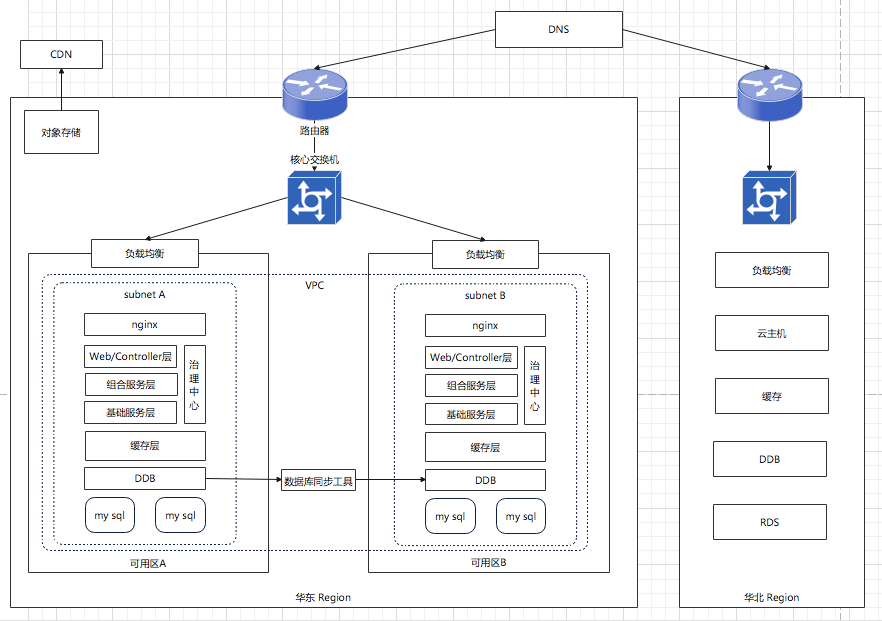


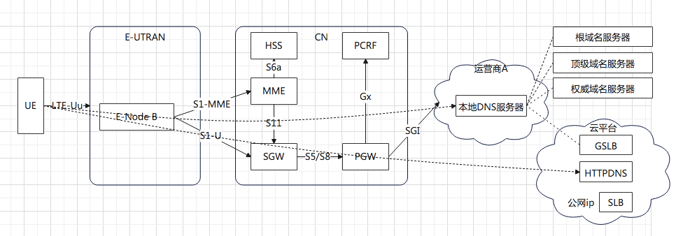


书籍推荐

《TCP/IP详解》《TCP/IP illustrated》 Rechard Stevens 


