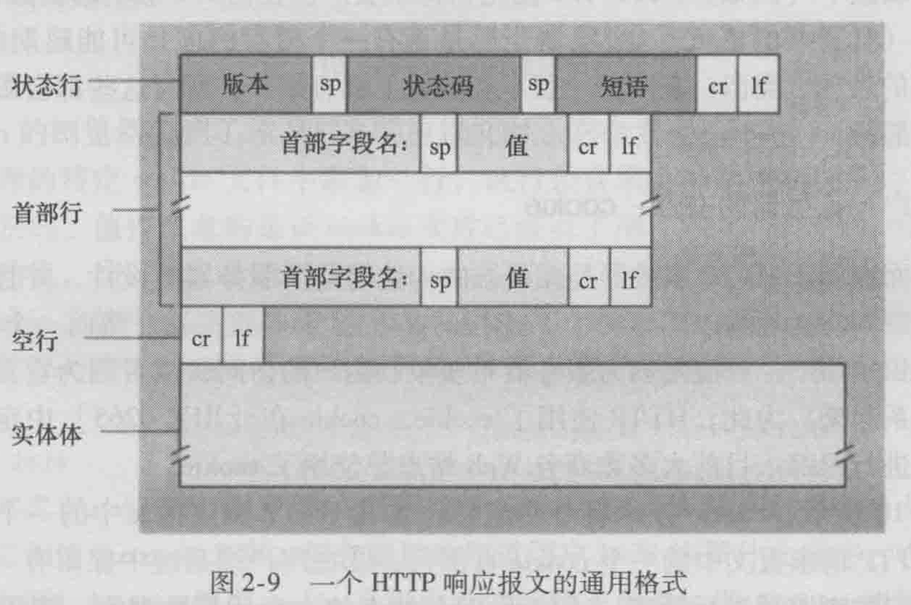
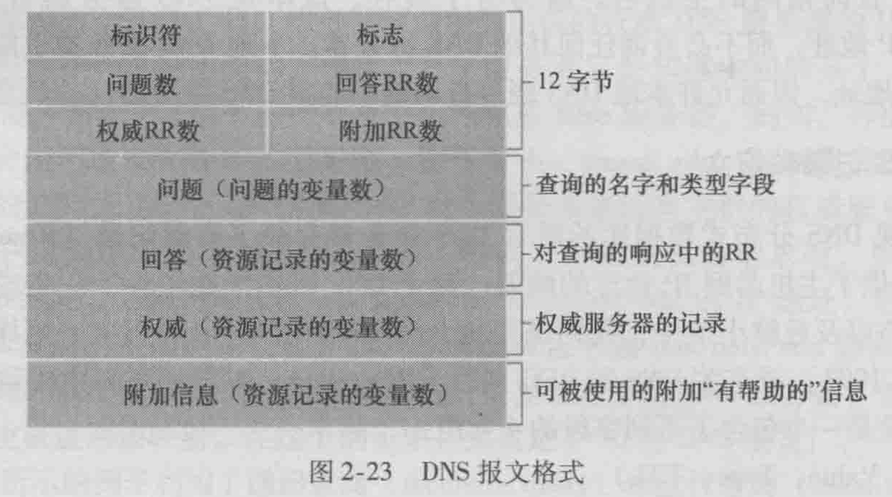

# 计算机网络


## 计算机网络和因特网

术语

```
主机(host)，端系统(end system)
通信链路(communication link)，分组交换机(packet switch)
路由器(router)，链路层交换机(link-layer switch)
路径(route or path)：从发送端系统到接收端系统，一个分组(packet)所经历的一系列通信链路和分组交换机
因特网服务提供商(Internet Service Provider, ISP)：由分组交换机和通信链路组成的网络
协议(protocol)：定义了在两个或多个通信实体间交换的报文格式和次序，以及报文发送和接收报文或其他事件所采取的动作。
TCP(Transmission Control Protocol，传输控制协议)
IP(Internet Protocol，网际协议)：定义了路由器和端系统之间发送和接收的分组格式。
因特网标准(Internet standard)
因特网工程任务组(Internet Engineering Task Force, IETF)
请求评论(Request For Comment, RFC)：IETF的标准文档
分布式应用程序(distributed application)
应用程序编程接口(Application Programming Interface)
接入网(access network)：将端系统连接到边缘路由器的物理链路。
边缘路由器(edge router)：端系统到其他系统的路径上的第一台路由器。
```

### 网络边缘

宽带住宅接入

- 数字用户线(Digital Subscriber Line, DSL)。家庭电话线使用频分复用技术，同时承载了数据和传统的电话信号。
    1. 数字信号，通过DSL调制解调器，转换成高频音（模拟信号），通过电话线，发送到本地中心局(CO)
    2. 模拟信号，到达CO后，在数字用户线接入复用器(DSLAM)，转换回数字形式
    3. 覆盖CO的5-10英里范围的用户
- 电缆因特网接入(cable Internet access)。利用有线电视公司的基础设施，混合光纤同轴(Hybrid Fiber Coax, HFC)。
    1. 需要电缆调制解调器(calbe modem)，将数字信号转成模拟信号
    2. 电缆调制解调器端接系统(Cable Modem Termination System, CMTS)，将模拟信号转成数字信号。
    3. 共享广播媒体，即大家的数据都在同一条电缆上传输。
- 光纤到户(Fiber To The Home, FTTH)，从本地中心局到家庭直接用一条光纤路径。
    1. 主动光纤网络(Active Optical Network, AON)
    2. 被动光纤网络(Passive Optical Network, PON)
        1. 家庭，光纤网络端接器(Optical Network Terminatior, ONT)，连接到邻近的分配器(splitter)
        2. 中心局，光纤线路端接器(Optical Line Terminator, OLT)，光信号到电信号的转换。
- 卫星链路，速率低
- 传统电话线拨号接入


企业和家庭接入

- 以太网
- WiFi(IEEE 802.11 技术的无线LAN接入)


广域无线接入

- 3G
- LTE(Long-Term Evolution)

物理媒体 physical medium

- 引导型媒体(guided media)：电波沿固体媒体前行。
    1. 双绞铜线：高速LAN联网的主要方式
    2. 同轴电缆
    3. 光纤
- 非引导型媒体(unguided media)：电波在空气或外层空间中传播，如无线局域网、数字卫星
    1. 陆地无线电信道
    2. 卫星无线电信道
        1. 同步卫星(geostationary satellite)
        2. 近地轨道(Low-Earth Orbiting, LEO)卫星

### 网络核心

分组交换机和链路构成的网状网络。

通过网络链路和交换机移动数据，有两种方法

1. 电路交换(circuit switching)
2. 分组交换(packet switching)

#### 分组交换

端系统彼此交换报文(message)。源将长报文划分为较小的数据块，称为分组(packet)。分组通过分组交换机(packet switch)传送。分组以等于该链路最大传输速率的速度通过通信链路。

1. 存储转发传输(store-and-forward transmission)
    1. 在链路的输入端使用
    2. 在转发分组前，需要接收到整个分组。
2. 排队时延和分组丢失
    1. 输出缓存(output buffer)或输出队列(output queue)：每条链路都有，用于存储转发到该链路的分组。因此有排队时延(queue delay)
    2. 当缓存被填满时，新到的分组或已经排队的分组之一会被丢弃，出现分组丢失(丢包)(packet lost)
3. 转发表和路由选择协议
    1. 每个端系统有一个IP地址
    2. 源在发送分组的首部包含了目的地的IP地址
    3. 路由器检查分组的目的地址，查询转发表(forwarding table)，得到输出链路，将分组导向该链路。
    4. 路由选择协议(routing protocol)用于自动地设置转发表。


#### 电路交换

预留了端系统间通信沿路所需要的资源，如缓存、链路传输速率。

例子：传统的电话网络

当端系统之间要通信时，会建立一条专用的端到端连接(end-to-end connection)

1. 电路交换网络中的复用
    1. 频分复用(Frequency-Division Multiplexing, FDM)：每条链路专用一个频段，频段的宽度称为带宽(bandwidth)
    2. 时分复用(Time-Division Multiplexing, TDM)：时间被划为固定区间的帧，每帧被划为固定数量的时隙。网络在每个帧中为该连接指定一个时隙。
2. 与分组交换对比
    1. 电路交换“预先”分配，分组交换“按需”分配


#### 网络的网络

等级结构

```
接入ISP
区域ISP(reginal ISP)
第一层ISP(tier-1 ISP)

存在点(Point of Presence, PoP)：提供商网络中的一组路由器
因特网交换点(Internet exchange point, IXP)：汇合点，多个ISP在这里共同对等。
多宿(multi-home)：可以和多个提供商ISP连接
对等(peer)：邻近ISP直接相连，他们直接的流量可以互通，而不需要通过上游ISP传输。

内容提供商网络(content provider network)：如谷歌自建的网络，直接与ISP或IXP连接，可以减少向顶层ISP的付费。
```


### 分组交换网络中的时延、丢包、吞吐量

结点(主机或路由器)总时延(total nodal delay)包括

1. 处理时延(nodal processing delay)
    1. 检查分组首部，决定分组导向
    2. 差错检测
2. 排队时延(queuing delay)
    1. 分组在链路上等待传输
3. 传输时延(transmission delay)
    1. 发送分组需要的时间，L/R，L是分组长度，R是链路传输速率
4. 传播时延(propagation delay)
    1. 从链路起点到下一个路由器传播需要的时间，d/s，d是距离，s是链路传播速率


排队时延和丢包

流量强度(traffic intensity)：La/R，L是分组长度，a是分组达到队列的平均速率(pkt/s)，R是传输速率。La/R > 1，则排队时延将趋向无穷大。

端到端时延

计算机网络中的吞吐量

瞬时吞吐量(instantaneous throughput)：目的主机接收到文件的速率

平均吞吐量(average throughput)：F/T bps，F是接收到的比特，T是接收F比特用的时间。

### 协议层次及其服务模型

1. 协议分层
    1. 分层(layer)
    2. 服务(service)

协议栈(protocol stack)：各层的所有协议

1. 应用层(application-layer)：信息从一个应用程序，到另一个应用程序
    1. HTTP、SMTP、FTP、DNS
    2. 信息分组称为报文(message)
2. 运输层(transport-layer)：从一个主机上的端口，到另一个主机上的端口
    1. TCP、UDP
    2. 报文段(segment)
3. 网络层(network-layer)：从一个主机，到另一个主机
    1. IP
    2. 数据报(datagram)
4. 链路层(link-layer)：从一个结点(主机或路由器)到另一个结点
    1. 以太网、WiFi、电缆接入网的DOCSIS、PPP
    2. 帧(frame)
5. 物理层：将帧中的一个一个比特从一个结点移动到下一个结点
    1. 
    2. 比特(rainy:是比特吗?)

OSI(开放系统互连)模型

1. 应用层
2. 表示层：使通信的应用程序能够解释交换数据的含义。提供的服务如，数据压缩、数据加密、数据描述
3. 会话层：提供了数据交换定界、同步功能。如，建立检查点和恢复方案的方法。
4. 运输层
5. 网络层
6. 数据链路层
7. 物理层

封装

链路层交换机：实现了1、2层协议

路由器：实现了1、2、3层协议

### 面对攻击的网络

IP哄骗(IP spoofing)：将具有虚假源地址的分组注入因特网的能力

### 实验

分组嗅探器(packet sniffer)

1. 分组捕获库：接收从计算机发出或接收的每个链路层帧的副本
2. 分组分析器(packet analyzer)：显示协议信息中所有字段的内容。

## 应用层

网络应用是计算机网络存在的理由，如果我们不能构想出任何有用的应用，也就没有必要去设计支持它们的网络协议了。

应用程序体系结构(application architecture)

1. 客户-服务器体系结构(client-server)
    1. 客户间不通信
    2. 服务器具有固定周知的IP地址
2. 对等(P2P)体系结构(peer to peer)
    1. 没有或很少服务器
    2. 主机间直接通信，称为“对等方”
    3. 自扩展性(self-scalability)

#### 进程通信

进程(process)：运行在端系统中的一个程序。

两个不同端系统上的进程，通过跨越计算机网络交换报文(message)而相互通信。

套接字(socket)

1. 进程通过它向网络发送报文和从网路接收报文。
2. 又称为应用程序和网络之间的 应用程序编程接口(Application Programming Interface, API)

应用程序可能需要的运输层协议的特性

1. 可靠数据传输(reliable data transfer)：保证数据无差错传输
2. 吞吐量：运输层协议确保可用吞吐量。
    1. 宽带敏感的应用(bandwidth-sensitive application)：对吞吐量有要求
    2. 弹性应用(elastic application)：对吞吐量无要求
3. 定时：交互式实时应用有这样的需求
4. 安全性：运输层负责加密解密

TCP服务

1. 面向连接的服务
    1. 传输前，客户端和服务器相互交换运输层控制信息（三次握手）
    2. 握手后，TCP连接建立，连接是全双工的
    3. 结束报文发送时，需要拆除连接(四次挥手)
2. 可靠的数据传送服务：无差错，有序
3. 拥塞控制

安全套接字层(Secure Sockets Layer, SSL)：对TCP的加强，在应用层上实现，提供安全性服务。

UDP服务：不提供不必要服务的轻量级运输协议

1. 无连接
2. 不可靠数据传送服务，不保证报文能被收到，不保证有序
3. 没有拥塞控制机制

#### 应用层协议

应用层协议定义了运行在不同端系统上的应用程序进程如何相互传递报文

1. 交换的报文类型，如请求报文、响应报文
2. 各种报文类型的语法，如报文中的各个字段及这些字段是如何描述的。
3. 字段的语义，即这些字段中包含的信息的含义
4. 一个进程何时以及如何发送报文，对报文进行响应的规则。

应用层协议只是网络应用的一部分

### HTTP

超文本传输协议(HyperText Transfer Protocal, HTTP)

1. HTTP由两个程序实现：客户程序、服务器程序，通过交换HTTP报文进行会话。
2. HTTP定义了这些报文的结构以及客户和服务器进行报文交换的方式。
3. Web浏览器实现了HTTP的客户端。Web服务器实现了HTTP的服务器端。
4. 是无状态协议(stateless protocal)，服务器不保存客户端信息
5. 使用连接的方式
    1. 非持续连接(non-persistent connection)：每个请求/响应使用一个单独的TCP连接发送
    2. 持续连接(persistent connection)：多个请求/响应经过相同的TCP连接发送（默认），在超时间隔内未被使用，会被关闭。
6. 端口：80

往返时间(Round-Trip Time, RTT)：一个短分组从客户-服务器-客户所花费的时间。

HTTP报文格式




Web 缓存

Web缓存器(Web cache)也叫代理服务器(proxy server)，它是能够代表初始Web服务器来满足HTTP请求的网络实体。通过使用内容分发网络(Content Distribution Network, CDN)发挥重要作用。（rainy：delivery？）

条件GET(conditional GET)

1. 请求报文使用GET方法
2. 请求报文中包含一个"If-Modified-Since:"首部行。

### 文件传输协议 FTP

1. 用户提供远程主机的主机名，本地主机的FTP客户进程建立到远程主机FTP服务进程的TCP连接
2. 用户提供用户标识和口令，作为FTP命令的一部分在该TCP连接上传送。


使用了2个并行的TCP连接来传输文件，称为带外传送(out-of-band)

1. 控制连接(control connection)：在主机间传递控制信息。贯穿整个会话期间。端口：21
2. 数据连接(data connection)：文件传输，是非持续的，每传送一个文件，就打开一个数据连接。端口：20

FTP服务器在会话期间，需要保留用户的状态(state)。

### 电子邮件

电子邮件系统

1. 用户代理(user agent)
2. 邮件服务器(mail server)
3. 简单邮件传输协议(Simple Mail Transfer Protocol, SMTP)


SMTP

1. 客户端：运行在发送方邮件服务器。端口：25
2. 服务器端：运行在接收方邮件服务器。端口：110

SMTP一般不使用中间邮件服务器发送邮件。使用持续连接。

邮件报文格式

```
From: rainy@126.com
To: rainyrun@sina.com
Subject: this is a E-mail

报文体...
```

邮件访问协议

用来取在邮件服务器上的邮件。目前有的协议有

1. 第三版的邮局协议(Post Office Protocol-Version 3, POP3)
    1. 特许(authorization)：用户代理发送用户名和密码以鉴别用户。
    2. 事务处理：用户代理取回报文，标记要删除的报文。
    3. 更新：结束POP3会话，并删除被标记的报文。
2. 因特网邮件访问协议(Internet Mail Access Protocol, IMAP)
    1. 把每个报文和一个文件夹联系起来
    2. 维护了IMAP会话的用户状态信息
    3. 允许用户代理获取报文组件（只读报文的一部分）
3. HTTP

### DNS 因特网的目录服务

域名系统(Domain Name System, DNS)：进行主机名到IP地址转换的目录服务

1. 一个由分层的DNS服务器(DNS server)实现的分布式数据库
2. 一个使得主机能够查询分布式数据库的应用层协议

DNS服务器通常是运行BIND(Berkeley Internet Name Domain)软件的UNIX机器，运行在UDP之上，端口：53。

采用层次方式组织，分布在全世界范围

1. 根DNS服务器
2. 顶级域(Top-Level Domain, TLD)DNS服务器
3. 权威DNS服务器。公司可以实现自己的权威DNS服务器
4. 本地DNS服务器(local DNS server)。不属于层次结构。


DNS记录和报文

资源记录(Resource Record, RR)，RR提供了主机名到IP地址的映射。DNS回答报文包含了一条或多条资源记录。RR是一个四元组，包含：

1. Name：取决于Value
2. Value：取决于Value
3. Type
4. TTL：记录的生存时间，决定了资源记录应当从缓存中删除的时间。

|Type|Name|Value|
|---|---|---|
|A|主机名|IP地址|
|NS|域，如foo.com|获得该域中主机IP地址的权威DNS服务器的主机名|
|CNAME|别名|规范的主机名|
|MX|别名|邮件服务器的规范主机名|



DNS查询和回答报文，有相同的格式。

### P2P 应用

BitTorrent

洪流(torrent)：参与一个特定文件分发的所有对等发的集合

追踪器(tracker)：洪流的基础设施结点。当对等方加入洪流时，它向追踪器注册自己，并周期性地通知洪流自己仍在。

1. 当一个新的对等方A加入洪流时，追踪器随机从参与对等方的集合中选择一个子集Set，并将这些对等方的IP地址，发给新加入的对等方。
2. A会尝试和Set中的对等方，建立并行的TCP连接。
3. A周期性询问Set中的对等方的块(chunk)列表，如果有需要的块，则会发出请求。会优先请求副本最少的块(最稀缺优先 rarest first)

分发时间(distribution time)：所有N个对等方得到该文件的副本所需要的时间。

分布式散列表(Distributed Hash Table, DHT)

TCP 套接字编程

### 实验

Mac清除DNS缓存

```sh
sudo dscacheutil -flushcache
```

[清除DNS缓存](https://cloud.tencent.com/developer/article/1523705)

## 运输层

将主机间交付扩展到进程间交付被称为运输层的多路复用(transport-layer multiplexing)与多路分解(demultiplexing)。

提供的服务

1. 进程到进程的数据交付(UDP, TCP)
2. 差错检查(UDP, TCP)
3. 可靠数据传输(reliable data transfer)(TCP)
4. 拥塞控制(congestion control)(TCP)

### 多路复用与多路分解

端口号：16比特，0-65535，0-1023是周知端口号，留给特定协议使用。

UDP套接字由(目的IP地址, 目的端口号)这个二元组来全面标识。源IP地址和/或源端口号不同，但目的IP地址和目的端口号相同，则这两个报文将通过相同的目的套接字，被定向到相同的目的进程。

TCP套接字由(源IP地址, 源端口号, 目的IP地址, 目的端口号)这个四元组来标识。源IP地址或源端口号不同的TCP报文段，将被定向到不同的套接字。

进程与套接字可能不是一对一的，进程可能会创建多个线程，每个线程与一个套接字对应。

### UDP

特点

1. 应用层能控制何时、发送什么数据。而TCP因为有拥塞控制，发送时间不能确定
2. 无需建立连接。因此没有额外的建立连接的时延
3. 无连接状态。连接状态包括：接收和发送缓存、拥塞控制参数、序号&确认号的参数。
4. 分组首部开销小。UDP 8字节、TCP 20字节。

使用UDP的应用是可以实现可靠数据传输的。可通过在应用程序自身中建立可靠性机制来完成。


长度字段指明了包括首部在内的UDP报文段长度

UDP校验和

提供了差错检测功能，用于确定UDP报文在移动时，其中的比特是否发生了改变。

计算方法

1. 将报文段拆成16比特一组
2. 将所有的组相加，溢出被回卷(最高位的进位，加到最低位上)
3. 将求和结果取反码

这样，报文段拆成16个一组（包括校验和）后，加起来是 1111111111111111。

提供差错检验的原因：不能保证源和目的之间的所有链路都提供了差错检测；报文段存储在某路由器的内存中时，可能引入比特差错。

不能提供差错恢复

### 可靠传输原理

自动重传请求(Automatic Repeat reQuest, ARQ)协议

1. 差错检测
2. 接收方反馈
    1. 肯定确认(positive acknowledgment) ACK
    2. 否定确认(negative acknowledgment) NAK
3. 重传

停等(stop-and-wait)协议：当发送方等待接收方反馈时，不会发送新数据

当 ACK 或 NAK 分组受损时的处理方法

1. 引入新型分组，询问上次发送的内容。但是不确定新分组是不是要发送的内容。走不通
2. 增加足够的检验和比特，保证能够恢复差错
3. 当收到含糊不清的ACK或NAK分组时，重传当前分组，即引入冗余分组(duplicate packet)。需要分组序号(sequence number)来确定分组是否是冗余的。

丢包重传时，为了确定什么时候重传，需要一个倒计数定时器(countdown timer)。发送方需做到：

1. 每次发送一个分组时，便启动一个定时器
2. 响应定时器中断
3. 终止定时器

可靠数据传输协议需要有

1. 检验和
2. 序号
3. 定时器
4. 肯定和否定确认分组

流水线(pipelining)：在收到接收方反馈前可以发送多个分组。

使用流水线，则可靠数据传输协议需要

1. 增加序号范围，保证每个输送中的分组有一个唯一的序号
2. 发送方和接收方必须缓存多个分组。发送方应缓存已发送但未确认的分组；接收方缓存正确接收的分组（排序）
3. 解决流水线的差错恢复有两种基本方法
    1. 回退N步(Go-Back-N, GBN)，即滑动窗口协议(sliding-window protocol)
        1. 允许发送N个分组而不需要等待确认
        2. 采用累积确认(cumulative acknowledgment)，表示接收方已正确接收到序号为n及n以前的所有分组。
        3. 出现超时，发送方重传所有已发送但还未确认过的分组。仅有最靠前的已发送未确认分组有定时器。
        4. 接收方丢弃所有失序分组。
    2. 选择重传(Selective Repeat, SR)
        1. 仅重传丢失或受损分组
        2. 每个分组有自己的逻辑定时器，超时后只发送一个分组。
        3. 接收方缓存失序的分组

TCP序号是按字节流中的字节计数，而不是按分组计数。


### TCP

面向连接，运行在端系统上，全双工服务(full-duplex service)，点对点(point-to-point)，没有多播。

1. 三次握手
2. 客户进程通过套接字传送数据流
3. TCP将数据引导到该连接的发送缓存(send buffer)里
4. TCP从发送缓存里取数据，取出的数据数量受限于最大报文段长度(Maximum Segment Size, MSS)。MSS 通常由最大链路层帧长度，即最大传输单元(Maximum Transmission Unit, MTU)来设置。MSS(1460) = MTU(以太网和PPP链路层协议为1500) - TCP/IP首部长度(40)
5. TCP为数据配上TCP首部，形成多个TCP报文段，下传给网络层
6. 数据通过网络流到TCP连接的接收缓存
7. 应用程序从缓存中读数据
8. 四次挥手


序号：序号是建立在传送的字节流上，是该报文段首字节的字节流编号。序号初始值可随机选择。

确认号：主机A填充进报文段的确认号是主机A期望从主机B收到的下一字节的序号。

估计往返时间

```
EstimatedRTT = (1-α) * EstimatedRTT + α * SampleRTT    α 参考值为 0.125
DevRTT = (1-β) * DevRTT + β * |SampleRTT - EstimatedRTT|    β 推荐值为 0.25
TimeoutInterval = EstimatedRTT + 4 * DevRTT    推荐的初始值为1s
```

超时重传

快速重传(fast retransmit)：一旦收到3个冗余ACK，就执行重传，即在该报文段的定时器过期之前重传丢失的报文段。

当收到失序报文段时，TCP会存起来，但是发送想要接收的下一个报文段的ACK

流量控制

流量控制服务(flow-control service)：使发送方的发送速率和接收方的接收速率匹配

拥塞控制(congestion control)：在网络堵塞时抑制发送速度

接收窗口：发送方维护，接收方发送。指示接收方还有多少的缓存空间

```
rwnd = RcvBuffer - [LastByteRcvd - LastByteRead]
对发送方：LastByteSent - LastByteAcked <= rwnd
```

TCP 连接管理


### 拥塞控制原理

可根据网络层是否为运输层拥塞控制提供了显示帮助，来区分拥塞控制方法

1. 端到端拥塞控制。网络层没有提供帮助，端系统需要通过对网络行为的观察来推断拥塞情况
2. 网络辅助的拥塞控制。
    1. 直接反馈信息由网络路由器发给发送方，采用阻塞分组(choke packet)形式
    2. 路由器标记或更新从发送方流向接收方的分组中的某个字段来指示拥塞的产生。

### TCP 拥塞控制

让每个发送方根据所感知到的网络拥塞程度来限制其能向连接发送流量的速率。

拥塞窗口(congestion window)：对一个TCP发送方能向网络中发送流量的速率进行了限制。

```
LastByteSent - LastByteAcked <= min {cwnd, rwnd}
```

## 问题

P个长L的分组，经过N条速率为R的链路，端到端时延？忽略传播延迟

`(N-1+P)*L/R`


## 参考资料

《计算机网络：自顶向下的方法》

[自顶向下-编程作业](https://github.com/moranzcw/Computer-Networking-A-Top-Down-Approach-NOTES)