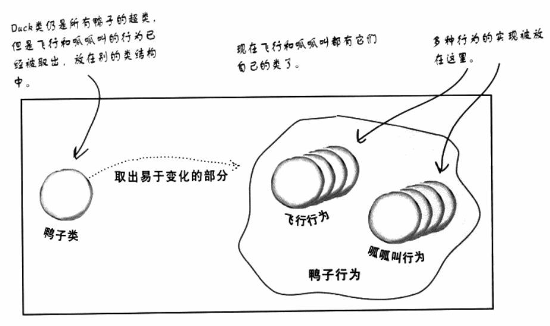
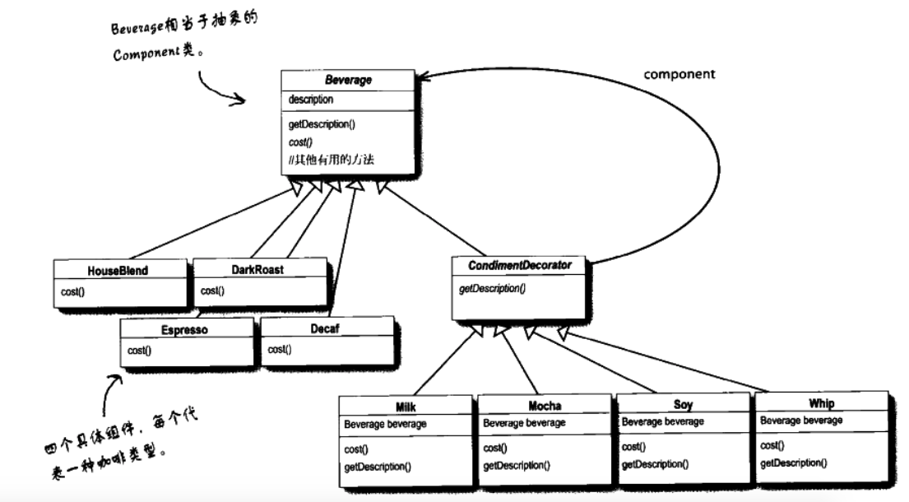

# 设计模式

设计原则

1. 把需要变化的代码从稳定的代码中抽离出，并封装起来，以便以后可以轻易地改动或扩充。
2. 针对接口编程，而不是针对实现编程
3. 多用组合，少用继承
4. 为了交互对象之间的松耦合设计而努力
5. 类应该对扩展开放，对修改关闭。（但每个地方都采用开放-关闭原则，则是一种浪费，也没必要，会导致代码变得复杂且难以理解。）
6. 要依赖抽象，不要依赖具体类
7. 最少知识(Least Knowledge)原则：只和你的密友谈话。
8. 好莱坞原则：别调用我们，我们会调用你。高层组件调用低层组件，低层组件不调用高层组件。
9. 一个类应该只有一个引起变化的原因

## 策略模式 Strategy Pattern

定义了算法族（通过接口），分别封装起来，让他们之间可以相互替换，此模式让算法的变化独立于使用算法的客户。

我们利用接口代表每个行为，如，FlyBehavior，这组类被称为“行为类”。

“针对接口编程”真正的意思是“针对超类型(supertype)”编程。




```java
class Duck {
    FlyBehavior flyBehavior; // FlyBehavior是接口，将行为抽出来

    performFly() {
        flyBehavior.fly(); // 委托给行为类
    }
    swim();
    display();
}

class FlyNoway implements FlyBehavior {
    fly() {
        // fly
    }
}
```

## 观察者模式

Subject(主题) + Observer(观察者)

主题是拥有数据的对象，观察者是使用数据的对象。一个主题对应多个观察者。当数据有关变化时，主题将通知观察者们。任何时候都可以增加新的观察者，因为主题唯一依赖的是一个实现Observer接口的对象列表。

主题有观察者列表，观察者有主题的引用（用来加入和退出主题）。

```java
interface Subject {
    void registerObserver(Observer o);
    void removeObserver(Observer o);
    void notifyObservers();
}

interface Observer {
    void update(...);
}

class ConcreteSubject implements Subject {
    private List<Observer> observers; // 观察者列表
    // 实现方法
}

class ConcreteObserver implements Observer {
    private Subject subject; // 主题的引用
    public ConcreteObserver(Subject subject) {
        this.subject = subject;
    }
}

// java内置的主题和观察者
java.util.Observer // 观察者
java.util.Observable // 主题（是个类）
```

## 装饰者模式

- 装饰者和被装饰对象有相同的超类型
- 可以用一个或多个装饰者包装一个对象
- 因为有相同的超类型，可以用装饰过的对象代替原始对象（被装饰的对象）
- 装饰者可以在所委托被装饰者的行为之前/之后，加上自己的行为，达到特定的目的。
- 对象可以在任何时候被装饰。

装饰者可以扩展基础对象的行为。

```java
abstract class ComponentBase {}
class Component extends ComponentBase {
    method() {}
}
abstract class DecoratorBase extends ComponentBase {
}
class Decorator extends DecoratorBase {
    Component component;

    newMethod() {
        component.method();
        // something new
    }
}
```

java.io类中有很多装饰者模式，如

抽象组件： InputStream
组件：
FileInputStream --> BufferedInputStream --> LineNumberInputStream

类结构

```
      超类（抽象类） --- 保证装饰者和被装饰者是同一类型
 |                 | 
组件          装饰者类（抽象类）
             |     |     |
        装饰者1   装饰者2   装饰者3

如
  ----------------- InputStream -----------------
 |                 |                             | 
FileInputStream  StringBufferInputStream      -- FilterInputStream --
                                             |                       | 
                                             BUfferedInputStream   LineNumberInputStream
```

装饰者在组件的基础上增强，装饰者有组件的引用。



使用场景：二次开发时，无法获取到源码，无法继承时，需要对象的方法进行增强。

弊端：方法过多时，冗余

## 工厂模式

1. 简单工厂模式

将创建对象的任务，放在一个类的某个方法（通常是静态方法）里。

```java
class PizzaStore {
    public Pizza orderPizza(String type) {
        Pizza pizza = PizzaFactory.createPizza(type);
    }
}
```

2. 工厂方法模式

父类是抽象类，让子类继承后，自定义要创建的实例。把产品的生产和使用分离开。

工厂方法模式(Factory Method Pattern)通过让子类决定该创建的对象是什么，来达到将对象创建的过程封装的目的。工厂方法让类把实例化推迟到子类。

```java
abstract class Creator{
    abstract Product factoryMethod(String param){}
    void anOperation(){
        Product product = factoryMethod("param"); // 使用创出的对象
    }
}
// 子类决定如何创造 Product 对象
class ConcreteCreator extends Creator{
    Product factoryMethod(String param){
        // 实际制造出产品
        Product product = new MyProduct();
        return product;
    }
}
```

依赖倒置原则：不能让高层组件依赖低层组件。两者都应依赖抽象。

3. 抽象工厂模式

定义：提供一个接口，用于创建一组产品。

```java
interface AbstractFactory {
    createProductA();
    createProductB();
}
class ConcreteFactory1 implements AbstractFactory {
    // 实现 2 个方法
}
class ConcreteFactory2 implements AbstractFactory {
    // 实现 2 个方法
}
class Client {
    AbstractFactory factory;
    someMethod() {
        createProductA();
        createProductB(); // 不需要关注使用的是哪个工厂
    }
}
```

## 单例模式 Singleton Pattern

定义：确保一个类只有一个实例，并提供一个全局访问点。

```java
public class Singleton {
    private static Singleton uniqueInstance;
    private Singleton(){}
    public static Singleton getInstance(){
        if(uniqueInstance == null)
            uniqueInstance = new Singleton();
        return uniqueInstance;
    }
}
```

但多线程的时候，可能会产生多个实例。

加 sychronized 关键字，又会降低性能，且只有在第一次创建实例的时候，才需要同步。解决方法如下

1. 性能问题影响不大，就使用 sychronized 关键字
2. 提前创建实例 `private static Singleton uniqueInstance = new Singleton();`
3. 利用“双重检查加锁”

```java
// 双重检查加锁
public class Singleton {
    private volatile static Singleton uniqueInstance; // volatile确保当实例被创建时，多个线程能正确获得uniqueInstance的状态。
    private Singleton(){}
    public static Singleton getInstance(){
        if(uniqueInstance == null){
            synchronized (Singleton.class){
                if(uniqueInstance == null)
                    uniqueInstance = new Singleton();
            }
        }
        return uniqueInstance;
    }
}
```

## 命令模式

将请求方和响应方，用一个命令对象分隔开。命令对象的方法，封装了为了完成请求，响应方应该做的事情。

使用场景：

1. 请求对应的响应是固定的，每个相同的请求，都对应相同的响应。
2. 线程池，将命令对象存在队列中，取出一个，执行一个。
3. 系统恢复，将执行过的命令记录在日志中，系统死机后，可以依次执行，恢复系统状态。

定义：将“请求”封装成对象，以便使用不同的请求、队列或者日志来参数化其他对象。命令模式也支持可撤销的操作。

```java
public interface Command {
    void execute();
    void undo(); // 恢复执行execute前的状态
}

public class ConcreteCommand implements Command {
    Receiver receiver; // 响应方
    public ConcreteCommand(Receiver receiver){
        this.receiver = receiver;
    }
    public void execute() {
        receiver.action(); // 响应方执行的动作
    }
}

public class Receiver {
    public void action(){}
}

class Invoker {
    Command command;

    public void setCommand(Command command) {
        this.command = command;
    }

    public void buttonWasPressed() { // 命令的触发条件
        command.execute(); // 执行命令
    }
}

class Test {
    public static void main(String[] args) {
        Invoker invoker = new Invoker();
        Receiver receiver = new Receiver();
        Command command = new ConcreteCommand(receiver);
        invoker.setCommand(command)
        invoker.buttonWasPressed(); // 执行命令
    }
}
```

## 适配器模式

将一个类的接口，转换成客户期望的另一个接口。适配器让原本接口不兼容的类可以合作无间。

需要功能A，功能A是由接口B定义。则类C需要实现接口B，并持有类D（需要被适配的类）的对象。

```java
class Client{
    Target target; // 需要使用到的功能
}
interface Target {
    request(); // 想要的功能
}
// 对象适配器，采用组合的方式
class Adapter1 implements Target {
    Adaptee adaptee; // 需要被适配的类
    request(){
        adaptee.action();
    }
}
class Adaptee{ // 需要被适配的类
    action(){}
}
// 类适配器，采用多继承的方式
class Adapter2 extends Adaptee implements Target {
    request(){
        action();
    }
}
```

## 外观模式 Facade Pattern

外观模式不改变接口，而是提供更简化的接口，隐藏复杂的实现细节。如果需要，仍可以使用复杂的接口。

定义：提供一个统一的接口，用来访问子系统中的一群接口。外观定义了一个高级接口，让子系统更容易使用。

提供简化的接口，将客户从组件的子系统中解耦。可以为一个子系统提供多个外观。

```java
class Facade {
    ClassOne one; // 需要简化的接口
    ClassTwo two;

    void Facade(ClassOne one, ClassTwo two) {
        this.one = one;
        this.two = two;
    }
    
    simplifyMethod() {
        one.something();
        two.something();
    }
}
```

## 模板方法模式

模板方法定义了一个算法的步骤，并允许子类为一个或多个步骤提供实现。

即，提取出多个类的共性，形成抽象类。抽象类中的抽象方法，在各个子类中定义。可以将子类的行为更规范化。

定义：在一个方法中定义一个算法的骨架，而将一些步骤延迟到子类中。模板方法使得子类可以在不改变算法结构的情况下，重新定义算法中的某些步骤。

```java
abstract class AbstractClass {
    final void templateMethod(){
        primitiveOperation1();
        primitiveOperation2();
        concreteOperation();
        if(hook()){
            // doSomthing
        }
    }
    // 子类必须实现的方法
    abstract void primitiveOperation1();
    abstract void primitiveOperation2();
    void concreteOperation(){}
    // 默认不做事的方法，子类覆写后，可以用来控制模板方法
    // 可选的话，使用钩子
    boolean hook(){
        return true;
    }
}
class ConcreteClass extends AbstractClass {
    
}
```

## 迭代器模式 Iterator Pattern

定义：提供一种方法顺序访问一个聚合对象中的各个元素，而又不暴露其内部的表示。

```java
interface Aggregate {
    createIterator()
}
class ConcreteAggregate implements Aggregate {
    createIterator()
}
interface Iterator {
    hasNext();
    next();
    remove();
}
class ConcreteIterator implements Iterator {
}
```

## 组合模式

定于：允许将对象组合成树形结构来表现“整体/部分”层次结构。组合能让客户以一致的方式处理个别对象以及对象组合。

```java
abstract class Component {
    operation()
    add(Component)
    remove(Component)
    getChild(int)
}
class Leaf extends Component {}
class Composite extends Component {}
```

## 状态模式

定义：允许对象在内部状态改变时，改变它的行为，对象看起来好像修改了它的类。

我的理解：一个对象有很多种状态和固定的动作，将每个状态封装成一个类，状态在动作下可能发生的变化写成类的方法。

```java
class Context {
    State state;
    request(){
        state.handle();
    }
}
interface State {
    handle()
}
class ConcreteStateA implements State {
    handle(){}
}
class ConcreteStateB implements State {
    handle(){}
}
```

## 代理模式

定义：为另一个对象提供一个替身或占位符以控制对这个对象的访问

1. 远程代理：管理客户和远程对象之间的交互。参考笔记“Java基础”里的RMI部分
2. 虚拟代理：作为创建开销大的对象的代表。虚拟代理直到我们真正需要一个对象的时候才创建它。
3. 保护代理：基于调用者控制对对象方法的访问

使用代理模式创建代表(representative)对象，让代表对象控制某对象的访问，被代理的对象可以是远程的对象，创建开销大的对象或需要安全控制的对象。

```java
interface Subject {
    request()
}
class RealSubject implements Subject {
    request()
}
class Proxy implements Subject {
    RealSubject subject;
    request(){
        subject.request();
    }
}
```

动态代理

参考笔记“Java基础”里的Proxy类

```java
interface Subject {
    request()
}
class RealSubject implements Subject {
    request()
}
class Proxy implements Subject {
    InvocationHandler handler;
    request(){
        handler.invoke();
    }
}
class InvocationHandler implements InvocationHandler {
    RealSubject subject;
    invoke(){
        subject.request();
    }
}
interface InvocationHandler {
    invoke();
}
```

## 复合模式 Compound Pattern

定义：结合两个或两个以上的模式，组成一个解决方案，解决一再发生的一般性问题。

MVC模式

- 视图：用来呈现模型。视图通常直接从模型中取得它需要显示的状态与数据
- 控制器：取得用户输入，并解读其对模型的意思
- 模型：持有所有的数据、状态、程序逻辑。模型没有注意到视图和控制器，虽然它提供了操纵和检索状态的接口，并发送状态改变通知给观察者。

使用到的模式

1. 观察者模式：模式是主题(or可观察者)，视图、控制器是观察者
2. 策略模式：视图可以使用控制器提供的不同策略
3. 组合模式：视图内部管理组件，使用的是组合模式（Swing）

## 模式

根据模式的目标分成三个不同的类目

1. 创建型：涉及到将对象实例化，这类模式都提供一个方法，将客户从所需要实例化的对象中解耦。
    - 抽象工厂 Abstract Factory
    - 工厂方法 Factory Method
    - 单例 Singleton
    - Builder
    - Prototype
2. 行为型：涉及到类和对象如何交互及分配职责。
    - 状态 State
    - 观察者 Observer
    - 策略 Strategy
    - 迭代器 Iterator
    - 模板方法 Template Method
    - Visitor
    - Mediator
    - 命令 Command
    - Memento
    - Interpreter
    - Chain of Responsibility
3. 结构型：可以让你把类或对象组合到更大的结构中。
    - 装饰者 Decorator
    - 组合 Composite
    - 适配器 Adapter
    - 代理 Proxy
    - 外观 Facade
    - Flyweight
    - Bridge

模式所处理的是类或对象

1. 类模式：描述类之间的关系如何通过继承定义。类模式的关系是在编译时建立的。
2. 对象模式：描述对象之间的关系，而且主要是利用组合定义。对象模式的关系通常在运行时建立，而且更动态、更有弹性。

反模式

定义：告诉你如何采用一个不好的解决方法解决一个问题，从而避免使用该解决方案。

其他模式

- 桥接 Bridge Pattern：不只改变你的实现，也改变你的抽象。
- 生成器模式 Builder Pattern：
- 责任链
- 蝇量 Flyweight：让某个类的一个实例能用来提供许多“虚拟实例”。
- 解释器模式 Interpreter
- 中介者 Mediator
- 原型 Prototype

## 值得看的资料

书

Design Patterns: Elements of Reusable Object-Oriented Software

The timeless way of building

a Pattern language

网站

[the portland patterns repository](http://c2.com/cgi/wiki?WelcomeVisitors)

[the hillside group](http://hillside.net)

会议和研讨会

OOPSLA


## 参考资料

《Head First 设计模式》